## [purpose](https://github.com/Shinichi0713/LLM-fundamental-study)

this site exists to study LLM and technic of VLM.


## Related Repositories

Code is stored next URL:

[Shinichi0713/LLM-fundamental-study: this site is the fundamental page of LLM-mechanism](https://github.com/Shinichi0713/LLM-fundamental-study)

On the other hand, I have Reinforcement-Learning repository also.

[Shinichi0713/Reinforce-Learning-Study](https://github.com/Shinichi0713/Reinforce-Learning-Study)

## My Work
The author is currently authoring a comprehensive book on LLMs. It is designed to guide readers through the process of building an LLM from the ground up, enabling them to master the underlying technologies of today's language models. This is a must-read for anyone serious about learning the inner workings of LLMs.


[大規模言語モデルが言葉を紡ぐ理屈読本: Pythonで動かして体験して学ぶ](https://www.amazon.co.jp/dp/B0GD96KJWG)

## site map

1. Roadmap of LLM
   [indicate Roadmap of LLM](https://github.com/Shinichi0713/LLM-fundamental-study/blob/main/docs/roadmap_llm.md)
2. Roadmap of VLM
   [indicate Roadmap of VLM](https://github.com/Shinichi0713/LLM-fundamental-study/blob/main/docs/roadmap_vlm.md)
3. Sparce Attention
   [Explanation of Sparce Attention](https://github.com/Shinichi0713/LLM-fundamental-study/blob/main/docs/sparce_attention.md)

# Archives

## Basic of understanding LLM

the essence of basic of neuralnetwork is described below page.

the description:

- activate function
- graph theorem
- optimization
- stability method of training


The result of investigateing is showed on below link.

[Basic of understanding LLM](https://github.com/Shinichi0713/LLM-fundamental-study/blob/main/basics_nn/basic_readme.md)

## Time Series Neural Networks

Handling Sequential Data and Word Relationships
To process textual data, it's crucial to be able to handle sequential data. Furthermore, understanding the relationships between words within a sentence is also essential.

In this context, we will be focusing on neural networks designed to address these challenges.

### Summary of Challenges in Conventional Models for Text Processing

| Feature                          | RNN / LSTM                                          | CNN                                         | Transformer (LLM)                                                               |
| :------------------------------- | :-------------------------------------------------- | :------------------------------------------ | :------------------------------------------------------------------------------ |
| **Computational Process**  | **Sequential (Slow, No Parallelization)**     | Parallelizable                              | **Ultra-Parallel (High Speed)**                                           |
| **Information Handling**   | Compresses all past information into a single point | Local (Within a fixed window only)          | **Self-Attention (Directly calculates relationships between all tokens)** |
| **Long-Term Dependency**   | Poor (Vanishing Gradient)                           | Poor (Requires extremely deep layers)       | **Excellent (Consistent regardless of distance)**                         |
| **Positional Information** | Implicitly maintained through sequential processing | Often lost with Pooling                     | **Explicitly defined with Positional Encoding**                           |
| **Scalability**            | Difficult                                           | Possible, but unsuitable for language tasks | **Extremely Easy (Laws of Scaling)**                                      |

[Sequential Neural Network](https://github.com/Shinichi0713/LLM-fundamental-study/blob/main/sequential_nn/README.md)

## LayerNorm Work

**Layer Normalization (LayerNorm)** helps stabilize neural network training by normalizing each layer’s activations per sample (not across the batch).

For an input vector $x$, it normalizes using:

$$
\text{LayerNorm}(x_i) = \gamma \frac{(x_i - \mu)}{\sigma + \epsilon} + \beta
$$

where $\mu$ and $\sigma$ are the mean and standard deviation of $x$, and $\gamma, \beta$ are learnable parameters.

**Why it stabilizes training:**

1. Keeps activations at a consistent scale → prevents exploding/vanishing gradients.
2. Maintains stable feature distributions across layers → smoother convergence.
3. Independent of batch size → works well with RNNs and Transformers.

**In short:**

LayerNorm acts like a “temperature regulator” for each layer, ensuring that signals remain well-scaled and learning stays stable and efficient.

LayerNorm is learnable layer.

Visualize the distribution of output changed by learning.


## Attention Mechanizm

### meaning

The **Q (Query)**, **K (Key)**, and **V (Value)** in the Attention mechanism are often compared to **"searching in a library"** or **"searching for a video on YouTube."**
This system is designed to efficiently extract "the most contextually relevant information" from a vast amount of data. Here is a beginner-friendly breakdown of each role.

__1. Analogizing with a Search System__

Imagine you are looking for a video on YouTube:

* **Query (Q): "The keywords you just typed into the search bar."**
* *Example:* "How to cook delicious curry."
* *Role:* This is exactly what you "want to know" or "are looking for" right now.
* **Key (K): "The titles and tags of the videos."**
* *Example:* "Ultimate Curry from Spices," "Quick 5-Minute Curry Recipe."
* *Role:* These are the "labels or indices" used to match against the Query. They are used to measure how well a video matches your Query.
* **Value (V): "The video file itself (the content)."**
* *Role:* This is the "actual information" you want to obtain in the end.

__2. How it Works within LLM Calculations__

In actual implementation code, these three components are processed through the following steps:

1. **Measuring Similarity between Q and K (Score Calculation)**
   The system calculates how deeply the "current word (Q)" is related to the surrounding "words (K)."

* *Example:* For the word "I (Q)," which of the surrounding words—"school," "to," or "go"—is the most important?

2. **Determining the Weights (Attention Degrees)**
   A higher score (weight) is assigned to the words where Q and K have high compatibility.
3. **Gathering V using Weighted Averaging**
   The system collects more "information (V)" from words that have high weights.

* *Result:* The vector for the word "I" is strongly mixed with the information of the action "go."

### Caluculation Method

By taking the inner product between each Query and Key, we compute the relevance scores:

$$
\text{score}(Q, K) = Q K^\top
$$

→ This produces a score matrix indicating  **how much each word attends to every other word** .

(The shape is ( n \times n ))

### Scaling and Softmax Normalization

The scores are then normalized into a probability distribution as follows:

$$
\text{Attention Weights} = \text{softmax}\left(\frac{QK^\top}{\sqrt{d_k}}\right)
$$

Dividing by ( \sqrt{d_k} ) prevents the inner product values from becoming too large,

which helps stabilize the gradients during training.


### Multi-Head attention

Here are the key characteristics of Multi-Head Attention:

- Multiple Perspectives (多様な視点): It's like having multiple specialized "heads" (attention mechanisms) analyzing the same input at the same time.
- Diverse Relationships (多様な関係性): Each head learns to focus on different types of relationships or patterns between words. For instance, one might focus on a verb and its subject, while another captures a pronoun's reference to a distant noun.
- Richer Understanding (より豊かな理解): By combining the insights from all the heads, the model gets a deeper, more nuanced, and richer understanding of the input data.
  Parallel Processing (並列処理): These attention calculations happen in parallel, making the process efficient.
- Enhanced Expressiveness (表現力の向上): This mechanism allows the model to capture complex information from the entire input sequence, which improves its overall ability to handle language tasks.

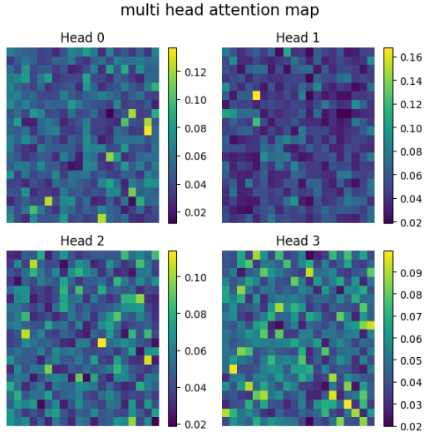

### Local Attention

Each token only attends to tokens within a**fixed, adjacent window** around itself. This mimics locality bias in CNNs.

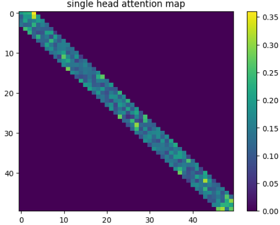

### Global Attention

at the conceptual level, the CLS-token-based global attention in Vision Transformers (ViT) can be understood as playing the same functional role as Global Attention in Sparse Attention models.
However, they differ in purpose, design, and implementation.

CLS Token in ViT as Global Attention

In Vision Transformers:

```
[CLS] → [Patch₁, Patch₂, ..., Patchₙ]
```

- The CLS token attends to all image patches
- It aggregates global visual information
- The final CLS representation is used for classification or downstream tasks

From a functional perspective, the CLS token behaves as a global attention node.

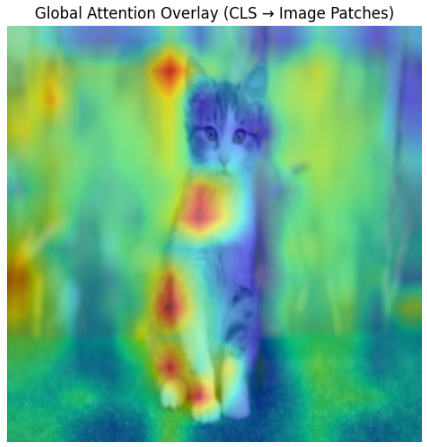

### Local + GLobal Attention

I implemented this using Global + Local attention.While using Local Attention only yielded the previously mentioned result (referring to limited context), incorporating Global Attention allows attention to cover the entire sequence as shown below.This method, adopted by Big Bird (Big Bird: Transformers for Longer Sequences), is an approach that achieves both high computational speed (linear, $O(n)$ complexity) and strong performance.

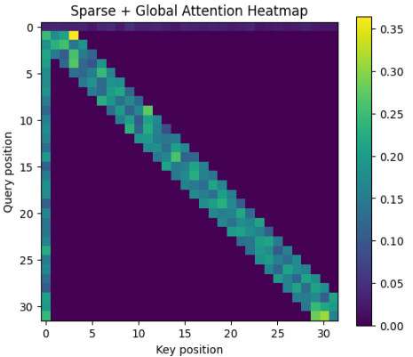

### attention of token toward the others

* The **i-th row** of the attention matrix shows  *“when the query is token i, which keys (tokens) it pays attention to (assigns weight to)”* .
* Main patterns:

  * **Diagonal dominance** — the token mainly attends to itself or nearby tokens → local processing (common in language models)
  * **Focus on CLS / [EOS]** — capturing overall sentence context or summary (typical in classification tasks)
  * **Attention following phrase structure** — e.g., verbs strongly attending to their objects, adjectives attending to the nouns they modify (semantic relationships)
  * **Specialization across heads** — some heads focus on local relationships, while others capture long-range dependencies


### Flash Attention

Tiling: It breaks the large Attention matrix into small blocks (tiles) that fit into the SRAM. It processes these blocks one by one, avoiding the need to store a massive $N \times N$ matrix in the VRAM.Online Softmax: It uses the statistics (M and L we discussed earlier) to calculate Softmax incrementally. This allows the algorithm to combine results from different tiles accurately without seeing the whole row at once.Recomputation: During the backward pass (training), it doesn't store the large attention matrix. Instead, it re-calculates it on the fly. Surprisingly, re-calculating is faster than reading the data back from the slow HBM.

1. The Memory-Saving Trick

Avoiding $O(N^2)$ MatricesIn standard Attention mechanisms, executing torch.matmul(Q, K.T) immediately allocates a massive amount of memory to store the score matrix. For a sequence length $N$, this requires an $N \times N$ matrix. As $N$ grows (e.g., to 100k tokens), this quadratic memory requirement quickly exceeds the capacity of even the most powerful GPUs.

2. Online Softmax: The "Rescaling" Strategy

A standard Softmax requires the "sum of all elements" for the denominator. However, with tiling, the model cannot see the entire row at once.

The Strategy: This implementation uses a mathematical "correction" technique. It calculates a "provisional" Softmax based on the maximum value found in the current local block. If a larger maximum value appears in a subsequent block, the algorithm uses a scaling factor (alpha) to exponentially downscale the previous results. This allows the blocks to be merged seamlessly as if the entire row had been calculated at once.

3. Reordering of Computations (Kernel Fusion)

The standard sequence is: "Calculate all Softmax scores for the entire row, then multiply by $V$." This requires writing the large $N \times N$ matrix to the High Bandwidth Memory (HBM) and then reading it back again.

- The Flash Approach: Flash Attention changes the order to interleave the Softmax calculation and the multiplication with $V$ within the same block.
- The Result: By fusing these operations, the intermediate attention scores never need to be written to the slow HBM. Everything stays within the ultra-fast SRAM (the GPU's internal cache), drastically reducing the "Memory Wall" bottleneck.

| Feature                       | Standard Attention           | Flash Attention                                  |
| ----------------------------- | ---------------------------- | ------------------------------------------------ |
| **Memory Complexity**   | Quadratic                    | **Linear **                                      |
| **HBM Access**          | High (Reads/Writes  matrix)  | **Low (Reads/Writes only final output)**   |
| **Softmax Calculation** | One-shot (requires full row) | **Online (block-by-block with rescaling)** |
| **Main Bottleneck**     | Memory Capacity (VRAM)       | **Compute Bound (ALU utilization)**        |

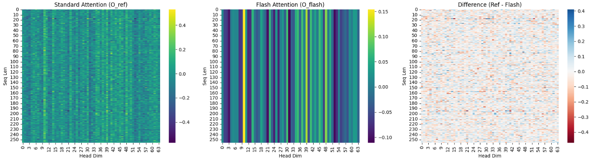

## Tokenizer

In this experiment, we used **SentencePiece** to train a tokenizer for Japanese text segmentation using the  **Livedoor News Corpus** .

**Output Results:**

Before training, every character was treated as a separate token.

```
🔹 Before Training (Character-level segmentation):
['私', 'は', '自', '然', '言', '語', '処', '理', 'を', '勉', '強', 'し', 'て', 'い', 'ま', 'す', '。']

['そ', 'の', 'ソ', 'フ', 'ト', 'ウ', 'ェ', 'ア', 'は', '多', 'く', 'の', 'ユ', 'ー', 'ザ', 'ー', 'か', 'ら', '賛', '同', 'を', '得', 'て', 'い', 'る', '。']
```

After training, the SentencePiece model produced the following segmentation results.
It learned that words like **“して” (shite)** and **“から” (kara)** should be kept together as single tokens.

However, terms like **“自然言語解析” (natural language analysis)** and **“ソフトウェア” (software)** were still split into multiple parts.
This is likely because such words appeared less frequently in the Livedoor dataset.

With a larger training corpus, we expect the model to recognize compound words like “自然言語解析” and “ソフトウェア” as unified tokens.

```
🔹 After Training (SentencePiece segmentation):
['▁', '私', 'は', '自', '然', '言', '語', '処', '理', 'を', '勉', '強', 'して', 'い', 'ます', '。']
['▁', 'その', 'ソ', 'フ', 'ト', 'ウ', 'ェ', 'ア', 'は', '多', 'く', 'の', 'ユ', 'ー', 'ザ', 'ー', 'から', '賛', '同', 'を', '得', 'ている', '。']
```

### sentence distribution

with using sentence bert, we can visualize sentence meaning visualization.
below is one example.

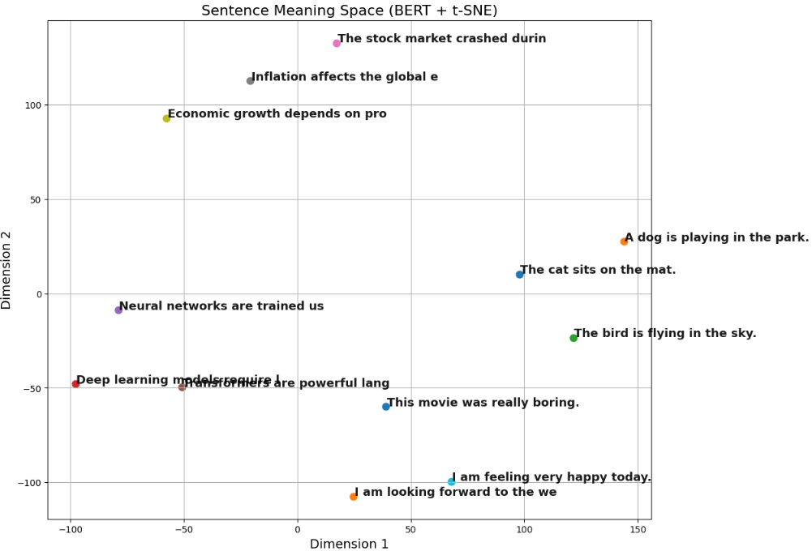

## Positional Encoding

### Absolute PE

Positional encoding serves the role of capturing positional relationships in language.

The logic is to generate sine and cosine waves with different frequencies depending on the embedding dimension, allowing the model to recognize both short-range and long-range dependencies through the wave values.

I implemented positional encoding in PyTorch and visualized the wave patterns according to the position and dimension.

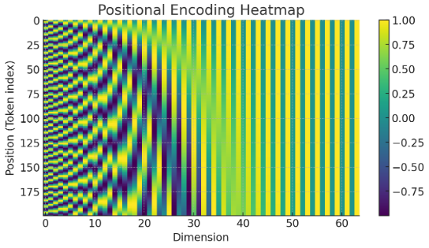

### relative PE

Relative positional encoding teaches an AI model the positional relationships between tokens in a sentence.

One of its main characteristics is that it maintains stable performance even when sentence length varies.

In implementation, markers representing positional information are embedded inside the attention mechanism, so that this information is incorporated when the embedding vectors are processed.

Below figure the work of relative positional information.


After learning relation with using dataset, visualize the weight of head of relative, horizontal axis means the distance of token.

With this result, with using relative pe, basically, attention focus on nearside tokens. And the farer, attention become less focus.

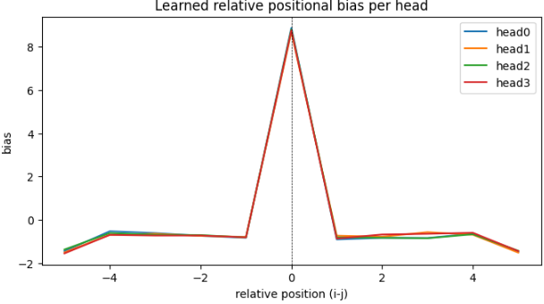

### RoPE

with using RoPE, show transition of the attention score.

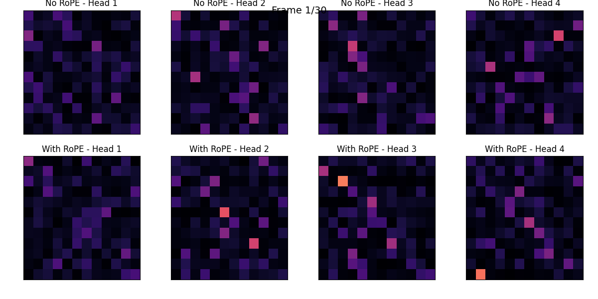

I compared Absolute Positional Encoding (PE) and Rotary Position Embedding (RoPE).

While Absolute PE explicitly encodes the position of each token within a sentence, RoPE naturally incorporates the **relative distance between tokens** into the Attention computation.

I visualized the positional embeddings (PE) of each token for both methods.

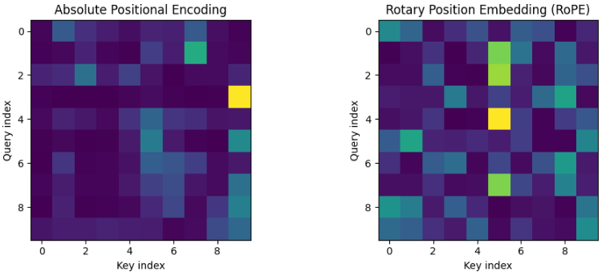

## Inner Features

with VLM-Lens, we analysis the inner feature.

visualize as heat map.


### NewArchitecture

Now thinking new architecture.

Key feature is next.

- PE is used RoPE.
- Attention is Hybrid Attention.
- Normalize is LayerNorm.

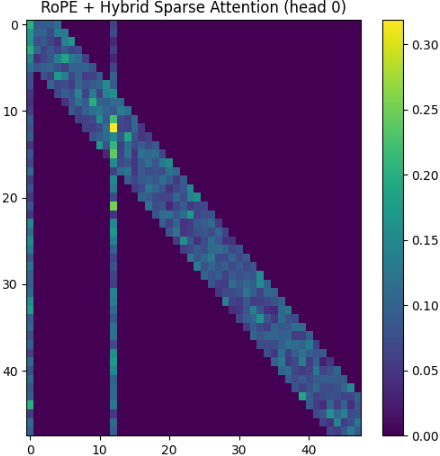

### ModernBert

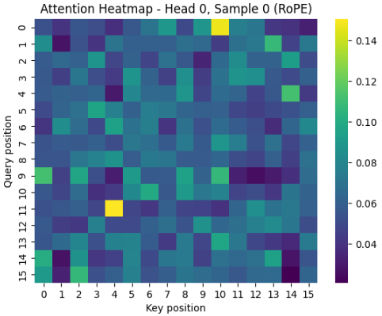

I performed MLM (Masked Language Modeling) with Modern-BERT on a small language dataset. After that, I visualized the attention scores.

## ViT

First, enact Patching toward original image.


the prediction of trained ViT.

ViT is trained with the dataset "CIFAR-10".


## tuning of LLM

investigate how to tune LLM.
summary is descripted as below.

mainly, intent to use these knowledge to train LLM, which generate sentence.


overview:
[what is fine tuning?](https://shinichi0713.github.io/LLM-fundamental-study/docs/11-fine-tuning)

PEFT:
[retain-cost-fine-tuning](https://shinichi0713.github.io/LLM-fundamental-study/docs/12-retain-cost-fine-tuning)

LLM-learning:
[efficiently train llm](https://shinichi0713.github.io/LLM-fundamental-study/docs/13-LLM-learning)

## AI tools

The following section covers key metrics and essential tools for efficient AI development.


[AI tools](https://shinichi0713.github.io/LLM-fundamental-study/evaluate_method)

### monitor NN parameter

To monitor neural network training effectively, analyzing the distribution of parameters like weights and gradients is crucial for diagnosing "black box" behavior. By using tools like TensorBoard to visualize histograms, developers can detect critical issues such as vanishing or exploding gradients and identify whether the model is healthily adapting to data. Healthy training typically shows a rigid initial distribution evolving into a smooth normal distribution, whereas abnormal shapes signal the need for adjustments in learning rates or initialization. Ultimately, parameter analysis provides the necessary transparency to ensure that a model is not only learning efficiently but also building a reliable logical foundation.


## reference site

#### NLPコロキウム

this site supply LLM researchers insight.
we must study that.
https://www.youtube.com/watch?v=NatwshCTe_4

#### torch environment

at first, check the vesion respondance.
https://pytorch.org/get-started/locally/


## blog

I publish technical articles focused on LLM related technics on my blog. Feel free to visit and have a read.

https://yoshishinnze.hatenablog.com/
