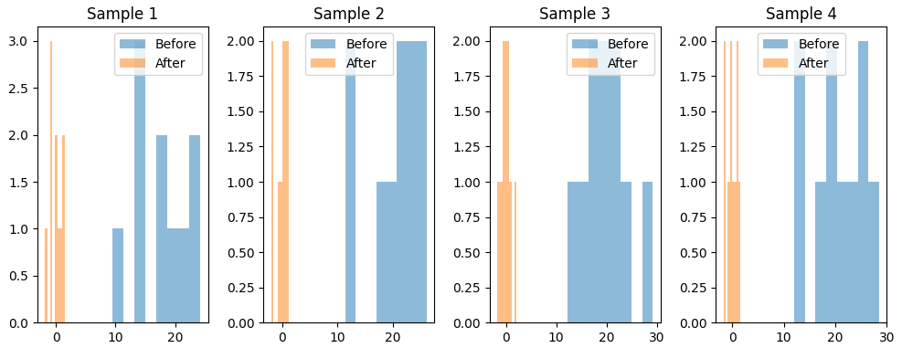

## purpose

this site exists to study LLM and technic of VLM.

# Archives

## LayerNorm Work

**Layer Normalization (LayerNorm)** helps stabilize neural network training by normalizing each layer’s activations per sample (not across the batch).

For an input vector ( x ), it normalizes using:

$$
\text{LayerNorm}(x_i) = \gamma \frac{(x_i - \mu)}{\sigma + \epsilon} + \beta
$$

where $ \mu $ and $ \sigma $ are the mean and standard deviation of $ x $, and $ \gamma, \beta $ are learnable parameters.

**Why it stabilizes training:**

1. Keeps activations at a consistent scale → prevents exploding/vanishing gradients.
2. Maintains stable feature distributions across layers → smoother convergence.
3. Independent of batch size → works well with RNNs and Transformers.

**In short:**

LayerNorm acts like a “temperature regulator” for each layer, ensuring that signals remain well-scaled and learning stays stable and efficient.

## Inner Features

with VLM-Lens, we analysis the inner feature.

visualize as heat map.

## ViT

First, enact Patching toward original image.

the prediction of trained ViT.

ViT is trained with the dataset "CIFAR-10".

## reference site

#### NLPコロキウム

this site supply LLM researchers insight.
we must study that.
https://www.youtube.com/watch?v=NatwshCTe_4

#### torch environment

at first, check the vesion respondance.
https://pytorch.org/get-started/locally/
