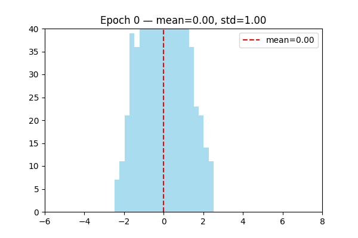
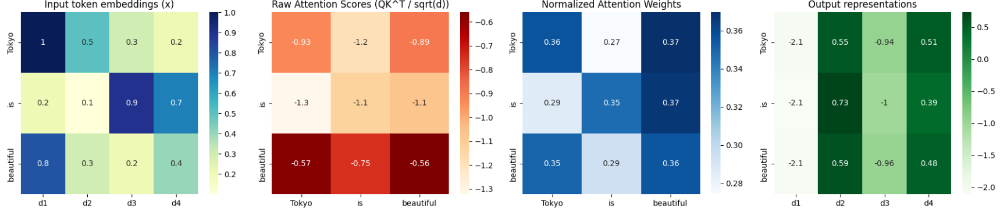
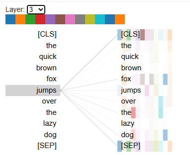
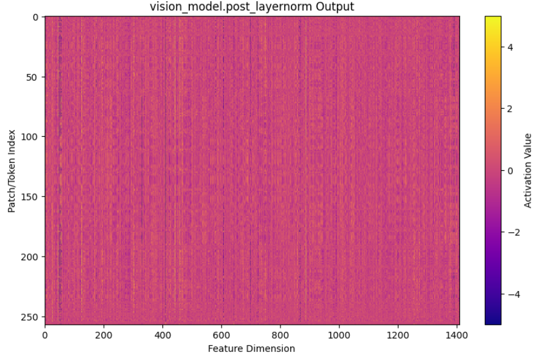
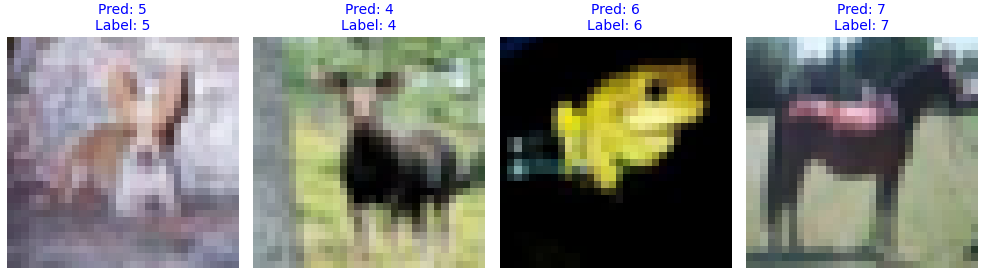

## purpose

this site exists to study LLM and technic of VLM.

# Archives

## LayerNorm Work

**Layer Normalization (LayerNorm)** helps stabilize neural network training by normalizing each layer’s activations per sample (not across the batch).

For an input vector ( x ), it normalizes using:

$$
\text{LayerNorm}(x_i) = \gamma \frac{(x_i - \mu)}{\sigma + \epsilon} + \beta
$$

where $ \mu $ and $ \sigma $ are the mean and standard deviation of $ x $, and $ \gamma, \beta $ are learnable parameters.

**Why it stabilizes training:**

1. Keeps activations at a consistent scale → prevents exploding/vanishing gradients.
2. Maintains stable feature distributions across layers → smoother convergence.
3. Independent of batch size → works well with RNNs and Transformers.

**In short:**

LayerNorm acts like a “temperature regulator” for each layer, ensuring that signals remain well-scaled and learning stays stable and efficient.

LayerNorm is learnable layer.

Visualize the distribution of output changed by learning.

## Annotation Function

By taking the inner product between each Query and Key, we compute the relevance scores:

$$
\text{score}(Q, K) = Q K^\top
$$

→ This produces a score matrix indicating  **how much each word attends to every other word** .

(The shape is ( n \times n ))

### Scaling and Softmax Normalization

The scores are then normalized into a probability distribution as follows:

$$
\text{Attention Weights} = \text{softmax}\left(\frac{QK^\top}{\sqrt{d_k}}\right)
$$

Dividing by ( \sqrt{d_k} ) prevents the inner product values from becoming too large,

which helps stabilize the gradients during training.

### attention of token toward the others

* The **i-th row** of the attention matrix shows  *“when the query is token i, which keys (tokens) it pays attention to (assigns weight to)”* .
* Main patterns:

  * **Diagonal dominance** — the token mainly attends to itself or nearby tokens → local processing (common in language models)
  * **Focus on CLS / [EOS]** — capturing overall sentence context or summary (typical in classification tasks)
  * **Attention following phrase structure** — e.g., verbs strongly attending to their objects, adjectives attending to the nouns they modify (semantic relationships)
  * **Specialization across heads** — some heads focus on local relationships, while others capture long-range dependencies

## Inner Features

with VLM-Lens, we analysis the inner feature.

visualize as heat map.

## ViT

First, enact Patching toward original image.

the prediction of trained ViT.

ViT is trained with the dataset "CIFAR-10".

## reference site

#### NLPコロキウム

this site supply LLM researchers insight.
we must study that.
https://www.youtube.com/watch?v=NatwshCTe_4

#### torch environment

at first, check the vesion respondance.
https://pytorch.org/get-started/locally/
