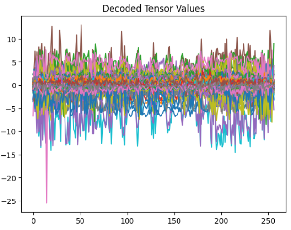

## purpose

this site exists to study LLM and technic of VLM.

# Archives

## Inner Features

with VLM-Lens, we analysis the inner feature.

visualize as heat map.

## reference site

#### NLPコロキウム

this site supply LLM researchers insight.
we must study that.
https://www.youtube.com/watch?v=NatwshCTe_4

#### torch environment

at first, check the vesion respondance.
https://pytorch.org/get-started/locally/
