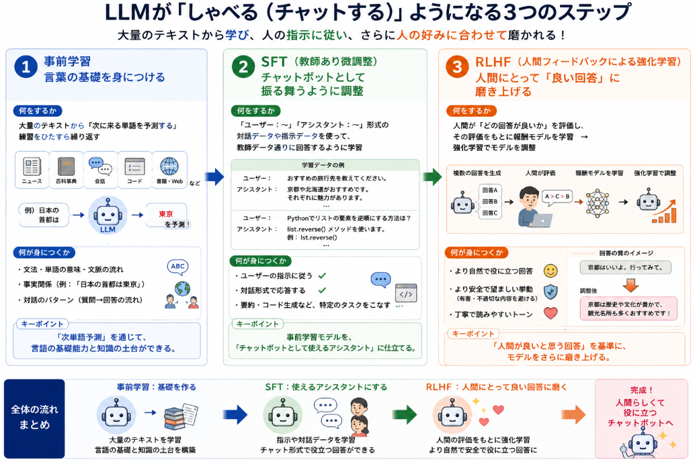

## Chatが出来るようになった理由

ChatGPTが「チャット（対話）」ができるようになった理由は、大きく分けて次の3つです。

### 1. 事前学習で「会話っぽい構造」を大量に学んでいる

- GPT系モデルは、インターネット上の膨大なテキスト（Webページ、書籍、フォーラム、SNS、Q&Aサイトなど）を事前学習しています。
- その中には「質問と回答」「会話のやりとり」「議論の流れ」など、**自然な対話のパターン**が大量に含まれています。
- モデルは「ある文脈が来たときに、次に続く言葉として何が自然か」を確率的に学習しているため、  
  ユーザーの発言に対して「それっぽい続き」を返すことで、結果的にチャットのような応答ができるようになっています。

### 2. 指示追従・対話形式の追加学習（SFT）

- 事前学習だけでは「汎用的な文章生成」はできますが、「ユーザーの指示に従って対話する」という挙動は弱いです。
- ChatGPTでは、**Supervised Fine-Tuning（SFT）** と呼ばれる追加学習で、
  - 「ユーザー：〜」「アシスタント：〜」という形式の対話データ
  - 指示に従って回答する例（例：「要約して」「コードを書いて」など）
  を大量に与え、**「チャットボットとして振る舞う」**ようにモデルを調整しています。
- これにより、単なる文章補完ではなく、「ユーザーの意図をくみ取って返答する」挙動が強く身につきます。

### 3. 人間フィードバックによる強化学習（RLHF）

- ChatGPTでは、**RLHF（Reinforcement Learning from Human Feedback）** という手法も使われています。
- 人間が「どの回答が好ましいか」を評価し、そのフィードバックをもとに強化学習を行うことで、
  - より人間にとって**自然で役に立つ回答**
  - より**対話的に聞こえるトーン**
  を優先して生成するようにモデルが調整されます。
- これにより、「ただ正しいだけでなく、会話として心地よい」応答が増え、チャット体験が向上します。


## 事前学習

GPTの「事前学習（pre-training）」とは、**特定のタスクに縛られず、大量のテキストデータから「言葉の続き方」を統計的に学ぶプロセス**です。  
具体的には、次のようなことを行っています。

実際どのような学習をしているか具体例を示しながら説明していきます。

### 1. 学習データの具体例

GPTは、インターネット上のさまざまなテキストを学習します。たとえば：

__ニュース記事の一部__
```
「昨日、東京で大雨が降りました。その影響で、一部の電車が遅延しました。」
```

__Wikipediaの一文__
```
「Pythonは、1991年にオランダ人のグイド・ヴァンロッサムによって開発されたプログラミング言語である。」
```

__会話ログ（フォーラムやSNS）__
```
ユーザーA「この映画、面白かった？」
ユーザーB「めっちゃ面白かった！ラストが衝撃的だった。」
```

__コードの断片__
```python
def add(a, b):
    return a + b
```

このように、**ニュース・百科事典・会話・コード・小説・レシピ**など、ありとあらゆるテキストが事前学習のデータになります。

### 2. どのように学習しているか（次単語予測）

GPTは、これらのテキストを「トークン」という小さな単位（単語やサブワード）に分割し、  
**「与えられた文脈から、次に来るトークンを予測する」** という問題を解き続けます。

__例：ニュース記事から学習する場合__

元の文：
> 「昨日、東京で大雨が降りました。その影響で、一部の電車が遅延しました。」

モデルには、次のような「穴埋め問題」が次々に出されます。

__ステップ1__
- 入力：`「昨日、東京で`  
- 正解：`大雨`  
- モデルが学ぶこと：「昨日、東京で」という文脈の次には「大雨」が来やすい

__ステップ2__
- 入力：`「昨日、東京で大雨が`  
- 正解：`降り`  
- モデルが学ぶこと：「大雨が」の次には「降り」が来やすい

__ステップ3__
- 入力：`「昨日、東京で大雨が降りました。その`  
- 正解：`影響`  
- モデルが学ぶこと：「その」の次には「影響」が来やすい（文脈が続く）

__ステップ4__
- 入力：`「昨日、東京で大雨が降りました。その影響で、一部の電車が`  
- 正解：`遅延`  
- モデルが学ぶこと：「一部の電車が」の次には「遅延」が来やすい（ニュース的な表現）

このように、**一文まるごとではなく、少しずつ文脈を伸ばしながら「次に来る単語」を予測する練習**を、何十億回も繰り返します。

### 3. 会話データから「対話の流れ」を学ぶ例

会話ログを学習する場合も、同じ「次単語予測」のルールで学びます。

元の会話：
> ユーザーA「この映画、面白かった？」  
> ユーザーB「めっちゃ面白かった！ラストが衝撃的だった。」

__ステップ1__
- 入力：`ユーザーA「この映画、面白かった？」`  
- 正解：`ユーザーB`  
- モデルが学ぶこと：質問の後には「ユーザーB」が続く（対話の構造）

__ステップ2__
- 入力：`ユーザーA「この映画、面白かった？」 ユーザーB「`  
- 正解：`めっちゃ`  
- モデルが学ぶこと：質問に対する肯定的な返答として「めっちゃ」が来やすい

__ステップ3__
- 入力：`ユーザーA「この映画、面白かった？」 ユーザーB「めっちゃ面白かった！`  
- 正解：`ラスト`  
- モデルが学ぶこと：映画の感想では「ラスト」が話題になりやすい

このように、**「質問→返答」という対話の流れそのものも、次単語予測のパターンとして学習**されます。

### 4. コードや専門文書から「専門的な表現」を学ぶ例

コードの断片を学習する場合も、同じルールです。

元のコード：
```python
def add(a, b):
    return a + b
```

__ステップ1__
- 入力：`def add(a, b):`  
- 正解：`return`  
- モデルが学ぶこと：関数定義の後には「return」が来やすい（Pythonの文法）

__ステップ2__
- 入力：`def add(a, b): return`  
- 正解：`a`  
- モデルが学ぶこと：足し算関数では「a + b」というパターンが来やすい

このように、**プログラミング言語の文法や、関数名と処理内容の対応関係**も、「次単語予測」を通じて統計的に学ばれます。

### 5. 事前学習の効果

GPTの事前学習（次単語予測）は、  
  **「文脈から次に来る単語を予測する」**というタスクを通じて、
  - 文法
  - 単語の意味
  - 事実関係
  - 概念の関連性
  - 手順・因果関係  
  といった**知識をパターンとして身につけていく**仕組みです。

__1. なぜ「次単語予測」で知識が身につくのか__

GPTの学習タスクは「次に来る単語を予測する」ことですが、  
**「正しい続きを予測するには、文脈の意味を理解していないと難しい」** という性質があります。

例として、次の文を考えます。

> 「日本の首都は______です。」

ここで「次に来る単語」を予測するには、

- 「日本の首都」＝「東京」という**事実（知識）**
- 「〜は〜です」という**文法パターン**

の両方が必要です。

もしモデルが「日本の首都は大阪です」と予測してしまうと、  
実際のテキストデータ（Wikipediaやニュースなど）では「東京」と書かれていることが多いため、  
**「東京」の方が出現確率が高くなる**ように学習されます。

このように、「次単語予測」を繰り返すうちに、

- 「日本の首都は東京」
- 「Pythonはプログラミング言語」
- 「光の速度は約30万km/s」

といった**事実関係**も、自然と「高確率で続くパターン」としてモデルに埋め込まれていきます。

__2. 知識が「パターン」として蓄積される__

GPTは、知識を「データベース」のように個別に保存しているわけではありません。  
代わりに、**「ある文脈が来たときに、どの単語が高確率で続くか」というパターン**として保持しています。

例1：事実のパターン
- 文脈：「日本の首都は」  
  → 次に来る単語として「東京」の確率が高くなる  
  → 結果的に「日本の首都＝東京」という知識が身につく

例2：概念の関係性
- 文脈：「Pythonは」  
  → 次に来る単語として「プログラミング言語」の確率が高くなる  
  → 「Python＝プログラミング言語」という関係性が身につく

例3：手順・因果関係
- 文脈：「卵を割って、フライパンで」  
  → 次に来る単語として「焼く」「炒める」などの確率が高くなる  
  → 「卵料理の手順」という知識が身につく

このように、**事実・概念・手順・因果関係**などが、  
「文脈→次単語」の確率分布としてモデルの中に蓄積されていきます。

__3. ただし「完璧な知識ベース」ではない__

一方で、GPTの知識には次のような限界もあります。

- **確率に基づく推測**  
  - 「もっともらしい続き」を選ぶので、事実と異なる場合もある（ハルシネーション）
- **学習データに依存**  
  - 学習データに含まれていない最新情報やニッチな知識は持っていない
- **矛盾した情報の混在**  
  - インターネット上には正しい情報も誤情報も混在しているため、モデルも両方を学んでしまう

そのため、GPTは「百科事典のように正確な知識ベース」というより、  
**「大量のテキストから学んだ、確率に基づく知識の集合体」** と考えるのが近いです。


## SFT

SFT（Supervised Fine-Tuning：教師あり微調整）とは、  
**事前学習済みのGPTモデルに対して、「指示に従う」「チャットボットとして振る舞う」といった特定の挙動を、教師データを使って追加で学習させるプロセス**です。

ここでは、

- SFTが何を目的としているか
- どんなデータを使うか（具体例）
- どうやって学習するか（具体例）

の順に説明します。

### 1. SFTの目的：事前学習モデルを「役に立つアシスタント」に仕立てる

- **事前学習**：  
  大量のテキストから「次単語予測」を学び、**汎用的な言語能力**（文法・知識・文脈理解）を身につける。
- **SFT**：  
  そのモデルに、「ユーザーの指示に従って回答する」「対話形式で応答する」といった**特定の振る舞い**を追加で教え込む。

つまり、SFTは「基礎学力はあるが、まだ何でも自由に書くだけのモデル」を、  
**「チャットボットとして使えるアシスタント」**に育てるためのステップです。

### 2. SFTで使うデータの具体例

SFTでは、「入力（プロンプト）」と「望ましい出力（回答）」のペアを大量に用意します。  
形式は主に次のようなものです。

__例1：対話形式（チャットボット用）__

**入力（プロンプト）**
```
ユーザー：PythonでHello Worldを出力するコードを書いてください。
```

**望ましい出力（教師データ）**

アシスタント：以下はPythonで「Hello World」を出力するコードです。

```python
print("Hello World")
```

このコードを実行すると、コンソールに「Hello World」と表示されます。


__例2：指示に従うタスク（要約）__

**入力（プロンプト）**
```
以下の文章を3行で要約してください。

【文章】
昨日、東京で大雨が降りました。その影響で、一部の電車が遅延しました。多くの通勤客が駅に足止めされ、SNSでは「電車が動かない」といった投稿が相次ぎました。気象庁は、今後も注意を呼びかけています。
```

**望ましい出力（教師データ）**
```
アシスタント：東京で大雨が降り、電車が遅延して通勤客に影響が出ました。SNSでは不満の声が相次ぎ、気象庁は今後も注意を呼びかけています。
```

__例3：フォーマット指定（表形式など）__

**入力（プロンプト）**
```
以下の商品リストを表形式で整理してください。

商品名：ノートPC、価格：10万円、在庫：5台
商品名：マウス、価格：3,000円、在庫：20個
商品名：キーボード、価格：5,000円、在庫：15個
```

**望ましい出力（教師データ）**
```
アシスタント：商品リストを表形式で整理しました。

| 商品名   | 価格   | 在庫 |
|----------|--------|------|
| ノートPC | 10万円 | 5台  |
| マウス   | 3,000円| 20個 |
| キーボード| 5,000円| 15個 |
```

このように、**「ユーザーの指示」と「それに対する理想的な回答」のペア**を大量に用意し、モデルに「こういうときはこう答えなさい」と教えます。

### 3. SFTの学習方法（具体例）

SFTでは、事前学習済みモデルに対して、**教師データの「出力部分」を正解として学習**させます。

__学習のイメージ__

- モデルへの入力：  
  `ユーザー：PythonでHello Worldを出力するコードを書いてください。`
- モデルが生成するテキスト（学習前はバラバラ）：
  - 「Pythonはプログラミング言語です。」
  - 「Hello Worldは伝統的な例です。」
  - など、事前学習の延長で自由に文章を続けてしまう。

ここで、教師データの出力：

```
アシスタント：以下はPythonで「Hello World」を出力するコードです。

print("Hello World")

このコードを実行すると、コンソールに「Hello World」と表示されます。
```

を**正解ラベル**として与え、モデルがこのテキストを出力するように**交差エントロピー損失**で最適化します。

つまり、

- 入力：`ユーザー：PythonでHello Worldを出力するコードを書いてください。`
- モデルが出力すべき正解：  
  `アシスタント：以下はPythonで...（教師データの通り）`

という対応を、大量の例で繰り返し学習させます。


### 4. SFTによって何が変わるか（具体例）

__学習前（事前学習だけのモデル）__

- 入力：「PythonでHello Worldを出力するコードを書いてください。」
- 出力例（ありがちな挙動）：
  - 「Pythonは1991年に開発されたプログラミング言語です。Hello Worldは...」（百科事典的な説明）
  - 「PythonでHello Worldを出力するには、print関数を使います。」（中途半端な説明）

→ 事前学習では「次単語予測」が中心なので、**指示に従ってコードを書く**という挙動は弱い。

__学習後（SFT済みモデル）__

- 入力：「PythonでHello Worldを出力するコードを書いてください。」
- 出力例：
  ```
  アシスタント：以下はPythonで「Hello World」を出力するコードです。

  print("Hello World")

  このコードを実行すると、コンソールに「Hello World」と表示されます。
  ```

→ SFTによって、

- 「ユーザーの指示に従う」
- 「アシスタントとして振る舞う」
- 「コードブロックを使う」
- 「説明を添える」

といった**特定の振る舞い**が強く身につきます。

### 5. SFTの評価法

SFTの学習はあくまで模範解答と同一文章を生成したかです。

__1. 学習中の評価：トークンレベルの一致（単語の一致）__

- **評価基準**：  
  教師データの出力テキストを「正解」とし、モデルが出力したテキストと**1単語（トークン）ずつ比較**します。
- **使われる指標**：  
  交差エントロピー損失（Cross-Entropy Loss）
- **挙動**：
  - 教師データと**完全に同じ単語列**を出力すれば損失が小さくなる
  - **単語が1つでも違う**と、その部分にペナルティがかかる
- **特徴**：
  - 「意味が同じかどうか」は見ていない
  - あくまで **「教師データの通りに書けているか」** を評価

__2. 学習後の評価：タスクごとのベンチマーク__

但し同じ文章が生成したかだけではうまくいかないため、人がその後評価して、学習データの調整を行うことになります。

- **目的**：  
  SFTによって「指示に従う」「要約する」「コードを書く」などの**特定の振る舞い**が身についたかを確認する。
- **評価方法の例**：
  - 要約タスク：要約の正確さ・情報の抜け漏れを人間や別のLLMが評価
  - コード生成：コンパイル・実行テストで正しさを確認
  - 対話タスク：ユーザー満足度やタスク達成率を測る
- **特徴**：
  - ここで初めて **「意味・有用性」** が評価される
  - ただし、SFTの学習そのものには直接反映されない（主に検証用）

## RLHF

[RLHF（Reinforcement Learning from Human Feedback：人間フィードバックによる強化学習）](https://yoshishinnze.hatenablog.com/entry/2025/12/31/082922)は、**人間が「どの回答が良いか」を評価し、その評価をもとにモデルを強化学習で調整する手法**です。

ChatGPTなどでは、SFTの後にRLHFを行うことで、

- より人間にとって**自然で役に立つ回答**
- より**安全で望ましい挙動**

を身につけさせています。

RLHFは、大きく次の3ステップで行われます。


### 1. ステップ1：SFT済みモデルを用意する

- まず、**SFT（教師あり微調整）** で、
  - 「ユーザーの指示に従う」
  - 「チャットボットとして振る舞う」
  といった基礎的な挙動を身につけたモデルを用意します。
- このモデルは、**事前学習＋SFT**によって、
  - 文法
  - 知識
  - 指示への基本的な従属性
  は備えていますが、まだ「人間にとって本当に良い回答か」は調整されていません。

### 2. ステップ2：報酬モデル（Reward Model）を学習する

次に、**「どの回答が良いか」を自動で評価するモデル（報酬モデル）** を、人間の評価データから学習します。

__(1) 人間が回答を評価する__

- 同じプロンプトに対して、モデルが複数の回答（例：A, B, C）を生成します。
- 人間がそれらを比較し、
  - 「Aが一番良い」
  - 「Bはまあまあ」
  - 「Cは良くない」
  といった**相対的な評価**を行います。

**例：プロンプト**  
「PythonでHello Worldを出力するコードを書いてください。」

**モデル出力の例**
- A：コード例と簡単な説明を添えた丁寧な回答
- B：コードだけの簡潔な回答
- C：Pythonの歴史の説明だけ（質問に答えていない）

→ 人間は「A > B > C」と評価します。

__(2) 報酬モデルを学習する__

- これらの「プロンプト＋回答＋人間の評価」データを使って、**報酬モデル**を学習します。
- 報酬モデルは、
  - 入力：プロンプトとモデル出力
  - 出力：**報酬スコア（高いほど良い回答）**
  を返すように訓練されます。
- これにより、**人間が評価しなくても「どの回答が良いか」を自動でスコア付けできるモデル**ができます。

### 3. ステップ3：強化学習でモデルを調整する

最後に、報酬モデルを使って、**元のモデル（方策）を強化学習で更新**します。

__(1) 強化学習の設定__

- **環境**：テキスト生成タスク
- **エージェント**：SFT済みモデル（方策）
- **行動**：単語（トークン）を1つずつ生成する
- **報酬**：回答全体に対して報酬モデルが付与するスコア

__(2) 学習の流れ（PPOなどのアルゴリズムを使う）__

1. モデルがプロンプトに対して回答を生成する
2. 報酬モデルがその回答に**報酬スコア**を付ける
3. 強化学習アルゴリズム（例：PPO）が、
   - 報酬が高くなるようにモデルのパラメータを少しずつ更新する
4. これを大量のプロンプト・回答に対して繰り返す

**例：**
- プロンプト：「PythonでHello Worldを出力するコードを書いてください。」
- モデル出力が「コード＋丁寧な説明」になると報酬が高い
- モデル出力が「Pythonの歴史の説明だけ」になると報酬が低い
- → モデルは「コード＋丁寧な説明」を生成する方向に調整される

__(3) 何が変わるか__

- **有用性**：質問にちゃんと答える、役に立つ情報を提供する回答が報酬高→増える
- **安全性**：有害・不適切な回答は報酬低→減る
- **スタイル**：丁寧で読みやすい回答が報酬高→好ましいトーンが身につく

### 4. RLHFの役割まとめ

- **SFT**：  
  - 「指示に従う」「チャットボットとして振る舞う」といった**基礎的な挙動**を身につける
- **RLHF**：  
  - 人間の好み（有用性・安全性・スタイル）を**報酬モデルを通じて学習**し、
  - 強化学習でモデルを調整することで、
    - より**人間にとって良い回答**
    - より**安全で一貫した挙動**
  を実現する

このように、RLHFは「人間が良いと思う回答」を基準にモデルを育てる仕組みであり、ChatGPTが「人間らしくて役に立つ」と感じられる理由の一つになっています。

## 総括

LLMが「しゃべる（チャットする）」ようになるのは、大きく3つのステップで構成されています。

### 1. 事前学習：言葉の基礎を身につける

- **何をするか**  
  大量のテキスト（ニュース・百科事典・会話・コードなど）から、「次に来る単語を予測する」練習をひたすら繰り返す。
- **何が身につくか**  
  - 文法・単語の意味・文脈の流れ
  - 事実関係（例：「日本の首都は東京」）
  - 対話のパターン（質問→回答の流れ）
- **キーポイント**  
  「次単語予測」を通じて、**言語の基礎能力と知識の土台**ができる。

### 2. SFT（教師あり微調整）：チャットボットとして振る舞うように調整

- **何をするか**  
  「ユーザー：〜」「アシスタント：〜」形式の対話データや、指示に従う例を大量に与え、**教師データ通りに回答するように学習**させる。
- **何が身につくか**  
  - ユーザーの指示に従う
  - 対話形式で応答する
  - 要約・コード生成など、特定のタスクをこなす
- **キーポイント**  
  事前学習モデルを、「**チャットボットとして使えるアシスタント**」に仕立てる。

### 3. RLHF（人間フィードバックによる強化学習）：人間にとって「良い回答」に磨き上げる

- **何をするか**  
  人間が「どの回答が良いか」を評価し、その評価をもとに**報酬モデルを学習 → 強化学習でモデルを調整**する。
- **何が身につくか**  
  - より**自然で役に立つ回答**
  - より**安全で望ましい挙動**
  - 丁寧で読みやすいトーン
- **キーポイント**  
  「**人間が良いと思う回答**」を基準に、モデルをさらに磨き上げる。



これ一つ一つが結構な分量のデータを必要とすることになります。
LLMがしゃべるということがこれほどのボリューミーな学習から構成されているということが伝わると幸いです。

