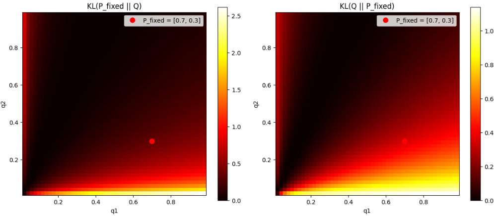

先日のRLHF/DPOの例題の報酬設計時に使った関数で
KLダイバージェンス（Kullback–Leibler divergence）
があります。

教師あり学習を行う場合でも、よく出てくる関数です。

この関数の性質について説明します。

## 数学的な定義
KLダイバージェンスは、2つの確率分布 $P$ と $Q$ の「違い」を測る量です。  
連続確率変数と離散確率変数の場合で定義が少し異なります。


### 1. 離散確率分布の場合

確率変数 $X$ が離散で、とりうる値の集合を $\mathcal{X}$ とします。  
$P$ と $Q$ を $X$ 上の確率分布（確率質量関数）とすると、KLダイバージェンスは

$$
D_{\mathrm{KL}}(P \parallel Q)
= \sum_{x \in \mathcal{X}} P(x) \log \frac{P(x)}{Q(x)}
$$

で定義されます。  
ここで $\log$ は自然対数（底 $e$）を用いるのが一般的です。  
$Q(x)=0$ となる $x$ に対しては $P(x)=0$ でなければ定義されません（$P \ll Q$ のときのみ定義される）。


### 2. 連続確率分布の場合

確率変数 $X$ が連続で、$P$ と $Q$ がそれぞれ確率密度関数 $p(x), q(x)$ を持つとします。  
このとき KLダイバージェンスは

$$
D_{\mathrm{KL}}(P \parallel Q)
= \int_{-\infty}^{\infty} p(x) \log \frac{p(x)}{q(x)} \, dx
$$

で定義されます。  
ここでも $\log$ は自然対数で、$q(x)=0$ となる $x$ に対応する領域では $p(x)=0$ でなければ定義されません（$P \ll Q$ のときのみ定義される）。


### 3. 一般の確率測度の場合

より一般には、$P, Q$ を同じ可測空間上の確率測度とし、$P$ が $Q$ に対して絶対連続（$P \ll Q$）であるとします。  
このときラドン–ニコディム微分 $\frac{dP}{dQ}$ が存在し、KLダイバージェンスは

$$
D_{\mathrm{KL}}(P \parallel Q)
= \int \log\!\left( \frac{dP}{dQ} \right) dP
$$

と定義されます。  
離散・連続の場合の式は、この一般式の特別な場合として導かれます。

### 4. 性質（要点）

- 非負性：  
  $D_{\mathrm{KL}}(P \parallel Q) \ge 0$  
  等号成立は $P = Q$（ほとんど至る所）のときのみ。
- 非対称性：  
  一般に $D_{\mathrm{KL}}(P \parallel Q) \ne D_{\mathrm{KL}}(Q \parallel P)$ です。  
  そのため「距離」ではなく「ダイバージェンス」と呼ばれます。
- 情報理論的意味：  
  $D_{\mathrm{KL}}(P \parallel Q)$ は、真の分布が $P$ であるときに、分布 $Q$ を用いて符号化したときの「追加の平均ビット長（冗長性）」と解釈できます。


## ロス関数に利用される理由

KLダイバージェンスが強化学習で「ロス関数」として使われる主な理由は、**分布の近さを測る**という性質と、**探索と利用のトレードオフを制御する**という役割にあります。


### 1. 分布の近さを測る指標としての利用

強化学習では、**方策（policy）** を確率分布として扱います。  
例えば「状態 $s$ でどの行動 $a$ をどれくらいの確率で選ぶか」を表す分布 $\pi(a|s)$ です。

学習中に新しい方策 $\pi_{\text{new}}$ を更新するとき、**以前の方策 $\pi_{\text{old}}$ からあまり離れすぎないようにしたい**ことがよくあります。  
理由としては：

- 方策が急激に変わると、学習が不安定になる
- 以前の経験（サンプル）が使えなくなる
- 安全性や安定性の観点から、変化を制限したい

この「近さ」を測るのに、KLダイバージェンス

$$
D_{\mathrm{KL}}(\pi_{\text{old}} \parallel \pi_{\text{new}})
$$

がよく使われます。  
KLダイバージェンスは

- 非負で、$\pi_{\text{old}} = \pi_{\text{new}}$ のときのみ 0
- 分布の「情報量の差」を表す

という性質があるため、**方策更新の大きさを制限するペナルティ項**として自然に組み込めます。


### 2. 情報理論的な解釈と「冗長性」の最小化

KLダイバージェンスは、情報理論では

> 「真の分布 $P$ に従う事象を、分布 $Q$ で符号化したときの、追加の平均ビット長（冗長性）」

と解釈できます。

強化学習の文脈では：

- 「真の」あるいは「望ましい」方策 $P$（例：最適方策、あるいは専門家の方策）
- 現在の方策 $Q$（学習中の方策）

に対して、**$D_{\mathrm{KL}}(P \parallel Q)$ を小さくする**ことは、

> 「望ましい方策 $P$ に近い行動をとるように、現在の方策 $Q$ を調整する」

という意味になります。

特に、**模倣学習（imitation learning）** や **行動クローニング（behavior cloning）** では、専門家の行動分布 $P$ と学習中の方策 $Q$ の KL を最小化することで、専門家の振る舞いを模倣する目的関数として使われます。


### 3. 探索と利用のトレードオフの制御

強化学習では、**探索（exploration）** と **利用（exploitation）** のバランスが重要です。

- 利用：現在最も良さそうな行動を選ぶ
- 探索：まだよく分かっていない行動も試す

KLダイバージェンスを使うと、**エントロピー正則化**と組み合わせて、このトレードオフを制御できます。

例えば、方策 $\pi$ のエントロピーを

$$
H(\pi) = -\sum_a \pi(a|s) \log \pi(a|s)
$$

とすると、**エントロピーを大きく保つ**ことは「行動分布をより均一に近づける＝探索を促進する」ことに対応します。

一方で、**ある基準分布（例えば一様分布や以前の方策）との KL を小さく保つ**ことで、**探索の範囲を制限**できます。

したがって、目的関数に

- 報酬の最大化
- KL ペナルティ（方策変化の制限）
- エントロピー正則化（探索の促進）

を組み合わせることで、**安定した探索付きの学習**が実現できます。


### 4. 具体的な利用例

__(a) TRPO / PPO（方策勾配法）__

TRPO（Trust Region Policy Optimization）や PPO（Proximal Policy Optimization）では、**方策更新のステップごとに KL ダイバージェンスに上限を設ける**ことで、学習の安定性を確保します。

- 目的関数に KL ペナルティを入れる
- あるいは KL の制約条件を課す

ことで、**方策が一度の更新で大きく変わらない**ようにします。

__(b) 模倣学習・行動クローニング__

専門家の方策 $\pi_E$ と学習中の方策 $\pi$ の間の KL を最小化する

$$
\min_{\pi} \; D_{\mathrm{KL}}(\pi_E \parallel \pi)
$$

という形で、**専門家の行動分布を模倣する目的関数**として使われます。

__(c) エントロピー正則化付き強化学習__

目的関数に

$$
\mathbb{E}[\text{報酬}] + \beta H(\pi)
$$

のようなエントロピー項を入れる場合、KL ダイバージェンスとの関係を使って、**「基準分布からの逸脱」を制御する**ことができます。


## 例題: 2次元分布でのKLダイバージェンスの可視化

KLダイバージェンスの大きさが視覚的に分かるように、**2つの行動を持つ方策（2次元確率分布）** を例に、ヒートマップで可視化する例題を用意しました。

### 1. 設定

- 行動が2つ（行動A, 行動B）だけある単純な環境を考えます。
- 方策 $\pi$ は $[\pi(A), \pi(B)]$ という2次元の確率分布です。
- 基準となる分布 $P$ を固定し、比較する分布 $Q$ のパラメータを動かして KL(P||Q) を計算します。

ここでは、わかりやすくするために

- $P = [0.5, 0.5]$（完全に均等な方策）
- $Q = [q, 1-q]$（$q$ を 0〜1 で動かす）

とします。


### 2. KLダイバージェンスの計算関数

```python
import numpy as np
import matplotlib.pyplot as plt

def kl_divergence(p, q, eps=1e-8):
    """
    離散分布 P, Q に対する KL(P || Q) を計算
    """
    p = np.asarray(p, dtype=float)
    q = np.asarray(q, dtype=float)
    
    p = p + eps
    q = q + eps
    
    p = p / p.sum()
    q = q / q.sum()
    
    return np.sum(p * np.log(p / q))
```

### 3. KLダイバージェンスの可視化

KL(P||Q) と KL(Q||P) の違いをヒートマップで比較します。

```python
# P を [0.7, 0.3] に固定
p_fixed = np.array([0.7, 0.3])

q1_vals = np.linspace(0.01, 0.99, 50)
q2_vals = np.linspace(0.01, 0.99, 50)

kl_pq_grid = np.zeros((len(q1_vals), len(q2_vals)))
kl_qp_grid = np.zeros((len(q1_vals), len(q2_vals)))

for i, q1 in enumerate(q1_vals):
    for j, q2 in enumerate(q2_vals):
        q = np.array([q1, q2])
        q = q / q.sum()
        
        kl_pq = kl_divergence(p_fixed, q)
        kl_qp = kl_divergence(q, p_fixed)
        
        kl_pq_grid[i, j] = kl_pq
        kl_qp_grid[i, j] = kl_qp

fig, axes = plt.subplots(1, 2, figsize=(12, 5))

im1 = axes[0].imshow(kl_pq_grid, extent=[0.01, 0.99, 0.01, 0.99], origin='lower', cmap='hot')
axes[0].set_xlabel('q1')
axes[0].set_ylabel('q2')
axes[0].set_title('KL(P_fixed || Q)')
axes[0].plot(0.7, 0.3, 'ro', markersize=8, label='P_fixed = [0.7, 0.3]')
axes[0].legend()
plt.colorbar(im1, ax=axes[0])

im2 = axes[1].imshow(kl_qp_grid, extent=[0.01, 0.99, 0.01, 0.99], origin='lower', cmap='hot')
axes[1].set_xlabel('q1')
axes[1].set_ylabel('q2')
axes[1].set_title('KL(Q || P_fixed)')
axes[1].plot(0.7, 0.3, 'ro', markersize=8, label='P_fixed = [0.7, 0.3]')
axes[1].legend()
plt.colorbar(im2, ax=axes[1])

plt.tight_layout()
plt.show()
```

**確認ポイント**：
- 2つのヒートマップの形が異なることから、KL(P||Q) ≠ KL(Q||P) であることが視覚的に確認できます。
- 特に、$Q$ が $P_{\text{fixed}}$ から離れる方向によって、KLの大きさの変化の仕方が異なります。

__結果:__



この可視化例題で分かること：

- **KLが小さい場所**：$P$ と $Q$ が近い（ヒートマップ上で暗い領域）
- **KLが大きい場所**：$P$ と $Q$ が大きく異なる（ヒートマップ上で明るい領域）
- **非対称性**：KL(P||Q) と KL(Q||P) のヒートマップが異なる形になる

これにより、KLダイバージェンスが「分布の違い」をどのように測っているか、また強化学習で方策更新の大きさを制限する際の直感的な理解が深まります。

## 総括

KLダイバージェンスとは
- 2つの確率分布の近さをはかることが出来る指標
- ある分布 $P$ があるときに、 $Q$を$P$に近づけたいという場合に使う
- 探索と利用のトレードオフを、エントロピー正則化と組み合わせて制御できる

という特徴を持ちます。

特に探索と利用の調整が利用な強化学習において威力を発揮します。

強化学習の報酬設計時にしれっと出てくるKLダイバージェンスですが、実態はこんなもの、です。

