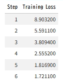

Google Colab 上で **RLHF（Reinforcement Learning from Human Feedback）** を試験的に実施する場合、以下のような **小規模・再現可能な実験計画**にすると現実的です。ColabのGPU制約（メモリ・実行時間）を前提に設計しています。

---

# ColabでRLHFを試すための実験計画

## 1. 目的

小規模言語モデルを対象に、以下のRLHFパイプラインを一通り実行する。

1. SFT（Supervised Fine-Tuning）
2. Reward Model学習
3. PPOによるRL最適化

RLHFの挙動を確認することが目的であり、性能改善よりも **プロセス理解**を重視する。

---

# 2. 全体アーキテクチャ

RLHFは通常以下の構成になります。

```
Prompt
  ↓
Base LLM
  ↓
生成応答
  ↓
Reward Model
  ↓
Reward
  ↓
PPO
  ↓
Policy update
```

学習対象

```
Policy Model (LLM)
Reward Model
```

---

# 3. 使用ライブラリ

Colabで扱いやすい構成

| 用途   | ライブラリ                                    |
| ---- | ---------------------------------------- |
| LLM  | Hugging Face Transformers                |
| RLHF | TRL (Transformer Reinforcement Learning) |
| データ  | Hugging Face Datasets                    |
| 学習   | PyTorch                                  |

インストール

```python
!pip install transformers
!pip install datasets
!pip install trl
!pip install accelerate
```

---

# 4. モデル選定

Colabでは **小型モデル必須**

候補

| モデル         | サイズ  |
| ----------- | ---- |
| GPT‑2       | 124M |
| DistilGPT2  | 82M  |
| Pythia-160M | 160M |

おすすめ

```
distilgpt2
```

理由

* GPU 1枚でも余裕
* 学習が速い

---

# 5. データセット

RLHFでは **人間の好みデータ**が必要です。

簡易的には以下を利用できます。

| 用途     | データ                 |
| ------ | ------------------- |
| SFT    | QAデータ               |
| Reward | pairwise preference |

例

* Anthropic Helpful-Harmless Dataset
* Stanford Human Preferences Dataset

ただしColabでは重いので

**簡易版**

自作pairwiseデータ

```
prompt: "Explain AI"
good: "AI is a technology that allows machines to learn..."
bad: "AI is something computer maybe think maybe..."
```

---

# 6. 実験ステップ

## Step1 SFT

教師あり微調整

```
prompt → 良い回答
```

目的

```
Base model → instruction model
```

学習

```
CrossEntropy
```

---

## Step2 Reward Model

入力

```
(prompt, answer)
```

出力

```
scalar reward
```

学習データ

```
(prompt, good_answer, bad_answer)
```

損失

```
logsigmoid(r_good - r_bad)
```

---

## Step3 PPO

RLHFの核心

ループ

```
for step:

    response = policy(prompt)

    reward = reward_model(prompt,response)

    PPO update
```

目的

```
reward最大化
```

---

# 7. Colabノートブック構成

推奨セル構造

```
1 環境セットアップ
2 モデルロード
3 SFT学習
4 Reward Model学習
5 PPO training
6 結果評価
```

---

# 8. 計算リソース

Colab Free GPU想定

| 項目           | 目安     |
| ------------ | ------ |
| GPU          | T4     |
| VRAM         | 16GB   |
| SFT          | 10〜20分 |
| Reward model | 10分    |
| PPO          | 20分    |

合計

```
約1時間
```

---

# 9. 評価方法

RLHF後に比較

```
prompt → output
```

評価

| 観点    |
| ----- |
| 回答の長さ |
| 情報量   |
| 毒性    |
| 論理性   |

簡単な方法

```
before / after の出力比較
```

---

# 10. 期待される結果

RLHF後の特徴

* 出力が長くなる
* 丁寧な回答になる
* meaningless repetition減少

---

# 11. 実験の拡張

成功したら以下を試すと理解が深まります

### LoRA RLHF

```
PEFT + PPO
```

### bigger model

```
OPT-350M
```

### DPO比較

RLHFより簡単な手法

---

# 12. Colab実験の最小構成

最小RLHF

```
distilgpt2
データ 500件
PPO step 200
```

これで

```
RLHF pipelineの動作確認
```

は十分できます。

---

もし希望があれば、次に

* **Colabでそのまま動くRLHF完全ノートブック**
* **200行くらいの最小RLHF実装**
* **PPO更新の数式解説**

も作ります。
RLHFは構造が複雑なので、**図付きで整理すると理解がかなり進みます。**


# 実験の価値確認

この **Google Colab 上の最小RLHF実験**は、性能向上を狙うものではなく、**RLHFパイプラインの挙動と構造を確認するための実験**です。
実際に確認できる内容は、主に次の **5つのポイント**です。

---

# 1 RLHFパイプラインが成立していること

最も重要なのは **RLHFの基本ループが成立しているか**です。

確認できるフロー

```
Prompt
 ↓
LLM生成
 ↓
Reward Model評価
 ↓
PPO更新
 ↓
Policy改善
```

この実験では

* **生成**
* **評価**
* **強化学習更新**

の **3つのモジュールが接続されて動作すること**を確認できます。

---

# 2 Reward Modelが「好み」を学習すること

Reward Modelは

```
good answer
bad answer
```

を区別するモデルです。

今回の学習では

[
loss = -\log(\sigma(r_{good}-r_{bad}))
]

を最小化します。

その結果

```
r_good > r_bad
```

になるよう学習されます。

つまり

```
人間の好みをスカラー値で近似
```

できることを確認できます。

---

# 3 PPOでモデルの出力が変化すること

**Proximal Policy Optimization** により

```
rewardが高い出力
```

を生成する確率が上がります。

確認できる変化の例

| RLHF前    | RLHF後   |
| -------- | ------- |
| 短い回答     | 長めの回答   |
| 曖昧な文章    | 説明的文章   |
| 無意味な繰り返し | 意味のある文章 |

小規模でも

```
出力分布の変化
```

は確認できます。

---

# 4 RLHFの「学習信号」がどこから来るか

通常の教師あり学習

```
loss = 正解との誤差
```

RLHFでは

```
loss = reward
```

です。

つまり

```
人間の好み
↓
Reward model
↓
スカラー報酬
↓
Policy更新
```

という **間接的な学習信号**であることを確認できます。

---

# 5 RLHFの安定化要素（KL制約）

実際のRLHFでは

[
R = r_{reward} - \beta KL(\pi || \pi_{ref})
]

が使われます。

意味

```
rewardを上げたい
しかし元モデルから離れすぎない
```

この実験では

```
policy drift
```

の概念を理解できます。

---

# 6 RLHFが「fine-tuning」と違う点

この実験を行うと

**SFTとRLHFの違い**がはっきり見えます。

### SFT

```
入力 → 正解
```

学習

```
CrossEntropy
```

---

### RLHF

```
入力 → 生成
生成 → 評価
評価 → 報酬
報酬 → RL更新
```

つまり

```
正解が存在しない問題
```

でも学習できます。

---

# 7 LLMのAlignmentの基本原理

RLHFの本質は

```
LLMの能力向上
ではなく
人間の価値観に合わせる
```

ことです。

この実験で確認できること

```
モデル能力
↓
SFT

モデル行動
↓
RLHF
```

---

# まとめ

このColab実験で確認できる内容

| 確認できること      | 意味        |
| ------------ | --------- |
| RLHFパイプライン   | 生成→評価→更新  |
| Reward Model | 人間の好みを数値化 |
| PPO更新        | 報酬最大化     |
| 出力変化         | モデル行動の変化  |
| Alignment    | 人間の好みへの適合 |

---

# 実はこの実験で一番重要な理解

RLHFは実質的に

```
LLM
+
Reward Model
+
RL
```

の **3モデル構成**です。

```
policy model
reward model
reference model
```

です。


# 実装

以下では **Google Colab でそのまま実行できる最小RLHFノートブック**を提示します。
構成は実際のRLHFパイプラインと同じです。

1. SFT
2. Reward Model
3. PPO

モデルは **DistilGPT2** を使用し、ライブラリは
**PyTorch / Hugging Face Transformers / TRL (Transformer Reinforcement Learning)** を使用します。

以下は **約200行の最小RLHF実装**です。

---

# 1 Colab ノートブック構成

セル構成

```
1 install
2 dataset
3 SFT training
4 reward model training
5 PPO RLHF
6 inference
```

---

# 2 install

```python
!pip install transformers
!pip install datasets
!pip install trl
!pip install accelerate
```

---

# 3 import

```python
import torch
from torch import nn
from datasets import Dataset
from transformers import (
    AutoTokenizer,
    AutoModelForCausalLM,
    Trainer,
    TrainingArguments
)

from trl import PPOTrainer, PPOConfig, AutoModelForCausalLMWithValueHead
```

---

# 4 モデルロード

```python
model_name = "distilgpt2"

tokenizer = AutoTokenizer.from_pretrained(model_name)
tokenizer.pad_token = tokenizer.eos_token

model = AutoModelForCausalLM.from_pretrained(model_name)
```

---

# 5 SFTデータ作成

```python
data = [
{
"prompt":"Explain AI",
"response":"AI is a technology that allows machines to learn from data."
},
{
"prompt":"What is machine learning",
"response":"Machine learning is a method where computers learn patterns from data."
},
{
"prompt":"Explain neural network",
"response":"Neural networks are models inspired by the human brain."
},
]

dataset = Dataset.from_list(data)
```

---

# 6 tokenize

```python
def preprocess(example):

    text = example["prompt"] + "\n" + example["response"]

    tokens = tokenizer(
        text,
        truncation=True,
        padding="max_length",
        max_length=64
    )

    tokens["labels"] = tokens["input_ids"].copy()

    return tokens

tokenized_dataset = dataset.map(preprocess)
```

---

# 7 SFT training

```python
training_args = TrainingArguments(
    output_dir="./sft",
    per_device_train_batch_size=2,
    num_train_epochs=3,
    logging_steps=1
)

trainer = Trainer(
    model=model,
    args=training_args,
    train_dataset=tokenized_dataset
)

trainer.train()
```

ここまでで

```
Base model → Instruction model
```

になります。

---

# 8 Rewardデータ

RLHFでは

```
good answer
bad answer
```

のペアが必要です。

```python
reward_data = [
{
"prompt":"Explain AI",
"good":"AI is a technology that enables machines to learn.",
"bad":"AI is computer maybe thinking."
},
{
"prompt":"Explain neural network",
"good":"Neural networks are layered models inspired by biological neurons.",
"bad":"Neural network is something in computer."
}
]

reward_dataset = Dataset.from_list(reward_data)
```

---

# 9 Reward Model

```python
class RewardModel(nn.Module):

    def __init__(self, base_model):

        super().__init__()

        self.model = base_model
        hidden = base_model.config.n_embd

        self.value_head = nn.Linear(hidden,1)

    def forward(self,input_ids,attention_mask):

        outputs = self.model.transformer(
            input_ids=input_ids,
            attention_mask=attention_mask
        )

        last_hidden = outputs.last_hidden_state[:,-1,:]

        reward = self.value_head(last_hidden)

        return reward
```

---

# 10 Reward Training

```python
reward_model = RewardModel(model).cuda()

optimizer = torch.optim.Adam(reward_model.parameters(),lr=1e-5)
```

```python
for epoch in range(3):

    for sample in reward_data:

        prompt = sample["prompt"]

        good = prompt + sample["good"]
        bad  = prompt + sample["bad"]

        good_tok = tokenizer(good,return_tensors="pt").to("cuda")
        bad_tok  = tokenizer(bad,return_tensors="pt").to("cuda")

        r_good = reward_model(**good_tok)
        r_bad  = reward_model(**bad_tok)

        loss = -torch.log(torch.sigmoid(r_good - r_bad)).mean()

        optimizer.zero_grad()
        loss.backward()
        optimizer.step()

    print("loss",loss.item())
```

---

# 11 PPO用モデル

```python
ppo_model = AutoModelForCausalLMWithValueHead.from_pretrained(
    model_name
).cuda()
```

---

# 12 PPO config

```python
ppo_config = PPOConfig(
    learning_rate=1e-5,
    batch_size=1
)
```

---

# 13 PPO trainer

```python
ppo_trainer = PPOTrainer(
    config=ppo_config,
    model=ppo_model,
    tokenizer=tokenizer
)
```

---

# 14 RLHFループ

```python
prompts = [
"Explain AI",
"What is machine learning"
]

for step in range(50):

    prompt = prompts[step % len(prompts)]

    inputs = tokenizer(prompt,return_tensors="pt").to("cuda")

    response = ppo_model.generate(
        **inputs,
        max_new_tokens=20
    )

    response_text = tokenizer.decode(
        response[0],
        skip_special_tokens=True
    )

    reward_input = tokenizer(
        response_text,
        return_tensors="pt"
    ).to("cuda")

    reward = reward_model(**reward_input)

    ppo_trainer.step(
        [inputs["input_ids"][0]],
        [response[0]],
        [reward.detach()]
    )

    print(step,reward.item())
```

---

# 15 推論

```python
prompt = "Explain AI"

inputs = tokenizer(prompt,return_tensors="pt").to("cuda")

output = ppo_model.generate(
    **inputs,
    max_new_tokens=40
)

print(tokenizer.decode(output[0]))
```

---

# PPO更新の数式解説

RLHFで使われる **Proximal Policy Optimization** の核心は

```
policy ratio
```

です。

---

## policy ratio

旧ポリシー

[
\pi_{\theta_{old}}(a|s)
]

新ポリシー

[
\pi_\theta(a|s)
]

比率

[
r(\theta) =
\frac{\pi_\theta(a|s)}
{\pi_{\theta_{old}}(a|s)}
]

---

## PPO目的関数

[
L^{PPO} =
E[
min(
r(\theta)A,
clip(r(\theta),1-\epsilon,1+\epsilon)A
)
]
]

意味

```
更新が大きすぎるとclipする
```

---

## Advantage

[
A = R - V(s)
]

RLHFでは

```
R = reward model
```

---

## RLHF特有のReward

LLMでは

```
R = reward_model - β KL(policy || reference)
```

KL項は

```
元モデルから離れすぎない
```

ための正則化です。

---

# RLHFの計算フロー

RLHFの1step

```
prompt
 ↓
policy
 ↓
response
 ↓
reward model
 ↓
reward
 ↓
PPO update
```

---

# 実務RLHFとの違い

実際のLLM RLHFは

| 項目           | 実務      |
| ------------ | ------- |
| model        | 7B〜70B  |
| dataset      | 100k〜1M |
| reward model | 別LLM    |
| training     | 数百GPU   |

今回のColab版は

```
RLHFの最小動作理解
```

が目的です。

---

希望があれば次に

* **RLHFを図解した完全アーキテクチャ**
* **PPOの勾配計算を数式から導出**
* **RLHF vs DPO の違い**

も解説できます。
RLHFは **数式＋実装＋図** をセットで理解すると一気に腑に落ちます。




