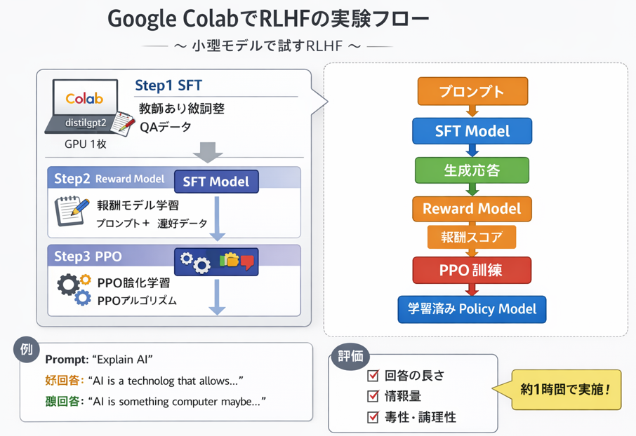

Google Colab 上で **RLHF（Reinforcement Learning from Human Feedback）** を試験的に実施する場合、以下のような **小規模・再現可能な実験計画**にすると現実的です。ColabのGPU制約（メモリ・実行時間）を前提に設計しています。

---

# ColabでRLHFを試すための実験計画

## 1. 目的

小規模言語モデルを対象に、以下のRLHFパイプラインを一通り実行する。

1. SFT（Supervised Fine-Tuning）
2. Reward Model学習
3. PPOによるRL最適化

RLHFの挙動を確認することが目的であり、性能改善よりも **プロセス理解**を重視する。

---

# 2. 全体アーキテクチャ

RLHFは通常以下の構成になります。

```
Prompt
  ↓
Base LLM
  ↓
生成応答
  ↓
Reward Model
  ↓
Reward
  ↓
PPO
  ↓
Policy update
```

学習対象

```
Policy Model (LLM)
Reward Model
```

---

# 3. 使用ライブラリ

Colabで扱いやすい構成

| 用途   | ライブラリ                                    |
| ---- | ---------------------------------------- |
| LLM  | Hugging Face Transformers                |
| RLHF | TRL (Transformer Reinforcement Learning) |
| データ  | Hugging Face Datasets                    |
| 学習   | PyTorch                                  |

インストール

```python
!pip install transformers
!pip install datasets
!pip install trl
!pip install accelerate
```

---

# 4. モデル選定

Colabでは **小型モデル必須**

候補

| モデル         | サイズ  |
| ----------- | ---- |
| GPT‑2       | 124M |
| DistilGPT2  | 82M  |
| Pythia-160M | 160M |

おすすめ

```
distilgpt2
```

理由

* GPU 1枚でも余裕
* 学習が速い

---

# 5. データセット

RLHFでは **人間の好みデータ**が必要です。

簡易的には以下を利用できます。

| 用途     | データ                 |
| ------ | ------------------- |
| SFT    | QAデータ               |
| Reward | pairwise preference |

例

* Anthropic Helpful-Harmless Dataset
* Stanford Human Preferences Dataset

ただしColabでは重いので

**簡易版**

自作pairwiseデータ

```
prompt: "Explain AI"
good: "AI is a technology that allows machines to learn..."
bad: "AI is something computer maybe think maybe..."
```

---

# 6. 実験ステップ

## Step1 SFT

教師あり微調整

```
prompt → 良い回答
```

目的

```
Base model → instruction model
```

学習

```
CrossEntropy
```

---

## Step2 Reward Model

入力

```
(prompt, answer)
```

出力

```
scalar reward
```

学習データ

```
(prompt, good_answer, bad_answer)
```

損失

```
logsigmoid(r_good - r_bad)
```

---

## Step3 PPO

RLHFの核心

ループ

```
for step:

    response = policy(prompt)

    reward = reward_model(prompt,response)

    PPO update
```

目的

```
reward最大化
```

---

# 7. Colabノートブック構成

推奨セル構造

```
1 環境セットアップ
2 モデルロード
3 SFT学習
4 Reward Model学習
5 PPO training
6 結果評価
```

---

# 8. 計算リソース

Colab Free GPU想定

| 項目           | 目安     |
| ------------ | ------ |
| GPU          | T4     |
| VRAM         | 16GB   |
| SFT          | 10〜20分 |
| Reward model | 10分    |
| PPO          | 20分    |

合計

```
約1時間
```

---

# 9. 評価方法

RLHF後に比較

```
prompt → output
```

評価

| 観点    |
| ----- |
| 回答の長さ |
| 情報量   |
| 毒性    |
| 論理性   |

簡単な方法

```
before / after の出力比較
```

---

# 10. 期待される結果

RLHF後の特徴

* 出力が長くなる
* 丁寧な回答になる
* meaningless repetition減少

---

# 11. 実験の拡張

成功したら以下を試すと理解が深まります

### LoRA RLHF

```
PEFT + PPO
```

### bigger model

```
OPT-350M
```

### DPO比較

RLHFより簡単な手法

---

# 12. Colab実験の最小構成

最小RLHF

```
distilgpt2
データ 500件
PPO step 200
```

これで

```
RLHF pipelineの動作確認
```

は十分できます。

---

もし希望があれば、次に

* **Colabでそのまま動くRLHF完全ノートブック**
* **200行くらいの最小RLHF実装**
* **PPO更新の数式解説**

も作ります。
RLHFは構造が複雑なので、**図付きで整理すると理解がかなり進みます。**


