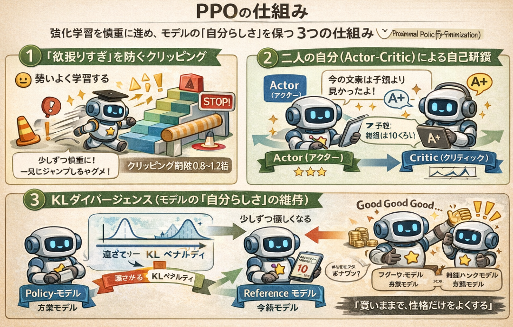
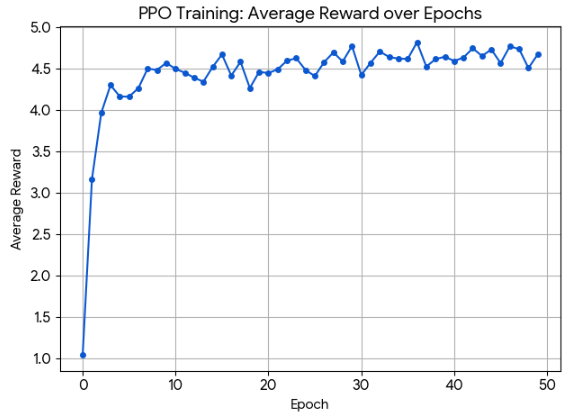

以前本ブログで触れた **RLHF** について、実験してみようと思います。

RLHFの概要については以下をご覧ください。

https://yoshishinnze.hatenablog.com/entry/2025/12/31/082922


## RLHFの意義

RLHFを利用するモチベーションは、**「正解が一つではない曖昧な基準」をAIに教え込むため** です。

先ほどのポジティブ変換のコードで体験したように、単なる「次の単語の予測」を超えて、AIを「人間に好まれる振る舞い」へと矯正する役割があります。主な理由は以下の3点に集約されます。

### 1. 「何がより良いか」という主観を教えるため
数学の問題には明確な「正解」がありますが、文章の「面白さ」「親切さ」「簡潔さ」には数式のような正解がありません。
- **SFT（教師あり学習）の限界:** 「良い回答のサンプル」を大量に与えて真似させる手法ですが、人間が完璧な手本を何万通りも作るのはコストが高すぎます。
- **RLHFの解決策:** AIが生成した2つの回答を人間が比較して「Aの方がBより自然だ」と選ぶだけ（比較評価）で学習が進みます。人間にとって「書く」より「選ぶ」方が圧倒的に楽なため、効率的に主観を注入できます。

### 2. 倫理的・安全なガードレールの設置
AIがインターネット上の膨大なデータを学習すると、差別的な表現や有害な知識も吸収してしまいます。これらを「言わないように」制御するのは、従来の学習だけでは困難です。
- **RLHFの役割:** 有害な質問に対して「答えを拒否する」あるいは「安全に配慮した回答をする」パターンに高い報酬を与えることで、AIの性格を品行方正に矯正します。ChatGPTが「爆弾の作り方」を教えてくれないのは、このRLHFによる「アライメント（調整）」の結果です。

### 3. 「ハルシネーション（嘘）」の抑制
AIは確率的に言葉を繋ぐため、自信満々に嘘をつくことがあります。
- **RLHFの役割:** 根拠のある正確な回答に高い報酬を与え、適当なデタラメに低い報酬を与えることで、モデルに「事実に基づいた回答を優先する」というバイアスをかけます。

## PPOの仕組み

PPO（Proximal Policy Optimization：近接方策最適化）を簡単に説明すると、**「AIが失敗して極端な行動に走らないよう、少しずつ慎重に学習を進める強化学習のアルゴリズム」** です。
OpenAIによって開発されたこの手法は、現在ChatGPTなどのRLHF（人間からのフィードバックによる強化学習）において、最も標準的に使われている「教育方針」のようなものです。



PPOの仕組みを、3つのポイントで図解を交えて解説します。

### 1. 「欲張りすぎ」を防ぐクリッピング
強化学習では、AIが「この言葉を言えば報酬がもらえる！」と気づくと、その確率を急激に上げようとします。しかし、一度に学習しすぎると、モデルの性能が崩壊（言葉が支離滅裂になるなど）することがあります。

- **PPOの解決策:** 前のモデルと今のモデルを比較し、更新の幅が一定の範囲（例えば $0.8$ 〜 $1.2$ 倍の間）に収まるように**クリッピング（制限）** をかけます。
- **イメージ:** 階段を一気に10段飛ばしで登ろうとするAIに対し、「1段ずつ確実に登りなさい」とブレーキをかける仕組みです。

### 2. 二人の自分（Actor-Critic）による自己研鑽
PPOの内部では、役割の異なる2つのネットワークが協力して学習します。

- **Actor（アクター）:** 実際に文章を生成する「演者」。
- **Critic（クリティック）:** その文章がどれくらい報酬をもらえそうか予想する「評論家」。
- **仕組み:** 評論家が「今の文章は予想より良かったよ！」と教える（これを**アドバンテージ**と呼びます）ことで、演者は自信を持ってその方向へ学習を進められます。

### 3. KLダイバージェンス（モデルの「自分らしさ」の維持）
あなたが先ほどのコードで体験したように、RLHFでのPPOには「元のモデル（Reference Model）」との比較も含まれます。

- **目的:** 報酬（アメ）欲しさに、言語モデルとしての自然さを捨てて「Good Good Good...」と連呼するような「報酬ハック」を防ぎます。
- **仕組み:** 元のモデルの確率分布から離れすぎないように罰則（KLペナルティ）を与え、**「賢いままで、性格だけを良くする」** という絶妙なバランスを保ちます。


## 実験

### 実験の内容

コード内の for epoch in range(10): の中では、以下のサイクルが高速で回転しています。

__1. 生成 (Rollout):__

モデルに「The movie was」というお題（Query）を出し、続き（Response）を自由に書かせます。

__評価 (Evaluation):__

書き上がった文章を「報酬モデル（感情分析モデル）」に放り込みます。
報酬モデルでは、放り込まれた文章がポジティブなら高報酬、ネガティブなら低報酬となるように報酬出力されます。

"The movie was fantastic!" → 高報酬

"The movie was terrible." → 低報酬

__2. 改善 (Optimization):__

PPOアルゴリズムが、「高報酬をもらえた時のパラメータの動き」を強化し、次から同じようなポジティブな単語を選びやすくします。

### アーキテクチャ

__1. 推論モデル__

今回のPPO（強化学習）のコードで使用した推論モデルは、**「DistilGPT-2」** です。

なぜGPT-4やLlama-3のような巨大な最新モデルではなく、あえてこの古い小型モデルを選定したのか。そこには、Google Colabの無料枠という制限されたリソース内で「強化学習のメカニズム」を確実に体験するためです。

- モデル名: distilgpt2
- ベース: GPT-2 (124M parameters) を知識蒸留（Distillation）で軽量化したもの。
- パラメータ数: 約8200万（82M）。
- 特徴: GPT-2の性能を約95%維持しつつ、サイズを33%削減、速度を2倍にした「速くて軽い」モデル。

__2. 報酬モデル__

今回試行における報酬モデルは **「DistilBERT」** というモデルです。

強化学習（PPO）において、モデルを賢くするためには「数値化されたアメ」が必要です。このコードでは、DistilBERTの出力を以下のように **「報酬（Reward）」という単一の数値** に変換しています。

- ポジティブな文章なら: +Score（例: +0.98）
- ネガティブな文章なら: -Score（例: -0.95）

モデルのスペックは以下です。

- モデル名: BERT（Googleが開発した双方向エンコーダ）を軽量化した「DistilBERT」です。
- 特化訓練: IMDb という世界最大級の映画レビューサイトのデータセット（数万件の「良い/悪い」のラベル付きレビュー）を使って、「文章の感情（ポジティブ/ネガティブ）」を判定するように追加学習（Fine-tuning）されています。
- 出力の形式: 文章を入力すると、以下の2つを返します。
- Label: POSITIVE（肯定的）または NEGATIVE（否定的）
- Score: その判定に対する 0.0 〜 1.0 の確信度。


### 実装

今回はTRLというライブラリを用いてRLHFを実施していきます。

>__TRL (Transformer Reinforcement Learning)__  
>Hugging Faceが提供している、Transformerモデル（LLM）を**強化学習（Reinforcement Learning）** によって最適化するためのフルスタックなライブラリです。
>__1. TRLの主な役割：LLMを「人間に寄せる」__  
事前学習（Pre-training）を終えただけのモデルは、単なる「次の単語の予測機」に過ぎません。TRLは、そのモデルを **「人間の意図や好みに合わせる（Alignment）」** ための機能提供しています。
>具体的には、以下の RLHF（人間からのフィードバックによる強化学習） のフローを一気通貫でサポートしています。
>__2. サポートしている主要なアルゴリズム__  
>TRLは、最新の強化学習・最適化手法を非常にシンプルなAPIで提供しています。
>| アルゴリズム | 特徴 |
>| :--- | :--- |
>| **PPO (Proximal Policy Optimization)** | 今回使用したもの。報酬モデル（審判）を使って、オンラインで試行錯誤しながら学習する王道の手法。 |
>| **DPO (Direct Preference Optimization)** | 報酬モデルを介さず、「AよりBの回答が良い」という比較データから直接学習する、現在最も主流の軽量手法。 |
>| **Reward Modeling** | 人間の好みをスコア化するための「審判モデル」を訓練する機能。 |
>| **SFT (Supervised Fine-Tuning)** | 強化学習の前の段階として、高品質な対話データでモデルを微調整する機能。 |


```
!pip install trl==0.9.6
```

```python
import torch
from tqdm import tqdm
from transformers import pipeline, AutoTokenizer
from trl import PPOTrainer, PPOConfig, AutoModelForCausalLMWithValueHead, create_reference_model

# 1. 基本設定
device = 0 if torch.cuda.is_available() else "cpu"
model_name = "distilgpt2" # Colabで高速に動くサイズ

# 2. PPOの設定
config = PPOConfig(
    model_name=model_name,
    learning_rate=1.41e-5,
    batch_size=32,
    mini_batch_size=8, # VRAM節約のため小さめに設定
    optimize_cuda_cache=True
)

# 3. モデルとトークナイザーの準備
# PPO用に「価値頭(Value Head)」を追加したモデルをロード
model = AutoModelForCausalLMWithValueHead.from_pretrained(config.model_name).to(device)
ref_model = create_reference_model(model) # 更新前のモデルと比較用
tokenizer = AutoTokenizer.from_pretrained(config.model_name)
tokenizer.pad_token = tokenizer.eos_token

# 4. 報酬モデル (Sentiment Analysis) の準備
# 生成された文章がどれくらいポジティブかを判定する「審判」
reward_model = pipeline("sentiment-analysis", model="lvwerra/distilbert-imdb", device=device)

# 5. ダミーデータの準備 (プロンプト)
def tokenize(sample):
    sample["input_ids"] = tokenizer.encode("The movie was", add_special_tokens=False)
    sample["query"] = "The movie was"
    return sample

# 実験用に32個の同じクエリを用意
from datasets import Dataset

# 5. データセットの準備 (リストではなく Dataset オブジェクトにする)
raw_data = {
    "query": ["The movie was"] * 256,
    "input_ids": [tokenizer.encode("The movie was")] * 256
}
dataset = Dataset.from_dict(raw_data)
dataset.set_format("torch") # PyTorchテンソルとして扱えるように設定

# 6. PPO Trainerの初期化 (これでエラーが消えるはずです)
ppo_trainer = PPOTrainer(config, model, ref_model, tokenizer, dataset=dataset)

# 6. PPO Trainerの初期化
ppo_trainer = PPOTrainer(config, model, ref_model, tokenizer, dataset=dataset)

# 7. 学習ループ (体験用のため10ステップ)
generation_kwargs = {
    "min_length": -1,
    "top_k": 0.0,
    "top_p": 1.0,
    "do_sample": True,
    "pad_token_id": tokenizer.eos_token_id,
    "max_new_tokens": 10,
}

print("Starting PPO Training...")
print("Starting PPO Training...")

for epoch in tqdm(range(50)): # 50エポックに増やして変化を見やすくします
    all_rewards = []
    
    for batch in ppo_trainer.dataloader:
        # クエリのテンソル化
        query_tensors = [ids.to(device) for ids in batch["input_ids"]]

        # A. Responseの生成
        # ppo_trainer.generate はリスト[torch.Tensor]を返します
        response_tensors = ppo_trainer.generate(query_tensors, **generation_kwargs)
        
        # デコードしてテキスト化
        queries = [tokenizer.decode(q) for q in query_tensors]
        responses = [tokenizer.decode(r) for r in response_tensors]

        # B. 報酬(Reward)の計算
        # query と response を結合して評価
        texts = [q + r for q, r in zip(queries, responses)]
        pipe_outputs = reward_model(texts)
        
        # スコアの計算（5.0倍のスケーリングで学習を加速）
        step_rewards = [
            torch.tensor((out["score"] if out["label"] == "POSITIVE" else -out["score"]) * 5.0).to(device) 
            for out in pipe_outputs
        ]
        
        all_rewards.extend([r.item() for r in step_rewards])

        # C. PPOによる更新
        # ここで query, response, reward を渡してモデルをアップデート
        stats = ppo_trainer.step(query_tensors, response_tensors, step_rewards)
        
    # エポックごとの進捗表示
    avg_reward = sum(all_rewards) / len(all_rewards)
    print(f" Epoch {epoch} | Average Reward: {avg_reward:.4f}")

print("Training Complete.")
```

学習による報酬の推移は以下通りとなりました。
十分に学習したことが確認されます。



__学習後__

学習した後お題を推測、かつ、報酬モデルで評価した結果は以下通りです。
期待通りポジティブ解答がされるようになりました。

推論コードは以下レポジトリをご参考下さい。

https://github.com/Shinichi0713/LLM-fundamental-study/tree/main/RLHF/src/eval_sentiment

```
--------------------------------------------------------------------------------
The movie was        | PPO (After)     | the first foreign event in 146 years for a studio that is divided by two | 0.9697
                     | Ref (Before)    | dedicated to the novel, his music, much to his disappointment -- even when | -0.6020
--------------------------------------------------------------------------------
I thought the film   | PPO (After)     | is the most honest and light-hearted, art-visual work that I | 0.9945
                     | Ref (Before)    | was dumbass without a plot twist, but the ending made me feel hard | -0.7361
--------------------------------------------------------------------------------
This story is        | PPO (After)     | in the October 2018 issue of Boros in October 2018 issue of Boros | 0.9254
                     | Ref (Before)    | from Postamp.com. Follow us @PrisonPlanet. | 0.5008
--------------------------------------------------------------------------------
```

## 総括

今回はRLHFの効果を体験するための実験を行いました。
- PPOの仕組みは **TRL** を用いることで容易に体験できます。
- PPOは対象モデルと、報酬モデルにより構成され、行動により突然の大きなパラメータ学習されないように、じわじわと学習していく仕組みが採用されています。
- RLHFを用いることで学習データが存在しないような抽象的な内容を学んでいくことが出来るようになります。


<div class="shop-card">
    <div class="shop-card-image">
        
    </div>
    <div class="shop-card-content">
        <div class="shop-card-title">Advanced Fine-Tuning with RLHF</div>
        <div class="shop-card-description">Advanced Fine-Tuning with RLHF: Teaching AI to Align with Human Intent through Feedback Loops
        In the age of intelligent systems, alignment is everything. From ChatGPT to Gemini, the world’s most advanced AI models rely on Reinforcement Learning from Human Feedback (RLHF) to understand and adapt to human values.
        </div>
        <div class="shop-card-link">
            <a href="https://www.amazon.co.jp/Advanced-Fine-Tuning-RLHF-Teaching-Mastering-ebook/dp/B0FVYDPS21?__mk_ja_JP=%E3%82%AB%E3%82%BF%E3%82%AB%E3%83%8A&crid=33UWXT4Q6MXHE&dib=eyJ2IjoiMSJ9.78cps_z79JeM0J_TbHNs2BEAMWBgB3hnm5o68DoVhWn3hZ5nC4e0BybxYMMIHeys4WAXBgfsWRNVctkMU3F0kQ.s-7IN824u89ZjZIAAccDvlEfE2zq14XXAHa0_ScFvNk&dib_tag=se&keywords=RLHF&qid=1774155458&sprefix=rlhf%2Caps%2C204&sr=8-2&linkCode=ll2&tag=yoshishinnze-22&linkId=a3907a7e4f7f6a1c26129297695afe4f&ref_=as_li_ss_tl" target="_blank" rel="noopener">Amazonで詳細を見る</a>
        </div>
    </div>
</div>

