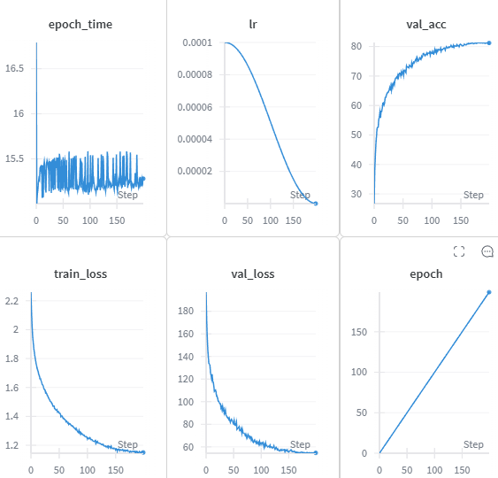

# ViT

## 目的

ViTの構造を理解して、モデル構築→実際に学習して出力を確認する。


```objectivec
┌──────────────┐
│  画像(224×224×3) │
└──────────────┘
         ↓ パッチ分割 (16×16)
┌───────────────────────┐
│ 14×14=196 パッチ (各 768次元ベクトル) │
└───────────────────────┘
         ↓ 線形埋め込み
┌───────────────────────┐
│ [CLS] + 196トークン (各768次元) │
└───────────────────────┘
         ↓ 位置エンコーディング追加
         ↓
┌───────────────────────┐
│ Transformer Encoder (12層など) │
└───────────────────────┘
         ↓
     [CLS]トークンの出力 → 分類など

```


## エンベディング
Position Embedding
positional encoding
位置埋め込み
ViTの構造に含まれるSelf-Attentionは，画像の情報を並列に計算する．その際に，ここと，ここが近い位置にあることや遠い位置にあることは計算に考慮してしない．近くの位置でも遠くの位置でも関係なく計算する．そのため，画像の位置情報を完全に無視して計算することになる．

これは，性能低下になる可能性があるため，位置情報を付与する．位置情報の数値を，各トークンに加算される．位置情報はクラストークンにも加算される．


## あるべき学習曲線

https://wandb.ai/arutema47/cifar10-challange/reports/Untitled-Report--VmlldzoxNjU3MTU2?accessToken=3y3ib62e8b9ed2m2zb22dze8955fwuhljl5l4po1d5a3u9b7yzek1tz7a0d4i57r


