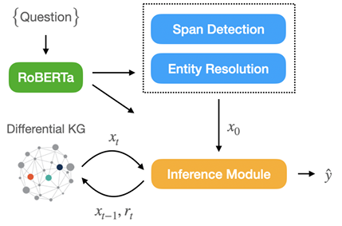

この論文はNLPの名寄せに関するものです
主旨は **「知識グラフ上での質問応答（KGQA）において、エンティティ解決（名寄せ・曖昧性解消）まで含めて全部をEnd-to-Endで学習する」** というものです。

## 論文の基本情報

| 項目 | 内容 |
|---|---|
| **タイトル** | End-to-End Entity Resolution and Question Answering Using Differentiable Knowledge Graphs |
| **著者** | Armin Oliya, Amir Saffari, Priyanka Sen, Tom Ayoola |
| **所属** | **Amazon Alexa AI**（英国・ケンブリッジ） |
| **会議** | **EMNLP 2021**（自然言語処理のトップ国際会議） |
| **ページ** | 4193–4200 |


## 解決しようとした問題

### 従来のKGQAの流れ

従来の知識グラフを使った質問応答は、だいたいこんな構成でした。

```
① Entity Resolution（ER）
   「質問文に出てくる固有名詞を、KG上のエンティティIDに変換」
   例: "carlos gomez" → WikidataのQ2747238
           ↓
② Semantic Parsing（意味解析）
   「質問を構造的なクエリに変換」
   例: "what position does X play?" → (X, position, ?)
           ↓
③ KGエンジンでクエリ実行
   → 答えを取得
```

### 従来の問題点

1. **ERは外部コンポーネントとして扱われる**
   - ERの学習には「質問文→エンティティID」の**手動ラベル付けデータ**が必要
   - ドメインが変わるたびにERモデルを作り直す必要がある

2. **ERのミスが後続に連鎖**
   - ERが間違えると、以降のSemantic Parsing・クエリ実行も全部間違う

3. **End-to-End最適化ができない**
   - ERと推論が分離しているため、**最終的な答えの正解/不正解という信号**でERまで直接学習できない


## この論文の核心的アイデア

> **「Entity Resolutionも含めて、質問文→答えエンティティのEnd-to-End学習を実現する」**

そしてその鍵が **「微分可能な知識グラフ（Differentiable KG）」** です。

### 微分可能な知識グラフとは

通常のKGは「トリプル（主語・述語・目的語）」を記号的に保存し、記号的なクエリエンジンで検索します。

一方、**微分可能なKG**は：
- トリプルを**テンソル（行列）**として保存
- クエリ実行を**行列演算**として実現
- つまり、**ニューラルネットと同じように勾配で学習できる**

この論文では、Cohen et al. (2020) の **ReifiedKB** という手法を活用しています。


## モデルの全体構成

システム構成図はこんな感じです。



実際に動作させるとこんな感じになるイメージのようです。

```
┌─────────────────────────────────────────────────────┐
│  入力: 質問文（自然言語）                              │
│  例: "what position does carlos gomez play?"          │
└─────────────────────────────────────────────────────┘
                         ↓
┌─────────────────────────────────────────────────────┐
│  ① RoBERTa で文脈埋め込みを抽出                      │
│     → 各トークンのベクトル + [CLS]トークンの質問ベクトル │
└─────────────────────────────────────────────────────┘
                         ↓
┌─────────────────────────────────────────────────────┐
│  ② Span Detection + Entity Resolution（同時に実行）   │
│     a. 質問内の「スパン（単語区間）」の可能性を計算    │
│     b. 各スパンの候補エンティティをKGから検索         │
│     c. 候補エンティティのKG近傍情報を埋め込み化       │
│     d. 最もらしいエンティティを確率分布として選択      │
│     → 「シードエンティティの確率分布」x₀ を得る       │
└─────────────────────────────────────────────────────┘
                         ↓
┌─────────────────────────────────────────────────────┐
│  ③ Multi-hop Inference（微分可能KG上で推論）          │
│     → 関係ベクトル r₁, r₂, ... をデコーダで生成      │
│     → follow(xₜ₋₁, rₜ) でKG上を「ホップ」していく     │
│     → 各ホップのエンティティ分布をAttentionで統合      │
│     → 最終的な「答えエンティティの確率分布」ŷ を出力  │
└─────────────────────────────────────────────────────┘
                         ↓
┌─────────────────────────────────────────────────────┐
│  ④ 損失計算                                          │
│     → 正解エンティティとの交差エントロピーで学習       │
│     → ER用ラベルは不要！                               │
└─────────────────────────────────────────────────────┘
```

## 重要な技術的ポイント

### 1. Span Detection + ER の同時実行

質問文の中で「どの区間がエンティティを指しているか」を、**すべての可能なスパンに対して確率を計算**します。

```
質問: "what position does carlos gomez play?"
スパン候補:
  "carlos" → 候補エンティティ: [Q2747238, Q12345, ...]
  "gomez"  → 候補エンティティ: [Q2747238, Q67890, ...]
  "carlos gomez" → 候補エンティティ: [Q2747238, ...]
```

重複する候補がある場合は、**より長いスパンを優先**します（より具体的だから）。

### 2. 候補エンティティの埋め込み化

各候補エンティティを、**KG上の近傍情報**から埋め込みます。

```
エンティティ Q2747238 の近傍トリプル:
  (Q2747238, position, center fielder)
  (Q2747238, team, Milwaukee Brewers)
  (Q2747238, birth place, Dominican Republic)
  ...
→ これらを文字列として連結し、埋め込みモデルでベクトル化
→ エンティティの「意味」をKG構造から獲得
```

### 3. 微分可能な follow 演算

KG上の関係追跡を、行列演算として実現します。

```
xₜ = follow(xₜ₋₁, rₜ) = Mₒᵀ (Mₛ xₜ₋₁ ⊙ Mₚ rₜ)
```

これは「現在のエンティティ分布 xₜ₋₁ において、関係 rₜ を辿った先のエンティティ分布 xₜ を計算する」行列演算です。**すべて微分可能**なので、誤差逆伝播で学習できます。

### 4. Multi-hop Attention

最大ホップ数まで推論を行い、**どのホップで得たエンティティが答えに近いか**をAttentionで重み付けします。

```
ŷ = Σₜ aₜ · xₜ   （aₜ は各ホップのAttention重み）
```


## 学習に必要なデータ

| 必要なもの | 不要なもの |
|---|---|
| ✅ 質問文（自然言語） | ❌ ER用の手動ラベル（質問中のスパン→エンティティID） |
| ✅ 正解エンティティ（答え） | ❌ Semantic Parsing用の論理形式ラベル |
| ✅ 知識グラフ（トリプル集合） | ❌ 中間アノテーション |

これが **Weakly Supervised（弱教師あり）** の強みです。


## 実験結果

2つの公開データセットで評価し、**「手動アノテーションされたエンティティを使う強力なベースラインに近い性能」** を達成しました。

つまり：
- **ERを外部システムに頼らなくても**
- **ER用ラベルなしで**
- **End-to-End学習だけで**

ほぼ同等の精度が出せることを示しました。


## この論文の意義（RAG・名寄せとの関連）

この論文は、私たちの議論している「社内固有名詞の名寄せ」に対して、**「別々のコンポーネント（ER + RAG）を作るのではなく、End-to-Endで最適化する」** という視点を与えてくれます。

| 従来の分離型 | この論文のアプローチ |
|---|---|
| ER → RAG（分離） | ER + 推論を同時に学習 |
| ER用ラベルが必要 | 質問と答えだけで学習可能 |
| ERのミスが連鎖 | ERの不確実性が答えの信頼度に反映 |
| 外部ERシステムに依存 | スタンドアロンで動作 |


## 一言でまとめると

> **「知識グラフでの質問応答において、固有名詞の曖昧性解消（ER）まで含めて全部をニューラルネットでEnd-to-End学習できる。しかもER用のラベルは不要で、質問と答えだけで学習できる」**

Amazon Alexa AIの研究ということもあり、**音声アシスタントのような実用的なQAシステム**への応用を見据えた、非常に実務的なアプローチです。
