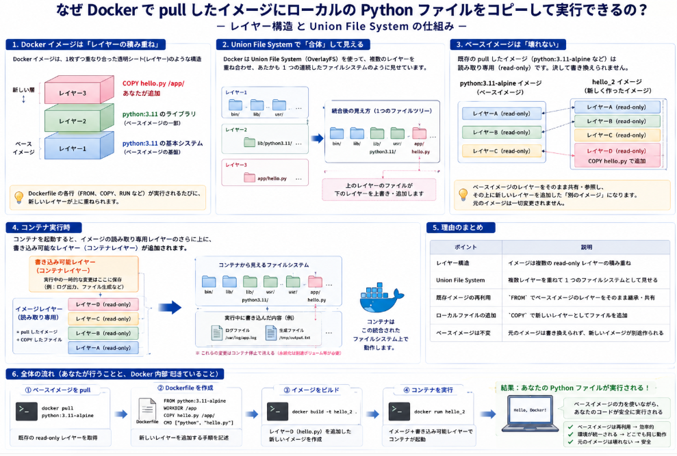

Dockerからpullしたimageに何か処理に加工をして実行したいことがあります。
そもそもこんなこと可能？というような質問があるかもしれません。
出来るんです。

今日はそんな話について話をしていこうと思います。

## 処理イメージ
まずはDockerからpullしたimageに何か処理に加工をして実行するための手順について説明していきます

### 最終ゴール

`hello-world` イメージ（Docker公式の動作確認用イメージ）と、**自分のパソコンにある `hello.py`** を合体させて、新しい Docker イメージ `hello_2` を作り、実行する。

**最終的にこうなれば成功です：**
```
Hello from Docker!
...
Hello from local hello.py!
This file was copied into the Docker image.
```

### 前提条件

- Docker がインストールされていること
- Windows の場合は PowerShell またはコマンドプロンプト、Mac/Linux の場合はターミナルを開いておく

### 手順 1: 作業用フォルダを作る

適当な場所にフォルダを作り、その中に移動します。

```bash
mkdir docker_test
cd docker_test
```

### 手順 2: ローカルに `hello.py` を作成する

以下の内容でファイルを保存します。ファイル名は **`hello.py`** です。

```python
#!/usr/bin/env python3
print("Hello from local hello.py!")
print("This file was copied into the Docker image.")
print("this is docker cloning test.")
```

**Windows の場合の簡単な作り方：**
```powershell
notepad hello.py
```
メモ帳が開いたら上記の内容を貼り付けて保存します。

### 手順 3: Dockerfile を作成する

同じ `docker_test` フォルダ内に、**`Dockerfile`** という名前のファイルを作成します（拡張子なし）。

```dockerfile
FROM hello-world AS hello-base

FROM python:3.11-alpine

COPY --from=hello-base /hello /usr/local/bin/hello

COPY hello.py /app/hello.py

WORKDIR /app

CMD ["sh", "-c", "hello && python hello.py"]
```

**Windows の場合の簡単な作り方：**
```powershell
notepad Dockerfile
```
メモ帳が開いたら上記の内容を貼り付けて保存します。

### 手順 4: イメージをビルドする

以下のコマンドを実行します。これで **`hello_2`** という名前の新しい Docker イメージが作られます。

```bash
docker build -t hello_2 .
```

**ポイント：**
- `-t hello_2` は「作るイメージの名前を `hello_2` にする」という意味です。
- 最後の `.`（ドット）は「現在のフォルダにある Dockerfile を使う」という意味です。忘れないようにしてください。

初回実行時は `hello-world` と `python:3.11-alpine` のダウンロードが行われるため、数分かかることがあります。

### 手順 5: イメージを実行する

```bash
docker run hello_2
```

**以下のように表示されれば成功です：**

```
Hello from Docker!
This message shows that your installation appears to be working correctly.
...
Hello from local hello.py!
This file was copied into the Docker image.
this is docker cloning test.
```

### 手順 6: 中身を確認したい場合（オプション）

コンテナの中に入って、ファイルがどこにあるか確認したい場合は以下を実行してください。

```bash
docker run --rm -it --entrypoint /bin/sh hello_2
```

プロンプトが変わったら、以下のコマンドで確認できます。

```sh
ls -la /app/
cat /app/hello.py
exit
```

### よくあるトラブルと対処法

| 症状 | 原因 | 対処法 |
|------|------|--------|
| `docker: error: unknown flag --rm` | `docker run` を `docker run` と書かずに実行している | `docker run --rm ...` と書く |
| `/bin/bash: not found` | ベースイメージが alpine（bash が入っていない） | `/bin/sh` を使う |
| `unable to find Dockerfile` | 違うフォルダで実行している | `cd docker_test` で正しいフォルダに移動する |
| `python: not found` | alpine イメージで `python` ではなく `python3` を使っている | `python3` に変更するか、`python:3.11-slim` を使う |


## なんでこれで実現できるの？

Docker で pull したイメージにローカルの Python ファイルをコピーして実行できる理由は、Docker の **レイヤー構造** と **Union File System** という仕組みによるものです。

### 1. Docker イメージは「レイヤーの積み重ね」

Docker イメージは、1枚1枚の重なり合った透明シート（レイヤー）のような構造になっています。

```
┌─────────────────────────────────────┐
│  レイヤー3: COPY hello.py /app/     │  ← あなたが追加
├─────────────────────────────────────┤
│  レイヤー2: python:3.11 のライブラリ │  ← pull したイメージの一部
├─────────────────────────────────────┤
│  レイヤー1: python:3.11 の基本システム│  ← pull したイメージの基盤
└─────────────────────────────────────┘
```

Dockerfile の各行（`FROM`、`COPY`、`RUN` など）が実行されるたびに、新しいレイヤーが上に重ねられます。

### 2. Union File System で「合体」して見える

Docker は **Union File System**（OverlayFS）を使って、複数のレイヤーを重ね合わせ、あたかも1つの連続したファイルシステムであるかのように見せています。

```
レイヤー1: [bin/] [lib/] [usr/]
レイヤー2:       [lib/python3.11/]
レイヤー3:                   [app/hello.py]  ← 追加したファイル

統合後の見え方:
[bin/] [lib/] [lib/python3.11/] [usr/] [app/hello.py]
```

上のレイヤーにあるファイルが下のレイヤーのファイルを**上書き・追加**する形で、1つのファイルツリーとして見えます。

### 3. ベースイメージは「壊れない」

既存の pull したイメージ（`python:3.11-alpine` など）は **読み取り専用（read-only）** です。決して書き換えられません。

```
python:3.11-alpine イメージ
├─ レイヤーA (read-only)
├─ レイヤーB (read-only)
└─ レイヤーC (read-only)

hello_2 イメージ（新しく作ったイメージ）
├─ レイヤーA (read-only) ← 同じレイヤーを共有・参照
├─ レイヤーB (read-only) ← 同じレイヤーを共有・参照
├─ レイヤーC (read-only) ← 同じレイヤーを共有・参照
└─ レイヤーD (read-only) ← COPY hello.py で追加した新レイヤー
```

ベースイメージの上に新しいレイヤーを重ねた「別のイメージ」として作成されるため、元のイメージは一切変更されません。

### 4. コンテナ実行時

コンテナを起動すると、イメージの読み取り専用レイヤーのさらに上に、書き込み可能なレイヤー（コンテナレイヤー）が追加されます。

```
コンテナ実行時:
┌─────────────────────────────────┐
│  書き込み可能レイヤー（コンテナ） │  ← 実行中の一時的な変更はここ
├─────────────────────────────────┤
│  イメージレイヤー（読み取り専用） │
│  = pull したイメージ + COPY したファイル
└─────────────────────────────────┘
```

この構造により、pull したイメージにローカルファイルを追加して、まったく新しいイメージとして安全に実行できるのです。

### 理由のまとめ

| ポイント | 説明 |
|---------|------|
| **レイヤー構造** | イメージは複数の read-only レイヤーの積み重ね |
| **Union File System** | 複数レイヤーを重ねて1つのファイルシステムとして見せる |
| **既存イメージの再利用** | `FROM` でベースイメージのレイヤーをそのまま継承 |
| **ローカルファイルの追加** | `COPY` で新しいレイヤーとしてファイルを追加 |
| **ベースイメージは不変** | 元のイメージは書き換えられず、新しいイメージが別途作られる |

この仕組みのおかげで、「公開されている軽量なベースイメージに、自分の Python アプリケーションコードだけを乗せた新しいイメージ」を安全かつ効率的に作ることができるのです。

## そもそもレイヤって何やねん

Docker の **レイヤー（Layer）** とは、**「ファイルシステムの差分（変更点）を記録した読み取り専用のスナップショット」** です。

### 1. レイヤーとは「差分のパッケージ」

例えば、以下のような操作を考えます。

1. 空の部屋に机を置く
2. その机の上にノートパソコンを置く
3. さらにマウスを置く

このとき、各部屋の状態を「写真」に撮るとします。

```
【レイヤー1】空の部屋
【レイヤー2】空の部屋 + 机
【レイヤー3】空の部屋 + 机 + ノートパソコン
【レイヤー4】空の部屋 + 机 + ノートパソコン + マウス
```

Docker のレイヤーも同じ考え方です。ただし「部屋全体を毎回コピーする」のではなく、**「前回から何が変わったか（差分）だけ」を記録**します。

```
【レイヤー1】空の部屋（ベース）
【レイヤー2】+ 机 を追加
【レイヤー3】+ ノートパソコン を追加
【レイヤー4】+ マウス を追加
```

### 2. なぜレイヤー構造を使うのか

__理由1: ディスク容量の節約__

複数のイメージが同じベース（例: `python:3.11`）を使っている場合、**共通のレイヤーは1つだけ保存**されます。

```
イメージA: python:3.11 + アプリA
イメージB: python:3.11 + アプリB
イメージC: python:3.11 + アプリC

実際の保存:
  python:3.11 のレイヤー（1つだけ、共有）
  + アプリAのレイヤー
  + アプリBのレイヤー
  + アプリCのレイヤー
```

__理由2: ビルドの高速化__

`Dockerfile` を変更しても、**変更がない命令（レイヤー）はキャッシュが使えます**。前回と同じレイヤーは作り直す必要がありません。

### 3. レイヤーは「読み取り専用」

レイヤーは一度作られると、**決して変更されません**。これが非常に重要な特性です。

```
イメージのレイヤー（すべて read-only）
├─ レイヤー1: FROM ubuntu
├─ レイヤー2: RUN apt-get install python3
└─ レイヤー3: COPY app.py /app/
```

もし `app.py` を修正してビルドし直すと、**レイヤー3だけが新しく作られ直し**、レイヤー1と2はそのまま再利用されます。

### 4. レイヤーとコンテナの関係

コンテナを起動すると、イメージの読み取り専用レイヤーの**さらに上に**、書き込み可能な新しい層が追加されます。

```
【コンテナ実行時の構造】

┌─────────────────────────────┐
│  書き込み可能レイヤー（Container Layer）│ ← コンテナ固有の一時的な変更
├─────────────────────────────┤
│  レイヤー3: COPY app.py       │  ← 読み取り専用
├─────────────────────────────┤
│  レイヤー2: RUN apt-get install│  ← 読み取り専用
├─────────────────────────────┤
│  レイヤー1: FROM ubuntu       │  ← 読み取り専用
└─────────────────────────────┘
```

コンテナ内でファイルを変更・削除しても、**実際のイメージレイヤーは一切変更されません**。変更は書き込み可能レイヤーに記録されます。

### 5. 具体例で理解する

以下の `Dockerfile` を例にします。

```dockerfile
FROM ubuntu:22.04          # レイヤー1: ubuntu の基本ファイルシステム
RUN apt-get update          # レイヤー2: パッケージリストの更新結果
RUN apt-get install -y python3  # レイヤー3: python3 がインストールされた状態
COPY hello.py /app/         # レイヤー4: /app/hello.py が追加された状態
```

各レイヤーが持つ「差分」を表にすると：

| レイヤー | 内容 | サイズ感 |
|---------|------|---------|
| レイヤー1 | ubuntu の基本システム（`/bin`, `/lib`, `/etc` など） | 約 80MB |
| レイヤー2 | `apt-get update` で更新されたパッケージリスト | 約 10MB |
| レイヤー3 | `/usr/bin/python3` など Python 関連のファイル群 | 約 30MB |
| レイヤー4 | `/app/hello.py`（1つのファイル） | 約 1KB |

### 6. レイヤーは「tar アーカイブのようなもの」

技術的には、Docker のレイヤーは **ファイルやディレクトリの変更セット** を圧縮して保存したものです。イメージを `docker save` でエクスポートすると、各レイヤーが個別のファイルとして確認できます。

```bash
docker save hello_2 -o hello_2.tar
tar -tf hello_2.tar
```




## Docker runするとどうなる？
Docker imageにpullしたイメージと、ローカルのPythonファイルがCopyできることが分かりました。
ではDocker runにより実行するとどういう動作を行うことになるのでしょうか。

### 正確な動作の流れ

__1. `docker build` の時点でレイヤーは完成している__

例として以下のイメージがあるとします。

ベースイメージをDL→ローカルファイル追加→ファイル属性変更。
そして起動時に実行するファイルをCMDで指定しています。

```dockerfile
FROM python:3.11-alpine        # ← レイヤー1: ベースイメージ全体
COPY hello.py /app/hello.py    # ← レイヤー2: ファイル追加
RUN chmod +x /app/hello.py     # ← レイヤー3: 属性変更
CMD ["python", "hello.py"]     # ← メタデータ（レイヤーにはならない）
```

`docker build` を実行すると、各命令ごとに**ファイルシステムのスナップショット（レイヤー）** が作成されます。これはあくまで「ファイルやディレクトリの状態」を記録したものです。

__2. `docker run` 時に行われること__

`docker run` を実行すると、以下の処理が行われます。

```
【ビルド済みのイメージ（読み取り専用）】
レイヤー1: python:3.11-alpine の基本システム
レイヤー2: /app/hello.py が追加された状態
レイヤー3: /app/hello.py の権限が変更された状態

【docker run で追加される層】
書き込み可能レイヤー（コンテナレイヤー） ← 新規作成
```

1. **Union File System で全レイヤーを統合**して1つのファイルツリーとして見せる
2. **書き込み可能なコンテナレイヤーを最上部に追加**
3. **CMD または ENTRYPOINT で指定されたコマンドを1つだけ実行**

つまり、レイヤーは「順番に実行される」のではなく、**「重ね合わせて1つのファイルシステムとして見せている」** だけです。


### イメージで説明

__ビルド時（`docker build`）__

```
ステップ1: FROM python:3.11-alpine
  → 既存レイヤーをそのまま継承

ステップ2: COPY hello.py /app/hello.py
  → 新レイヤーを作成（hello.py を含む差分）

ステップ3: RUN chmod +x /app/hello.py
  → 新レイヤーを作成（権限変更後の差分）

【完成したイメージ】
```

__実行時（`docker run`）__

```
【統合されたファイルシステム】
  ├── /bin/
  ├── /lib/
  ├── /app/hello.py   ← レイヤー統合により見える
  └── ...

【実行されるコマンド】
python /app/hello.py   ← CMD で指定された1つのコマンドのみ
```

## 実験

実際に動作させるとイメージできると思います。→実験してみます。

### 実験の目的

以下の流れを確認することを目的としました。

1. 既存のdocker イメージ `hello-world` を pull する（または `FROM` で自動取得）
2. ローカルで作成した `hello.py` をイメージ内にコピーする
3. 新しいイメージ `hello_2` としてビルドし、実行する


### 手順
実験のレシピです。

__1. `hello.py`（ローカル作成）__

```python
#!/usr/bin/env python3
print("Hello from local hello.py!")
print("This file was copied into the Docker image.")
```

__2. `Dockerfile`__

```dockerfile
FROM hello-world AS hello-base

FROM python:3.11-alpine

COPY app.py /app/app.py

WORKDIR /app

CMD ["python", "app.py"]
```

### 実行コマンドと結果

__ビルド__

上記のDockerfileがあるディレクトリに移動の上で以下を実行下さい。

```bash
docker build -t hello_2 .
```

__実行__

そして出来たDockerイメージを実行します。

```bash
docker run hello_2
```

__実行結果__

hello イメージ内でhello.pyが実行されることが確認出来ます。

```
/app # cat app.py
#!/usr/bin/env python3
# hello.py
print("Hello from local hello.py!")
print("This file was copied into the Docker image.")

print("this is docker cloning test.")
/app # exit
```

因みに上記だと折角 hello イメージをpullした効果が確認しづらいのでちょっと変更してみます。

```Docker
FROM hello-world AS hello-base

FROM python:3.11-alpine
# hello-base ステージから /hello をコピー
COPY --from=hello-base /hello /usr/local/bin/hello
COPY hello.py /app/hello.py
WORKDIR /app
CMD ["sh", "-c", "hello && python hello.py"]
```

これで実行すると以下のようになります。
Dockerのhelloと、ローカルにあったhello.py両方が実行できました。


```
Hello from Docker!
This message shows that your installation appears to be working correctly.

To generate this message, Docker took the following steps:
 1. The Docker client contacted the Docker daemon.
 2. The Docker daemon pulled the "hello-world" image from the Docker Hub.
    (amd64)
 3. The Docker daemon created a new container from that image which runs the
    executable that produces the output you are currently reading.
 4. The Docker daemon streamed that output to the Docker client, which sent it
    to your terminal.

To try something more ambitious, you can run an Ubuntu container with:
 $ docker run -it ubuntu bash

Share images, automate workflows, and more with a free Docker ID:
 https://hub.docker.com/

For more examples and ideas, visit:
 https://docs.docker.com/get-started/

Hello from local hello.py!
This file was copied into the Docker image.
this is docker cloning test.
```

## 総括

この記事の本質は、**「Docker は既存のイメージを“そのまま再利用”しながら、自分のファイルだけを“上に重ねる”ことで、新しいオリジナルイメージを作れる」** という仕組みを体験するものです。

以下、本質を3つのポイントに分けて説明いたします。

### 1. Docker イメージは「透明シートの重ね合わせ」

Docker のイメージは、1枚の大きなディスクイメージではなく、**「変更差分だけを記録した透明シート（レイヤー）」を重ねたもの**です。

- `FROM python:3.11` で「Python が入ったシート」を敷く
- `COPY hello.py` で「hello.py が書かれた小さなシート」を1枚重ねる

これにより、**元の Python イメージは一切書き換えずに**、「Python + 自分のスクリプト」という新しい環境が完成します。

### 2. なぜ「合体」できるのか：読み取り専用の積み木

各レイヤーは **読み取り専用（read-only）** です。

```
【元のイメージ】          【自分で作ったイメージ】
python:3.11 のレイヤー  →  そのまま参照（共有）
                            + hello.py のレイヤー（追加）
```

これにより、以下のメリットが生まれます。

- **元のイメージが壊れない**：`python:3.11` を何十個のプロジェクトで使い回しても安全
- **容量を節約**：共通のレイヤーは1つだけ保存される
- **ビルドが速い**：変更がない部分はキャッシュが使える

### 3. 実験で実証したこと

記事の実験では、以下の2つを同時に実現しています。

| 要素 | 出どころ |
|------|---------|
| `Hello from Docker!` のメッセージ | `hello-world` イメージの `/hello` バイナリ |
| `Hello from local hello.py!` | ローカルで作った Python スクリプト |

```dockerfile
COPY --from=hello-base /hello /usr/local/bin/hello   # 既存イメージの中身を持ってくる
COPY hello.py /app/hello.py                           # 自分のファイルを重ねる
```

これがまさに「**既存の資産を壊さずに、自分のものを付け足す**」Docker の本質的な強みを示しています。

### 一言でまとめると

> **Docker は「他人が作った環境」を「自分のファイル」で拡張できる、重ね合わせ式のシステムである。**

これがこの記事が伝えたい核心です。
