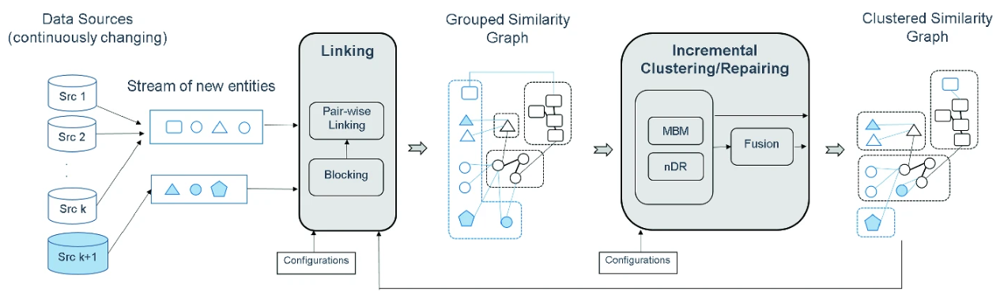

NLPでクラシックな課題名寄せに関する2020年にESWCで採択された論文について解説してきます。

### 論文情報

| 項目 | 内容 |
|---|---|
| **タイトル** | Incremental Multi-source Entity Resolution for Knowledge Graph Completion |
| **著者** | Alieh Saeedi, Eric Peukert, Erhard Rahm |
| **所属** | University of Leipzig & ScaDS.AI Dresden/Leipzig（ドイツ） |
| **会議** | **ESWC 2020**（The Semantic Web） |
| **フレームワーク** | **FAMER**（Fast Multi-source Entity Resolution System） |
| **PDF** | https://dbs.uni-leipzig.de/files/research/publications/2020-6/pdf/FAMER_Incremental_eswc2020.pdf |


### 解決しようとした問題

**知識グラフ（KG）は構築後も新しいデータソースやエンティティが継続的に追加される。しかし、従来の「1件ずつ最も似たクラスタに追加する」単純な逐次処理では、追加順序に強く依存し、一度誤ったクラスタに入れたエンティティが原因で後続のエラーを連鎖的に引き起こす。**

```
【順序依存性の問題例】

ステップ1: 新エンティティ「Neko AI」をクラスタAに追加
           → 実際はクラスタB（Project Neko）が正解だったが、
             当時の情報が少なくて誤判定

ステップ2: 新エンティティ「猫型AIシステム」を追加
           → クラスタA（誤クラスタ）に近いと判定 → 誤クラスタに追加
           → 誤りが累積・拡大

【バッチ処理との差】
・Batch ER: 全エンティティを同時に見て最適クラスタリング → 精度高いが計算コスト大
・Incremental ER: 新規分だけ処理したいが、単純逐次だと精度が順序に依存して劣化
```

### 提案手法の核心：FAMERによる増分ER

本論文は、**複数ソースからのエンティティを並列・増分的にクラスタリングしつつ、バッチ処理と同等の精度を維持する**手法を提案しています。

__1. セット単位の最適割り当て（max-both assignment）__

1件ずつではなく、**新規エンティティをセット（バッチ）としてまとめて処理**し、クラスタへの割り当てを最適化します。

```
【max-both assignmentの直感】

新規エンティティ群 S = {e1, e2, e3} を一括で評価

・e1をクラスタAに入れるか？
  → e1とクラスタAの類似度が高い かつ
  → 同じソース内の他の新規エンティティ（e2, e3）に、
    クラスタAとのより高い類似度のものがない

→ 両方を満たした場合のみ割り当て
→ ソース内の重複や競合を考慮した最適化
```

__2. クラスタ融合（Cluster Fusion）__

クラスタ内の複数エンティティを**1つの代表ベクトル（融合エンティティ）に統合**します。

```
【効果】
・新規エンティティの比較対象が「クラスタ内の全エンティティ」→「1つの融合表現」に削減
・計算コスト大幅削減 + 増分処理の高速化
```

__3. n-depth reclustering（クラスタ修復）__

これが本論文の**最大の特徴**です。誤ったクラスタ決定を**後から検出・修正**します。

```
【仕組み】
1. 新規エンティティを追加した後、類似度グラフの近傍（n-depth）を再評価
2. クラスタの結合・分割・エンティティの移動を実行
3. 過去の誤クラスタを修復することで、順序依存性を排除

【イメージ】
誤って「Neko AI」が「Lighthouse」クラスタに入ったとする
→ n-depth reclusteringで周辺のリンク構造を再分析
→ 「Neko AI」は「Project Neko」クラスタの方が近いと判定
→ クラスタ間でエンティティを移動（修復）
```

### 全体ワークフロー

論文に書かれた処理を表現するとこんな感じになります。

```
┌─────────────────────────────────────────────────────────────┐
│  入力: 既存のクラスタ済み類似度グラフ + 新規エンティティ群      │
└─────────────────────────────────────────────────────────────┘
                              ↓
┌─────────────────────────────────────────────────────────────┐
│  1. Incremental Linking（増分リンク）                        │
│     ・新規エンティティ ↔ 既存クラスタ間の類似度計算            │
│     ・新規エンティティ同士のリンクも作成（オプション）          │
│     ・既存エンティティ間のリンクは再計算しない（効率化）        │
└─────────────────────────────────────────────────────────────┘
                              ↓
┌─────────────────────────────────────────────────────────────┐
│  2. Cluster Fusion（クラスタ融合）                            │
│     ・各クラスタを1つの代表ベクトルに統合                      │
│     ・新規エンティティとの比較を高速化                         │
└─────────────────────────────────────────────────────────────┘
                              ↓
┌─────────────────────────────────────────────────────────────┐
│  3. Incremental Clustering + n-depth Reclustering             │
│     ・max-both assignmentでセット単位割り当て                  │
│     ・n-depth reclusteringで既存クラスタを修復                 │
│     → 順序に依存しない高品質なクラスタを維持                   │
└─────────────────────────────────────────────────────────────┘
                              ↓
┌─────────────────────────────────────────────────────────────┐
│  出力: 更新されたクラスタ済み類似度グラフ（次回の入力に循環）   │
└─────────────────────────────────────────────────────────────┘
```

論文に掲載されていた処理フローはこんな感じのものでした。
新規エンティティ付近で再計算というのが肝です。
おかしいと感じたら後からでも見直すという感じですね。これがIncrementalに実施されるということが本手法のご利益です。



### 評価結果の要点

3つの実世界データセットで評価：

| 発見 | 内容 |
|---|---|
| **① 単純逐次追加の限界** | 1件ずつ追加するナイーブな手法は、追加順序によって精度が大きく変動 |
| **② max-bothの有効性** | セット単位の最適割り当てで、順序依存性を部分的に緩和 |
| **③ n-depth reclusteringの優位性** | **修復手法を入れると、バッチ処理と同等のクラスタ品質を達成** |
| **④ 並列化のスケーラビリティ** | FAMERフレームワークによる分散処理で、大規模データにも対応可能 |


### 社内RAGとの関連

以下のような**階層的な名寄せアーキテクチャ**が構想できます：

| レイヤー | 役割 | 対応論文・手法 |
|---|---|---|
| **L1: クエリ時の動的名寄せ** | 略称・通称をリアルタイムに解決 | DynamicER（TempCCA） |
| **L2: 文書蓄積時の増分クラスタリング** | 新規文書から抽出したエンティティを既存KGに統合 | **FAMER（本論文）** |
| **L3: 辞書・ルールフォールバック** | 高頻度別名の高速解決 | 独自辞書 |
| **L4: Backward ER** | 検索結果からの逆推定 | PoCで実装 |

**本論文からの教訓**：
> **「新規エンティティ（メンション）を1件ずつ処理するのではなく、セット単位で最適化し、過去の誤りを修復するメカニズムを入れることで、時間とともに劣化しない名寄せKGを維持できる」**

これは、社内WikiやSlackログが日々流入する環境で、**エンティティ辞書・履歴を自動更新し続ける基盤**を設計する上で非常に重要な示唆です。


