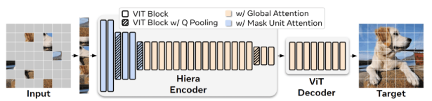
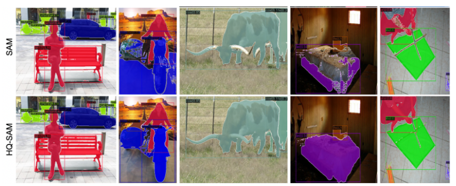

HQ-SAMはSAMを拡張することで高精度なゼロショットセグメンテーションを可能とする優れた手法です。
SAM-2は、画像エンコーダに事前学習済みのMAE Hieraモデル(※)を利用したSAMの発展手法です。

両者の良いところを採用した手法は存在するでしょうか？

※Hieraモデル:  
解像度違いのViTブロックをピラミッド状に接合することでより高次元な特徴埋め込みを抽出するという画像エンコーダです。
非常に高精度な精度で認識できるモデルです。

## 結論

HQ-SAMの提案者ら（ETH ZürichのVISグループ / SysCV）が、その拡張手法をSAM 2に適用した **HQ-SAM 2** を公開しています。

URL: https://github.com/SysCV/sam-hq/blob/main/sam-hq2/README.md

## 概要

HQ-SAMの学習戦略を拡張することで、SAM2をより高品質にアップグレードするHQ-SAM2が提案されており、改良版のモデルチェックポイント一式（HQ-SAM 2、ベータ版として公開）がリリースされています。これは元のHQ-SAMと同じ `SysCV/sam-hq` リポジトリ内（`sam-hq2` サブディレクトリ）で配布されています。

因みにSAMに対してHQ-SAMを適用する効果はこんな感じで違いが出ます。
(上がSAM、下がHQ-SAMの結果です)

角の検知が不完全になってたりするSAMに対してHQ-SAMを適用するときれいに輪郭が理想的な状態で検知されていることが確認されます。

## 適用可能な理由（アーキテクチャの互換性）

HQ-SAMの中核技術は、SAM 2にもそのまま移植できる設計になっています。もともとHQ-SAMは、学習可能なHigh-Quality Output Tokenをマスクデコーダに注入して高品質マスクを予測し、マスクデコーダの特徴だけでなく、初期・最終のViT特徴と融合させることで、マスクの詳細を改善するものです。

重要なのは、この手法が元モデルを壊さない点です。設計上、SAMの事前学習済み重みを再利用・保持したまま、追加パラメータと計算量を最小限に抑えて導入します。SAM 2はアーキテクチャ的にSAMの自然な拡張であり、ストリーミングアーキテクチャによってビデオフレームを1枚ずつ処理し、画像に適用された場合はメモリが空でSAMと同様に振る舞います。このため、HQ-SAMのトークン注入・特徴融合の考え方をSAM 2のデコーダにも同様に適用できます。

## HQ-SAM 2で扱える範囲

- **静止画像**: HQ-SAM 2は静止画像においてHQ-SAMのすべての機能を備えており、SAMに近い画像予測APIが提供されています。
- **ビデオ**: プロンプト可能なセグメンテーションとビデオ内のトラッキング向けに、プロンプトの追加やマスクレットの伝播を行うAPIを備えたビデオ予測器が提供されています。
- **性能**: COCOでのゼロショット画像セグメンテーション性能（AP）の比較（同一のFocal-net DINO検出器を使用）が示されており、SAM2.1とHQ-SAM 2のFPS速度は同等です。また、ゼロショットのビデオオブジェクトセグメンテーション性能についてもSAM2.1との比較が示されています。

## 使い方のイメージ

ベースラインのSAM2.1のコードとほぼ同じ形で、チェックポイントと設定ファイル、ビルダー関数を差し替えるだけで利用できます。画像・ビデオともに、`sam2.1_hq_hiera_large.pt` のようなHQ用チェックポイントと `sam2.1_hq_hiera_l.yaml` の設定を指定し、ビデオでは `build_sam2_hq_video_predictor` を用いる形になります。

## まとめ

HQ-SAMの拡張はSAM 2にも適用可能で、公式（原著者）実装として **HQ-SAM 2** が既に提供されています。少ない追加パラメータでベース性能・速度を保ちつつマスク品質を高めるという設計思想はSAM 2でも一貫しており、画像・ビデオ双方で利用できます。ただし現時点では「ベータ版」として位置づけられている点には留意してください。

補足として、Meta側のSAM 2論文でもHQ-SAMがSAM品質向上の先行研究として言及されており、HQ-SAMがHigh-Quality output tokenの導入と細粒度マスクでの学習によってSAMを強化するものと紹介されています。

より詳しい情報が必要であれば、実装リポジトリ（`SysCV/sam-hq` の `sam-hq2`）を直接参照するとセットアップ手順やベンチマーク表を確認できます。
より良いゼロショットセグメンテーションをやってみたい方は、是非ネット検索欄に `sam-hq2` と検索してみてください。
