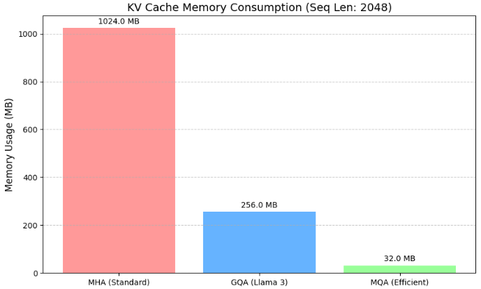

**Multi-Query Attention (MQA)** は、2019年にGoogleのNoam Shazeer氏によって提案された技術で、現在のLLM（特に推論効率を重視するモデル）の基盤となった重要な手法です。


### 1. 解決しようとした課題：推論時のメモリ帯域ボトルネック

LLMの推論（テキスト生成）には、 **「メモリ帯域幅制限（Memory Bandwidth Bound）」** という大きな壁があります。

* **KVキャッシュの肥大化**:
自己回帰的な生成では、過去のトークンの $K$（Key）と $V$（Value）をメモリに保存しておきます（KVキャッシュ）。標準的なMulti-Head Attention (MHA) では、ヘッドの数（例：32個や64個）と同じ数だけ $K$ と $V$ を保持する必要があります。
* **メモリ読み出しの遅延**:
GPUの計算ユニット（演算器）は非常に速いのですが、VRAM（メインメモリ）からデータを取ってくる速度がそれに追いつきません。推論中、1トークン生成するたびに巨大なKVキャッシュをメモリから読み出す必要があり、これが原因でGPUの計算性能が宝の持ち腐れになり、生成速度が上がりませんでした。
* **同時処理数（バッチサイズ）の制限**:
KVキャッシュがメモリを占有するため、一度に多くのユーザーのリクエストを処理（バッチサイズを大きく）しようとすると、すぐにVRAM容量が不足してしまいます。


### 2. MQAの概要：KeyとValueの共有

MQAのアイデアは非常にシンプルで、 **「Queryのヘッドはたくさん作るが、KeyとValueのヘッドは1つだけにして、全員で共有する」** というものです。
先述した **「推論時にメモリからデータを読み出すのが遅すぎる」** という課題に対し、 **「じゃあ、読み出すデータ（KとV）そのものを共有して減らしてしまおう」** という発想で解決を図った技術です。

#### 構造の違い

* **標準的なMHA (Multi-Head Attention)**:
 各ヘッドが独自の $Q$, $K$, $V$ を持ちます。
（例：32個のQヘッド、32個のKヘッド、32個のVヘッド）
* **MQA (Multi-Query Attention)**:
 $Q$ は複数のヘッドを持ちますが、$K$ と $V$ はモデル全体（またはレイヤー全体）で1セットのみ持ちます。
（例：32個のQヘッド、1個のKヘッド、1個のVヘッド）

#### なぜこれで解決するのか？

1. **データ転送量の削減**: 
   メモリから読み出す $K$ と $V$ の量がヘッド数分（例：32分の1）に減ります。これにより、メモリ帯域の負荷が劇的に下がり、推論速度が向上します。
2. **メモリ消費量の削減**: 
   KVキャッシュに必要なVRAM容量が大幅に減るため、同じGPUでより多くのリクエストを同時に処理できるようになります。


### 3. メリットとデメリット

| 特徴 | メリット | デメリット |
| --- | --- | --- |
| **推論速度** | 劇的に向上（メモリ読み出し待ちが減るため） | - |
| **スループット** | 大幅向上（より大きなバッチサイズが可能） | - |
| **メモリ効率** | KVキャッシュのサイズを数十分の一に削減 | - |
| **精度** | - | **わずかに低下する可能性がある** |

**精度の低下について**:
すべてのQueryヘッドが同じKey/Valueヘッドを参照するため、モデルが「多角的に文脈を捉える能力」が標準的なMHAよりも少しだけ制限されます。

### 4. その後の進化：GQA (Grouped-Query Attention) へ

MQAは推論を高速化しましたが、精度の低下が懸念材料でした。そこで登場したのが、以前の回答でも触れた **GQA (Grouped-Query Attention)** です。

* **MHA**: 全員別々のK, V（精度最高、速度最低）
* **MQA**: 全員同じ1つのK, V（精度最低、速度最高）
* **GQA**: 数人ずつのグループでK, Vを共有（**精度と速度のいいとこ取り**）

現在、**Llama 3** や **Mistral** などの最新モデルでは、このMQAの思想をさらに洗練させた **GQA** が標準的に採用されています。

## MQAの期待できる効果

MQA（Multi-Query Attention）を導入することで期待できる効果は、一言で言えば **「推論コストの劇的な削減とスピードアップ」** です。

1. VRAM（ビデオメモリ）の大幅な節約

最も直接的な効果は、KVキャッシュのサイズ削減です。
MHAのアテンションを用いる場合のKVキャッシュの容量を、ヘッドの数（$H$）に応じて $1/H$ に削減できます。

例: ヘッド数が32個のモデルであれば、KVキャッシュに必要なメモリを約 97% カットできます。これにより、以前はメモリ不足で扱えなかった「超長文」の入力が可能になります。

2. 推論スピード（生成速度）の向上

LLMの生成（デコーディング）は、計算能力よりも「メモリからデータを読み出す速度（帯域幅）」に制限される性質があります。

読み出すデータ量（KeyとValue）が激減するため、データ転送待ちの時間がなくなります。

標準的なMHAと比較して1.5倍〜2倍以上、条件によっては最大12倍もの高速化が報告されています。

3. 同時処理数（スループット）の増大

1リクエストあたりのメモリ消費が減るため、同じGPUでより多くのユーザーのリクエストを同時に処理できるようになります。

バッチサイズを大幅に（例：数倍〜10倍以上）大きくできるため、サービスを運用する際のサーバーコスト（1トークンあたりの単価）を劇的に下げることができます。

## 実装例

MQA（Multi-Query Attention）の最大のメリットである「KVキャッシュのメモリ削減」を、具体的な数値例とPyTorchによるシミュレーションコードで解説します。

### 1. 例題：Llama 2 (7B) クラスのモデルでの比較

以下の設定のモデルで、 **2048トークン** を生成する際に必要なKVキャッシュのメモリ量を計算してみましょう。

* **層数 (Layers)**: 32
* **隠れ層サイズ (Hidden Dim)**: 4096
* **ヘッド数 (Heads)**: 32
* **1ヘッドあたりの次元数**: 
* **精度**: Float16 (1要素あたり 2バイト)

#### MHA（標準）の場合

すべてのヘッドに対して、KeyとValueを個別に保存します。


#### MQA（Multi-Query）の場合

KeyとValueは、全ヘッドで共有される「1セット」のみ保存します。


> **結果**: MQAを使うだけで、KVキャッシュのメモリ消費が **1/32 (約3%)** に抑えられます。


### 2. 実装：メモリ消費のシミュレーションコード

実際にPyTorchを使用して、MHAとMQAのKVキャッシュを模したテンソルを作成し、そのメモリ使用量を比較するコードです。

```python
import torch
import gc

def get_kv_cache_memory_stats():
    # --- 設定: Llama-3-8B クラスのモデルを想定 ---
    num_layers = 32
    hidden_dim = 4096
    num_heads_q = 32
    head_dim = hidden_dim // num_heads_q # 128
    seq_len = 8192  # 少し長めのコンテキストを設定
    batch_size = 4  # 複数人での同時利用を想定
    dtype = torch.float16  # 2バイト
    device = "cuda" if torch.cuda.is_available() else "cpu"

    def measure_usage(num_kv_heads, label):
        # メモリの掃除
        gc.collect()
        if device == "cuda":
            torch.cuda.empty_cache()
            torch.cuda.reset_peak_memory_stats()
            start_mem = torch.cuda.memory_allocated()
        else:
            start_mem = 0

        # KVキャッシュテンソルの作成 (KとVの2つ)
        # 形状: (Layers, 2(K&V), Batch, KV_Heads, SeqLen, HeadDim)
        kv_cache = torch.randn(
            num_layers, 2, batch_size, num_kv_heads, seq_len, head_dim, 
            dtype=dtype, device=device
        )

        if device == "cuda":
            end_mem = torch.cuda.memory_allocated()
            used_mb = (end_mem - start_mem) / 1024**2
        else:
            # CPUの場合は要素数から計算
            used_mb = (kv_cache.nelement() * kv_cache.element_size()) / 1024**2
        
        print(f"[{label}] KV_Heads: {num_kv_heads:2d} | Memory: {used_mb:8.2f} MB")
        return used_mb

    print(f"--- Simulation (Batch={batch_size}, Seq={seq_len}) ---")
    
    # 1. MHA: Queryと同じ数のKVヘッド
    mha_mem = measure_usage(num_heads_q, "MHA (Standard)")

    # 2. GQA: 8つのQueryごとに1つのKVヘッド (Llama 3方式)
    gqa_mem = measure_usage(num_heads_q // 4, "GQA (Llama 3) ")

    # 3. MQA: 全Queryで1つのKVヘッド
    mqa_mem = measure_usage(1, "MQA (Efficient)")

    print("-" * 45)
    print(f"MQA is {mha_mem / mqa_mem:.1f}x more memory-efficient than MHA.")

if __name__ == "__main__":
    get_kv_cache_memory_stats()
```

__結果__

上記例題を基にメモリ使用量をMHA, GQA, MQAで比較してみました。
通常のMHAは1024MB必要であることに対してMQAの消費メモリが抑えられることが確認されました。



### 3. この削減がもたらす「実務上のメリット」

このメモリ削減により、以下のような具体的な「できること」が増えます。

1. **より長いコンテキストの処理**:

MHAでは1GB使っていたキャッシュが32MBで済むため、その分、今まで読み込めなかった非常に長いドキュメント（10万トークンなど）を処理できるようになります。

2. **バッチサイズの拡大（スループット向上）**:

1人分のメモリで、MQAなら32人分のリクエストを同時に処理できます。これはAIサービスのサーバーコストを1/32に下げる可能性を秘めています。

3. **エッジデバイスでの動作**:
iPhoneやRaspberry Piのようなメモリの限られたデバイスでも、巨大なLLMを動かすための現実的な手段になります。


