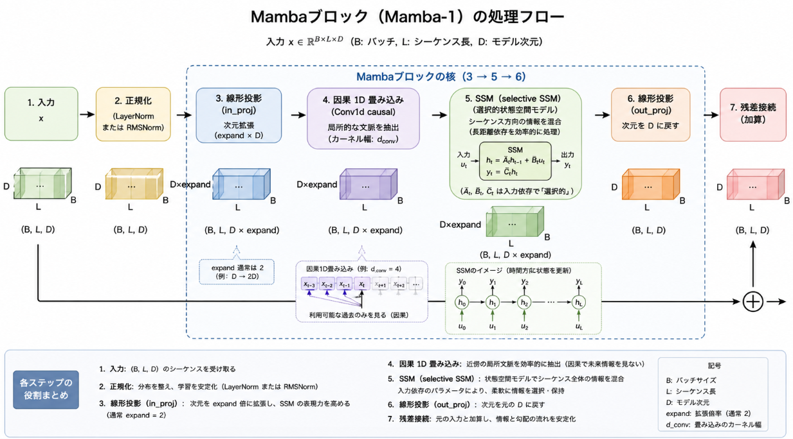
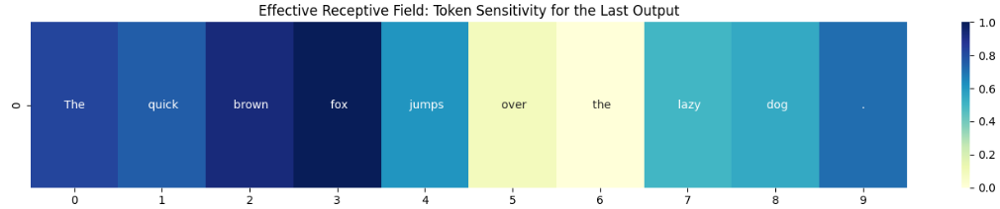

次回までの話で文章のような時系列から情報の保持に選択制を持たせる **Selective SSM** について扱いました。
今回はMambaのSelective SSMを集約した **ブロック拡張**について扱います。


## Mambaの主要機能
そもそもMambaの主要機能が何かについて軽く触れていきます。
ずばりMambaの精度に直接的な影響を持つ技術要素は以下の3つです。

### 1. Selective SSM

- Mambaの最大の特徴は、SSMのパラメータ（B, C, Δ）を**入力に依存させて時間変化させる**ことです。
- これにより、TransformerのAttentionのように「どの情報を保持し、どれを忘れるか」を**入力ごとに動的に選択**できるようになります。
- この「選択性」が、言語・音声・ゲノミクスなどでTransformer級の精度を達成する**最も直接的な要因**です。[Mamba: Linear-Time Sequence Modeling with Selective State Spaces](https://arxiv.org/abs/2312.00752)

### 2. 因果1D畳み込み（Causal 1D Convolution）

- 畳み込みは**局所的な文脈モデリング**を担い、近傍トークン間の依存関係を事前に捉えます。
- これにより、SSMに渡る前の表現が豊かになり、**長距離依存だけでなく短距離のパターンも効率的に学習**できるようになります。
- 実験的にも、この局所畳み込みを入れることで言語モデリング精度が向上することが報告されています。[GitHub - state-spaces/mamba](https://github.com/state-spaces/mamba)


### 3. ブロック拡張（Block expansion）と簡素化されたブロック構造

- expand による次元拡張は、**チャネル方向の情報混合（TransformerのMLPに相当）** と**シーケンス方向の混合（SSM）** を一つのブロックに統合する役割があります。
- これにより、表現力が向上し、Transformerのような明示的なMLP層がなくても十分な非線形変換能力を確保できます。
- 結果として、**モデルの表現力そのもの**に直接影響し、精度向上に寄与します。[Mamba: Linear-Time Sequence Modeling with Selective State Spaces](https://arxiv.org/abs/2312.00752)

-
### 補足：精度に「間接的」に効く要素

- **ハードウェアを意識した並列アルゴリズム**や**混合精度訓練**は、主に**計算効率・安定性**のための要素です。
  - これらがなければ、大規模モデルを現実的な時間で学習できなかったり、数値不安定で学習が破綻したりするため、**結果として精度に影響**しますが、表現力そのものを増やすわけではありません。
- したがって、「精度に直接影響」という意味では、上記3つ（時間依存SSM、因果畳み込み、ブロック拡張）が中心的な役割を果たします。[Mamba: Linear-Time Sequence Modeling with Selective State Spaces](https://arxiv.org/abs/2312.00752)[GitHub - state-spaces/mamba](https://github.com/state-spaces/mamba)

## Mambaのブロック拡張について

Mambaの「ブロック拡張（Block expansion）と簡素化されたブロック構造」は、**チャネル方向の情報混合（MLP相当）** と**シーケンス方向の混合（SSM）** を一つのブロックに統合する設計です。
Transformerでは「Attention層＋MLP層」という2段構成になっているのに対し、Mambaでは**1つのMambaブロックで両方の役割を担う**ようにしています。

以下、その詳細を順に説明します。

### 1. Mambaブロックの基本構造（Mamba-1を例に）

Mambaブロックはおおまかに次のような流れです（実装は `mamba_simple.py` などにあります[GitHub - state-spaces/mamba](https://github.com/state-spaces/mamba)）。



1. **入力**: シーケンス長 `L`、次元 `D` の入力 `x`（形状 `(B, L, D)`）
2. **LayerNorm**（あるいはRMSNorm）による正規化
3. **線形投影（in_proj）**で次元を `D * expand` に拡張（`expand` は通常 2）
4. **因果1D畳み込み**で局所的な文脈を抽出
5. **SSM（selective SSM）**でシーケンス方向の情報を混合
6. **線形投影（out_proj）**で次元を `D` に戻す
7. **残差接続**で元の入力と加算

このうち、**3→5→6** の部分が「ブロック拡張＋SSM」の核です。

### 2. expand によるチャネル方向の情報混合（MLP相当）

__2.1 expand の役割__

Mambaブロックでは、入力次元 `D` を `expand` 倍（例: 2倍）に拡張してからSSMを適用します。

- 入力: `x`（形状 `(B, L, D)`）
- `in_proj`: `x → (B, L, D * expand)`
- SSMはこの拡張された次元 `D * expand` に対して作用します。

この `expand` は、**チャネル方向の情報混合（MLP相当）**と**SSMによるシーケンス方向の混合**を**一つのブロックに統合するための鍵**です。

__2.2 TransformerのMLPとの対応__

Transformerの標準的なブロックは、おおまかに

1. **Multi-Head Attention（MHA）**: シーケンス方向の情報混合
2. **MLP（Feed-Forward Network）**: チャネル方向の情報混合（次元拡張→非線形→次元縮小）

という2段構成です。

Mambaでは、これを

- **SSM部分**が「シーケンス方向の混合（MHA相当）」
- **expand を含む線形投影＋非線形（SiLUなど）** が「チャネル方向の混合（MLP相当）」

として、**1つのブロック内に統合**しています。

### 3. SSM部分によるシーケンス方向の混合（Attention相当）

MambaのSSMは、離散化された状態空間モデル

$${ h_t = \bar{A} h_{t-1} + \bar{B} x_t,\quad y_t = C h_t }$$

をベースにしつつ、**B, C, Δ（離散化ステップ）を入力依存にすることで「選択的」** にしています[Mamba: Linear-Time Sequence Modeling with Selective State Spaces](https://arxiv.org/abs/2312.00752)。

- これは、**シーケンス方向の情報をどのように伝播・忘却するか**を制御する部分であり、TransformerのAttentionに相当する役割です。
- ただし、Attentionが全トークン間のペアワーズな相互作用（O(L²)）を計算するのに対し、SSMは**線形時間（O(L)）** で長距離依存を扱えます。

このSSMは、**expand されたチャネル次元**に対して作用します。
つまり、**「チャネル方向に豊かな表現」を持ったベクトル列**に対して、シーケンス方向の混合を行う構造になっています。

### 4. 統合の効果：表現力と精度への影響

__4.1 チャネル混合とシーケンス混合の同時最適化__

Mambaブロックでは、

1. `in_proj` で次元を拡張し、チャネル方向の線形結合（＋非線形）を行う
2. SSMでシーケンス方向の情報を混合する
3. `out_proj` で次元を戻す

という流れで、**チャネル方向の変換とシーケンス方向の変換が一体となって学習**されます。

- Transformerでは、MHAとMLPが**別々の層**として最適化されますが、Mambaでは**一つの連続した計算グラフ**として最適化されます。
- これにより、**チャネル方向の表現とシーケンス方向の依存関係がより緊密に協調**しやすくなります。

__4.2 MLP層が不要になる理由__

Mamba論文では、Mambaを「AttentionもMLPブロックも使わない、シンプルなエンドツーエンドのニューラルネットワーク」と表現しています[Mamba: Linear-Time Sequence Modeling with Selective State Spaces](https://arxiv.org/abs/2312.00752)。

- これは、**expand を含む線形投影＋SSM**の組み合わせが、Transformerの「MHA＋MLP」に相当する表現力をすでに備えているためです。
- 実際、Mambaは言語・音声・ゲノミクスなどでTransformer級の精度を達成しており、明示的なMLP層がなくても十分な非線形変換能力を持っていることが示されています。

__4.3 ブロック構造の簡素化による利点__

- **パラメータ効率**: Attention＋MLPという2層構成に比べ、1ブロックで済むため、パラメータ配置がシンプルになります。
- **深さの効率**: 論文では「2つのMambaブロック ≒ 1つのTransformer層（MHA+MLP）」と述べられており、同じ深さでより効率的に表現力を積み上げられます[GitHub - state-spaces/mamba](https://github.com/state-spaces/mamba)。
- **学習の安定性**: ブロック構造が単純なため、勾配の流れがシンプルになり、深いモデルでも学習が安定しやすくなります。

### 5. まとめ

Mambaの「ブロック拡張（Block expansion）と簡素化されたブロック構造」は、

- **expand** による次元拡張でチャネル方向の情報混合（MLP相当）を実現
- **SSM** でシーケンス方向の混合（Attention相当）を実現
- これらを**一つのブロックに統合**することで、Transformerの「MHA＋MLP」に匹敵する表現力をよりシンプルな構造で実現

する設計です。

この統合により、Mambaは**明示的なMLP層を持たないにもかかわらず、十分な非線形表現力と高い精度**を達成しています[Mamba: Linear-Time Sequence Modeling with Selective State Spaces](https://arxiv.org/abs/2312.00752)[GitHub - state-spaces/mamba](https://github.com/state-spaces/mamba)。


## 実験

先程のMambaブロックを積層されたものがMambaです。
Mambaブロックの働きを見る場合、Transformerの代替が出来ているかを確認してみるとわかりやすいかと考えました。

そこで、Mambaというモデルが「最終的な答えを出す際に、過去のどの単語をどれくらい重要視しているか」を可視化してみようと思います。


### 実験内容

__1. 入力ベクトルへの「マーキング」__

通常、AIは単語を数字（ID）として処理しますが、このコードでは単語を**ベクトル（Embedding）** に変換した直後の段階で、「このベクトルが後でどう変化するか監視する」という設定（`requires_grad_(True)`）を行っています。

__2. 「出力結果」から「入力」への逆引き（感度分析）__

ここがこのコードの最も賢い部分です。
1.  **順伝播（Forward）**: 普通に文章を最後まで読み込ませます。
2.  **ターゲット決定**: 最後の単語（今回の例では "dog"）の計算結果に注目します。
3.  **逆伝播（Backward）**: 最後の単語の計算結果から、**時間を逆行するように**勾配（Gradient）を計算します。


__3. 「影響力」の数値化__

逆流してきた「勾配」は、**「入力の単語が少し変化したとき、出力がどれだけ激しく変化するか」** という感度を表しています。
- **勾配が大きい単語**: 出力結果を左右した「重要な情報」。
- **勾配が小さい単語**: 出力結果にはあまり関係なかった「読み飛ばされた情報」。

__4. ヒートマップによる可視化__
最後に、各トークンの影響力を 0.0〜1.0 の範囲に正規化して、色鮮やかなグラフ（ヒートマップ）に出力します。


```python
import torch
from transformers import AutoTokenizer, MambaForCausalLM
import matplotlib.pyplot as plt
import seaborn as sns
import numpy as np

def analyze_mamba_hf_sensitivity(model_name, text):
    # 1. モデルとトークナイザーのロード
    # device_map="auto" でGPUへ。CUDAが使えない場合は "cpu" になります。
    tokenizer = AutoTokenizer.from_pretrained(model_name)
    model = MambaForCausalLM.from_pretrained(model_name, torch_dtype=torch.float32).cuda()
    model.eval()

    # 2. 入力の準備
    inputs = tokenizer(text, return_tensors="pt").to("cuda")
    input_ids = inputs["input_ids"]
    token_labels = [tokenizer.decode([t]) for t in input_ids[0]]

    # 3. Embedding層の出力を取得し、勾配を有効化
    # Hugging Face版MambaのEmbedding層は model.backbone.embeddings
    embeddings = model.backbone.embeddings(input_ids)
    embeddings.retain_grad()
    embeddings.requires_grad_(True)

    # 4. 順伝播 (Forward Pass)
    # 直接 model(inputs) とすると Embedding 計算が重複するため、
    # inputs_embeds 引数を使用して計算を開始します
    outputs = model(inputs_embeds=embeddings, output_hidden_states=True)
    last_hidden_state = outputs.hidden_states[-1] # 最終レイヤーの出力
    
    # 5. ターゲットの指定 (最後のトークンのベクトルを対象にする)
    target_token_idx = -1 
    # 最後のトークンの出力ベクトルのノルムをスカラーとして取得
    target_value = last_hidden_state[0, target_token_idx].norm()

    # 6. 逆伝播 (Backward Pass)
    model.zero_grad()
    target_value.backward()

    # 7. 勾配の抽出と加工
    if embeddings.grad is not None:
        # (batch, seq_len, d_model) -> 各トークンの寄与度 (seq_len,)
        grads = embeddings.grad.abs().sum(dim=-1).squeeze(0)
        
        # 可視化のために 0.0 - 1.0 にスケーリング
        grads_norm = (grads - grads.min()) / (grads.max() - grads.min() + 1e-8)
        scores = grads_norm.cpu().detach().numpy()
    else:
        print("Error: Gradient not captured.")
        return None, None

    return token_labels, scores

def plot_sensitivity(tokens, scores):
    plt.figure(figsize=(14, 3))
    sns.heatmap([scores], annot=[tokens], fmt="", cmap="YlGnBu", cbar=True)
    plt.title("Effective Receptive Field: Token Sensitivity for the Last Output")
    plt.xlabel("Input Sequence")
    plt.tight_layout()
    plt.show()

# --- 実行 ---
model_id = "state-spaces/mamba-130m-hf"  # 軽量な130Mモデル
sample_text = "The quick brown fox jumps over the lazy dog."

tokens, scores = analyze_mamba_hf_sensitivity(model_id, sample_text)

if tokens and scores is not None:
    plot_sensitivity(tokens, scores)
```


### 実験結果
Mambaは「選択的状態空間モデル（Selective SSM）」と呼ばれます。このコードを実行して結果を見ると、以下のような「Mambaのクセ」が視覚的にわかります。

Mambaへの入力は "The quick brown fox jumps over the lazy dog." に対して、ヒートマップと呼ばれる重要度の濃淡を可視化しています。

Mambaが最も重要なワードと選択したのは"fox"でfoxの周辺情報が重要度高いとされています。
個人的にはfoxの動作を示す"jumps"も2番目くらいに重要と思いますが、最重要が"fox"であることは個人的にも同感です。



- **情報の取捨選択**: 意味のない冠詞（theなど）よりも、意味を持つ名詞（fox, dog）の方が色が濃くなる傾向があります。
- **忘却と維持**: 非常に長い文章を入れたとき、Mambaが古い情報を「忘却」しているのか、あるいは「ゲート」を開いて遠くの情報を「維持」しているのかが、色の濃淡として現れます。

## 総括

Mambaの**ブロック拡張（Block expansion）** は、入力次元を `expand` 倍（例: 2倍）に広げてからSSMを適用し、その後で元の次元に戻す仕組みです。

- **役割**:  
  - 拡張された次元で**チャネル方向の情報混合（TransformerのMLP相当）** を行う  
  - SSM部分で**シーケンス方向の混合（Attention相当）** を行う  
  → これらを**1つのブロックに統合**し、Transformerのような明示的なMLP層を不要にします。

- **効果**:  
  - 1ブロックで「チャネル混合＋シーケンス混合」を同時に最適化できるため、**表現力が高く、構造がシンプル**  
  - 実験的には、Transformer級の精度を**より少ない層・シンプルな構造**で達成できることが示されています[Mamba: Linear-Time Sequence Modeling with Selective State Spaces](https://arxiv.org/abs/2312.00752)[GitHub - state-spaces/mamba](https://github.com/state-spaces/mamba)。

要するに、**「MLP＋Attention」を1つの拡張ブロックにまとめたもの**がMambaのブロック拡張です。

