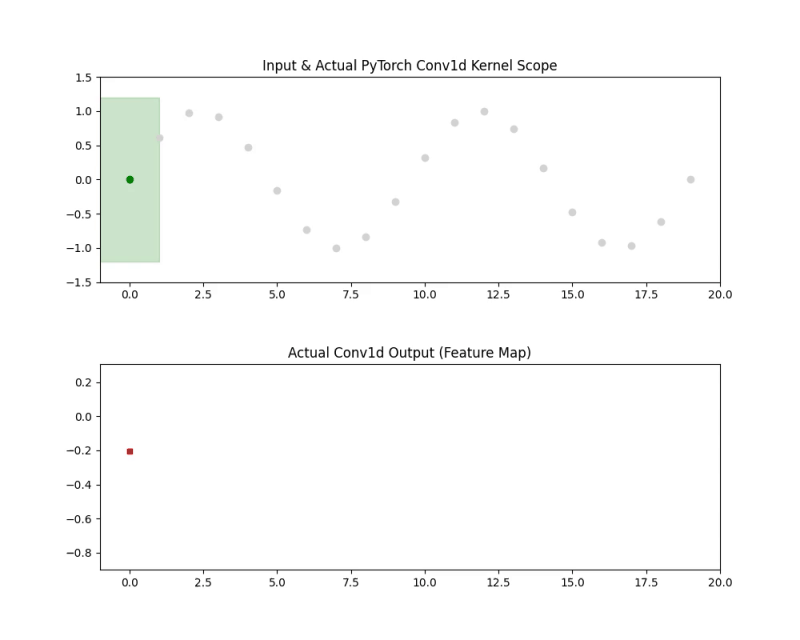

先日説明したSSMに対して、Mambaブロックの構成上、もう一つ重要な要素があります。
**因果1D畳み込み（Causal 1D Convolution）** と呼ばれるものです。
Mambaにおける因果1D畳み込みは、SSMに入力する前に**局所的な文脈情報**を抽出するための短いフィルタ畳み込みです。


## 1. 何をするものか

- 入力シーケンス `x`（形状 `(B, L, D)`）に対して、**1次元の畳み込み**を行います。
- **因果的（causal）**であるため、各時刻 `t` の出力は、`t` 以前の入力（例: `t, t-1, t-2, ...`）のみに依存します。
- カーネルサイズは小さく（Mamba実装では典型的に **4**）、近傍トークン間の短い依存関係を捉えます[GitHub - state-spaces/mamba](https://github.com/state-spaces/mamba)。


>__1次元の畳み込み__  
>**1次元の畳み込み（1D convolution）** は、**シーケンス方向（時間やトークン順）に沿ってフィルタをスライドさせ、局所的なパターンを抽出する操作**です。
>- 入力: シーケンスデータ（例: 音声波形、トークン列の埋め込み）
>- フィルタ（カーネル）: 小さな重みベクトル（例: サイズ3）
>- 動作: フィルタを1ステップずつずらしながら、各位置で「入力の局所窓」と「フィルタ」の内積を計算し、出力シーケンスを生成
>**イメージ**  
>入力: `[x1, x2, x3, x4, x5]`  
>フィルタ: `[w1, w2, w3]`  
>出力の1要素: `y2 = w1*x1 + w2*x2 + w3*x3`（フィルタが位置2にかかっている場合）
>**特徴**  
>- **局所性**: 各出力は近傍の数サンプル（トークン）のみに依存
>- **重み共有**: 同じフィルタを全位置で使い回すため、パターンの位置に依存しない特徴抽出が可能
>- **1次元**: シーケンス方向（時間軸）のみを扱うため「1D」

Mambaでは、この1D畳み込みを**因果的（未来を見ない）** に適用し、SSMに入る前の局所文脈を効率的に捉えています。

## 2. どこで使われるか

Mambaブロック内では、おおまかに次の順で処理されます。

1. `in_proj` で次元を `D * expand` に拡張
2. **因果1D畳み込み**で局所文脈を抽出
3. SSM（selective SSM）で長距離依存を処理
4. `out_proj` で次元を戻す

因果1D畳み込みは上記の2ステップ目で使われています。
**SSMに入る直前**に因果1D畳み込みが挟まれており、SSMが扱う表現を「局所的に整えてから」長距離処理に渡す役割を担います。


## 3. なぜ必要か

### ザックリと説明すると
- [SSM](https://note.com/novel_fowl5247/n/n327255f4f778)は**長距離依存**を扱うのが得意ですが、**非常に近いトークン間の細かいパターン**（例: 2〜3トークン程度の局所的な関係）は、畳み込みの方が効率的に捉えられます。
- 因果1D畳み込みを入れることで、
  - **局所的な文脈**を事前に抽出
  - SSMはその上で**長距離の情報選択・伝播**に集中
- これにより、言語モデリングなどのタスクで**精度が向上**することが報告されています[Mamba: Linear-Time Sequence Modeling with Selective State Spaces](https://arxiv.org/abs/2312.00752)。

### 長距離依存とトークンのパターンの理解が必要な理由

長距離依存と局所パターンの両方が必要なのは、**現実のシーケンスデータ（文章・音声など）が、本質的に「近くの細かい構造」と「遠くの文脈」の両方に依存している**からです。

__1. 局所パターン（短距離依存）が必要な理由__

**例：自然言語**

- 「I don’t like apples, but I do like bananas.」  
  ここで「do like」という**2〜3トークンの局所的な組み合わせ**が「肯定」の意味を決めています。
- こうした**熟語・句動詞・否定＋動詞の組み合わせ**などは、多くの場合**隣接またはごく近いトークン間の関係**として現れます。

**例：音声・ゲノム**

- 音声では、**数サンプル〜数十サンプル程度の短い波形パターン**が音素や音節を形成します。
- ゲノムでは、**隣接する塩基の組み合わせ**が特定のアミノ酸や制御シグナルに対応します。

→ こうした **「近くの細かい構造」を効率的に捉える** には、畳み込みのような局所操作が適しています。

__2. 長距離依存が必要な理由__

**例：自然言語**

- 「The cat that chased the mouse that ate the cheese that was left on the table **was** very fast.」  
  主語「The cat」と動詞「was」の一致は、**文の最初と最後**にまたがる長距離依存です。
- 代名詞の照応（「He」が誰を指すか）、条件文の前提と結論、ストーリーの一貫性などは、**文を超えた長い距離**に依存します。

**例：音声・ゲノム**

- 音声では、**文レベル・発話レベルのプロソディ（抑揚）** や、前の文脈に応じた発音変化が長距離依存です。
- ゲノムでは、**離れた領域にあるプロモーターとエンハンサー**が協調して遺伝子発現を制御するなど、長距離の相互作用が重要です。

→ こうした **「遠くの文脈に依存する構造」を捉える**には、SSMやAttentionのような長距離モデリングが不可欠です。

__3. なぜ両方とも「能力」として必要か__

- **局所パターンだけ**だと、文の細かい表現はできても、全体の構造・一貫性・長い依存関係を捉えられません。
- **長距離依存だけ**だと、文全体の流れは捉えられても、熟語や細かい構文パターン、音声の細かい波形、ゲノムの短いモチーフなどを効率的に表現できません。

Mambaは、

- **因果1D畳み込み**で局所パターンを効率的に抽出
- **SSM**で長距離依存を選択的に伝播

という**ハイブリッド設計**を採用することで、両方の能力をバランスよく備えています[Mamba: Linear-Time Sequence Modeling with Selective State Spaces](https://arxiv.org/abs/2312.00752)。


## 4. 実装

### 実装上のコツ

因果畳み込みを実装する際のコツを整理します。
単に `nn.Conv1d` を使うだけではなく、Mambaの設計思想（効率と因果性の両立）を再現するためのポイントは以下の3点に集約されます。

__1. 「手動パディング」と「スライシング」をセットで覚える__

PyTorchの標準的な `nn.Conv1d` には `padding='causal'` という設定は存在しません（※一部のライブラリを除く）。そのため、以下のフローが定石です。

* **手順**:
1. `F.pad` を使い、入力テンソルの左側（時系列の先頭方向）に `(kernel_size - 1)` 個の 0 を追加する。
2. `padding=0` の設定で畳み込みを行う。


* **コツ**:
もし `padding='same'` のような設定で計算してしまった場合は、出力の末尾を `kernel_size - 1` 分だけ切り落とす（スライシングする）ことで因果性を後付けすることも可能ですが、最初から左パディングする方がメモリ効率やコードの可読性が高くなります。

__2. Depthwise（Channel-wise）の実装を徹底する__

Mambaにおける畳み込みは、全チャンネルを混ぜ合わせる一般的な畳み込み（Dense Convolution）ではありません。各チャンネルが独立して自身の過去を参照する「Depthwise Convolution」です。

* **実装のコツ**:
`nn.Conv1d` の引数で **`groups=d_model`**（入力チャンネル数と同じ値）を指定してください。
* **メリット**:
* **計算量の大幅な削減**: パラメータ数が $d_{model} \times d_{model} \times k$ から $d_{model} \times k$ に削減されます。
* **SSMとの相性**: Mambaの本質は「チャンネルごとに独立した状態空間（SSM）」を解くことにあるため、その前処理である畳み込みもチャンネルを混ぜないのが論理的です。


__3. 学習時と推論時の「状態（State）」の扱い__

Mambaを「推論（RNNモード）」で動かす場合、畳み込み層も一工夫必要です。

* **学習時**:
シーケンス全体が既知なので、一気に畳み込みを適用できます。
* **推論時（1トークンずつ生成）**:
1トークン生成するたびに、**過去の `kernel_size - 1` 個分の入力トークンを「隠れ状態」として保持**しておく必要があります。
* **コツ**:
推論用関数では、新しいトークンが来るたびにキュー（FIFOバッファ）を更新するように実装します。これを忘れると、推論時に毎回シーケンス全体を再計算することになり、Mambaの強みである「推論の速さ」が失われてしまいます。

__補足：なぜ「3」なのか__

Mambaの論文や公式実装では `kernel_size=4` がデフォルトとしてよく使われます。これは、局所的な平滑化や特徴抽出には 4 ステップ（現在 + 過去 3 つ）あれば十分であり、それ以上の長い依存関係は、直後の **SSM（Selective SSM）** が完璧に処理してくれるという役割分担が明確だからです。

「畳み込みは近視眼的なノイズ除去、SSMは長期的な記憶」と割り切って実装するのが、Mambaを理解する近道です。


### 本物の因果畳み込み層を用いた可視化コード

実際に因果畳み込みを実装の上で、動作を可視化するコードを作成してみました。

```python
import torch
import torch.nn as nn
import numpy as np
import matplotlib.pyplot as plt
from matplotlib.animation import FuncAnimation

# --- 1. 真の因果畳み込み層の定義 ---
class MambaCausalConv(nn.Module):
    def __init__(self, d_model, kernel_size):
        super().__init__()
        self.kernel_size = kernel_size
        # Mambaの構成を模して、各チャンネル独立（groups=d_model）の1D畳み込み
        self.conv = nn.Conv1d(
            in_channels=d_model,
            out_channels=d_model,
            kernel_size=kernel_size,
            groups=d_model,
            padding=0 # 手動でパディングするため0
        )
        
    def forward(self, x):
        # x: (Batch, Channels, SeqLen)
        # 左側だけにパディングを施すことで因果性を担保
        x_padded = nn.functional.pad(x, (self.kernel_size - 1, 0))
        return self.conv(x_padded)

# --- 2. データの準備 ---
seq_len = 20
d_model = 1  # 可視化のため1チャンネル
model = MambaCausalConv(d_model, kernel_size=4)
model.eval()

# 入力データ (Batch=1, Channel=1, SeqLen=20)
input_tensor = torch.sin(torch.linspace(0, 4 * np.pi, seq_len)).view(1, 1, -1)
with torch.no_grad():
    # 全体の出力を計算しておく
    full_output = model(input_tensor).squeeze().numpy()

input_data = input_tensor.squeeze().numpy()

# --- 3. 可視化のセットアップ ---
fig, (ax1, ax2) = plt.subplots(2, 1, figsize=(10, 8))
plt.subplots_adjust(hspace=0.4)

def setup_plot():
    ax1.set_xlim(-1, seq_len)
    ax1.set_ylim(-1.5, 1.5)
    ax1.set_title("Input & Actual PyTorch Conv1d Kernel Scope")
    ax2.set_xlim(-1, seq_len)
    ax2.set_ylim(full_output.min() - 0.5, full_output.max() + 0.5)
    ax2.set_title("Actual Conv1d Output (Feature Map)")

# プロット要素
input_line, = ax1.plot(range(seq_len), input_data, 'o', color='lightgray')
kernel_rect = plt.Rectangle((0, -1.2), 4, 2.4, color='green', alpha=0.2, label='Conv Kernel')
ax1.add_patch(kernel_rect)
active_dots, = ax1.plot([], [], 'o', color='green')
out_line, = ax2.plot([], [], 's-', color='red', markersize=4)

def update(frame):
    # カーネルの範囲を表示 (現在のフレームがカーネルの右端)
    k_size = model.kernel_size
    rect_x = frame - (k_size - 1)
    kernel_rect.set_x(rect_x)
    kernel_rect.set_width(k_size)
    
    # 実際に計算に使われている入力点
    indices = np.arange(max(0, rect_x), frame + 1).astype(int)
    active_dots.set_data(indices, input_data[indices])
    
    # そこまでの出力を描画
    out_line.set_data(np.arange(frame + 1), full_output[:frame + 1])
    
    return kernel_rect, active_dots, out_line

setup_plot()
ani = FuncAnimation(fig, update, frames=range(seq_len), blit=True, interval=300)

# 保存する場合は以下のコメントを外してください
# ani.save('real_mamba_conv.mp4', writer='ffmpeg')
plt.show()

```

__結果から読み取れること__

この動画を動かすと、**「赤い出力点（計算結果）」が決まる瞬間に、上の段の「緑の枠（カーネル）」がどの範囲の入力データを参照しているか**が正確にわかります。

- 枠が右へ進むにつれ、過去のデータのみを拾い上げていること
- 左端の開始地点では、パディング（0）が含まれるため出力が小さくなる、あるいは変化することが確認できます。



## 5. まとめ

Mambaの因果1D畳み込みは、

- **小さなカーネルサイズの1D畳み込み**
- **因果的（未来を見ない）**
- **SSMの直前で局所文脈を抽出する役割**

を持つモジュールであり、**局所依存を効率的に扱うことで、SSMの長距離処理能力を補完し、全体の精度向上に寄与**しています[Mamba: Linear-Time Sequence Modeling with Selective State Spaces](https://arxiv.org/abs/2312.00752)[GitHub - state-spaces/mamba](https://github.com/state-spaces/mamba)。


