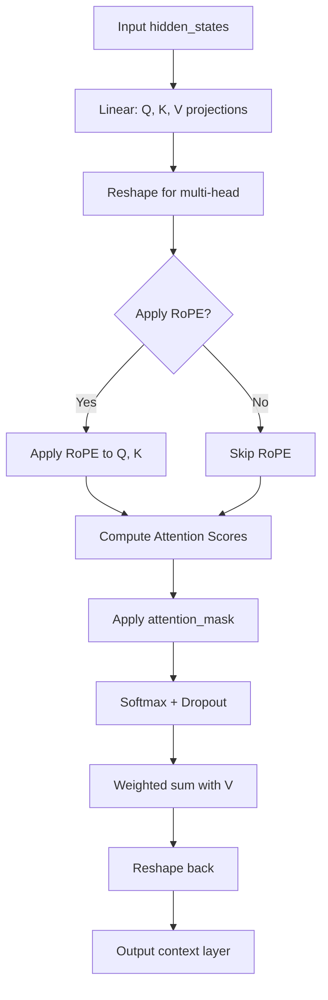

[先日のRoPEの特性検証](https://yoshishinnze.hatenablog.com/entry/2026/07/31/000000)のうち1つ目：基本性能の維持（Short-context Robustnessの検証）について扱っていきます。

ですが、通常のBERTレベルでも触れるマシンがないためGoogle Colabで実験できる内容で試行を進めていこうと思います。
以前技術要素研究のため、マシンスペックが限定されていても使える[miniBERT](https://yoshishinnze.hatenablog.com/entry/2025/10/10/043000)を導入しました。
今度はこれをアテンションと位置エンコーディングを設計変更して[RoPE](https://yoshishinnze.hatenablog.com/entry/2025/10/22/000000)版miniBERTにした上でMLMで学習させた状態にしようと思います。

## RoPEとは

[こちらの記事](https://yoshishinnze.hatenablog.com/entry/2026/07/31/000000)をご一読いただければと思います。

著者の記事の内容を引用すると、

>RoPE（Rotary Positional Embedding）は、Transformerモデルにおける**位置情報の表現方法**の一種で、**トークンの埋め込みベクトルを「回転」させることで位置を表現する**手法です。
>- RoPEは、各トークンのクエリ・キー・バリュー表現に対して、**位置に応じた回転（複素平面上の位相シフト）** を適用します。
>- これにより、Attentionの内積計算が**相対位置 $m-n$ にのみ依存する形**に自然と整理され、モデルが相対的な位置関係を直接扱えるようになります。
>- 回転角は連続的なパラメータなので、**学習時より長いシーケンスにも自然に外挿できる**という利点があります。
>RoPE は、**相対位置を明示的に扱い、長さ外挿にも強い**という点で、従来の加算型位置エンコーダと比べて大きな利点があります。そのため、最近の大規模言語モデル（LLaMA 系列、GPT-NeoX 系列など）では RoPE が広く採用されています。

となります。
長文の読解で特に優位性があるため、近年のLLMには好んでRoPEが使われています。

## 評価内容
「特性検証3：基本性能の維持（Short-context Robustnessの検証）」は、「長文に強くした代償として、BERTが元々得意だった短い文（512トークン以下）のタスクでバカになっていないか」を担保するための重要な防衛的検証です。

位置表現を絶対位置からRoPEという動的な回転行列にガラリと変えたことで、近距離のトークン同士の密な関係性（例：主語と動詞の結びつきや、隣り合う単語のフレーズ感）がボヤけてしまうリスクがあります。

元の事前学習は基本的にMLMで行います。そして元の事前学習モデルと、RoPEに実装したモデルを同じ土俵で評価するならばMLMであると良いと思います。
その上で先述の近距離のトークン同士の密な関係性について、RoPEの実装の有無によりMLMで以下の点で評価を行うことを考えます。

### 1. タスクの要求が「近距離の文法的整合性」そのものであるため

MLM（穴埋め問題）を解くには、隣り合う単語のフレーズ感や、主語と動詞の結びつき（数や時制の一致）といった**局所的で密な関係性の理解が不可欠**です。
位置表現の変更によって近距離の解像度がボヤけている場合、文法的に正しい単語を推測できなくなるため、これらの指標に即座に悪化（Lossの上昇、Accuracyの低下）として現れます。つまり、短文における器用さをダイレクトに引きずり出せるタスク設定になっています。

### 2. 「予測の確信度」と「絞り込み能力」を数値化できるため

短文における「バカになっていないか」の検証には、単に正解したかどうかだけでなく、「どれだけ迷わずに正解できたか」の評価が必要です。

* **MLM Loss と Pseudo-PPL:** 正解に対する確率の高さと、候補の絞り込み度合い（迷いのなさ）を捉えます。
* **Top-5 Accuracy:** 最悪でも「5択以内」という狭い選択肢の中に正しい言葉を滑り込ませる文脈のコントロール力を捉えます。

これら3つの指標を多角的に見ることで、「近距離の関係性がボヤけて、選択肢を絞り込めずに迷っている状態」を高い感度で検出できます。

### 3. 下流タスクのバイアスを排除し、アーキテクチャの素性を比較できるため

GLUEなどの特定の分類タスクで評価しようとすると、ヘッド（出力層）の初期化や、そのタスク固有のデータセットへの過学習（過剰適合）といった外部要因がノイズとして混入します。
一般的な文章（OpenWebText）を使ったMLMによる直接評価であれば、タスク特有のバイアスを完全に排除し、**「RoPEへの変更が、純粋に短文の言語理解力にどう影響したか」というモデルそのものの素性をフェアに測定**できます。


## RoPEの実装キーポイント
前回実装確認してわかったことですが、miniBERTはモジュールレベルではBERTです。
違うのは隠れ層のサイズやレイヤ数のみでした。
ですので実装変更はBERT/miniBERT兼用と考えて頂ければと思います。

その上で BERT（絶対位置埋め込み）に **RoPE (Rotary Position Embedding)** を導入して miniBERT を構築する際の、実装上のキーポイントを整理しました。

BERTへのRoPE導入は、昨今のLLM（Llamaなど）の手法をエンコーダー型に逆輸入する形になり、表現力の向上が期待できる非常に面白い試みです。実装時に絶対に外せないポイントは以下の3点です。

### 1. 「絶対」位置から「相対」位置への概念切り替え

本家BERTは、トークンごとに固定のベクトルを足す「絶対位置埋め込み（Absolute PE）」を採用しています。

一方、RoPEは「クエリ（$Q$）とキー（$K$）のベクトルを、位置に応じた回転行列で回転させる」ことで、**アテンション行列の計算時に結果として相対的な位置関係（距離）が数式上あぶり出される**仕組みです。
したがって、実装時の最初のステップとして、**既存の `Embedding` レイヤーにある `position_embeddings` を完全に削除（またはスキップ）** してください。

### 2. 回転処理（Rotary Embedding）を差し込む「位置」

RoPEを適用する正しいタイミングは、**「$Q$ と $K$ に線形変換（Linear）をかけた直後、かつ $Q K^T$ の行列積（Attention Score）を計算する直前」** です。値（$V$）には回転をかけません。

Hugging Faceの `BertSelfAttention` などの構造をベースにする場合、具体的には以下の位置に自作の回転処理（`apply_rotary_emb`）を差し込みます。

```python
# 1. Ｑ, Ｋ, Ｖの投影 (通常通り)
mixed_query_layer = self.query(hidden_states)
mixed_key_layer = self.key(hidden_states)
mixed_value_layer = self.value(hidden_states)

# 2. [重要] ここで各ヘッドの次元に reshape した後、Q と K に RoPE を適用
query_layer = self.transpose_for_scores(mixed_query_layer)
key_layer = self.transpose_for_scores(mixed_key_layer)

# 自作の RoPE 関数で Q と K を回転させる
query_layer = apply_rotary_emb(query_layer, position_ids)
key_layer = apply_rotary_emb(key_layer, position_ids)

# 3. あとは通常通りのアテンション計算へ
attention_scores = torch.matmul(query_layer, key_layer.transpose(-1, -2))

```

### 3. 計算効率化のための複素数トリック（またはインデックスの工夫）

RoPEの理論通りに2次元ずつの回転行列（2x2）を愚直に作って行列積を行うと、計算コストが跳ね上がります。そのため、Llama等でも使われている「偶数インデックスと奇数インデックスを入れ替えて符号を変える」トリック（`rotate_half`）をPyTorchで実装するのが一般的です。

ヘッドの次元数（`head_dim`）を半分に分け、以下のように計算をインプレイス（または[高効率なテンソル演算](https://yoshishinnze.hatenablog.com/entry/2025/10/01/043000)）で行います。

$$R_{\Theta, m}^d \mathbf{x} = \begin{pmatrix} \mathbf{x}_1 \\ \mathbf{x}_2 \\ \vdots \\ \mathbf{x}_{d/2} \end{pmatrix} \odot \cos m\theta + \begin{pmatrix} -\mathbf{x}_{d/2+1} \\ \vdots \\ -\mathbf{x}_d \\ \mathbf{x}_1 \\ \vdots \\ \mathbf{x}_{d/2} \end{pmatrix} \odot \sin m\theta$$

これをPyTorchで実装する際のコアパーツは以下のようになります。

```python
def rotate_half(x):
    """xの後半と前半を入れ替えて、後半の符号を反転させる"""
    x1 = x[..., :x.shape[-1] // 2]
    x2 = x[..., x.shape[-1] // 2:]
    return torch.cat((-x2, x1), dim=-1)

def apply_rotary_emb(x, cos, sin):
    # cos, sin のシェイプをブロードキャスト可能な形 [batch, head, seq_len, head_dim] に調整
    return (x * cos) + (rotate_half(x) * sin)

```

> `rotate_half` は、**RoPE（Rotary Positional Embedding）の「回転」を実数ベクトルで効率的に計算するためのトリック**です。
>__1. RoPE の数式（複素平面での回転）__  
>RoPE では、各次元ペア $(x_{2k}, x_{2k+1})$ を複素数 $z_k = x_{2k} + i x_{2k+1}$ とみなし、位置 $m$ に応じて
$$
z_k' = z_k \cdot e^{i m \theta_k}
$$
>と回転させます。  
これを実数で書くと
>$$
\begin{aligned}
x_{2k}' &= x_{2k} \cos m\theta_k - x_{2k+1} \sin m\theta_k \\
x_{2k+1}' &= x_{2k} \sin m\theta_k + x_{2k+1} \cos m\theta_k
\end{aligned}
>$$
>となります。
>__2. `rotate_half` の役割__  
この式をテンソル演算でまとめて書くと、
>$$
\text{rotated} = x \odot \cos + \text{rotate\_half}(x) \odot \sin
>$$
>という形になります。  
>`rotate_half` は
>- ベクトルの前半（偶数インデックス相当）と後半（奇数インデックス相当）を入れ替え
>- 後半の符号を反転
>することで、上記の「$\cos$ 項と $\sin$ 項を組み合わせた回転」を一度のテンソル演算で表現しています。
>__3. なぜこの形で回転になるか__
>`x1 = x[..., :d/2]` が偶数インデックス側、`x2 = x[..., d/2:]` が奇数インデックス側に対応します。  
`torch.cat([-x2, x1], dim=-1)` は
>- 前半に `-x2`（奇数側を符号反転して持ってくる）
>- 後半に `x1`（偶数側を持ってくる）
>という並び替えをしており、これに $\sin$ を掛けることで、元の回転行列の $\sin$ 項の符号付き組み合わせを再現しています。


※事前学習（MLM）の前に、あらかじめ最大系列長（`max_position_embeddings`）分の `cos` と `sin` の値をキャッシュ（固定テンソルとして保持）しておくことで、毎ステップの余計な三角関数の計算を減らすことができます。

### 4. RoPE実装時の処理フロー図

実装の処理フローは以下のようになります。



### 5. RoPEを組み込む意味
RoPEを組みこむ意味について改めて説明します。

RoPEを組み込む前後で変わるのは、**「クエリ（Q）とキー（K）の内積が位置にどう依存するか」という振る舞い**です。  
具体的には、RoPEを組み込むことでアテンションは**位置が離れるほど内積が小さくなる（＝相関が減衰する）** ように設計されています。

__1. RoPE適用前のQK（位置情報なし）__

- Q・K は単に「トークンの内容ベクトル」です。
- 内積 `Q_i @ K_j^T` は、**内容の類似度**だけに依存します。
  - 例：`i=1`（「猫」）と `j=2`（「犬」）は近い意味なので内積が大きい。
  - しかし、`i=1`（「猫」）と `j=100`（「猫」）は、**位置が離れていても内積が同じ**になります。
- つまり、**位置が離れても内容が同じなら相関が高いまま**で、長い文脈では「遠くのトークン」との関係が強くなりすぎる問題があります。


__2. RoPE適用後のQK（位置情報あり）__

RoPEは、クエリ（Q）とキー（K）の各次元を**位置に応じて回転**させます。

- 位置が近い（`|i - j|` が小さい）  
  → 回転角の差が小さい  
  → ベクトルの向きがほぼ同じ  
  → 内積が大きい（相関が高い）

- 位置が離れる（`|i - j|` が大きい）  
  → 回転角の差が大きい  
  → ベクトルの向きがバラバラ  
  → 内積が小さくなる（相関が減衰）

数式的には内積がコサイン関数で表され、位置差が大きくなるほど平均的に 0 に近づきます。  
そのため、**「内容が同じでも、位置が離れると相関が自然に減衰する」** という性質が生まれます。

数式に関する詳細は以下の記事をご参考頂ければと思います。
数式の導出から、数式の設計意図についてまとめています。

https://yoshishinnze.hatenablog.com/entry/2025/09/29/043000

__3. 何が変わるか（まとめ）__

RoPEを組み込む前後で変わるのは：

1. **位置依存性の導入**  
   - 前：内積は内容のみに依存（位置が離れても相関が高いまま）。  
   - 後：内積は内容＋位置差に依存（位置が離れると相関が減衰）。

2. **長距離依存の制御**  
   - 前：遠くのトークンとも強い相関を持ちやすく、ノイズが増える可能性。  
   - 後：近傍のトークンとの相関が強く、遠くのトークンとは自然に弱くなる。

3. **計算上のメリット**  
   - RoPEは**線形演算（回転）** として実装できるため、Attention の計算グラフに自然に組み込めます。  
   - 相対位置情報を**乗算的に**埋め込むため、学習が安定しやすい。

__4. 直感的なイメージ__

- **RoPE適用前**：  
  「猫」という単語は、文のどこにあっても同じように「猫」として扱われる。
- **RoPE適用後**：  
  「猫」は、近くの単語とは強く関連し、遠くの単語とは弱く関連する。  
  → **位置に応じた「文脈の重み付け」** が自動的に行われる。

このように、RoPEは **「内容ベクトルに位置情報を乗せる」ことで、Attention が自然に近傍優先になる** ように設計されています。


数式の話だけではイメージしずらいです。
ということでRoPEによる位置インデックス（$pos$）および各次元（$i$）ごとの値（$\cos$ または $\sin$ の回転成分）を可視化してみます。


この画像の意味については以下通りです。

__4-1. 軸と要素の意味__

* **縦軸（Position Index $pos$ : $0 \sim 63$）**
* 文章中の「何番目のトークンか（単語の位置）」を表します。
* 上（0番目）から下（63番目）に向かって文章が進んでいきます。


* **横軸（Dimension Index $i$ : $0 \sim 63$）**
* トークン表現ベクトル（Head Dimensionなど）の次元インデックスです。
* 偶数インデックス（0, 2, 4...）には $\cos(pos \cdot \theta_k)$、奇数インデックス（1, 3, 5...）には $\sin(pos \cdot \theta_k)$ の値が入っています。


* **色（Encoding Value : $-1.0 \sim +1.0$）**
* 黄色＝$+1.0$、紫色＝$-1.0$ 付近を表します。
* 2次元（$\cos, \sin$）ごとの「回転角度の波形（複素平面上の位相）」を示しています。


__4-2. 画像から読み取れる3つの重要な特徴__

__① 左側（低次元領域：0〜15列付近）＝ 高周波（細かく変化）__

* **見た目:** 紫と黄色がめまぐるしく交互に現れ、細かく縞模様が変動しています。
* **直感的意味:** **「すぐ隣の単語」を見分けるための感度**を担っています。位置が $1$ ずれただけでも回転角度が大きく変化するため、隣接するトークン同士の距離や順序を鋭く検知します。

__② 中央部（15〜30列付近）＝ 緩やかな傾斜パターン__

* **見た目:** 左上から右下に向かって、斜めに流れるような綺麗なグラデーションが形成されています。
* **直感的意味:** **「数トークン〜十数トークン離れた関係性」** を捉える領域です。文章の句節やフレーズのまとまりなど、少し離れた位置関係を滑らかに表現します。

__③ 右側（高次元領域：30〜63列付近）＝ 低周波（ゆったり変化）__

* **見た目:** 縦方向（位置の変化）に対して色がほとんど変わらず、黄色の太い帯（$+1.0$ 付近）が一直線に伸びています。
* **直感的意味:** **「大域的なコンテキスト（文章全体の大まかな位置）」** を担っています。位置がかなり離れても角度がほとんど動かないため、文頭や文章全体の遠い記憶を保持するのに役立ちます。

__4-3. なぜこのような模様になるのか？（RoPEの仕組み）__

RoPEでは、次元ごとに異なる周波数 $\theta_k = \frac{1}{10000^{2k/d}}$ を割り当てます。

* 低い次元指数 $k$（左側） $\to$ $\theta_k$ が大きいため、**高速で回転**する（波長が短い）
* 高い次元指数 $k$（右側） $\to$ $\theta_k$ が非常に小さいため、**超低速で回転**する（波長が極めて長い）

この「素早く回る時計の針（左）」と「ゆっくり回る時計の針（右）」の組み合わせによって、全64位置（縦方向）のそれぞれに対し、**重なりのないユニークな回転の組み合わせ（指紋のような特徴パターン）** が一意に割り当てられていることが、このヒートマップから視覚的に確認できます。

### 注意：エンコーダー（BERT）ならではの留意点

GPTのようなデコーダー型モデルでは、過去のトークンの $K$ をキャッシュ（KV Cache）するため、RoPEの計算は「新しく入ってきた1トークン分」だけで済みます。しかし、**BERTは双方向（Bidirectional）エンコーダー**です。
毎ステップ、常に全トークン（`seq_len` 全体）に対して同時に $Q$ と $K$ の回転計算が走るため、ここの実装が非効率だと事前学習のスピード（Throughput）が著しく低下します。テンソルのスライシングや結合（`torch.cat`）ができるだけ無駄に発生しないよう、綺麗にベクトル化された実装を意識してみてください。


## 実装

### 実装コード

以下レポジトリをご参考下さい。

https://github.com/Shinichi0713/LLM-fundamental-study/tree/main/attention/rope/src

実装は以下レポジトリですが、事前学習の重みを一からするのは億劫です。
ということで変更元のminiBERTの重みで使える部分は利用してMLMで学習させます。

### 重み再利用

ざっくりと言うと、同じ名前、サイズのレイヤは重みをそのまま利用。
違う部分は後続のMLMで調整していこうと思います。

重みは既存のものをHugginFaceから取得下さい。
以下は例です。

```python
from transformers import BertForMaskedLM, BertTokenizer

# miniBERT のモデルとトークナイザをロード
model_name = "prajjwal1/bert-mini"  # または "boltuix/bert-mini"
hf_model = BertForMaskedLM.from_pretrained(model_name)
tokenizer = BertTokenizer.from_pretrained(model_name)

# miniBERT の state_dict
hf_state_dict = hf_model.state_dict()

# 自前モデルの state_dict
custom_state_dict = model.state_dict()

# パラメータ名の対応表（例）
name_mapping = {
    # embeddings
    "bert.embeddings.word_embeddings.weight": "bert.embeddings.word_embeddings.weight",
    "bert.embeddings.position_embeddings.weight": "bert.embeddings.position_embeddings.weight",
    "bert.embeddings.token_type_embeddings.weight": "bert.embeddings.token_type_embeddings.weight",
    "bert.embeddings.LayerNorm.weight": "bert.embeddings.LayerNorm.weight",
    "bert.embeddings.LayerNorm.bias": "bert.embeddings.LayerNorm.bias",

    # encoder layers
    "bert.encoder.layer.{}.attention.self.query.weight": "bert.encoder.layer.{}.attention.self.query.weight",
    "bert.encoder.layer.{}.attention.self.query.bias": "bert.encoder.layer.{}.attention.self.query.bias",
    "bert.encoder.layer.{}.attention.self.key.weight": "bert.encoder.layer.{}.attention.self.key.weight",
    "bert.encoder.layer.{}.attention.self.key.bias": "bert.encoder.layer.{}.attention.self.key.bias",
    "bert.encoder.layer.{}.attention.self.value.weight": "bert.encoder.layer.{}.attention.self.value.weight",
    "bert.encoder.layer.{}.attention.self.value.bias": "bert.encoder.layer.{}.attention.self.value.bias",
    "bert.encoder.layer.{}.attention.output.dense.weight": "bert.encoder.layer.{}.attention.output.dense.weight",
    "bert.encoder.layer.{}.attention.output.dense.bias": "bert.encoder.layer.{}.attention.output.dense.bias",
    "bert.encoder.layer.{}.attention.output.LayerNorm.weight": "bert.encoder.layer.{}.attention.output.LayerNorm.weight",
    "bert.encoder.layer.{}.attention.output.LayerNorm.bias": "bert.encoder.layer.{}.attention.output.LayerNorm.bias",
    "bert.encoder.layer.{}.intermediate.dense.weight": "bert.encoder.layer.{}.intermediate.dense.weight",
    "bert.encoder.layer.{}.intermediate.dense.bias": "bert.encoder.layer.{}.intermediate.dense.bias",
    "bert.encoder.layer.{}.output.dense.weight": "bert.encoder.layer.{}.output.dense.weight",
    "bert.encoder.layer.{}.output.dense.bias": "bert.encoder.layer.{}.output.dense.bias",
    "bert.encoder.layer.{}.output.LayerNorm.weight": "bert.encoder.layer.{}.output.LayerNorm.weight",
    "bert.encoder.layer.{}.output.LayerNorm.bias": "bert.encoder.layer.{}.output.LayerNorm.bias",

    # MLM head
    "cls.predictions.transform.dense.weight": "cls.predictions.transform.dense.weight",
    "cls.predictions.transform.dense.bias": "cls.predictions.transform.dense.bias",
    "cls.predictions.transform.LayerNorm.weight": "cls.predictions.transform.LayerNorm.weight",
    "cls.predictions.transform.LayerNorm.bias": "cls.predictions.transform.LayerNorm.bias",
    "cls.predictions.decoder.weight": "cls.predictions.decoder.weight",
    "cls.predictions.decoder.bias": "cls.predictions.decoder.bias",
    "cls.predictions.bias": "cls.predictions.bias",
}

# 実際のキー名を確認（デバッグ用）
print("miniBERT keys (一部):")
for k in list(hf_state_dict.keys())[:10]:
    print(" ", k)

print("\nour model keys (一部):")
for k in list(custom_state_dict.keys())[:10]:
    print(" ", k)

# パラメータをコピー
for hf_key, custom_key in name_mapping.items():
    if "{}" in hf_key:
        # レイヤーごとのキー
        for layer_idx in range(model.bert.encoder.num_hidden_layers):
            hk = hf_key.format(layer_idx)
            ck = custom_key.format(layer_idx)
            if hk in hf_state_dict and ck in custom_state_dict:
                if hf_state_dict[hk].shape == custom_state_dict[ck].shape:
                    custom_state_dict[ck].copy_(hf_state_dict[hk])
                else:
                    print(f"[WARN] Shape mismatch: {hk} vs {ck}")
    else:
        if hf_key in hf_state_dict and custom_key in custom_state_dict:
            if hf_state_dict[hf_key].shape == custom_state_dict[custom_key].shape:
                custom_state_dict[custom_key].copy_(hf_state_dict[hf_key])
            else:
                print(f"[WARN] Shape mismatch: {hf_key} vs {custom_key}")

# 自前モデルに state_dict をロード
model.load_state_dict(custom_state_dict, strict=False)

print("パラメータロード完了（strict=False のため一部未使用でもOK）")
```

### MLMで再チューニング

当然wikipediaをMLMにして学習します。
以下のレポジトリからdataloader.pyを実行下さい。

その上で以下を実行下さい。

```python

device = torch.device("cuda" if torch.cuda.is_available() else "cpu")
model.to(device)

optimizer = torch.optim.AdamW(model.parameters(), lr=5e-5)
criterion = nn.CrossEntropyLoss(ignore_index=-100)  # パディング部分は無視

num_epochs = 1
total_steps = len(dataloader) * num_epochs
scheduler = torch.optim.lr_scheduler.CosineAnnealingLR(optimizer, T_max=total_steps)

model.train()
for epoch in range(num_epochs):
    total_loss = 0
    for step, batch in enumerate(dataloader):
        input_ids = batch["input_ids"].to(device)
        attention_mask = batch["attention_mask"].to(device)

        # 例: (batch_size, seq_len) にしたい場合
        if len(attention_mask.shape) == 1:
            # もし1次元なら batch 方向に拡張
            attention_mask = attention_mask.unsqueeze(0)
        # モデルが期待する形状に整形
        attention_mask = attention_mask.unsqueeze(1).unsqueeze(2)  # -> [16, 1, 1, 128]

        outputs = model(input_ids=input_ids, attention_mask=attention_mask)
        labels = batch["labels"].to(device)

        optimizer.zero_grad()

        # モデルの出力
        # outputs = model(input_ids=input_ids, attention_mask=attention_mask)
        logits = outputs["logits"]  # (batch_size, seq_len, vocab_size)

        # MLM 損失の計算
        loss = criterion(logits.view(-1, logits.size(-1)), labels.view(-1))

        loss.backward()
        optimizer.step()
        scheduler.step()

        total_loss += loss.item()

        if step % 100 == 0:
            print(f"Epoch {epoch+1}, Step {step}, Loss: {loss.item():.4f}")
        if step % 200 == 0:
            model.cpu()
            torch.save(model.state_dict(), save_path)
            print(f"Model saved to {save_path}")
            model.to(device)

    avg_loss = total_loss / len(dataloader)
    print(f"Epoch {epoch+1} finished. Average Loss: {avg_loss:.4f}")
```

学習の経過は以下でした。
ファインチューニングに準じる学習なのでロスは小さめです。
恐らく、Epochは1ですが、これでほぼ十分な状態になったのではと思います。

```
Epoch 1, Step 0, Loss: 0.3656
Model saved to /content/drive/MyDrive/mini_rope_bert.pth
Epoch 1, Step 100, Loss: 0.4405
Epoch 1, Step 200, Loss: 0.3416
Model saved to /content/drive/MyDrive/mini_rope_bert.pth
Epoch 1, Step 300, Loss: 0.3819
Epoch 1, Step 400, Loss: 0.3491
Model saved to /content/drive/MyDrive/mini_rope_bert.pth
Epoch 1, Step 500, Loss: 0.3513
Epoch 1, Step 600, Loss: 0.3567
Model saved to /content/drive/MyDrive/mini_rope_bert.pth
Epoch 1 finished. Average Loss: 0.3955
```

## 評価

本当はGLUEなどのベンチマークを使って基に対してどの程度変化したかを評価したいところですが、実際に評価するとなると結構重作業です。
今回は簡易的にということで、学習したことがないMLMデータセットを用いて、元のminiBERTと正誤の判断の比較をすることで評価しようと思います。

学習は英語なので使うデータセットは、使ったデータよりも新しい年代で英語のデータセットです。
これ( `https://huggingface.co/datasets/Skylion007/openwebtext` )を使うことにしました。 

評価した指標は以下です。
MLMのベースの力量を見るという意図で、自信の解答の適切性、解答でどの程度迷うか、解答の正確さの3種類です。

再掲となりますが、各種指標は以下の通りです。

* **MLM Loss（間違い度合い）**
穴埋め問題の「答えの外し具合」です。予測が的確であるほど `0` に近づきます。
* **Pseudo-PPL（迷いの度数）**
モデルが「平均して何単語の候補の中で迷っているか」です。語彙（3万語）の中から約27語にまで絞り込めている状態を意味し、数値が低いほど優秀です。
* **Top-5 Accuracy（5択以内の正解率）**
モデルが挙げた「上位5つの候補の中に、本物の正解が含まれていた確率」です。今回は約61%の確率で5択以内に正解が入っています。高ければ高いほど優秀です。

評価の結果ですが以下の通りです。
全てRoPE付きのBERTが上回る結果ということになりました。
うーん。。。同等くらいがよかったんですが。

まあ、よくなったので結果よしですね。

```
[Original miniBERT (Absolute PE)]
  - MLM Loss        : 3.3113
  - Pseudo-PPL      : 27.42
  - Top-5 Accuracy  : 60.92%

[Custom miniBERT (RoPE)]
  - MLM Loss        : 2.5239
  - Pseudo-PPL      : 12.48
  - Top-5 Accuracy  : 71.12%
```

## 総括

今回のMLMによる評価結果に基づき、RoPEを導入したminiBERTの性能について、客観的な事実のみを簡潔に総括します。

### 1. 各指標における性能の向上

未学習の共通データセットを用いた評価において、すべての指標でRoPE付きモデルが従来の絶対位置埋め込みモデルを上回る数値を記録しました。

* **MLM Loss（3.3113 $\to$ 2.5239）**
正解の単語に対する予測確率が全体的に高くなっています。
* **Pseudo-PPL（27.42 $\to$ 12.48）**
予測時における候補単語の絞り込み数が、平均して約27語から約12語へと減少しており、文脈からの予測精度が高まっていることを示しています。
* **Top-5 Accuracy（60.92% $\to$ 71.12%）**
モデルが予測した上位5つの候補の中に正解が含まれる確率が約10%向上しています。

### 2. 結果に対する考察

この差が生まれた要因としては、以下の2点が挙げられます。

* **RoPEによる相対位置表現の効果**
トークン間の距離関係を直接アテンション計算に反映するRoPEの構造が、絶対位置埋め込みよりも効率的な文脈理解を可能にしていると考えられます。
* **追加学習による適応**
既存のモデルの重みを引き継いだ上で、Wikipediaデータを用いた1エポックの追加学習を行ったことで、モデルのパラメータがRoPEの構造に正しく適応し、言語モデルとしての予測能力が更新された結果と言えます。

### 結論

通常のMLMタスクにおいて、今回作成したRoPE付きminiBERTは、元のminiBERTと比較して「文脈から不足している単語をより正確に推測できる能力」を備えていると判断できます。


