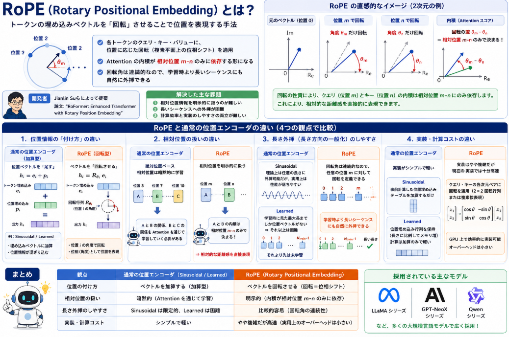

本ブログで以前[RoPE](https://yoshishinnze.hatenablog.com/entry/2025/10/22/000000)を論文から読んで説明していました。
そして、最近出てくるLLMは基本、位置エンコーディングはRoPEで実装するというのが標準的になってきました。

RoPE単体の性能にフォーカスしたインターネット記事が少なく(RoPEが入ったモデルをファインチューニングという事例は沢山あります)、個人的にもどの程度性能に寄与するか知りたいと考えました。

そこでどの程度性能改善の効果があるかを確認してみようと思います。
本日はまず、RoPEのおさらいの上で、どういうタスクであれば性能の違いを考えられるかについて考察し、実験の問題設定を行います。

## RoPEとは

RoPE（Rotary Positional Embedding）は、Transformerモデルにおける**位置情報の表現方法**の一種で、**トークンの埋め込みベクトルを「回転」させることで位置を表現する**手法です。

### 概要

- RoPEは、各トークンのクエリ・キー・バリュー表現に対して、**位置に応じた回転（複素平面上の位相シフト）** を適用します。
- これにより、Attentionの内積計算が**相対位置 $m-n$ にのみ依存する形**に自然と整理され、モデルが相対的な位置関係を直接扱えるようになります。
- 回転角は連続的なパラメータなので、**学習時より長いシーケンスにも自然に外挿できる**という利点があります。

### 開発者

RoPEは、**Jianlin Suら**によって提案されました。  
論文タイトルは「RoFormer: Enhanced Transformer with Rotary Position Embedding」です。

### 解決した主な課題

1. **相対位置情報の明示的な扱い**  
   - 従来の加算型位置埋め込み（Sinusoidal / Learned）では、Attentionが**絶対位置**に強く依存し、相対位置は暗黙的に学習される形でした。
   - RoPEは、クエリとキーの内積が**相対位置のみ**に依存するように設計されており、相対的な距離感を直接表現できます。

2. **長さ外挿（長さ方向の一般化）の難しさ**  
   - Learned位置埋め込みは、学習時に見た最大長までしか位置ベクトルを持たず、それ以上の長さでは性能が大きく低下しがちでした。
   - RoPEは回転角の連続性により、**任意の位置に対しても回転を定義できる**ため、長いシーケンスへの外挿が比較的容易です。

3. **計算効率と実装のしやすさ**  
   - RoPEは、クエリ・キーの各次元ペアごとに回転を適用する形で実装でき、GPU上でも効率的に計算できます。
   - その結果、**相対位置を明示的に扱いつつ、実用的な計算コスト**で動作する位置エンコーディングとして広く採用されています（LLaMA系、GPT-NeoX系など）。

## RoPEと通常のPEとの違い

RoPEと「通常の」位置エンコーダ（ここでは代表例として Sinusoidal と Learned を主に想定）の違いを、大きく4つの観点で整理します。

### 1. 位置情報の「付け方」の違い

__通常の位置エンコーダ（例：Sinusoidal / Learned）__

- **位置情報を「足す」**（加算型）  
  各トークンの埋め込みベクトルに、位置ごとのベクトルを**加算**します。
  - Sinusoidal: 固定の三角関数で位置を表現し、それを加算
  - Learned: 学習可能な位置埋め込み行列を使い、位置IDに対応するベクトルを加算

- 数式的には  
  $$
  \mathbf{h}_i = \mathbf{e}_i + \mathbf{p}_i
  $$
  ここで  
  - $\mathbf{e}_i$: トークン $i$ の埋め込み  
  - $\mathbf{p}_i$: 位置 $i$ の位置埋め込み

- 特徴  
  - 位置情報は**加算的に**トークン埋め込みに混ざる  
  - Attention の計算時には、クエリ・キー・バリューのベクトルに位置情報がすでに含まれている

__RoPE（Rotary Positional Embedding）__

- **位置情報を「回転」として掛ける**（乗算型）  
  各トークンの埋め込みベクトルを、**位置に応じた回転**で変換します。

- 数式的には（クエリ・キーを例に）  
  $$
  \mathbf{q}_m = f_q(\mathbf{x}_m, m) = R_{\Theta, m} \, W_q \, \mathbf{x}_m
  $$
  $$
  \mathbf{k}_n = f_k(\mathbf{x}_n, n) = R_{\Theta, n} \, W_k \, \mathbf{x}_n
  $$
  ここで  
  - $R_{\Theta, m}$ は位置 $m$ に対応する回転行列  
  - $\Theta$ は周波数パラメータ（次元ごとに異なる）

- 特徴  
  - 位置情報は**回転（複素平面上の位相シフト）**として表現される  
  - Attention の内積 $\mathbf{q}_m^\top \mathbf{k}_n$ は、**相対位置 $m-n$ にのみ依存する形**に自然と整理される

### 2. 相対位置の扱いの違い

__通常の位置エンコーダ__

- 多くの場合、**絶対位置**を前提に設計されています。
  - Sinusoidal: 位置 $i$ の sin/cos パターンは固定  
  - Learned: 位置 $i$ ごとに別のベクトルを学習

- 相対位置の情報は、Attention の計算を通じて**暗黙的に**学習される形になります。
  - モデルは「位置 3 と位置 7 の関係」を、埋め込みの組み合わせから学習する必要がある

__RoPE__

- **明示的に相対位置を扱う**ように設計されています。
  - クエリ $\mathbf{q}_m$ とキー $\mathbf{k}_n$ の内積は、回転の性質により  
    $$
    \mathbf{q}_m^\top \mathbf{k}_n = (\mathbf{x}_m^\top W_q^\top) R_{\Theta, m-n} (W_k \mathbf{x}_n)
    $$
    のように、**相対位置 $m-n$ にのみ依存**する形に整理できます（実際の実装では複素数表現で簡潔に書けます）。

- これにより：
  - 相対的な距離感（例：2トークン離れている、10トークン離れている）を**直接的に**表現できる  
  - 長いシーケンスへの一般化や、長さ外挿（長さを伸ばした推論）が比較的しやすい

### 3. 長さ外挿（長さ方向の一般化）のしやすさ

__通常の位置エンコーダ__

- Sinusoidal:
  - 理論上は任意の長さに外挿可能（sin/cos は連続関数）  
  - ただし、実際の Transformer では学習時の長さに強く依存し、外挿性能は限定的なことが多い

- Learned:
  - 学習時に見た最大長までしか位置埋め込みが存在しない  
  - それより長いシーケンスでは、未学習の位置埋め込みが必要になり、性能が大きく落ちやすい

__RoPE__

- 回転角 $\theta$ は連続的なパラメータなので、**任意の位置 $m$ に対して回転行列を定義できる**。
- そのため：
  - 学習時より長いシーケンスに対しても、**自然に外挿**できる  
  - 実際、LLaMA や GPT-NeoX 系モデルなどで、RoPE をベースにした長さ外挿手法が多く提案・利用されています

### 4. 実装・計算コストの違い

__通常の位置エンコーダ__

- Sinusoidal:
  - 事前計算した位置埋め込みテーブルを用意し、加算するだけ  
  - 実装がシンプルで計算コストも小さい

- Learned:
  - 位置埋め込み行列を保持する必要があり、最大長に比例してメモリ使用量が増える  
  - ただし、計算自体は加算のみで軽い

__RoPE__

- 実装はやや複雑：
  - クエリ・キーの各次元ペアごとに回転を適用する必要がある  
  - 多くの実装では、複素数表現や 2×2 回転行列のブロックとして扱う

- 計算コスト：
  - 通常の加算型よりはわずかに重いが、GPU 上では効率的に実装可能  
  - 近年の Transformer 実装では、RoPE 用の高速カーネルが整備されているため、実用上のオーバーヘッドは小さい

### まとめ

| 観点 | 通常の位置エンコーダ（Sinusoidal / Learned） | RoPE（Rotary Positional Embedding） |
|------|-----------------------------------------------|--------------------------------------|
| 位置の付け方 | ベクトルを**加算** | ベクトルを**回転**（位相シフト） |
| 相対位置の扱い | 暗黙的（Attention で学習） | 明示的（内積が相対位置のみに依存） |
| 長さ外挿 | Sinusoidal は理論上可能だが実用上は限定的、Learned は困難 | 比較的容易（回転角の連続性） |
| 実装・計算 | シンプルで軽い | やや複雑だが、現代の実装では十分高速 |

RoPE は、**相対位置を明示的に扱い、長さ外挿にも強い**という点で、従来の加算型位置エンコーダと比べて大きな利点があります。そのため、最近の大規模言語モデル（LLaMA 系列、GPT-NeoX 系列など）では RoPE が広く採用されています。

もし「通常の位置エンコーダ」として ALiBi や T5 の相対位置埋め込みなど、他の方式を想定されていましたら、それらとの比較も補足できます。

## 実験設定

次にRoPEを用いた性能差を評価するための実験を考えていきます。

### 1. 実験目的

本実験の目的は、BERTの標準的な位置表現である「絶対位置エンベディング」を「RoPE（相対位置表現）」に置き換えた際の影響を、RoPEの持つ数理的特性に基づいて多角的に検証することである。具体的には、以下の3つの問いに対して定量的な答えを得ることを目的とします。

* **特性検証1：長距離依存性の向上（Long-range Decayの検証）**
距離が離れるにつれてアテンションの重みを減衰させるRoPEの特性が、長文コンテキスト内でのピンポイントな情報抽出（QAタスク等）において、従来の絶対位置表現より優位に働くか。
* **特性検証2：位置の外挿性（Extrapolationの検証）**
訓練時に経験していない未知の入力長（シーケンス長）に対して、位置表現の数式的な拡張性（回転角の継続）のみでモデルを崩壊させずに推論を維持できるか。
* **特性検証3：基本性能の維持（Short-context Robustnessの検証）**
位置表現をドラスティックに変更したことで、BERTが本来得意としていた短文〜標準長のタスクにおける基礎的な言語理解能力が損なわれていないか。

### 2. 実験対象モデル

検証の公平性を期すため、以下の2つのモデルを用意して同一条件で比較する。

* **Baseline**: 標準的な絶対位置エンベディングを使用するBERT（例: `bert-base-uncased`）
* **Proposed (RoPE-BERT)**: 標準BERTの `BertSelfAttention` にRoPEを組み込み、入力層の `position_embeddings` を無効化したモデル

### 3. 実験内容（3つの検証ステップ）

__実験Ⅰ：短文〜標準長における基本性能検証（目的：特性検証3）__

位置表現の変更が、既存のBERTの強みを破壊していないかを担保する。

* **使用タスク・データセット**: **SQuAD v2.0**（標準長データ）、または **GLUEベンチマーク**（SST-2、MRPCなど短文主体のもの）
* **学習条件**: 最大入力長を「512トークン」以下に設定し、両モデルを同一エポック数ファインチューニングする。
* **評価指標**: F1スコア、Exact Match（SQuAD）、または正解率（GLUE）
* **期待される結果**: 両モデルのスコアが同等、もしくはRoPE版がわずかに上回ること（RoPEの導入によって短文性能が劣化しないことの確認）。

__実験Ⅱ：長文読解における長距離依存性の検証（目的：特性検証1）__

コンテキストが長くなった際、RoPEの「相対的な位置関係の保持能力」がどう活きるかを検証する。

* **使用タスク・データセット**: **SQuAD v2.0** のうちコンテキスト長が400〜512トークンのサンプルのみを抽出したサブセット、または **HotpotQA**（ノイズ混じりの長文QA）
* **学習条件**: 実験Ⅰで512トークンを上限として学習したモデルをそのまま使用する。
* **評価指標**: F1スコア / Exact Match
* **期待される結果**: 入力長が512トークンの限界に近づくにつれ、絶対位置BERTは位置のボトネックにより精度が低下しやすい。一方、RoPEはクエリとキーの相対距離を正しく捉えるため、高精度を維持できる（差の可視化）。

__実験Ⅲ：最大長を超えた「外挿性」の限界検証（目的：特性検証2）__

RoPEの最大の強みである「未知の長さへの対応力」をストレステストする。

* **使用タスク・データセット**: 実験Ⅰ・Ⅱで学習したモデルに対し、推論時のみ最大入力長を「768トークン」や「1024トークン」に拡張し、長文QAデータ（または人工的な **Needle In A Haystack（干し草のなかの針）タスク**）を入力する。
* **評価指標**: 各入力長（512, 768, 1024）における推論精度
* **期待される結果**:
* **絶対位置BERT**: 512を超えた時点で未学習の位置埋め込み（またはインデックス範囲外エラー）により、アテンション行列が異常な値となり精度が著しく崩壊（ランダム予測レベルに低下）する。
* **RoPE-BERT**: 訓練長を超えても位置の回転角が数式通りに継続するため、**精度が緩やかに減衰する程度に踏みとどまる**。

### 4. 実験の進め方・注意点

* **追加学習のステップについて**:
位置表現の構造が大きく変わるため、可能であればファインチューニングの前に、Wikipedia等のテキストを用いて数k〜数十kステップの「マスク言語モデル（MLM）による継続事前学習」を挟むことが推奨される。これにより、RoPEの回転角に対するモデルの適応（ウォームアップ）が進み、実験Ⅱ・Ⅲでの差がより綺麗に出やすくなる。
* **計算リソースの考慮**:
512トークンを超える推論（実験Ⅲ）を行う際は、アテンションの計算量が二乗で増えるため、評価時のバッチサイズを小さくするなどのVRAM管理を行う。

## 総括

これまでの内容を抽象化すると、本試験で問われているのは次のようなポイントです。

### 1. 位置エンコーディングの「表現方法」の違い

- **従来の位置エンコーダ**（Sinusoidal / Learned など）  
  → 位置ベクトルを**加算**する（絶対位置を足し込む）。
- **RoPE**  
  → 埋め込みベクトルを**回転**させる（位相シフト）ことで位置を表現する。

**抽象化すると**：  
位置情報を「足す」か「回す」か、という**表現形式の違い**が本質。

### 2. 相対位置の扱い方の違い

- 従来方式：Attention が**絶対位置**に依存し、相対位置は暗黙的に学習される。
- RoPE：クエリ・キーの内積が**相対位置のみ**に依存するように設計されている。

**抽象化すると**：  
RoPE は、**相対位置を明示的に扱う設計**になっている点が重要な特徴。

### 3. 長さ外挿（一般化）のしやすさ

- Learned 位置埋め込み：学習時の最大長までしか対応できず、外挿が難しい。
- RoPE：回転角は連続パラメータなので、**任意の位置に対しても回転を定義できる**。

**抽象化すると**：  
RoPE は、**連続的な位置表現**により、長さ方向の一般化（外挿）がしやすい。

### 4. 開発背景と解決した課題の抽象化

- 開発者：Jianlin Su ら（RoFormer 論文）。
- 解決した主な課題：
  1. **相対位置を明示的に扱いたい**  
  2. **長いシーケンスへの外挿を容易にしたい**  
  3. **計算効率を保ちつつ、これらを両立したい**

**抽象化すると**：  
RoPE は、「**相対位置を明示的に扱い、長さ外挿にも強い、実用的な位置エンコーディング**」として設計された技術。

