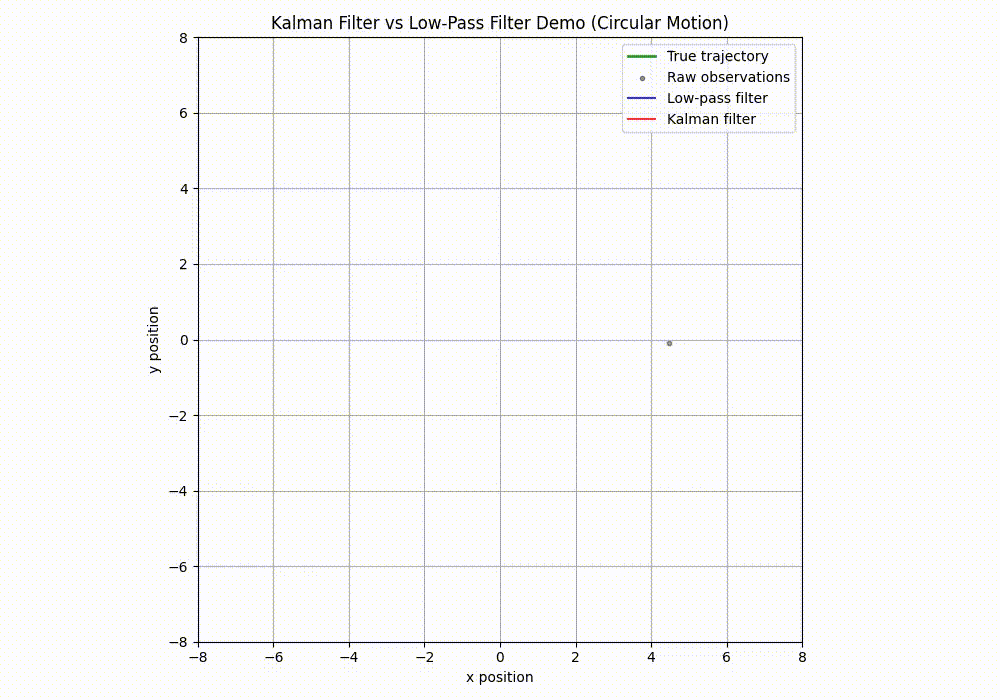

昨日のカルマンフィルタ、勉強すると更に興味がわいてしまったので、追加の記事も書きたくなりました。
(Mambaの精度向上のためSSMを知りたいから派生して全然違うところに来てしまいました。)


## 記事の主旨
今回扱うのはカルマンフィルタの良さを実際に実装してみて確認するということです。
問題設定からPythonによる実装、実演した結果の確認を行います。

## 1. 問題設定（2次元空間＋GPS風センサ）

### 1.1 空間と移動体

- 2次元平面（x-y平面）上を等速円運動状に動く移動体を考えます。
- 移動体の**真の状態**は
  \[
  x_t = [p_x(t),\ p_y(t),\ v_x(t),\ v_y(t)]^\top
  \]
  とします（位置＋速度）。

### 1.2. 移動体の動作（真の軌道）

- **運動の種類**：**円運動**
- **パラメータ**：
  - 半径：`radius = 5.0`
  - 角速度：`omega = 0.1 rad/s`
  - サンプリング間隔：`dt = 0.1 s`
- **位置・速度の計算**：
  - 時刻 \(t\) での角度：\(\theta = \omega \cdot t \cdot dt\)
  - 位置：
    \[
    x_t = 5 \cos\theta,\quad y_t = 5 \sin\theta
    \]
  - 速度（位置の微分から）：
    \[
    v_x = -5\omega \sin\theta,\quad v_y = 5\omega \cos\theta
    \]
- **ノイズ**：**真の移動にはノイズなし**（プロセスノイズは定義されているが、真の軌道生成では加えていない）

今回の移動体は**半径5の円を、1周あたり約 \(2\pi / 0.1 \approx 62.8\) 秒で滑らかに回る**理想的な円運動をしています。

## 1.3. 観測値の状態
移動体に積んでいるGPSだとしてください。これには観測ノイズが乗っています。

- **観測対象**：位置 \((x, y)\) のみ（速度は観測しない）
- **観測モデル**：
  \[
  z_t = H x_t + \text{観測ノイズ}
  \]
  ここで \(H\) は
  \[
  H = \begin{bmatrix}1 & 0 & 0 & 0 \\ 0 & 1 & 0 & 0\end{bmatrix}
  \]
  なので、\(H x_t = (x_t, y_t)\) です。
- **観測ノイズ**：
  - 共分散行列：\(R = \begin{bmatrix}0.1 & 0 \\ 0 & 0.1\end{bmatrix}\)
  - 2次元ガウスノイズ \(\mathcal{N}(0, R)\) を加える
- **結果としての観測値**：
  - 真の円運動の位置 \((x_t, y_t)\) に、標準偏差約 \(\sqrt{0.1} \approx 0.316\) のガウスノイズが乗ったもの
  - 黒点（`Raw observations`）としてプロットされる


## 2. 比較対象となる3つの移動体
今回はカルマンフィルタの性能を確認することなので、対抗馬が必要となります。
対抗馬はローパスフィルタとします。

### 2.1 移動体A：観測値そのままを「真値」と信じて動く

- 制御方針：観測された位置 \(z_t\) をそのまま「真の位置」とみなし、目標位置に向かって等速で移動する（あるいは単純に観測位置を表示するだけでも可）。
- 特徴：
  センサノイズ \(v_t\) がそのまま軌道に反映されるため、軌跡がガタガタ・ブレる。

### 2.2 移動体B：ローパスフィルタで平滑化した位置を「真値」とみなして動く

- 制御方針：観測系列 \(z_t\) に対してローパスフィルタ（IIRフィルタ）を適用し、その出力 \(y_t\) を「真値の平滑化推定」として用いる。
- 特徴：
  高周波ノイズは抑えられるが、フィルタの特性上**遅れ（ラグ）**が生じる。  
  そのため、急な変化や曲がりには追従が遅れ、軌跡が真の軌道より「後ろを追いかける」ように見えることがある。

>__ローパスフィルタ__  
>ローパスフィルタは、**「観測値をなめらかにするための単純なフィルタ」** です。
>__1. 処理の仕組み__
>- 各時刻 \(t\) で観測された位置 \(z_t\) に対し、次のように計算します：
>  \[
>  y_t = \alpha \cdot y_{t-1} + (1 - \alpha) \cdot z_t
>  \]
>- \(y_t\)：フィルタ出力（なめらかになった位置）
>- \(\alpha\)：0〜1のパラメータ（例：0.8）
>つまり、
>- **過去の出力 \(y_{t-1}\) と現在の観測 \(z_t\) を混ぜ合わせて、新しい出力 \(y_t\) を作る**
>- \(\alpha\) が大きいほど「過去を重視」してなめらかになるが、**遅れ（ラグ）**が大きくなる
>
>__2. 直感的なイメージ__
>- 観測値が「ガタガタしたGPSの位置」だとします。
>- ローパスフィルタは、**「今の観測」と「少し前の位置」を混ぜて、なめらかな位置を作る**イメージです。
>- 結果として、
>  - ノイズは減る（ガタガタが減る）
>  - ただし、**本当の動きより少し遅れて追いかける**感じになる


### 2.3 移動体C：カルマンフィルタで真値を推定しながら動く

- カルマンフィルタで状態 \(x_t\) を推定し、その推定値 \(\hat{x}_{t|t}\) を「真値の推定」として用いる。
- 制御方針：推定位置 \(\hat{p}_{x,t|t}, \hat{p}_{y,t|t}\) を基に、目標位置へ向かって等速移動する。
- 特徴：
  観測ノイズをフィルタリングして滑らかな軌道を得られる（はず）。  
  モデル（等速運動など）の情報を活用するため、ローパスフィルタより**遅れが小さく、ノイズも抑えられる**ことが期待される。  
  ただし、モデルが現実とズレている（例：円運動に対して等速モデルを使う）場合には、モデル誤差によるバイアスが生じることもある。

## 3. カルマンフィルタの設計（移動体C用）

### 3.1 状態空間モデル

- 状態：\(x_t = [p_x, p_y, v_x, v_y]^\top\)
- 状態方程式：\(x_t = A x_{t-1} + w_t\)
- 観測方程式：\(z_t = H x_t + v_t\)

### 3.2 カルマンフィルタのステップ

#### (1) 予測ステップ（Predict）

\[
\hat{x}_{t|t-1} = A \hat{x}_{t-1|t-1}
\]
\[
P_{t|t-1} = A P_{t-1|t-1} A^\top + Q
\]

#### (2) 更新ステップ（Update）

\[
K_t = P_{t|t-1} H^\top (H P_{t|t-1} H^\top + R)^{-1}
\]
\[
\hat{x}_{t|t} = \hat{x}_{t|t-1} + K_t (z_t - H \hat{x}_{t|t-1})
\]
\[
P_{t|t} = (I - K_t H) P_{t|t-1}
\]

ここで、

- \(\hat{x}_{t|t}\)：カルマンフィルタによる状態推定値（位置＋速度）
- \(P_{t|t}\)：推定誤差共分散

## 4. 実装

実装はPythonです。
※性能評価のため書く時刻において、移動体の真値に対して、RMSEと累積位置誤差をとります。
※動作が分かるように移動体、ローパスフィルタの予測値、カルマンフィルタの予測値を動画で保存するようにしています。

### 実験用コード(カルマンフィルタは仕掛かり)

今回折角ここまで読んでいただいたので、カルマンフィルタの実装の体験が出来るようにしています。

カルマンフィルタの実装をわざと実際のものと変えています。
正解コードは以下のレポジトリの"kalman_filter_prob.py"です。

https://github.com/Shinichi0713/LLM-fundamental-study/tree/main/attention/ssm/karman_filteer/src

実装する上で原理を確認する場合は以下の記事をご参考下さい。

https://note.com/novel_fowl5247/n/n3ec9aa3a58d4

```python
import numpy as np
import matplotlib.pyplot as plt
from matplotlib.animation import FuncAnimation

# ====================
# Kalman filter implementation (行列形式)
# ====================
class KalmanFilter:
    def __init__(self, F, H, Q, R, x0, P0):
        self.F = F  # State transition matrix
        self.H = H  # Observation matrix
        self.Q = Q  # Process noise covariance
        self.R = R  # Observation noise covariance
        self.x = x0 # State estimate
        self.P = P0 # Error covariance

    def predict(self):
        # Prediction step
        self.x = self.F @ self.x
        self.P = self.F @ self.P @ self.F.T + self.Q

    def update(self, z):
        # Update step
        y = z - self.H @ self.x  # Innovation (difference between observation and prediction)
        S = self.H @ self.P @ self.H.T + self.R  # Innovation covariance
        K = self.P @ self.H.T @ np.linalg.inv(S)  # Kalman gain

        self.x = self.x + K @ y
        # 状態次元に合わせて単位行列のサイズを自動設定
        self.P = (np.eye(len(self.x)) - K @ self.H) @ self.P

# ====================
# ローパスフィルタ（IIR）の実装
# ====================
class LowPassFilter:
    def __init__(self, alpha, dim=2):
        self.alpha = alpha  # 平滑化パラメータ (0 < alpha < 1)
        self.y = None       # フィルタ出力
        self.dim = dim

    def update(self, z):
        if self.y is None:
            self.y = z.copy()
        else:
            self.y = self.alpha * self.y + (1 - self.alpha) * z
        return self.y

# ====================
# パラメータ設定
# ====================
dt = 0.1  # サンプリング間隔 [s]
T = 200   # ステップ数（円運動を見るため少し長めに）

# 状態遷移行列 F (等速運動モデル) ※KFは依然として等速モデルを使う
F = np.array([
    [1, 0, dt, 0],
    [0, 1, 0, dt],
    [0, 0, 1, 0],
    [0, 0, 0, 1]
])

# 観測行列 H (位置のみ観測)
H = np.array([
    [1, 0, 0, 0],
    [0, 1, 0, 0]
])

# プロセスノイズ共分散 Q (加速度的な外乱)
q = 0.01
Q = np.diag([0, 0, q, q])  # 位置には直接ノイズを入れない簡略化

# 観測ノイズ共分散 R (GPS誤差)
r = 0.1
R = np.eye(2) * r

# ====================
# 真の軌道生成（円運動）
# ====================
# 円運動パラメータ
radius = 5.0      # 半径
omega = 0.1       # 角速度 [rad/s]

# 真の位置・速度を保存する配列
x_true = np.zeros((T, 4))

for t in range(T):
    theta = omega * t * dt
    # 位置
    x_true[t, 0] = radius * np.cos(theta)  # x
    x_true[t, 1] = radius * np.sin(theta)  # y
    # 速度（微分から計算）
    x_true[t, 2] = -radius * omega * np.sin(theta)  # vx
    x_true[t, 3] =  radius * omega * np.cos(theta)  # vy

# ====================
# 観測生成 (GPS風センサ)
# ====================
observations = np.zeros((T, 2))
for t in range(T):
    observations[t] = H @ x_true[t] + np.random.multivariate_normal([0,0], R)

# ====================
# カルマンフィルタによる推定（更新なし・予測のみ）
# ====================
# 初期値（真の初期状態に近い値を与える）
x0 = x_true[0].copy()
P0 = np.eye(4) * 0.1

kf = KalmanFilter(F=F, H=H, Q=Q, R=R, x0=x0, P0=P0)

# 推定結果を保存する配列
x_upd = np.zeros((T, 4))
x_upd[0] = x0

for t in range(1, T):
    # ★★ ここがポイント：updateを呼ばず、predictだけを繰り返す ★★
    kf.predict()
    # kf.update(observations[t])  # ← コメントアウト（観測を使わない）
    
    # 結果を保存
    x_upd[t] = kf.x

# ====================
# ローパスフィルタによる平滑化
# ====================
alpha = 0.8  # ローパスフィルタのパラメータ（大きいほど平滑化が強い）
lpf = LowPassFilter(alpha=alpha, dim=2)

lpf_output = np.zeros((T, 2))
for t in range(T):
    lpf_output[t] = lpf.update(observations[t])

# ====================
# 誤差評価（KF vs ローパス）
# ====================
true_pos = x_true[:, :2]  # 真の位置
kf_pos = x_upd[:, :2]     # KF推定位置

# KFの位置誤差RMSE
kf_rmse = np.sqrt(np.mean(np.sum((kf_pos - true_pos)**2, axis=1)))

# ローパスフィルタの位置誤差RMSE
lpf_rmse = np.sqrt(np.mean(np.sum((lpf_output - true_pos)**2, axis=1)))

# KFの累積位置誤差
kf_integral_error = np.sum(np.sqrt(np.sum((kf_pos - true_pos)**2, axis=1))) * dt

# ローパスフィルタの累積位置誤差
lpf_integral_error = np.sum(np.sqrt(np.sum((lpf_output - true_pos)**2, axis=1))) * dt

print("=== 誤差評価結果 ===")
print(f"KF RMSE: {kf_rmse:.4f}")
print(f"LPF RMSE: {lpf_rmse:.4f}")
print(f"KF integral error: {kf_integral_error:.4f}")
print(f"LPF integral error: {lpf_integral_error:.4f}")

# ====================
# アニメーションの準備
# ====================
fig, ax = plt.subplots(figsize=(10, 7))
ax.set_xlabel('x position')
ax.set_ylabel('y position')
ax.set_title('Kalman Filter (Prediction Only) vs Low-Pass Filter Demo (Circular Motion)')
ax.grid(True)
ax.set_xlim(-8, 8)
ax.set_ylim(-8, 8)
ax.set_aspect('equal')

# プロット用の空ライン・点
true_line, = ax.plot([], [], 'g-', linewidth=2, label='True trajectory', alpha=0.8)
obs_scat = ax.scatter([], [], c='black', s=10, label='Raw observations', alpha=0.4)
lpf_line, = ax.plot([], [], 'b-', linewidth=1.5, label='Low-pass filter', alpha=0.8)
kf_line, = ax.plot([], [], 'r-', linewidth=1.5, label='Kalman filter (prediction only)', alpha=0.8)

ax.legend()

# アニメーション更新関数
def update(frame):
    # frame: 0..T-1
    t = frame
    
    # 真の軌跡 (0..t)
    true_line.set_data(x_true[:t+1, 0], x_true[:t+1, 1])
    
    # 観測値そのまま (0..t)
    obs_scat.set_offsets(observations[:t+1])
    
    # ローパスフィルタ出力 (0..t)
    lpf_line.set_data(lpf_output[:t+1, 0], lpf_output[:t+1, 1])
    
    # KF推定軌跡 (0..t) ※更新なしなので「モデル予測だけ」の軌跡
    kf_line.set_data(x_upd[:t+1, 0], x_upd[:t+1, 1])
    
    return true_line, obs_scat, lpf_line, kf_line

# アニメーション生成
ani = FuncAnimation(fig, update, frames=T, interval=50, blit=True)

plt.tight_layout()
plt.show()

# 動画をファイルに保存したい場合は以下のコメントを外す（ffmpegが必要）
ani.save('kalman_prediction_only_vs_lowpass_circle.mp4', writer='ffmpeg', fps=20)
```

### 結果

動作させると以下のような結果となります。
ローパスはノイズに対して少し遅れが生じます。
カルマンフィルタは内部の状態量から未来を予測しに行く手法のため遅れは生じません。



また試しに計測値した誤差量ですが以下の結果です。
KFはカルマンフィルタ、LPFはローパスフィルタの結果で、どちらもカルマンフィルタの方が小さい→誤差が小さく予測できているという結果となりました。

```
=== 誤差評価結果 ===
KF RMSE: 0.2634
LPF RMSE: 0.8048
KF integral error: 46.2739
LPF integral error: 159.4534
```

## 5. 総括
カルマンフィルタの導出も説明したくなるくらい面白いテクニックでした。

__カルマンフィルタの優れている点__

- **モデルと観測を統合して最適に推定**  
  線形ガウスモデルにおいて、最小二乗・ベイズ推定の意味で「最適」なフィルタ。
- **ノイズを抑えつつ遅れを小さくできる**  
  単純な平滑化（移動平均・ローパス）より、モデル情報を活かして遅れを抑えられる。
- **不確実性（共分散）も同時に管理**  
  推定値だけでなく、「どの程度信頼できるか」も計算できる。
- **オンライン処理が可能**  
  各時刻で予測→更新を繰り返すだけでよく、過去データをすべて保持する必要がない。
- **実装が比較的シンプル**  
  行列演算だけで実装でき、計算量も状態次元の3乗程度に収まる。

__これ以上に良いとされる方法（発展形）__

- **拡張カルマンフィルタ（EKF）**  
  非線形モデルを線形近似して適用。非線形性が強いと誤差が大きくなる。
- **無香料カルマンフィルタ（UKF）**  
  サンプル点（シグマ点）で分布を近似。EKFより精度が高いことが多い。
- **粒子フィルタ（PF）**  
  多数のサンプル（粒子）で分布を表現。強い非線形・非ガウスにも対応できるが計算コスト大。
- **深層学習＋フィルタのハイブリッド**  
  ニューラルネットでダイナミクスやノイズを学習し、KFやPFと組み合わせる手法も研究されている。

__注意点__

- **モデルが現実とズレていると性能が落ちる**  
  例：等速モデルで円運動を追うなど、モデル誤差が大きいと推定が悪化。
- **パラメータ（Q, R）の設定が重要**  
  モデル誤差・観測誤差の見積もりを間違えると、過剰に平滑化したり、逆にノイズに引きずられたりする。
- **初期値・初期共分散の影響**  
  初期状態や共分散が不適切だと、収束までに時間がかかる。
- **線形・ガウス仮定に依存**  
  非線形・非ガウス環境では、EKF/UKF/PFなどへの拡張が必要。
- **計算コスト**  
  状態次元が大きくなると共分散行列の更新コストが増大する。


著者の本当はMambaの性能向上だったのですが、途中でカルマンフィルタが面白いことに気づいたことでこんなに寄り道してしまいました。

本日はここまでです。

