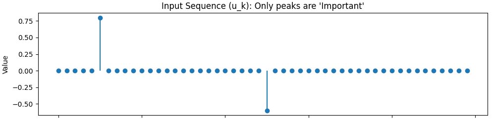
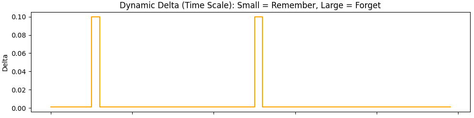
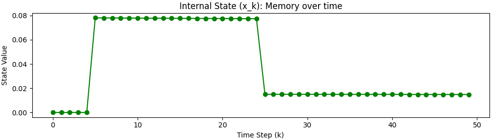

昨日のKelman Filterの話を扱うことになった原因である[Mambaというモデル](https://yoshishinnze.hatenablog.com/entry/2026/01/25/182406)で使われているSSMについて説明を行います。


__そもそもなぜSSMを話ししている？__

以下の記事の総括のあたりに理由を記載しています。

https://yoshishinnze.hatenablog.com/entry/2026/05/03/050000

## Selective SSMとは
Selective SSM は、**「入力に応じて状態遷移の挙動を変える状態空間モデル（SSM）」** です。  
従来の SSM が「すべての入力に対して同じダイナミクスで処理する」のに対し、Selective SSM は **「どの情報を保持し、どの情報を捨てるか」を入力に応じて選択的に制御**します。

### 解決したかった課題

Selective SSM は、主に **「長いシーケンスを効率的かつ柔軟に扱う」** という課題を解決するために提案されました。  
具体的には、以下の3つの問題を解決することを目指しています。

__1. 従来の SSM（S4 など）の限界__

従来の SSM（S4, S4D, S5 など）は、

- パラメータ \(A, B, C\) が **固定**
- すべての入力に対して同じ「記憶の仕方」「忘却の仕方」で処理

という特徴がありました。  
これにより、

- 長い依存関係を捉えるのは得意
- しかし、**入力に応じて「何を覚え、何を忘れるか」を柔軟に変えられない**

という問題がありました。

__2. Selective SSM が解決する3つのポイント__

__(1) 入力依存のコンテキスト処理__

- 従来の SSM：すべてのトークンを同じ重みで記憶
- Selective SSM：入力に応じて
  - 重要なトークンは「長く覚える」
  - 不要なトークンは「すぐ忘れる」
- これにより、**文脈に応じた選択的な情報保持**が可能になります。

__(2) 長距離依存の効率的な扱い__

- Transformer は Attention で長距離依存を扱いますが、計算量が \(O(L^2)\) で重い。
- 従来の SSM は \(O(L)\) で長いシーケンスを処理できるが、柔軟性に欠ける。
- Selective SSM は、**SSM の効率性を保ちつつ、入力依存の柔軟性を追加**することで、長いシーケンスを効率的に処理できます。

__(3) 表現力の向上__

- 固定パラメータの SSM は、線形・時不変なダイナミクスに縛られ、表現力が限定的。
- Selective SSM はパラメータを入力依存にすることで、**非線形・時変な挙動に近づき、表現力が向上**します。
- これにより、Transformer に近い柔軟性を持ちつつ、計算効率を維持できます。


### 従来の SSM（S4 など）との違い

__従来の SSM__

- パラメータ \(A, B, C\) は **固定**
- すべての入力に対して同じ「記憶の仕方」「忘却の仕方」で処理
- 長い依存関係を捉えるのは得意だが、**入力依存の柔軟な処理が苦手**

__Selective SSM（Mamba など）__

- パラメータ \(A, B, C\)（特に \(B, C, \Delta\)）を **入力から計算**
- 入力に応じて
  - 重要な情報は「長く覚える」
  - 不要な情報は「すぐ忘れる」
- これが **「Selective（選択的）」** の意味です。

## Selective SSM の仕組み

「重要なトークンは長く覚える」「不要なトークンはすぐ忘れる」という挙動は、**Selective SSM のパラメータ（特に ( \Delta, B, C )）を入力から動的に計算する仕組み**によって実現されます。

### 1. 仕組みの核心：入力依存パラメータ

Selective SSM（Mamba など）では、各ステップ $ k $ において

* $ \Delta_k $：時間スケール（離散化ステップ）
* $ B_k $：入力 → 状態への書き込み
* $ C_k $：状態 → 出力への読み出し

を **入力 $ u_k $** から計算します。

$$
\Delta_k = f_\Delta(u_k) 
$$

$$
B_k = f_B(u_k)
$$

$$
C_k = f_C(u_k)
$$

ここで $ f_\Delta, f_B, f_C $ は通常、線形層＋活性化関数（例：SiLU）です。

### 2. 数式

離散化された状態更新と出力生成は次のように書けます：

**状態更新（書き込みと保持）**

$$
x_k = \bar{A}_k x_{k-1} + \bar{B}_k u_k
$$

**出力生成（読み出し）**

$$y_k = C_k x_k$$

ここで

$$
\bar{A}_k = e^{\Delta_k A}
$$

です。
この式が「記憶の長さ」を決める機能を担います。

### 3. 「長く覚える」 vs 「すぐ忘れる」のメカニズム

__3.1 $ \Delta_k $（時間スケール）の役割__

通常、行列 $ A $ の固有値は **負の実部（安定系）** を持ちます。
このとき $ e^{\Delta_k A} $ の挙動は次のようになります。


__$\Delta_k$ が大きい__

$$
e^{\Delta_k A} \rightarrow 0 に近づく
$$

* 状態が **急速に減衰**
* 過去情報がすぐ消える

**短期記憶（すぐ忘れる）** となり、情報もすぐに減衰していきます。

 __$\Delta_k$ が小さい__

$$
e^{\Delta_k A} \approx I に近い
$$

* 状態がほぼ保持される
* 過去情報が長く残る

結果として**長期記憶（長く覚える）** ことになり、情報が長い期間保持されることになります。

__$A$ 行列が「入力に依存しない」ことの重要性__
Selective SSM において、$\Delta, B, C$ は入力依存（Selective）ですが、**$A$ 行列自体は入力に依存しません。**
- もし $A$ まで入力依存にしてしまうと、計算が複雑になりすぎて、Mamba の強みである「Parallel Scan（並列計算）」による高速化が難しくなります。
- 「固定の $A$」を「動的な $\Delta$」でスケーリングするという妥協案が、**高い表現力と計算効率の両立**を生んでいます。


__3.2 $ B_k $（入力重み）の役割__

* $ B_k $ が大きい
  → 入力 $ u_k $ を強く状態に書き込む
  → **重要な情報として記憶**

* $ B_k $ が小さい
  → 状態への影響が小さい
  → **情報を無視**

入力情報から **「何を記憶するか」の選択** を行っていることになります。


__3.3 $ C_k $（出力重み）の役割__

* $ C_k $ が大きい
  → 状態 $ x_k $ を強く出力に反映
  → **記憶を活用**

* $ C_k $ が小さい
  → 状態はあっても出力に出ない
  → **内部保持のみ**

**「何を使うか」の選択**


### 4. Selective SSMの構造

この構造は、直感的には次のように対応することとなります。

| 機能   | SSMパラメータ     | RNN的解釈             |
| ---- | ------------ | ------------------ |
| 書き込み | $ B_k $      | input gate         |
| 忘却速度 | $ \Delta_k $ | forget gate（連続時間版） |
| 読み出し | $ C_k $      | output gate        |

上記のRNN 的解釈は、Mamba の論文（Gu and Dao, 2023）でも説明されてたりします。

- **Input Gate ($B_k$)**: 今この単語は、状態（記憶）に書き込む価値があるか？
- **Forget Gate ($\Delta_k$)**: 今までの記憶をどれくらい薄めて、次のステップへ進むか？
- **Output Gate ($C_k$)**: 今蓄えている記憶は、次の単語を予測するのに必要か？

この構造により、Transformer が苦手とする「長いシーケンス内の特定の情報の保持」を、メモリを節約しつつ実行できています。


### 2. $A$ 行列が「入力に依存しない」ことの重要性
Selective SSM において、$\Delta, B, C$ は入力依存（Selective）ですが、**$A$ 行列自体は入力に依存しません。**
- もし $A$ まで入力依存にしてしまうと、計算が複雑になりすぎて、Mamba の強みである「Parallel Scan（並列計算）」による高速化が難しくなります。
- 「固定の $A$」を「動的な $\Delta$」でスケーリングするという妥協案が、**高い表現力と計算効率の両立**を生んでいます。

### 3. RNNゲートとの対比の正確性
表にまとめられている 


## 例題
Selective SSMの長期記憶が優れているという面を確認できる例題を考えてみました。

### 問題設定
Selective SSMの「情報の取捨選択」を直感的に理解するには、Mambaの論文でもベンチマークとして使われている **「Selective Copy Task（選択的コピー課題）」** を簡略化したシミュレーションが最適です。

この課題を、「重要なデータだけをメモリに書き込み、無関係なノイズが流れている間は記憶を維持する」という挙動として実装、効果確認します。

### 問題設定：Selective Copy シミュレーション

1.  **入力データ**: 数値のシーケンス。
    - **ターゲット（重要）**: 正の整数（例：1〜9）。これが出現したときは「覚えろ」という合図。
    - **フィラー（不要）**: 0。これが流れている間は、過去のターゲットを「保持」しつつ、新しい入力は「無視」しなければならない。
2.  **パラメータの動的変化**:
    - ターゲットが来た時：$\Delta$ を小さく（保持モード）、$B$ を大きく（書き込みモード）する。
    - フィラーが来た時：$\Delta$ を極小（超保持モード）にし、$B$ を 0（無視モード）にする。
    - もし「忘却」を試したいなら、特定のタイミングで $\Delta$ を大きくしてリセットをかける。

### Pythonによる実装例

以下のコードでは、簡易的なSSMの離散化式 $x_k = \bar{A}x_{k-1} + \bar{B}u_k$ を用いて、入力 $u$ に応じてパラメータが動的に変わる様子を可視化します。

```python
import numpy as np
import matplotlib.pyplot as plt

def silu(x):
    return x * (1 / (1 + np.exp(-x)))

def simulate_selective_ssm(seq_len=50):
    # 1. 入力データの作成 (0は不要な情報、特定の場所だけ重要な値)
    u = np.zeros(seq_len)
    important_indices = [5, 25]  # ここに重要な情報が出現
    u[5] = 0.8  # ターゲット1
    u[25] = -0.6 # ターゲット2
    
    # SSMの基本パラメータ (固定)
    A = -0.5  # 安定系 (負の値)
    
    # 状態の初期化
    x = 0
    history_x = []
    history_delta = []
    history_B = []

    for k in range(seq_len):
        # 2. Selectiveな挙動の模倣 (本来はここを線形層で学習する)
        if abs(u[k]) > 0:
            # 重要な入力：書き込みを強く、時間は少し進める
            delta = 0.1
            B = 1.0
        else:
            # 不要な入力：書き込みをゼロに、時間は極めてゆっくり（保持）
            # ここで delta を大きくすると「すぐ忘れる」挙動になる
            delta = 0.001 
            B = 0.0
        
        # 3. 離散化
        # A_bar = exp(delta * A)
        # B_bar = (1/A) * (exp(delta * A) - 1) * B  (Zero-Order Hold)
        A_bar = np.exp(delta * A)
        B_bar = (1.0/A) * (np.exp(delta * A) - 1.0) * B
        
        # 4. 状態更新
        x = A_bar * x + B_bar * u[k]
        
        history_x.append(x)
        history_delta.append(delta)
        history_B.append(B)

    return u, history_x, history_delta

# --- 可視化 ---
u, x, deltas = simulate_selective_ssm()

fig, axes = plt.subplots(3, 1, figsize=(10, 8), sharex=True)

# 入力信号
axes[0].stem(u, basefmt=" ")
axes[0].set_title("Input Sequence (u_k): Only peaks are 'Important'")
axes[0].set_ylabel("Value")

# Deltaの変化
axes[1].step(range(len(deltas)), deltas, where='post', color='orange')
axes[1].set_title("Dynamic Delta (Time Scale): Small = Remember, Large = Forget")
axes[1].set_ylabel("Delta")

# 内部状態（記憶）
axes[2].plot(x, marker='o', color='green')
axes[2].set_title("Internal State (x_k): Memory over time")
axes[2].set_ylabel("State Value")
axes[2].set_xlabel("Time Step (k)")

plt.tight_layout()
plt.show()
```


### 結果

このシミュレーションを実行すると、以下の挙動がグラフとして現れます。

- **情報の書き込み**: $u_k$ にピークがある瞬間、$B$ が働き、内部状態 $x_k$ がガクンと変化します。
- **長期記憶の維持**: その後 $u_k$ が 0（フィラー）の間、$\Delta$ を極めて小さく設定しているため、$A_{bar} = e^{\Delta A}$ がほぼ $1$ になります。これにより、**RNNのように勾配消失することなく、値が水平に（長期間）維持**されます。
- **可変的な忘却**: もし途中で「次の話題へ移る」という入力を想定して $\Delta$ をわざと大きく（例：$10.0$）するようにコードを書き換えてみてください。すると、それまでの $x_k$ の値が一瞬で $0$ にリセットされるのが確認できるはずです。







## 総括

- Selective SSMは、入力依存のパラメータ $ Δ, B, C $ によって、「何を覚え、何を忘れるか」を選択的に制御するSSMです。
- 従来のSSMに比べ、 長いシーケンスを効率的に扱いつつ、柔軟なコンテキスト処理が可能になります。
- Mambaでは、この仕組みをParallel Scanによる高速化と組み合わせることで、Transformerに近い表現力とSSMの計算効率を両立しています。
