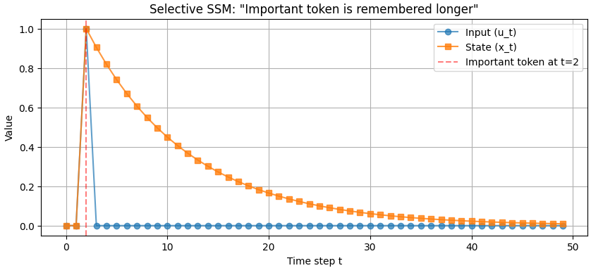

昨日のKelman Filterの話を扱うことになった原因である[Mambaというモデル](https://yoshishinnze.hatenablog.com/entry/2026/01/25/182406)で使われているSSMについて説明を行います。

__そもそもなぜSSMを話ししている？__

以下の記事の総括のあたりに理由を記載しています。

https://yoshishinnze.hatenablog.com/entry/2026/05/03/050000

## Selective SSMとは
Selective SSM は、**「入力に応じて状態遷移の挙動を変える状態空間モデル（SSM）」** です。  
従来の SSM が「すべての入力に対して同じダイナミクスで処理する」のに対し、Selective SSM は **「どの情報を保持し、どの情報を捨てるか」を入力に応じて選択的に制御**します。

### 解決したかった課題

Selective SSM は、主に **「長いシーケンスを効率的かつ柔軟に扱う」** という課題を解決するために提案されました。  
具体的には、以下の3つの問題を解決することを目指しています。

__1. 従来の SSM（S4 など）の限界__

従来の SSM（S4, S4D, S5 など）は、

- パラメータ \(A, B, C\) が **固定**
- すべての入力に対して同じ「記憶の仕方」「忘却の仕方」で処理

という特徴がありました。  
これにより、

- 長い依存関係を捉えるのは得意
- しかし、**入力に応じて「何を覚え、何を忘れるか」を柔軟に変えられない**

という問題がありました。

__2. Selective SSM が解決する3つのポイント__

__(1) 入力依存のコンテキスト処理__

- 従来の SSM：すべてのトークンを同じ重みで記憶
- Selective SSM：入力に応じて
  - 重要なトークンは「長く覚える」
  - 不要なトークンは「すぐ忘れる」
- これにより、**文脈に応じた選択的な情報保持**が可能になります。

__(2) 長距離依存の効率的な扱い__

- Transformer は Attention で長距離依存を扱いますが、計算量が \(O(L^2)\) で重い。
- 従来の SSM は \(O(L)\) で長いシーケンスを処理できるが、柔軟性に欠ける。
- Selective SSM は、**SSM の効率性を保ちつつ、入力依存の柔軟性を追加**することで、長いシーケンスを効率的に処理できます。

__(3) 表現力の向上__

- 固定パラメータの SSM は、線形・時不変なダイナミクスに縛られ、表現力が限定的。
- Selective SSM はパラメータを入力依存にすることで、**非線形・時変な挙動に近づき、表現力が向上**します。
- これにより、Transformer に近い柔軟性を持ちつつ、計算効率を維持できます。

### 従来の SSM（S4 など）との違い

__従来の SSM__

- パラメータ \(A, B, C\) は **固定**
- すべての入力に対して同じ「記憶の仕方」「忘却の仕方」で処理
- 長い依存関係を捉えるのは得意だが、**入力依存の柔軟な処理が苦手**

__Selective SSM（Mamba など）__

- パラメータ \(A, B, C\)（特に \(B, C, \Delta\)）を **入力から計算**
- 入力に応じて
  - 重要な情報は「長く覚える」
  - 不要な情報は「すぐ忘れる」
- これが **「Selective（選択的）」** の意味です。

## Selective SSM の仕組み

「重要なトークンは長く覚える」「不要なトークンはすぐ忘れる」という挙動は、**Selective SSM のパラメータ（特に ( \Delta, B, C )）を入力から動的に計算する仕組み**によって実現されます。

### 1. 仕組みの核心：入力依存パラメータ

Selective SSM（Mamba など）では、各ステップ $ k $ において

* $ \Delta_k $：時間スケール（離散化ステップ）
* $ B_k $：入力 → 状態への書き込み
* $ C_k $：状態 → 出力への読み出し

を **入力 $ u_k $** から計算します。

$$
\Delta_k = f_\Delta(u_k) 
$$

$$
B_k = f_B(u_k)
$$

$$
C_k = f_C(u_k)
$$

ここで $ f_\Delta, f_B, f_C $ は通常、線形層＋活性化関数（例：SiLU）です。

### 2. 状態更新の基本形

離散化された状態更新は次のように書けます：

$$
x_k = \bar{A}*k x_{k-1} + \bar{B}_k u_k
$$

ここで

$$
\bar{A}_k = e^{\Delta_k A}
$$

です。

この式が「記憶の長さ」を決める核心です。

### 3. 「長く覚える」 vs 「すぐ忘れる」のメカニズム

__3.1 $ \Delta_k $（時間スケール）の役割__

通常、行列 ( A ) の固有値は **負の実部（安定系）** を持ちます。
このとき ( e^{\Delta_k A} ) の挙動は次のようになります。

__$\Delta_k$ が大きい__

$$
e^{\Delta_k A} \rightarrow 0 に近づく
$$

* 状態が **急速に減衰**
* 過去情報がすぐ消える

**短期記憶（すぐ忘れる）** となり、情報もすぐに減衰していきます。

 __$\Delta_k$ が小さい__

$$
e^{\Delta_k A} \approx I に近い
$$

* 状態がほぼ保持される
* 過去情報が長く残る

結果として**長期記憶（長く覚える）** ことになり、情報が長い期間保持されることになります。

__直感的な解釈__

$ \Delta_k $ は **「時間の進み方」や「サンプリング間隔」** に対応します。

* 小さい → 時間がゆっくり進む → 情報がゆっくり減衰
* 大きい → 時間が速く進む → 情報が一気に減衰

__3.2 $ B_k $（入力重み）の役割__

* $ B_k $ が大きい
  → 入力 $ u_k $ を強く状態に書き込む
  → **重要な情報として記憶**

* $ B_k $ が小さい
  → 状態への影響が小さい
  → **情報を無視**

**「何を記憶するか」の選択**

__3.3 $ C_k $（出力重み）の役割__

* $ C_k $ が大きい
  → 状態 $ x_k $ を強く出力に反映
  → **記憶を活用**

* $ C_k $ が小さい
  → 状態はあっても出力に出ない
  → **内部保持のみ**

**「何を使うか」の選択**

### 4. Selective SSMの構造

この構造は、直感的には次のように対応することとなります。

| 機能   | SSMパラメータ     | RNN的解釈             |
| ---- | ------------ | ------------------ |
| 書き込み | $ B_k $      | input gate         |
| 忘却速度 | $ \Delta_k $ | forget gate（連続時間版） |
| 読み出し | $ C_k $      | output gate        |

## 例題
Selective SSMの長期記憶が優れているという面を確認できる例題を考えてみました。

### 問題設定
単純な2値シーケンス（0/1）での状態減衰の比較

__条件__

- 入力シーケンス：`[0, 0, 1, 0, 0, 0, 0, 0, ...]`  
  - 3ステップ目だけ「1」（重要トークン）、他は「0」（ノイズ）
- Selective SSM のパラメータ：
  - 重要トークン（1）が来たとき：\(\Delta\) を大きく設定（例：1.0）
  - 不要トークン（0）が来たとき：\(\Delta\) を小さく設定（例：0.1）
  - \(A\) は固定（例：-1.0）

__観察ポイント__

- 重要トークン（1）が来たとき：
  - \(\Delta\) が大きい → 状態がゆっくり減衰 → 状態が長く残る
- 不要トークン（0）が来たとき：
  - \(\Delta\) が小さい → 状態が速く減衰 → すぐ0に近づく

**状態 \(x_t\) の時間変化をプロット**すると、  
「1が来た直後に状態が立ち上がり、その後ゆっくり減衰する」様子が見えます。

