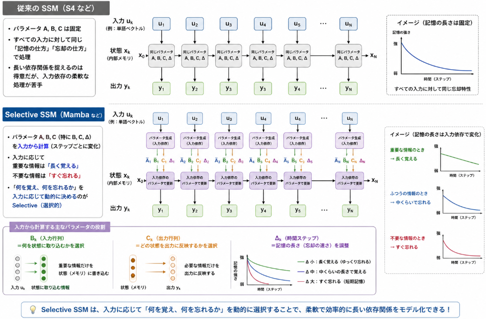

昨日のKelman Filterの話を扱うことになった原因である[Mambaというモデル](https://yoshishinnze.hatenablog.com/entry/2026/01/25/182406)で使われているSSMについて説明を行います。

__そもそもなぜSSMを話ししている？__

以下の記事の総括のあたりに理由を記載しています。

https://yoshishinnze.hatenablog.com/entry/2026/05/03/050000

## Selective SSMとは

Selective SSM は、**「入力に応じて状態遷移の挙動を変える状態空間モデル（SSM）」** です。
従来の SSM が「すべての入力に対して同じダイナミクスで処理する」のに対し、Selective SSM は **「どの情報を保持し、どの情報を捨てるか」を入力に応じて選択的に制御**します。

### 解決したかった課題

Selective SSM は、主に **「長いシーケンスを効率的かつ柔軟に扱う」** という課題を解決するために提案されました。
具体的には、以下の3つの問題を解決することを目指しています。

__1. 従来の SSM（S4 など）の限界__

従来の SSM（S4, S4D, S5 など）は、

- パラメータ 
  $$
  { A, B, C }
  $$

   が **固定**
- すべての入力に対して同じ「記憶の仕方」「忘却の仕方」で処理

という特徴がありました。これにより、

- 長い依存関係を捉えるのは得意
- しかし、**入力に応じて「何を覚え、何を忘れるか」を柔軟に変えられない**

という問題がありました。

__2. Selective SSM が解決する3つのポイント__

__(1) 入力依存のコンテキスト処理__

- 従来の SSM：すべてのトークンを同じ重みで記憶
- Selective SSM：入力に応じて
  - 重要なトークンは「長く覚える」
  - 不要なトークンは「すぐ忘れる」
- これにより、**文脈に応じた選択的な情報保持**が可能になります。

__(2) 長距離依存の効率的な扱い__

- Transformer は Attention で長距離依存を扱いますが、計算量が 
  $$
  { O(L^2) }
  $$

   で重い。
- 従来の SSM は 
  $$
  { O(L) }
  $$

   で長いシーケンスを処理できるが、柔軟性に欠ける。
- Selective SSM は、**SSM の効率性を保ちつつ、入力依存の柔軟性を追加**することで、長いシーケンスを効率的に処理できます。

__(3) 表現力の向上__

- 固定パラメータの SSM は、線形・時不変なダイナミクスに縛られ、表現力が限定的。
- Selective SSM はパラメータを入力依存にすることで、**非線形・時変な挙動に近づき、表現力が向上**します。
- これにより、Transformer に近い柔軟性を持ちつつ、計算効率を維持できます。

### 従来の SSM（S4 など）との違い

__従来の SSM__

- パラメータ 
  $$
  { A, B, C }
  $$

   は **固定**
- すべての入力に対して同じ「記憶の仕方」「忘却の仕方」で処理
- 長い依存関係を捉えるのは得意だが、**入力依存の柔軟な処理が苦手**

__Selective SSM（Mamba など）__

- パラメータ 

  $$
  { A, B, C }
  $$

  （特に 
  $$
  { B, C, \Delta }
  $$

  ）を **入力から計算**
- 入力に応じて

  - 重要な情報は「長く覚える」
  - 不要な情報は「すぐ忘れる」
- これが **「Selective（選択的）」** の意味です。

### Selective の仕組み

「重要なトークンは長く覚える」「不要なトークンはすぐ忘れる」という挙動は、
**Selective SSM のパラメータ（特に** 

 **と 
$$
{ B }
$$

）を入力から動的に計算する仕組み**によって実現されています。



__1. 仕組みの核心：入力依存パラメータ__

Selective SSM（Mamba など）では、各ステップ 

$$
{ k }
$$

 で

- $$
  { \Delta_k }$$（時間ステップ）
  $$
- $$
  { B_k }$$（入力から状態への重み）
  $$
- $$
  { C_k }$$（状態から出力への重み）
  $$

を **入力** 

 **から計算**します。

$$
{ \begin{aligned} \Delta_k &= f_\Delta(u_k) \\ B_k &= f_B(u_k) \\ C_k &= f_C(u_k) \end{aligned} }
$$

ここで 

$$
{ f_\Delta, f_B, f_C }
$$

 は通常、線形層＋活性化関数（例：SiLU）などです。

__2. 「長く覚える」 vs 「すぐ忘れる」のメカニズム__

__2.1__ 

__（時間ステップ）の役割__

離散化された状態更新は、おおまかに

$$
{ x_k = \bar{A}_k x_{k-1} + \bar{B}_k u_k }
$$

と書けます。ここで 

$$
{ \bar{A}_k }
$$

 は 
$$
{ e^{\Delta_k A} }
$$

 に相当します。

- $$
  { \Delta_k }$$ が大きい  
  → $${ e^{\Delta_k A} }$$ の固有値が大きくなり、**状態がゆっくり減衰**  
  → 情報を「長く覚える」
  $$
- $$
  { \Delta_k }$$ が小さい  
  → $${ e^{\Delta_k A} }$$ の固有値が小さくなり、**状態が速く減衰**  
  → 情報を「すぐ忘れる」
  $$

つまり、

 **を入力から調整することで、記憶の長さを選択的に制御**しています。

__2.2__ 

__（入力重み）の役割__

- $$
  { B_k }$$ が大きい  
  → 入力 $${ u_k }$$ が状態 $${ x_k }$$ に強く反映される  
  → 「この情報を状態に取り込む」
  $$
- $$
  { B_k }$$ が小さい（あるいはゼロに近い）  
  → 入力が状態にほとんど影響しない  
  → 「この情報を無視する」
  $$

これにより、**どの情報を状態に取り込むかを選択**できます。

__2.3__ 

__（出力重み）の役割__

- $$
  { C_k }$$ が大きい  
  → 状態 $${ x_k }$$ が出力 $${ y_k }$$ に強く反映される  
  → 「覚えている情報を出力に使う」
  $$
- $$
  { C_k }$$ が小さい  
  → 状態は保持していても出力にはあまり使わない  
  → 「内部では覚えているが、外には出さない」
  $$

__3. 直感的な例__

例えば、文脈の中で

- **重要なキーワード**が来た場合：
  - $$
    { \Delta }$$ を大きく設定 → 状態がゆっくり減衰 → 長く覚える
    $$
  - $$
    { B }$$ を大きく設定 → 状態に強く取り込む
    $$
  - $$
    { C }$$ を大きく設定 → 出力にも強く反映
    $$
- **不要な単語（ノイズなど）**が来た場合：
  - $$
    { \Delta }$$ を小さく設定 → 状態が速く減衰 → すぐ忘れる
    $$
  - $$
    { B }$$ を小さく設定 → 状態にあまり取り込まない
    $$
  - $$
    { C }$$ を小さく設定 → 出力にも反映しない
    $$

このように、**入力に応じて** 

 **を動的に変えることで、「何を覚え、何を忘れるか」を選択的に制御**しているのが Selective SSM の仕組みです。

## 例題

Selective SSMの長期記憶が優れているという面を確認できる例題を考えてみました。

### 問題設定

単純な2値シーケンス（0/1）での状態減衰の比較

__条件__

- 入力シーケンス：`[0, 0, 1, 0, 0, 0, 0, 0, ...]`
  - 3ステップ目だけ「1」（重要トークン）、他は「0」（ノイズ）
- Selective SSM のパラメータ：
  - 重要トークン（1）が来たとき：
    $$
    { \Delta }
    $$

     を大きく設定（例：1.0）
  - 不要トークン（0）が来たとき：
    $$
    { \Delta }
    $$

     を小さく設定（例：0.1）
  - $$
    { A }$$ は固定（例：-1.0）
    $$

__観察ポイント__

- 重要トークン（1）が来たとき：
  - $$
    { \Delta }$$ が大きい → 状態がゆっくり減衰 → 状態が長く残る
    $$
- 不要トークン（0）が来たとき：
  - $$
    { \Delta }$$ が小さい → 状態が速く減衰 → すぐ0に近づく
    $$

**状態** 

 **の時間変化をプロット**すると、
「1が来た直後に状態が立ち上がり、その後ゆっくり減衰する」様子が見えます。


## Selective SSM の出力方程式

状態 $x_k$ に蓄えられた「記憶」を、具体的な出力（次のトークンの予測材料など）として取り出すプロセスは、以下の式で表されます。

$$
y_k = C_k x_k
$$

### 1. パラメータ $C_k$ の役割：選択的読み出し

$C_k$ は **「記憶（状態）のどこを、どれだけ出力に反映させるか」** を決定するフィルタの役割を果たします。

- **$C_k$ が大きい（または感度が高い）場合**
  - 内部状態 $x_k$ に保持されている情報を積極的に出力 $y_k$ へ流します。
  - 「今は過去のこの情報を使うタイミングだ」と判断している状態です。
- **$C_k$ が 0 に近い場合**
  - 状態 $x_k$ にどんなに重要な情報が残っていても、出力には現れません。
  - 「今は記憶を使う必要がない（あるいは今の入力に対して無関係な記憶である）」と判断し、情報を内部に秘匿している状態です。

### 2. Selective SSM（Mamba）の全体像

これまでの「状態更新式」と、今回の「出力式」を合わせると、Selective SSM の 1 ステップの挙動が完成します。

- **状態更新（書き込みと保持）**
  $$
  x_k = \bar{A}_k x_{k-1} + \bar{B}_k u_k
  $$
- **出力生成（読み出し）**
  $$
  y_k = C_k x_k
  $$

ここで、$(\Delta_k, B_k, C_k)$ のすべてが **入力 $u_k$ の関数** であることが「Selective（選択的）」たる所以です。

---

### 3. Python 実装への反映

前述のシミュレーションに、出力 $y_k$ の計算を追加してみます。$C_k$ を動的に変化させることで、内部に記憶はあっても「あえて出力しない（あるいは特定のタイミングで出力する）」という挙動を確認できます。

```python
# ... (前のコードのループ内を修正) ...

    history_y = []

    for k in range(seq_len):
        # 2. Selectiveな挙動の模倣
        if abs(u[k]) > 0:
            delta = 0.1
            B = 1.0
            C = 1.0  # 重要な入力の時は出力にも反映
        else:
            delta = 0.001 
            B = 0.0
            # 応用例：特定のステップ（例：40以降）で読み出しを抑制してみる
            C = 1.0 if k < 40 else 0.1 
      
        # 3. 離散化
        A_bar = np.exp(delta * A)
        B_bar = (1.0/A) * (np.exp(delta * A) - 1.0) * B
      
        # 4. 状態更新と出力
        x = A_bar * x + B_bar * u[k]
        y = C * x  # 出力方程式の適用
      
        history_x.append(x)
        history_y.append(y)

    return u, history_x, history_y
```

このように $C_k$ を制御することで、SSM は **「何が重要か（$B_k$）」「いつまで覚えるか（$\Delta_k$）」** だけでなく、**「今それを表に出すべきか（$C_k$）」** という戦略的な読み出しが可能になります。

---

この「動的な読み出し」という性質は、文脈によって特定の情報の重要度が激しく変化するタスク（長文の要約や複雑な推論など）で特に威力を発揮します。

次は、この Selective SSM がどのようにして Transformer の Attention（注意機構）の役割を代替しているのか、あるいはその根本的な計算量の違いについて深掘りしてみますか？
