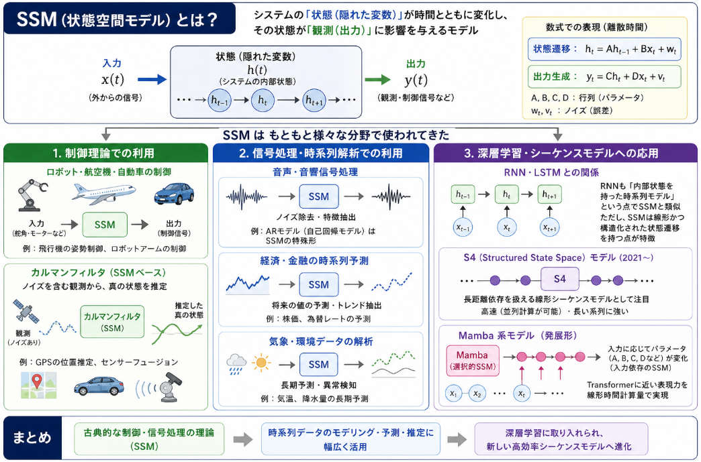
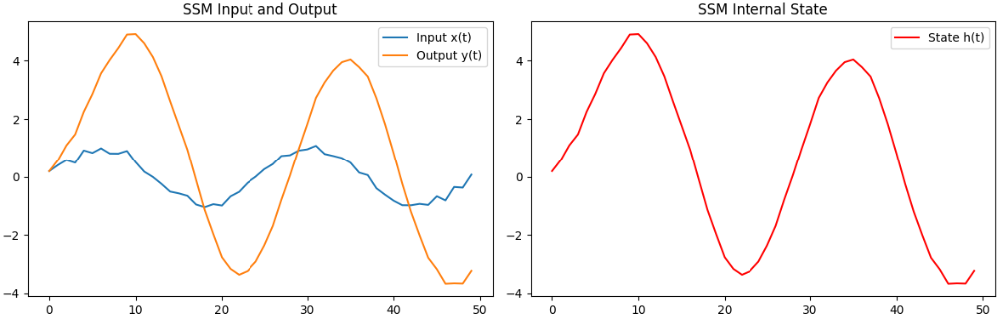

先日のMambaの結果からMambaの動作原理であるSSMについてしっかり理解すべきだと考えました。
ということでSSMについて調べてみた結果と効果について説明していきます。

## SSM概要

SSM（状態空間モデル）について、**直感的なイメージと数式の両方**から説明します。

### 1. SSM の直感的なイメージ



SSM は、**「内部状態を持ったフィルタ」** のようなものです。

- **入力**：時系列データ（音声、文章、センサー値など）
- **内部状態**：これまでの入力を要約した「記憶」
- **出力**：内部状態と現在の入力から計算される値

イメージとしては、

> 「過去の情報を内部状態に蓄え、新しい入力が来るたびに状態を更新し、その状態から出力を生成する」

という仕組みです。

### 2. 過去の情報の要約

- 各時刻 $ t $ の状態 $ h_t $ は、**過去のすべての入力 $ x_1, x_2, \dots, x_t $** の情報を含んでいます。
- 例：  
  - $ h_1 $：$ x_1 $ の情報  
  - $ h_2 $：$ x_1, x_2 $ の情報  
  - $ h_3 $：$ x_1, x_2, x_3 $ の情報  
  - ……

**数式的には**：
$$
h_t = A h_{t-1} + B x_t
$$
- $ A h_{t-1} $：過去の状態の減衰分
- $ B x_t $：新しい入力の寄与分

### 3. 出力の生成

- 状態 $ h_t $ から出力 $ y_t $ を生成します。
$$
y_t = C h_t + D x_t
$$
- $ C h_t $：状態からの変換
- $ D x_t $：入力の直接影響（skip connection）

**直感的には**：
- $ y_t $ は「**過去の情報を要約した状態 $ h_t $ に基づいて、現在の値を推定したもの**」です。

### 4. 長距離依存の扱い

- 状態 $ h_t $ が過去のすべての入力を含むため、**長距離の依存関係**を扱えます。
- 例：文頭の情報を文末で参照する、など。

**RNN との違い**：
- RNN も状態を持ちますが、SSM は**線形かつ構造化された状態遷移**を持つ点が特徴です。
- 特に Mamba 系の SSM は、**選択的（selective）** に状態を更新するため、重要な情報を長く保持できます。


## SSMの応用

SSMは、**もともと制御理論や信号処理の分野で使われていた古典的なモデル**です。  
そこから、**時系列予測・フィルタリング**、そして**深層学習（特にシーケンスモデル）** へと応用が広がりました。

### 1. 制御理論での利用

__ロボット・航空機・自動車の制御__
- システムの**状態**（位置・速度・角度など）を $ h(t) $ としてモデル化し、
- 入力 $ x(t) $（モータードライブ、舵角など）から
- 出力 $ y(t)（制御信号）を生成する
- 例：飛行機の姿勢制御、ロボットアームの制御

__カルマンフィルタ__
- SSM をベースにした**最適フィルタリングアルゴリズム**。
- ノイズを含む観測から、**真の状態を推定**するために使われます。
- 例：GPS の位置推定、センサーフュージョン

### 2. 信号処理・時系列解析での利用

__音声・音響信号処理__
- 音声信号を SSM でモデル化し、**ノイズ除去**や**特徴抽出**に利用。
- 例：AR モデル（自己回帰モデル）は SSM の特殊形と見なせます。

__経済・金融の時系列予測__
- 株価、為替レートなどを SSM でモデル化し、**将来の値の予測**や**トレンド抽出**に利用。

__気象・環境データの解析__
- 気温、降水量などの時系列を SSM でモデル化し、**長期予測**や**異常検知**に利用。

### 3. 深層学習・シーケンスモデルへの応用

__RNN・LSTM との関係__
- RNN も「内部状態を持った時系列モデル」という点で SSM と類似。
- ただし、SSM は**線形かつ構造化された状態遷移**を持つ点が特徴。

__S4（Structured State Space）モデル__
- 2021 年頃から、**深層学習向けに SSM を再設計**したモデルが登場。
- S4 は、**長距離依存を扱える線形シーケンスモデル**として注目されました。

__Mamba 系モデル__
- S4 を発展させ、**入力依存のパラメータ（選択的 SSM）** を導入。
- これにより、Transformer に近い表現力を**線形時間計算量**で実現。

## 実験
SSM の特性が分かるように、**Python で実装した例題**を用意しました。  
ここでは、「**過去の情報を要約して、将来の値を推定する**」という SSM の特性を確認します。

### 例題：SSM による「将来の値の推定」

__設定__
- 入力：正弦波にノイズを加えた時系列データ
- SSM で状態を更新し、**1ステップ先の値を予測**する
- パラメータ $ A, B, C $ は適当に設定（学習はしない）

__実装コード__

```python
import torch
import torch.nn as nn
import matplotlib.pyplot as plt

# シード固定
torch.manual_seed(42)

class SimpleSSM(nn.Module):
    def __init__(self, state_dim=1):
        super().__init__()
        self.state_dim = state_dim
        # パラメータ（固定値）
        self.A = nn.Parameter(torch.tensor([0.9]))  # 状態の減衰率
        self.B = nn.Parameter(torch.tensor([1.0]))  # 入力の重み
        self.C = nn.Parameter(torch.tensor([1.0]))  # 状態から出力への写像

    def forward(self, x):
        # x: (batch, seq_len)
        batch, seq_len = x.shape
        h = torch.zeros(batch, self.state_dim)  # 初期状態
        outputs = []
        states = []

        for t in range(seq_len):
            # 状態更新: h_t = A * h_{t-1} + B * x_t
            h = self.A * h + self.B * x[:, t:t+1]
            # 出力: y_t = C * h_t
            y = self.C * h
            outputs.append(y)
            states.append(h)

        outputs = torch.cat(outputs, dim=1)  # (batch, seq_len, 1)
        states = torch.cat(states, dim=1)    # (batch, seq_len, 1)
        return outputs, states

# データ生成: 正弦波 + ノイズ
def generate_data(seq_len=100):
    t = torch.linspace(0, 4 * torch.pi, seq_len)
    x = torch.sin(t) + 0.1 * torch.randn(seq_len)  # ノイズ付き正弦波
    return x.unsqueeze(0)  # (1, seq_len)

# モデルとデータ
model = SimpleSSM(state_dim=1)
x = generate_data(seq_len=50)

# 順伝播
with torch.no_grad():
    y_pred, states = model(x)

# 可視化
plt.figure(figsize=(12, 4))

# 入力と出力の比較
plt.subplot(1, 2, 1)
plt.plot(x.squeeze().numpy(), label='入力 x(t)')
plt.plot(y_pred.squeeze().numpy(), label='出力 y(t)')
plt.title('SSM の入力と出力')
plt.legend()

# 状態の推移
plt.subplot(1, 2, 2)
plt.plot(states.squeeze().numpy(), label='状態 h(t)', color='red')
plt.title('SSM の内部状態')
plt.legend()

plt.tight_layout()
plt.show()
```


## 実行結果の解釈



__1. 入力と出力の関係__
- 入力 $ x(t) $：正弦波にノイズが乗った波形
- 出力 $ y(t) $：SSM を通した後の波形
- **ノイズが減り、滑らかな波形**になっていることがわかります。

これは、SSM が**過去の情報を平均化（平滑化）** しているためです。

__2. 状態 $ h(t) $ の挙動__
- 状態 $ h(t) $ は、**過去の入力の重み付き和**になっています。
- $ A = 0.9 $ なので、**過去の情報を長く保持**しています。
- その結果、**ノイズがキャンセルされ、滑らかな出力**が得られます。


__SSM の特性：何が「推定」なのか？__

この例題では、SSM は**1ステップ先の値を明示的に予測していません**が、  
内部的には「**過去の情報を要約した状態 $ h_t $ から出力 $ y_t $ を生成**」しています。

- 入力：$ x_t $（現在の観測値）
- 状態：$ h_t $（過去のすべての入力の要約）
- 出力：$ y_t = C h_t $

**直感的には**：
- $ h_t $ が「過去のトレンド」を表している
- $ y_t $ は「そのトレンドに基づいた現在の推定値」

実際の Mamba や S4 では、この $ A, B, C $ を**学習**し、  
- どの情報を長く保持するか（$ A $）
- どの情報を状態に強く反映するか（$ B $）
- 状態からどのように出力するか（$ C $）

を最適化することで、**長距離依存を扱える高性能なシーケンスモデル**を実現しています。


## まとめ

- SSM は、**過去の情報を内部状態に要約**し、そこから出力を生成するモデルです。
- 例題では、ノイズ付き正弦波を SSM に通すことで、**ノイズが減り滑らかな出力**が得られることを確認しました。
- これは、SSM が**過去の情報を平均化・平滑化**しているためであり、  
  「**過去の情報に基づいて、現在の値を推定する**」という特性の一端です。

Mamba では、この「要約の仕方」を**入力依存（選択的）** に変えることで、Transformer に近い表現力を**線形時間計算量**で実現しています。
(Attentionも情報の選択制によってあの能力につながっています)


