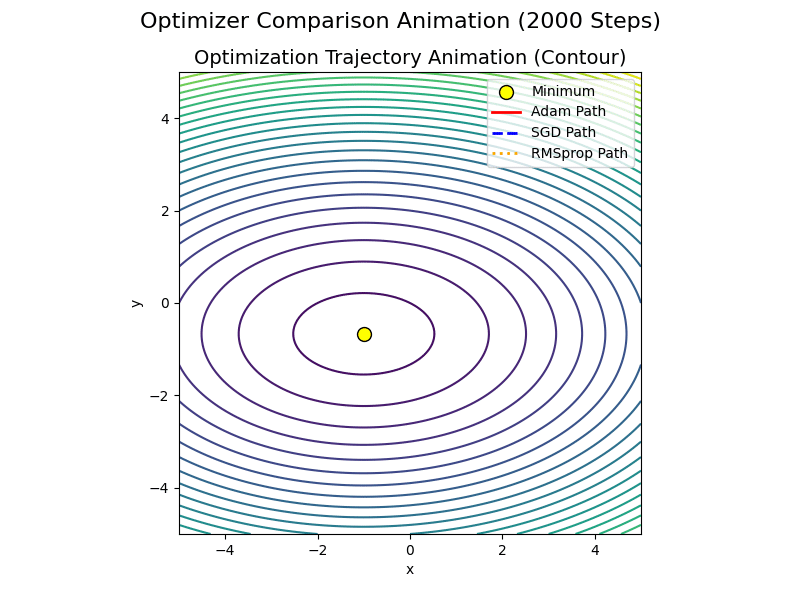
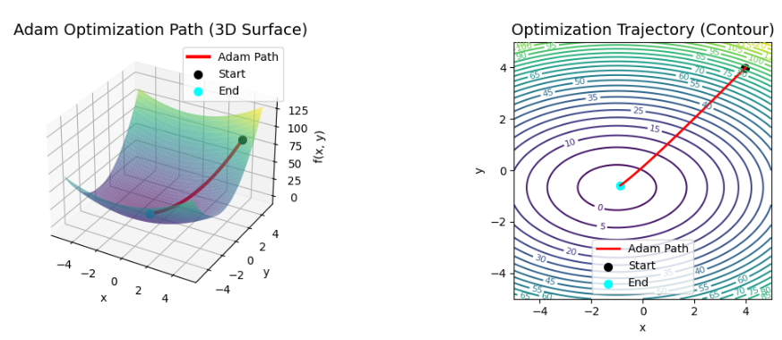
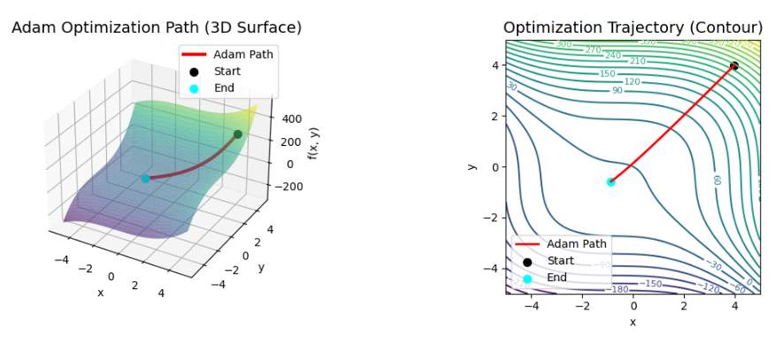
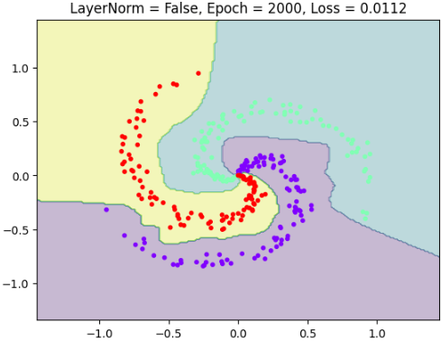
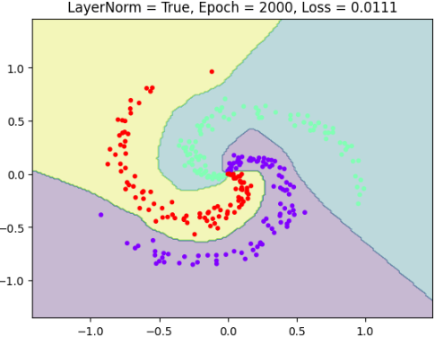

# Purpose of this page

this page is created to show the basic of neural network, which helps to understand neural network.


## Graph Theorem

Graph Theory provides the fundamental mathematical framework for understanding the structure and processes of neural networks (NNs).

### 1. Structural Correspondence (The Mapping)

The elements of a common Multi-Layer Perceptron (MLP) are directly mapped to graph theory terms:

| Graph Theory Term                 | Neural Network Element                                              |
| :-------------------------------- | :------------------------------------------------------------------ |
| **Node (Vertex)**           | **Neuron (Unit)**                                             |
| **Edge (Link)**             | **Connection (Synapse)**                                      |
| **Weighted/Directed Graph** | **Weighted connections** where signals flow unidirectionally. |

### 2. Network Structure: Directed Acyclic Graph (DAG)

The architecture of most standard neural networks is defined as a **Directed Acyclic Graph (DAG)**.

* **Directed:** Information (signals) always flows in **one direction**—from the input layer through the hidden layers to the output layer (Forward Propagation).
* **Acyclic:** There are **no loops or cycles** within the network, which ensures that the computation sequence can be strictly ordered.

### 3. Computational Process

Calculations within a neural network are described as **operations on nodes and edges**:

* **Forward Propagation:** The input $I_j$ to a neuron $j$ is the **sum of weighted inputs** from all connecting input edges. This is mathematically expressed as:
  $$
  j = \sum_{i} O_i \cdot W_{ij} + Bias_j
  $$
* **Backpropagation:** The process of updating weights during learning (minimizing loss) is an optimization method described as traversing the **graph's edges in reverse**, calculating and propagating the gradient (partial derivatives) of the loss function.

### Historical Origin

The foundation of Graph Theory dates back to the 18th century with mathematician **Leonhard Euler**. His solution to the **"Seven Bridges of Königsberg problem"** in 1736, where he modeled landmasses as vertices and bridges as edges, established the structural basis for the entire field.


## Fully Connect Layer

Core Concepts Illustrated by the Fully Connected Layer Example

1. **The Function of the Fully Connected Layer:**
   The primary job of the Fully Connected Layer is to take the input data, perform a **weighted multiplication** (multiplying the input values by their corresponding weights), and then calculate the **sum** of these products, finally adding the bias. This is the **linear transformation** ($y = Wx + b$).
2. **The Meaning of Weights ($W$):**
   The **weights** represent how **important** or **influential** a specific input feature is in determining the final result, and whether that influence is **positive or negative**.

   * *Example:* A high positive weight on "Taste" means that feature strongly increases the "Satisfaction Score." A negative weight on "Price" means that feature strongly decreases the score.
3. **The Process of Learning:**
   **AI learning** is the process where, using a large volume of data (e.g., recorded ramen experiences and actual satisfaction scores), the system automatically finds the **optimal** values for the **weights ($W$)** and **bias ($b$)** to minimize prediction errors. This process determines the network's "preferences" and decision-making logic.

```python
import numpy as np

# --- 1. 定義（PyTorchの重みとバイアスと等価なNumPy配列） ---

# PyTorchの fc_layer.weight.data = torch.tensor([[10.0, -5.0, -10.0]]) に対応
# NumPyでは形状 (1, 3) の配列として定義
W = np.array([[10.0, -5.0, -10.0]])

# PyTorchの fc_layer.bias.data = torch.tensor([50.0]) に対応
# NumPyでは形状 (1,) または (1, 1) の配列として定義（ブロードキャストのため）
b = np.array([50.0])


# --- 2. 入力データの準備 ---

# PyTorchの shop_a = torch.tensor([[10.0, 1.0, 1.0]]) に対応
# 形状 (1, 3) の配列として定義
shop_a_np = np.array([[10.0, 1.0, 1.0]])

# PyTorchの shop_b = torch.tensor([[3.0, 0.5, 0.0]]) に対応
shop_b_np = np.array([[3.0, 0.5, 0.0]])


# --- 3. 全結合層の計算ロジック（線形変換: Y = X @ W.T + b） ---

def fully_connected_forward(X_in, W_params, b_params):
    """
    全結合層の順伝播を計算します。
    X_in @ W_params.T + b_params
    """
    # 処理 1: 行列の積 (X と W の転置 W.T のドット積)
    # X_in (1, 3) と W_params.T (3, 1) の積は (1, 1) となります。
    # NumPyでは @ 演算子または np.dot を使用
    weighted_sum = X_in @ W_params.T 
  
    # 処理 2: バイアス b の加算
    # weighted_sum (1, 1) に b_params (1,) がブロードキャストされて加算されます。
    output = weighted_sum + b_params
  
    # スコア（要素を取り出す）
    return output.item()


# --- 4. 計算実行と結果表示 ---

score_a = fully_connected_forward(shop_a_np, W, b)
score_b = fully_connected_forward(shop_b_np, W, b)

print(f"A店の満足度: {score_a:.1f} 点")
print(f"B店の満足度: {score_b:.1f} 点")
```

## Activate Function

__Exercise: Spiral Data Classification Challenge__

1. Challenge Overview

The goal of this exercise is to classify a spiral dataset where two colors of data points are intricately intertwined in a spiral shape. This dataset represents a non-linearly separable problem.

The challenge involves training a simple neural network to classify these red and blue points into their respective categories, comparing two different model setups:

Experiment A (Expected Failure): Train the model without an activation function (or using only a linear function).

Experiment B (Expected Success): Train the model with a non-linear activation function (such as ReLU).

2. Expected Results

The results visually demonstrate the critical role of non-linearity in deep learning models.

Experiment A (Linear Model):

The model will only be able to draw a single straight line (or a flat plane in higher dimensions) as a decision boundary.

Since the data is spiraled and cannot be separated by a straight line, the model will fail to classify the points correctly.

The accuracy score will stagnate around 50% (equivalent to random guessing).

Experiment B (Non-Linear Model):

The model will introduce non-linearity through the activation function, allowing it to transform the data space internally.

The learned decision boundary will become complex and curvy, enabling it to follow the intricate shape of the spiral.


## GradientDescent

The core relationship between **Gradient Descent** and **Neural Networks** is that Gradient Descent is the **optimization algorithm** that enables the network to **learn**.

## Key Relationship Summary

Gradient Descent is the essential mechanism used to adjust the parameters (**weights** and **biases**) of a Neural Network to minimize its **Loss Function** (the measure of error).

### 1. The Goal: Minimizing Loss

* **Neural Network Learning** is fundamentally an **optimization problem**: finding the specific set of parameters that results in the lowest possible error when comparing the network's predictions to the true target values.
* This error is quantified by the **Loss Function** (e.g., Mean Squared Error or Cross-Entropy).

### 2. Computing the Gradient (Backpropagation)

* Before adjusting the parameters, the network must determine the **direction** and **magnitude** of the error gradient (the slope) at the current parameter values.
* **Backpropagation** (Error Backpropagation) is the highly efficient algorithm used specifically in Neural Networks to calculate this **gradient** across all weights and biases. It tells the network exactly how much the loss will increase or decrease if a specific weight is nudged.

### 3. Updating Parameters (Gradient Descent)

* The Gradient calculated by Backpropagation indicates the direction of **steepest ascent** (where the loss increases fastest).
* **Gradient Descent** then updates the parameters by moving in the **opposite direction** (steepest descent).
* The **Learning Rate** ($\eta$) determines the step size taken in this opposite direction, according to the formula:
  $$
  theta_{\text{new}} = \theta_{\text{old}} - \eta \nabla J(\theta)
  $$

### 4. Role of Optimizers

* In practical deep learning, basic Gradient Descent is often replaced by more advanced **Optimizers** (like **Adam** or **RMSprop**).
* These advanced methods are still fundamentally built on the principle of Gradient Descent—they calculate and use the gradient—but they incorporate techniques (like momentum or adaptive learning rates) to make the learning process faster and more stable.


## Optimization Algorithms in Neural Networks: An Overview and Evolution

The optimization algorithms used in neural networks are primarily based on  **Gradient Descent (GD)** . They have evolved consistently with the goal of **overcoming the shortcomings of GD and achieving faster, more stable convergence to a better solution.**

This evolutionary path addresses key challenges arising from data scale-up, computational resource constraints, and the complex geometry of loss functions (e.g., narrow valleys, flat regions).

---

## Key Stages in the Evolution of Optimization Algorithms

The evolution of optimization algorithms can be broadly divided into three main stages:

### 1. Birth of Gradient Descent (GD) and Initial Challenges

| **Stage**   | **Algorithm**                         | **Development Rationale and Challenge**                                                                                                                                                                                    |
| ----------------- | ------------------------------------------- | -------------------------------------------------------------------------------------------------------------------------------------------------------------------------------------------------------------------------------- |
| **Initial** | **Batch Gradient Descent (Batch GD)** | **Mathematical Foundation:**Established as the method to find the minimum value by moving in the opposite direction of the gradient (slope), based on the mathematical principle that the function's value will always decrease. |
|                   |                                             | **Challenge:**Calculating the gradient requires processing the**entire training dataset**for a single parameter update, leading to prohibitively high computational cost and time when the dataset is massive.       |

### 2. Introduction of SGD and Momentum

Innovations were introduced to solve the computational efficiency problem and accelerate convergence.

| **Stage**      | **Algorithm**                         | **Development Rationale and Challenge**                                                                                                                                                                                                                                                                       |
| -------------------- | ------------------------------------------- | ------------------------------------------------------------------------------------------------------------------------------------------------------------------------------------------------------------------------------------------------------------------------------------------------------------------- |
| **Efficiency** | **Stochastic Gradient Descent (SGD)** | **Rationale:**Conceived to solve the computational cost issue of Batch GD. It drastically improves computational efficiency by using the gradient from only a**small, randomly selected subset of data (mini-batch)**for parameter updates.                                                                   |
|                      | **Momentum / Nesterov**               | **Rationale:**SGD has a tendency to**oscillate**near the bottom of a loss function's valley. By introducing the concept of**inertia**from physics, it remembers the previous update direction and adds it to the current gradient, reducing oscillation and allowing for more stable convergence. |

### 3. Emergence of Adaptive Learning Rates

SGD still required **manual tuning** of the learning rate (**$\alpha$**) and applied a **uniform learning rate** to all parameters, which was inefficient. Algorithms were developed to automatically adjust the learning rate for each parameter.

| **Stage**      | **Algorithm**                         | **Development Rationale and Features**                                                                                                                                                                                                                                                                                                  |
| -------------------- | ------------------------------------------- | --------------------------------------------------------------------------------------------------------------------------------------------------------------------------------------------------------------------------------------------------------------------------------------------------------------------------------------------- |
| **Adaptivity** | **AdaGrad**                           | **Rationale:**Adjusts the learning rate for each parameter proportional to the inverse of the sum of squared past gradients. This allows for**larger learning rates for parameters with sparse, small gradients**and**smaller learning rates for parameters with frequent, large gradients.**                               |
|                      | **RMSprop**                           | **Rationale:**AdaGrad's use of a cumulative sum causes the**learning rate to shrink too aggressively toward zero**as training progresses. RMSprop solves this by using an**Exponential Moving Average (EMA)**of the squared gradients instead of the sum, mitigating the decay and enabling long-term learning on large datasets. |
|                      | **Adam (Adaptive Moment Estimation)** | **Rationale:**Developed by combining the benefits of RMSprop's**adaptive learning rate**with Momentum's **inertia** . It is one of the most widely used algorithms today due to its**high performance and stability**across many neural network tasks.                                                                |

## Chronology of Optimization Algorithms

The development of optimization algorithms chronologically:

| **Era** | **Algorithm** | **Key Improvement**                                               |
| ------------- | ------------------- | ----------------------------------------------------------------------- |
| 1950s         | **Batch GD**  | Mathematical foundation                                                 |
| 1960s         | **SGD**       | Improvement in**Computational Efficiency**(Mini-batching)         |
| 1980s         | **Momentum**  | Suppression of**Oscillation**and faster convergence (Inertia)     |
| 2011          | **AdaGrad**   | **Per-parameter learning rate**adjustment (Adaptivity)            |
| 2012          | **RMSprop**   | Mitigates AdaGrad's**aggressive learning rate decay**             |
| 2014          | **Adam**      | Integrates RMSprop's**Adaptivity**and Momentum's**Inertia** |

## Implementation and Visualization

As part of my LLM learning process, I implemented several optimization algorithms in NumPy and created an animation to visually inspect their convergence properties. The implemented algorithms were  **SGD** ,  **RMSprop** , and  **Adam** .







## Effect of Layer Normalization on Learning Stability

**Layer Normalization** has the effect of **stabilizing the training process**.

We investigated this effect by comparing models with and without Layer Normalization using non-linear classification data.

The results obtained are summarized below:

### 1. Speed of Convergence (Learning Speed) 🚀

By suppressing the variance (fluctuation) across individual data samples, Layer Normalization enables the model to consistently grasp the underlying patterns it needs to learn.

Observing the progression of the loss, it can be confirmed that the loss **converges much earlier** when Layer Normalization is present .

### 2. Classification Boundary (Decision Boundary) 📉

The visualization below shows the classification boundaries at **Epoch 2000** for the models with and without Layer Normalization.

* **Without Layer Normalization:** The classification boundary is observed to be **jagged** (or rough).
* **With Layer Normalization:** The classification boundary is confirmed to be **smoothly classified** .




