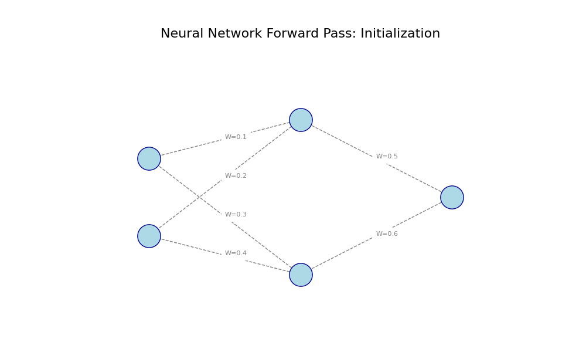
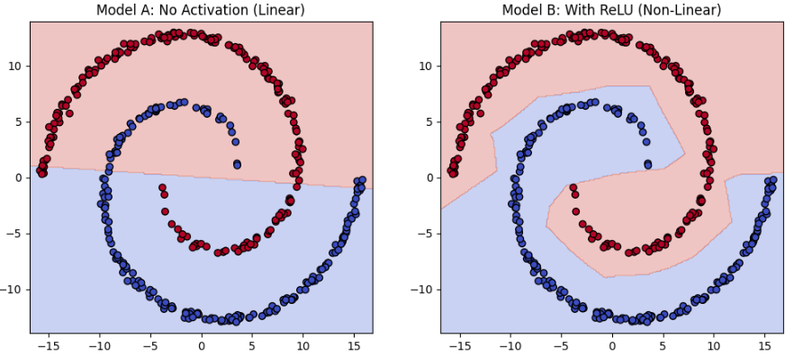
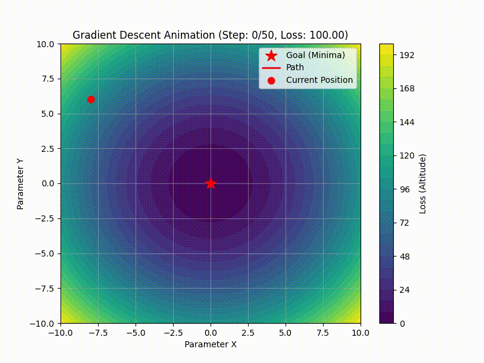

# Purpose of this page
this page is created to show the basic of neural network, which helps to understand neural network. 

## Graph Theorem

Graph Theory provides the fundamental mathematical framework for understanding the structure and processes of neural networks (NNs).

### 1. Structural Correspondence (The Mapping)

The elements of a common Multi-Layer Perceptron (MLP) are directly mapped to graph theory terms:

| Graph Theory Term | Neural Network Element |
| :--- | :--- |
| **Node (Vertex)** | **Neuron (Unit)** |
| **Edge (Link)** | **Connection (Synapse)** |
| **Weighted/Directed Graph** | **Weighted connections** where signals flow unidirectionally. |

### 2. Network Structure: Directed Acyclic Graph (DAG)

The architecture of most standard neural networks is defined as a **Directed Acyclic Graph (DAG)**.

* **Directed:** Information (signals) always flows in **one direction**—from the input layer through the hidden layers to the output layer (Forward Propagation).
* **Acyclic:** There are **no loops or cycles** within the network, which ensures that the computation sequence can be strictly ordered.

### 3. Computational Process

Calculations within a neural network are described as **operations on nodes and edges**:

* **Forward Propagation:** The input $I_j$ to a neuron $j$ is the **sum of weighted inputs** from all connecting input edges. This is mathematically expressed as:
    $$I_j = \sum_{i} O_i \cdot W_{ij} + Bias_j$$
* **Backpropagation:** The process of updating weights during learning (minimizing loss) is an optimization method described as traversing the **graph's edges in reverse**, calculating and propagating the gradient (partial derivatives) of the loss function.

### Historical Origin

The foundation of Graph Theory dates back to the 18th century with mathematician **Leonhard Euler**. His solution to the **"Seven Bridges of Königsberg problem"** in 1736, where he modeled landmasses as vertices and bridges as edges, established the structural basis for the entire field.

## Activate Function

__Exercise: Spiral Data Classification Challenge__

1. Challenge Overview

The goal of this exercise is to classify a spiral dataset where two colors of data points are intricately intertwined in a spiral shape. This dataset represents a non-linearly separable problem.

The challenge involves training a simple neural network to classify these red and blue points into their respective categories, comparing two different model setups:

Experiment A (Expected Failure): Train the model without an activation function (or using only a linear function).

Experiment B (Expected Success): Train the model with a non-linear activation function (such as ReLU).

2. Expected Results

The results visually demonstrate the critical role of non-linearity in deep learning models.

Experiment A (Linear Model):

The model will only be able to draw a single straight line (or a flat plane in higher dimensions) as a decision boundary.

Since the data is spiraled and cannot be separated by a straight line, the model will fail to classify the points correctly.

The accuracy score will stagnate around 50% (equivalent to random guessing).

Experiment B (Non-Linear Model):

The model will introduce non-linearity through the activation function, allowing it to transform the data space internally.

The learned decision boundary will become complex and curvy, enabling it to follow the intricate shape of the spiral.

## GradientDescent

The core relationship between **Gradient Descent** and **Neural Networks** is that Gradient Descent is the **optimization algorithm** that enables the network to **learn**.

## Key Relationship Summary

Gradient Descent is the essential mechanism used to adjust the parameters (**weights** and **biases**) of a Neural Network to minimize its **Loss Function** (the measure of error).

### 1. The Goal: Minimizing Loss

* **Neural Network Learning** is fundamentally an **optimization problem**: finding the specific set of parameters that results in the lowest possible error when comparing the network's predictions to the true target values.
* This error is quantified by the **Loss Function** (e.g., Mean Squared Error or Cross-Entropy).

### 2. Computing the Gradient (Backpropagation)

* Before adjusting the parameters, the network must determine the **direction** and **magnitude** of the error gradient (the slope) at the current parameter values.
* **Backpropagation** (Error Backpropagation) is the highly efficient algorithm used specifically in Neural Networks to calculate this **gradient** across all weights and biases. It tells the network exactly how much the loss will increase or decrease if a specific weight is nudged.

### 3. Updating Parameters (Gradient Descent)

* The Gradient calculated by Backpropagation indicates the direction of **steepest ascent** (where the loss increases fastest).
* **Gradient Descent** then updates the parameters by moving in the **opposite direction** (steepest descent). 
* The **Learning Rate** ($\eta$) determines the step size taken in this opposite direction, according to the formula:
    $$
    \theta_{\text{new}} = \theta_{\text{old}} - \eta \nabla J(\theta)
    $$

### 4. Role of Optimizers

* In practical deep learning, basic Gradient Descent is often replaced by more advanced **Optimizers** (like **Adam** or **RMSprop**).
* These advanced methods are still fundamentally built on the principle of Gradient Descent—they calculate and use the gradient—but they incorporate techniques (like momentum or adaptive learning rates) to make the learning process faster and more stable.

