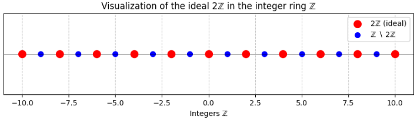
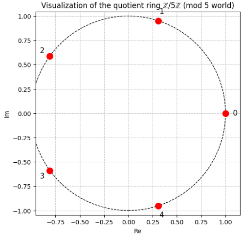
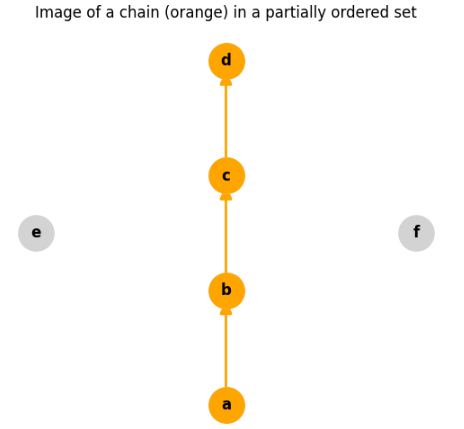

# Zornの補題と整列可能定理

## イデアル

イデアルの数学的な定義について、順を追って説明します。

### 1. イデアルとは何か（直感的なイメージ）

イデアルは、**環（ring）** という代数構造の中で定義される特別な部分集合です。  
直感的には、

- 「ある性質を保ったまま、0 に近い元の集まり」
- 「割り算の余りを無視するときに残る元の集まり」

と考えるとイメージしやすいです。

例：整数環 ℤ で「偶数全体の集合」を考えます。

- 偶数＋偶数＝偶数  
- 偶数×任意の整数＝偶数

このように、「偶数全体」は、足し算と整数倍に対して閉じています。  
この「偶数全体の集合」が、ℤ のイデアルの一例です。

### 2. 環（ring）の復習

イデアルを定義する前に、**環**の定義を簡単に確認します。

環とは、集合 $R$ とその上の二つの演算

- 加法：$+$（可換群をなす）
- 乗法：$\cdot$（結合的で、単位元 1 を持つことが多い）

が定義され、次の条件を満たす代数系です。

1. $(R,+)$ は可換群（加法についてアーベル群）
2. 乗法は結合的：$(a \cdot b) \cdot c = a \cdot (b \cdot c)$
3. 乗法の単位元 1 が存在：$1 \cdot a = a \cdot 1 = a$
4. 分配法則：  
   - $a \cdot (b + c) = a \cdot b + a \cdot c$  
   - $(a + b) \cdot c = a \cdot c + b \cdot c$

>__可換群（commutative group）__  
>**可換群** とは、**足し算のように「逆元が存在し、交換法則が成り立つ」演算を持つ集合**のことです。
>もう少し正確に言うと、集合 $G$ とその上の演算 $+$ が次の条件を満たすとき、$(G,+)$ は可換群です。
>1. **結合則**：$(a+b)+c = a+(b+c)$
>2. **単位元の存在**：ある元 $0 \in G$ が存在して、すべての $a \in G$ について $a+0 = 0+a = a$
>3. **逆元の存在**：各 $a \in G$ に対して、ある $-a \in G$ が存在して $a + (-a) = (-a) + a = 0$
>4. **交換法則（可換性）** ：$a+b = b+a$
>__具体例__  
>- 整数全体 ℤ と通常の足し算 $+$  
>- 実数全体 ℝ と足し算 $+$  
>- ベクトル空間のベクトル同士の足し算
>これらはすべて可換群です。
>__環との関係__  
>環 $(R,+,\cdot)$ では、
>- $(R,+)$ が可換群であることが要求されます。
>- つまり、環の「足し算部分」は常に可換群です。
>要するに、**可換群＝「足し算がきちんとできる集合」** と考えてください。


代表例：
- 整数全体 ℤ
- 実数係数の多項式環 ℝ[x]
- 行列環 $M_n(\mathbb{R})$

### 3. イデアルの定義（数学的に）

環 $R$ の部分集合 $I \subset R$ が**イデアル（ideal）** であるとは、次の2条件を満たすことです。

__(1) 加法について部分群である__
- $I$ は加法について閉じている：  
  $a, b \in I \Rightarrow a + b \in I$
- 加法の逆元が $I$ に属する：  
  $a \in I \Rightarrow -a \in I$
- 特に、$0 \in I$（零元が含まれる）

まとめると、$(I,+)$ は $(R,+)$ の部分群です。

__(2) 「外からの掛け算」で閉じている__

任意の $a \in I$ と任意の $r \in R$ について、

- 左から掛けても $I$ に入る：$r \cdot a \in I$
- 右から掛けても $I$ に入る：$a \cdot r \in I$

これをまとめて、

$$
\forall a \in I,\ \forall r \in R,\quad r a \in I,\ a r \in I
$$

と書きます。  
可換環の場合は $r a = a r$ なので、どちらか一方の条件で十分です。

### 4. 左イデアル・右イデアル・両側イデアル

環が非可換（行列環など）の場合、条件を弱めた概念もあります。

- **左イデアル**：  
  $\forall a \in I,\ \forall r \in R,\ r a \in I$
- **右イデアル**：  
  $\forall a \in I,\ \forall r \in R,\ a r \in I$
- **両側イデアル（単にイデアル）**：  
  左イデアルかつ右イデアル

可換環（ℤ, ℝ[x] など）では、左・右・両側の区別はなく、単に「イデアル」と呼びます。

### 5. 具体例

__例1：整数環 ℤ のイデアル__

ℤ のイデアルは、すべて

$$
n\mathbb{Z} = \{ nk \mid k \in \mathbb{Z} \}
$$

の形をしています（$n$ は 0 以上の整数）。

- $n=0$：$\{0\}$（自明なイデアル）
- $n=1$：ℤ 全体（単位イデアル）
- $n=2$：偶数全体
- $n=3$：3の倍数全体

これらはすべて、  
- 加法について閉じている  
- 任意の整数倍で閉じている  
ので、イデアルの条件を満たします。

__例2：多項式環 ℝ[x] のイデアル__

ℝ[x] のイデアルの例：

- 定数項 0 の多項式全体：  
  $\{ a_1 x + a_2 x^2 + \dots \mid a_i \in \mathbb{R} \}$
- ある多項式 $f(x)$ で割り切れる多項式全体：  
  $\{ f(x) g(x) \mid g(x) \in \mathbb{R}[x] \}$

これらも、和と任意の多項式倍で閉じているのでイデアルです。

__例3:イデアルのイメージ1__

このコードでは、数直線上に整数をプロットし、イデアル $n\mathbb{Z}$ に属する点を赤で、それ以外を青で表示します。これにより、「一定の間隔で並ぶ点の集まり」がイデアルであることが視覚的にわかります。



```python
import matplotlib.pyplot as plt
import numpy as np

def visualize_integer_ideal(n, xmin=-10, xmax=10):
    """
    整数環 ℤ のイデアル nℤ を可視化する。
    nℤ = { ..., -2n, -n, 0, n, 2n, ... }
    """
    # 整数点の生成
    integers = np.arange(xmin, xmax + 1)
    ideal_multiples = integers[integers % n == 0]
    non_ideal = integers[integers % n != 0]

    plt.figure(figsize=(10, 2))
    # イデアルに属する点（赤）
    plt.scatter(ideal_multiples, np.zeros_like(ideal_multiples),
               color='red', s=100, label=f'{n}ℤ (ideal)', zorder=3)
    # イデアルに属さない点（青）
    plt.scatter(non_ideal, np.zeros_like(non_ideal),
               color='blue', s=50, label=f'ℤ ∖ {n}ℤ', zorder=2)

    plt.axhline(0, color='black', linewidth=0.5)
    plt.yticks([])
    plt.xlabel('Integers ℤ')
    plt.title(f'Visualization of the ideal {n}ℤ in the integer ring ℤ')
    plt.legend()
    plt.grid(True, linestyle='--', alpha=0.7)
    plt.show()

# 例：偶数全体 2ℤ
visualize_integer_ideal(2)
```

__例4:イデアルのイメージ2__

イデアル $n\mathbb{Z}$ で割った世界（mod n）を、円周上の点として可視化します。

この可視化は、イデアル $n\mathbb{Z}$ で割ることで、整数が「n で割った余り」だけに分類される→その余りを円周上の点として表す。
というイメージを示します。




```python
def visualize_quotient_ring_mod_n(n):
    """
    剰余環 ℤ/nℤ を円周上の点として可視化する。
    イデアル nℤ で割ると、0,1,...,n-1 の n 個の元になる。
    """
    angles = np.linspace(0, 2*np.pi, n, endpoint=False)
    x = np.cos(angles)
    y = np.sin(angles)

    plt.figure(figsize=(6, 6))
    plt.scatter(x, y, s=100, color='red', zorder=3)
    for i in range(n):
        plt.text(x[i]*1.1, y[i]*1.1, str(i), fontsize=12,
                 ha='center', va='center')

    circle = plt.Circle((0,0), 1, fill=False, color='black', linestyle='--')
    plt.gca().add_artist(circle)
    plt.axis('equal')
    plt.title(f'Visualization of the quotient ring ℤ/{n}ℤ (mod {n} world)')
    plt.xlabel('Re')
    plt.ylabel('Im')
    plt.grid(True, linestyle='--', alpha=0.7)
    plt.show()

# 例：ℤ/5ℤ
visualize_quotient_ring_mod_n(5)
```


### 6. イデアルが重要な理由

イデアルは、次のような理由で数学的に重要です。

1. **剰余環（商環）の構成**  
   イデアル $I$ があると、環 $R$ を $I$ で「割った」環 $R/I$ を構成できます。  
   これは、整数の mod n の一般化です。

2. **環の構造の分析**  
   イデアルを通じて、環が単純かどうか（単純環）、既約分解できるかどうか（ネーター環・アルティン環）などを調べます。

3. **代数幾何との対応**  
   可換環のイデアルと、幾何的な対象（アフィン代数多様体）が一対一に対応します（ヒルベルトの零点定理）。

4. **数論・代数幾何・表現論など、多くの分野で基本概念**  
   整数の素因数分解の一般化（デデキント環）、多項式の零点集合の研究など、広く使われます。

__確認問題__

極大イデアルに関する確認問題を5題出題します。  
基礎的な定義から、Zornの補題を使った存在証明まで含みます。

__確認問題1：定義と基本性質__

**問題**  
可換環 $R$（単位元 1 を持つ）のイデアル $M$ が**極大イデアル**であるとは、次の2条件を満たすことである。

1. $M \neq R$
2. $M \subsetneq I \subset R$ となるイデアル $I$ は存在しない。

このとき、次の問いに答えよ。

(1) 極大イデアル $M$ について、剰余環 $R/M$ は体であることを示せ。  
(2) 逆に、$R/M$ が体ならば $M$ は極大イデアルであることを示せ。

__確認問題2：整数環 ℤ の極大イデアル__

**問題**  
整数環 ℤ の極大イデアルをすべて求めよ。  
また、それぞれの剰余環 ℤ/$M$ が体であることを確認せよ。

__確認問題3：多項式環 ℝ[x] の極大イデアル__

**問題**  
実数係数の多項式環 ℝ[x] について、次の問いに答えよ。

(1) 1次多項式 $x - a$（$a \in \mathbb{R}$）で生成されるイデアル $(x-a)$ は極大イデアルであることを示せ。  
(2) ℝ[x] の極大イデアルはすべて $(x-a)$ の形であるかどうか、理由とともに答えよ。


__解答__

__問題1__
- (1) $R/M$ の0でない元 $a+M$ に対し、$a \notin M$ より $M + (a) = R$ となるので、逆元が存在。  
- (2) $R/M$ が体なら、$M \subsetneq I$ となるイデアル $I$ に対し、$I/M$ は $R/M$ の自明でないイデアルだが、体のイデアルは自明のみなので矛盾。

__問題2__
- ℤ の極大イデアルは $p\mathbb{Z}$（$p$ は素数）。  
- ℤ/$p\mathbb{Z}$ は有限体。

__問題3__
- (1) ℝ[x]/(x-a) ≅ ℝ（評価写像）より体。  
- (2) いいえ。例：$(x^2+1)$ は ℝ[x] の極大イデアルだが、1次多項式ではない。


>__鎖（chain）__
>集合における**鎖（chain）** とは、**半順序集合の中で、すべての元が互いに比較できる部分集合**のことです。
>もう少し詳しく言うと：
>- 半順序集合 $(P, \leq)$ の部分集合 $C \subset P$ が鎖であるとは、
>  - 任意の $x, y \in C$ について、$x \leq y$ または $y \leq x$ のどちらかが成り立つ
  ことです。
>つまり、**鎖は「全順序になっている部分集合」** です。
>以下絵のオレンジのノードをつなげた部分集合は、半順序集合の中で「互いに比較できる元の列」として表現されてます。これが鎖のイメージです。
>
>例
>- 整数の通常の順序 $\leq$ で、$\{1,2,3,4,5\}$ は鎖（1<2<3<4<5）。
>- 自然数全体 $\mathbb{N}$ も鎖（0<1<2<...）。
>- 集合の包含関係で、$\{\varnothing, \{1\}, \{1,2\}\}$ は鎖（$\varnothing \subset \{1\} \subset \{1,2\}$）。
>__なぜ重要か__
>- Zornの補題では、「任意の鎖に上界がある」という条件が鍵になります。
>- 整列集合は、特に「強い鎖」（どの部分集合にも最小元がある）と見なせます。
>- 鎖は、**順序構造を調べるための基本的な道具**として、集合論・順序論・代数などで広く使われます。
>要するに、**鎖＝互いに比較できる元の列**です。


## 帰納的順序とZornの補題


以下では、順序集合の一般論に基づいて「帰納的順序」と「Zornの補題」の数学的な定義を説明します。

### 1. 帰納的順序（inductive order）の定義

__1.1 準備：上界・極大元__

$(P,\leq)$ を**半順序集合**（反射的・反対称・推移的）とします。

- **上界（upper bound）**  
  部分集合 $A \subset P$ に対し、$u \in P$ が $A$ の**上界**であるとは、
  $$
  \forall a \in A,\ a \leq u
  $$
  が成り立つことをいう。

- **極大元（maximal element）**  
  元 $m \in P$ が**極大元**であるとは、
  $$
  \forall x \in P,\ (m \leq x \Rightarrow m = x)
  $$
  が成り立つこと、すなわち「$m$ より真に大きい元は存在しない」ことをいう。

__1.2 帰納的順序の定義__

半順序集合 $(P,\leq)$ が**帰納的（inductive）** であるとは、次の条件を満たすことをいいます。

> **任意の全順序部分集合（鎖）$C \subset P$ が、$P$ において上界を持つ。**

ここで「全順序部分集合（鎖）」とは、$C$ の任意の2元が比較可能な部分集合のことです。

**言い換え**：
- $P$ のどんな「一直線に並んだ部分」$C$ を取っても、その「先」を指し示す元（上界）が $P$ の中に存在する。
- この条件は、「鎖が無限に伸び続けることがあっても、その極限的な候補が $P$ の中に存在する」ことを要請しています。

### 2. Zornの補題（Zorn’s lemma）の定義

__2.1 主張__

**Zornの補題**は、選択公理と同値な命題で、次のように述べられます。

> **任意の帰納的半順序集合は、少なくとも1つの極大元を持つ。**

記号で書くと：

- $(P,\leq)$：半順序集合
- $(P,\leq)$ が帰納的（任意の鎖が上界を持つ）ならば、
  $$
  \exists m \in P\ \text{ s.t. } m \text{ は極大元}
  $$

__2.2 直感的な意味__

- 帰納的順序は「鎖がどこまでも伸びるなら、その先を受け止める元が存在する」という条件。
- Zornの補題は、「そのような『先を受け止める元』の中に、それ以上大きくできない“極大な元”が必ず存在する」と主張します。
- これは「無限に長い鎖をたどっていくと、どこかで行き止まり（極大元）にぶつかる」というイメージです。

### 3. 具体例と使い方のイメージ

__3.1 帰納的順序の例__

- 集合 $X$ の部分集合全体 $\mathcal{P}(X)$ に包含関係 $\subset$ を入れたもの：
  - 任意の鎖（包含に関して全順序な部分集合族）$C \subset \mathcal{P}(X)$ に対し、その合併 $\bigcup C$ が上界になる。
  - よって $(\mathcal{P}(X),\subset)$ は帰納的。

- ベクトル空間の部分空間全体に包含関係を入れたもの：
  - 鎖の合併が再び部分空間になるので、帰納的。

__3.2 Zornの補題の典型的な使い方__

Zornの補題は、次のような「存在証明」に使われます。

- **基底の存在**：任意のベクトル空間は基底を持つ。
- **極大イデアルの存在**：単位的可換環には極大イデアルが存在する。
- **整列可能定理**：任意の集合には整列順序が存在する（選択公理と同値）。

**証明の流れ（概略）**：
1. 考えたい対象（例：線形独立な部分集合、真のイデアルなど）の集合 $P$ を用意し、包含関係で半順序集合にする。
2. 任意の鎖 $C \subset P$ に対して、その合併（または適切な極限）が $P$ に属することを示し、$(P,\leq)$ が帰納的であることを確認する。
3. Zornの補題により、$P$ には極大元 $m$ が存在する。
4. その $m$ が求めるもの（基底、極大イデアルなど）であることを示す。

### 4. 選択公理との関係

- Zornの補題は、**選択公理（Axiom of Choice）と同値**です。
- すなわち、ZF公理系（選択公理を除いた通常の集合論）のもとで：
  - 選択公理 ⇒ Zornの補題
  - Zornの補題 ⇒ 選択公理
  の両方が証明できます。
- したがって、Zornの補題を用いる証明は、本質的に「選択公理を使っている」ことになります。

### 5. Zornの補題の重要性

Zornの補題は、**現代数学の多くの分野で「無限から有限的な構造を取り出す」ための基本的な道具**として、非常に重要です。

わざわざ補題として扱う理由は、大きく分けて次の3つです。

1. **選択公理と同値で、多くの定理の証明に必須だから**
2. **「極大元」や「基底」の存在を示すのに便利だから**
3. **無限集合の構造を調べる際の強力な武器だから**

順に説明します。

__1. 選択公理と同値で、多くの定理の証明に必須__

Zornの補題は、**選択公理（Axiom of Choice）と同値**な命題です。

- 選択公理：  
  「任意の集合族から、それぞれ1つずつ元を選ぶ関数（選択関数）が存在する」
- Zornの補題：  
  「（ある条件を満たす）半順序集合には極大元が存在する」

この同値性により、Zornの補題は**選択公理を使いたい場面で、より使いやすい形にしたもの**と見なせます。

**必要性**：  
選択公理そのものは抽象的で使いづらいことが多いですが、Zornの補題は

> 「半順序集合の条件」＋「任意の鎖に上界がある」

という、比較的扱いやすい形で与えられます。  
そのため、多くの定理の証明で「Zornの補題を使う」という形で選択公理が利用されます。

__2. 「極大元」や「基底」の存在を示すのに便利__

Zornの補題の典型的な使い方は、

> 「ある性質を満たすもの全体」を半順序集合とみなし、  
> その中に**極大元（それ以上大きくできない元）** が存在することを示す

というものです。

__例1：ベクトル空間の基底の存在__

- $V$ をベクトル空間とします。
- 「線形独立な部分集合全体」を考え、包含関係で半順序を入れます。
- 任意の鎖（全順序部分集合）には上界（和集合）が存在します。
- Zornの補題より、極大な線形独立集合が存在します。  
  これが**基底**です。

__例2：イデアルの極大性（極大イデアルの存在）__

- 環 $R$ の、あるイデアルを含むイデアル全体を考えます。
- 包含関係で半順序を入れ、Zornの補題を適用すると、極大イデアルの存在が示せます。

**必要性**：  
無限次元のベクトル空間や一般の環では、基底や極大イデアルを具体的に構成するのは困難です。  
Zornの補題を使うと、「存在すること」だけを保証できます。

__3. 無限集合の構造を調べる際の強力な武器__

Zornの補題は、**無限集合の構造を調べる**ときに特に威力を発揮します。

__例3：整列可能定理__

- 任意の集合は、適当な順序を入れることで整列集合にできる（整列可能定理）。
- この定理は、Zornの補題（あるいは選択公理）と同値です。

__例4：代数的閉包の存在__

- 任意の体は、代数的閉包（すべての多項式が根を持つ拡大体）を持つ。
- この存在証明にZornの補題が使われます。

**必要性**：  
無限集合に対して「すべての～を満たすもの」や「極大な～」を直接構成するのは難しいことが多いです。  
Zornの補題は、**「極限操作」を通じて、そうした構造の存在を保証する**役割を果たします。

__4. なぜ「補題」なのか__

Zornの補題は、歴史的には

- 選択公理から導かれる命題として認識され
- 多くの定理の証明で「補助的な命題」として使われてきた

ため、「補題（lemma）」と呼ばれています。

しかし、その重要性は「定理」と呼ぶにふさわしいものです。  
実際、選択公理・整列可能定理・Zornの補題は**互いに同値**であり、どれか一つを公理として採用すれば、他は定理として導けます。


## 整列可能定理

以下では、**整列可能定理（Well-ordering theorem）** の数学的な定義と関連事項を説明します。

### 1. 整列可能定理の定義

**整列可能定理**は、次のように述べられます。

> **任意の集合は、ある整列順序（well-order）を持つ。**

もう少し詳しく書くと：

- $X$ を任意の集合とする。
- このとき、$X$ 上の二項関係 $\leq$ で、次の条件を満たすものが存在する：
  1. $(X,\leq)$ は**全順序集合**である（任意の2元が比較可能）。
  2. $(X,\leq)$ は**整列集合**である：
     - 任意の空でない部分集合 $A \subset X$ は、$\leq$ に関する**最小元**を持つ。

このような $\leq$ を、$X$ の**整列順序（well-order）** といいます。

### 2. 直感的な意味

- 通常の大小関係では、$\mathbb{R}$ や $\mathbb{Q}$ は整列集合ではありません（正の部分に最小元がないなど）。
- しかし整列可能定理は、「**どんなに複雑な集合でも、うまく順序を定義すれば『一番小さい元・その次・その次…』と一直線に並べられる**」と主張します。
- この「うまく定義された順序」は、通常の大小関係とは異なり、**具体的に構成できるとは限らない**点が重要です。

### 3. 選択公理との関係

整列可能定理は、**選択公理（Axiom of Choice）と同値**な命題です。

- **選択公理**：任意の集合族 $\{A_i\}_{i \in I}$（各 $A_i$ は空でない）に対して、選択関数 $f: I \to \bigcup_i A_i$（$f(i) \in A_i$）が存在する。
- **整列可能定理**：任意の集合 $X$ に対して、$X$ 上の整列順序が存在する。

ZF公理系（選択公理を除いた通常の集合論）のもとで：

- 選択公理 ⇒ 整列可能定理
- 整列可能定理 ⇒ 選択公理

の両方が証明できます。  
したがって、「整列可能定理を用いる証明」は本質的に「選択公理を用いている」ことになります。

### 4. 順序数との関係

- 整列可能定理により、任意の集合 $X$ はある整列順序 $\leq$ を持ちます。
- 整列集合 $(X,\leq)$ は、ある**順序数（ordinal number）** $\alpha$ と順序同型になります。
- この $\alpha$ を、$X$ の**順序型（order type）** といい、$X$ の「大きさ」を測る指標として使われます（基数の定義など）。

### 5. 具体例との対比

- $\mathbb{N}$：通常の大小関係 $\leq$ がそのまま整列順序です。
- $\mathbb{Z}$：通常の $\leq$ は整列順序ではありませんが、例えば
  $$
  0, -1, 1, -2, 2, -3, 3, \dots
  $$
  という順序を入れると整列集合になります（最小元は $0$、その次は $-1$、その次は $1$、…）。
- $\mathbb{R}$：通常の $\leq$ は整列順序ではありませんが、整列可能定理により「何らかの」整列順序が存在することは保証されます（ただし具体的な構成は選択公理に依存し、明示的には書けないことが多い）。

## 演習問題

### 問題

__問題1（定義の確認）__

(1) 半順序集合 $(P,\leq)$ において、部分集合 $A \subset P$ の**上界**と、元 $m \in P$ が**極大元**であることの定義を、論理式で書き下せ。

(2) 半順序集合 $(P,\leq)$ が**帰納的（inductive）** であるとはどういうことか、定義を正確に述べよ。

(3) **Zornの補題**の主張を、帰納的順序と極大元を用いて述べよ。

(4) **整列可能定理**の主張を、整列順序（well-order）の定義を用いて述べよ。

__問題2（帰納的順序の具体例）__

次の半順序集合 $(P,\leq)$ が帰納的であるかどうかを判定し、理由を簡潔に説明せよ。

(1) $P = \mathcal{P}(\mathbb{N})$（自然数のべき集合）、順序は包含関係 $\subset$。

(2) $P = \mathbb{R}$（実数全体）、順序は通常の大小関係 $\leq$。

(3) $P = \{ A \subset \mathbb{R} \mid A \text{は有限集合} \}$、順序は包含関係 $\subset$。

(4) $P = \{ f: \mathbb{N} \to \{0,1\} \mid f \text{は有限個の点以外で0} \}$、順序は「$f \leq g \iff \forall n,\ f(n) \leq g(n)$」（各点ごとの大小）。

__問題3（Zornの補題の典型的な使い方）__

$V$ を体 $K$ 上のベクトル空間とする。  
$P = \{ S \subset V \mid S \text{は線形独立な部分集合} \}$ とし、$P$ に包含関係 $\subset$ で順序を入れる。

(1) $(P,\subset)$ が半順序集合であることを示せ。

(2) $P$ の任意の鎖 $C \subset P$ に対し、その合併 $\bigcup C$ が再び $P$ に属する（すなわち線形独立である）ことを示し、$(P,\subset)$ が帰納的であることを示せ。

(3) Zornの補題を用いて、$V$ が基底を持つことを証明せよ（極大元が基底になることを示せ）。

__問題4（整列可能定理と選択公理）__

(1) 次の集合が、通常の大小関係 $\leq$ に関して整列集合であるかどうかを判定し、理由を述べよ。
- $\mathbb{N}$
- $\mathbb{Z}$
- $\mathbb{Q}$
- $\mathbb{R}$

(2) 整列可能定理によれば、$\mathbb{R}$ にも何らかの整列順序が存在する。この事実は、選択公理とどのような関係にあるか、簡潔に説明せよ。

(3) 整列可能定理を用いて、「任意の集合はある順序数と順序同型になる」ことを説明せよ（順序数の定義は既知としてよい）。

__問題5（総合問題）__

(1) 選択公理・Zornの補題・整列可能定理の3つが互いに同値であることを、1〜2文でまとめよ。

(2) 次の命題が、選択公理（またはそれと同値な命題）を用いずに証明できるかどうか、理由とともに答えよ。
- 「任意のベクトル空間は基底を持つ。」
- 「任意の単位的可換環には極大イデアルが存在する。」
- 「$\mathbb{R}$ は整列順序を持つ。」

(3) 帰納的順序の定義において、「任意の鎖が上界を持つ」という条件を「任意の**有限**鎖が上界を持つ」に弱めた場合、Zornの補題は成り立つか。反例または証明の方針を述べよ。


### 解答

以下、各問題の解答です。

__問題1（定義の確認）__

__(1) 上界・極大元の定義__

半順序集合 $(P,\leq)$、部分集合 $A \subset P$ とする。

- **上界**：  
  元 $u \in P$ が $A$ の上界であるとは、
  $$
  \forall a \in A,\ a \leq u
  $$
  が成り立つことをいう。

- **極大元**：  
  元 $m \in P$ が極大元であるとは、
  $$
  \forall x \in P,\ (m \leq x \Rightarrow m = x)
  $$
  が成り立つことをいう。  
  すなわち、「$m$ より真に大きい元は存在しない」。

__(2) 帰納的順序の定義__

半順序集合 $(P,\leq)$ が**帰納的**であるとは：

> 任意の全順序部分集合（鎖）$C \subset P$ が、$P$ において上界を持つ。

すなわち、
$$
\forall C \subset P\ \text{（$C$ は全順序）},\ \exists u \in P\ \text{ s.t. } \forall c \in C,\ c \leq u.
$$

__(3) Zornの補題の主張__

**Zornの補題**：

> 任意の帰納的半順序集合は、少なくとも1つの極大元を持つ。

論理式で書くと：
- $(P,\leq)$：半順序集合
- $(P,\leq)$ が帰納的ならば、
  $$
  \exists m \in P\ \text{ s.t. } m \text{ は極大元}.
  $$

__(4) 整列可能定理の主張__

**整列可能定理**：

> 任意の集合 $X$ は、ある整列順序（well-order）を持つ。

もう少し詳しく：
- $X$ を任意の集合とする。
- このとき、$X$ 上の二項関係 $\leq$ で、
  1. $(X,\leq)$ は全順序集合（任意の2元が比較可能）
  2. $(X,\leq)$ は整列集合（任意の空でない部分集合が最小元を持つ）
  を満たすものが存在する。

__問題2（帰納的順序の具体例）__

__(1) $P = \mathcal{P}(\mathbb{N}),\ \leq = \subset$__

- **帰納的である**。
- 理由：任意の鎖（包含に関して全順序な部分集合族）$C \subset \mathcal{P}(\mathbb{N})$ に対し、その合併 $\bigcup C$ が上界になる。  
  - 各 $A \in C$ について $A \subset \bigcup C$ なので、$\bigcup C$ は $C$ の上界。
  - $\bigcup C \in \mathcal{P}(\mathbb{N})$ なので、上界は $P$ 内に存在する。

__(2) $P = \mathbb{R},\ \leq$（通常の大小）__

- **帰納的ではない**。
- 理由：例えば、鎖 $C = \mathbb{N}$（自然数全体）を考えると、$\mathbb{R}$ 内に上界は存在しない（実数は上に有界でない）。  
  したがって、「任意の鎖が上界を持つ」は成り立たない。

__(3) $P = \{ A \subset \mathbb{R} \mid A \text{は有限集合} \},\ \leq = \subset$__

- **帰納的ではない**。
- 理由：例えば、鎖
  $$
  C = \{ \{1\},\ \{1,2\},\ \{1,2,3\},\ \dots \}
  $$
  を考えると、その合併は $\mathbb{N}$ となり無限集合であるため、$P$ の元ではない。  
  $P$ 内にこの鎖の上界は存在しない（有限集合しか許されないため）。

__(4) $P = \{ f: \mathbb{N} \to \{0,1\} \mid f \text{は有限個の点以外で0} \},\ f \leq g \iff \forall n,\ f(n) \leq g(n)$__

- **帰納的ではない**。
- 理由：例えば、鎖として
  $$
  f_k(n) = \begin{cases}
  1 & (n \leq k) \\
  0 & (n > k)
  \end{cases}
  $$
  を考えると、各 $f_k$ は有限個の点以外で0なので $P$ の元。  
  しかし、この鎖の「上限」となる関数は
  $$
  f(n) = 1\quad (\forall n)
  $$
  であり、これは有限個の点以外で0ではないので $P$ に属さない。  
  よって、この鎖の上界は $P$ 内に存在せず、帰納的ではない。

__問題3（Zornの補題の典型的な使い方）__

$V$：体 $K$ 上のベクトル空間  
$P = \{ S \subset V \mid S \text{は線形独立} \}$、順序は包含関係 $\subset$。

__(1) $(P,\subset)$ が半順序集合であること__

- **反射律**：任意の $S \in P$ について $S \subset S$ は明らか。
- **推移律**：$S \subset T$ かつ $T \subset U$ なら $S \subset U$。
- **反対称律**：$S \subset T$ かつ $T \subset S$ なら $S = T$（集合として等しい）。

よって $(P,\subset)$ は半順序集合。

__(2) $(P,\subset)$ が帰納的であること__

$C \subset P$ を任意の鎖（包含に関して全順序な部分集合族）とする。

- 合併 $U = \bigcup C$ を考える。
- $U$ が線形独立であることを示せば、$U \in P$ かつ $U$ が $C$ の上界になる。

**線形独立性の確認**：  
有限個のベクトル $v_1,\dots,v_n \in U$ とスカラー $c_1,\dots,c_n \in K$ に対し、
$$
\sum_{i=1}^n c_i v_i = 0
$$
とする。各 $v_i$ はある $S_i \in C$ に属する。$C$ は鎖なので、これらの $S_i$ の中に包含関係で最大のもの $S_{\max}$ が存在する（有限個だから）。  
すると $v_1,\dots,v_n \in S_{\max}$ であり、$S_{\max}$ は線形独立なので $c_1 = \dots = c_n = 0$。  
よって $U$ は線形独立。

- 任意の $S \in C$ について $S \subset U$ なので、$U$ は $C$ の上界。
- $U \in P$ なので、$(P,\subset)$ は帰納的。

__(3) Zornの補題による基底の存在証明__

- (1),(2) より $(P,\subset)$ は帰納的半順序集合。
- Zornの補題により、$P$ には極大元 $B$ が存在する。
- $B$ が $V$ の基底であることを示す。

**線形独立性**：$B \in P$ より、$B$ は線形独立。

**生成**：$B$ が $V$ を生成しないと仮定する。  
すると、ある $v \in V$ が $B$ の線形結合で書けない。このとき $B \cup \{v\}$ は線形独立（そうでないと $v$ が $B$ の線形結合で書けることになる）。  
よって $B \subsetneq B \cup \{v\} \in P$ となり、$B$ が極大元であることに矛盾。  
したがって $B$ は $V$ を生成する。

以上より、$B$ は $V$ の基底である。

__問題4（整列可能定理と選択公理）__

__(1) 通常の $\leq$ での整列集合かどうか__

- $\mathbb{N}$：**整列集合**  
  任意の空でない部分集合は最小元を持つ（自然数の整列性）。

- $\mathbb{Z}$：**整列集合ではない**  
  例：$\mathbb{Z}$ 自身に最小元がない。

- $\mathbb{Q}$：**整列集合ではない**  
  例：$(0,1) \cap \mathbb{Q}$ に最小元がない。

- $\mathbb{R}$：**整列集合ではない**  
  例：$(0,1) \subset \mathbb{R}$ に最小元がない。

__(2) 整列可能定理と選択公理の関係__

- 整列可能定理は、**選択公理と同値**な命題である。
- ZF公理系（選択公理を除いた通常の集合論）のもとで：
  - 選択公理 ⇒ 整列可能定理
  - 整列可能定理 ⇒ 選択公理
  の両方が証明できる。
- したがって、「$\mathbb{R}$ に整列順序が存在する」という事実は、選択公理を用いなければ証明できない。

__(3) 「任意の集合はある順序数と順序同型になる」ことの説明__

- 整列可能定理により、任意の集合 $X$ にはある整列順序 $\leq$ が存在する。
- 整列集合 $(X,\leq)$ は、ある**順序数** $\alpha$ と順序同型になる（順序数の定義：整列集合の順序同型類）。
- したがって、$X$ は順序数 $\alpha$ と順序同型である。

__問題5（総合問題）__

__(1) 選択公理・Zornの補題・整列可能定理の同値性__

- 選択公理・Zornの補題・整列可能定理は、ZF公理系のもとで**互いに同値**な命題である。
- すなわち、いずれか1つを仮定すれば残り2つが証明でき、逆も成り立つ。

__(2) 各命題が選択公理なしで証明できるか__

- 「任意のベクトル空間は基底を持つ。」  
  → **選択公理（または同値な命題）なしでは証明できない**。  
  実際、ZFだけでは「基底を持たないベクトル空間が存在し得る」ことが知られている。

- 「任意の単位的可換環には極大イデアルが存在する。」  
  → **選択公理（または同値な命題）なしでは証明できない**。  
  これはZornの補題の典型的な応用であり、選択公理と同値な命題に依存する。

- 「$\mathbb{R}$ は整列順序を持つ。」  
  → **選択公理（または同値な命題）なしでは証明できない**。  
  整列可能定理そのもの（あるいはそれと同値な命題）が必要。

__(3) 「任意の有限鎖が上界を持つ」場合のZornの補題__

- 条件を「任意の**有限**鎖が上界を持つ」に弱めると、Zornの補題は**成り立たない**。
- 反例のイメージ：
  - 例えば、自然数全体 $\mathbb{N}$ に通常の大小を入れた半順序集合を考える。
  - 任意の有限鎖（有限の全順序部分集合）は上界を持つ（その鎖の最大元自身が上界）。
  - しかし、$\mathbb{N}$ 自体には極大元は存在しない。
- したがって、「有限鎖だけ」を考えた条件では、極大元の存在を保証できない。


<div style="page-break-before:always"></div>

