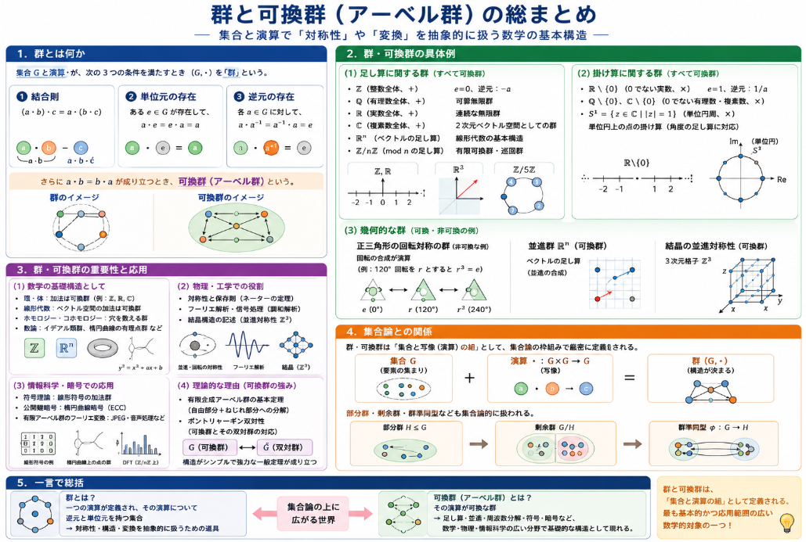

集合論を扱う場合に演算が成り立つ集合の厳密定義を行うと群と呼ばれる概念が必要となってきます。
といいつつ、抽象概念は本当にわかりづらいです。

ということで本日は

>抽象概念の群について説明してみます。

## 群

**群（group）** とは、**「一つの演算が定義され、その演算について逆元と単位元を持つ集合」** のことです。

もう少し正確に言うと、集合 $G$ とその上の演算 $\cdot$（掛け算の記号で書くことが多い）が次の条件を満たすとき、$(G,\cdot)$ は**群**です。

1. **結合則**：$(a \cdot b) \cdot c = a \cdot (b \cdot c)$
2. **単位元の存在**：ある元 $e \in G$ が存在して、すべての $a \in G$ について $a \cdot e = e \cdot a = a$
3. **逆元の存在**：各 $a \in G$ に対して、ある $a^{-1} \in G$ が存在して $a \cdot a^{-1} = a^{-1} \cdot a = e$

さらに、演算が**可換**（$a \cdot b = b \cdot a$）なら、次節で説明する **可換群（アーベル群）** と呼びます。

### 具体例

- 整数全体 ℤ と足し算 $+$：可換群（単位元 0、逆元 $-a$）
- 0 でない実数全体 ℝ∖{0} と掛け算 $\times$：可換群（単位元 1、逆元 $1/a$）
- 正三角形の回転対称の集合：群（回転の合成が演算）

### 集合論との関係

- 群は**集合と演算の組**として定義されるので、集合論の枠組みの中で扱えます。
- 群の要素は集合の元であり、群の構造（部分群・剰余群など）も集合論的に記述できます。

要するに、**群＝「逆元と単位元を持つ演算が定義された集合」** です。

## 可換群

**可換群（commutative group）** とは、**「演算が可換な群」** のことです。（可換群は、**アーベル群（abelian group）** とも呼ばれます。）

### 定義

集合 $G$ とその上の演算 $\cdot$（掛け算の記号で書くことが多い）が次の条件を満たすとき、$(G,\cdot)$ は**群**です。

1. **結合則**：$(a \cdot b) \cdot c = a \cdot (b \cdot c)$
2. **単位元の存在**：ある元 $e \in G$ が存在して、すべての $a \in G$ について $a \cdot e = e \cdot a = a$
3. **逆元の存在**：各 $a \in G$ に対して、ある $a^{-1} \in G$ が存在して $a \cdot a^{-1} = a^{-1} \cdot a = e$

さらに、演算が**可換**であるとき、つまり

4. **可換性**：$a \cdot b = b \cdot a$（すべての $a,b \in G$ について）

が成り立つとき、$(G,\cdot)$ を**可換群（アーベル群）** といいます。

### 具体例

可換群（アーベル群）の具体例を、**集合と演算**の形で詳しく説明します。

__1. 整数全体 ℤ と足し算__

- **集合**：整数全体 ℤ = {…, −2, −1, 0, 1, 2, …}
- **演算**：通常の足し算 $+$
- **群の条件**：
  - 結合則：$(a + b) + c = a + (b + c)$
  - 単位元：0（$a + 0 = 0 + a = a$）
  - 逆元：各 $a$ に対して $-a$（$a + (-a) = 0$）
  - 可換性：$a + b = b + a$
- **特徴**：
  - 最も基本的な**無限可換群**の例
  - 環・体の「加法群」としても現れる

__2. 実数全体 ℝ と足し算__

- **集合**：実数全体 ℝ（有理数と無理数を含む）
- **演算**：通常の足し算 $+$
- **群の条件**：
  - 結合則・単位元 0・逆元 $-a$・可換性はいずれも成り立つ
- **特徴**：
  - 連続な無限可換群
  - 解析学（微積分）の舞台となる加法群

__3. 0 でない実数 ℝ∖{0} と掛け算__

- **集合**：0 を除いた実数全体 ℝ∖{0}
- **演算**：通常の掛け算 $\times$
- **群の条件**：
  - 結合則：$(a \times b) \times c = a \times (b \times c)$
  - 単位元：1（$a \times 1 = 1 \times a = a$）
  - 逆元：各 $a \neq 0$ に対して $1/a$（$a \times (1/a) = 1$）
  - 可換性：$a \times b = b \times a$
- **特徴**：
  - 体 ℝ の**乗法群**（multiplicative group）の例
  - 0 を除くことで逆元が存在する

__4. 有理数全体 ℚ と足し算__

- **集合**：有理数全体 ℚ（整数の比 $p/q$）
- **演算**：足し算 $+$
- **群の条件**：
  - 結合則・単位元 0・逆元 $-a$・可換性が成り立つ
- **特徴**：
  - 可算無限の可換群
  - 体 ℚ の加法群としても重要

__5. 複素数全体 ℂ と足し算__

- **集合**：複素数全体 ℂ（$a + bi$）
- **演算**：複素数の足し算
- **群の条件**：
  - 結合則・単位元 0・逆元 $-a$・可換性が成り立つ
- **特徴**：
  - 2次元のベクトル空間としての加法群
  - 幾何的には平面の平行移動に対応

__6. ベクトル空間 ℝⁿ とベクトルの足し算__

- **集合**：n 次元実ベクトル全体 ℝⁿ
- **演算**：ベクトルの足し算（成分ごとの和）
- **群の条件**：
  - 結合則・単位元 0（零ベクトル）・逆元 $-v$・可換性が成り立つ
- **特徴**：
  - 線形代数の基本構造
  - 幾何的には「平行移動の群」として解釈できる

__7. 有限可換群の例：ℤ/nℤ（整数 mod n）__

- **集合**：整数を n で割った余りの集合 $\{0,1,2,\dots,n-1\}$
- **演算**：mod n での足し算 $+_n$
- **群の条件**：
  - 結合則・単位元 0・逆元 $-a \bmod n$・可換性が成り立つ
- **特徴**：
  - 有限個の元からなる可換群（位数 n）
  - 巡回群の典型例

__8. 円周群（circle group）S¹__

- **集合**：単位円周上の点（複素数で $|z| = 1$）
- **演算**：複素数の掛け算（角度の足し算）
- **群の条件**：
  - 結合則・単位元 1・逆元 $z^{-1} = \bar{z}$・可換性が成り立つ
- **特徴**：
  - 連続な可換群（1次元トーラス）
  - フーリエ解析・表現論で重要

### 数学的な重要性

可換群の概念はこの後に続く環や体の概念を理解する上で前提となります。

__(1) 環・体の「土台」として__

環や体は、加法群が可換群であることが前提です。
例えば、整数環 ℤ、実数体 ℝ、複素数体 ℂ などは、いずれも足し算について可換群です。
可換群の理論が整っていないと、環や体の構造もきちんと扱えません。

__(2) 線形代数の基礎__

ベクトル空間は、ベクトルの足し算について可換群です。
線形写像・基底・次元などの概念は、この可換群構造の上に乗っています。
行列の演算や連立一次方程式の解法も、可換群の性質に支えられています。

__(3) ホモロジー・コホモロジー__

代数的位相幾何学では、ホモロジー群・コホモロジー群が可換群として現れます。
これらは位相空間の「穴」の数を数えたり、幾何的な不変量を与えたりします。
可換群の構造（自由部分・ねじれ部分など）が、空間の性質を反映します。

### 一言で言うと

> 可換群＝「逆元と単位元を持ち、演算が可換な集合」

です。

## 総括

- **群**：  
  「一つの演算が定義され、その演算について逆元と単位元を持つ集合」  
  → 対称性・構造・変換を抽象的に扱うための道具。

- **可換群（アーベル群）**：  
  「その演算が可換な群」  
  → 足し算・並進・周波数分解・符号・暗号など、  
  数学・物理・情報科学の広い分野で**基礎的な構造**として現れる。

集合論の立場から見れば、群・可換群は「集合と演算の組」として定義される、最も基本的かつ応用範囲の広い数学的対象の一つです。

