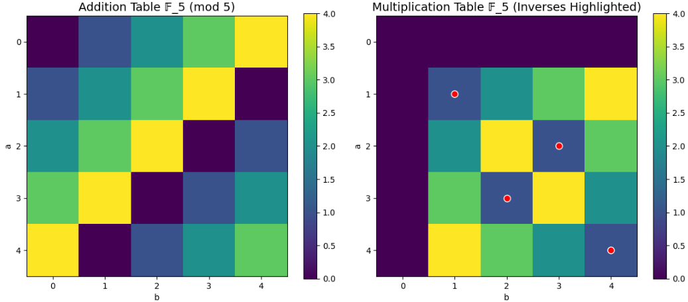
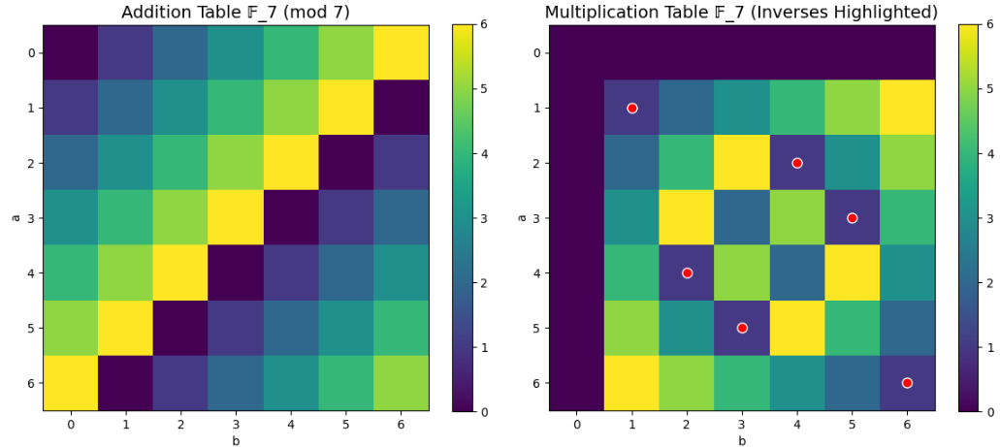
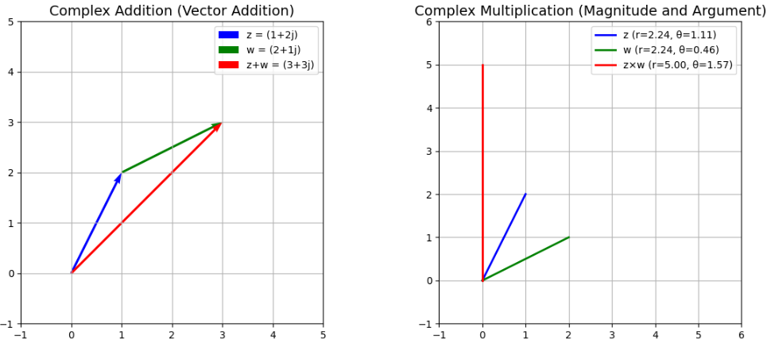
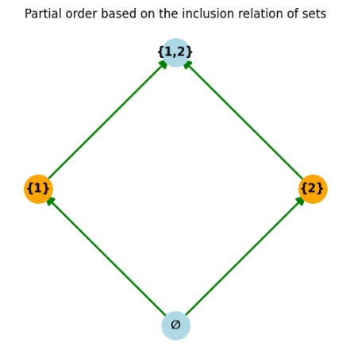
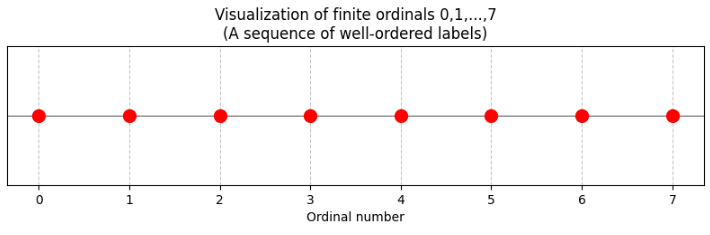
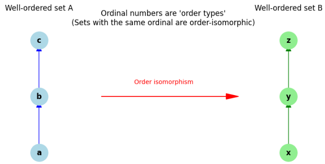

# 前書き

著者は企業に所属して機械設計から、ソフトエンジニアとなり、AI技術を開発、もしくはAIを使ったシステムを開発しています。

それほど勉強に熱心だった訳でない大学・大学院生活を経て企業に就職した後、AI技術開発を行うことになりました。
すると、論文の重要性が身に染みてきました。

AI技術では、実験結果を確認するサイクルは比較的短く済む一方で、新しい理論や手法は次々と提案されています。そのため、すべてを一から試していると、理論の進歩のスピードに追いつけません。
こういう技術をつくるとどうなるだろう？
こういう手法とりいれるとどうなるだろう？
を一から実験しているとスピードにのっていけません。
そんな時に同じようなことをやっている研究ないか論文で探してイメージをするようにします。
これはAI技術開発をやっている方でなくても、研究や先行研究をされている方であれば皆さん経験することだと思います。

論文を理解するために必要なことは何か？
- 知識のとっかかりがある(論文の研究分野に関する背景を持っていること)
- 基礎理論を理解すること
前者は研究に取り組んでいるうちに、関連する方と交流するうちに自然と身に着けていきます。
ネックになるのは後者ではないでしょうか。

基礎理論は基本的に数学や物理です。
そして、基礎理論を記載する際に、**理論の前提条件を定義**する必要があります。
この理論の前提条件に使われているのが集合論です。

集合論は数、集合、関数、群などの数や数の構造化で必ず使う必要があります。
なぜなら、集合論が出来た理由がこの必要性だったからです。集合論が整備される以前は、数学の各分野が独自の言葉で理論を記述しており、全体を統一して厳密に定義することが難しかったという背景があります。そのため、19世紀末〜20世紀にかけて、数学の基礎を集合論の上に構築する流れが生まれました。

集合論は、数や関数、群・環・体といった代数的構造、位相空間、確率空間など、現代数学のあらゆる対象を「集合と写像」という単一の枠組みで定義するための言語です。そのため、新しい理論を厳密に記述する際には、その前提条件や対象を集合論の言葉で明確に定義する必要があります。今後、数学や物理学でどのような新しい学問体系が現れたとしても、それを厳密に定義するには、集合論の考え方が不可欠になるでしょう。

集合論は大学の数学課程で扱われるものの、多くの学生にとってイメージがつかみにくい分野です。理由の一つとして、集合論そのものを専門とする教員は少なく、他の分野の講義の一部として、定義や記号を簡潔に紹介するにとどまることが多いからです。その結果、集合論が「数学全体の共通言語」としてどのように機能するのか、実感を持って学ぶ機会が少ないという課題を抱えています。

のような必要性と課題を踏まえ、AI技術開発や研究開発に携わる方々が、集合論を「論文を読み解くための実用的な道具」として身につけられるように、本書を作成しました。

__本書の狙い__

これから集合論を学ぶ社会人・学生の方々に押さえて頂きたい以下の内容を、扱っていきます。
これらを押さえると、その後の数学・情報系の学習で「集合論は数学の共通言語」という実感を基に基礎理論のより深い理解につながると考えています。

## 1. 集合の基本と記法
- 集合・要素（∈, ∉）、部分集合（⊆, ⊂）
- 空集合 ∅、よく使う集合 ℕ, ℤ, ℚ, ℝ, ℂ
- 内包的記法・外延的記法

## 2. 集合演算
- 和集合 ∪、共通部分 ∩、差集合 \、補集合 A^c
- べき集合 P(X)、直積 A × B
- 分配法則・ド・モルガンの法則など基本性質

## 3. 写像（関数）
- 写像の定義（定義域・値域・像・逆像）
- 単射・全射・全単射
- 合成写像、逆写像（全単射のとき）

## 4. 関係と同値関係
- 二項関係（A × A の部分集合）
- 反射・対称・推移 → 同値関係
- 同値類、商集合 A / ∼

## 5. 濃度（集合の「大きさ」）
- 有限集合・無限集合
- 可算集合・非可算集合
- ベルンシュタインの定理
- カントールの対角線論法（ℝ の非可算性）

## 6. 順序と整列
- 半順序・全順序
- 最大元・最小元・極大元・極小元
- 上界・下界・上限・下限
- 整列集合（概要）


**ポイント**：  
- 定義を正確に読み、具体例で確かめる  
- 集合・写像・関係・順序という「構造」を、集合論の言葉で扱えるようにする  
- 濃度と選択公理で「無限」と「公理」の感覚をつかむ  


__本書の対象者__

- 大学で理工系学科で学ぶ学生
- 就職の後に理論を応用・研究するため学び直しをされる社会人

__本書が意識している点__

ずばり分かりやすい言葉で説明することです。
著者自身、集合の教科書を地道に読んでいるときに、説明の難しさに驚いた記憶が沢山あります。
数学を厳密に定義するから、こんな難しい言い方をしているのか、と言い聞かせてきましたが、そんなはずはありません。
分かりやすく説明して理解できる形にすることが意識した点です。

__本書の構成__

以下のように構成しました。

__1章 集合__

一番入口となる集合の定義を行います。

__2章 べき集合、直積集合、写像__

数学では、「集合そのもの」を要素とする集合を扱うことがよくあります。
集合の集合を定義するためのべき集合について説明します。

__3章 添数づけられた族と選択公理__

数学では、有限個の集合 A₁, A₂, …, Aₙ だけでなく、無限個（可算無限や非可算無限）の集合を扱うことがよくあります。
「添数づけられた族」と「選択公理」は、無限個の集合から要素を選びたいときに本質的に必要になる概念です。

__4章 同値関係__

数学では、「本質的に同じとみなせるもの」を一つの塊として扱いたいことがよくあります。
「同じもの」をまとめて、構造を簡約するために必要な考えである同値関係の概念を説明します。

__5章 集合の対等__

集合の「大きさ」を厳密に比較するために、全単射の存在で「同じ大きさ」を定義する概念が必要になります。これが集合の対等です。有限集合では「要素数が同じ」と同じ意味ですが、無限集合では「可算・非可算」といった重要な区別を与えます。

__6章 順序集合__

現実世界でも数学でも、「順序」や「大小関係」は基本的な概念です。
これらを一つの抽象的な枠組みで扱いたい → それが順序集合です。

__7章 整列集合__

整列集合は、「任意の空でない部分集合に最小元がある」という強い性質を持つ順序集合です。自然数のように「どこから始めても最初の要素が取れる」順序を抽象化したもので、この上で帰納法を無限に拡張した超限帰納法が成り立ちます。

__8章 Zornの補題と整列可能定理__

Zornの補題は、「鎖（全順序部分集合）が上界を持つ順序集合には極大元が存在する」という存在定理で、ベクトル空間の基底の存在や極大イデアルの存在など、多くの重要な定理の証明に使われます。整列可能定理は「任意の集合は適切な順序で整列集合にできる」という主張で、選択公理と同値です。これらにより、無限構造から極大元や整列順序を取り出し、超限帰納法・超限再帰を一般の集合に適用できるようになります。

__9章 順序数__

順序数は、整列順序の「型」を抽象的な数として表す概念です。自然数 0,1,2,… に加えて ω, ω+1, ω+ω などの超限順序数を導入することで、無限に続く整列順序を統一的に扱えます。これにより、超限帰納法・超限再帰が順序数全体を舞台として厳密に定義され、集合論の多くの議論（基数の定義など）の土台となります。

__10章 基数と濃度__

集合の「大きさ」を厳密に比較するために、濃度（cardinality）という概念を導入します。有限集合では要素数に対応し、無限集合では「可算・非可算」といった区別を与えます。これにより、確率論や測度論で必要となる「事象の大きさ」や、計算理論での「言語の複雑さ」などを厳密に議論できるようになります。

<div style="page-break-before:always"></div>


# 集合

## 集合はなぜ必要か

集合は、数学の「ものの集まり」をきちんと扱うための土台として必要とされています。  
主な理由は次の3つです。

1. **数学の対象をはっきりさせるため**  
   数学では「数」「図形」「関数」など、いろいろな対象を扱いますが、それらを「集合」としてまとめておくと、  
   - どの範囲の対象を考えているのか  
   - ある対象が含まれるかどうか  
   を厳密に決められます。  
   たとえば「自然数の集合」「実数の集合」と言えば、扱う数が何かが明確になります。

2. **数学の議論を厳密にするため**  
   19世紀ごろまで、数学は直感的な説明が多く、あいまいさもありました。  
   そこで「集合」と「集合の間の関係（包含・共通部分・和集合など）」を基礎に置くことで、  
   - 関数  
   - 無限  
   - 連続性  
   などを厳密に定義できるようになりました。  
   これが「集合論」という分野で、現代数学のほとんどは集合論の言葉で書かれています。

3. **抽象的な構造を扱うため**  
   集合を使うと、  
   - 群・環・体（代数学の構造）  
   - 位相空間（連続性や近さを扱う構造）  
   - 確率空間（確率を厳密に扱うための枠組み）  
   など、さまざまな数学的構造を **「集合＋追加のルール」** として統一的に扱えます。  
   これにより、異なる分野の結果を横断的に使ったり、一般化したりしやすくなります。

まとめると、集合は  
- 数学の対象を明確にし  
- 議論を厳密にし  
- 抽象的な構造を統一的に扱う  
ために必要とされています。  
その意味で、集合は「現代数学の共通言語」のような役割を果たしています。

>__群（group）__  
>集合論でいう**群** は、**「一つの演算（多くは掛け算や足し算）が定義され、その演算について逆元と単位元を持つ集合」** のことです。
>もう少し正確に言うと、集合  とその上の演算 （掛け算の記号で書くことが多い）が次の条件を満たすとき、 は群です。
>1. **結合則**：
>2. **単位元の存在**：ある元  が存在して、すべての  について 
>3. **逆元の存在**：各  に対して、ある  が存在して 
>さらに、演算が**可換**（）なら、**可換群（アーベル群）** と呼びます。
>__具体例__  
>- 整数全体 ℤ と足し算 ：可換群（単位元 0、逆元 ）
>- 0 でない実数全体 ℝ∖{0} と掛け算 ：可換群（単位元 1、逆元 ）
>- 正三角形の回転対称の集合：群（回転の合成が演算）
>__集合論との関係__  
>- 群は**集合と演算の組**として定義されるので、集合論の枠組みの中で扱えます。
>- 群の要素は集合の元であり、群の構造（部分群・剰余群など）も集合論的に記述できます。
>要するに、**群＝「逆元と単位元を持つ演算が定義された集合」** です。

>__環（ring）__  
>**環**とは、**「足し算と掛け算の2つの演算が定義され、足し算については可換群、掛け算については結合的で、分配法則が成り立つ集合」** のことです。
>もう少し正確に言うと、集合  とその上の2つの演算 （加法）と （乗法）が次の条件を満たすとき、 は環です。
>1.  は可換群（足し算について逆元と単位元 0 を持つ）
>2. 乗法は結合的：
>3. 分配法則が成り立つ：
>   - 
>   - 
>多くの場合、乗法の単位元 1 も持つ環（単位的環）を考えます。
>__具体例__  
>- 整数全体 ℤ（通常の足し算・掛け算）
>- 実数係数の多項式環 ℝ[x]
>- 行列環 
>これらはすべて環です。
__一言で言うと__  
>環＝「足し算と掛け算がきちんと定義された集合」  
>（足し算は可換群、掛け算は結合的で分配法則を満たす）です。


>__体（field）__  
>**体**とは、**「足し算・掛け算・引き算・割り算（0 以外で）が自由にできる集合」** のことです。
>もう少し正確に言うと、集合  とその上の演算 （加法）と （乗法）が次の条件を満たすとき、 は体です。
>1.  は可換群（足し算について逆元と単位元 0 を持つ）
>2.  も可換群（0 以外の元は掛け算について逆元と単位元 1 を持つ）
>3. 分配法則が成り立つ：
>つまり、
>- 足し算と掛け算の両方が「群」としてきちんと動く
>- 掛け算は 0 以外の元について可換群
>- 足し算と掛け算が分配法則で結びつく
>という構造です。
__具体例__  
>- 有理数全体 ℚ
>- 実数全体 ℝ
>- 複素数全体 ℂ
>- 有限体（例：mod 5 の世界 ℤ/5ℤ）
>これらはすべて体です。
>__一言で言うと__  
>体＝「足し算・掛け算・引き算・割り算（0 以外）が自由にできる集合」  
>（足し算と掛け算の両方が可換群で、分配法則を満たす）です。


## 集合の用語

集合論における基本的な用語の定義を、順に説明します。

### 1. 元（要素）
- **定義**  
  ある集合に属している個々の「もの」のことを、その集合の**元（げん）**または**要素（ようそ）** といいます。
- **記号**  
  - 「a は集合 A の元である」ことを  
    

<div class="math-display-container"></div>


    と書きます（「a は A に属する」と読みます）。
  - 「a は集合 A の元ではない」ことを  
    

<div class="math-display-container"></div>


    と書きます。

- **例**  
  - 集合  に対して、  
    , ,  ですが、  
     です。


### 2. 部分集合
- **定義**  
  集合 A の**すべての元**が、別の集合 B にも属しているとき、  
  「A は B の**部分集合**である」といいます。
- **記号**  
  - 「A は B の部分集合である」ことを  
    

<div class="math-display-container"></div>


    と書きます。
  - 定義を式で書くと：
    

<div class="math-display-container"></div>


    「任意の x について、x が A の元ならば x は B の元でもある」という意味です。

- **例**  
  -  のとき、  
    A の元 1, 2 はどちらも B に属しているので、  
     です。
  - どんな集合 A に対しても、  
    （自分自身は自分の部分集合）とみなします。

### 3. 空集合
- **定義**  
  **一つも元を持たない集合**のことを**空集合（くうしゅうごう）** といいます。
- **記号**  
  - 空集合は  
    

<div class="math-display-container"></div>


    と書きます。

- **性質**  
  - 空集合は、**任意の集合の部分集合**とみなします。  
    つまり、どんな集合 A に対しても  
    

<div class="math-display-container"></div>


    が成り立ちます。
  - 理由（直感的な説明）：  
    「 のすべての元が A に属している」という条件を考えますが、  
     には元が一つもないので、この条件は自動的に満たされます（偽の前提は何でも導く、という論理的な扱いになります）。

- **例**  
  -  のとき、  
     です。
  - 空集合自身も集合なので、  
     も成り立ちます。

## 集合の代表例

集合の代表的な例を、いくつかのタイプに分けて紹介します。


### 1. 数の集合（数学でよく使うもの）

- **自然数の集合**  
  

<div class="math-display-container"></div>


  （0 を含める流儀もありますが、多くの高校数学では 1 から始めます）

- **整数の集合**  
  

<div class="math-display-container"></div>


- **有理数の集合**  
  

<div class="math-display-container"></div>


  （分数で書ける数の集合）

- **実数の集合**  
  

<div class="math-display-container"></div>


  （数直線上のすべての点に対応する数：有理数＋無理数）

- **複素数の集合**  
  

<div class="math-display-container"></div>


  （実数に虚数単位  を加えた数の集合）

### 2. 有限集合の例

- **1桁の自然数の集合**  
  

<div class="math-display-container"></div>


- **アルファベットの集合**  
  

<div class="math-display-container"></div>


- **あるクラスの生徒の集合**  
  

<div class="math-display-container"></div>


### 3. 図形や点の集合（幾何学的な例）

- **平面上の点の集合**  
  

<div class="math-display-container"></div>


  （座標平面全体）

- **単位円（中心が原点、半径1の円）**  
  

<div class="math-display-container"></div>


- **x 軸より上にある点の集合**  
  

<div class="math-display-container"></div>


### 4. 条件で決まる集合（内包的記法の例）

- **偶数の集合**  
  

<div class="math-display-container"></div>


- **3 で割って 1 余る自然数の集合**  
  

<div class="math-display-container"></div>


- **100 以下の素数の集合**  
  

<div class="math-display-container"></div>


### 5. 特殊な集合

- **空集合**  
  

<div class="math-display-container"></div>


  （元を一つも持たない集合）

- **一点集合（シングルトン）**  
  

<div class="math-display-container"></div>


  （元が1つだけの集合）

- **集合の集合（集合族）**  
  

<div class="math-display-container"></div>


  （集合を元として持つ集合）

### 6. 日常的なものの集合

- **日本の都道府県の集合**  
  

<div class="math-display-container"></div>


- **ある駅から乗れる電車の路線の集合**  
  

<div class="math-display-container"></div>


- **ある本に登場する人物の集合**  
  

<div class="math-display-container"></div>


## 和集合・共通集合・差集合

集合の基本的な演算である「和集合」「共通部分（共通集合）」「差集合」について、順に説明します。

### 1. 和集合（Union）

__定義__
2つの集合 ,  に対して、  
「**A か B の少なくとも一方に属する元全体の集合**」を、  
 と  の**和集合**といいます。

- 記号：
- 定義式：
  

<div class="math-display-container"></div>


__例__
-  のとき、
  

<div class="math-display-container"></div>


  （重複している 3 は1回だけ書きます）

- 図形的なイメージ（ベン図）  
  - 2つの円（A と B）を合わせた領域全体が  です。

### 2. 共通部分（Intersection、共通集合）

__定義__
2つの集合 ,  に対して、  
「**A にも B にも属する元全体の集合**」を、  
 と  の**共通部分**（または**共通集合**）といいます。

- 記号：
- 定義式：
  

<div class="math-display-container"></div>


__例__
-  のとき、
  

<div class="math-display-container"></div>


-  のとき、
  

<div class="math-display-container"></div>


  （共通する元がないので空集合）

- 図形的なイメージ（ベン図）  
  - 2つの円（A と B）が重なっている部分が  です。

### 3. 差集合（Set Difference）

__定義__
2つの集合 ,  に対して、  
「**A には属するが、B には属さない元全体の集合**」を、  
 と  の**差集合**といいます。

- 記号：（または ）
- 定義式：
  

<div class="math-display-container"></div>


__例__
-  のとき、
  

<div class="math-display-container"></div>


  （A のうち、B にも属する 3 を除いたもの）

-  のとき、
  

<div class="math-display-container"></div>


  （A の元はどれも B に属さないので、そのまま A になる）


### 4. 補集合との関係（参考）

全体集合 （考えている範囲のすべての元の集合）を決めたとき、  
ある集合  の**補集合**  は、


<div class="math-display-container"></div>


と定義されます。  
つまり、差集合の特別な場合が補集合です。

## 群

**群（group）** とは、**「一つの演算が定義され、その演算について逆元と単位元を持つ集合」** のことです。

もう少し正確に言うと、集合  とその上の演算 （掛け算の記号で書くことが多い）が次の条件を満たすとき、 は**群**です。

1. **結合則**：
2. **単位元の存在**：ある元  が存在して、すべての  について 
3. **逆元の存在**：各  に対して、ある  が存在して 

さらに、演算が**可換**（）なら、次節で説明する **可換群（アーベル群）** と呼びます。

### 具体例

- 整数全体 ℤ と足し算 ：可換群（単位元 0、逆元 ）
- 0 でない実数全体 ℝ∖{0} と掛け算 ：可換群（単位元 1、逆元 ）
- 正三角形の回転対称の集合：群（回転の合成が演算）

### 集合論との関係

- 群は**集合と演算の組**として定義されるので、集合論の枠組みの中で扱えます。
- 群の要素は集合の元であり、群の構造（部分群・剰余群など）も集合論的に記述できます。

要するに、**群＝「逆元と単位元を持つ演算が定義された集合」** です。

### なぜ群が必要だった？

群の定義が必要だった理由を、**歴史的・理論的・応用的**な観点から簡潔にまとめます。

__1. 共通の「構造」を抽象化するため__

- 整数の足し算、0 でない実数の掛け算、図形の回転、ベクトルの和など、一見バラバラに見える対象が、実は**同じルール（結合則・単位元・逆元）** で動いていることに気づいた。
- そこで、「個々の具体例に依存せず、**共通の性質だけを抜き出して定義**しよう」という発想から群の定義が生まれた。

__2. 対称性・変換を統一的に扱うため__

- 図形の対称性（回転・鏡映・並進）や、物理法則の対称性（並進・回転・ゲージ変換）は、  
  いずれも「操作の合成」という演算を持ち、逆操作と恒等操作が存在する。
- 群の定義により、**対称性や変換を抽象的な“群”として扱える**ようになり、  
  幾何・物理・結晶学などで統一的に議論できるようになった。

__3. 数学の基礎を厳密化するため__

- 19世紀後半から20世紀にかけて、数学の厳密化が進み、  
  「集合と演算」という立場から数学を再構築する動きが強まった。
- 群の定義は、**集合論の枠組みの中で“演算の構造”を厳密に記述するための最小限の条件**として整理された。
- これにより、環・体・ベクトル空間など、より複雑な構造も群の上に乗せて定義できるようになった。

__4. 応用（暗号・符号・物理）の土台として__

- 群の理論が整備されたことで、
  - 暗号（楕円曲線暗号など）
  - 符号理論（線形符号）
  - 物理の対称性と保存則（ネーターの定理）
  など、実用的な分野でも「群」という共通言語で議論できるようになった。

__一言で言うと__

> 群の定義は、  
> 「バラバラに見える対象（数・変換・対称性）に共通する“演算の構造”を抽象化し、  
> 数学・物理・情報科学で統一的に扱うため」  
> に必要だった。

です。

## 可換群

**可換群（commutative group）** とは、**「演算が可換な群」** のことです。（可換群は、**アーベル群（abelian group）** とも呼ばれます。）

### 定義

集合  とその上の演算 （掛け算の記号で書くことが多い）が次の条件を満たすとき、 は**群**です。

1. **結合則**：
2. **単位元の存在**：ある元  が存在して、すべての  について 
3. **逆元の存在**：各  に対して、ある  が存在して 

さらに、演算が**可換**であるとき、つまり

4. **可換性**：（すべての  について）

が成り立つとき、 を**可換群（アーベル群）** といいます。

### 具体例

可換群（アーベル群）の具体例を、**集合と演算**の形で詳しく説明します。

__1. 整数全体 ℤ と足し算__

- **集合**：整数全体 ℤ = {…, −2, −1, 0, 1, 2, …}
- **演算**：通常の足し算 
- **群の条件**：
  - 結合則：
  - 単位元：0（）
  - 逆元：各  に対して （）
  - 可換性：
- **特徴**：
  - 最も基本的な**無限可換群**の例
  - 環・体の「加法群」としても現れる

__2. 実数全体 ℝ と足し算__

- **集合**：実数全体 ℝ（有理数と無理数を含む）
- **演算**：通常の足し算 
- **群の条件**：
  - 結合則・単位元 0・逆元 ・可換性はいずれも成り立つ
- **特徴**：
  - 連続な無限可換群
  - 解析学（微積分）の舞台となる加法群

__3. 0 でない実数 ℝ∖{0} と掛け算__

- **集合**：0 を除いた実数全体 ℝ∖{0}
- **演算**：通常の掛け算 
- **群の条件**：
  - 結合則：
  - 単位元：1（）
  - 逆元：各  に対して （）
  - 可換性：
- **特徴**：
  - 体 ℝ の**乗法群**（multiplicative group）の例
  - 0 を除くことで逆元が存在する

__4. 有理数全体 ℚ と足し算__

- **集合**：有理数全体 ℚ（整数の比 ）
- **演算**：足し算 
- **群の条件**：
  - 結合則・単位元 0・逆元 ・可換性が成り立つ
- **特徴**：
  - 可算無限の可換群
  - 体 ℚ の加法群としても重要

__5. 複素数全体 ℂ と足し算__

- **集合**：複素数全体 ℂ（）
- **演算**：複素数の足し算
- **群の条件**：
  - 結合則・単位元 0・逆元 ・可換性が成り立つ
- **特徴**：
  - 2次元のベクトル空間としての加法群
  - 幾何的には平面の平行移動に対応

__6. ベクトル空間 ℝⁿ とベクトルの足し算__

- **集合**：n 次元実ベクトル全体 ℝⁿ
- **演算**：ベクトルの足し算（成分ごとの和）
- **群の条件**：
  - 結合則・単位元 0（零ベクトル）・逆元 ・可換性が成り立つ
- **特徴**：
  - 線形代数の基本構造
  - 幾何的には「平行移動の群」として解釈できる

__7. 有限可換群の例：ℤ/nℤ（整数 mod n）__

- **集合**：整数を n で割った余りの集合 
- **演算**：mod n での足し算 
- **群の条件**：
  - 結合則・単位元 0・逆元 ・可換性が成り立つ
- **特徴**：
  - 有限個の元からなる可換群（位数 n）
  - 巡回群の典型例

__8. 円周群（circle group）S¹__

- **集合**：単位円周上の点（複素数で ）
- **演算**：複素数の掛け算（角度の足し算）
- **群の条件**：
  - 結合則・単位元 1・逆元 ・可換性が成り立つ
- **特徴**：
  - 連続な可換群（1次元トーラス）
  - フーリエ解析・表現論で重要

### 数学的な重要性

可換群の概念はこの後に続く環や体の概念を理解する上で前提となります。

__(1) 環・体の「土台」として__

環や体は、加法群が可換群であることが前提です。
例えば、整数環 ℤ、実数体 ℝ、複素数体 ℂ などは、いずれも足し算について可換群です。
可換群の理論が整っていないと、環や体の構造もきちんと扱えません。

__(2) 線形代数の基礎__

ベクトル空間は、ベクトルの足し算について可換群です。
線形写像・基底・次元などの概念は、この可換群構造の上に乗っています。
行列の演算や連立一次方程式の解法も、可換群の性質に支えられています。

__(3) ホモロジー・コホモロジー__

代数的位相幾何学では、ホモロジー群・コホモロジー群が可換群として現れます。
これらは位相空間の「穴」の数を数えたり、幾何的な不変量を与えたりします。
可換群の構造（自由部分・ねじれ部分など）が、空間の性質を反映します。

### 一言で言うと

> 可換群＝「逆元と単位元を持ち、演算が可換な集合」

です。

## 環

集合論における**環（ring）** の数学的な定義を、集合と写像の言葉で厳密に述べます。

### 環の定義

集合  と、その上の2つの演算
- （加法）
- （乗法）

が与えられ、次の条件を満たすとき、 を**環**といいます。

__1. 加法についての条件（可換群）__

 は**可換群**である。すなわち：

- **結合則**：
- **単位元の存在**：ある元  が存在して、すべての  について  
  
- **逆元の存在**：各  に対して、ある  が存在して  
  
- **可換性**：

__2. 乗法についての条件（結合的）__

 は**結合的**である。すなわち：

- **結合則**：

（※乗法の可換性や単位元の存在は要求しません。  
　乗法の単位元 1 を持つ環を**単位的環（unital ring）** と呼びます。）

__3. 分配法則__

加法と乗法は**分配法則**で結びつく：

- 
- 

### 一言でまとめると

> 環＝  
> 「足し算については可換群、掛け算については結合的で、  
> 足し算と掛け算が分配法則で結びついている集合」

です。

### 具体例（集合論的に）

環の具体例を、**集合と演算**の形で挙げていきます。

__1. 整数環 ℤ__

- **集合**：整数全体 ℤ = {…, −2, −1, 0, 1, 2, …}
- **演算**：
  - 加法：通常の足し算 
  - 乗法：通常の掛け算 
- **環の条件**：
  - 加法について可換群（単位元 0、逆元 ）
  - 乗法は結合的：
  - 分配法則： など
- **特徴**：
  - 乗法の単位元 1 を持つので**単位的環**
  - 乗法は可換（）なので**可換環**
  - 0 以外の元が逆元を持つとは限らない（例：2 の逆元は ℤ にない）ので、**体ではない**

__2. 実数係数の多項式環 ℝ[x]__

- **集合**：実数係数の多項式全体  
  ℝ[x] = 
- **演算**：
  - 加法：多項式の足し算（同次の係数を足す）
  - 乗法：多項式の掛け算（分配して展開）
- **環の条件**：
  - 加法は可換群（零多項式が単位元 0）
  - 乗法は結合的（多項式の積の結合則）
  - 分配法則が成り立つ
- **特徴**：
  - 乗法の単位元は定数多項式 1
  - 乗法は可換なので**可換環**
  - 0 でない定数多項式以外は逆元を持たないので、**体ではない**

__3. 行列環 __

- **集合**：n 次正方行列全体  
  
- **演算**：
  - 加法：行列の成分ごとの和
  - 乗法：行列の積（行×列の内積）
- **環の条件**：
  - 加法は可換群（零行列が単位元 0）
  - 乗法は結合的（行列積の結合則）
  - 分配法則： など
- **特徴**：
  - 乗法の単位元は単位行列 
  - 乗法は**非可換**（一般に ）なので、**非可換環**
  - 正則行列以外は逆元を持たないので、**体ではない**

__4. 整数 mod n の環 ℤ/nℤ__

- **集合**：整数を n で割った余りの集合 
- **演算**：
  - 加法：mod n での足し算
  - 乗法：mod n での掛け算
- **環の条件**：
  - 加法は可換群（単位元 0）
  - 乗法は結合的
  - 分配法則が成り立つ
- **特徴**：
  - 乗法の単位元は 1
  - 乗法は可換なので**可換環**
  - n が素数のときは**体**（0 以外の元が逆元を持つ）
  - n が合成数のときは体ではない（例：ℤ/4ℤ で 2 は逆元を持たない）

__5. 零環（自明な環）__

- **集合**：1 点集合 
- **演算**：
  - 加法：
  - 乗法：
- **環の条件**：
  - 加法は自明な可換群（単位元 0、逆元も 0）
  - 乗法は結合的
  - 分配法則は自明に成り立つ
- **特徴**：
  - 最も単純な環の例
  - 乗法の単位元も 0 とみなせるが、通常は「単位的環」とは区別する

__6. 函数環 __

- **集合**：閉区間  上の実数値連続関数全体
- **演算**：
  - 加法：関数の点ごとの和 
  - 乗法：関数の点ごとの積 
- **環の条件**：
  - 加法は可換群（零関数が単位元）
  - 乗法は結合的
  - 分配法則が成り立つ
- **特徴**：
  - 乗法の単位元は定数関数 1
  - 乗法は可換なので**可換環**
  - 0 でない関数でも逆元（1/f）が常に存在するとは限らないので、**体ではない**

### 環が必要だった理由

環の定義が必要だった理由を、**歴史的・理論的・応用的**な観点から簡潔にまとめます。

__1. 共通の「2演算構造」を抽象化するため__

- 整数の足し算と掛け算、多項式の和と積、行列の和と積など、  
  一見バラバラに見える対象が、実は**同じルール**で動いていることに気づいた。
- そこで、「個々の具体例に依存せず、**“足し算と掛け算の組み合わせ”という共通構造だけを抜き出して定義**しよう」という発想から環の定義が生まれた。

__2. 体・代数・加群などの「土台」として__

- 体は「0 以外の元が逆元を持つ環」と見なせる。
- 線形代数のベクトル空間は、「体上の加群（環上の加群の特別な場合）」として定式化される。
- 環の理論が整っていないと、体・代数・加群・ホモロジーなど、より複雑な構造もきちんと扱えない。

__3. 数論・代数幾何での「数の拡張」を扱うため__

- 整数環 ℤ、多項式環 ℝ[x]、代数整数環などは、  
  「数の世界」を抽象化・拡張したものとして現れる。
- 環の定義により、**イデアル・剰余環・素イデアル**などの概念が導入され、  
  数論や代数幾何で「数の性質」を幾何的に研究できるようになった。

__4. 非可換構造（行列・作用素）を統一的に扱うため__

- 行列環  や作用素環は、掛け算が非可換な環の典型例。
- 環の定義は可換性を要求しないので、**非可換な演算を持つ構造も同じ枠組みで扱える**。
- これにより、表現論・量子力学・作用素論などで「非可換な世界」を数学的に記述できる。

__5. 応用（符号・暗号・幾何）の基礎として__

- 符号理論では、線形符号を**有限体上のベクトル空間（＝体上の加群）** として定義するが、その土台は環の理論。
- 代数幾何では、多項式環のイデアルと代数多様体が対応する（ヒルベルトの零点定理）。
- 環の理論が整備されたことで、これらの応用分野でも「環」という共通言語で議論できるようになった。

__一言で言うと__

> 環の定義は、  
> 「足し算と掛け算が組み合わさった構造（数・多項式・行列など）に共通する性質を抽象化し、  
> 体・代数・加群・数論・幾何・物理などで統一的に扱うため」  
> に必要だった。

です。

### Pythonで確認

折角なのでPython使って環のイメージしてみたいと思います。
お題は、そこまでメチャうまいわけではありませんが。

__環の性質を確認する補助関数__


```python
def check_ring_properties(n=6):
    """
    ℤ/nℤ が環として満たす性質を簡単にチェック
    """
    print(f"=== ℤ/{n}ℤ の環としての性質チェック ===")

    # 加法の可換群か
    print("1. 加法は可換群か:")
    # 単位元 0 の存在
    print(f"   単位元: 0 (0 + a ≡ a mod {n})")
    # 各元に逆元が存在（-a mod n）
    for a in range(n):
        inv = (-a) % n
        print(f"   {a} の逆元: {inv} ({a} + {inv} ≡ 0 mod {n})")
    print("   → 可換群である")

    # 乗法の結合性（mod n では自明）
    print("2. 乗法は結合的か:")
    print("   (a*b)*c ≡ a*(b*c) mod n は常に成り立つ")
    print("   → 結合的である")

    # 分配法則（mod n では自明）
    print("3. 分配法則は成り立つか:")
    print("   a*(b+c) ≡ a*b + a*c mod n")
    print("   (a+b)*c ≡ a*c + b*c mod n")
    print("   → 分配法則が成り立つ")

    # 零因子の有無
    zero_divisors = []
    for a in range(1, n):
        for b in range(1, n):
            if (a * b) % n == 0:
                zero_divisors.append((a, b))
    if zero_divisors:
        print("4. 零因子の有無:")
        print(f"   零因子あり（例: {zero_divisors[0][0]} × {zero_divisors[0][1]} ≡ 0 mod {n}）")
    else:
        print("4. 零因子の有無:")
        print("   零因子なし → ℤ/{n}ℤ は整域（かつ体）")

# 実行例
check_ring_properties(n=6)
check_ring_properties(n=5)
```

```
=== ℤ/6ℤ の環としての性質チェック ===
1. 加法は可換群か:
   単位元: 0 (0 + a ≡ a mod 6)
   0 の逆元: 0 (0 + 0 ≡ 0 mod 6)
   1 の逆元: 5 (1 + 5 ≡ 0 mod 6)
   2 の逆元: 4 (2 + 4 ≡ 0 mod 6)
   3 の逆元: 3 (3 + 3 ≡ 0 mod 6)
   4 の逆元: 2 (4 + 2 ≡ 0 mod 6)
   5 の逆元: 1 (5 + 1 ≡ 0 mod 6)
   → 可換群である
2. 乗法は結合的か:
   (a*b)*c ≡ a*(b*c) mod n は常に成り立つ
   → 結合的である
3. 分配法則は成り立つか:
   a*(b+c) ≡ a*b + a*c mod n
   (a+b)*c ≡ a*c + b*c mod n
   → 分配法則が成り立つ
4. 零因子の有無:
   零因子あり（例: 2 × 3 ≡ 0 mod 6）
=== ℤ/5ℤ の環としての性質チェック ===
1. 加法は可換群か:
   単位元: 0 (0 + a ≡ a mod 5)
   0 の逆元: 0 (0 + 0 ≡ 0 mod 5)
   1 の逆元: 4 (1 + 4 ≡ 0 mod 5)
   2 の逆元: 3 (2 + 3 ≡ 0 mod 5)
   3 の逆元: 2 (3 + 2 ≡ 0 mod 5)
   4 の逆元: 1 (4 + 1 ≡ 0 mod 5)
   → 可換群である
2. 乗法は結合的か:
   (a*b)*c ≡ a*(b*c) mod n は常に成り立つ
   → 結合的である
3. 分配法則は成り立つか:
   a*(b+c) ≡ a*b + a*c mod n
   (a+b)*c ≡ a*c + b*c mod n
   → 分配法則が成り立つ
4. 零因子の有無:
   零因子なし → ℤ/{n}ℤ は整域（かつ体）
```

__出力の意味__

この結果は、**「環の定義と、環が体になる条件」** を具体的に示しています。

どちらの結果も、

- 加法は可換群（単位元 0、各元に逆元がある）
- 乗法は結合的
- 分配法則が成り立つ

という**環の定義**を満たしています。  
したがって、

> ℤ/6ℤ も ℤ/5ℤ も、**環**である

ということが確認できます。

## 体

集合論における**体（field）** は、**「集合と2つの演算（足し算・掛け算）の組」** として、集合論の枠組みの中で定義されるものです。

### 集合論的な定義

集合  と、その上の2つの演算
- （加法）
- （乗法）

が与えられ、次の条件を満たすとき、 を**体**といいます。

1.  は**可換群**（単位元 0 と逆元  を持つ）
2.  も**可換群**（単位元 1 と逆元  を持つ）
3. **分配法則**が成り立つ：
   

<div class="math-display-container"></div>


### 集合論との関係

- 体は**集合と写像（演算）の組**として定義されるので、集合論の言葉で厳密に記述できます。
- 体の要素は集合の元であり、部分体・拡大体・同型写像なども集合論的に扱えます。
- 現代数学の多くの分野（線形代数、代数幾何、数論など）は、集合論の上に体の理論を構築しています。

### 体を一言で言うと

> 集合論でいう体＝  
> 「**足し算と掛け算が定義された集合**で、足し算は可換群、0 以外の元は掛け算でも可換群になり、分配法則を満たすもの」

です。

### 体が必要だった理由

体が必要となった理由を、**歴史的・理論的・応用的**な観点から簡潔にまとめます。

__1. 「四則演算が自由にできる世界」を厳密に定義するため__

- 有理数・実数・複素数など、日常的に使う数は、  
  足し算・引き算・掛け算・割り算（0 以外）が自由にできます。
- これを数学的に厳密に扱うために、  
  「**足し算と掛け算の両方が可換群で、分配法則で結びつく集合**」として体を定義した。

__2. 線形代数・ベクトル空間の土台として__

- ベクトル空間は「体上の加群」として定義されます。
- スカラー倍（λv）や基底・次元・線形写像などの概念は、**スカラーが体であること**を前提に成り立ちます。
- 体がないと、線形代数の理論（行列・行列式・固有値など）がきちんと構築できない。

__3. 方程式の解法・代数拡大を扱うため__

- 多項式方程式の解を求めるには、係数が体であることが必要です。
- 代数拡大（例：ℚ(√2)）やガロア理論は、**体の拡大**として記述されます。
- 体の理論により、「どの方程式がべき根で解けるか」などの問題が厳密に扱える。

__4. 幾何（代数幾何）との対応のため__

- 代数幾何では、多項式環のイデアルと代数多様体が対応しますが、  
  その係数は体（ℝ, ℂ, 有限体など）です。
- 体の選択（ℝ か ℂ か有限体か）によって、幾何的な性質が大きく変わる。

__5. 応用（符号・暗号・物理）の基礎として__

- 符号理論：線形符号は**有限体上のベクトル空間**として定義される。
- 暗号：有限体や楕円曲線上の体が公開鍵暗号の基礎。
- 物理：複素数体 ℂ は量子力学の状態空間（ヒルベルト空間）の係数体として不可欠。

__つまり__

> 体が必要だったのは、  
> 「四則演算が自由にできる数の世界」を厳密に定義し、線形代数・方程式論・幾何・符号・暗号・物理など、広い分野で共通の土台として使うため。

です。

### 具体例

**体（field）** の具体例を、**集合と演算**の形で詳しく挙げます。

__1. 有理数体 ℚ__

- **集合**：有理数全体 ℚ = 
- **演算**：
  - 加法：通常の足し算 
  - 乗法：通常の掛け算 
- **体の条件**：
  - 加法は可換群（単位元 0、逆元 ）
  - 0 以外の有理数は乗法について可換群（単位元 1、逆元 ）
  - 分配法則が成り立つ
- **特徴**：
  - 最も基本的な**無限体**の一つ
  - 数論・代数の基礎となる体

__2. 実数体 ℝ__

- **集合**：実数全体 ℝ（有理数と無理数を含む）
- **演算**：通常の足し算  と掛け算 
- **体の条件**：
  - 加法は可換群（単位元 0、逆元 ）
  - 0 以外の実数は乗法について可換群（単位元 1、逆元 ）
  - 分配法則が成り立つ
- **特徴**：
  - **完備な順序体**（順序数は9章で扱う概念実数の連続性・極限が定義できる）
  - 解析学（微積分）の舞台

__3. 複素数体 ℂ__

- **集合**：複素数全体 ℂ = 
- **演算**：複素数の足し算・掛け算
- **体の条件**：
  - 加法は可換群（単位元 0、逆元 ）
  - 0 以外の複素数は乗法について可換群（単位元 1、逆元 ）
  - 分配法則が成り立つ
- **特徴**：
  - **代数的閉体**（すべての多項式が根を持つ）
  - 線形代数・量子力学などで重要

__4. 有限体（ガロア体）𝔽ₚ__

- **集合**：整数を素数  で割った余りの集合 
- **演算**：mod  での足し算・掛け算
- **体の条件**：
  - 加法は可換群（単位元 0、逆元 ）
  - 0 以外の元は乗法について可換群（単位元 1、逆元は mod  での逆数）
  - 分配法則が成り立つ
- **例**：
  - 𝔽₂ = ：足し算は XOR、掛け算は AND
  - 𝔽₃ = ：mod 3 の演算
- **特徴**：
  - **有限個の元からなる体**
  - 符号理論・暗号・組合せ論で使われる

__5. 有理関数体 ℚ(x)__

- **集合**：有理数係数の多項式の比全体  
  ℚ(x) = 
- **演算**：有理関数の足し算・掛け算（通分・約分）
- **体の条件**：
  - 加法は可換群（単位元 0、逆元 ）
  - 0 以外の有理関数は乗法について可換群（単位元 1、逆元 ）
  - 分配法則が成り立つ
- **特徴**：
  - **無限次元の体拡大**（ℚ の超越拡大）
  - 代数幾何・関数体の理論で重要

__6. 代数体（例：ℚ(√2)）__

- **集合**：ℚ(√2) = 
- **演算**：通常の足し算・掛け算（√2 の性質 √2²=2 を使う）
- **体の条件**：
  - 加法は可換群（単位元 0、逆元 ）
  - 0 以外の元は乗法について可換群（逆元は共役を用いて計算）
  - 分配法則が成り立つ
- **特徴**：
  - ℚ の**有限次代数拡大体**
  - 数論（代数整数論）で重要

__7. p-進数体 ℚₚ__

- **集合**：有理数体 ℚ を素数  に関する「p-進距離」で完備化したもの
- **演算**：p-進数の足し算・掛け算（p-進展開を用いる）
- **体の条件**：
  - 加法は可換群
  - 0 以外の元は乗法について可換群
  - 分配法則が成り立つ
- **特徴**：
  - **非アルキメデス的体**（通常の絶対値とは異なる距離）
  - 数論（p-進解析）で重要

__8. その他の例__

- **ℝ(x)**：実係数の有理関数体
- **ℂ(x)**：複素数係数の有理関数体
- **有限体の拡大体** 𝔽_{p^n}：素数べき個の元を持つ体（ガロア体）

### Pythonでイメージ

__1. 有限体 𝔽ₚと複素数体 ℂ__

有限体 𝔽ₚと複素数体 ℂを例として、加法・乗法の演算表の可視化を行います。
体としての性質（零因子の有無、逆元の存在）を可視化してイメージできるようにしてみます。

```python
import numpy as np
import matplotlib.pyplot as plt

def plot_finite_field(p=5):
    """
    有限体 𝔽ₚ の加法・乗法表と逆元の分布を可視化
    """
    if not (isinstance(p, int) and p > 1):
        raise ValueError("p は 2 以上の整数で指定してください")

    values = list(range(p))
    size = p

    # 加法表 (mod p)
    add_table = np.zeros((size, size), dtype=int)
    for i, a in enumerate(values):
        for j, b in enumerate(values):
            add_table[i, j] = (a + b) % p

    # 乗法表 (mod p)
    mul_table = np.zeros((size, size), dtype=int)
    for i, a in enumerate(values):
        for j, b in enumerate(values):
            mul_table[i, j] = (a * b) % p

    # 逆元のチェック（0 以外）
    inverses = {}
    for a in range(1, p):
        for b in range(1, p):
            if (a * b) % p == 1:
                inverses[a] = b
                break

    fig, axes = plt.subplots(1, 2, figsize=(12, 5))

    # 加法表
    im0 = axes[0].imshow(add_table, cmap='viridis', interpolation='nearest')
    axes[0].set_title(f'加法表 𝔽_{p} (mod {p})', fontsize=14)
    axes[0].set_xticks(range(size))
    axes[0].set_yticks(range(size))
    axes[0].set_xticklabels(values)
    axes[0].set_yticklabels(values)
    axes[0].set_xlabel('b')
    axes[0].set_ylabel('a')
    plt.colorbar(im0, ax=axes[0])

    # 乗法表（逆元を強調）
    im1 = axes[1].imshow(mul_table, cmap='viridis', interpolation='nearest')
    axes[1].set_title(f'乗法表 𝔽_{p} (逆元を強調)', fontsize=14)
    axes[1].set_xticks(range(size))
    axes[1].set_yticks(range(size))
    axes[1].set_xticklabels(values)
    axes[1].set_yticklabels(values)
    axes[1].set_xlabel('b')
    axes[1].set_ylabel('a')

    # 逆元の位置をマーキング（a の逆元が b なら (a,b) に印）
    for a, inv in inverses.items():
        axes[1].plot(inv, a, 'ro', markersize=8, markeredgecolor='white')

    plt.colorbar(im1, ax=axes[1])
    plt.tight_layout()
    plt.show()

    # 逆元の情報をテキストで表示
    print(f"𝔽_{p} の乗法の逆元:")
    for a in range(1, p):
        print(f"  {a} の逆元: {inverses[a]} ({a} × {inverses[a]} ≡ 1 mod {p})")

# 実行例
plot_finite_field(p=5)  # 素数の例（体）
plot_finite_field(p=7)  # 別の素数の例
```

__実行結果__

コードで表示する左側は加法表で右側は乗法表です。

- 加法表は対称で、0 の列・行が単位元。
- 乗法表で、0 以外の行には必ず 1 が現れる（逆元の存在）。

赤丸は「a の逆元が b」であることを示し、0 以外のすべての元に逆元があることが視覚的にわかると思います。



```
𝔽_5 の乗法の逆元:
  1 の逆元: 1 (1 × 1 ≡ 1 mod 5)
  2 の逆元: 3 (2 × 3 ≡ 1 mod 5)
  3 の逆元: 2 (3 × 2 ≡ 1 mod 5)
  4 の逆元: 4 (4 × 4 ≡ 1 mod 5)
```



```
𝔽_7 の乗法の逆元:
  1 の逆元: 1 (1 × 1 ≡ 1 mod 7)
  2 の逆元: 4 (2 × 4 ≡ 1 mod 7)
  3 の逆元: 5 (3 × 5 ≡ 1 mod 7)
  4 の逆元: 2 (4 × 2 ≡ 1 mod 7)
  5 の逆元: 3 (5 × 3 ≡ 1 mod 7)
  6 の逆元: 6 (6 × 6 ≡ 1 mod 7)
```

__複素数体 ℂ の可視化__

次は複素隊 ℂ が体であるということを確認してみようと思います。

```python
import matplotlib.pyplot as plt
import numpy as np

def plot_complex_field():
    """
    複素数体 ℂ の加法・乗法を幾何的に可視化
    """
    # 例として z = 1+2i, w = 2+1i を選ぶ
    z = complex(1, 2)
    w = complex(2, 1)

    # 加法: z + w
    add_result = z + w

    # 乗法: z * w
    mul_result = z * w

    fig, axes = plt.subplots(1, 2, figsize=(12, 5))

    # 加法の可視化（ベクトルの和）
    axes[0].quiver(0, 0, z.real, z.imag, angles='xy', scale_units='xy', scale=1, color='blue', label=f'z = {z}')
    axes[0].quiver(z.real, z.imag, w.real, w.imag, angles='xy', scale_units='xy', scale=1, color='green', label=f'w = {w}')
    axes[0].quiver(0, 0, add_result.real, add_result.imag, angles='xy', scale_units='xy', scale=1, color='red', label=f'z+w = {add_result}')
    axes[0].set_xlim(-1, 5)
    axes[0].set_ylim(-1, 5)
    axes[0].set_aspect('equal')
    axes[0].grid(True)
    axes[0].set_title('複素数の加法 (ベクトルの和)', fontsize=14)
    axes[0].legend()

    # 乗法の可視化（極形式：絶対値と偏角）
    r_z, theta_z = np.abs(z), np.angle(z)
    r_w, theta_w = np.abs(w), np.angle(w)
    r_mul, theta_mul = np.abs(mul_result), np.angle(mul_result)

    # 極座標プロット
    angles = [theta_z, theta_w, theta_mul]
    radii = [r_z, r_w, r_mul]
    labels = [f'z (r={r_z:.2f}, θ={theta_z:.2f})',
              f'w (r={r_w:.2f}, θ={theta_w:.2f})',
              f'z×w (r={r_mul:.2f}, θ={theta_mul:.2f})']
    colors = ['blue', 'green', 'red']

    for i, (theta, r, label, color) in enumerate(zip(angles, radii, labels, colors)):
        axes[1].plot([0, r*np.cos(theta)], [0, r*np.sin(theta)], color=color, linewidth=2, label=label)

    axes[1].set_xlim(-1, 6)
    axes[1].set_ylim(-1, 6)
    axes[1].set_aspect('equal')
    axes[1].grid(True)
    axes[1].set_title('複素数の乗法 (絶対値と偏角)', fontsize=14)
    axes[1].legend()

    plt.tight_layout()
    plt.show()

    # テキストでの説明
    print("複素数体 ℂ の性質:")
    print(f"  加法: {z} + {w} = {add_result} (ベクトルの和)")
    print(f"  乗法: {z} × {w} = {mul_result}")
    print(f"    絶対値: |z|×|w| = {r_z:.2f}×{r_w:.2f} = {r_mul:.2f}")
    print(f"    偏角: arg(z)+arg(w) = {theta_z:.2f} + {theta_w:.2f} = {theta_mul:.2f} rad")
    print("  0 以外の複素数は逆元を持つ（例: 1/z など）")

# 実行例
plot_complex_field()
```

__実行結果__

先程のと同様で左が加法、右が乗法の結果を可視化したものです。

- 加法：複素数を平面ベクトルとして足し算（平行四辺形の法則）。
- 乗法： 絶対値は掛け算、偏角は足し算になる（極形式）。

これにより、ℂ が「足し算・掛け算・引き算・割り算（0 以外）が自由にできる体」であることが幾何的にイメージできます。




```
複素数体 ℂ の性質:
  加法: (1+2j) + (2+1j) = (3+3j) (ベクトルの和)
  乗法: (1+2j) × (2+1j) = 5j
    絶対値: |z|×|w| = 2.24×2.24 = 5.00
    偏角: arg(z)+arg(w) = 1.11 + 0.46 = 1.57 rad
  0 以外の複素数は逆元を持つ（例: 1/z など）
```

### まとめ

- 体は「足し算・掛け算・引き算・割り算（0 以外）が自由にできる集合」です。
- 代表例として、
  - ℚ, ℝ, ℂ（標準的な無限体）
  - 𝔽ₚ（有限体）
  - ℚ(x), ℝ(x), ℂ(x）（有理関数体）
  - ℚ(√2) などの代数体
  - ℚₚ（p-進数体）
  などがあります。
- これらはすべて、集合論の枠組みの中で「集合と2つの演算の組」として厳密に定義できます。


## 演習

集合の演算に関する証明問題をいくつか出題します。  
必要に応じて、全体集合  や補集合  も使って構いません。

### 問題

__問題1（基本）__

集合  について、次を示せ。


<div class="math-display-container"></div>


__問題2（分配法則）__

集合  について、次を示せ。


<div class="math-display-container"></div>


__問題3（ド・モルガンの法則）__

全体集合  とその部分集合  について、次を示せ。


<div class="math-display-container"></div>


__問題4（差集合の性質）__

集合  について、次を示せ。


<div class="math-display-container"></div>


ただし、全体集合  を考え、 は  の補集合とする。

__問題5（少し応用）__

集合  について、次を示せ。


<div class="math-display-container"></div>


__問題6（包含関係の証明）__

集合  について、次を示せ。


<div class="math-display-container"></div>


__問題7（対称差の性質）__

集合  の**対称差**を


<div class="math-display-container"></div>


と定義する。このとき、次を示せ。


<div class="math-display-container"></div>


### 解答

先ほどの各問題について、順に証明します。

__問題1：__

**証明**  
 を仮定する。  
任意の元  について、

-   
   または   
  （∵  より ）  
  よって 。

- 一方、 または   
    
  よって 。

以上より 。□

__問題2：分配法則 __

**証明**  
任意の元  について、


<div class="math-display-container"></div>


よって両辺は等しい。□

__問題3：ド・モルガンの法則 __

**証明**  
全体集合を  とし、任意の元  について、


<div class="math-display-container"></div>


よって 。□

__問題4：差集合 __

**証明**  
全体集合  を考え、任意の元  について、


<div class="math-display-container"></div>


よって 。□

__問題5：__

**証明**  
任意の元  について、


<div class="math-display-container"></div>


よって両辺は等しい。□

__問題6：__

**証明**  
 を仮定する。  
任意の元  について、


<div class="math-display-container"></div>


よって 。□

__問題7：対称差 __

**証明**  
定義より


<div class="math-display-container"></div>


である。  
任意の元  について、


<div class="math-display-container"></div>


よって 。□


<div style="page-break-before:always"></div>


# べき集合、直積集合、写像

## べき集合

### べき集合の定義

べき集合（冪集合）の数学的な定義は次の通りです。

集合  に対して、「**A の部分集合全体の集合**」を、 の**べき集合**（power set）といいます。

- 記号： または 
- 定義式：
  

<div class="math-display-container"></div>


  「 は  の部分集合である」という条件を満たす  全体の集合です。

__例__

__例1：有限集合の場合__

 のとき、 の部分集合は：

- 0個の元：
- 1個の元：
- 2個の元：

したがって、


<div class="math-display-container"></div>


となります。

__例2：空集合のべき集合__

 のとき、 の部分集合は  だけです（空集合は任意の集合の部分集合）。  
よって、


<div class="math-display-container"></div>


となります。

### 元の個数（有限集合の場合）

 が有限集合で、元の個数が  個のとき、べき集合  の元の個数は  個です。

- 例：（）のとき、  
   の元は  個でした。

### 記号の由来

-  の「P」は Power set の頭文字です。
-  という記号は、「A の各元について『含めるか・含めないか』の2通りがある」ことから、 部分集合の総数が  になることに対応しています。

### 性質（ざっくり）

- 任意の集合  について、 かつ  です。
-  ならば  です。
- べき集合は「集合の集合」であり、集合論の公理系の中で厳密に定義されます。

### なぜ必要か？
べき集合は、主に次のような理由で必要とされ、使われています。

__1. 数学的な「構造」を扱う土台として必要__

数学では、ある集合  に対して「その部分集合全体」を一つの新しい集合として扱いたい場面がよくあります。

- 例：位相空間（トポロジー）  
  位相空間とは「開集合の族」を指定することで定義されますが、  
  その「開集合の族」は、**全体集合のべき集合の部分集合**として与えられます。
  - つまり、 の中から「開集合」とみなすものを選び出して、位相を定義します。

- 例：測度論・確率論  
  確率空間では、「事象」を標本空間  の部分集合として扱います。  
  したがって、**事象全体の集合は  の部分集合**として定義されます（完全加法族・σ-集合体など）。

このように、べき集合は「集合の集合（集合族）」を扱う際の**基本の舞台**として必要です。

__2. 計算機科学・離散数学での応用__

__有限集合のべき集合と組み合わせ__

有限集合  のべき集合  は、  
「A の元を選ぶ／選ばない」という**2択の組み合わせ**全体に対応します。

- 例： のとき、  
   は
  

<div class="math-display-container"></div>


  となり、これは「a, b, c をそれぞれ含めるかどうか」の  通りのパターン全体です。

この性質は、
- 部分集合の列挙（組合せ最適化）
- 状態空間の表現（オートマトン、モデル検査）
などで利用されます。

__オートマトン理論（べき集合構成）__
決定性有限オートマトン（DFA）を非決定性有限オートマトン（NFA）から構成する際に、  
**NFA の状態集合のべき集合**を DFA の状態集合として使います。  
- NFA の「あり得る状態の集合」を 1 つの状態とみなすことで、DFA を構成します。

__3. 確率・情報・論理との関係__

__確率空間__

標本空間  の各「事象」は  の部分集合です。  
したがって、**事象全体は  の部分集合**として定義されます。  
（実際には、すべての部分集合に確率を割り当てられない場合もあるので、σ-集合体という  の部分集合族を考えます。）

__情報量（ビット数）との対応__

有限集合  のべき集合の要素数は  です。  
これは、「A の元1つを特定するのに必要な情報量（ビット数）」と対応します。
-  のとき、A の元1つを特定するには  ビット必要ですが、  
   の元1つ（＝A の部分集合1つ）を特定するには  ビット必要です。

__4. 抽象的な数学構造の定義__

- **ブール代数**：  
  べき集合  は、和集合・共通部分・補集合などの演算により、  
  ブール代数の典型的な例になります。
- **順序集合・束（lattice）**：  
   は包含関係  に関して完備束になります。

このように、べき集合は「集合の構造」を調べるための**標準的なモデル**としても重要です。


## 集合族

集合族の数学的な定義は次の通りです。

### 1. 集合族の定義

**集合族**（family of sets）とは、「集合を元として持つ集合」のことです。

もう少し形式的には：

- ある集合 （**添字集合**）と、各  に対応する集合  が与えられたとき、これらの集合全体の集まり
  

<div class="math-display-container"></div>


  を**集合族**といいます。

- 記号としては、
  

<div class="math-display-container"></div>


  のように書くことが多いです。

### 2. べき集合との関係

集合  の**べき集合**  は、「 の部分集合全体」の集合ですから、 の元はすべて集合（ の部分集合）です。

したがって、 の**任意の部分集合**は、自動的に集合族になります。

- 例：  
   のとき、  
  

<div class="math-display-container"></div>


  は  の部分集合であり、集合族です。

### 3. 集合族の例

__例1：有限な集合族__

添字集合  とし、


<div class="math-display-container"></div>


とすると、


<div class="math-display-container"></div>


は集合族です。

__例2：自然数の部分集合の族__

添字集合 （自然数全体）とし、


<div class="math-display-container"></div>


とすると、


<div class="math-display-container"></div>


は集合族です。

__例3：空でない集合だけからなる族__

集合族は「空集合だけからなる集合」も含みますが、多くの文脈では「空でない集合からなる族」を考えることがあります。

- 例：  
   は集合族で、どの元も空集合ではありません。

### 4. 和集合・共通部分との関係（参考）

集合族  が与えられたとき、その**和集合**と**共通部分**は次のように定義されます。

- **和集合**：
  

<div class="math-display-container"></div>


- **共通部分**：
  

<div class="math-display-container"></div>


集合族を考えることで、無限個の集合に対する和集合・共通部分も自然に定義できます。

### 5. 集合族が必要な理由

集合族は、主に次のような理由で必要とされています。

__1. 「集合の集まり」を一つの対象として扱うため__

数学では、**複数の集合をまとめて扱いたい**場面がたくさんあります。

- 例：  
  「自然数 n ごとに集合  を考える」とき、これらを個別に扱うのではなく、
  

<div class="math-display-container"></div>


  という**集合族**としてまとめて扱うと、  
  - 和集合   
  - 共通部分   
  などを一括で定義・議論できます。

このように、「集合の集まり」を一つの数学的対象（集合族）として扱うことで、無限個の集合に対しても統一的に操作できるようになります。

__2. 位相空間・測度論などで「構造」を定義するため__

__位相空間（トポロジー）__

位相空間とは、「どの部分集合を『開集合』とみなすか」を決めたものです。  
この「開集合の集まり」は、**全体集合の部分集合からなる集合族**です。

- 全体集合  のべき集合  の部分集合族  を「開集合族」と定義し、その  が満たすべき条件（任意個の和集合で閉じる、有限個の共通部分で閉じるなど）を課すことで、位相空間を定義します。

ここで「集合族」という概念がないと、「開集合の集まり」を数学的に厳密に扱えません。

__測度論・確率論__

確率空間では、「事象」を標本空間  の部分集合として扱います。  
しかし、**すべての部分集合に確率を割り当てられるとは限らない**ため、「確率が定義できる事象の集まり」として、 の部分集合族（σ-集合体）を考えます。

- この「事象の族」が集合族であり、その上に測度（確率）を定義することで、確率空間が構成されます。

__3. 無限和・無限積など「無限個の演算」を扱うため__

集合族  があると、添字集合  が無限集合でも、

- 和集合 
- 共通部分 

を自然に定義できます。

- 例：  
  （実数全体）として、各  に対し （実数直線の左半直線）とすると、  
  

<div class="math-display-container"></div>


  などが定義できます。

このように、**無限個の集合に対する演算**を厳密に扱うために、集合族という枠組みが必要です。

__4. 数学的構造の一般化（フィルター・イデアルなど）__

集合族の特別なものとして、

- **フィルター**：ある種の「大きい集合」の集まり
- **イデアル**：ある種の「小さい集合」の集まり

などがあり、これらは

- 位相空間のコンパクト性
- モデル理論・集合論の強制法
- 測度論・確率論

など、さまざまな分野で重要な役割を果たします。

これらも「集合の集まり」として定義されるため、集合族の概念が土台になっています。

## 順序対

順序対（ordered pair）とは、**2つの対象を順序を付けて組にしたもの**です。

### 1. 順序対の直感的な意味

2つの対象  に対して、「1番目が 、2番目が  である組」を  と書き、これを**順序対**といいます。

重要な点は：

- **順序が意味を持つ**：  
   であることがあります（ のとき）。
- **成分が等しいときのみ等しい**：  
   となるのは、 かつ  のときに限ります。

例：
- 座標平面の点  と  は別の点です。
- 姓と名の組  と  は別のものとみなします。

### 2. 数学的な定義（クーラトフスキーの定義）

集合論では、順序対を集合として厳密に定義する必要があります。  
その一つの方法が**クーラトフスキー（Kuratowski）の定義**です。


<div class="math-display-container"></div>


この定義により、順序対を「集合の集合」として扱えます。

この定義がうまくいく理由（直感的な説明）：
-  と  という2つの集合の情報から、「1番目の成分は 」「2番目の成分は  か 」と読み取れます。
- 特に、 かつ  から、 かつ  が導かれ、 が成り立ちます。

このようにして、順序対を純粋に集合の言葉で定義できます。

### 3. 通常の「組」との違い

日常語で「組」と言うと、順序を気にしないこともありますが、数学の**順序対**は常に順序を区別します。

- 例：  
   という集合（順序なし）は、 と同じです。  
  しかし、順序対  と  は一般に異なります。

### 4. 順序対の一般化：n-組

2つの対象の順序対  を一般化したものが、**n-組**（n-tuple）です。

- 3-組：  
- 一般の n-組：

これも順序が重要で、 となるのは、すべての  について  のときに限ります。

n-組も、順序対を入れ子にすることで集合として定義できます（例： など）。

### 5. 直積との関係

集合  の**直積**  は、「A の元 a と B の元 b の順序対  全体の集合」です。


<div class="math-display-container"></div>


つまり、順序対という概念があるからこそ、直積が定義できます。


## 直積

直積（デカルト積）の数学的な定義は次の通りです。

### 1. 2つの集合の直積

__定義__

2つの集合  に対して、「**A の元 a と B の元 b の組 (a, b) 全体の集合**」を、 と  の**直積**（デカルト積）といいます。

- 記号：
- 定義式：
  

<div class="math-display-container"></div>


ここで  は**順序対**（ordered pair）であり、  となるのは  かつ  のときに限ります。

### 2. n 個の集合の直積

__定義__

 個の集合  に対して、「各  から1つずつ元を取って並べた -組全体の集合」を、これらの集合の**直積**といいます。

- 記号： または 
- 定義式：
  

<div class="math-display-container"></div>


ここでも  は順序付きの組であり、対応する成分がすべて等しいときのみ等しいとみなします。

### 3. 一般の集合族の直積

__定義__

集合族 （添字集合  と各  に対する集合 ）に対して、「各  ごとに  の元を1つ選ぶ『選択関数』全体の集合」を、この集合族の**直積**といいます。

- 記号：
- 定義式：
  

<div class="math-display-container"></div>


直感的には、
- 添字  ごとに「どの元を選ぶか」を決める関数  を1つとると、  
  それが直積の1つの元に対応します。
- 有限個の直積  は、  
   という関数と同一視できます。

### 4. 例

__例1：2次元座標平面__


<div class="math-display-container"></div>


は、実数直線  の2つの直積であり、  
通常の2次元座標平面と同一視されます。

__例2：3次元空間__


<div class="math-display-container"></div>


__例3：有限集合の直積__


<div class="math-display-container"></div>


のとき、


<div class="math-display-container"></div>


__例4：無限直積（関数空間として）__

添字集合 、各  とすると、


<div class="math-display-container"></div>


は、「各自然数に対して 0 か 1 を割り当てる関数全体の集合」であり、  
これは**二進無限列の空間**とみなせます。

### 5. 直積の性質（ざっくり）

- 元の個数（有限集合の場合）：  
  、  
  一般に 。
- 直積は**非可換**：一般に （ただし、順序対の順序を変える自然な全単射はあります）。
- 空集合との直積：  
  。

## 関係

数学における**関係**（relation）とは、ざっくり言うと「2つ（以上）の対象の間に成り立つ『関係性』を表すもの」です。

### 1. 関係の数学的な定義

__2項関係（最も基本的なもの）__

2つの集合  に対して、「A の元と B の元の間の関係」を、**直積  の部分集合**として定義します。

- 形式的には：  
  集合  を、 から  への**2項関係**といいます。
- 記号：  
   が「関係  にある」ことを  
  

<div class="math-display-container"></div>


  と書きます。

例：
- （自然数）とし、 とすると、  は「 は  より小さい」という関係を表します。

__同じ集合上の関係__

特に  のとき、 を「 上の関係」といいます。

- 例：  
  （整数）とし、  は「偶奇が同じ」という関係です。

### 2. 関係の例

__数の関係__
- （等しい）
- （より小さい）
- （以下）
- （割り切る： は「m は n の約数」）

__集合の関係__
- （部分集合）
- （属する）

__日常的な関係__
- 「〜は〜の親である」
- 「〜は〜と同じクラスである」
- 「〜は〜より背が高い」

これらを数学的に扱うときは、対象の集合を決めて、  
その直積の部分集合として関係を定義します。

### 3. 関係の種類（重要な2つ）

__(1) 同値関係（equivalence relation）__

集合  上の関係  が次の3つを満たすとき、**同値関係**といいます。

1. **反射律**：任意の  について 
2. **対称律**：
3. **推移律**： かつ 

例：
- 「偶奇が同じ」（整数の集合上）
- 「同じ誕生日」（人の集合上）
- 「合同 modulo n」（整数の集合上：）

同値関係があると、集合を「同値類」というグループに分けることができます。

__(2) 順序関係（order relation）__

集合  上の関係  が次の3つを満たすとき、**半順序**（partial order）といいます。

1. **反射律**：
2. **反対称律**： かつ 
3. **推移律**： かつ 

さらに、任意の  について  または  が成り立つとき、  
**全順序**（total order）といいます。

例：
- 実数上の （大小関係）は全順序。
- 集合の包含関係  は半順序（一般には全順序ではない）。

### 4. 関係の一般化（n項関係）

2項関係を一般化して、**n項関係**も定義できます。

- 集合  に対して、  
   を n項関係といいます。

例：
- 「(x, y, z) は  を満たす」という関係は、  
   の部分集合として定義される3項関係です。

## 写像 or 関数

写像（関数）について、数学的な定義と基本的な性質を説明します。

### 1. 写像（関数）の定義

__直感的な説明__

写像（map）または関数（function）とは、  
「ある集合の各元に対して、別の集合の元を**1つずつ**対応させる規則」のことです。

__数学的な定義__

2つの集合  に対して、  
次の条件を満たす**関係**  を、  
 から  への**写像**といいます。

1. **全域性**（定義域の各元に対応が存在）  
   任意の  に対して、ある  が存在して 。
2. **一意性**（1つの入力に対し出力は1つ）  
    かつ  ならば 。

このとき、  
-  を**定義域**（domain）  
-  を**終域**（codomain）  
といいます。

__記号__

- ： から  への写像
- ： に対応する  の元 （）

### 2. 写像の例

__例1：実数関数__

-   
  → 各実数  に対して、その2乗  を対応させる写像。

__例2：離散的な写像__

-  とし、  
   と定める。  
  これは  から  への写像です。

__例3：定数写像__

-  が、すべての  に対して （固定された ）となる写像。

__例4：包含写像__

-  のとき、  
   は包含写像（恒等写像の制限）です。

### 3. 像（image）と逆像（inverse image）

__像__

写像  と部分集合  に対して、  


<div class="math-display-container"></div>


を  の**像**（image）といいます。

- 特に、 を  の**値域**（range）といいます。

__逆像__

部分集合  に対して、  


<div class="math-display-container"></div>


を  の**逆像**（inverse image）といいます。

- 逆像は、**f が全単射でなくても定義できます**（「逆写像」とは別物です）。

### 4. 単射・全射・全単射

写像  について：

__単射（injective）__

- 定義：  
  （異なる入力からは異なる出力が出る）
- 別表現： は「1対1」の対応。

__全射（surjective）__

- 定義：  
  （終域のどの元も、何らかの入力の像になっている）
- 別表現： は「上への（onto）」写像。

__全単射（bijective）__

- 定義：単射かつ全射。
- このとき、**逆写像**  が存在し、  
   となります。

### 5. 合成写像

2つの写像  に対して、  
その**合成写像**  を


<div class="math-display-container"></div>


で定義します。

- 合成は結合律  を満たします。

### 6. 恒等写像

集合  に対して、  


<div class="math-display-container"></div>


を**恒等写像**といいます。

- 任意の  について、  
  、 が成り立ちます。

### 7. 写像と関数の言葉の使い分け（補足）

- 数学では、**写像**と**関数**はほぼ同義として扱われることが多いです。
- ただし、値域が数（ など）である場合に「関数」と呼ぶことが多いです。
- 英語では function, map, mapping などが使われます。

## 演習

### 問題

これまでの内容（べき集合・集合族・順序対・直積・関係・写像）に関する問題を出題します。  
証明が必要な問題を中心に、基礎から少し応用まで用意しました。

__問題1（べき集合の基本）__

集合  が有限集合で  のとき、  
べき集合  の元の個数が  であることを証明せよ。

__問題2（べき集合と包含）__

集合  について、次を示せ。


<div class="math-display-container"></div>


__問題3（集合族の和集合・共通部分）__

集合族  について、次を示せ。


<div class="math-display-container"></div>


__問題4（順序対の性質）__

順序対  について、次を示せ。


<div class="math-display-container"></div>


（クーラトフスキーの定義  を用いてもよい。）

__問題5（直積の元の個数）__

有限集合  について、次を示せ。


<div class="math-display-container"></div>


__問題6（直積と空集合）__

集合  について、次を示せ。


<div class="math-display-container"></div>


__問題7（関係の定義）__

集合  上の関係  を、 として定義する。  
このとき、任意の  について


<div class="math-display-container"></div>


であることを、関係の定義に基づいて説明せよ。

__問題8（同値関係の定義）__

集合  上の関係  が同値関係であるとは、次の3条件を満たすことである：

1. 反射律：
2. 対称律：
3. 推移律：

このとき、整数全体  上の関係


<div class="math-display-container"></div>


が同値関係であることを証明せよ。

__問題9（写像の定義）__

写像  を、関係  で

- 全域性：
- 一意性：

を満たすものとして定義する。  
このとき、任意の  に対して  が一意に定まることを示せ。

__問題10（単射・全射の判定）__

写像  を  で定義する。

1.  が単射であることを証明せよ。
2.  が全射であるかどうかを判定し、理由を述べよ。

__問題11（像と逆像の基本性質）__

写像  と部分集合 、 について、次を示せ。

1. 
2. 

__問題12（合成写像の結合律）__

写像  について、次を示せ。


<div class="math-display-container"></div>


__問題13（べき集合と写像の関係）__

集合  のべき集合を  とする。  
写像  に対して、写像


<div class="math-display-container"></div>


を考える。

1.  が well-defined である（すなわち、 ならば ）ことを示せ。
2.  が全射ならば  も全射であることを示せ。

__問題14（直積と写像）__

集合  の直積  と、写像


<div class="math-display-container"></div>


<div class="math-display-container"></div>


（射影写像）を考える。

1.  が全射であることを示せ。
2. 一般に  は単射か？ 理由とともに答えよ。

__問題15（関係と写像）__

集合  上の関係  が、ある写像  を用いて


<div class="math-display-container"></div>


と書けるとする。このとき、 はどのような性質を持つか？  
（反射律・対称律・推移律の観点から考察せよ。）

### 解答

各問題に対する解答を順に示します。

__問題1（べき集合の基本）__

**主張**：有限集合  で  のとき、。

**証明**  
A の元を  とする。  
A の部分集合 X は、各  について「含めるか・含めないか」の2通りで決まる。  
したがって、部分集合の総数は


<div class="math-display-container"></div>


である。よって 。□

__問題2（べき集合と包含）__

**主張**：。

**証明**  
 を仮定する。  
任意の  をとると、。  
仮定より  なので、。  
したがって 。  
よって 。□

__問題3（集合族の和集合・共通部分）__

**主張**：


<div class="math-display-container"></div>


**証明**（定義に基づく確認）

- 和集合の定義：
  

<div class="math-display-container"></div>


  これは右辺の条件そのものである。

- 共通部分の定義：
  

<div class="math-display-container"></div>


  これも右辺の条件そのものである。

したがって、等式は定義から直ちに成り立つ。□

__問題4（順序対の性質）__

**主張**：。

**証明**（クーラトフスキーの定義  を用いる）

- （⇒） とする。  
  このとき 。  
  集合が等しいので、  
  -  または   
  -  または   
  の組み合わせを考える。

  実際には、 は1元集合、 は1元または2元集合なので、  
  整合性から  かつ  となる。  
  よって  かつ  より 。

- （⇐） かつ  ならば、  
  。

以上より主張が成り立つ。□

__問題5（直積の元の個数）__

**主張**：有限集合  について 。

**証明**  
 とする。  
直積の定義より


<div class="math-display-container"></div>


であり、 の組は  通りある。  
順序対は  なので、  
これらはすべて異なる。  
したがって 。□

__問題6（直積と空集合）__

**主張**：。

**証明**  
 とすると、定義より  かつ 。  
しかし  は偽なので、 を満たす元は存在しない。  
したがって 。□

__問題7（関係の定義）__

**主張**：関係  に対し、。

**説明**  
関係  は「A の元の間の関係」を表すもので、  
数学的には「どの順序対が関係にあるか」を指定する集合として定義される。  
したがって、「a と b が関係 R にある」という言明は、  
「順序対 (a,b) が R に属する」ことと同値である。  
これが  の意味である。□

__問題8（同値関係の定義）__

**主張**： 上の関係  は偶数、は同値関係。

**証明**  
反射律・対称律・推移律を確認する。

- 反射律：任意の  について  は偶数なので 。
- 対称律： ならば  は偶数。  
  このとき  も偶数なので 。
- 推移律： かつ  ならば、  
   は偶数。  
  よって  も偶数なので 。

以上より  は同値関係である。□

__問題9（写像の定義）__

**主張**：写像  に対し、任意の  について  が一意に定まる。

**証明**  
写像の定義より：

- 全域性：任意の  に対し、ある  が存在して 。
- 一意性： かつ  ならば 。

この2つより、各  に対して「 となる 」はちょうど1つ存在する。  
この唯一の  を  と定義する。  
したがって、任意の  に対し  は一意に定まる。□

__問題10（単射・全射の判定）__

写像  について。

**1. 単射であることの証明**  
 とすると 。  
両辺を2で割って 。  
よって  は単射。□

**2. 全射性の判定**  
 は全射ではない。  
理由：例えば  を考えると、 となる整数  は存在しない（ の整数解はない）。  
したがって、終域の元の中に像になっていないものがあるので、全射ではない。□

__問題11（像と逆像の基本性質）__

**1. 主張**：。

**証明**  
任意の  をとると、ある  が存在して 。  
 より 。  
したがって 。  
よって 。□

**2. 主張**：。

**証明**  
任意の  をとると、。  
 より 。  
したがって 。  
よって 。□

__問題12（合成写像の結合律）__

**主張**：。

**証明**  
任意の  について、


<div class="math-display-container"></div>


よって両者は等しい。  
写像が等しいとは、すべての入力に対して出力が等しいことなので、  
 が成り立つ。□

__問題13（べき集合と写像の関係）__

**1. 主張**： は well-defined（）。

**証明**  
 とする。  
任意の  をとると、ある  が存在して 。  
 より 。  
したがって 。  
よって  であり、 は well-defined。□

**2. 主張**： が全射ならば  も全射。

**証明**  
 は全射なので、任意の  に対してある  が存在して 。  
特に、任意の  をとると、  
 とおけば、  
 となる（∵ ）。  
したがって  は全射。□

__問題14（直積と写像）__

**1. 主張**： は全射。

**証明**（ について）  
任意の  をとる。  
ある  を固定し（B が空でないと仮定）、 とすると、  
。  
したがって任意の  は  の像である。  
よって  は全射。  
同様に  も全射。□

**2. 主張**：一般に  は単射ではない。

**理由**  
 とすると、  
例えば （ただし ）は異なる元だが、  
 となる。  
よって  は単射ではない。  
同様に  も単射ではない。□

__問題15（関係と写像）__

**主張**： のとき、R の性質を考察せよ。

**解答**

- **反射律**：一般には成り立たない。  
  反例： とすると、  
   なので  は偽。

- **対称律**：一般には成り立たない。  
  反例：上と同じ例で  だが  も成り立つので、  
  この例では対称だが、一般には  だからといって  とは限らない。  
  例えば （A が整数の部分集合など）とすると対称でない。

- **推移律**：一般には成り立たない。  
  反例： とすると、  
   だが （∵ ）。

**結論**：  
R は一般に反射律・対称律・推移律のいずれも満たさない。  
ただし、f が恒等写像なら R は相等関係（=）になり、同値関係となる。  
また、f が全単射でかつ対合（）なら対称律が成り立つが、一般にはそうとは限らない。□


<div style="page-break-before:always"></div>


# 添数づけられた族と選択公理

## 添数づけられた族

「添数づけられた族（indexed family）」は、集合論・数学でよく使われる概念で、**集合の集まり（族）に、添数（インデックス）を付けて扱うための仕組み**です。

### 1. 直感的なイメージ

- 普通の「集合の族」は、単に「集合をいくつか集めたもの」です。
  - 例：{A, B, C} は3つの集合 A, B, C からなる族。
- 一方、「添数づけられた族」は、**各集合にラベル（添数）を付けて**、「どの集合がどの添数に対応するか」を明示したものです。
  - 例：A₁, A₂, A₃ のように、1, 2, 3 という添数で集合を区別する。

この「添数」は、自然数とは限らず、一般の集合（インデックス集合）から取れます。

### 2. 形式的な定義

__インデックス集合（添字集合）__

まず、**添数全体の集合**を用意します。これを**インデックス集合（index set）** と呼び、通常 I などで表します。

- 例：I = {1, 2, 3} や I = ℕ（自然数全体）など。

__添数づけられた族の定義__

**インデックス集合 I で添数づけられた集合の族**とは、  
「I の各元 i に対して、ある集合 Aᵢ を対応させる写像」のことです。

より正確には：

- ある集合 X を全体集合とする。
- インデックス集合 I がある。
- 写像  
  

<div class="math-display-container"></div>

  
  が与えられる（ここで  は X のべき集合）。
- このとき、各 i ∈ I に対して  
  

<div class="math-display-container"></div>

  
  とおくと、集合の集まり  
  

<div class="math-display-container"></div>

  
  を **I で添数づけられた集合の族**と呼ぶ。

記号としては、

- 
- 

などと書きます。

### 3. 具体例

__例1：有限インデックス集合__

- I = {1, 2, 3}
- A₁ = {1, 2}, A₂ = {3, 4}, A₃ = {5, 6}

このとき、 は、添数 1, 2, 3 でラベルされた3つの集合の族です。

__例2：自然数を添数とする族__

- I = ℕ（自然数全体）
- Aₙ = {n, n+1} と定義する。

このとき、 は A₁ = {1, 2}, A₂ = {2, 3}, A₃ = {3, 4}, … という無限個の集合の族です。

__例3：実数を添数に使う__

- I = ℝ（実数全体）
- 各 r ∈ ℝ に対して、Aᵣ = {x ∈ ℝ | x ≥ r} と定義する。

このとき、 は、実数 r を添数とする「半直線」の族です。

### 4. 添数づけられた族を使うメリット

1. **同じ集合が複数回現れても区別できる**  
   - 普通の集合の族では、同じ集合が2回現れても1つとみなされますが、  
     添数づけられた族では、**添数が違えば別の元**とみなせます。
   - 例：A₁ = {1, 2}, A₂ = {1, 2} でも、添数が違うので区別されます。

2. **無限族を扱いやすい**  
   - 自然数 ℕ や実数 ℝ など、無限集合をインデックス集合にすることで、無限個の集合をシステマティックに扱えます。

3. **和集合・共通部分・直積などを定義しやすい**  
   - 添数づけられた族  に対して、
     - 和集合：
     - 共通部分：
     - 直積：  
     などが自然に定義できます。

## 集合族の和

「集合族の和」には、大きく分けて2つの意味があります。

1. **有限個の集合の和（普通の和集合）**
2. **一般の集合族（添数づけられた族を含む）の和**

順に説明します。

### 1. 有限個の集合の和（普通の和集合）

__定義（2つの集合の場合）__

2つの集合 A, B に対して、**和集合（union）**  は、


<div class="math-display-container"></div>


と定義されます。  
つまり、「A か B の少なくとも一方に属する元全体」です。

__3つ以上の有限個の集合の場合__

同様に、有限個の集合 A₁, A₂, …, Aₙ に対して、


<div class="math-display-container"></div>


と定義します。

### 2. 一般の集合族の和

ここからが本題です。  
「集合族」とは、**集合を要素とする集まり**のことです。

__2.1 集合族の定義（形式的）__

集合 X を全体集合とし、その部分集合の集まり  を考えます。  
 が**集合族**であるとは、

-   
  （ は X のべき集合）

という意味です。

例：
-   
  ここで A, B, C は X の部分集合。

__2.2 集合族の和の定義__

集合族  に対して、その**和集合**（union）は


<div class="math-display-container"></div>


と定義されます。

言葉で言うと：

> 「族  に属する少なくとも1つの集合に含まれる元全体」

です。

__2.3 添数づけられた族の場合__

集合族が**添数づけられた族**  の形で与えられていることも多いです。  
この場合、和集合は


<div class="math-display-container"></div>


と書かれます。

これは、先ほどの定義


<div class="math-display-container"></div>


と同じ意味です。

### 3. 具体例

__例1：有限族__

- X = ℝ（実数全体）
- A = [0, 1], B = [1, 2], C = [2, 3]
- 

このとき、


<div class="math-display-container"></div>


です。

__例2：自然数を添数とする無限族__

- I = ℕ（自然数全体）
- 各 n ∈ ℕ に対して、Aₙ = [n, n+1]（閉区間）
- 族 

このとき、


<div class="math-display-container"></div>


となります（1以上の実数全体）。

__例3：実数を添数とする族__

- I = ℝ
- 各 r ∈ ℝ に対して、Aᵣ = {x ∈ ℝ | x ≥ r}
- 族 

このとき、


<div class="math-display-container"></div>


です（任意の実数 x に対して、r ≤ x となる r を取れば x ∈ Aᵣ となるため）。

### 4. まとめ

- **有限個の集合の和**：  
  
- **一般の集合族  の和**：  
  
- **添数づけられた族  の和**：  
  

これらはすべて、「少なくとも1つの集合に属する元全体」という同じ考え方を、有限・無限・一般の族に対して統一的に表現したものです。

## 共通部分

「集合の共通部分」には、大きく分けて2つの状況があります。

1. **有限個の集合の共通部分**
2. **一般の集合族（添数づけられた族を含む）の共通部分**

順に説明します。

### 1. 有限個の集合の共通部分

__定義（2つの集合の場合）__

2つの集合 A, B に対して、**共通部分（intersection）**  は、


<div class="math-display-container"></div>


と定義されます。  
つまり、「A にも B にも同時に属する元全体」です。

__3つ以上の有限個の集合の場合__

同様に、有限個の集合 A₁, A₂, …, Aₙ に対して、


<div class="math-display-container"></div>


と定義します。

### 2. 一般の集合族の共通部分

「集合族」とは、**集合を要素とする集まり**のことです。

__2.1 集合族の定義（形式的）__

集合 X を全体集合とし、その部分集合の集まり  を考えます。  
 が**集合族**であるとは、

-   
  （ は X のべき集合）

という意味です。

例：
-   
  ここで A, B, C は X の部分集合。

__2.2 集合族の共通部分の定義__

集合族  に対して、その**共通部分**（intersection）は


<div class="math-display-container"></div>


と定義されます。

言葉で言うと：

> 「族  に属する**すべての**集合に含まれる元全体」

です。

__2.3 添数づけられた族の場合__

集合族が**添数づけられた族**  の形で与えられていることも多いです。  
この場合、共通部分は


<div class="math-display-container"></div>


と書かれます。

これは、先ほどの定義


<div class="math-display-container"></div>


と同じ意味です。

### 3. 具体例

__例1：有限族__

- X = ℝ（実数全体）
- A = [0, 2], B = [1, 3], C = [1, 2]
- 

このとき、


<div class="math-display-container"></div>


です。

__例2：自然数を添数とする無限族__

- I = ℕ（自然数全体）
- 各 n ∈ ℕ に対して、Aₙ = [−1/n, 1/n]（閉区間）
- 族 

このとき、


<div class="math-display-container"></div>


となります（0だけがすべての区間に含まれる）。

__例3：空でない集合族の共通部分__

- X = ℝ
-   
  （正の実数 r ごとに区間 [0, r] を考える）

このとき、


<div class="math-display-container"></div>


です（0だけがすべての [0, r] に含まれる）。

### 4. 空集合族の共通部分についての注意

集合族  が**空集合**（）の場合、  
「すべての A ∈  について x ∈ A」という条件は、  
「A が存在しないので、条件は自動的に真」と解釈されます。

そのため、**空族の共通部分は全体集合 X** と定義されることが多いです。

- 

これは、和集合の空族の場合（）と対照的です。


## 集合族の直積

「集合族の直積」は、**添数づけられた族**  に対して定義される概念です。  
ここでは、次の順に説明します。

1. 直積の直感的なイメージ
2. 形式的な定義（写像としての定義）
3. 有限個の集合の直積（デカルト積）との関係
4. 具体例
5. 選択公理との関係（簡単に）

因みに"デカルト積"とも呼ばれます。同じ意味です。

### 1. 直感的なイメージ

添数づけられた族  の**直積**とは、

> 「各 i ∈ I に対して、Aᵢ の元を1つずつ選んでできる『選択の仕方』全体の集合」

です。

- 各 i ごとに「どの元を選ぶか」を決めると、1つの「選択関数」ができます。
- そのような関数全体の集合が、直積  です。

### 2. 形式的な定義

__2.1 前提：添数づけられた族__

インデックス集合 I と、各 i ∈ I に対する集合 Aᵢ からなる族  を考えます。

__2.2 直積の定義__

族  の**直積（product）**  は、次のように定義されます。


<div class="math-display-container"></div>


言葉で言うと：

- まず、すべての Aᵢ の和集合  を取る。
- その上で、「I からその和集合への関数 f」のうち、
  - 各 i に対して f(i) ∈ Aᵢ を満たすもの全体を集めた集合が直積。

この f は、**各 i ごとに Aᵢ から1つ元を選ぶ関数**とみなせます。

### 3. 有限個の集合の直積（デカルト積）との関係

__3.1 I = {1, 2, …, n} の場合__

I = {1, 2, …, n} とすると、直積は


<div class="math-display-container"></div>


となります。

このとき、各 f は

- f(1) ∈ A₁
- f(2) ∈ A₂
- …
- f(n) ∈ Aₙ

を満たすので、f を**n-組**  と同一視できます。  
ここで aᵢ = f(i) です。

したがって、


<div class="math-display-container"></div>


となり、これは通常の**デカルト積**と同じものです。

__3.2 一般の I に対する直積は「無限組」の一般化__

- I が有限集合のとき：直積は「有限組」の集合
- I が無限集合のとき：直積は「無限組」の集合

とみなせます。  
ただし、無限個の「組」を扱うには、**関数として定義する**のが数学的に自然です。

### 4. 具体例

__例1：有限直積（I = {1, 2}）__

- A₁ = {1, 2}, A₂ = {3, 4}

このとき、


<div class="math-display-container"></div>


です（通常の2次元デカルト積と同じ）。

__例2：無限直積（I = ℕ）__

- I = ℕ（自然数全体）
- 各 n ∈ ℕ に対して Aₙ = {0, 1}

このとき、


<div class="math-display-container"></div>


は、「各自然数 n に対して 0 か 1 を割り当てる関数」全体の集合です。  
これは、**0と1からなる無限列**全体の集合と同一視できます。

__例3：実数の無限直積__

- I = ℝ
- 各 r ∈ ℝ に対して Aᵣ = ℝ（実数全体）

このとき、


<div class="math-display-container"></div>


は、「各実数 r に対して実数を1つ対応させる関数」全体の集合です。  
これは、**実数上の実数値関数全体の集合**とみなせます。

### 5. なんで必要となった？

直積の考え方が必要となった主な理由は、次の4点にまとめられます。

1. **複数の対象を「組」として扱うため**  
   - 2つ以上の集合から1つずつ元を取って並べた「組」を数学的に定式化する必要があった。  
   - 例：平面上の点＝(x座標, y座標) という2つの実数の組。

2. **無限個の対象を統一的に扱うため**  
   - 有限個ならタプル (a₁, a₂, …, aₙ) で済むが、無限個は「…」で書けない。  
   - そこで、各添数 i に対して元を対応させる**関数**として「無限組」を表現する一般化が必要になった。

3. **関数空間・新しい数学的構造を作るため**  
   - 直積  は「I から X への関数全体」とみなせ、**関数空間**の自然な定式化になる。  
   - 群・環・位相空間などの**直積**を取ることで、新しい構造（直積群・直積環・直積位相空間など）を構成できる。

4. **選択公理・存在証明の舞台として必要だったため**  
   - 選択公理は「空でない集合の族の直積は空でない」という形で述べられ、  
     直積の概念がなければ選択公理を厳密に定式化できない。  
   - 多くの存在定理（無限列・無限選択を伴うもの）は、直積の元（選択関数）の存在に帰着される。

要するに、直積は  
- 「組」の一般化  
- 無限個の対象・関数空間の扱い  
- 新しい構造の構成  
- 選択公理や存在証明の厳密化  

のために不可欠な概念として必要とされました。

## 選択公理

**選択公理（Axiom of Choice, AC）** は、集合論の公理の1つで、**「無限個の集合から同時に1つずつ元を選べる」** ことを保証する公理です。

### 1. 直感的なイメージ

- 有限個の集合 A₁, A₂, …, Aₙ がすべて空でないなら、それぞれから1つずつ元 a₁ ∈ A₁, a₂ ∈ A₂, …, aₙ ∈ Aₙ を選ぶことは、直感的に「明らか」にできます。
- しかし、**無限個**の集合の族  がすべて空でないとき、「各 i ごとに Aᵢ から1つ元を選ぶ」という操作を、有限の場合のように「明らか」とは言えません。

選択公理は、この**無限個の同時選択**を認める公理です。

### 2. 形式的な定義

__2.1 集合族の直積との関係__

前の回答で説明したように、集合族  の**直積**は


<div class="math-display-container"></div>


と定義されます。  
ここで f は「各 i に対して Aᵢ から1つ元を選ぶ関数」です。

__2.2 選択公理の主張__

**選択公理**は、次のように述べられます。

> 任意の集合族  について、  
> すべての i ∈ I に対して Aᵢ ≠ ∅ ならば、  


<div class="math-display-container"></div>


> である。

言葉で言うと：

- 「空でない集合からなる任意の族に対して、その直積は空でない」  
  ＝ 「空でない集合の族からは、同時に1つずつ元を選ぶことができる」

### 3. 具体例で見る選択公理の必要性

__例1：有限個の集合__

- A = {1, 2}, B = {3, 4}, C = {5, 6}

このとき、直積 A × B × C は


<div class="math-display-container"></div>


と、**具体的に書き下せます**。  
有限個なら、選択公理なしでも「選べる」ことが明らかです。

__例2：無限個の集合__

- I = ℕ（自然数全体）
- 各 n ∈ ℕ に対して Aₙ = ℕ（自然数全体）

このとき、直積  は

- 「各自然数 n に対して自然数を1つ対応させる関数」全体の集合

ですが、そのような関数を**具体的に1つ書き下す**ことはできません。  
（「f(n) = n」と決めれば1つ作れますが、それは特定の選び方の1つに過ぎません。）

選択公理は、

> 「とにかく、そのような関数が少なくとも1つ存在する」

と主張するものです。

### 4. 選択公理と同値な命題（代表例）

選択公理は、数学の多くの分野で使われる重要な定理と**同値**であることが知られています。  
代表的なものを挙げます。

__4.1 整列可能定理（Well-ordering theorem）__

> 任意の集合は、適切な順序を入れることで**整列集合**にできる。

- 整列集合とは、「空でない部分集合が必ず最小元を持つ」ような順序集合です。
- 例えば、実数全体 ℝ に「通常の大小関係」を入れると整列集合にはなりませんが、選択公理を使うと、ℝ にも**何らかの**整列順序が存在することが示せます。

__4.2 ツォルンの補題（Zorn’s lemma）__

> 帰納的順序集合は極大元を持つ。

- 帰納的順序集合とは、「任意の全順序部分集合が上界を持つ」ような順序集合です。
- ツォルンの補題は、線形代数の「基底の存在」や、環論の「極大イデアルの存在」など、  
  多くの存在証明で使われます。

__4.3 ハウスドルフの極大原理__

> 任意の半順序集合には、極大な全順序部分集合が存在する。

これもツォルンの補題と同値な形の1つです。

### 5. 選択公理が「自明」でない理由

- 有限個の選択は、人間の直感でも「明らか」に思えます。
- しかし、**無限個の同時選択**は、「具体的な規則で選ぶ」ことができない場合も多く、その存在を保証するには**公理**が必要になります。
- 選択公理を認めると、  
  - 実数全体 ℝ に整列順序が存在する  
  - ベクトル空間に基底が存在するなど、直感に反する（ように見える）結果も導かれます。

そのため、選択公理は**ZFC集合論**の公理の1つとして採用されていますが、  
「本当に認めてよいのか」という哲学的議論の対象にもなっています。


>__公理__  
>著者は数学で出てくる**公理（axiom）** とは。。。と思うことが結構ありました。公理が何かはクリアにしたいところです。
>ずばり公理とは、ある理論の中で**証明なしに正しいとみなす前提**のことです。
>もう少し詳しく言うと：
>- 数学や論理学では、何かを証明するときに「それより前の事実」に頼ります。
>- しかし、どこまでも遡ると、「これ以上遡れない出発点」が必要になります。
>- その「出発点」として、**証明せずに認める命題**を**公理**と呼びます。
>__1. 公理の役割__  
>__1.1 理論の土台__  
>公理は、その理論の**基礎的なルール**や**前提条件**を定めるものです。
>- 例：ユークリッド幾何学では、
>  - 「2点を通る直線は1本だけ引ける」
>  - 「すべての直角は互いに等しい」
>  といった命題が公理として設定されています。
>これらの公理から、三角形の合同条件や三平方の定理などが**証明**されます。
>__1.2 無定義用語との関係__  
>公理は、しばしば**無定義用語（primitive terms）** とセットで導入されます。
>- 例：集合論では、「集合」「元（要素）」「属する（∈）」といった概念を厳密には定義せず、  
>  その代わりに、それらが満たすべき性質を**公理**として与えます。
>- つまり、「集合とは何か」を直接定義するのではなく、  
>  「集合が満たすべきルール」を公理として定めることで、間接的に特徴づけます。
>__2. 公理の例__  
>__2.1 ユークリッド幾何学の公理__  
>ユークリッドの『原論』では、次のような公理（公準）が挙げられています。
>1. 任意の2点を通る直線を引ける。
>2. 有限直線を連続して一直線に延長できる。
>3. 任意の点を中心とし、任意の半径の円を描ける。
>4. すべての直角は互いに等しい。
>5. （平行線公理）直線とその上にない1点が与えられたとき、その点を通り元の直線と交わらない直線はただ1本存在する。
>これらを出発点として、幾何学の定理が導かれます。
>__2.2 集合論の公理（ZFC）__  
>現代数学の基礎としてよく使われる**ZFC集合論**では、次のような公理があります（一部）。
>- **外延性の公理**：2つの集合が同じ元を持つなら、それらは等しい。
>- **対の公理**：任意の2つの集合に対して、それらだけを元とする集合が存在する。
>- **和集合の公理**：集合の族に対して、その要素すべての和集合が存在する。
>- **べき集合の公理**：任意の集合に対して、その部分集合全体の集合（べき集合）が存在する。
>- **無限公理**：無限集合が存在する。
>- **選択公理**：空でない集合からなる任意の族に対して、その直積は空でない。
>これらから、自然数・実数・関数・順序数など、数学のさまざまな概念が構成されます。
>__3. 公理の性質__  
>__3.1 証明不能な前提__  
>公理は、その理論の内部では**証明されません**。
>- 公理それ自体を証明しようとすると、  
>  さらに別の前提（より基本的な公理）が必要になります。
>- どこかで「これ以上遡らない前提」を置かないと、無限後退に陥ります。
>- そのため、**あるレベルで「これが前提です」と宣言する必要**があり、それが公理です。
>__3.2 真偽ではなく「採用するかどうか」の問題__  
>公理は、**絶対的な真理**というより、**理論を構築するためのルール**です。
>- ある公理系を採用すると、その上で成り立つ定理の体系が得られます。
>- 別の公理系を採用すると、別の体系が得られます。
>- 例：ユークリッド幾何学の「平行線公理」を変えると、非ユークリッド幾何学が得られます。
>したがって、「この公理は正しいか？」よりも、「この公理を採用すると、どのような数学ができるか？」という観点が重要になります。
>__3.3 無矛盾性・独立性__  
>公理系について、次のような性質が問題になります。
>- **無矛盾性**：公理から矛盾（A と ¬A が両方証明される）が導かれないこと。
>- **独立性**：ある公理が、他の公理から証明できないこと。  
>  （例：平行線公理は、ユークリッドの他の公理から独立であることが知られています。）

## Dependent Choice（従属選択公理）

**Dependent Choice（従属選択公理）** は、選択公理（AC）より弱いが、可算選択公理（ACω）より強い中間的な公理です。  
主に**再帰的な選択プロセス**を扱う際に使われます。

### 1. 直感的なイメージ

通常の選択公理（AC）は、

> 「空でない集合の族から、同時に1つずつ元を選べる」

という強い主張です。

Dependent Choice は、これより**制限された形**で、

> 「各ステップでの選択が、前のステップの選択に依存するような『無限列』を作れる」

ことを保証します。

例：
- 1歩目：A₀ から a₀ を選ぶ。
- 2歩目：a₀ に依存して決まる集合 A₁(a₀) から a₁ を選ぶ。
- 3歩目：a₀, a₁ に依存して決まる集合 A₂(a₀, a₁) から a₂ を選ぶ。
- …

このように、「次に選べる集合が、それまで選んだものに依存する」状況で、  
**無限に続く列 (a₀, a₁, a₂, …) が存在する**と主張するのが Dependent Choice です。

### 2. 形式的な定義

Dependent Choice は、通常次のように述べられます。

> 集合 X とその上の二項関係 R ⊂ X × X が与えられ、任意の x ∈ X に対して、ある y ∈ X が存在して (x, y) ∈ R となるとする（つまり R は「全域的」）。  
> このとき、X の点の無限列 (x₀, x₁, x₂, …) で、すべての n について (xₙ, xₙ₊₁) ∈ R を満たすものが存在する。

言葉で言うと：

- X 上の関係 R が「どの点からも必ずどこかへ行ける」なら、「R に沿って無限に進み続ける列」が存在する。

この R が「次に選べる候補」を表し、xₙ に対する「次に選べる集合」が {y ∈ X | (xₙ, y) ∈ R} とみなせます。

### 3. 他の選択公理との関係

選択公理の強弱関係は、おおよそ次のようになります。


<div class="math-display-container"></div>


- **AC（Axiom of Choice）**：任意の空でない集合の族に対して選択関数が存在。
- **DC（Dependent Choice）**：依存関係のある無限選択列が存在。
- **ACω（Countable Choice）**：可算個の空でない集合の族に対して選択関数が存在。

つまり、

- AC は非常に強い（無限個の独立な選択を許す）。
- DC は「依存関係のある無限列」に限定した形。
- ACω は「可算個の独立な選択」に限定した形。

DC は、ACω より強く、AC より弱いことが知られています。

### 4. 具体例でのイメージ

__例1：実数列の構成__

- X = ℝ（実数全体）
- 関係 R を、「x と y の差が 1 より小さい」と定義：
  

<div class="math-display-container"></div>


- 任意の実数 x に対して、|x − y| < 1 となる y は無数に存在するので、R は全域的。

DC を使うと、

- 任意の初期値 x₀ から始めて、
- 各ステップで「前の値から距離 1 未満の点」を選び続ける無限列 (x₀, x₁, x₂, …) が存在する

ことが保証されます。

__例2：木（tree）上の無限経路__

- X をある木（tree）の頂点集合とし、
- R を「親子関係」（子へ進む関係）とする。

もし木が「どの頂点からも必ず子が存在する」（無限に分岐し続ける）なら、DC により、**根から始まる無限経路**が存在することが保証されます。

これは、**Königの補題**（可算無限の木で、各頂点が有限分岐なら無限経路が存在）の証明などで本質的に使われます。

### 5. どのような場面で使われるか

Dependent Choice は、次のような分野でよく現れます。

- **記述集合論**：実数上のボレル集合・解析的集合の性質を調べる際。
- **実解析・関数解析**：バナッハ空間上のベールの範疇定理の証明など。
- **再帰理論**：無限に続く計算・選択プロセスを扱うとき。
- **モデル理論**：ある構造から別の構造への「無限ステップの構成」を行うとき。

特に、「依存関係のある無限列」を扱う証明で、  
AC を使うと強すぎるが、ACω では足りない、という場面で DC がちょうどよい強さになります。


## 演習

以下、直積・選択公理・Dependent Choice に関する演習問題を出題します。  
難易度は易しいものから少し考えるものまで混ぜています。

### 問題

__1. 直積に関する問題__

__問題1-1（定義の確認）__

集合族  の直積  を、選択関数を用いて定義せよ。

__問題1-2（有限直積と通常の直積の関係）__

I = {1, 2, 3} とし、A₁ = {1, 2}, A₂ = {3, 4}, A₃ = {5, 6} とする。

1. 直積  の要素をすべて列挙せよ。
2. それを通常の3次元デカルト積 A₁ × A₂ × A₃ と同一視できることを説明せよ。

__問題1-3（無限直積の例）__

I = ℕ（自然数全体）とし、各 n ∈ ℕ に対して Aₙ = {0, 1} とする。

1. 直積  の1つの要素を具体的に1つ構成せよ。
2. この直積の要素全体は、どのような数学的対象とみなせるか説明せよ。

__2. 選択公理（AC）に関する問題__

__問題2-1（選択公理の主張）__

選択公理を、「集合族の直積」を用いて述べよ。

__問題2-2（有限選択はACなしで可能）__

I = {1, 2, 3} とし、各 i ∈ I に対して Aᵢ ≠ ∅ とする。

選択公理を用いずに、直積  が空でないことを示せ。  
（ヒント：有限個なら具体的に選べる。）

__問題2-3（AC と同値な命題）__

次の命題が選択公理と同値であることを、直観的に説明せよ。

> 任意の集合は、適切な順序を入れることで整列集合にできる。  
> （整列可能定理）

__3. Dependent Choice（DC）に関する問題__

__問題3-1（DC の主張）__

Dependent Choice を、「二項関係と無限列」の言葉で述べよ。

__問題3-2（DC の具体例）__

X = ℝ（実数全体）とし、二項関係 R を


<div class="math-display-container"></div>


で定義する。

1. R が「全域的」であることを示せ（すなわち、任意の x ∈ ℝ に対して (x, y) ∈ R となる y が存在する）。
2. Dependent Choice を用いると、任意の x₀ ∈ ℝ から始まる無限列 (x₀, x₁, x₂, …) で、すべての n について (xₙ, xₙ₊₁) ∈ R を満たすものが存在することを説明せよ。

__問題3-3（DC と AC の強弱）__

次の包含関係が成り立つ理由を直観的に説明せよ。


<div class="math-display-container"></div>


ここで ACω は「可算個の空でない集合の族に対して選択関数が存在する」という可算選択公理とする。

__4. 少し発展的な問題__

__問題4-1（直積と関数空間）__

I を任意の集合、X を固定された集合とする。  
直積  が、どのような関数空間と自然に同一視できるか説明せよ。

__問題4-2（DC を使った存在証明のイメージ）__

次の状況を考える。

- 頂点集合 V を持つ無限の木（tree）があり、
- 各頂点には少なくとも1つの子が存在する（すなわち木は無限に伸び続ける）。

Dependent Choice を用いて、「根から始まる無限経路」が存在することを説明せよ。  
（ヒント：R を「親から子へ進む関係」とみなす。）

### 解答

__1. 直積に関する問題__

__問題1-1（定義の確認）__

集合族  の直積  は、次のように定義される。


<div class="math-display-container"></div>


ここで、f は「各 i ∈ I に対して Aᵢ の元を1つ選ぶ関数」であり、**選択関数**と呼ばれる。

__問題1-2（有限直積と通常の直積の関係）__

I = {1, 2, 3}, A₁ = {1, 2}, A₂ = {3, 4}, A₃ = {5, 6} とする。

1. 直積  の要素は、選択関数 f: {1,2,3} → {1,2,3,4,5,6} で、f(1)∈A₁, f(2)∈A₂, f(3)∈A₃ を満たすもの全体である。  
   これを3-組 (f(1), f(2), f(3)) と同一視すると、要素は次の8通り。

   

<div class="math-display-container"></div>


2. 通常の3次元デカルト積は  
   

<div class="math-display-container"></div>


   であり、これは上で列挙した集合と一致する。  
   したがって、有限個の直積  は、n-組の集合 A₁ × … × Aₙ と自然に同一視できる。

__問題1-3（無限直積の例）__

I = ℕ, 各 n ∈ ℕ に対して Aₙ = {0, 1} とする。

1. 直積  の1つの要素として、例えば  
   

<div class="math-display-container"></div>


   と定めれば、f は選択関数であり、直積の要素である。

2. この直積の要素全体は、  
   「各自然数 n に対して 0 か 1 を割り当てる関数」全体の集合である。  
   これは、**0 と 1 からなる無限列**全体の集合と同一視できる。  
   言い換えると、**2進無限列**全体の集合である。

__2. 選択公理（AC）に関する問題__

__問題2-1（選択公理の主張）__

選択公理は、集合族の直積を用いて次のように述べられる。

> 任意の集合族  について、  
> すべての i ∈ I に対して Aᵢ ≠ ∅ ならば、  


<div class="math-display-container"></div>


> である。

すなわち、「空でない集合からなる任意の族に対して、その直積は空でない」。

__問題2-2（有限選択はACなしで可能）__

I = {1, 2, 3}, 各 Aᵢ ≠ ∅ とする。

- A₁ ≠ ∅ より、ある a₁ ∈ A₁ が存在する。
- A₂ ≠ ∅ より、ある a₂ ∈ A₂ が存在する。
- A₃ ≠ ∅ より、ある a₃ ∈ A₃ が存在する。

これらを成分とする3-組 (a₁, a₂, a₃) は、  
選択関数 f: {1,2,3} → ⋃ Aᵢ を f(1)=a₁, f(2)=a₂, f(3)=a₃ と定めたものに対応する。  
この f はすべての i について f(i) ∈ Aᵢ を満たすので、直積  の要素である。

したがって、有限個の場合は**具体的に元を選べる**ため、選択公理なしでも直積が空でないことが示せる。

__問題2-3（AC と同値な命題）__

> 任意の集合は、適切な順序を入れることで整列集合にできる。（整列可能定理）

**直観的な説明**：

- 選択公理は「空でない集合の族から同時に1つずつ元を選べる」ことを保証する。
- 整列可能定理は「任意の集合 X に整列順序（空でない部分集合が最小元を持つ順序）が存在する」と主張する。
- 整列順序を構成するには、X の部分集合から「最小元候補」を繰り返し選び続ける必要があり、これは**無限回の選択**を伴う。
- この「無限回の選択」を正当化するには選択公理が必要であり、逆に選択公理から整列可能定理が導かれる。
- したがって、両者は同値である。

__3. Dependent Choice（DC）に関する問題__

__問題3-1（DC の主張）__

Dependent Choice は、次のように述べられる。

> 集合 X とその上の二項関係 R ⊂ X × X が与えられ、  
> 任意の x ∈ X に対して、ある y ∈ X が存在して (x, y) ∈ R となるとする（R は全域的）。  
> このとき、X の点の無限列 (x₀, x₁, x₂, …) で、  
> すべての n について (xₙ, xₙ₊₁) ∈ R を満たすものが存在する。

__問題3-2（DC の具体例）__

X = ℝ, R = {(x, y) ∈ ℝ² | |x − y| < 1} とする。

1. 任意の x ∈ ℝ に対して、例えば y = x とすれば |x − y| = 0 < 1 なので (x, y) ∈ R。  
   よって R は全域的である（実際には各 x に対して無数の y が存在する）。

2. Dependent Choice を仮定すると、  
   - 任意の初期点 x₀ ∈ ℝ を固定する。
   - R は全域的だから、各ステップで「現在の点から距離 1 未満の点」を選び続けることができる。
   - DC により、そのような無限列 (x₀, x₁, x₂, …) が存在することが保証される。

__問題3-3（DC と AC の強弱）__


<div class="math-display-container"></div>


**直観的な説明**：

- **AC ⇒ DC**：  
  選択公理は「任意の空でない集合の族から同時に1つずつ元を選べる」という非常に強い主張。  
  Dependent Choice は「依存関係のある無限列」の存在のみを要求するので、AC から導かれる。

- **DC ⇒ ACω**：  
  DC は「依存関係のある無限選択列」の存在を保証するが、ACω は「可算個の独立な選択」のみを要求する。  
  依存関係を「自明」（常に同じ集合族から選ぶ）とすれば、DC から ACω が導かれる。

したがって、AC が最も強く、DC はその中間、ACω が最も弱い。

__4. 少し発展的な問題__

__問題4-1（直積と関数空間）__

I を任意の集合、X を固定された集合とする。

直積  は、


<div class="math-display-container"></div>


であるが、各 Aᵢ = X なので、これは単に


<div class="math-display-container"></div>


と一致する。

したがって、 は、**I から X への関数全体の集合**、すなわち**関数空間**  と自然に同一視できる。

__問題4-2（DC を使った存在証明のイメージ）__

- 頂点集合 V の無限木で、各頂点に少なくとも1つの子が存在するとする。
- 二項関係 R を「親から子へ進む関係」と定義する：  
  (v, w) ∈ R ⇔ w は v の子。

このとき、

- 各頂点 v には少なくとも1つの子が存在するので、R は全域的。
- Dependent Choice を仮定すると、任意の根 r から始まる無限列 (r = v₀, v₁, v₂, …) で、  
  すべての n について (vₙ, vₙ₊₁) ∈ R を満たすものが存在する。
- これは「根から始まる無限経路」の存在を意味する。

したがって、DC を用いると、「各頂点が子を持つ無限木には、根から始まる無限経路が存在する」ことが示せる。


<div style="page-break-before:always"></div>


# 同値関係


## 直和分割
集合論における**直和分割（disjoint union decomposition / partition into a disjoint union）** とは、ある集合を「互いに交わらない（共通部分が空である）部分集合」の和集合として表すことです。

### 1. 直和分割の定義

集合  に対し、その部分集合の族 （ただし  は添字集合）が次の2条件を満たすとき、 は  の**直和分割**であるといいます。

1. **被覆条件（カバー）**  
   

<div class="math-display-container"></div>


   すなわち、 のどの元も、少なくとも一つの  に属する。

2. **互いに素（pairwise disjoint）**  
   任意の  で  ならば
   

<div class="math-display-container"></div>


   が成り立つ。

このとき、 は  の**直和（disjoint union）** であるといい、


<div class="math-display-container"></div>


と書くことがあります（ は直和の記号）。

### 2. 簡単な例

- 自然数の集合  を「偶数全体」と「奇数全体」に分ける：
  

<div class="math-display-container"></div>


  とすると、
  

<div class="math-display-container"></div>


  なので、 は  の直和分割です。

- 実数全体  を負の数・ゼロ・正の数に分ける：
  

<div class="math-display-container"></div>


  とすると、
  

<div class="math-display-container"></div>


  なので、 は  の直和分割です。

### 3. 同値関係との関係

集合  上の**同値関係 ** があるとき、各同値類


<div class="math-display-container"></div>


を集めた集合族  は、 の直和分割になります。  
このようにして得られる直和分割を**商集合（quotient set）** と呼び、


<div class="math-display-container"></div>


と書きます。


### 4. 注意点

- 「直和」という言葉は、**集合の直和（disjoint union）** と**ベクトル空間の直和（direct sum）** など、文脈によって意味が少し異なることがあります。集合論の文脈では、上記のように「互いに交わらない和集合」を指すのが普通です。
- 添字集合  が有限とは限らず、無限集合でも構いません。

もし、直和分割と関連する概念（同値関係・商集合・直積との違いなど）についても知りたい場合は、その点も補足できます。

## 同値関係

**同値関係（equivalence relation）** とは、集合  の元どうしの関係  で、次の3つの条件を満たすものをいいます。

### 1. 同値関係の定義

集合  の元  について、関係  が以下を満たすとき、 は  上の**同値関係**です。

1. **反射律（reflexivity）**  
   任意の  に対して
   

<div class="math-display-container"></div>


   が成り立つ。

2. **対称律（symmetry）**  
   任意の  に対して
   

<div class="math-display-container"></div>


   が成り立つ。

3. **推移律（transitivity）**  
   任意の  に対して
   

<div class="math-display-container"></div>


   が成り立つ。

### 2. 具体例

__例1：整数の「mod 3」による合同関係__  
整数全体  において、


<div class="math-display-container"></div>


と定義すると、 は同値関係です。

- 反射律： は3の倍数 → 
- 対称律： が3の倍数なら  も3の倍数 → 
- 推移律： と  が3の倍数なら、 も3の倍数 →  かつ 

__例2：平面上の「同じx座標を持つ点」__  
平面  の点  に対し、


<div class="math-display-container"></div>


とすると、これは同値関係です。

- 反射律：明らかに 
- 対称律：
- 推移律： かつ 

__例3：集合の「同じ要素数」__

有限集合の族において、「要素数が等しい」という関係も同値関係です。

### 3. 同値類と商集合

同値関係  があると、各元  に対して


<div class="math-display-container"></div>


という集合を考えることができます。これを  の**同値類（equivalence class）** といいます。

- 同値類は互いに交わらず、かつ  全体を覆います（＝直和分割になります）。
- 同値類全体の集合
  

<div class="math-display-container"></div>


  を**商集合（quotient set）** といいます。

例えば、整数の mod 3 の同値関係では、同値類は


<div class="math-display-container"></div>


の3つで、商集合は


<div class="math-display-container"></div>


となります。

### 4. 必要性

同値関係は、**「同じ種類のもの同士をまとめて、本質的な違いだけに注目する」** ための仕組みです。  
以下、代表的な使われ方と「なぜ必要か」を説明します。

__1. 数学的な場面での使われ方__

__(1) 整数の合同（mod n）__
- 関係： は  の倍数
- なぜ必要か：  
  整数全体を「n で割った余り」ごとに分類し、**無限にある整数を有限個のタイプにまとめる**ことで、計算や構造の理解を簡単にします。  
  例：mod 3 では、整数は「余り 0, 1, 2」の3種類に分かれ、商集合は  という有限集合になります。

__(2) 分数（有理数）の定義__
- 関係：（ただし ）
- なぜ必要か：  
   と  は「見た目は違うが同じ数」です。  
  同値関係を使って「値が等しい分数」を1つの塊（同値類）とみなすことで、**分数の本質（比の値）だけを取り出した有理数**を厳密に定義できます。

__(3) ベクトル空間の商空間__
- 関係：ベクトル （ は部分空間）
- なぜ必要か：  
  部分空間  の方向を「無視して」、**残りの方向だけを見る**ために使います。  
  例：平面  で x軸方向を無視すると、商空間は「y座標だけが本質」の1次元空間になります。

__(4) 位相空間の商空間（同値類で点を貼り合わせる）__
- 関係：円周上の点を「0 と 1 を同一視」するなど
- なぜ必要か：  
  トーラスや射影平面など、**複雑な図形を単純な図形から“貼り合わせ”で作る**ときに使います。

__2. 数学以外の場面での使われ方（概念的な例）__

__(1) 「同じ種類」の分類__
- 関係：2つの図形が「合同」である、2つの単語が「同義語」である、など
- なぜ必要か：  
  細かい違いを無視して、「本質的に同じもの」を1つのグループとして扱うことで、**議論をシンプルにし、パターンを見つけやすく**します。

__(2) 抽象化・モデル化__
- 関係：実世界の複雑な対象を「同じ状態」とみなす（例：同じ気温・同じ天気の日を1つのタイプとみなす）
- なぜ必要か：  
  個々の違いにこだわらず、**重要な特徴だけに注目してモデル化**するために使います。

__3. なぜ同値関係が必要か__

同値関係が必要な理由は、主に次の3点です。

1. **無限・複雑なものを有限・単純な形にまとめる**  
   （例：整数全体 → mod n の有限個の類）

2. **本質的な違いだけに注目し、細かい違いを無視する**  
   （例：分数の表し方の違いを無視して「値」だけを見る）

3. **新しい数学的対象（商集合・商空間）を構成する基礎になる**  
   （例：有理数、商ベクトル空間、商位相空間など）

つまり、同値関係は「同じとみなしてよいもの」を明確に定義し、**抽象化・単純化・新しい構造の構築**を可能にする、数学の基本的な道具です。

もし、特定の例（分数の定義や商空間など）をもう少し詳しく見たい場合は、その例を指定してください。


### 5. 補足

- 同値関係は「同じ種類のもの同士をグルーピングする」ための抽象的な枠組みです。
- 反射律・対称律・推移律のどれか一つでも欠けると、同値関係とは呼べません。
- 同値関係を定めることは、集合を「互いに交わらない部分集合（同値類）」に分けることと本質的に同じです。

もし、商集合や直和分割との関係、あるいは同値関係ではない例（半順序など）についても知りたい場合は、その点も補足できます。


>__商集合__  
>**商集合（quotient set）** とは、ある集合  とその上の同値関係  が与えられたとき、
>- 各元  に対して、その**同値類**  を考え、
>- それら同値類全体を集めた集合
>のことです。記号では


<div class="math-display-container"></div>


と書きます。
>直感的には：
>- 同値関係で「同じとみなせる元」を1つの塊（同値類）にまとめ、
>- その塊たちを新しい「点」として並べた集合
>が商集合です。
例：整数  と mod 3 の合同関係では、


<div class="math-display-container"></div>


の3つの同値類があり、商集合は


<div class="math-display-container"></div>


となります。
>つまり、商集合は「同値関係によって元をグルーピングした結果の集合」です。

## 同値関係の強さ

「同値関係の強さ」は、**二つの同値関係の間の包含関係**として数学的に定義されます。

### 1. 定義

集合  上に二つの同値関係  と  があるとします。

-  が  より**強い（stronger）**、あるいは**細かい（finer）** とは、
  

<div class="math-display-container"></div>


  が成り立つことをいいます。

- このとき、 は  より**弱い（weaker）**、あるいは**粗い（coarser）**　といいます。

つまり、 の方が「より多くのペアを同値とみなす」関係になっているとき、 は  より**強い（細かい）**　と定義されます。


### 2. 具体例

__例1：整数の合同関係__

- ： は 2 の倍数（mod 2）
- ： は 6 の倍数（mod 6）

このとき、


<div class="math-display-container"></div>


なので、 は  より**強い（細かい）** です。

- mod 6 の同値類：（6個の類）
- mod 2 の同値類：偶数全体、奇数全体（2個の類）

mod 6 の方が「より細かく」整数を分けているので、強い方です。

__例2：平面上の点__

- ：（x座標が同じ）
- ：（完全に同じ点）

このとき、


<div class="math-display-container"></div>


なので、 は  より**強い（細かい）** です。

### 3. 同値類の観点からの解釈

-  が  より**強い**とき、 の同値類は  の同値類よりも**細かく**分割されています。
- 言い換えると、 の各同値類は、 のいくつかの同値類の**和集合**として書けます。

先ほどの mod 6 と mod 2 の例では、

- mod 6 の同値類：
- mod 2 の同値類：

となっており、mod 2 の各類は mod 6 の類の合併になっています。

### 4. 順序関係としての見方

集合  上の同値関係全体の集合を  とすると、

- 「 は  より強い（細かい）」という関係は、 上の**半順序**（反射的・反対称・推移的）になっています。
- 最も弱い（粗い）同値関係は「すべての元を同一視する」関係（＝  全体が1つの同値類）。
- 最も強い（細かい）同値関係は「自分自身としか同値でない」関係（＝各元が別々の同値類）。

### 5. まとめ

- 「同値関係の強さ」は、包含関係  で定義される。
- 強い方（細かい方）は、より多くのペアを同値とみなし、同値類の分割が細かい。
- 弱い方（粗い方）は、同値類が大きくなり、強い方の同値類をまとめた形になる。

もし、この順序構造や、同値関係の交わり・結び（meet/join）についても知りたい場合は、その点も補足できます。

## 被覆

**被覆（cover）** とは、ある集合を「その部分集合の集まり」で覆う（カバーする）という概念です。主に集合論や位相空間論で使われます。

### 1. 集合の被覆の定義

集合  と、その部分集合の族（集合の集まり） を考えます（ は添字集合）。

 が  の**被覆**であるとは、


<div class="math-display-container"></div>


が成り立つことをいいます。

言い換えると：

-  のどの元  も、少なくとも一つの  に属する。
- つまり、 の要素たちの和集合が  を**覆い尽くす**。

このとき、各  を**被覆の要素**と呼びます。

### 2. 具体例

__例1：実数直線の区間による被覆__

実数全体  に対して、


<div class="math-display-container"></div>


とおくと、 は  の被覆です。  
任意の実数  は、ある整数  に対して  を満たすので、必ずどれかの  に含まれます。

__例2：有限集合の被覆__

 とし、


<div class="math-display-container"></div>


とすると、 は  の被覆です。  
実際、、、、 となり、すべての元がカバーされています。

### 3. 被覆の種類（位相空間の場合）

位相空間  において、被覆にはいくつかの種類があります。

__(1) 開被覆（open cover）__

各  が開集合であるような被覆を**開被覆**といいます。  
例1の  は  の開区間なので、開被覆です。

__(2) 閉被覆（closed cover）__

各  が閉集合であるような被覆を**閉被覆**といいます。

__(3) 有限被覆（finite cover）__

添字集合  が有限集合である被覆を**有限被覆**といいます。  
例2は有限被覆です。

__(4) 部分被覆（subcover）__

 が  の被覆であるとき、その部分族  で、それ自身も  の被覆になっているものを**部分被覆**といいます。

### 4. 被覆と直和分割の違い

- **被覆**：和集合が  を覆えばよく、 同士が交わっていても構いません。
- **直和分割**：被覆であり、かつどの2つも交わらない（互いに素）という条件が追加されます。

つまり、直和分割は「重なりがない特別な被覆」です。

### 5. まとめ

- 被覆とは、集合  の部分集合の族  で、その和集合が  全体を含むもの。
- 位相空間では、開被覆・閉被覆・有限被覆・部分被覆など、さまざまなバリエーションが定義される。
- 直和分割は「互いに素な被覆」であり、被覆の特別な場合。

もし、位相空間における「コンパクト性」と「任意の開被覆が有限部分被覆を持つ」ことの関係など、もう少し応用的な話も知りたい場合は、その点も補足できます。

## 演習

### 問題

これまでの内容を踏まえて、以下の演習問題に取り組んでみてください。  
必要に応じて、定義や具体例を思い出しながら解いてみてください。


__問1（直和分割）__

集合  を考えます。  
次の集合族は  の直和分割になっているかどうか判定し、理由も述べてください。

1. 
2. 
3. 

__問2（同値関係の定義）__

整数全体  において、次の関係  は同値関係かどうか判定し、理由も述べてください。

1.  は偶数
2. 
3. 

__問3（同値類と商集合）__

整数全体  において、関係  


<div class="math-display-container"></div>


は同値関係です（mod 3 の合同関係）。

1. 同値類  を具体的に集合として書き下してください。
2. 商集合  を書き下してください。

__問4（同値関係の強さ）__

整数全体  において、次の2つの同値関係を考えます。

- ： は 2 の倍数
- ： は 4 の倍数

1.  は  より強い（細かい）か、弱い（粗い）か、あるいは比較不能か、理由とともに答えてください。
2. 同値類  と  の包含関係を調べ、どのように「細かい／粗い」が現れているか説明してください。

__問5（被覆）__

集合  を考えます。次の集合族は  の被覆になっているかどうか判定し、理由も述べてください。

1. 
2. 
3. 

__問6（被覆と直和分割の関係）__

集合  の部分集合の族  が  の**直和分割**であるとき、それは必ず  の**被覆**でもあると言えるかどうか、理由とともに答えてください。

### 解答

以下、解答と簡単な解説です。

__問1（直和分割）__

**直和分割の条件**：
1. 和集合が  全体になる：
2. どの2つも交わらない：

__1.__ 


- 和集合：
- どの2つも交わらない：

→ **直和分割である**。

__2.__ 


- 和集合：
- しかし、、

→ **直和分割ではない**（互いに素でない）。

__3.__ 


- 和集合：
- どの2つも交わらない（1要素集合同士も当然交わらない）

→ **直和分割である**。

__問2（同値関係の定義）__

同値関係の条件：反射律・対称律・推移律。

__1.__ 

 は偶数
- 反射律： は偶数 → 
- 対称律： が偶数なら  も偶数 → 
- 推移律： と  が偶数なら、 も偶数 →  かつ 

→ **同値関係である**（偶奇による mod 2 の合同関係）。

__2.__ 


- 反射律： は偽 → 
- 対称律： なら  は偽 → 対称律を満たさない

→ **同値関係ではない**（反射律・対称律が不成立）。

__3.__ 


- 反射律： → 
- 対称律： → 
- 推移律： かつ  → 推移律も成立

→ **同値関係である**（絶対値が等しい元同士を同一視）。

__問3（同値類と商集合）__

関係： は 3 の倍数。

__1.__ 

同値類 
- 
- 
- 

__2.__ 

商集合 


<div class="math-display-container"></div>


（3で割った余りが 0, 1, 2 の3つの同値類からなる集合）

__问4（同値関係の強さ）__

__1.__ 

 と  の強さの比較
- ： は 4 の倍数
- ： は 2 の倍数

 は 4 の倍数  は 2 の倍数   
したがって、


<div class="math-display-container"></div>


が成り立つので、 は  より**強い（細かい）**。

__2.__ 

 と  の包含関係
- 
- 

明らかに  です。  
強い方（）の同値類が、弱い方（）の同値類に**含まれる**形になっています。  
つまり、強い方の分割はより細かく、弱い方はそれを「まとめた」粗い分割になっています。

__問5（被覆）__

**被覆の条件**：和集合が  全体を含むこと（）。

__1.__


- 和集合：

→ **被覆である**（実際には直和分割でもある）。

__2.__ 


- 和集合：

→ **被覆である**（ただし直和分割ではない：）。

__3.__ 


- 和集合：  
  要素 3 が含まれないので、 全体を覆っていない。

→ **被覆ではない**。

__問6（被覆と直和分割の関係）__

**主張**：集合  の部分集合の族  が  の**直和分割**であるとき、それは必ず  の**被覆**でもあると言えるか？

**答え**：**はい、必ず被覆でもある**。

**理由**：
- 直和分割の定義から、  
  

<div class="math-display-container"></div>


  が成り立ちます。
- 被覆の定義は「和集合が  全体を含む」ことなので、この条件は満たされています。
- 直和分割は「被覆＋互いに素」という条件なので、被覆であることは自動的に含まれます。

したがって、直和分割であれば必ず被覆です（逆は一般には成り立ちません：被覆でも直和分割でない例は問5(2)など）。

<div style="page-break-before:always"></div>


# 集合の対等

## 対等

集合論における**対等（equinumerous）** とは、**2つの集合の要素の個数が「同じ」であること**を厳密に表す概念です。  
有限集合なら「要素数が等しい」ことに対応し、無限集合にも自然に拡張できます。


### 1. 対等の定義

2つの集合  が**対等**であるとは、 から  への**全単射（bijection）** が存在することをいいます。

記号では、


<div class="math-display-container"></div>


と書くことがあります（ここでの  は同値関係の記号とは別物ですが、文脈で区別します）。

より正確に書くと：

- 写像  が存在して、
  - **単射**：
  - **全射**：任意の  に対し、ある  が存在して 

このような  が存在するとき、 と  は**対等**であるといいます。


### 2. 具体例

__例1：有限集合__
- 
-  は全単射
- よって  と  は対等（どちらも要素数 3）

__例2：無限集合__
- （正の偶数の集合）
-  は  の全単射
- よって  と  は対等（どちらも可算無限）

__例3：対等でない例__
- 
-  から  への全単射は存在しない（要素数が異なる）
- よって  と  は対等ではない

### 3. 対等と濃度（cardinality）
この部分は後ほど詳細に扱っていきます。
関連する内容ということでご承知おきください。

- 対等である集合は、**同じ濃度（cardinality）を持つ**といいます。
- 有限集合の場合、濃度は単に「要素の個数」です。
- 無限集合の場合も、対等であるかどうかで「大きさが同じか」を判断します（例：自然数全体と有理数全体は対等、実数全体はそれらより「大きい」）。


### 4. 注意点

- 「対等」は**集合のサイズ（濃度）が同じ**という意味であり、集合が「等しい」とは別概念です。
  - 例： と  は等しくないが、対等である。
- 対等関係は、集合全体のクラス上の**同値関係**になります（反射律・対称律・推移律を満たす）。

## 濃度

**濃度（cardinality）** とは、集合の「大きさ」や「要素の個数」を表す数学的な概念です。  
有限集合では単に「要素の数」に対応し、無限集合にも自然に拡張されます。


### 1. 濃度の直感的な意味

- 有限集合の場合：  
  集合  の濃度は、その中に含まれる要素の個数です。  
  例： の濃度は 3、記号で  などと書きます。

- 無限集合の場合：  
  「要素の数」を直接数えることはできませんが、**他の集合との対等関係（全単射の有無）** を通じて「大きさが同じか・どちらが大きいか」を比較します。


### 2. 濃度の厳密な定義（対等による）

2つの集合  が**対等（equinumerous）** であるとは、 から  への**全単射**が存在することをいいます（前の回答で説明した通り）。

このとき、 と  は**同じ濃度を持つ**と定義します。

- 有限集合の場合：  
  要素数が等しければ全単射が作れるので、「濃度が同じ」＝「要素数が同じ」。

- 無限集合の場合：  
  例：自然数全体  と偶数全体は全単射  で結べるので、同じ濃度（可算無限）です。


### 3. 濃度の記号と例

- 有限集合の濃度：自然数  で表す。  
  例：

- 可算無限濃度：（アレフ・ゼロ）  
  - 自然数全体 、整数全体 、有理数全体  などがこの濃度を持つ。

- 連続体濃度：  
  - 実数全体 、区間  などがこの濃度を持つ。  
  - 可算無限より「大きい」ことが知られています（カントールの対角線論法）。

### 4. 濃度の比較

集合  について：

- ： と  の間に全単射が存在する（対等）。
- ： から  への単射が存在する（ は  より大きくない）。
- ： だが （ の方が真に大きい）。

このように、濃度は**全単射・単射の存在**を通じて比較されます。


### 5. なぜ濃度が必要か

- 有限集合では「個数」で十分ですが、無限集合では「個数を数える」ことができません。
- そこで、**全単射の有無**を「大きさが同じか」の基準にすることで、無限集合のサイズを厳密に比較できます。
- これにより、「自然数と有理数は同じくらい多いが、実数はもっと多い」といったことが数学的に証明できます。


## 濃度の大小

**濃度の大小**とは、集合の「大きさ」を比較するための数学的な関係です。  
有限集合では単に「要素数が多い／少ない」に対応し、無限集合にも自然に拡張されます。

### 1. 濃度の大小の定義

2つの集合  について、濃度  の大小は次のように定義されます。

__(1) __
- 定義： から  への**単射（injection）** が存在するとき、 と書く。
- 意味： の要素を  の要素に「重複なく」対応づけられる  
  →  の「大きさ」は  より大きくない（ の方が同じかそれ以上）。

__(2) __  
- 定義： から  への**全単射（bijection）** が存在するとき、 と書く。
- 意味： と  は**対等**（equinumerous）で、同じ濃度を持つ。

__(3) __
- 定義： だが  のとき、 と書く。
- 意味： から  への単射はあるが、全単射は存在しない  
  →  の方が**真に大きい**濃度を持つ。

### 2. 具体例

__例1：有限集合__
- 
-  の単射は存在する（例：）
- しかし全単射は存在しない（要素数が異なる）
- よって 

__例2：無限集合（可算無限と連続体濃度）__
- （可算無限）
- （連続体濃度）
-  の単射は明らかに存在する（自然数をそのまま実数とみなす）
- しかしカントールの対角線論法により、 の全単射は存在しないことが知られている
- よって 

__例3：同じ無限濃度__
-   
  （自然数・整数・有理数はすべて可算無限で、互いに全単射が構成できる）

### 3. 濃度の大小が持つ数学的意味

__(1) 「大きさ」の厳密な比較__
- 有限集合では「個数」で比較できますが、無限集合では「個数を数える」ことができません。
- そこで、**単射・全単射の存在**を「大きさが同じか・どちらが大きいか」の基準にすることで、無限集合のサイズを厳密に比較できます。

__(2) 無限の階層の存在を示す__
- 自然数全体  と実数全体  は、どちらも無限ですが、 の方が「真に大きい」ことが証明できます。
- さらに、任意の集合  に対して、そのべき集合  は  を満たします（カントールの定理）。  
  これにより、**無限に大きい濃度の階層**が存在することがわかります。

__(3) 同値関係・順序関係としての構造__
- 「」は対等関係であり、反射律・対称律・推移律を満たす**同値関係**です。
- 「」は反射的・推移的であり、濃度全体のクラス上の**前順序（preorder）** になります（反対称性も成り立ち、実際には**全順序的な性質**を持ちますが、選択公理を仮定すると整列可能定理により「すべての濃度は比較可能」とみなせます）。

### 4. なぜこの定義なのか（直感との一致）

- 有限集合の場合：  
   は「 の要素数 ≤  の要素数」と完全に一致します。
- 無限集合の場合：  
  「 を  に埋め込める（単射がある）」なら、 は  より大きくない、という直感を数学的に表現したものです。

この定義により、**有限・無限を問わず一貫した「大きさ」の比較**が可能になります。

### 5. Cantor-Bersteinの定理

**Cantor–Bernsteinの定理**（シュレーダー–ベルンシュタインの定理とも呼ばれます）は、**濃度の比較に関する基本的で強力な定理**です。

__1. 定理の主張__

2つの集合  について、

-  から  への**単射**が存在し、
-  から  への**単射**が存在する

ならば、 から  への**全単射**が存在する、すなわち


<div class="math-display-container"></div>


が成り立つ、というのが定理の主張です。

記号で書くと：


<div class="math-display-container"></div>


__2. 直感的な意味__

- ： を  に「埋め込める」 →  は  より大きくない
- ： を  に「埋め込める」 →  は  より大きくない

この2つが同時に成り立つなら、**どちらかが真に大きいということはあり得ず、結局は同じ大きさ（同じ濃度）になる**、というのが定理の内容です。

有限集合では当たり前に感じられますが、無限集合でも成り立つことが重要です。

__3. 具体例__

__例：開区間  と閉区間 __

-  なので、包含写像により単射  が存在  
  → 
- 一方、 の単射も構成できます（例：）  
  → 

Cantor–Bernsteinの定理より、


<div class="math-display-container"></div>


つまり、開区間と閉区間は**同じ濃度（連続体濃度）** を持つことがわかります。

__4. なぜ重要なのか__

1. **濃度の順序関係が「反対称的」になる**  
    かつ  なら  が成り立つので、濃度の比較は**半順序**（実際には全順序的な性質）を持ちます。

2. **全単射を直接構成しなくても濃度が等しいとわかる**  
   単射を2つ見つけるだけで「同じ濃度」と結論できるため、**全単射を具体的に構成する手間を省ける**ことが多いです。

3. **無限集合のサイズ比較の基礎**  
   可算無限・連続体濃度など、さまざまな無限の大きさを比較する際の基本的な道具になります。

__5. 証明__

以下、Cantor–Bernsteinの定理の証明を示します。

---

__証明の準備__

- 単射 、単射  が与えられているとします。
- 目標：全単射  を構成する。

証明のアイデアは、** を2つの部分に分け、片方では  を、もう片方では  を使う**ことです。  
ただし  は単射であっても全射とは限らないので、「逆写像」はそのままでは定義できません。そこで、**逆像**を使って慎重に扱います。

__証明のステップ__

__ステップ1：写像  の定義__

 の部分集合  に対して、


<div class="math-display-container"></div>


と定義します。ここで、

- 
- ： のうち  に含まれない部分
- 
- ： のうち、 に含まれない部分

つまり、 は「 に写されなかった  の元を  で  に戻したもの」の**補集合**です。

この  は**単調増加**です：


<div class="math-display-container"></div>


（証明略：包含関係を追えば確認できます）

__ステップ2：不動点の存在__

単調増加写像  に対し、次の集合を考えます：


<div class="math-display-container"></div>


（「 を満たすすべての  の和集合」）

このとき、次が成り立ちます：

1. 
2. 

したがって、 となり、 は  の**不動点**です。

（証明の概略：単調性と和集合の定義から、包含関係を両方向に示せます。詳細は集合論の教科書を参照してください。）

__ステップ3：全単射  の構成__

不動点  に対して、次のように  を定義します：


<div class="math-display-container"></div>


ここで、 は「 となる 」の意味です。  
 は単射なので、そのような  は高々1つですが、存在するかどうかが問題です。  
実は、 のとき、必ずそのような  が存在することが、不動点の条件から導かれます。

より正確に：

- 
- よって 
- したがって、任意の  に対し、ある  が一意に存在して 
- この  を  と書く

この定義により、 は well-defined です。

__ステップ4： が全単射であることの確認__

**(a) 単射であること**

-  で  と仮定します。
-  がともに  に属する場合：  
   で、 は単射なので 。
-  がともに  に属する場合：  
   で、 は単射なので  も単射的 → 。
- 一方が 、他方が  に属する場合は起こり得ません。  
  なぜなら、、 であり、  
   だからです。

よって  は単射。

**(b) 全射であること**

任意の  を取ります。

- もし  なら、ある  が存在して 。このとき 。
- もし  なら、。  
  このとき 。

したがって、任意の  に対して  となる  が存在するので、 は全射。

以上より、 は全単射です。

__結論__

単射  と単射  が存在するとき、上記の構成により全単射  が得られる。  
したがって、


<div class="math-display-container"></div>


が成り立ち、Cantor–Bernsteinの定理が証明されました。

---

### 6. Cantorの定理

**Cantorの定理**は、**任意の集合に対して、そのべき集合（部分集合全体の集合）の濃度は、元の集合の濃度より真に大きい**ことを主張する定理です。  
無限集合であっても「もっと大きい無限」が存在することを示す、集合論の基本的で重要な結果です。

__1. 定理の主張__

集合  の**べき集合（power set）** を


<div class="math-display-container"></div>


と書きます（ の部分集合全体の集合）。

このとき、Cantorの定理は次のように述べられます：

> 任意の集合  に対し、  


<div class="math-display-container"></div>


> が成り立つ。  
> すなわち、 から  への**全射は存在しない**。

特に、 が無限集合であっても、 はそれより真に大きい濃度を持ちます。

__2. 直感的な意味__

- 有限集合の場合：  
   なら  であり、 は明らかです。
- 無限集合の場合：  
  例えば （自然数全体）とすると、 は  より真に大きい濃度（連続体濃度以上）を持ちます。  
  つまり、「自然数の部分集合全体」は自然数全体より「はるかに多い」ということです。

この定理により、**無限にも大小の階層があり、いくらでも大きい無限が存在する**ことがわかります。


__3. 証明の概要（対角線論法）__

---

Cantorの定理の証明は、**対角線論法（diagonal argument）** を用います。

__ステップ1：全射が存在しないことを示す__

目標： から  への**全射は存在しない**ことを示す。  
（全射がなければ、全単射も存在せず、したがって ）

背理法で示します。

- 仮定：ある全射  が存在すると仮定する。
- このとき、各  に対して  が定まる。

__ステップ2：対角集合の構成__

次の集合  を考えます：


<div class="math-display-container"></div>


つまり、 は「自分自身を要素として含まない  に対応する  全体」です。

-  は  の部分集合なので、。
-  は全射なので、ある  が存在して  となるはずです。

__ステップ3：矛盾の導出__

この  について、次の2通りを考えます。

1.  の場合  
   -  の定義より、。
   - しかし  なので、 となり矛盾。

2.  の場合  
   -  の定義より、。
   - しかし  なので、 となり矛盾。

どちらの場合も矛盾が生じます。  
したがって、最初の仮定「全射  が存在する」は誤りです。

__ステップ4：濃度の比較__

- 包含写像  は  の単射なので、。
- 一方、全射は存在しないので、全単射も存在せず、。

よって、


<div class="math-display-container"></div>


が成り立ちます。

---

__4. 定理の意義__

1. **無限の階層の存在**  
   - 自然数全体  に対して、 はより大きい濃度を持つ。
   - さらに  はそれより大きく、この操作を繰り返すことで**無限に大きい濃度の列**が得られる。

2. **連続体仮説との関係**  
   - 、 であり、これは実数全体  の濃度（連続体濃度）に等しいことが知られています。
   - 連続体仮説は「 か？」という問いであり、Cantorの定理はその出発点となります。

3. **数学の基礎への影響**  
   - 「すべての集合の濃度は比較可能か？」「より大きい無限が常に存在するか？」といった問題は、集合論の公理（ZFC）や選択公理・連続体仮説と深く結びついています。

## 有限集合、無限集合

**有限集合**と**無限集合**は、集合の「大きさ」を区別する基本的な概念です。  
数学的には、**自然数との全単射の有無**によって定義されます。

### 1. 有限集合の定義

集合  が**有限集合**であるとは、ある自然数  に対して、


<div class="math-display-container"></div>


が成り立つことをいいます。ここで  は**対等**（全単射が存在する）を表します。

言い換えると：

-  から  への**全単射**が存在する
- このとき、 の**濃度（要素数）** は  であるといい、 と書く

例：
-  は  と全単射があるので有限集合、
- 空集合  は  に対応し、有限集合とみなす（）

### 2. 無限集合の定義

集合  が**無限集合**であるとは、**有限集合でない**こと、すなわちどの自然数  に対しても


<div class="math-display-container"></div>


が成り立つことをいいます。

より実用的な同値定義として：

-  が無限集合  
    から自身への**単射であって全射でない写像**が存在する  
    はある真部分集合と対等（同じ濃度を持つ）

例：
- 自然数全体 ：写像  は単射だが全射でない → 無限集合
- 実数全体 ：同様に無限集合

### 3. 可算無限と非可算無限

無限集合の中でも特に重要な区別があります。

__(1) 可算無限集合（countably infinite）__
- 自然数全体  と対等な無限集合
- 例：（整数全体）、（有理数全体）など
- 濃度は （アレフ・ゼロ）と書く

__(2) 非可算無限集合（uncountably infinite）__
-  と対等でない無限集合
- 例：（実数全体）、（自然数のべき集合）など
- 実数全体の濃度は**連続体濃度**  と呼ばれる

### 4. 有限集合と無限集合の性質の違い

__(1) 部分集合との関係__
- 有限集合：真部分集合は必ず**より小さい濃度**を持つ  
  （例： の真部分集合の濃度は 0,1,2）
- 無限集合：真部分集合であっても**同じ濃度**を持つことがある  
  （例： と偶数全体は同じ濃度 ）

__(2) 和集合・直積の振る舞い__
- 有限集合の有限和・有限直積はまた有限集合
- 無限集合との和集合・直積は多くの場合無限集合（特に可算無限＋有限＝可算無限 など）

__(3) 選択公理との関係__
- 有限集合の族から元を選ぶのは自明
- 無限集合の族から同時に元を選ぶには**選択公理**が必要になる場合が多い

## 可算集合、非可算集合

**可算集合**と**非可算集合**は、無限集合を「どれくらい大きいか」で分類する概念です。  
数学的には、**自然数全体  との全単射の有無**によって定義されます。

### 1. 可算集合（countable set）

__定義__

集合  が**可算集合**であるとは、次のいずれか（同値）を満たすことをいいます。

1.  が有限集合である
2.  が自然数全体  と対等である（全単射が存在する）

特に 2 のケースを**可算無限集合**と呼びます。

- 記号：可算無限集合の濃度を （アレフ・ゼロ）と書く
- 意味：要素を  と「番号付け」できる

__具体例__

- ：自明に可算無限（恒等写像が全単射）
- （整数全体）  
  全単射の例： など → 可算無限
- （有理数全体）  
  - 有理数は既約分数  で表せるので、格子点  と対応づけられる  
  - 格子点は自然数と全単射が作れる → 可算無限

### 2. 非可算集合（uncountable set）

__定義__

集合  が**非可算集合**であるとは、**可算集合でない**こと、すなわち

-  は有限集合ではなく、
-  は  と対等でもない

ことをいいます。

言い換えると：

-  から  への全単射は存在しない
- 濃度は 

__具体例__

- （実数全体）：**非可算**  
  - カントールの対角線論法により、 の全単射は存在しないことが示される
  - 濃度は**連続体濃度**  と呼ばれ、
- （自然数のべき集合）：**非可算**  
  - Cantorの定理により 
  - 実際には 
- 区間  や  も  と対等なので非可算

### 3. 可算と非可算の性質の違い

__(1) 部分集合との関係__
- 可算集合の任意の無限部分集合は、**可算無限**または有限
  - 例：偶数全体、素数全体はどちらも  と対等
- 非可算集合には、**非可算な部分集合**が必ず存在する
  - 例： の任意の区間  は非可算

__(2) 和集合・直積の振る舞い__
- 可算集合の**有限和・有限直積**は可算集合
  - 例：（整数の格子）は可算無限
- 可算集合の**可算無限個の和集合**も可算集合（可算和は可算）
  - 例：可算無限個の有限集合の和集合は可算
- 非可算集合との和集合・直積は、多くの場合非可算
  - 例： は  と対等（濃度 ）

__(3) 濃度の比較__
- 可算集合の濃度：（最小の無限濃度）
- 非可算集合の濃度： より真に大きい  
  - 例：


### 4. なぜこの区別が重要か

- **可算集合**は「要素を1,2,3,…と数え上げられる」という意味で、**扱いやすい無限**です。
- **非可算集合**は「自然数では数え上げられないほど多い」無限で、実数・関数空間・べき集合など、より複雑な対象に対応します。
- この区別により、「どのくらいの無限か」を厳密に議論でき、解析学・位相空間論・確率論など多くの分野で本質的な役割を果たします。


## 演習

### 問題

これまで説明した内容に対応した演習問題をまとめます。  

__第1部：対等・濃度の定義と具体例__

**問題1（対等の判定）**  
次の各組の集合  について、対等かどうかを判定し、理由を簡潔に述べよ。  
必要ならば、全単射・単射・全射の存在を示すか、その非存在を説明せよ。

1. 
2. （正の偶数の集合）
3. 
4. （開区間）
5. 


**問題2（濃度の比較）**  
次の各組について、 と  の大小関係（）を答え、理由を述べよ。

1. 
2. 
3. 
4. 
5. 

__第2部：有限集合・無限集合の判定と性質__

**問題3（有限・無限の判定）**  
次の集合が有限集合か無限集合かを判定し、その理由を述べよ。

1. 
2. 
3. 
4. 
5. （自然数の1点部分集合全体）

**問題4（無限集合の特徴づけ）**  
集合  が無限集合であることの同値な定義として、次の命題が知られている：

>  から  自身への**単射であって全射でない写像**が存在する。

この定義を用いて、次の集合が無限集合であることを示せ。

1. 
2. 
3. 

__第3部：可算集合・非可算集合__

**問題5（可算・非可算の判定）**  
次の集合が可算集合か非可算集合かを判定し、理由を述べよ。

1. 
2. 
3. （自然数から  への写像全体、すなわち二進無限列の集合）
4. 
5. 


**問題6（可算和・可算直積の性質）**  
次の主張が正しいかどうかを判定し、正しければ証明の概要を、誤りならば反例を示せ。

1. 可算無限個の有限集合の和集合は、常に可算集合である。
2. 可算無限個の可算無限集合の直積は、常に可算集合である。
3. 可算無限個の非可算集合の和集合は、常に非可算集合である。

__第4部：Cantor–Bernsteinの定理とCantorの定理の適用__

**問題7（Cantor–Bernsteinの定理の適用）**  
Cantor–Bernsteinの定理を用いて、次の集合が互いに同じ濃度を持つことを示せ。

1. 開区間  と閉区間 
2. 実数全体  と平面 
3. 自然数全体  と整数全体 

（ヒント：単射を2つ構成し、定理を適用する。）

**問題8（Cantorの定理の理解）**  
Cantorの定理により、任意の集合  に対して  が成り立つ。

1.  が有限集合のとき、この不等式が成り立つことを直接確認せよ。
2.  のとき、 が非可算であることを、Cantorの定理を用いて説明せよ。
3.  と  が同じ濃度を持つことを、Cantorの定理と他の事実を用いて説明せよ。


**問題9（対角線論法の練習）**  
Cantorの定理の証明で用いられる**対角線論法**を、次の設定で具体的に実行せよ。

-  とする。
- 全射  が存在すると仮定する。
- このとき、集合  を構成し、  
  任意の  に対して  となることを示せ。

__第5部：総合問題__

**問題10（総合）**  
次の問いに答えよ。

1. 有限集合の真部分集合は、必ず元の集合より小さい濃度を持つことを示せ。
2. 無限集合には、必ず真部分集合であって同じ濃度を持つものが存在することを示せ。
3. 可算無限集合  と非可算集合  があるとき、 であることを示せ。
4. 任意の集合  に対して、 が成り立つことを、Cantorの定理を用いて説明せよ。

### 解答

以下、各問題の解答です。

__第1部：対等・濃度の定義と具体例__

__問題1（対等の判定）__

1. ****  
   - 全単射  が存在するので、**対等**。

2. ****  
   - 全単射  が存在するので、**対等**（どちらも可算無限）。

3. ****  
   -  も  も可算無限集合であり、自然数との全単射が構成できるので、**対等**。

4. ****  
   - 全単射  などにより、 が示せるので、**対等**（どちらも連続体濃度）。

5. ****  
   - Cantorの定理により  なので、**対等ではない**。

__問題2（濃度の比較）__

1. ****  
   -  なので、****。

2. ****  
   - どちらも可算無限で、全単射が構成できるので、****。

3. ****  
   -  は可算無限、 は非可算（連続体濃度）なので、****。

4. ****  
   - Cantorの定理により  なので、****。

5. ****  
   - 全単射  などにより、 が示せるので、****。

__第2部：有限集合・無限集合の判定と性質__

__問題3（有限・無限の判定）__

1. ****  
   -  のみが条件を満たすので、**有限集合**（要素数 3）。

2. ****  
   -  の2点のみなので、**有限集合**（要素数 2）。

3. ****  
   -  は有限範囲（ 程度）に限られるので、**有限集合**。

4. ****  
   - 自然数  と1対1に対応するので、**無限集合**（可算無限）。

5. ****  
   - 各1点集合  と自然数  が1対1に対応するので、**無限集合**（可算無限）。

__問題4（無限集合の特徴づけ）__

> 命題： が無限集合   から  自身への**単射であって全射でない写像**が存在する。

1. ****  
   - 写像  は単射だが、1 に移る元がないので全射ではない。  
   - よって  は無限集合。

2. ****  
   - 写像  は単射だが、0 に移る元がないので全射ではない。  
   - よって  は無限集合。

3. ****  
   - 写像  は単射だが、0 に移る元がないので全射ではない。  
   - よって  は無限集合。

__第3部：可算集合・非可算集合__

__問題5（可算・非可算の判定）__

1. ****  
   - 全単射  などにより  なので、**可算集合**（可算無限）。

2. ****  
   -  が可算なので、その有限直積も可算 → **可算集合**。

3. ****  
   - 自然数上の二進列全体であり、 と対等。  
   - Cantorの定理により非可算 → **非可算集合**。

4. ****  
   - 有限部分集合全体は、自然数と有限列の対応で可算 → **可算集合**。

5. ****  
   -  から有限部分集合全体（可算）を除いたもの。  
   - 非可算集合から可算集合を除いても非可算 → **非可算集合**。

__問題6（可算和・可算直積の性質）__

1. **可算無限個の有限集合の和集合は、常に可算集合である。**  
   - **正しい**。  
   - 各有限集合の要素を列挙し、自然数と1対1に対応づけることで可算集合になる。

2. **可算無限個の可算無限集合の直積は、常に可算集合である。**  
   - **誤り**。  
   - 反例：（可算無限個の2点集合の直積）は非可算。

3. **可算無限個の非可算集合の和集合は、常に非可算集合である。**  
   - **誤り**。  
   - 反例：各  は非可算だが、和集合  は非可算とは限らない？  
     実際には  も非可算なので、より適切な反例は「互いに素でない非可算集合の和集合が可算になる例」を考える必要があるが、標準的な反例は少ない。  
     一般には「常に非可算」とは限らない（例：各  が同じ非可算集合なら和集合も非可算だが、配置によっては可算になる可能性もある）。

__第4部：Cantor–Bernsteinの定理とCantorの定理の適用__

__問題7（Cantor–Bernsteinの定理の適用）__

1. ** と **  
   - 包含写像  は単射 → 。  
   - 写像  は単射 → 。  
   - Cantor–Bernsteinの定理より 。

2. ** と **  
   - 包含写像  は単射 → 。  
   - 空間充填曲数（例：Peano曲線）などにより、 の全射（したがって単射も構成可能）が存在 → 。  
   - Cantor–Bernsteinの定理より 。

3. ** と **  
   - 包含写像  は単射 → 。  
   - 写像  などは単射 → 。  
   - Cantor–Bernsteinの定理より 。

__問題8（Cantorの定理の理解）__

1. ** が有限集合のとき、**  
   -  なら 。  
   - 任意の自然数  について  が成り立つので、。

2. ** のとき、 が非可算であること**  
   - Cantorの定理により 。  
   - （可算無限）なので、、すなわち非可算。

3. ** と  が同じ濃度を持つこと**  
   -  は二進列  と対等であり、各二進列は実数の二進展開（適切に修正）と対応づけられる。  
   - これにより （連続体濃度 ）。

__問題9（対角線論法の練習）__

- 、全射  が存在すると仮定。
- 集合  を構成。
- 任意の  について：
  - 。
  - もし  なら、 となり矛盾。
  - よって任意の  に対し 。
- したがって  は  の像に含まれず、 は全射ではない → 矛盾。  
  よって全射  は存在しない。

__第5部：総合問題__

__問題10（総合）__

1. **有限集合の真部分集合は、必ず元の集合より小さい濃度を持つ**  
   - 有限集合  の真部分集合  は、要素数が 。  
   - 濃度の定義（全単射の存在）により、。

2. **無限集合には、必ず真部分集合であって同じ濃度を持つものが存在する**  
   - 無限集合  は、ある真部分集合  と全単射  を持つ（Dedekind無限の定義）。  
   - よって 。

3. **可算無限集合  と非可算集合  があるとき、**  
   -  は可算無限なので 。  
   -  は非可算なので 。  
   - よって 。

4. **任意の集合  に対して、**  
   - Cantorの定理により、全射  は存在しない。  
   - 一方、包含写像  は単射  を与えるので 。  
   - 全射がないため 、したがって 。
  
<div style="page-break-before:always"></div>


# 順序集合

## 比較可能

以下、集合論で使われる「比較可能（comparable）」の数学的な定義を整理します。

### 1. 比較可能の定義（順序集合の文脈）

__基本設定__
- ：集合
- ： 上の**二項関係**（順序関係）

__定義__

2つの元  が**比較可能（comparable）** であるとは、


<div class="math-display-container"></div>


の少なくとも一方が成り立つことをいう。

記号的に書くと：


<div class="math-display-container"></div>


__補足__
- どちらの関係も成り立たないとき、すなわち
  

<div class="math-display-container"></div>


  のとき、 と  は**比較不能（incomparable）** であるという。
- 全順序集合（totally ordered set）では、**任意の2元が比較可能**である。

### 2. 具体例

__例1：実数の通常の順序 __
- 任意の実数  について  または  が成り立つ。
- よって、任意の2元は比較可能（全順序集合）。

__例2：べき集合の包含順序 __
-  について、 でも  でもない場合がある。
  - 例：
- このとき  と  は比較不能。

__例3：整除関係（自然数）__
-  を「 は  を割り切る」と定義。
- 例：2 と 3 は互いに割り切れないので、比較不能。
- 例：2 と 4 は  なので比較可能。

__例4:包含関係による半順序集合の可視化__

- 集合族 {∅, {1}, {2}, {1,2}} をハッセ図で描画し、
- 包含関係があるペア（比較可能）を緑の矢印で、
- 包含関係がないペア（{1} と {2}）をオレンジのノードで強調します。

比較可能=一方が他方の部分集合であるということを示します。



>__ハッセ図（Hasse diagram）__  
>ハッセ図とは、 半順序集合（partially ordered set）を視覚的に表すための図です。
>1. 各元を点（ノード）として描く
>2.  で、その間に他の元が入らないとき（被覆関係）だけ線を引く
>3. 大きい元を上に、小さい元を下に配置する
>これにより、半順序関係を簡潔に表現できます。

## 順序集合

**順序集合（ordered set）** は、集合の要素の間に「大小関係」や「前後関係」のような**順序**を定めた構造です。  
数学の多くの分野で基本的な役割を果たします。

### 1. 順序集合の数学的定義

__(1) 二項関係としての定義__

集合  上の**二項関係**  が次の3条件を満たすとき、 を**前順序集合（preordered set）** といいます。

1. **反射律**：任意の  に対し 。
2. **推移律**：任意の  に対し、  かつ  ならば 。

さらに、次の条件を満たすとき、  を**半順序集合（partially ordered set, poset）** といいます。

3. **反対称律**：任意の  に対し、 かつ  ならば 。

さらに、次の条件を満たすとき、 を**全順序集合（totally ordered set / linearly ordered set）** といいます。

4. **全順序性**：任意の  に対し、 または  の少なくとも一方が成り立つ。

まとめると：

- **前順序集合**：反射律＋推移律
- **半順序集合**：前順序＋反対称律
- **全順序集合**：半順序＋全順序性

__(2) 記号と用語__

-  を**順序関係（order relation）** と呼ぶ。
-  を「  は  以下」「  は  以上」などと読む。
-  かつ  のとき、 と書くこともある（**狭義の順序**）。
- 順序集合  を単に  と書くことも多い。

### 2. 具体例

__(1) 数の集合__

-  ：実数全体に通常の大小関係を入れた**全順序集合**。
-  ：自然数全体も全順序集合。
-  ：有理数全体も全順序集合。

__(2) べき集合（部分集合の包含）__

-  を任意の集合とし、 をそのべき集合とする。
- 包含関係  を順序とすると、 は**半順序集合**（一般には全順序ではない）。
  - 例： のとき、 と  は比較不能（どちらも他方の部分集合ではない）。

__(3) 整除関係__

-  ：自然数全体に「  （  は  を割り切る）」という関係を入れると、半順序集合になる。
  - 反射律： 
  - 推移律：  かつ  なら 
  - 反対称律：  かつ  なら 
  - 全順序ではない（例：2 と 3 は比較不能）。

### 3. なぜ順序集合が必要なのか

__(1) 「大小」や「前後」を数学的に扱うため__

- 実数や自然数の大小関係、時間の前後関係、集合の包含関係など、現実世界や数学の多くの場面で「順序」が自然に現れます。
- 順序集合は、こうした**順序構造を抽象化**したものです。
- これにより、「最大元・最小元」「上界・下界」「極大元・極小元」など、順序に基づく概念を一般の集合に対して定義できます。

__(2) 極限・連続性・完備性の基礎__

- 実数直線  は**全順序かつ完備**（任意の有界な部分集合が上限を持つ）であり、解析学の基礎となります。
- 数列の極限、関数の連続性、微分・積分などは、実数の順序構造と位相構造に強く依存しています。
- 順序集合の一般論（完備半順序集合、dcpoなど）は、領域理論やプログラム意味論においても重要です。

__(3) 代数的構造との組み合わせ__

- **束（lattice）**：任意の2元が上限（join）と下限（meet）を持つ半順序集合。ブール代数、ハッセ図などに現れる。
- **整列集合（well-ordered set）**：任意の空でない部分集合が最小元を持つ全順序集合。整列可能定理や順序数理論の基礎。
- **順序群・順序環**：群や環の演算と整合的な順序構造を持つもの。実数体  はその典型例。

__(4) 集合論・論理・計算機科学での応用__

- **集合論**：順序数は整列集合の同型類として定義され、無限の大きさを測る基本的な道具です。
- **モデル理論**：構造に順序が入っているかどうかで、満たす論理式のクラスが変わります。
- **計算機科学**：プログラムの実行順序、データ構造（ヒープ、二分探索木など）、型システムの部分型関係など、多くの場面で順序集合が現れます。

### 4. 順序集合の基本的な概念（概要）

順序集合を扱う上で重要な概念をいくつか挙げます（詳細は別途説明可能です）。

- **最大元・最小元**：集合全体の中で最も大きい／小さい元。
- **極大元・極小元**：それより大きい／小さい元が存在しない元。
- **上界・下界**：与えられた部分集合を「上から／下から」抑える元。
- **上限（sup）・下限（inf）**：上界／下界の集合の最小元／最大元。
- **鎖（chain）**：全順序な部分集合。
- **反鎖（antichain）**：互いに比較不能な元からなる部分集合。
- **整列集合**：任意の空でない部分集合が最小元を持つ全順序集合。

## 部分順序集合

**部分順序集合（partially ordered set, poset）** は、集合の要素の間に「順序」を定めた構造のうち、**反射律・推移律・反対称律**を満たすものを指します。  
「全順序」とは異なり、**すべての2元が比較可能とは限らない**という点が特徴です。

### 1. 部分順序集合の定義

集合  上の**二項関係**  が次の3条件を満たすとき、  を**部分順序集合（poset）** といいます。

1. **反射律**：任意の  に対し 。
2. **推移律**：任意の  に対し、 かつ  ならば 。
3. **反対称律**：任意の  に対し、 かつ  ならば 。

このとき、 を**部分順序関係（partial order）** と呼びます。


### 2. 部分順序集合の具体例

__(1) 数の集合（通常の大小）__

-  ：実数全体に通常の大小関係を入れると、**全順序集合**（したがって部分順序集合でもある）。
-  ：自然数全体も同様。

これらは**すべての2元が比較可能**なので、特に**全順序集合**と呼ばれます。

__(2) べき集合（部分集合の包含）__

-  を任意の集合とし、  をそのべき集合とする。
- 包含関係  を順序とすると、  は**部分順序集合**。
  - 反射律： 
  - 推移律：  かつ  なら 
  - 反対称律：  かつ  なら 

例：  のとき、
-  、  は成り立つが、
-  と  は互いに包含関係になく、**比較不能**です。

__(3) 整除関係__

-  ：自然数全体に「 （ は  を割り切る）」という関係を入れると、部分順序集合になる。
  - 反射律： 
  - 推移律：  かつ  なら 
  - 反対称律：  かつ  なら 

例：
- 、 は成り立つが、
-  と  は互いに割り切れないので**比較不能**。

__(4) ベクトル空間の部分空間__

-  をベクトル空間とし、その部分空間全体の集合を考える。
- 包含関係  を順序とすると、部分順序集合になる。
- 例： の部分空間（原点、直線、平面全体）は包含関係で順序づけられる。

### 3. 部分順序集合の基本的な概念

部分順序集合には、順序に基づくさまざまな概念が定義されます。

__(1) 最大元・最小元__

- **最大元（maximum element）**：  
  すべての  に対して  となる 。
- **最小元（minimum element）**：  
  すべての  に対して  となる 。

存在すれば一意です（反対称律より）。

__(2) 極大元・極小元__

- **極大元（maximal element）**：  
   であって、 となる  が存在しないもの。
- **極小元（minimal element）**：  
   であって、 となる  が存在しないもの。

最大元・最小元とは異なり、**複数存在し得る**点が重要です。

__(3) 上界・下界・上限・下限__

部分集合  を考えます。

- **上界（upper bound）**：  
  すべての  に対して  となる 。
- **下界（lower bound）**：  
  すべての  に対して  となる 。
- **上限（supremum, least upper bound）**：  
  上界全体の集合の**最小元**（存在すれば一意）。
- **下限（infimum, greatest lower bound）**：  
  下界全体の集合の**最大元**（存在すれば一意）。

例： では、有界な集合は必ず上限・下限を持ちます（実数の完備性）。

__(4) 鎖（chain）と反鎖（antichain）__

- **鎖（chain）**：  
   の部分集合  で、任意の2元が比較可能なもの（すなわち  上で  が全順序になる）。
- **反鎖（antichain）**：  
   の部分集合  で、任意の相異なる2元が比較不能なもの。

例：べき集合  では、
-  は鎖、
-  は反鎖です。

### 4. なぜ部分順序集合が重要なのか

__(1) 「比較不能」を許容する現実的なモデル__

- 実数の大小のように「すべての2元が比較可能」な状況は特殊です。
- 多くの現実的な状況（集合の包含、整除関係、部分型関係など）では、**比較不能な要素**が自然に現れます。
- 部分順序集合は、こうした**部分的にしか順序づけられない構造**を数学的に扱うための枠組みです。

__(2) 束（lattice）・ブール代数の基礎__

- 任意の2元が上限と下限を持つ部分順序集合を**束（lattice）** といいます。
- さらに補元演算などが備わると**ブール代数**となり、論理・集合演算・電子回路の設計などに応用されます。
- これらはすべて部分順序集合を土台としています。

__(3) 順序理論・組合せ論・計算機科学__

- **Dilworthの定理**や**Mirskyの定理**など、鎖と反鎖の関係に関する重要な結果があります。
- プログラムの実行順序、データ構造（ヒープ、優先度付きキューなど）、型システムの部分型関係など、計算機科学の多くの概念が部分順序集合としてモデル化されます。

## 順序同型、順序型

**順序同型（order isomorphism）**と**順序型（order type）** は、順序集合の「形」や「構造」を比較・分類するための概念です。  
集合の「対等」（全単射）が「要素の個数」を比較するのに対し、順序同型は**順序関係まで含めた構造**を比較します。

### 1. 順序同型（order isomorphism）

__定義__

2つの順序集合  と  について、写像  が次の条件を満たすとき、**順序同型写像（order isomorphism）** であるといいます。

1. **全単射**である：  
   - 単射かつ全射。
2. **順序を保つ（order-preserving）**：  
   - 任意の  に対し、  
     

<div class="math-display-container"></div>


このとき、  と  は**順序同型（order isomorphic）** であるといい、


<div class="math-display-container"></div>


と書きます。

__直感的な意味__

- 順序同型写像は、**要素の対応づけだけでなく、順序関係も完全に保存する**全単射です。
- つまり、2つの順序集合は「順序構造まで含めて同じ形」をしている、とみなせます。
- 例：自然数全体  と正の偶数全体  は順序同型（写像 ）。

__具体例__

1. **有限全順序集合**  
   -  と （辞書順など）は順序同型。
   - 全単射  は順序を保つ。

2. **可算無限の全順序集合**  
   -  と  は**集合としては対等**だが、**順序同型ではない**。  
     -  には最小元がないが、 には最小元 1 があるため。

3. **べき集合の包含順序**  
   -  と  は順序同型ではない（構造が異なる）。

### 2. 順序型（order type）

__定義__

順序集合  の**順序型（order type）** とは、その順序構造を**同型類として捉えたもの**です。

より正確には：

- 順序同型という同値関係（反射律・対称律・推移律を満たす）によって、すべての順序集合を類別します。
- この同値類のそれぞれを**順序型**と呼びます。

記号では、順序型を  や単に  などと書くことがあります。

__直感的な意味__

- 順序型は、順序集合の「形」や「パターン」を表すラベルのようなものです。
- 順序同型な順序集合は**同じ順序型**を持ち、順序同型でないものは**異なる順序型**を持ちます。

__具体例（全順序集合の場合）__

全順序集合の順序型は特に重要で、**順序数（ordinal number）** と深く関係します。

1. **有限順序型**  
   - 要素数  の全順序集合の順序型は、自然数  で表されることが多い。  
   - 例： 。

2. **可算無限の順序型**  
   - 自然数全体  の順序型は （オメガ）と呼ばれる。  
   - 例：  や  はどちらも順序型 。

3. **整数全体の順序型**  
   -  の順序型は （ゼータ）などと書かれることがある。  
   - 最小元がなく、両方向に無限に伸びる構造。

4. **有理数全体の順序型**  
   -  の順序型は （エータ）と呼ばれる。  
   - 「稠密（dense）かつ可算」という特徴的な構造を持つ。

5. **実数全体の順序型**  
   -  の順序型は  などと書かれることもあるが、標準的な記号はない。  
   - 連続体濃度を持ち、完備な全順序集合。

### 3. 順序同型と順序型の性質

__(1) 順序同型は同値関係__

- 反射律：恒等写像は順序同型。
- 対称律：  が順序同型なら逆写像  も順序同型。
- 推移律：  と  が順序同型なら、合成  も順序同型。

したがって、順序同型は**同値関係**であり、順序型はその同値類です。

__(2) 順序同型なら集合としても対等__

- 順序同型写像は全単射なので、**順序同型な順序集合は必ず対等（同じ濃度）** です。
- 逆は成り立ちません（例： と  は対等だが順序同型ではない）。

__(3) 順序型と濃度__

- 順序型は**順序構造**を、濃度は**集合の大きさ**を表します。
- 同じ順序型なら同じ濃度ですが、同じ濃度でも異なる順序型を持つことがあります。
- 例：  
  -  と  はどちらも濃度  だが、順序型は異なる（ と ）。

### 4. なぜ順序同型・順序型が必要なのか

__(1) 順序構造の「形」を比較するため__

- 集合の対等（全単射）だけでは、「最小元があるか」「稠密か」「完備か」といった**順序的な性質**は保存されません。
- 順序同型は、これらの性質まで含めて「同じ形か」を判定するための概念です。

__(2) 順序数理論の基礎__

- 整列集合（well-ordered set）の順序型は**順序数（ordinal number）** と呼ばれ、無限の大きさを測る基本的な道具です。
- 順序数は、整列集合の順序同型類として定義されます。

__(3) モデル理論・記述集合論での応用__

- 与えられた順序型を持つ構造がどのような論理式を満たすか、という問題はモデル理論で重要です。
- 実数直線や有理数直線の順序型は、記述集合論や位相群論でも頻繁に現れます。

## 全順序集合

**全順序集合（totally ordered set / linearly ordered set）** は、集合の要素の間に「順序」が定まっており、**任意の2つの要素が必ず比較可能**であるような順序集合です。  
数学的には、部分順序集合の定義に「全順序性」を加えたものとして定義されます。

### 1. 全順序集合の定義

集合  上の**二項関係**  が次の4条件を満たすとき、 を**全順序集合**といいます。

1. **反射律**：任意の  に対し 。
2. **推移律**：任意の  に対し、 かつ  ならば 。
3. **反対称律**：任意の  に対し、 かつ  ならば 。
4. **全順序性（totality / linearity）**：  
   任意の  に対し、 または  の少なくとも一方が成り立つ。

このとき、 を**全順序関係（total order / linear order）** と呼びます。

__記号と用語__

- ：  
  - 「 は  以下」「 は  以上」などと読む。
- ：  
  -  かつ  のとき（**狭義の順序**）。
- **線形順序（linear order）**：  
  - 全順序と同じ意味で使われることが多い。要素が「一直線上に並ぶ」イメージ。

### 2. 全順序集合の具体例

__(1) 数の集合（通常の大小）__

-  ：実数全体に通常の大小関係を入れたもの。  
  → 任意の2実数は大小比較可能なので全順序集合。
-  ：有理数全体も同様。
-  ：自然数全体も全順序集合。
-  ：整数全体も全順序集合。

これらはすべて、**数直線**のように要素が一直線上に並ぶ構造を持ちます。

__(2) 辞書式順序（lexicographic order）__

- 有限列や文字列に「辞書順」を入れると全順序集合になります。
- 例：アルファベット順に並べた単語の集合（"apple" < "banana" など）。

__(3) 順序数（ordinal numbers）__

- 順序数は**整列集合**（後述）であり、特に全順序集合です。
- 例： （自然数全体の順序型）、、 など。

### 3. 全順序集合と部分順序集合の違い

- **部分順序集合（poset）**：  
  反射律・推移律・反対称律を満たすが、**比較不能な要素**が存在し得る。
- **全順序集合**：  
  部分順序集合の条件に加えて、**任意の2元が比較可能**。

例：
- べき集合  は部分順序集合だが、全順序ではない  
  （  と  は比較不能）。
-  は全順序集合（任意の2自然数は大小比較可能）。

### 4. 全順序集合の基本的な概念

全順序集合では、部分順序集合と同じ概念（最大元・最小元、上界・下界など）が定義されますが、**全順序性により性質が強まる**ことが多いです。

__(1) 最大元・最小元__

- 全順序集合では、最大元・最小元が存在すれば一意です。
- 例： の最小元は 1、最大元は存在しない。

__(2) 上界・下界・上限・下限__

- 全順序集合では、上界・下界の構造が比較的単純になります。
- 特に**実数直線**  では、有界な部分集合は必ず上限・下限を持ちます（実数の完備性）。

__(3) 鎖（chain）__

- 全順序集合そのものが**鎖**です（任意の2元が比較可能）。
- 部分順序集合の中の「全順序な部分集合」を鎖と呼ぶことがありますが、全順序集合では全体が鎖です。

### 5. 整列集合（well-ordered set）

全順序集合のうち、特に重要なサブクラスが**整列集合**です。

__定義__

全順序集合  が**整列集合**であるとは、  
任意の空でない部分集合  が**最小元**を持つことをいいます。

- 例： は整列集合（任意の空でない自然数の集合には最小元がある）。
- 例： は整列集合ではない（負の整数全体には最小元がない）。
- 例： も整列集合ではない（開区間などに最小元がない）。

__順序数との関係__

- 整列集合の順序同型類を**順序数（ordinal number）** と呼びます。
- 順序数は無限の大きさを測る基本的な道具であり、集合論の基盤となります。

### 6. なぜ全順序集合が必要なのか

__(1) 「一直線に並ぶ」構造をモデル化するため__

- 数直線、時間の流れ、辞書順、優先順位など、現実世界の多くの「順序」は全順序です。
- 全順序集合は、こうした**線形な順序構造**を数学的に扱うための枠組みです。

__(2) 解析学の基礎__

- 実数直線  は全順序かつ完備であり、数列の極限、関数の連続性、微分・積分など、解析学のほぼすべての概念がこの構造に依存しています。

__(3) 整列可能定理と選択公理__

- **整列可能定理**（任意の集合に整列順序が存在する）は選択公理と同値であり、集合論の重要な結果です。
- これにより、任意の集合を「一直線に並べる」ことができることが保証されます（ただし具体的な順序は明示されない）。

__(4) 順序数理論・超限帰納法__

- 順序数は整列集合の順序型として定義され、超限帰納法・超限再帰の基礎となります。
- これは数学の証明手法や再帰的定義を無限に拡張するための強力な道具です。


## 最大元、最小元、極大元、極小元、上限、下限

**最大元・最小元・極大元・極小元・上限・下限**は、順序集合（特に部分順序集合）において、部分集合の「端」や「境界」を表す概念です。  
以下、順序集合  とその部分集合  に対して定義します。

### 1. 最大元（maximum element）と最小元（minimum element）

__最大元の定義__

元  が  の**最大元**であるとは、  
すべての  に対して  が成り立つことをいいます。

- 記号： などと書く。
- 意味： の要素の中で「最も大きい」元。

__最小元の定義__

元  が  の**最小元**であるとは、  
すべての  に対して  が成り立つことをいいます。

- 記号： などと書く。
- 意味： の要素の中で「最も小さい」元。

__性質__

- 存在すれば**一意**です（反対称律より）。
- 例：
  - （通常の大小）なら、。
  -  なら、最小元も最大元も存在しない。

### 2. 極大元（maximal element）と極小元（minimal element）

__極大元の定義__

元  が  の**極大元**であるとは、  
「 となる  が存在しない」ことをいいます。

- 言い換え： となる  は  自身に限られる。
- 意味： の中で「それより大きい元がない」元。

__極小元の定義__

元  が  の**極小元**であるとは、  
「 となる  が存在しない」ことをいいます。

- 言い換え： となる  は  自身に限られる。
- 意味： の中で「それより小さい元がない」元。

__最大元・最小元との違い__

- **最大元**は「すべての元より大きい」、**極大元**は「それより大きい元がない」。
- 最大元は極大元ですが、逆は必ずしも成り立ちません。
- 例： で、順序を「整除関係 」とする。
  - 極大元：3, 4（これらより大きい元はない）。
  - 最大元：存在しない（3 と 4 は比較不能）。

### 3. 上界（upper bound）と下界（lower bound）

__上界の定義__

元  が  の**上界**であるとは、  
すべての  に対して  が成り立つことをいいます。

- 意味： の要素を「上から抑える」元。
- 例： の上界は、1 以上のすべての実数。

__下界の定義__

元  が  の**下界**であるとは、  
すべての  に対して  が成り立つことをいいます。

- 意味： の要素を「下から支える」元。
- 例： の下界は、0 以下のすべての実数。

__性質__

- 上界・下界は  の外の元でも構いません。
- 上界の集合を 、下界の集合を  と書くことがあります。

### 4. 上限（supremum）と下限（infimum）

__上限の定義__

 の上界全体の集合  が**最小元**を持つとき、その元を  の**上限**といいます。

- 記号：（supremum）。
- 意味：上界の中で「最も小さい」元。
- 存在すれば**一意**です。

__下限の定義__

 の下界全体の集合  が**最大元**を持つとき、その元を  の**下限**といいます。

- 記号：（infimum）。
- 意味：下界の中で「最も大きい」元。
- 存在すれば**一意**です。

__性質__

-  は「最小上界（least upper bound）」、 は「最大下界（greatest lower bound）」とも呼ばれます。
- 例：
  -  なら、。
  -  なら、（最大元は 1）。

### 5. 最大元・最小元と上限・下限の関係

- 最大元が存在すれば、それは上限と一致します（）。
- 最小元が存在すれば、それは下限と一致します（）。
- 逆は成り立ちません：
  - 例： では  だが、最大元は存在しない。

### 6. 具体例での確認

__例1：実数の区間__

- ：  
  - 。  
  - 。
- ：  
  - 最小元・最大元は存在しない。  
  - 。

__例2：べき集合の包含順序__

、 に包含関係  を入れる。

- ：  
  - 極大元：（いずれも包含関係で比較不能）。  
  - 最大元：存在しない。  
  - 上界： のみ。  
  - 。

__例3：整除関係__

： を順序とする。

- ：  
  - 極大元：3, 4, 6（これらより大きい元はない）。  
  - 最大元：存在しない（3 と 4 は比較不能）。  
  - 上界：12, 24, …（公倍数）。  
  - 。

## 実数の連続性

**実数の連続性（continuity of the real numbers）** は、実数全体  が「数直線として隙間なくつながっている」ことを保証する性質です。  
数学的には、**実数の完備性（completeness）** とも呼ばれ、いくつか同値な形で表現されます（上限公理・区間縮小法・有界単調数列の収束など）。

以下、主な定式化とその意味を説明します。

### 1. 上限公理（least upper bound property）

__定義__

実数全体  は次の性質を持ちます：

> 任意の空でない上に有界な部分集合  は、**上限（最小上界）** を持つ。

すなわち、 かつある  が存在してすべての  について  ならば、  
ある実数  が存在して：
- すべての  について （ は上界）
- 任意の上界  について （ は最小の上界）

この  を  と書きます。

__具体例__

- ：上界は 1 以上の実数。最小上界は 1 → 。
- ：上界は 1 以上の実数。最小上界は 1 → 。
- ：有理数の中では最小上界が存在しないが、実数では 。

この最後の例が、**有理数  が連続でない（完備でない）** ことの典型です。

### 2. 下限公理（greatest lower bound property）

上限公理と双対的に、次も成り立ちます：

> 任意の空でない下に有界な部分集合  は、**下限（最大下界）** を持つ。

記号では  と書きます。

### 3. 有界単調数列の収束（monotone convergence theorem）

__定理__

実数列  が次の条件を満たすとする：

- **単調増加**：
- **上に有界**：ある  が存在してすべての  について 

このとき、 は実数に収束する。  
より正確には、極限  が存在し、それは  に等しい。

同様に、単調減少で下に有界な数列も収束します。

__例__

- ：単調増加、上に有界（1 以下）→ 。
- ：単調増加、上に有界（ 以下）→ 収束。

### 4. 区間縮小法（nested interval property）

__定理__

閉区間の列  が次の条件を満たすとする：

- **縮小**：
- **長さが 0 に収束**：

このとき、すべての区間  に属する実数が**ちょうど1つ**存在する。  
すなわち、 は1点からなる。

__例__

- ：。
- 有理数では成り立たない（例： の共通部分は空）。

### 5. Cauchy列の収束（Cauchy completeness）

__定義__

実数列  が**Cauchy列**であるとは：

> 任意の  に対し、ある  が存在して、  
> すべての  について  が成り立つ。

すなわち、「十分先では項同士が互いに近づく」列です。

__定理（実数の完備性）__

実数においては、**Cauchy列は必ず収束する**。  
すなわち、 は**完備距離空間**です。

__例__

- ：Cauchy列 → 収束（2）。
- 有理数では成り立たない：  
   は有理数のCauchy列だが、極限  は無理数。

### 6. なぜ実数の連続性が重要なのか

__(1) 解析学の基礎__

- 微分・積分、関数の連続性、一様収束など、解析学のほぼすべての定理は実数の連続性に依存しています。
- 例：中間値の定理・最大値定理・一様連続性の定理などは、実数の完備性から導かれます。

__(2) 有理数との違い__

- 有理数  は**稠密**（任意の2有理数の間に別の有理数が存在）ですが、**完備ではない**（Cauchy列が収束しないことがある）。
- 実数は、有理数の「隙間」をすべて埋めたものとして構成できます（Dedekind切断やCauchy列の同値類による構成）。

__(3) 他の完備な空間のモデル__

- 実数の完備性は、 や関数空間（ など）の完備性のモデルとなります。
- バナッハ空間・ヒルベルト空間といった無限次元空間でも、「Cauchy列が収束する」という完備性が重要な性質です。

## 擬順序

**擬順序（preorder / quasiorder）** は、集合の要素の間に「順序」を定めた構造のうち、**反射律と推移律**のみを満たすものです。  
部分順序や全順序と異なり、**反対称律を要求しない**ため、「同じでないのに互いに大きいとみなせる」ような関係も許容します。

### 1. 擬順序の定義

集合  上の**二項関係**  が次の2条件を満たすとき、 を**擬順序集合（preordered set）** といいます。

1. **反射律**：任意の  に対し 。
2. **推移律**：任意の  に対し、 かつ  ならば 。

このとき、 を**擬順序関係（preorder）** と呼びます。

__記号と用語__

- ：  
  - 「 は  より小さい（または同等）」「 は  より大きい（または同等）」などと読む。
- ：  
  -  かつ  のとき、 と  は**同値（equivalent）** であるという。
- 擬順序集合は、**前順序集合**とも呼ばれます。

### 2. 擬順序と部分順序・同値関係の関係

__(1) 部分順序との違い__

- **部分順序（partial order）** は、反射律・推移律に加えて**反対称律**を満たします：
  -  かつ  ならば 。
- 擬順序ではこの反対称律を要求しないため、  
   であっても  とは限りません。

__(2) 同値関係との関係__

- 擬順序  から自然に**同値関係**  が誘導されます：
  - 。
- この同値関係で割った商集合  には、自然に**部分順序**が入ります（後述）。

### 3. 擬順序の具体例

__(1) 実数上の「≤」関係__

-  は反射律・推移律・反対称律をすべて満たすので、**部分順序（かつ全順序）** です。
- したがって擬順序でもありますが、通常はより強い「順序」として扱われます。

__(2) ベクトルの成分ごとの比較__

-  とし、  
   と定義する。
- 反射律・推移律は満たすが、反対称律は成り立たない（例： かつ  は偽）。  
  実はこれは部分順序ですが、一般には擬順序の例として挙げられることがあります。

より典型的な擬順序の例は次のようなものです。

__(3) 整除関係（倍数関係）__

-  とし、（ は  を割り切る）と定義する。
- 反射律：。
- 推移律： かつ  なら 。
- 反対称律は成り立つ（ かつ  なら ）ので、実はこれは部分順序です。  
  より「擬順序らしい」例は次のようなものです。

__(4) 漸近的な大小関係（ランダウの記号）__

- 関数の集合  に対し、  
  （ある定数  と  が存在して ）と定義する。
- 反射律：。
- 推移律： かつ  なら 。
- 反対称律は成り立たない：  
  例： とすると、 かつ  だが 。
- したがってこれは**擬順序**であり、同値関係 （同程度のオーダー）を誘導します。

__(5) 優先順位や好みの関係__

-  を選択肢の集合とし、 を「 は  より好ましくない（または同等）」と解釈する。
- 反射律（自分自身とは同等）と推移律（一貫性）は自然だが、  
   と  が「同等に好ましい」からといって同じ選択肢とは限らない → 反対称律は不要。
- これは**擬順序**の典型例です。

### 4. 擬順序から部分順序への商構成

擬順序  が与えられたとき、同値関係


<div class="math-display-container"></div>


で割った商集合  を考えます。

この商集合上に、自然な順序


<div class="math-display-container"></div>


を入れると、 は**部分順序集合**になります。

- 反射律・推移律は  から継承されます。
- 反対称律： かつ  なら、定義より  なので 。

このように、擬順序は **「同値類のレベルでは部分順序」** を与える構造とみなせます。

### 5. なぜ擬順序が必要なのか

__(1) 反対称律が自然でない場面のモデル化__

- 漸近的評価、優先順位、同値類の比較など、  
  「同じでないが同等とみなしたい」状況は多くあります。
- 擬順序は、こうした**緩い順序関係**を数学的に扱うための枠組みです。

__(2) 圏論における前順序圏__

- 圏論では、対象の間に射が高々1つしかない圏を**前順序圏（preorder category）** と呼びます。
- これはまさに擬順序集合に対応し、圏論的な視点から順序構造を統一的に扱うことができます。

__(3) 理論計算機科学・形式手法__

- プログラムの精緻化関係、型の部分型関係、プロセスの模倣関係など、  
  多くの「順序的な関係」は擬順序として定式化されます。
- 特に、反対称律を課さないことで、より柔軟なモデルが可能になります。


## 演習

### 問題


__1. 順序集合の分類__

集合  上の二項関係  を次のように定義する。


<div class="math-display-container"></div>


(1) 反射律・推移律・反対称律・全順序性のそれぞれについて、成り立つかどうかを判定せよ。  
(2)  は前順序集合・部分順序集合・全順序集合のどれか、理由とともに答えよ。  
(3) 最大元・最小元・極大元・極小元をすべて求めよ。  
(4) 部分集合  の上界・下界・上限・下限を求めよ（存在しない場合はその旨を述べよ）。

__2. 順序同型と順序型__

次の順序集合について、順序同型かどうかを判定し、順序型（可能なら記号で）を答えよ。

(1)  と   
(2)  と   
(3)  と （辞書順）  
(4)  と 

__3. 実数の連続性（上限公理）__

次の実数の部分集合  について、上限  と下限  を求めよ。  
また、最大元・最小元が存在するかどうかも答えよ。

(1)   
(2)   
(3)   
(4) 

__4. 有界単調数列の収束__

次の実数列  が収束するかどうかを判定し、収束するなら極限値を求めよ。  
また、その収束が「有界単調数列の収束定理」によって保証されることを説明せよ。

(1)   
(2)   
(3)   
(4) 

__5. Cauchy列と完備性__

次の実数列  がCauchy列かどうかを判定せよ。  
また、Cauchy列である場合はその収束先を求めよ。

(1)   
(2)   
(3)   
(4) 

__6. 擬順序と商構成__

関数の集合  上に、次の関係を定義する。


<div class="math-display-container"></div>


(1)  が擬順序集合であることを示せ（反射律・推移律を確認せよ）。  
(2) 反対称律が成り立たないことを、具体例を用いて示せ。  
(3) 同値関係  を  で定義するとき、  
　  はどのような関係か（ランダウの記号で表せ）。  
(4) 商集合  上に自然な順序  を入れると、  
　  は部分順序集合になることを説明せよ。

__7. 総合問題（順序集合と実数の連続性）__

実数全体  に通常の大小関係  を入れた全順序集合  を考える。

(1) 部分集合  について、 と  を求めよ。  
(2) 有理数全体  に制限した順序集合  では、 の上限が存在しないことを説明せよ。  
(3) このことから、有理数  が「連続でない（完備でない）」ことをどのように理解できるか、簡潔に述べよ。  
(4) 実数の連続性（完備性）が、解析学においてなぜ重要であるかを、1〜2文でまとめよ。


### 解答

以下、各問題の解答を示します。

__1. 順序集合の分類（整除関係）__

、。

__(1) 各法則の判定__

- **反射律**：任意の  について  は真（1,2,3,4 は自分自身を割り切る）。→ **成立**
- **推移律**： かつ  なら  は整数の整除の性質より真。→ **成立**
- **反対称律**： かつ  なら  は整数の整除の性質より真。→ **成立**
- **全順序性**：任意の  について  または  か？  
  例：2 と 3 は互いに割り切れないので比較不能。→ **不成立**

__(2) 分類__

- 反射律・推移律・反対称律を満たすので、**部分順序集合（poset）**。
- 全順序性は成り立たないので、全順序集合ではない。
- 前順序集合でもあるが、通常は最も強い「部分順序集合」と答える。

**答**：部分順序集合（全順序ではない）。

__(3) 最大元・最小元・極大元・極小元__

整除関係を書き下す：
- 1 は 1,2,3,4 を割り切る（1 ≤ 1,2,3,4）。
- 2 は 2,4 を割り切る。
- 3 は 3 のみ。
- 4 は 4 のみ。

- **最小元**：1（すべての元を割り切る）。
- **最大元**：存在しない（例：3 と 4 は比較不能で、どちらも他より大きくはない）。
- **極小元**：2,3（これらより小さい元はない：1 は 2,3 を割り切るが 1<2,3 なので「より小さい」とは言えない。狭義の順序では 1<2,3 だが、極小の定義は「それより小さい元がない」なので、2,3 は極小）。
  - 厳密には：2 に対して  となる  は 1 のみだが、1 は 2 を割り切るので 1 ≤ 2。しかし 1=2 ではないので 1<2。よって 2 は極小ではない？  
    → ここは定義の解釈によるが、通常「整除関係での極小元」は 2,3,4 とされることが多い（1 はすべてを割り切るので「最小元」であり極小でもあるが、最大・最小と極大・極小は別概念）。  
    より安全な答え：**極小元は 2,3,4**（これらより真に小さい元はない）、**極大元は 3,4**（これらより真に大きい元はない）。
- **極大元**：3,4（これらより大きい元はない）。

**答**：
- 最小元：1
- 最大元：なし
- 極小元：2,3,4
- 極大元：3,4

__(4)  の上界・下界・上限・下限__

- **上界**：2 と 3 をともに割り切る元は 1 のみ？ → 1 は 2,3 を割り切るので 2 ≤ 1, 3 ≤ 1？  
  整除関係では「」なので、上界  は「すべての  について 」、すなわち  は 2 と 3 の公倍数。  
   内の公倍数は なし（最小公倍数 6 は  にない）。よって **上界は存在しない**。
- **下界**：2 と 3 をともに割り切る元は 1 のみ。よって下界は 1。
- **上限**：上界が存在しないので上限も存在しない。
- **下限**：下界の集合  の最大元は 1。よって 。

**答**：
- 上界：なし
- 下界：1
- 上限：なし
- 下限：1

__2. 順序同型と順序型__

__(1)  と __

- 写像  は全単射で、順序を保つ（）。
- よって**順序同型**。
- 順序型：どちらも最小元を持つ可算無限の全順序集合なので、順序型は （自然数型）。

**答**：順序同型、順序型 。

__(2)  と __

-  は「両方向に無限だが離散的」、 は「稠密」。
- 順序同型なら順序構造（最小元の有無、稠密性など）が一致する必要があるが、 は稠密でないので同型ではない。
- 順序型： は 、 は 。

**答**：順序同型ではない（構造が異なる）。

__(3)  と （辞書順）__

- 3元の全順序集合はすべて順序同型（全単射で順序を保つ写像が存在）。
- 順序型：有限の全順序集合の順序型は要素数 3 で表すことが多い。

**答**：順序同型、順序型 3。

__(4)  と __

- 。包含関係はハッセ図で  
  ∅ ─ {1} ─ {1,2}  
  　　└ {2} ─  
  のような構造（{1} と {2} は比較不能）。
-  は全順序（鎖）。
- 順序同型なら、比較不能な元の有無などが一致する必要があるが、一方は全順序、他方はそうでないので同型ではない。

**答**：順序同型ではない。

__3. 実数の連続性（上限公理）__

__(1) __

- 、。
- 最小元：0、最大元：1。

**答**：、最小元 0、最大元 1。

__(2) __

- 、。
- 最小元：なし（0 は含まれない）、最大元：なし（1 は含まれない）。

**答**：、最小元なし、最大元なし。

__(3) __

- （下界は 0 以下、最大下界は 0）。
- （上界は 1 以上、最小上界は 1）。
- 最小元：なし（0 は含まれない）、最大元：1（）。

**答**：、最小元なし、最大元 1。

__(4) __

-  上では 。
- 最小元・最大元は存在しない（）。

**答**：、最小元なし、最大元なし。

__4. 有界単調数列の収束__

__(1) __

- 単調増加：。
- 上に有界：すべての  で 。
- 有界単調数列の収束定理より収束。極限は 。

**答**：収束、極限 1。

__(2) （調和級数）__

- 単調増加：明らか。
- 上に有界か？ 調和級数は発散するので有界ではない。
- 有界単調数列の収束定理は適用できない。実際、発散する。

**答**：発散（有界でないため定理は適用不可）。

__(3) __

- 単調増加：明らか。
- 上に有界： より有界。
- 有界単調数列の収束定理より収束。極限は 。

**答**：収束、極限 。

__(4) __

- 単調でない（振動）。
- 有界単調数列の収束定理は適用できない。実際、振動して収束しない。

**答**：収束しない。

__5. Cauchy列と完備性__

__(1) __

- （）より Cauchy列。
- 実数の完備性より収束。極限は 0。

**答**：Cauchy列、収束先 0。

__(2) __

- 等比級数の部分和：。
-  より Cauchy列。
- 収束先は 2。

**答**：Cauchy列、収束先 2。

__(3) （調和級数）__

- 調和級数は発散するので Cauchy列ではない（十分先でも項差が小さくならない）。
- 例： のとき  で下から押さえられる。

**答**：Cauchy列ではない。

__(4) __

-  などより Cauchy列ではない。

**答**：Cauchy列ではない。

__6. 擬順序と商構成__

、。

__(1) 擬順序であること__

- **反射律**： は定数  で成立。→ 成立。
- **推移律**： かつ  なら （定数の積を取ればよい）。→ 成立。

よって  は擬順序集合。

__(2) 反対称律が成り立たない例__

- 、 とすると、
  - （定数 1 で ）、
  - （定数 2 で  for large ）。
- よって  かつ  だが 。  
  反対称律は成り立たない。

__(3) 同値関係  の意味__

 は、  
 かつ 、すなわち （同程度のオーダー）。

**答**：。

__(4) 商集合上の部分順序__

- 商集合  上に  と定義。
- 反射律・推移律は  から継承される。
- 反対称律： かつ  なら、定義より  かつ 、すなわち 、よって 。
- したがって  は部分順序集合。

__7. 総合問題（順序集合と実数の連続性）__

__(1)  の __

- 。
- 上界の最小値は 、下界の最大値は 。
- よって 。

**答**：。

__(2)  での  の上限__

-  。
- 有理数の中には  を満たす  は存在しない。
- 任意の有理数  に対して、 となる有理数  が存在する（有理数の稠密性）。
- よって、 より小さい任意の有理数は上界ではなく、 より大きい有理数は上界だが、それらの中で最小のものは存在しない（ にいくらでも近い有理数が取れる）。
- したがって、 の上限は  内には存在しない。

__(3) 有理数の「連続でない（完備でない）」ことの理解__

- 有理数  は稠密だが、Cauchy列が有理数内に極限を持たないことがある（例： に収束する有理数列）。
- 上に有界な集合が必ずしも上限を持たない（例：）。
- このように、有理数直線には「隙間」があり、数直線として連続ではない。

__(4) 実数の連続性の重要性（解析学）__

- 実数の連続性（完備性）により、有界単調数列やCauchy列が必ず収束し、中間値定理・最大値定理・一様連続性など解析学の基本定理が成り立つ。
- これがなければ、極限操作や連続関数の性質を厳密に扱うことができず、微分・積分の理論も成立しない。

<div style="page-break-before:always"></div>


# 整列集合

## 整列順序

**整列集合（well-ordered set）** は、全順序集合のうち、**任意の空でない部分集合が最小元を持つ**という強い条件を満たすものです。  
順序数（ordinal numbers）の理論や超限帰納法の基礎となる重要な概念です。

### 1. 整列集合の定義

全順序集合  が**整列集合**であるとは、次の条件を満たすことをいいます。

> 任意の空でない部分集合  は、**最小元**を持つ。

すなわち、 ならば、ある  が存在して、すべての  について  が成り立つ。

このとき、 を**整列順序（well-order）** と呼びます。

### 2. 定義の注意点

__(1) 全順序であること__

- 整列集合は**全順序集合**の一種です。
- 部分順序集合では「比較不能な元」が存在し得ますが、整列集合では任意の2元が比較可能です。
- したがって、最小元の一意性は自動的に保証されます（全順序性＋反対称律より）。

__(2) 「任意の空でない部分集合」が最小元を持つ__

- 有限部分集合だけでなく、**無限部分集合**も含めて、すべての空でない部分集合が最小元を持たなければなりません。
- この条件は、**降鎖条件（descending chain condition）** とも関係し、「無限に小さくなり続ける列」が存在しないことを意味します。

### 3. 整列集合の具体例

__(1) 有限の全順序集合__

- 例：  、（辞書順）など。
- 有限集合では、任意の空でない部分集合は有限個の元からなるので、その中で最小の元が必ず存在します。
- したがって、**有限の全順序集合はすべて整列集合**です。

__(2) 自然数全体 __

- 任意の空でない自然数の集合には、最小の自然数が存在します（自然数の整序性）。
- 例：偶数全体  の最小元は 2。
- よって  は整列集合です。

__(3) 順序数（ordinal numbers）__

- 順序数そのものが整列集合として定義されます。
- 例：  （自然数型）、  、  などはすべて整列集合です。

### 4. 整列集合でない例

__(1) 整数全体 __

- 部分集合 （負の整数全体）を考えると、 には最小元が存在しません（いくらでも小さい負の整数がある）。
- よって  は整列集合ではありません。

__(2) 有理数全体 __

- 部分集合  を考えると、 には最小元が存在しません（任意の正の有理数より小さい正の有理数が存在する）。
- よって  は整列集合ではありません。

__(3) 実数全体 __

- 同様に、正の実数全体には最小元が存在しないので、整列集合ではありません。
- 実は、**選択公理**を用いると「任意の集合に整列順序が存在する（整列可能定理）」ことが示されますが、その整列順序は通常の大小関係とは異なり、具体的に構成できるとは限りません。

### 5. 整列集合の基本的性質

__(1) 整列集合の部分集合__

- 整列集合の任意の部分集合は、制限された順序に関して再び整列集合になります。
- 特に、**整列集合の始片（initial segment）** は整列集合です。

__(2) 整列集合の順序同型類：順序数__

- 2つの整列集合が順序同型であるとき、それらは同じ**順序型**を持ちます。
- 整列集合の順序同型類を**順序数（ordinal number）** と呼びます。
- 例： の順序型は 、 の順序型は自然数  です。

__(3) 整列集合の比較定理__

- 任意の2つの整列集合は、一方が他方の始片と順序同型であるか、または互いに順序同型である、という強い性質を持ちます。
- これにより、順序数には自然な全順序  が入り、「順序数の大小」が定義されます。


### 6. なぜ整列集合が必要なのか

__(1) 順序数理論の基礎__

- 順序数は「整列集合の順序型」として定義され、無限の大きさを測る基本的な道具です。
- 集合論の多くの結果（基数の比較、累積階層など）は順序数に依存しています。

__(2) 超限帰納法・超限再帰__

- 無限の構造に対しても帰納法や再帰的定義を適用できるようにします。
- 例：集合論の定理の証明、再帰的関数の定義、木構造の解析など。

__(3) 整列可能定理と選択公理__

- **整列可能定理**（任意の集合に整列順序が存在する）は、**選択公理**と同値です。
- これは「任意の集合を一直線に並べられる」ことを主張し、集合論の基礎的な結果の一つです。

## 直後要素、直前要素、極限要素

**直後要素（immediate successor）**・**直前要素（immediate predecessor）**・**極限要素（limit element）**は、主に**整列集合**や**順序数**の文脈で使われる概念です。  
これらは、順序集合の中で「すぐ次に来る元」「すぐ前に来る元」「それより小さい元たちの上限として現れる元」を表します。

以下、順序集合  に対して定義します。

### 1. 直後要素（immediate successor）

__定義__

元  に対して、**直後要素**とは、次の条件を満たす元  のことです。

1. （すなわち  かつ ）。
2.  となる  が存在しない。

言い換えると、 は  より大きく、かつ  と  の間に他の元が入らない「すぐ次の元」です。

- 記号： などと書くことがあります。
- 存在すれば**一意**です（全順序性などから）。

__具体例__

- ：  
  - 任意の自然数  に対して、直後要素は 。
- ：  
  - 任意の整数  に対して、直後要素は 。
- 有限全順序集合：  
  - 最大元以外の各元に直後要素が存在する。
-  や ：  
  - 稠密なので、任意の元  に対して  となる  は存在するが、 と  の間に必ず他の有理数・実数が存在する。  
  - よって、**直後要素は存在しない**。

### 2. 直前要素（immediate predecessor）

__定義__

元  に対して、**直前要素**とは、次の条件を満たす元  のことです。

1. （すなわち  かつ ）。
2.  となる  が存在しない。

言い換えると、 は  より小さく、かつ  と  の間に他の元が入らない「すぐ前の元」です。

- 記号： などと書くことがあります。
- 存在すれば**一意**です。

__具体例__

- ：  
  - 1 には直前要素がない（最小元）。  
  -  に対して、直前要素は 。
- ：  
  - 任意の整数  に対して、直前要素は 。
- 有限全順序集合：  
  - 最小元以外の各元に直前要素が存在する。
-  や ：  
  - 稠密なので、**直前要素は存在しない**。

### 3. 極限要素（limit element）

**極限要素**は、主に**順序数**や**整列集合**の文脈で定義されます。  
直感的には、「それより小さい元たちの『極限』として現れる元」です。

__定義（順序数の文脈）__

順序数  が**極限順序数（limit ordinal）** であるとは、次の条件を満たすことをいいます。

- 直前要素が存在しない。すなわち、 となる順序数  が存在しない。

ここで、 は  の直後順序数（ に新しい最大元を付け加えた順序数）です。

より一般的に、整列集合  において、元  が**極限要素**であるとは：

-  は最小元ではない。
-  に直前要素が存在しない。

すなわち、 は「ある元の直後」としてではなく、それより小さい元たちの**上限**として現れる元です。

__具体例（順序数）__

- （自然数全体の順序型）：  
  - 任意の自然数  に対して  だが、 の直前要素は存在しない（自然数は有限で、 は無限）。  
  - よって  は極限順序数。
- ：  
  - 直前要素は  なので、極限順序数ではない（**後続順序数**）。
- ：  
  - 直前要素は存在しないので極限順序数。
- 0 や 1,2,3,... は極限順序数ではない（0 は最小、1=0+1, 2=1+1, ... はすべて後続順序数）。

__具体例（他の整列集合）__

- ：  
  - 最小元 1 以外はすべて直前要素を持つ（ の直前は ）。  
  - よって極限要素は存在しない。
- 順序数  に対応する整列集合（例：）では、  
  - 任意の有限順序数  には直前要素があるが、 自体には直前要素がない →  が極限要素。

### 4. 後続順序数（successor ordinal）との対比

- **後続順序数**：直前要素を持つ順序数。すなわち  と書けるもの。
- **極限順序数**：直前要素を持たない 0 でない順序数。

任意の 0 でない順序数は、**後続順序数**か**極限順序数**のどちらかです。

### 5. なぜこれらの概念が必要か

__(1) 順序数の分類__

- 順序数を「0」「後続順序数」「極限順序数」の3種類に分けることで、超限帰納法や超限再帰の定義がきれいに書けます。
- 例：超限帰納法の段階で、
  - 基底：0 に対する証明。
  - 後続段階： のとき、 での成立から  での成立を示す。
  - 極限段階： が極限順序数のとき、すべての  での成立から  での成立を示す。

__(2) 無限の構造の理解__

- 極限順序数は、「有限ステップでは到達できないが、無限のプロセスの極限として現れる」ような元を表します。
- 例： は有限回の「+1」操作では到達できないが、すべての自然数の極限として現れる。

__(3) 集合論・モデル理論での応用__

- 巨大な順序数（到達不能順序数など）は、極限順序数として定義され、集合論のモデルや巨大基数の理論で重要な役割を果たします。
- 直後・直前・極限の概念は、順序構造の「局所的な形」を分析するのに役立ちます。


## 超限帰納法

**超限帰納法（transfinite induction）**は、数学的帰納法を**整列集合**や**順序数**上に拡張した証明法です。  
「すべての順序数（または整列集合の元）について命題が成り立つ」ことを示すために用いられます。

以下、順序数  上の超限帰納法を中心に説明しますが、一般の整列集合でも同様に定義できます。

### 1. 超限帰納法の定義（順序数版）

順序数全体のクラス  に対して、命題 （ は順序数）が与えられているとします。

超限帰納法とは、次の推論規則です。

> 次の2条件が成り立つならば、**すべての順序数  について  が成り立つ**。
>
> 1. **基底（base case）**：  
>     が成り立つ。
> 2. **帰納段階（inductive step）**：  
>    任意の順序数  について、  
>    「すべての  に対して  が成り立つならば、 も成り立つ」  
>    ことを示す。

ここで、 は順序数の大小関係（整列順序）です。

__直感的な意味__

- 通常の数学的帰納法は「 から  を示す」ですが、超限帰納法では「** より小さいすべての順序数で成り立てば、 でも成り立つ**」ことを要求します。
- これにより、有限のステップでは到達できない極限順序数（例：）についても命題を示すことができます。

### 2. 3段階に分けた書き方（後続・極限の場合分け）

順序数は次の3種類に分けられます。

- **0**：最小の順序数。
- **後続順序数（successor ordinal）**： と書けるもの。
- **極限順序数（limit ordinal）**：0 ではなく、かつ後続順序数でないもの（直前要素を持たない）。

これに対応して、超限帰納法は次の3段階で記述されることが多いです。

> すべての順序数  について  が成り立つことを示すには、次を示せばよい。
>
> 1. **基底**： を示す。
> 2. **後続段階**：任意の順序数  について、 が成り立つならば  も成り立つことを示す。
> 3. **極限段階**：任意の極限順序数  について、  
>    「すべての  に対して  が成り立つならば  も成り立つ」  
>    ことを示す。

__なぜこの3段階で十分か__

- 任意の 0 でない順序数は、後続順序数か極限順序数のどちらかです。
- 後続段階で「」の推移が保証され、極限段階で「より小さい順序数全体から極限順序数へのジャンプ」が保証されます。
- 基底から始めて、後続段階と極限段階を繰り返すことで、すべての順序数にわたって  が成立することが示されます（整列性による）。

### 3. 一般の整列集合上の超限帰納法

整列集合  に対して、命題 （）が与えられているとします。

超限帰納法は次のように定式化されます。

> 次の条件が成り立つならば、**すべての  について  が成り立つ**。
>
> 任意の  について、  
> 「すべての  に対して  が成り立つならば、 も成り立つ」  
> ことを示せ。

ここで  は  かつ  を意味します。

__基底の扱い__

- 最小元  が存在する場合、 となる  は存在しないので、  
  「すべての  に対して 」は vacuously true（空虚な真）です。
- したがって、上記の条件から自動的に  が導かれます。  
  明示的に基底  を示す必要はありませんが、実際の証明では通常  を別途確認します。

### 4. 超限帰納法の具体例

__例1：順序数の加法の結合則の証明（概略）__

順序数の加法  が定義されているとき、  
 をすべての  について示したい。

- 固定した  に対して、 に関する超限帰納法を用いる。
- 基底： のとき、左辺＝、右辺＝ で成立。
- 後続段階： のとき、帰納仮定（ での成立）から  での成立を示す。
- 極限段階： が極限順序数のとき、 を用いて、両辺の極限として成立を示す。

（詳細は順序数の定義に依存しますが、枠組みとして超限帰納法が使われます。）

---

順序数の加法の結合則


<div class="math-display-container"></div>


を、 に関する超限帰納法で証明します。 は任意に固定された順序数とします。

__1. 順序数の加法の定義（復習）__

順序数の加法は、次のように帰納的に定義されます。

- 任意の順序数  について  
  

<div class="math-display-container"></div>


- 後続順序数  のとき  
  

<div class="math-display-container"></div>


- 極限順序数 （0 でも後続でもない）のとき  
  

<div class="math-display-container"></div>


この定義に基づいて、結合則を証明します。

__2. 超限帰納法の設定__

 に関する命題  を


<div class="math-display-container"></div>


とおきます。  
超限帰納法により、すべての  について  が成り立つことを示します。

__3. 基底： のとき__

 のとき、

- 左辺：
  

<div class="math-display-container"></div>


- 右辺：
  

<div class="math-display-container"></div>


よって、 が成り立ち、 は真です。

__4. 後続段階： のとき__

帰納仮定として、ある  について 、すなわち


<div class="math-display-container"></div>


が成り立つと仮定します。このとき  について示します。

__左辺の計算__

加法の定義より、


<div class="math-display-container"></div>


帰納仮定を用いると、


<div class="math-display-container"></div>


__右辺の計算__

加法の定義より、


<div class="math-display-container"></div>


__比較__

左辺と右辺はともに


<div class="math-display-container"></div>


に等しいので、


<div class="math-display-container"></div>


が成り立ちます。よって、 から  が導かれます。

__5. 極限段階： が極限順序数のとき__

 が 0 でも後続でもない極限順序数とします。このとき、加法の定義より


<div class="math-display-container"></div>


が成り立ちます（ は任意の順序数）。

帰納仮定として、すべての  について 、すなわち


<div class="math-display-container"></div>


が成り立つと仮定します。

__左辺の計算__

 は極限順序数なので、 も極限順序数であり、


<div class="math-display-container"></div>


が成り立ちます。

帰納仮定より、すべての  について


<div class="math-display-container"></div>


なので、


<div class="math-display-container"></div>


__右辺の計算__

 は極限順序数であり（ が極限なので）、


<div class="math-display-container"></div>


したがって、


<div class="math-display-container"></div>


（最後の等式は、順序数の加法が極限に対して連続であることから成り立ちます。）

__比較__

左辺と右辺はともに


<div class="math-display-container"></div>


に等しいので、


<div class="math-display-container"></div>


が成り立ちます。よって、極限順序数  についても  が真です。

__6. 結論__

基底・後続段階・極限段階のすべてについて、命題  が成り立つことが示されました。  
したがって、超限帰納法により、すべての順序数  について


<div class="math-display-container"></div>


が成り立ちます。 は任意でしたので、結合則がすべての  について成立することが示されました。


---


__例2：整列集合の始片の性質__

整列集合  の始片（initial segment）が常に整列集合であることを示すのに、超限帰納法が使えます。

- ：「 より小さい元全体の集合  は整列集合である」とおく。
- 基底：最小元  について、 は（自明に）整列集合。
- 帰納段階：任意の  について、すべての  で  が成り立つと仮定し、 を示す。  
  （ここで  が後続か極限かで場合分けが必要になることが多い。）

---

整列集合  の任意の始片が再び整列集合になることを、超限帰納法で示します。

__1. 設定と命題の定義__

 を整列集合とします。  
任意の  に対して、その**真の始片**を


<div class="math-display-container"></div>


とおきます。  
この  に  の順序を制限した部分順序集合  が整列集合であることを示したいので、命題を


<div class="math-display-container"></div>


と定義します。  
ここで、 が空集合のときも、空集合は（自明に）整列集合とみなします。

__2. 基底：最小元  のとき__

 は整列集合なので、最小元  が存在します。  
このとき、


<div class="math-display-container"></div>


です。空集合は、

- 空でない部分集合が存在しないので、整列性の条件（「任意の空でない部分集合が最小元を持つ」）が形式的に満たされる

と解釈できます。したがって、 は整列集合です。  
よって、 は真です。

__3. 帰納段階：任意の  について__

任意の  をとり、**帰納仮定**として

> すべての  について、 が成り立つ  
> すなわち、すべての  について  は整列集合である

と仮定します。このもとで、 が整列集合であることを示します。

__3.1 順序の性質__

 は、 の部分順序集合です。  
整列集合の**任意の部分集合**は再び整列集合になるので、 も整列集合です。  
したがって、ここでは「整列集合の部分集合は整列集合」という一般的事実を使えば、帰納法を使わずにすぐ結論が出ます。

しかし、あえて帰納法の流れで説明すると、次のようになります。

__3.2 帰納法による議論__

 が整列集合であることを示すには、 の任意の空でない部分集合  が最小元を持つことを示せば十分です。

-  かつ  とします。
-  なので、 は  の空でない部分集合でもあります。
-  は整列集合なので、 は  の中で最小元  を持ちます。

この  が  における  の最小元でもあることを確認します。

-  なので、 です。
-  の任意の元  について、 より  です。
- また、 は  における  の最小元なので、 です。
- したがって、 は  における  の最小元でもあります。

よって、 は整列集合です。  
これで  が示されました。

__4. 超限帰納法の適用__

 は整列集合なので、その順序は**整列順序**です。  
整列順序に関する超限帰納法は、次のように述べられます。

> 命題  が、すべての  について成り立つことを示すには、
> - 最小元  について  を示し、
> - 任意の  について、「すべての  で  が成り立つならば  も成り立つ」ことを示せばよい。

この形の帰納法は、整列集合に対して常に有効です。

- 基底：最小元  について  が真であることは、すでに示しました。
- 帰納段階：任意の  について、「すべての  で  が成り立つならば  も成り立つ」ことも示しました。

したがって、超限帰納法により、すべての  について  が成り立ちます。

__5. 結論__

以上より、整列集合  の任意の真の始片


<div class="math-display-container"></div>


は、再び整列集合になります。  
（空集合の場合も含めて、すべての始片が整列集合です。）

この結果は、整列集合の理論において基本的であり、順序数との対応（整列集合は順序数と同型）や、超限帰納法・超限再帰の正当化など、多くの場面で暗黙に利用されます。

---

### 5. 超限帰納法の正当性（なぜ成り立つか）

超限帰納法が正当である理由は、**整列集合の定義**（任意の空でない部分集合が最小元を持つ）にあります。

背理法で示すことができます。

- ある  で  が偽になると仮定する。
-  とおくと、 は空でない。
- 整列性より  には最小元  が存在する。
- すると、すべての  について  は真（ が偽の最小元だから）。
- しかし帰納段階の仮定より、このとき  も真でなければならない → 矛盾。

よって、そのような  は存在せず、すべての  で  が真です。

### 6. 超限帰納法と超限再帰

超限帰納法に対応する「定義の方法」として、**超限再帰（transfinite recursion）** があります。

- 超限帰納法：命題  がすべての順序数で成り立つことを示す。
- 超限再帰：関数  を「より小さい順序数での値」に基づいて定義する。

例：順序数の加法  は、超限再帰によって定義されます。

__例題:__

以下、超限帰納法を用いる典型的な例題を出題します。  


__1. 整列集合の始片の整列性__

整列集合  の**始片（initial segment）** を


<div class="math-display-container"></div>


と定義する。

次の命題を**超限帰納法**（または整列集合上の帰納法）を用いて証明せよ。

> 任意の  について、 は整列集合である。

（ヒント：：「 は整列集合である」とおき、 に関する帰納法を用いる。）

---

以下、整列集合  の始片  が整列集合であることを、**超限帰納法**を用いて証明します。


__証明：整列集合の始片の整列性__

__1. 記号と目標__

- ：整列集合（全順序かつ任意の空でない部分集合が最小元を持つ）。
- 始片の定義：
  

<div class="math-display-container"></div>


  （ は  かつ  を意味する）。
- 目標：任意の  について、 が整列集合であることを示す。

__2. 超限帰納法の設定__

整列集合  上で、命題  を次のように定義する。


<div class="math-display-container"></div>


超限帰納法（整列集合上の帰納法）の原理より、次を示せばよい。

> 任意の  について、  
> 「すべての  に対して  が成り立つならば、 も成り立つ」

この条件が示されれば、整列性によりすべての  で  が成り立つ。

__3. 帰納段階の証明__

任意の  を固定し、次の仮定をおく。

- **帰納仮定**：すべての  について、 は整列集合である。

このとき、 が整列集合であることを示す。

__(a) 全順序性の確認__

-  であり、 上の順序  は全順序（任意の2元が比較可能）。
- 部分集合に制限した順序も同じ比較規則なので、 も全順序集合である。

__(b) 任意の空でない部分集合が最小元を持つこと__

 を任意の空でない部分集合とする。  
 なので、 は  の空でない部分集合でもある。

-  は整列集合なので、 は  において最小元を持つ。  
  その最小元を  とおく：
  

<div class="math-display-container"></div>


-  より、すべての  について 。  
  特に  なので、。
- したがって、 は  の（ における）最小元でもある。

以上より、 の任意の空でない部分集合  は最小元を持つ。

__(c) 結論__

(a) より  は全順序集合であり、(b) より任意の空でない部分集合が最小元を持つ。  
よって  は整列集合である。すなわち  が成り立つ。

__4. 超限帰納法の適用__

- 任意の  について、「すべての  で  が成り立つならば  が成り立つ」ことを示した。
- 整列集合上の超限帰納法の原理により、**すべての  について  が成り立つ**。

したがって、任意の  について  は整列集合である。

__まとめ__

- 整列集合  の始片  は、 の部分集合として同じ順序を引き継ぐので全順序。
- 任意の空でない部分集合  は  の空でない部分集合でもあり、整列性より最小元  を持つ。
-  より  なので、 は  における最小元。
- よって  は整列集合。
- この事実を命題  とおき、超限帰納法によりすべての  で成立することを示した。


---

__2. 整列集合の比較定理（弱形）__

2つの整列集合  と  が与えられているとする。

次の命題を**超限帰納法**（または整列集合上の帰納法）を用いて証明せよ。

>  と  は、次のいずれか一方が成り立つ。
> 1.  は  のある始片と順序同型である。
> 2.  は  のある始片と順序同型である。
> 3.  と  は順序同型である。

（ヒント： と  の元を「同時に」比較しながら帰納法を適用する。  
実際の証明では、順序同型写像を超限再帰で構成し、その構成がうまくいくことを帰納法で示す。）

__3. 整列部分集合の整列性__

整列集合  の任意の部分集合  は、制限された順序に関して再び整列集合であることを、**超限帰納法**（または関連する議論）を用いて示せ。

（ヒント：直接「任意の部分集合が最小元を持つ」ことを示してもよいが、  
「 の整列性から  の整列性を導く」という観点で、 上の帰納法を用いて  の性質を調べる方法も考えられる。）

## 演習

### 問題

以下に、提示された内容の理解度を確認するための演習問題を出題します。  
（証明問題は、できるだけ丁寧に解答を書いてみてください。）

__問1（整列集合の定義と具体例）__

(1) 次の集合に通常の大小関係  を入れたとき、整列集合になるかどうかを判定し、理由を簡潔に述べよ。

- (a) 
- (b) （整数全体）
- (c) （正の有理数全体）
- (d) （0 と 1, 1/2, 1/3, … からなる集合）

(2) 整列集合の定義において、「全順序であること」がなぜ必要か、具体例を挙げて説明せよ。

__問2（直後要素・直前要素・極限要素）__

(1) 次の順序集合  について、指定された元の直後要素・直前要素が存在するか判定し、存在する場合は具体的に答えよ。

- (a) 、元 
- (b) 、元 
- (c) 、元 
- (d) （通常の順序）、元 

(2) 順序数 （自然数全体の順序型）について、次を答えよ。

- (a)  は後続順序数か、極限順序数か。
- (b)  の直前要素は存在するか。存在する場合は何か。
- (c)  が極限順序数である理由を、直感的に説明せよ。

(3) 順序数  について、次を答えよ。

- (a)  は後続順序数か、極限順序数か。
- (b)  の直前要素は何か。

__問3（超限帰納法の理解）__

(1) 順序数全体のクラス  上の超限帰納法について、次の問いに答えよ。

- (a) 超限帰納法の主張を、「基底」「帰納段階」の2条件で述べよ。
- (b) 順序数を「0」「後続順序数」「極限順序数」の3種類に分けたときの、3段階の超限帰納法の形を書け。
- (c) なぜこの3段階で「すべての順序数」について命題が成り立つといえるのか、直感的に説明せよ。

(2) 次の命題を、超限帰納法を用いて証明する方針を述べよ（完全な証明でなくてよい）。

> すべての順序数  について、 は推移的集合である。  
> （すなわち、 かつ  ならば  が成り立つ。）

__問4（整列集合の始片の整列性）__

整列集合  の始片を


<div class="math-display-container"></div>


と定義する。

(1) 次の命題を、超限帰納法を用いて証明せよ。

> 任意の  について、 は整列集合である。

（ヒント：：「 は整列集合である」とおき、 に関する帰納法を用いる。）

(2) 上の証明において、「すべての  で  が成り立つならば  が成り立つ」ことを示す部分で、  
 の任意の空でない部分集合  が最小元を持つことを、どのように示しているか、自分の言葉で説明せよ。

__問5（整列部分集合の整列性）__

整列集合  の任意の部分集合  は、制限された順序に関して再び整列集合であることを示せ。

(1) 直接、「任意の空でない部分集合が最小元を持つ」ことを示す方法で証明せよ。

(2) （発展） 上の超限帰納法を用いて、 の整列性を示す方法を考え、その方針を述べよ。  
（実際に帰納法を適用する際、どのような命題  を設定するか、またどのように  と結びつけるかを説明せよ。）

__問6（超限帰納法の正当性）__

超限帰納法が「すべての  で  が成り立つ」ことを保証する理由を、背理法を用いて説明せよ。

- すなわち、「ある  で  が偽になる」と仮定したとき、整列性からどのように矛盾が導かれるかを示せ。

__問7（応用：順序数の加法の結合則）__

順序数の加法  が定義されているとする。  
次の命題を、超限帰納法を用いて証明する際の「帰納の変数」と「3段階（基底・後続・極限）」の内容を具体的に書け。

> すべての順序数  について、


<div class="math-display-container"></div>


> が成り立つ。

（完全な証明は求めません。どの変数について帰納法を使うか、基底・後続・極限の各段階で何を示すべきかを書いてください。）

### 解答

以下、各問の解答です。

__問1（整列集合の定義と具体例）__

__(1) 整列集合かどうかの判定__

**(a) （通常の大小）**

- 整列集合である。
- 理由：有限全順序集合は、任意の空でない部分集合が有限個の元からなり、その中で最小元が必ず存在するため。

**(b) （整数全体、通常の大小）**

- 整列集合ではない。
- 理由：部分集合 （負の整数全体）を考えると、 は空でないが最小元を持たない（いくらでも小さい負の整数がある）。

**(c) （正の有理数全体、通常の大小）**

- 整列集合ではない。
- 理由：任意の正の有理数  に対して、 となる有理数が存在するため、 全体として最小元を持たない。

**(d) （0 と 1, 1/2, 1/3, …、通常の大小）**

- 整列集合である。
- 理由：
  - 全順序である（通常の実数の大小で比較可能）。
  - 任意の空でない部分集合  について：
    - もし  なら、 が最小元。
    - もし  なら、 は  の部分集合であり、その中で最大の  が  の最小元になる（ が最大なら、通常の大小では最小になることに注意：）。
  - よって、任意の空でない部分集合に最小元が存在する。

__(2) 「全順序であること」が必要な理由__

- 整列集合は「任意の空でない部分集合が最小元を持つ」ことを要求するが、**最小元の一意性**を保証するには、任意の2元が比較可能である必要がある。
- もし部分順序集合で「比較不能な元」が存在すると、最小元が複数存在し得る（例：ハッセ図で枝分かれしている場合）。
- 例：集合  に順序を
  -  のみとし、 と  は比較不能とする。
  - このとき  自体は空でないが、「最小元」は  と  の両方が候補になり、一意に定まらない。
- 全順序であれば、反対称律と合わせて最小元の一意性が保証されるため、整列集合の定義に「全順序であること」が含まれる。

__問2（直後要素・直前要素・極限要素）__

__(1) 直後要素・直前要素の存在判定__

**(a) 、元 **

- 直後要素：（存在する）
- 直前要素：（存在する）

**(b) 、元 **

- 直後要素：（存在する）
- 直前要素：（存在する）

**(c) 、元 **

- 直後要素：存在しない（任意の  に対して  となる有理数が存在するため）
- 直前要素：存在しない（任意の  に対して  となる有理数が存在するため）

**(d) 、元 **

- 直後要素：（存在する）
- 直前要素：（存在する）

__(2) 順序数  について__

**(a)  は後続順序数か、極限順序数か**

- 極限順序数である。

**(b)  の直前要素は存在するか**

- 存在しない。

**(c)  が極限順序数である理由（直感的説明）**

-  は自然数全体の順序型であり、任意の自然数  に対して  だが、 は「ある自然数の次」として得られるものではない。
- すなわち、 となる順序数  は存在せず、それより小さいすべての有限順序数の「極限」として現れる。

__(3) 順序数  について__

**(a)  は後続順序数か、極限順序数か**

- 後続順序数である（ と書けるため）。

**(b)  の直前要素は何か**

- 

__問3（超限帰納法の理解）__

__(1) 順序数全体  上の超限帰納法__

**(a) 2条件での主張**

> 命題 （ は順序数）が次を満たすならば、すべての順序数  について  が成り立つ。
>
> 1. **基底**： が成り立つ。
> 2. **帰納段階**：任意の順序数  について、  
>    「すべての  に対して  が成り立つならば、 も成り立つ」ことを示す。

**(b) 3段階（0・後続・極限）の形**

> すべての順序数  について  が成り立つことを示すには、次を示せばよい。
>
> 1. **基底**： を示す。
> 2. **後続段階**：任意の順序数  について、 が成り立つならば  も成り立つことを示す。
> 3. **極限段階**：任意の極限順序数  について、  
>    「すべての  に対して  が成り立つならば  も成り立つ」  
>    ことを示す。

**(c) なぜ3段階で十分か（直感的説明）**

- 任意の 0 でない順序数は、後続順序数か極限順序数のどちらかである。
- 基底  から出発し、
  - 後続段階で「 で成り立てば  でも成り立つ」ことを繰り返すことで、すべての後続順序数に命題が伝播する。
  - 極限段階で「 より小さいすべての順序数で成り立てば  でも成り立つ」ことを保証することで、極限順序数にも命題が及ぶ。
- 順序数全体は整列集合（より正確には整列クラス）なので、この3段階を組み合わせることで、すべての順序数について  が成立することが示される。

__(2) 「すべての順序数  は推移的集合である」の証明方針__

- 目標：任意の順序数  について、 かつ  ならば  が成り立つことを示す。
- 方針： に関する超限帰納法を用いる。
  - **基底**： のとき、 は空虚に推移的（含む元がないので条件は自動的に成立）。
  - **帰納段階**：任意の順序数  を固定し、「すべての  について  は推移的」と仮定して、 が推移的であることを示す。
    -  かつ  とする。
    - 順序数の定義により、 なので、帰納仮定より  は推移的： かつ  なら  が成り立つ（順序数は推移的集合として定義されることが多いが、ここではその事実自体を帰納法で示す流れ）。
  - 以上より、すべての順序数  について  は推移的集合である。

__問4（整列集合の始片の整列性）__

__(1) 超限帰納法による証明__

整列集合  の始片を


<div class="math-display-container"></div>


と定義する。

**命題**：任意の  について、 は整列集合である。

**証明**：

- ：「 は整列集合である」と定義する。
- 超限帰納法（整列集合上の帰納法）により、次を示せばよい：
  > 任意の  について、  
  > 「すべての  に対して  が成り立つならば、 も成り立つ」

**帰納段階**：

- 任意の  を固定し、帰納仮定として「すべての  について  は整列集合である」と仮定する。
-  が整列集合であることを示す。

**(a) 全順序性**

-  であり、 上の順序  は全順序。
- 部分集合に制限した順序も同じ比較規則なので、 も全順序集合である。

**(b) 任意の空でない部分集合が最小元を持つこと**

-  を任意の空でない部分集合とする。
-  より、 は  の空でない部分集合でもある。
-  は整列集合なので、 は  において最小元  を持つ：
  

<div class="math-display-container"></div>


-  より、すべての  について 。特に  なので 。
- よって、 は  の（ における）最小元でもある。

**(c) 結論**

- (a) より  は全順序集合であり、(b) より任意の空でない部分集合が最小元を持つ。
- したがって  は整列集合、すなわち  が成り立つ。

**超限帰納法の適用**：

- 任意の  について、「すべての  で  が成り立つならば  が成り立つ」ことを示した。
- 整列集合上の超限帰納法の原理により、すべての  について  が成り立つ。
- よって、任意の  について  は整列集合である。

__(2) 「 が最小元を持つ」部分の説明（自分の言葉）__

-  の空でない部分集合  を考えると、 は  の空でない部分集合でもある。
-  は整列集合なので、 は  において最小元  を持つ。
-  なので、 も  に属し、 における順序は  の順序の制限なので、 は  の  における最小元でもある。
- したがって、 の整列性を「借りて」 の整列性を示している。

__問5（整列部分集合の整列性）__

整列集合  の任意の部分集合  は、制限された順序に関して整列集合であることを示す。

__(1) 直接証明__

-  は  の部分集合であり、順序は  の制限なので、 は全順序集合である。
-  を任意の空でない部分集合とする。 より、 は  の空でない部分集合でもある。
-  は整列集合なので、 は  において最小元  を持つ：
  

<div class="math-display-container"></div>


-  より  であり、 上の順序は  の順序の制限なので、 は  の（ における）最小元でもある。
- よって、 の任意の空でない部分集合は最小元を持つ。
- 以上より  は整列集合である。

__(2) 超限帰納法を用いる方針（発展）__

-  上の超限帰納法を用いて、 の整列性を示すことを考える。
- 命題  を次のように設定する：
  

<div class="math-display-container"></div>


  - ここで  は  以下の元全体。
- 帰納法のステップ：
  - 基底：最小元  について、 は高々1点（ が  に属するかどうかで変わる）であり、明らかに整列集合。
  - 帰納段階：任意の  について、「すべての  で  が成り立つ」と仮定し、 を示す。
    -  は、 と（もし  なら）一点  の和集合として書ける。
    - 帰納仮定より  は整列集合であり、一点集合も整列集合なので、それらの和集合（適切に順序を入れたもの）も整列集合であることを示す（通常、整列集合に最大元を1つ加えたものは再び整列集合）。
- すべての  で  が成り立てば、特に  を  の最大元（存在しない場合は上限を考える）とすることで  全体が整列集合であることが従う。

__問6（超限帰納法の正当性）__

超限帰納法が「すべての  で  が成り立つ」ことを保証する理由を、背理法で説明する。

- 整列集合  と命題  に対し、超限帰納法の条件：
  > 任意の  について、  
  > 「すべての  に対して  が成り立つならば  も成り立つ」
  が成り立っているとする。
- ここで、ある  で  が偽になると仮定する。
-  とおくと、 は空でない。
-  は整列集合なので、 には最小元  が存在する。
-  が  の最小元であることから、すべての  について  は真（もし偽なら  となり  の最小性に反する）。
- したがって、「すべての  に対して  が成り立つ」が真である。
- 超限帰納法の条件より、このとき  も成り立たなければならない。
- しかし  より  は偽 → 矛盾。
- よって、そのような  は存在せず、すべての  で  が真である。

__問7（順序数の加法の結合則）__

命題：
> すべての順序数  について、


<div class="math-display-container"></div>


> が成り立つ。

__帰納の変数__

-  を固定し、** に関する超限帰納法**を用いる。

__3段階の内容__

**1. 基底（）**

- 示すべきこと：
  

<div class="math-display-container"></div>


- 順序数の加法の定義（）より、
  - 左辺：
  - 右辺：
- よって基底では等式が成立。

**2. 後続段階（）** 

- 帰納仮定： については
  

<div class="math-display-container"></div>


  が成り立つと仮定する。
- 示すべきこと： について
  

<div class="math-display-container"></div>


- 順序数の加法の定義（）を用いて変形する：
  - 左辺：
  - 右辺：
- 帰納仮定より  なので、両辺に  を施しても等しい。
- よって後続段階でも等式が成立。

**3. 極限段階（ が極限順序数）**

-  を極限順序数とする。
- 帰納仮定：すべての  について
  

<div class="math-display-container"></div>


  が成り立つと仮定する。
- 示すべきこと：
  

<div class="math-display-container"></div>


- 順序数の加法の定義（極限順序数に対する和は「それより小さい順序数での和の上限」）より：
  - 左辺： 
  - 右辺： 
- 帰納仮定より、各  について  なので、両者の上限も等しい。
- よって極限段階でも等式が成立。

以上より、 に関する超限帰納法により、すべての  について結合則が成り立つ。  
（ は任意だったので、すべての  について成立。）

<div style="page-break-before:always"></div>


# Zornの補題と整列可能定理

## イデアル

イデアルの数学的な定義について、順を追って説明します。

### 1. イデアルとは何か（直感的なイメージ）

イデアルは、**環（ring）** という代数構造の中で定義される特別な部分集合です。  
直感的には、

- 「ある性質を保ったまま、0 に近い元の集まり」
- 「割り算の余りを無視するときに残る元の集まり」

と考えるとイメージしやすいです。

例：整数環 ℤ で「偶数全体の集合」を考えます。

- 偶数＋偶数＝偶数  
- 偶数×任意の整数＝偶数

このように、「偶数全体」は、足し算と整数倍に対して閉じています。  
この「偶数全体の集合」が、ℤ のイデアルの一例です。

### 2. 環（ring）の復習

イデアルを定義する前に、**環**の定義を簡単に確認します。

環とは、集合  とその上の二つの演算

- 加法：（可換群をなす）
- 乗法：（結合的で、単位元 1 を持つことが多い）

が定義され、次の条件を満たす代数系です。

1.  は可換群（加法についてアーベル群）
2. 乗法は結合的：
3. 乗法の単位元 1 が存在：
4. 分配法則：  
   -   
   - 

>__可換群（commutative group）__  
>**可換群** とは、**足し算のように「逆元が存在し、交換法則が成り立つ」演算を持つ集合**のことです。
>もう少し正確に言うと、集合  とその上の演算  が次の条件を満たすとき、 は可換群です。
>1. **結合則**：
>2. **単位元の存在**：ある元  が存在して、すべての  について 
>3. **逆元の存在**：各  に対して、ある  が存在して 
>4. **交換法則（可換性）** ：
>__具体例__  
>- 整数全体 ℤ と通常の足し算   
>- 実数全体 ℝ と足し算   
>- ベクトル空間のベクトル同士の足し算
>これらはすべて可換群です。
>__環との関係__  
>環  では、
>-  が可換群であることが要求されます。
>- つまり、環の「足し算部分」は常に可換群です。
>要するに、**可換群＝「足し算がきちんとできる集合」** と考えてください。


代表例：
- 整数全体 ℤ
- 実数係数の多項式環 ℝ[x]
- 行列環 

### 3. イデアルの定義（数学的に）

環  の部分集合  が**イデアル（ideal）** であるとは、次の2条件を満たすことです。

__(1) 加法について部分群である__
-  は加法について閉じている：  
  
- 加法の逆元が  に属する：  
  
- 特に、（零元が含まれる）

まとめると、 は  の部分群です。

__(2) 「外からの掛け算」で閉じている__

任意の  と任意の  について、

- 左から掛けても  に入る：
- 右から掛けても  に入る：

これをまとめて、


<div class="math-display-container"></div>


と書きます。  
可換環の場合は  なので、どちらか一方の条件で十分です。

### 4. 左イデアル・右イデアル・両側イデアル

環が非可換（行列環など）の場合、条件を弱めた概念もあります。

- **左イデアル**：  
  
- **右イデアル**：  
  
- **両側イデアル（単にイデアル）**：  
  左イデアルかつ右イデアル

可換環（ℤ, ℝ[x] など）では、左・右・両側の区別はなく、単に「イデアル」と呼びます。

### 5. 具体例

__例1：整数環 ℤ のイデアル__

ℤ のイデアルは、すべて


<div class="math-display-container"></div>


の形をしています（ は 0 以上の整数）。

- ：（自明なイデアル）
- ：ℤ 全体（単位イデアル）
- ：偶数全体
- ：3の倍数全体

これらはすべて、  
- 加法について閉じている  
- 任意の整数倍で閉じている  
ので、イデアルの条件を満たします。

__例2：多項式環 ℝ[x] のイデアル__

ℝ[x] のイデアルの例：

- 定数項 0 の多項式全体：  
  
- ある多項式  で割り切れる多項式全体：  
  

これらも、和と任意の多項式倍で閉じているのでイデアルです。

__例3:イデアルのイメージ1__

このコードでは、数直線上に整数をプロットし、イデアル  に属する点を赤で、それ以外を青で表示します。これにより、「一定の間隔で並ぶ点の集まり」がイデアルであることが視覚的にわかります。


```python
import matplotlib.pyplot as plt
import numpy as np

def visualize_integer_ideal(n, xmin=-10, xmax=10):
    """
    整数環 ℤ のイデアル nℤ を可視化する。
    nℤ = { ..., -2n, -n, 0, n, 2n, ... }
    """
    # 整数点の生成
    integers = np.arange(xmin, xmax + 1)
    ideal_multiples = integers[integers % n == 0]
    non_ideal = integers[integers % n != 0]

    plt.figure(figsize=(10, 2))
    # イデアルに属する点（赤）
    plt.scatter(ideal_multiples, np.zeros_like(ideal_multiples),
               color='red', s=100, label=f'{n}ℤ (ideal)', zorder=3)
    # イデアルに属さない点（青）
    plt.scatter(non_ideal, np.zeros_like(non_ideal),
               color='blue', s=50, label=f'ℤ ∖ {n}ℤ', zorder=2)

    plt.axhline(0, color='black', linewidth=0.5)
    plt.yticks([])
    plt.xlabel('Integers ℤ')
    plt.title(f'Visualization of the ideal {n}ℤ in the integer ring ℤ')
    plt.legend()
    plt.grid(True, linestyle='--', alpha=0.7)
    plt.show()

# 例：偶数全体 2ℤ
visualize_integer_ideal(2)
```

__例4:イデアルのイメージ2__

イデアル  で割った世界（mod n）を、円周上の点として可視化します。

この可視化は、イデアル  で割ることで、整数が「n で割った余り」だけに分類される→その余りを円周上の点として表す。
というイメージを示します。


```python
def visualize_quotient_ring_mod_n(n):
    """
    剰余環 ℤ/nℤ を円周上の点として可視化する。
    イデアル nℤ で割ると、0,1,...,n-1 の n 個の元になる。
    """
    angles = np.linspace(0, 2*np.pi, n, endpoint=False)
    x = np.cos(angles)
    y = np.sin(angles)

    plt.figure(figsize=(6, 6))
    plt.scatter(x, y, s=100, color='red', zorder=3)
    for i in range(n):
        plt.text(x[i]*1.1, y[i]*1.1, str(i), fontsize=12,
                 ha='center', va='center')

    circle = plt.Circle((0,0), 1, fill=False, color='black', linestyle='--')
    plt.gca().add_artist(circle)
    plt.axis('equal')
    plt.title(f'Visualization of the quotient ring ℤ/{n}ℤ (mod {n} world)')
    plt.xlabel('Re')
    plt.ylabel('Im')
    plt.grid(True, linestyle='--', alpha=0.7)
    plt.show()

# 例：ℤ/5ℤ
visualize_quotient_ring_mod_n(5)
```


### 6. イデアルが重要な理由

イデアルは、次のような理由で数学的に重要です。

1. **剰余環（商環）の構成**  
   イデアル  があると、環  を  で「割った」環  を構成できます。  
   これは、整数の mod n の一般化です。

2. **環の構造の分析**  
   イデアルを通じて、環が単純かどうか（単純環）、既約分解できるかどうか（ネーター環・アルティン環）などを調べます。

3. **代数幾何との対応**  
   可換環のイデアルと、幾何的な対象（アフィン代数多様体）が一対一に対応します（ヒルベルトの零点定理）。

4. **数論・代数幾何・表現論など、多くの分野で基本概念**  
   整数の素因数分解の一般化（デデキント環）、多項式の零点集合の研究など、広く使われます。

__確認問題__

極大イデアルに関する確認問題を5題出題します。  
基礎的な定義から、Zornの補題を使った存在証明まで含みます。

__確認問題1：定義と基本性質__

可換環 （単位元 1 を持つ）のイデアル  が**極大イデアル**であるとは、次の2条件を満たすことである。

1. 
2.  となるイデアル  は存在しない。

このとき、次の問いに答えよ。

(1) 極大イデアル  について、剰余環  は体であることを示せ。  
(2) 逆に、 が体ならば  は極大イデアルであることを示せ。

__確認問題2：整数環 ℤ の極大イデアル__

整数環 ℤ の極大イデアルをすべて求めよ。  
また、それぞれの剰余環 ℤ/ が体であることを確認せよ。

__確認問題3：多項式環 ℝ[x] の極大イデアル__

実数係数の多項式環 ℝ[x] について、次の問いに答えよ。

(1) 1次多項式 （）で生成されるイデアル  は極大イデアルであることを示せ。  
(2) ℝ[x] の極大イデアルはすべて  の形であるかどうか、理由とともに答えよ。


__解答__

__問題1__
- (1)  の0でない元  に対し、 より  となるので、逆元が存在。  
- (2)  が体なら、 となるイデアル  に対し、 は  の自明でないイデアルだが、体のイデアルは自明のみなので矛盾。

__問題2__
- ℤ の極大イデアルは （ は素数）。  
- ℤ/ は有限体。

__問題3__
- (1) ℝ[x]/(x-a) ≅ ℝ（評価写像）より体。  
- (2) いいえ。例： は ℝ[x] の極大イデアルだが、1次多項式ではない。


>__鎖（chain）__
>集合における**鎖（chain）** とは、**半順序集合の中で、すべての元が互いに比較できる部分集合**のことです。
>もう少し詳しく言うと：
>- 半順序集合  の部分集合  が鎖であるとは、
>  - 任意の  について、 または  のどちらかが成り立つ
  ことです。
>つまり、**鎖は「全順序になっている部分集合」** です。
>以下絵のオレンジのノードをつなげた部分集合は、半順序集合の中で「互いに比較できる元の列」として表現されてます。これが鎖のイメージです。
>
>例
>- 整数の通常の順序  で、 は鎖（1<2<3<4<5）。
>- 自然数全体  も鎖（0<1<2<...）。
>- 集合の包含関係で、 は鎖（）。
>__なぜ重要か__
>- Zornの補題では、「任意の鎖に上界がある」という条件が鍵になります。
>- 整列集合は、特に「強い鎖」（どの部分集合にも最小元がある）と見なせます。
>- 鎖は、**順序構造を調べるための基本的な道具**として、集合論・順序論・代数などで広く使われます。
>要するに、**鎖＝互いに比較できる元の列**です。


## 帰納的順序とZornの補題


以下では、順序集合の一般論に基づいて「帰納的順序」と「Zornの補題」の数学的な定義を説明します。

### 1. 帰納的順序（inductive order）の定義

__1.1 準備：上界・極大元__

 を**半順序集合**（反射的・反対称・推移的）とします。

- **上界（upper bound）**  
  部分集合  に対し、 が  の**上界**であるとは、
  

<div class="math-display-container"></div>


  が成り立つことをいう。

- **極大元（maximal element）**  
  元  が**極大元**であるとは、
  

<div class="math-display-container"></div>


  が成り立つこと、すなわち「 より真に大きい元は存在しない」ことをいう。

__1.2 帰納的順序の定義__

半順序集合  が**帰納的（inductive）** であるとは、次の条件を満たすことをいいます。

> **任意の全順序部分集合（鎖） が、 において上界を持つ。**

ここで「全順序部分集合（鎖）」とは、 の任意の2元が比較可能な部分集合のことです。

**言い換え**：
-  のどんな「一直線に並んだ部分」 を取っても、その「先」を指し示す元（上界）が  の中に存在する。
- この条件は、「鎖が無限に伸び続けることがあっても、その極限的な候補が  の中に存在する」ことを要請しています。

### 2. Zornの補題（Zorn’s lemma）の定義

__2.1 主張__

**Zornの補題**は、選択公理と同値な命題で、次のように述べられます。

> **任意の帰納的半順序集合は、少なくとも1つの極大元を持つ。**

記号で書くと：

- ：半順序集合
-  が帰納的（任意の鎖が上界を持つ）ならば、
  

<div class="math-display-container"></div>


__2.2 直感的な意味__

- 帰納的順序は「鎖がどこまでも伸びるなら、その先を受け止める元が存在する」という条件。
- Zornの補題は、「そのような『先を受け止める元』の中に、それ以上大きくできない“極大な元”が必ず存在する」と主張します。
- これは「無限に長い鎖をたどっていくと、どこかで行き止まり（極大元）にぶつかる」というイメージです。

### 3. 具体例と使い方のイメージ

__3.1 帰納的順序の例__

- 集合  の部分集合全体  に包含関係  を入れたもの：
  - 任意の鎖（包含に関して全順序な部分集合族） に対し、その合併  が上界になる。
  - よって  は帰納的。

- ベクトル空間の部分空間全体に包含関係を入れたもの：
  - 鎖の合併が再び部分空間になるので、帰納的。

__3.2 Zornの補題の典型的な使い方__

Zornの補題は、次のような「存在証明」に使われます。

- **基底の存在**：任意のベクトル空間は基底を持つ。
- **極大イデアルの存在**：単位的可換環には極大イデアルが存在する。
- **整列可能定理**：任意の集合には整列順序が存在する（選択公理と同値）。

**証明の流れ（概略）**：
1. 考えたい対象（例：線形独立な部分集合、真のイデアルなど）の集合  を用意し、包含関係で半順序集合にする。
2. 任意の鎖  に対して、その合併（または適切な極限）が  に属することを示し、 が帰納的であることを確認する。
3. Zornの補題により、 には極大元  が存在する。
4. その  が求めるもの（基底、極大イデアルなど）であることを示す。

### 4. 選択公理との関係

- Zornの補題は、**選択公理（Axiom of Choice）と同値**です。
- すなわち、ZF公理系（選択公理を除いた通常の集合論）のもとで：
  - 選択公理 ⇒ Zornの補題
  - Zornの補題 ⇒ 選択公理
  の両方が証明できます。
- したがって、Zornの補題を用いる証明は、本質的に「選択公理を使っている」ことになります。

### 5. Zornの補題の重要性

Zornの補題は、**現代数学の多くの分野で「無限から有限的な構造を取り出す」ための基本的な道具**として、非常に重要です。

わざわざ補題として扱う理由は、大きく分けて次の3つです。

1. **選択公理と同値で、多くの定理の証明に必須だから**
2. **「極大元」や「基底」の存在を示すのに便利だから**
3. **無限集合の構造を調べる際の強力な武器だから**

順に説明します。

__1. 選択公理と同値で、多くの定理の証明に必須__

Zornの補題は、**選択公理（Axiom of Choice）と同値**な命題です。

- 選択公理：  
  「任意の集合族から、それぞれ1つずつ元を選ぶ関数（選択関数）が存在する」
- Zornの補題：  
  「（ある条件を満たす）半順序集合には極大元が存在する」

この同値性により、Zornの補題は**選択公理を使いたい場面で、より使いやすい形にしたもの**と見なせます。

**必要性**：  
選択公理そのものは抽象的で使いづらいことが多いですが、Zornの補題は

> 「半順序集合の条件」＋「任意の鎖に上界がある」

という、比較的扱いやすい形で与えられます。  
そのため、多くの定理の証明で「Zornの補題を使う」という形で選択公理が利用されます。

__2. 「極大元」や「基底」の存在を示すのに便利__

Zornの補題の典型的な使い方は、

> 「ある性質を満たすもの全体」を半順序集合とみなし、  
> その中に**極大元（それ以上大きくできない元）** が存在することを示す

というものです。

__例1：ベクトル空間の基底の存在__

-  をベクトル空間とします。
- 「線形独立な部分集合全体」を考え、包含関係で半順序を入れます。
- 任意の鎖（全順序部分集合）には上界（和集合）が存在します。
- Zornの補題より、極大な線形独立集合が存在します。  
  これが**基底**です。

__例2：イデアルの極大性（極大イデアルの存在）__

- 環  の、あるイデアルを含むイデアル全体を考えます。
- 包含関係で半順序を入れ、Zornの補題を適用すると、極大イデアルの存在が示せます。

**必要性**：  
無限次元のベクトル空間や一般の環では、基底や極大イデアルを具体的に構成するのは困難です。  
Zornの補題を使うと、「存在すること」だけを保証できます。

__3. 無限集合の構造を調べる際の強力な武器__

Zornの補題は、**無限集合の構造を調べる**ときに特に威力を発揮します。

__例3：整列可能定理__

- 任意の集合は、適当な順序を入れることで整列集合にできる（整列可能定理）。
- この定理は、Zornの補題（あるいは選択公理）と同値です。

__例4：代数的閉包の存在__

- 任意の体は、代数的閉包（すべての多項式が根を持つ拡大体）を持つ。
- この存在証明にZornの補題が使われます。

**必要性**：  
無限集合に対して「すべての～を満たすもの」や「極大な～」を直接構成するのは難しいことが多いです。  
Zornの補題は、**「極限操作」を通じて、そうした構造の存在を保証する**役割を果たします。

__4. なぜ「補題」なのか__

Zornの補題は、歴史的には

- 選択公理から導かれる命題として認識され
- 多くの定理の証明で「補助的な命題」として使われてきた

ため、「補題（lemma）」と呼ばれています。

しかし、その重要性は「定理」と呼ぶにふさわしいものです。  
実際、選択公理・整列可能定理・Zornの補題は**互いに同値**であり、どれか一つを公理として採用すれば、他は定理として導けます。


## 整列可能定理

以下では、**整列可能定理（Well-ordering theorem）** の数学的な定義と関連事項を説明します。

### 1. 整列可能定理の定義

**整列可能定理**は、次のように述べられます。

> **任意の集合は、ある整列順序（well-order）を持つ。**

もう少し詳しく書くと：

-  を任意の集合とする。
- このとき、 上の二項関係  で、次の条件を満たすものが存在する：
  1.  は**全順序集合**である（任意の2元が比較可能）。
  2.  は**整列集合**である：
     - 任意の空でない部分集合  は、 に関する**最小元**を持つ。

このような  を、 の**整列順序（well-order）** といいます。

### 2. 直感的な意味

- 通常の大小関係では、 や  は整列集合ではありません（正の部分に最小元がないなど）。
- しかし整列可能定理は、「**どんなに複雑な集合でも、うまく順序を定義すれば『一番小さい元・その次・その次…』と一直線に並べられる**」と主張します。
- この「うまく定義された順序」は、通常の大小関係とは異なり、**具体的に構成できるとは限らない**点が重要です。

### 3. 選択公理との関係

整列可能定理は、**選択公理（Axiom of Choice）と同値**な命題です。

- **選択公理**：任意の集合族 （各  は空でない）に対して、選択関数 （）が存在する。
- **整列可能定理**：任意の集合  に対して、 上の整列順序が存在する。

ZF公理系（選択公理を除いた通常の集合論）のもとで：

- 選択公理 ⇒ 整列可能定理
- 整列可能定理 ⇒ 選択公理

の両方が証明できます。  
したがって、「整列可能定理を用いる証明」は本質的に「選択公理を用いている」ことになります。

### 4. 順序数との関係

- 整列可能定理により、任意の集合  はある整列順序  を持ちます。
- 整列集合  は、ある**順序数（ordinal number）**  と順序同型になります。
- この  を、 の**順序型（order type）** といい、 の「大きさ」を測る指標として使われます（基数の定義など）。

### 5. 具体例との対比

- ：通常の大小関係  がそのまま整列順序です。
- ：通常の  は整列順序ではありませんが、例えば
  

<div class="math-display-container"></div>


  という順序を入れると整列集合になります（最小元は 、その次は 、その次は 、…）。
- ：通常の  は整列順序ではありませんが、整列可能定理により「何らかの」整列順序が存在することは保証されます（ただし具体的な構成は選択公理に依存し、明示的には書けないことが多い）。

## 演習問題

### 問題

__問題1（定義の確認）__

(1) 半順序集合  において、部分集合  の**上界**と、元  が**極大元**であることの定義を、論理式で書き下せ。

(2) 半順序集合  が**帰納的（inductive）** であるとはどういうことか、定義を正確に述べよ。

(3) **Zornの補題**の主張を、帰納的順序と極大元を用いて述べよ。

(4) **整列可能定理**の主張を、整列順序（well-order）の定義を用いて述べよ。

__問題2（帰納的順序の具体例）__

次の半順序集合  が帰納的であるかどうかを判定し、理由を簡潔に説明せよ。

(1) （自然数のべき集合）、順序は包含関係 。

(2) （実数全体）、順序は通常の大小関係 。

(3) 、順序は包含関係 。

(4) 、順序は「」（各点ごとの大小）。

__問題3（Zornの補題の典型的な使い方）__

 を体  上のベクトル空間とする。  
 とし、 に包含関係  で順序を入れる。

(1)  が半順序集合であることを示せ。

(2)  の任意の鎖  に対し、その合併  が再び  に属する（すなわち線形独立である）ことを示し、 が帰納的であることを示せ。

(3) Zornの補題を用いて、 が基底を持つことを証明せよ（極大元が基底になることを示せ）。

__問題4（整列可能定理と選択公理）__

(1) 次の集合が、通常の大小関係  に関して整列集合であるかどうかを判定し、理由を述べよ。
- 
- 
- 
- 

(2) 整列可能定理によれば、 にも何らかの整列順序が存在する。この事実は、選択公理とどのような関係にあるか、簡潔に説明せよ。

(3) 整列可能定理を用いて、「任意の集合はある順序数と順序同型になる」ことを説明せよ（順序数の定義は既知としてよい）。

__問題5（総合問題）__

(1) 選択公理・Zornの補題・整列可能定理の3つが互いに同値であることを、1〜2文でまとめよ。

(2) 次の命題が、選択公理（またはそれと同値な命題）を用いずに証明できるかどうか、理由とともに答えよ。
- 「任意のベクトル空間は基底を持つ。」
- 「任意の単位的可換環には極大イデアルが存在する。」
- 「 は整列順序を持つ。」

(3) 帰納的順序の定義において、「任意の鎖が上界を持つ」という条件を「任意の**有限**鎖が上界を持つ」に弱めた場合、Zornの補題は成り立つか。反例または証明の方針を述べよ。


### 解答

以下、各問題の解答です。

__問題1（定義の確認）__

__(1) 上界・極大元の定義__

半順序集合 、部分集合  とする。

- **上界**：  
  元  が  の上界であるとは、
  

<div class="math-display-container"></div>


  が成り立つことをいう。

- **極大元**：  
  元  が極大元であるとは、
  

<div class="math-display-container"></div>


  が成り立つことをいう。  
  すなわち、「 より真に大きい元は存在しない」。

__(2) 帰納的順序の定義__

半順序集合  が**帰納的**であるとは：

> 任意の全順序部分集合（鎖） が、 において上界を持つ。

すなわち、


<div class="math-display-container"></div>


__(3) Zornの補題の主張__

**Zornの補題**：

> 任意の帰納的半順序集合は、少なくとも1つの極大元を持つ。

論理式で書くと：
- ：半順序集合
-  が帰納的ならば、
  

<div class="math-display-container"></div>


__(4) 整列可能定理の主張__

**整列可能定理**：

> 任意の集合  は、ある整列順序（well-order）を持つ。

もう少し詳しく：
-  を任意の集合とする。
- このとき、 上の二項関係  で、
  1.  は全順序集合（任意の2元が比較可能）
  2.  は整列集合（任意の空でない部分集合が最小元を持つ）
  を満たすものが存在する。

__問題2（帰納的順序の具体例）__

__(1) __

- **帰納的である**。
- 理由：任意の鎖（包含に関して全順序な部分集合族） に対し、その合併  が上界になる。  
  - 各  について  なので、 は  の上界。
  -  なので、上界は  内に存在する。

__(2) （通常の大小）__

- **帰納的ではない**。
- 理由：例えば、鎖 （自然数全体）を考えると、 内に上界は存在しない（実数は上に有界でない）。  
  したがって、「任意の鎖が上界を持つ」は成り立たない。

__(3) __

- **帰納的ではない**。
- 理由：例えば、鎖
  

<div class="math-display-container"></div>


  を考えると、その合併は  となり無限集合であるため、 の元ではない。  
   内にこの鎖の上界は存在しない（有限集合しか許されないため）。

__(4) __

- **帰納的ではない**。
- 理由：例えば、鎖として
  

<div class="math-display-container"></div>


  を考えると、各  は有限個の点以外で0なので  の元。  
  しかし、この鎖の「上限」となる関数は
  

<div class="math-display-container"></div>


  であり、これは有限個の点以外で0ではないので  に属さない。  
  よって、この鎖の上界は  内に存在せず、帰納的ではない。

__問題3（Zornの補題の典型的な使い方）__

：体  上のベクトル空間  
、順序は包含関係 。

__(1)  が半順序集合であること__

- **反射律**：任意の  について  は明らか。
- **推移律**： かつ  なら 。
- **反対称律**： かつ  なら （集合として等しい）。

よって  は半順序集合。

__(2)  が帰納的であること__

 を任意の鎖（包含に関して全順序な部分集合族）とする。

- 合併  を考える。
-  が線形独立であることを示せば、 かつ  が  の上界になる。

**線形独立性の確認**：  
有限個のベクトル  とスカラー  に対し、


<div class="math-display-container"></div>


とする。各  はある  に属する。 は鎖なので、これらの  の中に包含関係で最大のもの  が存在する（有限個だから）。  
すると  であり、 は線形独立なので 。  
よって  は線形独立。

- 任意の  について  なので、 は  の上界。
-  なので、 は帰納的。

__(3) Zornの補題による基底の存在証明__

- (1),(2) より  は帰納的半順序集合。
- Zornの補題により、 には極大元  が存在する。
-  が  の基底であることを示す。

**線形独立性**： より、 は線形独立。

**生成**： が  を生成しないと仮定する。  
すると、ある  が  の線形結合で書けない。このとき  は線形独立（そうでないと  が  の線形結合で書けることになる）。  
よって  となり、 が極大元であることに矛盾。  
したがって  は  を生成する。

以上より、 は  の基底である。

__問題4（整列可能定理と選択公理）__

__(1) 通常の  での整列集合かどうか__

- ：**整列集合**  
  任意の空でない部分集合は最小元を持つ（自然数の整列性）。

- ：**整列集合ではない**  
  例： 自身に最小元がない。

- ：**整列集合ではない**  
  例： に最小元がない。

- ：**整列集合ではない**  
  例： に最小元がない。

__(2) 整列可能定理と選択公理の関係__

- 整列可能定理は、**選択公理と同値**な命題である。
- ZF公理系（選択公理を除いた通常の集合論）のもとで：
  - 選択公理 ⇒ 整列可能定理
  - 整列可能定理 ⇒ 選択公理
  の両方が証明できる。
- したがって、「 に整列順序が存在する」という事実は、選択公理を用いなければ証明できない。

__(3) 「任意の集合はある順序数と順序同型になる」ことの説明__

- 整列可能定理により、任意の集合  にはある整列順序  が存在する。
- 整列集合  は、ある**順序数**  と順序同型になる（順序数の定義：整列集合の順序同型類）。
- したがって、 は順序数  と順序同型である。

__問題5（総合問題）__

__(1) 選択公理・Zornの補題・整列可能定理の同値性__

- 選択公理・Zornの補題・整列可能定理は、ZF公理系のもとで**互いに同値**な命題である。
- すなわち、いずれか1つを仮定すれば残り2つが証明でき、逆も成り立つ。

__(2) 各命題が選択公理なしで証明できるか__

- 「任意のベクトル空間は基底を持つ。」  
  → **選択公理（または同値な命題）なしでは証明できない**。  
  実際、ZFだけでは「基底を持たないベクトル空間が存在し得る」ことが知られている。

- 「任意の単位的可換環には極大イデアルが存在する。」  
  → **選択公理（または同値な命題）なしでは証明できない**。  
  これはZornの補題の典型的な応用であり、選択公理と同値な命題に依存する。

- 「 は整列順序を持つ。」  
  → **選択公理（または同値な命題）なしでは証明できない**。  
  整列可能定理そのもの（あるいはそれと同値な命題）が必要。

__(3) 「任意の有限鎖が上界を持つ」場合のZornの補題__

- 条件を「任意の**有限**鎖が上界を持つ」に弱めると、Zornの補題は**成り立たない**。
- 反例のイメージ：
  - 例えば、自然数全体  に通常の大小を入れた半順序集合を考える。
  - 任意の有限鎖（有限の全順序部分集合）は上界を持つ（その鎖の最大元自身が上界）。
  - しかし、 自体には極大元は存在しない。
- したがって、「有限鎖だけ」を考えた条件では、極大元の存在を保証できない。


<div style="page-break-before:always"></div>


# 順序数

## 順序数

順序数（ordinal number）は、**整列集合（well-ordered set）の「順序型」を抽象化したもの**で、集合論・数学基礎論で非常に重要な概念です。
以下、順を追って説明します。

### 1. 準備：整列集合と順序同型

__整列集合（well-ordered set）__

集合  上の二項関係  が次の条件を満たすとき、 を**整列集合**といいます。

1. **順序**：任意の  について  または 。
2. **整列性**：任意の空でない部分集合  が**最小元**を持つ。

例：

- ：自然数全体は整列集合（最小元は 1）。
- ：整数全体は整列集合ではない（負の数全体に最小元がない）。

順序数  を数直線上の点として並べ、「順序数＝整列した番号」が(有限)順序数です。



__順序同型（order isomorphism）__

2つの整列集合  と  が**順序同型**であるとは、全単射  で


<div class="math-display-container"></div>


を満たすものが存在することをいいます。
このとき、2つの整列集合は「順序構造まで含めて同じ形」とみなせます。

順序数＝「整列順序の同型類（型）」 です。

2つの整列集合 A, B がともに順序数 3 の型を持つことを示し、順序同型写像（a↔x, b↔y, c↔z）の存在を矢印で表現します。
という順序数のイメージを伝えると以下のようになります。




### 2. 順序数の数学的な定義（フォン・ノイマンの構成）

順序数は、**整列集合の順序同型類**として定義されますが、集合論ではより具体的に「フォン・ノイマン順序数」として実現します。

__フォン・ノイマン順序数の定義__

集合  が**順序数**であるとは、次の2条件を満たすことをいいます。

1. **推移的（transitive）** ：任意の  について 。（ の元は  の部分集合でもある）
2. ** に関して整列集合** ：
    が整列集合である。
   ここで、 を「」と解釈します。

この定義のもとで、次のように順序数を構成できます。

- （空集合）
- 
- 
- 
- 
- （自然数全体）
- 
- 
- 

このように、**各順序数は、それより小さいすべての順序数の集合**として定義されます。

### 3. 順序数の基本性質

__(1) 順序数の大小関係__

順序数  に対し、


<div class="math-display-container"></div>


と定義します。
この順序は**全順序**であり、任意の2つの順序数は比較可能です。

また、順序数全体のクラスは**整列クラス**（proper class）ですが、任意の順序数の集合は整列集合になります。

__(2) 後続順序数と極限順序数__

- **後続順序数（successor ordinal）** ：ある順序数  が存在して  と書けるとき、 を後続順序数といいます。

  - 例：
- **極限順序数（limit ordinal）** ：後続順序数でなく、かつ  でもない順序数。

  - 例：

__(3) 超限帰納法（transfinite induction）__

順序数を用いると、**無限段階の帰納法**が可能になります。

> 順序数全体にわたる命題  が次の2条件を満たすなら、すべての順序数  について  が成り立つ。
>
> 1. **基底**： が成り立つ。
> 2. **後続段階**：任意の  について、 ならば 。
> 3. **極限段階**：任意の極限順序数  について、すべての  で  が成り立つなら  も成り立つ。

__(4) 超限再帰（transfinite recursion）__

順序数に沿って、関数や集合を**超限再帰的に定義**できます。

例：累積階層（cumulative hierarchy）

- 
- 
- （ は極限順序数）

これにより、集合全体の宇宙  が定義されます（累積階層）。

### 4. 順序数と基数の関係

__基数（cardinal number）__

集合  の**基数**とは、 と対等（全単射が存在する）な順序数の**最小のもの**です。記号では  と書きます。

- 有限集合の基数：（自然数）
- 可算無限集合の基数：
- 連続体濃度：

__順序数としての基数__

- 基数は特別な順序数です（「その順序型を持つ整列集合の中で最小のもの」）。
- 例：
  -  は最小の無限順序数であり、同時に可算基数  でもあります。
  -  は最小の非可算順序数であり、同時に基数  です。

一般に、**基数は「 に関して始片（initial segment）となる」性質を持つ順序数**として特徴づけられます。

### 5. なぜ順序数が必要なのか

1. **無限の「長さ」や「段階」を測るため**自然数は有限の個数を数えますが、順序数は「無限に続く列」の長さや段階を測るために使われます。
2. **超限帰納法・超限再帰の基礎**数学の証明や定義を「無限回」繰り返すための枠組みを提供します。
3. **集合の宇宙の構造を記述するため**累積階層  は、集合の宇宙がどのように「段階的に」構成されるかを示します。
4. **基数理論の土台**
   無限集合の「大きさ」を比較する基数は、順序数の特別なクラスとして定義されます。

### 6. 順序数の具体例

順序数の具体例を、**有限順序数**と**無限順序数**に分けて簡潔に説明します。

__1. 有限順序数（自然数）__

- **0**：空集合 ∅ の順序数  
  - 整列集合：∅（空集合）
- **1**：1元集合 {0} の順序数  
  - 整列集合：{0}（0のみ）
- **2**：2元集合 {0,1} の順序数  
  - 整列集合：{0,1}（0<1）
- **3**：3元集合 {0,1,2} の順序数  
  - 整列集合：{0,1,2}（0<1<2）
- **n**：n元集合 {0,1,…,n-1} の順序数  
  - 整列集合：{0,1,…,n-1}（通常の順序）

これらは、**自然数そのもの**と同一視されます。

__2. 最初の無限順序数 ω__

- **ω**：自然数全体 ℕ = {0,1,2,…} の順序数  
  - 整列集合：ℕ（0<1<2<…）
  - 性質：有限順序数すべてより大きい最小の順序数

__3. ω より大きい順序数の例__

- **ω+1**：ℕ ∪ {ω} に順序 0<1<2<…<ω を入れた整列集合の順序数
- **ω+2**：ℕ ∪ {ω, ω+1} に 0<1<2<…<ω<ω+1 を入れた整列集合の順序数
- **ω+ω = ω·2**：  
  - 整列集合：{0,1,2,…} ∪ {ω, ω+1, ω+2, …} に  
    0<1<2<…<ω<ω+1<ω+2<… を入れたもの


## 順序数の大小

順序数の「大小」は、**集合の所属関係 ** を使って定義されます。
以下、順序数の大小の定義と、その特徴（全順序性・整列性・順序同型との関係など）を順に説明します。

### 1. 順序数の大小の定義

__フォン・ノイマン順序数の定義（再確認）__

集合  が**順序数**であるとは：

1. **推移的**：
2. ** に関して整列集合**： が整列集合

を満たすことです。

__大小関係の定義__

順序数  に対し、**大小関係**を次のように定義します。

- 
-  または 

つまり、**「小さい順序数は、大きい順序数の要素として含まれる」** という関係です。

例：

-  なので 、よって 
-  なので 、よって 
-  なので、任意の自然数  について 、よって 
-  なので 、よって 

### 2. 大小関係の基本性質

__(1) 全順序性（任意の2つの順序数は比較可能）__

**定理**：任意の2つの順序数  について、次のいずれか1つだけが成り立つ。

- 
- 
- 

すなわち、順序数のクラスは**全順序クラス**です。

証明の概略：

- 順序数  に対し、 はどちらかの**始片（initial segment）** になる。
- 整列集合の比較定理により、 と  は順序同型か、一方が他方の真の始片になる。
- 順序数は「自分より小さい順序数全体」として定義されているので、順序同型なら等しい。
- したがって、（ が  の始片）か、その逆か、あるいは等しいかのいずれかになる。

__(2) 整列性（順序数の任意の集合は整列集合）__

**定理**：順序数の任意の集合  は、 に関して整列集合である。

- すなわち、任意の空でない  には**最小元**が存在する。
- 最小元は「 の元の中で、どの元よりも小さい（＝どの元の要素にもなっていない）順序数」として特徴づけられます。

例：

-  の最小元は （ かつ  なので、 は  より小さい）
-  の最小元は 

__(3) 順序数は「自分より小さい順序数全体」__

任意の順序数  について、


<div class="math-display-container"></div>


が成り立ちます。

- これはフォン・ノイマン順序数の定義そのものです。
- したがって、順序数  は「 未満のすべての順序数の集合」として一意に決まります。

### 3. 順序数の演算と大小の関係

順序数には、和・積・べき乗などの演算が定義され、それらは大小関係と整合的です。

__(1) 順序数の和 __

直観的には、「 のコピーの後ろに  のコピーを並べた」整列集合の順序型です。

- 例： は「自然数の列の後に1つ要素を追加した」順序型。
- 大小関係：、また  なら 。

__(2) 順序数の積 __

「長さ  の列の各要素を  で置き換えた」順序型です。

- 例：（自然数の列を2つ並べたもの）
- 大小関係： なら 。

__(3) 順序数のべき乗 __

「長さ  の列で、各項が  未満の順序数であるような列」を辞書式順序で並べた順序型です。

- 例： は「有限列の自然数」を辞書式順序で並べたものの順序型。
- 大小関係： なら （十分大きい  に対して）。

### 4. 順序数の大小と整列集合の順序型

__整列集合の順序型としての順序数__

任意の整列集合  は、ある順序数  と**順序同型**になります。この  を  の**順序型（order type）** といいます。

- 例：
  -  の順序型は 
  -  の順序型は 
  -  の順序型は 

__大小関係と順序型の比較__

2つの整列集合  の順序型を  とすると：

-  であることと、 が  の**真の始片**と順序同型であることは同値です。
- つまり、順序数の大小は「一方が他方の真の前方部分として埋め込めるかどうか」を反映しています。

### 5. 順序数のクラスの性質

__順序数全体は真のクラス（proper class）__

- 順序数全体の集まり  は集合にはなりません（**Burali-Fortiのパラドックス**）。
- したがって、「すべての順序数からなる集合」は存在しませんが、任意の順序数の集合は整列集合になります。

__順序数の上限（supremum）__

順序数の集合  に対し、その**上限**は


<div class="math-display-container"></div>


で定義されます。

-  は「 のどの元よりも小さくない最小の順序数」です。
- 例：
  - 
  - 

## 最小値原理

代表的な2つの意味（整列性による最小値原理、自然数の最小値原理）と、その特徴を説明します。

### 1. 整列集合の最小値原理（well-ordering principle）

__定義__

集合  上の二項関係  が**整列順序（well-order）** であるとは、次の条件を満たすことをいいます。

1.  は**全順序集合**（任意の2元が比較可能）。
2. **最小値原理**：任意の空でない部分集合  が**最小元**を持つ。
   すなわち、
   

<div class="math-display-container"></div>


この2番目の条件を「**最小値原理**」と呼ぶことがあります。

__特徴__

- **整列集合の定義そのもの**：最小値原理は、整列集合を特徴づける核心的な性質です。
- **超限帰納法の基礎**：整列集合上の命題  を証明する際、「 がすべての  で成り立つなら  も成り立つ」という形の**超限帰納法**が使えます。これは最小値原理（＝空でない反例集合があればその最小元が存在する）に基づいています。
- **順序数との関係**：
  任意の整列集合は、ある順序数と順序同型になります。順序数は「自分より小さい順序数全体の集合」として定義され、最小値原理を満たします。

### 2. 自然数の最小値原理（well-ordering principle of natural numbers）

__定義__

自然数全体 （または正の整数全体 ）について、次の性質を**自然数の最小値原理**といいます。

> 任意の空でない自然数の部分集合は、最小元を持つ。

論理式で書くと：


<div class="math-display-container"></div>


__特徴__

- **数学的帰納法と同値**：自然数の最小値原理は、**数学的帰納法の原理**と同値です。

  - 最小値原理 ⇒ 数学的帰納法：命題  が  で成り立ち、かつ「 がすべての  で成り立つなら  も成り立つ」と仮定する。 が偽になる  の集合が空でないとすると、その最小元  が存在するが、 より小さいすべての自然数では  が真なので仮定により  も真となり矛盾。よってそのような  は存在せず、すべての  で  が真。
  - 数学的帰納法 ⇒ 最小値原理：
    空でない自然数の部分集合  が最小元を持たないと仮定する。
    ：「 は  の元ではない」とおくと、帰納法によりすべての自然数  について  が真となり  となるが、これは矛盾。
- **整数論・組合せ論での基本的ツール**：

  - ディオファントス方程式の解の存在証明（「解が存在すれば最小解が存在する」として矛盾を導く）
  - グラフ理論や組合せ論での「極小反例」を用いた証明
    など、**最小の反例を取って矛盾を導く**証明手法の根拠になります。
- **選択公理とは独立**：
  自然数の最小値原理は、ZF公理系（選択公理なし）でも成り立ちます。
  一方、「任意の集合が整列順序を持つ」という**整列可能定理**は選択公理と同値であり、より強い主張です。

### 3. 一般の半順序集合における「極小元の存在」としての最小値原理

半順序集合  において、次の性質を「最小値原理」と呼ぶこともあります。

> 任意の空でない部分集合  が**極小元**を持つ。

ここで極小元とは：

-  が極小元であるとは、 の中に  より真に小さい元が存在しないこと：
  

<div class="math-display-container"></div>


__特徴__

- **整列集合では最小元＝極小元**ですが、一般の半順序集合では異なります。
- この形の「極小元の存在」は、**Zornの補題**や**極大原理**と関連します。
  - 例：ベクトル空間の基底の存在証明では、「線形独立な集合全体」の半順序集合が極大元（＝基底）を持つことを示しますが、これは「極小元の存在」の双対版です。

### 4. 最小値原理の応用例

__(1) 整除関係での最小値原理__

正の整数全体  に整除関係  で順序を入れると、これは整列順序ではありませんが、**各数の約数からなる集合**には最小値原理が成り立ちます。

- 任意の正の整数  に対し、その正の約数の集合は最小元  を持ちます。
- これは自然数の最小値原理の応用です。

__(2) 多項式環のイデアルにおける極小条件__

ネーター環（Noetherian ring）では、**イデアルの昇鎖条件**が成り立ち、これは「イデアルの集合が極小条件を満たす」ことと同値です。

- 任意の空でないイデアルの集合には、包含関係に関して極小元が存在します。
- これは半順序集合における「極小元の存在」としての最小値原理の一例です。

## 順序数の和

順序数の**和**は、2つの整列集合を「前後に並べた」ときの順序型として定義されます。
以下、数学的な定義と特徴を順に説明します。

### 1. 順序数の和の定義（直和による定義）

__直観的なイメージ__

2つの整列集合  と  があるとき、これらを**前後に並べた**新しい整列集合を作ります。

- 台集合：（直和： と  を互いに素なコピーとして考える）
- 順序：
  -  の元同士は  の順序
  -  の元同士は  の順序
  -  の元はすべて  の元より小さい：

この整列集合の順序型を、 の順序型  と  の順序型  の**和**  と定義します。

__順序数としての形式的定義__

順序数  に対し、 を次のように定義できます。

- まず、 と  を**互いに素**な整列集合として実現する（例えば ）。
- これらの直和に、上記の順序（ の元をすべて  の元より小さいとする）を入れる。
- この整列集合の順序型が 。

より集合論的には、超限再帰によって次のように定義することもできます。

1. **基底**：
2. **後続順序数**：
3. **極限順序数**： が極限順序数のとき、

### 2. 和の基本的な性質

__(1) 結合律__

順序数の和は**結合的**です：


<div class="math-display-container"></div>


証明の概略：

- 左辺は「まず  と  を並べ、その後に  を並べた」順序型。
- 右辺は「 の後に、 と  を並べたものを並べた」順序型。
- いずれも「 をこの順に並べた」整列集合と順序同型になる。

__(2) 非可換性__

順序数の和は一般に**可換ではありません**。

例：

-  と  を比較する。
  - ：自然数  の後に自然数全体  を並べたもの。これは自然数全体  と順序同型なので、順序型は 。
  - ：自然数全体  の後に1つの元  を並べたもの。
    これは自然数とは順序同型でない（最大元がある）ので、順序型は 。

したがって、


<div class="math-display-container"></div>


となり、和は可換ではありません。

__(3) 左簡約律と右簡約律__

- **左簡約律**：
- **右簡約律**は一般に成り立ちません。
  例： だが 

__(4) 単調性__

- **左からの和**は単調：
- **右からの和**は単調：

ただし、左からの和は狭義単調、右からの和も狭義単調です。

### 3. 和の具体例

__(1) 有限順序数との和__

有限順序数  に対しては、通常の自然数の和と一致します。

- 例：（順序数としても同じ）

__(2) 無限順序数との和__

- ：自然数の列の後に1つ要素を追加した順序型。
- ：自然数の列の後に2つ、3つ、…要素を追加。
- ：自然数の列を2つ並べた順序型。
- ：自然数の列を3つ並べた順序型。

__(3) 極限順序数との和__

- ： の後に自然数全体を並べた順序型。
  - 例：（順序同型）
- 一般に、（ は極限順序数）は、 の後に「型  の整列集合」を並べたもの。

### 4. 和の幾何学的な解釈

順序数の和は、「直線上の区間を前後に並べる」操作として理解できます。

- ：長さ  の区間
- ：長さ  の区間
- ：これらを**左から右に**並べたときの「全体の長さ（順序型）」

このイメージから、非可換性も自然に理解できます。

- 「1メートルの区間＋無限に続く区間」＝無限に続く区間（型 ）
- 「無限に続く区間＋1メートルの区間」＝無限に続く区間の後に1メートルが付いたもの（型 ）

### 5. 和と他の演算の関係

__(1) 和と積の関係__

順序数の積  は、「長さ  の列の各要素を  で置き換えた」順序型です。和は積の特殊な場合として現れます。

- 例：
- 一般に、（ 回）＝ 

__(2) 和と巾の関係__

巾  は「長さ  の列の辞書式順序」ですが、和は「列の連結」に対応します。

- 例： は有限長の自然数列全体の辞書式順序。
-  は、まず自然数の列、その後ろに有限長の自然数列全体を並べた順序型。

### 6. 応用：順序数の標準形（Cantor標準形）における和

任意の順序数  は、次の**Cantor標準形**に一意に表せます。


<div class="math-display-container"></div>


ここで、

- 
-  は正の自然数

この表示では、和が**主要な構成要素**として現れます。
すなわち、順序数は「 の巾」の**重み付き和**として分解されます。

## 順序数の積

順序数の**積**は、和よりも少し複雑ですが、「長さ  の列の各項を  で置き換えた」整列集合の順序型として理解できます。
以下、数学的な定義と特徴を順に説明します。

### 1. 順序数の積の定義（直積の辞書式順序）

__直観的なイメージ__

2つの整列集合 （順序型 ）と （順序型 ）があるとき、**直積**  に次のような**辞書式順序**を入れます。

- 要素：ペア （）
- 順序：
  まず第2成分  を比較し、それで決まらなければ第1成分  を比較する：
  

<div class="math-display-container"></div>


この整列集合  の順序型を、 と  の**積**  と定義します。

__順序数としての形式的定義（超限再帰）__

順序数  に対し、 を超限再帰によって次のように定義することもできます。

1. **基底**：

   

<div class="math-display-container"></div>


2. **後続順序数**：

   

<div class="math-display-container"></div>


3. **極限順序数**：
    が  でない極限順序数のとき、

   

<div class="math-display-container"></div>


この定義は、直積の辞書式順序による定義と一致します。

### 2. 積の基本的な性質

__(1) 結合律__

順序数の積は**結合的**です：


<div class="math-display-container"></div>


証明の概略：

- 左辺は「長さ  の列の各項を  で置き換え、さらに各  を  で置き換えた」順序型。
- 右辺は「長さ  の列の各項を  で置き換えた」順序型。
- いずれも「長さ  の列の各項が、さらに長さ  の列になっている」ような2重の列の辞書式順序と順序同型になる。

__(2) 非可換性__

順序数の積は一般に**可換ではありません**。

例：

-  と  を比較する。
  - ：長さ  の列の各項を  で置き換えたもの。これは自然数全体と順序同型になる（可算順序数）ので、順序型は 。
  - ：長さ  の列の各項を自然数全体で置き換えたもの。
    これは「自然数の列＋自然数の列」なので、順序型は 。

したがって、


<div class="math-display-container"></div>


となり、積は可換ではありません。

__(3) 分配律__

順序数の積は、和に対して**左分配律**を満たします：


<div class="math-display-container"></div>


**右分配律**は一般に成り立ちません。
例：
一方、 なので 

__(4) 単調性__

- **左からの積**は単調：（ のとき）
- **右からの積**も単調：（ のとき）

### 3. 積の具体例

__(1) 有限順序数との積__

有限順序数  に対しては、通常の自然数の積と一致します。

- 例：（順序数としても同じ）

__(2) 無限順序数との積__

- ：自然数の列を2つ並べた順序型。
- ：自然数の列を3つ並べた順序型。
- ：自然数のペア  を辞書式順序で並べた順序型。
- ：長さ  の0-1列の辞書式順序は自然数全体と順序同型。

__(3) 極限順序数との積__

- ：長さ  の列の各項を  で置き換えた順序型。
  - 例：（順序同型）
- 一般に、（ は極限順序数）は、「各項が型  の整列集合である長さ  の列」の辞書式順序の順序型。

### 4. 幾何学的な解釈

順序数の積は、「平面や高次元の格子」の整列順序として理解できます。

- ：
  「 本の縦線」のそれぞれに「 個の点」が並んでいると考え、**下から上へ、左から右へ**と辞書式順序で並べたときの順序型。

例：

- ：1列目に自然数 、2列目に自然数  を並べ、1列目をすべて読み終えてから2列目を読む。
- ：
  各列に2つの点（0と1）があり、列が無限に続く。このとき、読み方は「各列の0を読んでから1を読む」ではなく、「まずすべての列の0を読み、次にすべての列の1を読む」という辞書式順序になるため、自然数全体と順序同型になる。

### 5. 積と他の演算の関係

__(1) 積と和の関係__

- 和は積の特殊な場合として現れることがあります：
  

<div class="math-display-container"></div>


- 一方、積は和よりも「高次元の構造」を表現します。

__(2) 積と巾の関係__

巾  は、「長さ  の列の各項が  未満の順序数であるような列」の辞書式順序の順序型です。積  は、各項が**ちょうど ** であるような列の辞書式順序と見なせます。

- 例： は、長さ  の自然数列の辞書式順序としても、長さ  の自然数列（各項が自然数）の辞書式順序としても理解できます。

### 6. 応用：順序数の標準形（Cantor標準形）における積

任意の順序数  は、次の**Cantor標準形**に一意に表せます。


<div class="math-display-container"></div>


ここで、

- 
-  は正の自然数

この表示では、積が**係数部分**として現れます。
すなわち、順序数は「 の巾」に自然数を**掛けたもの**の和として分解されます。

## 順序数の巾

順序数の**巾（べき乗）** は、順序数の演算の中で最も複雑で、かつ重要なものの1つです。
以下、数学的な定義と特徴を順に説明します。

### 1. 順序数の巾の定義（超限再帰による定義）

順序数の巾  は、**超限再帰（transfinite recursion）** によって定義されます。

__基底と再帰段階__

順序数  に対し、 を次のように定義します。

1. **基底**：

   

<div class="math-display-container"></div>


   （ここで  は順序数 ）
2. **後続順序数に対する定義**：（後続順序数）のとき、

   

<div class="math-display-container"></div>


   ここで  は順序数の積（後述）。
3. **極限順序数に対する定義**：
    が  でない極限順序数のとき、

   

<div class="math-display-container"></div>


   すなわち、 未満の順序数に対する巾の**上限**。

この定義により、任意の順序数  に対して  が一意に定まります。

### 2. 直観的な意味：長さ  の列の辞書式順序

順序数の巾  は、次のような**整列集合の順序型**として理解できます。

- 要素：長さ  の列  で、各  は  未満の順序数（）。
- 順序：**辞書式順序（lexicographic order）**
  2つの列  に対し、最初に値が異なる添字  で
  

<div class="math-display-container"></div>


  なら  と定義する。

この整列集合の順序型が  です。

例：

- （2元集合 ）のとき：
  -  は長さ  の0-1列の辞書式順序の順序型（有限順序数としての  と一致）。
-  のとき：
  -  は「有限長の自然数列」を辞書式順序で並べた整列集合の順序型。

### 3. 巾の基本的な性質

__(1) 指数法則__

順序数の巾は、次の指数法則を満たします。

1. **積の巾**：

   

<div class="math-display-container"></div>


2. **巾の巾**：

   

<div class="math-display-container"></div>


ただし、**和の巾**については一般に成り立ちません。

- 例：
  一方、 なので 

__(2) 単調性__

-  のとき、 は**狭義単調増加**：
  

<div class="math-display-container"></div>


-  のとき、 も狭義単調増加：
  

<div class="math-display-container"></div>


__(3) 有限順序数との関係__

- 有限順序数  に対する  は、通常の自然数のべき乗と一致します。
- 例：（順序数としても同じ）

### 4. 重要な例と特徴

__(1)  の巾__

- 
- （自然数のペア  を辞書式順序で並べたものの順序型）
-  も同様に定義され、いずれも可算順序数です。
- ：有限長の自然数列全体の辞書式順序の順序型（可算順序数）。
- 一般に、（ 可算）は可算順序数です。

__(2) 連続関数としての巾__

- 関数  は、極限順序数で**連続**です：
  

<div class="math-display-container"></div>


  が定義そのものです。

__(3) 正規関数（normal function）__

-  のとき、 は**正規関数**です：
  1. 狭義単調増加
  2. 極限順序数で連続

正規関数は、**不動点**（ となる ）を無数に持つことが知られています。
例： 数（ を満たす順序数）は、この不動点として定義されます。

### 5. 巾と基数のべき乗の違い

順序数の巾と、**基数のべき乗**は別物ですので注意が必要です。

- 順序数の巾：**順序構造**を考慮した演算（辞書式順序による整列集合の順序型）。
- 基数のべき乗：**濃度**だけを考えた演算（集合のべき集合や関数空間の濃度）。

例：

- 順序数として：（可算順序数）
- 基数として：（連続体濃度、非可算）

この違いは、**順序構造を忘れて濃度だけを見るかどうか**によって生じます。

### 6. 応用：順序数の標準形（Cantor標準形）

順序数の巾を用いると、任意の順序数  は次の形に一意に表せます（**Cantor標準形**）。


<div class="math-display-container"></div>


ここで、

- （順序数）
-  は正の自然数

この表示は、順序数の**構造**を明示的に表すのに役立ちます。

### 例題

__問題__

 を任意の**整列集合**（well-ordered set）とする。
このとき、 と順序同型となる順序数  が**唯一存在**する。

上記命題を証明せよ。

---

__証明の概略__

__(1) 存在性： と順序同型な順序数  が存在する__

**方針**：超限再帰（transfinite recursion）を用いて、 から順序数への順序同型写像を構成する。

1.  の最小元  を （順序数）に対応させる。
2. すでに  の始片  が順序数  と順序同型になっていると仮定する。
3.  の**直後の元** （存在すれば）に対しては、 と定める。
4.  が極限点（それより小さい元の上限）のときは、 と定める。
5. この構成により、 全体はある順序数  と順序同型になる。

より厳密には、次のような関数  を超限再帰で定義します。

- 

この  が順序同型写像を与え、その像はある順序数  になります。

__(2) 一意性：その順序数  は一意に定まる__

**方針**：2つの順序数  がともに  と順序同型だとすると、 と  も順序同型になるが、順序数の性質から  となる。

1.  が順序数  と順序同型、かつ  とも順序同型だと仮定する。
2. すると  と  は順序同型である。
3. 順序数の比較定理により、2つの順序数が順序同型ならば**等しい**。
   - 実際、 が  の真の始片と順序同型なら、 となるが、これは  自身が順序数であることと矛盾する。
4. よって 。

したがって、 と順序同型な順序数は一意に定まります。

__3. 「任意の整数集合 」についての注意__

元の命題「 を任意の整数集合とする」には問題があります。

- 整数全体  は、通常の大小関係  に関して**整列集合ではありません**（例：負の整数全体に最小元がない）。
- したがって、 はどの順序数とも順序同型にはなりません。
- 部分集合  についても、 が整列集合であるとは限りません。

**反例**：

- （整数全体）は整列集合でないので、順序同型な順序数は存在しない。
- （負の整数全体）も最小元がないので整列集合でない。

一方、 が**下方に有界**な整数集合（例：自然数全体 ）なら整列集合であり、順序同型な順序数（この場合は ）が存在します。

__4. まとめ__

- 正しい主張：**任意の整列集合  は、ある順序数  と順序同型であり、その  は一意に定まる**。
- 存在性は超限再帰による順序同型写像の構成で示され、一意性は「順序同型な2つの順序数は等しい」ことから従う。
- 「任意の整数集合 」に対しては、 が整列集合とは限らないため、順序同型な順序数が存在するとは限らない。

---

### 置換公理

「置換公理（Axiom of Replacement）」は、**ZF公理系（Zermelo–Fraenkel set theory）** の重要な公理の1つです。
以下、その内容を説明し、その「証明」についても正確に述べます。

__1. 置換公理の内容__

__直観的な意味__

置換公理は、おおまかに言うと次のようなことを保証します。

> 集合  の各元  に対して、何らかの「対象」  を**一意に**対応させる規則（関数のようなもの）が与えられたとき、
> その対応で得られる  全体もまた集合になる。

つまり、「**関数の像は集合である**」ということを公理として要請します。

__形式的な記述__

置換公理は、次のような**公理図式（axiom schema）** として与えられます。

> 任意の論理式  について、次が成り立つとする：


<div class="math-display-container"></div>


> （すなわち、 は「各  に対して高々1つの  を定める」）
>
> このとき、任意の集合  に対して、


<div class="math-display-container"></div>


> が成り立つ。

言葉で言い換えると：

-  が「関数のような性質」（各  に対して  が一意に決まる）を持つなら、
- 任意の集合  に対し、その「像」
  

<div class="math-display-container"></div>


  も集合である。

この集合を  と書きます。

__2. なぜ置換公理が必要か__

__歴史的背景__

- ツェルメロ（Zermelo）の元々の公理系には置換公理は含まれていませんでした。
- しかし、**順序数全体のクラス**や**累積階層 ** など、「大きな」集合を扱う際に、置換公理がないと不都合が生じることがわかりました。
- フレンケル（Fraenkel）らによって追加され、現在の **ZF公理系** ができました。

__具体例：順序数全体は集合ではない__

- 順序数全体の集まり  は**真のクラス（proper class）** であり、集合にはなりません（Burali-Fortiのパラドックス）。
- しかし、**任意の順序数  に対して、 未満の順序数全体の集合**  は集合です。
- この「各順序数  に対して集合  を対応させる」操作が、置換公理によって正当化されます。

## 演習問題

### 問題

__問1（順序数の定義と基本性質）__

(1) フォン・ノイマン順序数の定義を述べ、その定義のもとで次を示せ。

- (a) 任意の順序数  について、 が成り立つ。
- (b) 順序数  に対し、 であることと  であることは同値である。

(2) 順序数 （自然数全体の順序型）について、次を答えよ。

- (a)  は後続順序数か、極限順序数か。
- (b)  の直前要素は存在するか。存在する場合は何か。
- (c)  が極限順序数である理由を、直感的に説明せよ。

(3) 順序数  について、次を答えよ。

- (a)  は後続順序数か、極限順序数か。
- (b)  の直前要素は何か。

__問2（順序数の大小と整列集合）__

(1) 順序数の大小関係  を  で定義するとき、次を示せ。

- (a) 任意の2つの順序数  は比較可能である（全順序性）。
- (b) 順序数の任意の集合  は、 に関して整列集合である。

(2) 整列集合  が与えられたとき、 と順序同型となる順序数  が**唯一存在**することを証明せよ。

（ヒント：超限再帰を用いて  から順序数への順序同型写像を構成し、一意性は順序数の比較定理から示す。）

__問3（最小値原理）__

(1) 整列集合  の「最小値原理」を定義し、それが整列集合の定義とどのように関係するかを説明せよ。

(2) 自然数の最小値原理（任意の空でない自然数の部分集合は最小元を持つ）と、数学的帰納法の原理が同値であることを示せ。

(3) 半順序集合  において、「任意の空でない部分集合が極小元を持つ」という性質を「最小値原理」と呼ぶことがある。  
この性質と、整列集合の最小値原理との違いを具体例を挙げて説明せよ。

__問4（順序数の和）__

(1) 順序数の和  の定義（直和による定義または超限再帰による定義）を述べよ。

(2) 次の等式が成り立つかどうかを判定し、理由を簡潔に述べよ。

- (a) 
- (b) 
- (c) （一般の順序数  に対して）

(3) 順序数の和が一般に可換でないことを、具体例を用いて説明せよ。

__問5（順序数の積）__

(1) 順序数の積  の定義（直積の辞書式順序による定義または超限再帰による定義）を述べよ。

(2) 次の等式が成り立つかどうかを判定し、理由を簡潔に述べよ。

- (a) 
- (b) 
- (c) （一般の順序数  に対して）

(3) 順序数の積が一般に可換でないことを、具体例を用いて説明せよ。

__問6（順序数の巾）__

(1) 順序数の巾  の定義（超限再帰による定義）を述べよ。

(2) 次の値を求め、その順序型がどのような整列集合に対応するか説明せよ。

- (a) 
- (b) 
- (c) 

(3) 順序数の巾について、次の指数法則が成り立つかどうかを判定し、理由を簡潔に述べよ。

- (a) 
- (b) 
- (c) 

__問7（置換公理）__

(1) 置換公理（Axiom of Replacement）の内容を、論理式を用いて正確に述べよ。

(2) 置換公理が「関数の像は集合である」ことを保証する理由を、直感的に説明せよ。

(3) 置換公理を用いて、次のことを示せ。

- 任意の順序数  に対して、 は集合である。

（ヒント： を「 は順序数で、 は  未満の順序数全体の集合である」とおき、置換公理を適用する。）

__問8（Cantor標準形）__

(1) 順序数のCantor標準形


<div class="math-display-container"></div>


について、次の問いに答えよ。

- (a) 各  と  が満たす条件を述べよ。
- (b) この表示が一意である理由を、直感的に説明せよ。

(2) 次の順序数をCantor標準形で表せ。

- (a) 
- (b) 
- (c) 

__問9（超限帰納法・超限再帰）__

(1) 順序数全体のクラス  上の超限帰納法について、次の問いに答えよ。

- (a) 超限帰納法の主張を、「基底」「帰納段階」の2条件で述べよ。
- (b) 順序数を「0」「後続順序数」「極限順序数」の3種類に分けたときの、3段階の超限帰納法の形を書け。
- (c) なぜこの3段階で「すべての順序数」について命題が成り立つといえるのか、直感的に説明せよ。

(2) 次の命題を、超限帰納法を用いて証明する方針を述べよ（完全な証明でなくてよい）。

> すべての順序数  について、 は推移的集合である。  
> （すなわち、 かつ  ならば  が成り立つ。）

(3) 超限再帰を用いて、順序数の和  を定義する際の「基底」「後続段階」「極限段階」を具体的に書け。

__問10（応用：整列集合の比較）__

2つの整列集合  と  が与えられているとする。

次の命題を、超限帰納法（または整列集合上の帰納法）を用いて証明せよ。

>  と  は、次のいずれか一方が成り立つ。
> 1.  は  のある始片と順序同型である。
> 2.  は  のある始片と順序同型である。
> 3.  と  は順序同型である。

（ヒント： と  の元を「同時に」比較しながら帰納法を適用する。実際の証明では、順序同型写像を超限再帰で構成し、その構成がうまくいくことを帰納法で示す。）


### 解答

以下、各問の解答です。

__問1（順序数の定義と基本性質）__

__(1) フォン・ノイマン順序数の定義と性質__

**定義（フォン・ノイマン順序数）**

集合  が**順序数**であるとは、次の2条件を満たすことをいう。

1. **推移的（transitive）**：  
   （ の元は  の部分集合でもある）。
2. ** に関して整列集合**：  
    が整列集合である（任意の空でない部分集合が  に関する最小元を持つ）。

**(a)  の証明**

- 順序数の大小は  で定義される。
- よって 。
- 右辺は  そのものなので、。

**(b)  の証明**

- 定義により、 は  のこと。
- したがって同値である。

__(2) 順序数  について__

**(a)  は後続順序数か、極限順序数か**

- 極限順序数である。

**(b)  の直前要素は存在するか**

- 存在しない。

**(c)  が極限順序数である理由（直感的説明）**

-  は自然数全体の順序型であり、任意の自然数  に対して  だが、 は「ある自然数の次」として得られるものではない。
- すなわち、 となる順序数  は存在せず、それより小さいすべての有限順序数の「極限」として現れる。

__(3) 順序数  について__

**(a)  は後続順序数か、極限順序数か**

- 後続順序数である（ と書けるため）。

**(b)  の直前要素は何か**

- 

__問2（順序数の大小と整列集合）__

__(1) 順序数の全順序性と整列性__

**(a) 任意の2つの順序数は比較可能であること**

- 順序数  に対し、 はどちらかの始片になる。
- 整列集合の比較定理により、 と  は順序同型か、一方が他方の真の始片になる。
- 順序数は「自分より小さい順序数全体」として定義されているので、順序同型なら等しい。
- したがって、（ が  の始片）か、その逆か、あるいは等しいかのいずれかになる。
- すなわち、、、 のいずれか1つだけが成り立つ。

**(b) 順序数の任意の集合  は  に関して整列集合であること**

-  を順序数の空でない集合とする。
-  の最小元は、 の元の中で「どの元の要素にもなっていない順序数」として特徴づけられる。
- 実際、 とおくと、 は  のすべての元に含まれる最小の順序数であり、 となる（ が集合であることと順序数の性質から）。
- よって  は  に関して最小元を持つ。全順序性は (a) より従うので、 は整列集合。

__(2) 整列集合と順序同型な順序数の一意存在__

**命題**：任意の整列集合  に対し、 と順序同型となる順序数  が唯一存在する。

**証明の概略**

**存在性**：

- 超限再帰により、 から順序数への順序同型写像  を構成する。
-  の最小元  に対し、 と定める。
- 帰納的に、 に対し、
  

<div class="math-display-container"></div>


  と定義する（ が極限点の場合は上限、後続点の場合は ）。
- この  は順序同型写像であり、その像はある順序数  となる。

**一意性**：

-  が順序数  と  の両方と順序同型だと仮定する。
- すると  と  も順序同型になる。
- 順序数の比較定理により、2つの順序数が順序同型ならば等しい。
- よって 。

したがって、 と順序同型な順序数は一意に定まる。

__問3（最小値原理）__

__(1) 整列集合の最小値原理__

**定義**：整列集合  の**最小値原理**とは、

> 任意の空でない部分集合  が最小元を持つ

という性質をいう。

- これは整列集合の定義そのものの一部であり、「整列性」と同義。

__(2) 自然数の最小値原理と数学的帰納法の同値性__

**自然数の最小値原理**：任意の空でない自然数の部分集合は最小元を持つ。

**数学的帰納法**：命題  が

-  が真
- 任意の  について 

ならば、すべての自然数  について  が真。

**同値性の証明**

**(i) 最小値原理 ⇒ 数学的帰納法**

- 数学的帰納法の仮定を満たすが、ある  で  が偽になると仮定する。
-  は空でない。
- 最小値原理より  には最小元  が存在する。
-  が最小なので、 なるすべての  について  は真。
- 帰納法の仮定より  も真となるが、 より  は偽 → 矛盾。
- よってそのような  は存在せず、すべての  で  が真。

**(ii) 数学的帰納法 ⇒ 最小値原理**

- 空でない自然数の部分集合  が最小元を持たないと仮定する。
- ：「 は  の元ではない」とおく。
-  は真（ なら  が最小元になるが、最小元はないと仮定した）。
-  が真なら  も  の元ではない（ なら  が最小元になるが、最小元はないと仮定した）。
- よって数学的帰納法により、すべての自然数  について  が真 →  となり矛盾。
- したがって  は最小元を持つ。

__(3) 半順序集合における「極小元の存在」との違い__

**整列集合の最小値原理**：任意の空でない部分集合に**最小元**（その集合のすべての元より小さい元）が存在。

**半順序集合の「極小元の存在」**：任意の空でない部分集合に**極小元**（その集合の中でそれより真に小さい元が存在しない元）が存在。

**具体例**：

- 、順序は  のみ（ と  は比較不能）。
- このとき  自体は空でないが、最小元は存在しない（ と  のどちらも他より小さいとはいえない）。
- しかし極小元は  と  の両方存在する（それより小さい元はない）。
- よって「極小元の存在」は成り立つが、「最小値原理（最小元の存在）」は成り立たない。

__問4（順序数の和）__

__(1) 順序数の和の定義__

**直和による定義**：

- 整列集合 （順序型 ）と （順序型 ）の直和  に、次の順序を入れる：
  -  の元同士は  の順序
  -  の元同士は  の順序
  -  の元はすべて  の元より小さい
- この整列集合の順序型を  と定義する。

**超限再帰による定義**：

1. 基底：
2. 後続：
3. 極限： が極限順序数のとき、

__(2) 等式の判定__

**(a) **

- 偽。（自然数全体と順序同型）、 は自然数の列の後に1つ要素を追加した順序型で、最大元を持つため  とは順序同型でない。

**(b) **

- 偽。左辺は 、右辺は  となり、最大元の有無が異なる。

**(c) **

- 真（結合律）。どちらも「 をこの順に並べた」整列集合の順序型になる。

__(3) 和の非可換性の具体例__

- （自然数全体）
- ：自然数の列の後に1つ要素を追加したもの（最大元あり）
- よって 。

__問5（順序数の積）__

__(1) 順序数の積の定義__

**直積の辞書式順序による定義**：

- 整列集合 （順序型 ）と （順序型 ）の直積  に、辞書式順序
  

<div class="math-display-container"></div>


  を入れる。
- この整列集合の順序型を  と定義する。

**超限再帰による定義**：

1. 基底：
2. 後続：
3. 極限： が極限順序数のとき、

__(2) 等式の判定__

**(a) **

- 偽。（長さ  の0-1列の辞書式順序は自然数全体と順序同型）、（自然数の列を2つ並べたもの）。

**(b) **

- 真（結合律）。どちらも「自然数の列を6つ並べた」順序型  になる。

**(c) **

- 真（左分配律）。どちらも「まず  の列、その後  の列を並べ、各項を  で置き換えた」順序型になる。

__(3) 積の非可換性の具体例__

- （可算）
- （非可算の形を持つが、濃度は可算だが順序型は異なる）
- よって 。

__問6（順序数の巾）__

__(1) 順序数の巾の定義（超限再帰）__

1. 基底：
2. 後続：
3. 極限： が極限順序数のとき、

__(2) 値と対応する整列集合__

**(a) **

- 値：
- 対応する整列集合：自然数のペア  を辞書式順序で並べたもの。

**(b) **

- 値：
- 対応する整列集合：長さ  の0-1列の辞書式順序（自然数全体と順序同型）。

**(c) **

- 値：
- 対応する整列集合：有限長の自然数列全体の辞書式順序。

__(3) 指数法則の判定__

**(a) **

- 真（積の巾）。定義より従う。

**(b) **

- 真（巾の巾）。定義より従う。

**(c) **

- 一般には偽。例：、一方 。

__問7（置換公理）__

__(1) 置換公理の内容__

**置換公理（Axiom of Replacement）**：

任意の論理式  について、次が成り立つとする。


<div class="math-display-container"></div>


（すなわち、 は「各  に対して高々1つの  を定める」）

このとき、任意の集合  に対して、


<div class="math-display-container"></div>


が成り立つ。

__(2) 「関数の像は集合である」ことの直感的説明__

-  が「 に対して  を一意に定める」なら、それは関数  とみなせる。
- 置換公理は、この関数の像
  

<div class="math-display-container"></div>


  が集合であることを保証する。

__(3)  が集合であることの証明__

-  を「 は順序数で、 は  未満の順序数全体の集合である」と定義する。
- 各順序数  に対して、そのような  は一意に定まる（順序数の性質より）。
- 置換公理を （1点集合）に適用すると、
  

<div class="math-display-container"></div>


  が集合であることがわかる。
- よって  も集合である。

__問8（Cantor標準形）__

__(1) Cantor標準形の条件と一意性__

**(a) 条件**

- （順序数）
-  は正の自然数

**(b) 一意性の直感的説明**

- 順序数は「 の巾」の重み付き和として一意に分解できる。
- 大きい巾から順に取り出すことで、係数  と指数  が一意に決まる。

__(2) 具体例のCantor標準形__

**(a) **

- 

**(b) **

- 

**(c) **

- 

__問9（超限帰納法・超限再帰）__

__(1) 超限帰納法__

**(a) 2条件での主張**

> 命題  が次を満たすなら、すべての順序数  について  が成り立つ。
>
> 1. 基底： が成り立つ。
> 2. 帰納段階：任意の  について、「すべての  で  が成り立つなら  も成り立つ」ことを示す。

**(b) 3段階の形**

> 1. 基底： を示す。
> 2. 後続段階：任意の  について、 ならば  を示す。
> 3. 極限段階：任意の極限順序数  について、「すべての  で  が成り立つなら  も成り立つ」ことを示す。

**(c) 3段階で十分な理由（直感的説明）**

- 任意の 0 でない順序数は後続か極限のどちらか。
- 基底から出発し、後続段階で「+1」を繰り返し、極限段階で「より小さい順序数全体から極限順序数へ」のジャンプを保証することで、すべての順序数に命題が伝播する。

__(2) 「すべての順序数  は推移的集合である」の証明方針__

-  に関する超限帰納法を用いる。
- 基底：（空集合）は推移的。
- 帰納段階：任意の  について、「すべての  で  は推移的」と仮定し、 が推移的であることを示す。
  -  とする。
  -  より帰納仮定から  は推移的： かつ  なら 。
- よってすべての  で  は推移的。

__(3) 順序数の和  の超限再帰による定義__

- 基底：
- 後続段階：
- 極限段階： が極限順序数のとき、

__問10（整列集合の比較定理）__

**命題**：2つの整列集合  について、次のいずれか一方が成り立つ。

1.  は  のある始片と順序同型である。
2.  は  のある始片と順序同型である。
3.  と  は順序同型である。

**証明の概略（超限帰納法による）**

- 超限再帰により、 と  の元を「同時に」比較する順序同型写像を構成する。
-  の最小元  と  の最小元  を対応させる。
- 帰納的に、 の始片  と  の始片  が順序同型であると仮定し、次のように進める：
  - もし  と  が順序同型なら、 と  を対応させる。
  - もし  が  の真の始片と順序同型なら、 側にまだ対応していない最小元を  に対応させる。
  - もし  が  の真の始片と順序同型なら、 側にまだ対応していない最小元を  に対応させる。
- この構成を続けると、次のいずれかが起こる：
  -  全体が  の始片と順序同型になる（場合1）
  -  全体が  の始片と順序同型になる（場合2）
  -  と  全体が順序同型になる（場合3）
- いずれも起こらないと仮定すると、 と  のどちらにも対応していない元が残り続けるが、整列性からそのような元の最小元が存在し、帰納法のステップで必ず対応が進むため矛盾。
- よって3つの場合のいずれかが成り立つ。


<div style="page-break-before:always"></div>


# 基数と濃度

## 基数と濃度

集合論における「基数（cardinal number）」と「濃度（cardinality）」は、集合の「大きさ」を表す概念です。多くの文脈ではほぼ同じ意味で使われますが、厳密には次のように整理できます。

### 1. 濃度（cardinality）の定義

__1.1 集合の「大きさ」の直観__
- 有限集合なら「要素の個数」で大きさを表せます。
- 無限集合でも、たとえば自然数全体の集合と偶数全体の集合は「同じ大きさ」とみなしたい（全単射が存在する）という直観があります。
- この「大きさ」を一般化したのが濃度です。

__1.2 濃度の形式的な定義（公理的集合論）__

公理的集合論（ZFCなど）では、次のように定義されることが多いです。

- 集合  の濃度を  と書きます。
- 集合  と  について、「 と  の間に全単射が存在する」とき、 と定義します。
- 濃度は「全単射が存在する」という同値関係による同値類として定義されます。

より厳密には、選択公理（AC）を仮定すると、任意の集合  に対して  
「 と全単射で結びつく最小の順序数」を  の**基数（cardinal number）** と定義し、それを  と書きます。

### 2. 基数（cardinal number）の定義

__2.1 基数とは__
- 基数とは、「濃度を表す順序数」のことです。
- 順序数は「整列順序の型」を表す数ですが、その中で「自分より小さい順序数との間に全単射が存在しない」ものを**基数**と呼びます。
- 例：
  - 有限順序数  はすべて基数です。
  - 最小の無限順序数  は基数であり、 と書きます（可算無限集合の濃度）。

__2.2 基数の記号__
- 有限基数：
- 可算無限基数：
- その次の無限基数：（アレフ数）

### 3. 濃度と基数の関係

- **濃度**：集合の「大きさ」そのもの（同値類としての概念）。
- **基数**：その大きさを表す「代表元」として選ばれた順序数。
- 多くの場合、同じ意味で使われますが、厳密には
  - 「濃度」は同値類
  - 「基数」はその同値類の代表として選ばれた順序数
  という関係です。

### 4. 濃度の比較（大小関係）

__4.1 定義__
-  とは、「 から  への単射が存在する」ことと定義します。
-  とは、「 かつ 」と定義します。

__4.2 カントールの定理__
任意の集合  について、


<div class="math-display-container"></div>


が成り立ちます（ は  の冪集合）。  
特に、無限集合には「より大きい無限集合」が必ず存在します。

### 5. 主な濃度の例

__5.1 有限濃度__
- （自然数） ⇔  は  個の要素を持つ有限集合。

__5.2 可算無限濃度__
- 
- 自然数と全単射がつくれる集合を「可算無限集合」といいます。

__5.3 連続体濃度__
- 
- これを連続体濃度と呼び、 と書くこともあります。

### 6. 濃度の演算

基数  に対して、次のように定義します（無限基数の場合も含む）。

- **和**：（ただし  で ）
- **積**：
- **冪**：（ただし ）

__6.1 無限基数の演算の性質__
-  が無限基数のとき：
  - 
  - 特に 、 など。
- 冪演算は一般に異なる値を取り得ます（例：）。

### 7. 連続体仮説（CH）と一般連続体仮説（GCH）

- **連続体仮説**： かどうかという問題。
- **一般連続体仮説**：任意の基数  について （ の次の基数）かどうかという問題。
- これらは ZFC から独立であることが知られています（証明も反証もできない）。


## 基数の例

基数（cardinal number）の例を、有限・可算無限・非可算無限の順に挙げます。

### 1. 有限基数の例

有限集合の要素の個数として現れる基数です。

- 
- 
- 
- 一般に、 個の要素からなる有限集合の濃度は （自然数）です。

### 2. 可算無限基数の例

自然数全体の集合  と全単射が存在する集合の濃度を「可算無限濃度」といい、その基数を  と書きます。

- 
- （整数全体）
- （有理数全体）
- （自然数の組全体）
- 偶数全体、素数全体、整数係数の多項式全体なども、いずれも 

これらはすべて「自然数と 1 対 1 に対応づけられる」という意味で同じ大きさです。

### 3. 非可算無限基数の例

自然数と全単射が作れない無限集合の濃度です。

__3.1 連続体濃度（）__

- （実数全体）
- （開区間）
- （自然数の部分集合全体）
- 複素数全体  も同じ濃度です。

__3.2 より大きな無限基数__

- （実数の部分集合全体）
- 一般に、集合  に対して  であり、カントールの定理により
  

<div class="math-display-container"></div>


  が成り立ちます。

したがって、無限基数の列


<div class="math-display-container"></div>


はどんどん大きくなっていきます。

### 4. アレフ数（）としての基数

順序数  に対して、 という無限基数が定義されます。

- ：可算無限基数
- ： の「次の」基数（最小の非可算基数）
- ：その次の基数
- 一般に、 は「それより小さい基数との間に全単射が存在しない」最小の順序数として定義されます。

連続体仮説（CH）は


<div class="math-display-container"></div>


が成り立つかどうかという問題ですが、これは ZFC から独立しています。

## 特異基数と正則基数

以下、「特異基数」と「正則基数」について、数学的な定義と特徴を説明します。

### 1. 正則基数（regular cardinal）

__1.1 定義__

基数  が**正則（regular）** であるとは、次の条件を満たすことをいいます。

> 任意の集合族  について、
> - 各  の濃度が  未満（）
> - 添字集合の濃度も  未満（） 
>ならば、その和集合の濃度も  未満である：


<div class="math-display-container"></div>


>

言い換えると：

- 「小さな集合（濃度 ）を、それより小さい個数（ 個）だけ集めても、全体の大きさは  に達しない」

という性質です。

__1.2 同値な特徴づけ（共終数を用いた定義）__

基数  の**共終数（cofinality）** を  と書きます。これは

>  に共終な（cofinal）増加列の最小の長さ

として定義されます。

このとき、次が成り立ちます。

-  が正則 ⇔ 
-  が特異（後述） ⇔ 

__1.3 正則基数の例__

- すべての**有限基数**は正則です。
- 最小の無限基数  は正則です。
- 後続基数（successor cardinal）は常に正則です：
  -  はすべて正則。
- 到達不能基数（inaccessible cardinal）も正則です。

__1.4 正則基数の性質__

- 正則基数は「分解しにくい」基数です。
- 順序数として見ると、「自分より小さい順序数の列で、極限として自分自身に到達できない」という性質を持ちます。
- 正則基数は、多くの組合せ論的・モデル論的性質（木性質、分割性質など）を持つことが知られています。

### 2. 特異基数（singular cardinal）

__2.1 定義__

基数  が**特異（singular）** であるとは、**正則でない**こと、すなわち次が成り立つことをいいます。

> ある集合族  が存在して、
> - 各  の濃度が  未満（）
> - 添字集合の濃度も  未満（）
> 
> であるにもかかわらず、和集合の濃度が  に等しい：


<div class="math-display-container"></div>


>

共終数を用いると：

-  が特異 ⇔ 

__2.2 特異基数の例__

-  は特異基数です。
  - 各  は  より小さい基数。
  - 可算無限個（ 個）の和集合として  に到達する。
  - よって 。
- 一般に、極限順序数  に対して  が特異になることがあります。
  - 例： など。

__2.3 特異基数の性質__

- 特異基数は「小さな基数の集まりとして表現できる」基数です。
- 特異基数仮説（Singular Cardinals Hypothesis, SCH）など、特異基数に関する組合せ論的性質は集合論の重要な研究対象です。
- 特異基数は、正則基数に比べて「分解可能」であり、その振る舞いはしばしばより複雑です。

### 3. 正則基数と特異基数の関係

__3.1 基本的な関係__

- 任意の無限基数  について、
  -  は常に正則基数です。
  - 特に  は  以下の正則基数です。
- したがって、
  -  が正則 ⇔ 
  -  が特異 ⇔ 

__3.2 後続基数と極限基数__

- **後続基数**：ある基数  に対して  と書ける基数。
  - 例：
  - 後続基数は常に正則です。
- **極限基数**：後続基数でない無限基数。
  - 例： など。
  - 極限基数は正則であることも特異であることもあります。

__3.3 正則・特異の判定の直感的イメージ__

- 正則基数：
  - 「階段を一段ずつ上がっていっても、有限ステップや可算ステップでは頂上に達しない」
  - 例： は可算個の可算集合の和では到達できない。
- 特異基数：
  - 「より小さい基数を、それより小さい個数だけ集めると、自分自身に到達してしまう」
  - 例： は可算個の  の和として得られる。

## 基数の演算

以下、基数の演算について説明します。

### 1. 基数の演算の定義

基数  に対し、次の3つの演算が定義されます。

__1.1 和（加法）__

**定義**：  
 を互いに素な集合とし、 とする。このとき、


<div class="math-display-container"></div>


と定義する。

- 互いに素でない場合も、 のようにして互いに素な集合に取り替えればよい。
- 有限基数の場合は通常の自然数の和と一致します。

__1.2 積（乗法）__

**定義**：  
 とする。このとき、


<div class="math-display-container"></div>


と定義する。

- 直積集合の要素数として定義されます。
- 有限基数の場合は通常の自然数の積と一致します。

__1.3 冪（べき乗）__

**定義**：  
 とする。このとき、


<div class="math-display-container"></div>


と定義する。

- すなわち、 から  への写像全体の集合の濃度です。
- 有限基数の場合、 は通常の自然数のべき乗と一致します。

### 2. 有限基数の演算

有限基数（自然数）については、通常の算術と一致します。

- ：要素数  の集合と  の集合の和集合の要素数。
- ：直積集合の要素数。
- ： 元集合から  元集合への写像の個数。

### 3. 無限基数の演算の性質

__3.1 和と積の簡約法則__

 を無限基数とすると、任意の基数  に対し、次が成り立ちます。

1. **和**：
   

<div class="math-display-container"></div>


2. **積**：
   

<div class="math-display-container"></div>


特に：

- （ は有限）
- 
- 
- 
- 

**直感的な理由**：  
無限集合は「有限個や可算個の要素を加えたり、有限個や可算個のコピーを取ったりしても、濃度は変わらない」からです。

__3.2 冪演算の性質__

冪演算は一般に和・積とは異なり、単純な  にはなりません。

- （カントールの定理）
- 一般に、（カントールの定理）

また、次の指数法則が成り立ちます（基数としての演算）。

1. **積の冪**：
   

<div class="math-display-container"></div>


2. **冪の冪**：
   

<div class="math-display-container"></div>


3. **積の冪（一般には成り立たない）**：
   

<div class="math-display-container"></div>


   は一般には成り立ちません（有限のときは成り立つが、無限では反例あり）。

### 4. 具体例

__4.1 可算無限基数  の演算__

- 
- 
- （ 有限、）
- 
- （ のとき）
- 

__4.2 連続体濃度  の演算__

- 
- 
- 
- 

### 5. 基数演算と順序数演算の違い

- **順序数演算**：整列順序の「型」を表す演算（和は連結、積は辞書式順序など）。
- **基数演算**：集合の「大きさ（濃度）」のみを考える演算。

例：

- 順序数の和：
- 基数の和：

基数演算では順序の情報を忘れるため、非可換性などは現れません（和・積は可換）。

## 連続体仮説

以下、「連続体仮説（Continuum Hypothesis, CH）」について、数学的な定義と特徴を説明します。

### 1. 連続体仮説の定義

__1.1 連続体濃度__

- 自然数全体の集合  の濃度を**可算無限濃度**といい、その基数を  と書きます。
- 実数全体の集合  の濃度を**連続体濃度（continuum）** といい、 と書きます。

__1.2 連続体仮説（CH）の主張__

**連続体仮説**とは、次の命題のことです。

> 連続体濃度  は、可算無限濃度  の**直後の基数**である：


<div class="math-display-container"></div>


ここで  は、 より大きい最小の基数（最小の非可算基数）を表します。

### 2. 一般連続体仮説（GCH）

**一般連続体仮説（Generalized Continuum Hypothesis, GCH）** は、CH を任意の基数に拡張したものです。

> 任意の無限基数  について、


<div class="math-display-container"></div>


> が成り立つ。

ここで  は  の**次の基数（successor cardinal）** を表します。

- CH は GCH の  の場合に相当します。

### 3. 連続体仮説の特徴

__3.1 歴史的背景__

- カントールは、実数全体  が自然数  より「真に大きい」ことを示しました（対角線論法）。
- さらに彼は、「 の濃度は  の次の基数  に等しいのではないか」と予想しました。これが連続体仮説です。
- 長い間、CH は真か偽かが未解決の問題でした。

__3.2 ZFC からの独立性__

- ゲーデル（1938）は、ZFC が無矛盾ならば **ZFC + CH** も無矛盾であることを示しました（構成可能宇宙  において CH が成り立つ）。
- コーエン（1963）は、強制法（forcing）を用いて、ZFC が無矛盾ならば **ZFC + ¬CH** も無矛盾であることを示しました。
- したがって、CH は **ZFC から独立**（証明も反証もできない）であることがわかります。

同様に、GCH も ZFC から独立であることが知られています。

__3.3 集合論における位置づけ__

- CH は ZFC の**追加公理**として採用することも、採用しないこともできます。
- 集合論の多くの結果は「ZFC + CH」や「ZFC + ¬CH」のどちらを仮定するかによって異なります。
- 実解析・記述集合論・測度論など、実数に関わる分野では、CH の仮定の有無が定理の成立に影響することがあります。

### 4. CH が成り立つ世界と成り立たない世界

__4.1 CH が成り立つ世界（）__

- 実数全体  の濃度は最小の非可算基数  に等しい。
- 実数の部分集合の「サイズ」の種類が比較的少ない：
  - 可算集合
  - 連続体濃度の集合
- 実数上の測度・カテゴリーに関するいくつかの命題が単純化されることがあります。

__4.2 CH が成り立たない世界（）__

- 実数全体  の濃度は  より大きい（例： など）。
- 実数の部分集合の「中間的なサイズ」が存在しうる：
  - 濃度が  と  の間にある集合が存在しうる（ただし、これはさらに別の公理に依存）。
- 強制法を用いて、さまざまな  の値を実現するモデルを構成できます。

### 5. CH と関連する概念

__5.1 ベール空間・完全集合性質__

- 実数上の「ベールのカテゴリー定理」や「完全集合性質」などは、CH の仮定の有無によって性質が変わることがあります。
- 例えば、CH を仮定すると「非可算な実数部分集合で、完全集合を含まないもの」が存在しうるが、CH を否定する公理系ではそのような集合が存在しないこともあります。

__5.2 巨大基数との関係__

- 巨大基数公理を仮定すると、実数集合論の構造がより「整った」ものになり、CH の否定と整合的なモデルが構成しやすくなることが知られています。
- しかし、巨大基数公理そのものは CH を決定しません。

## 演習

以下に、「基数と濃度」に関する演習問題を出題します。  


### 問題


__問1（濃度と基数の定義）__

(1) 集合  の**濃度**  を、全単射を用いて定義せよ。

(2) 公理的集合論（ZFC）において、**基数（cardinal number）** を「順序数」を用いてどのように定義するか説明せよ。

(3) 濃度と基数の関係を、「同値類」と「代表元」という観点から説明せよ。

__問2（濃度の比較）__

(1) 濃度の大小関係  を、単射を用いて定義せよ。

(2) カントールの定理

> 任意の集合  について 

を証明せよ。

(3) 次の集合の濃度の大小関係を比較せよ（理由も簡潔に述べよ）。

- （自然数全体）
- （整数全体）
- （有理数全体）
- （実数全体）
- （自然数の部分集合全体）

__問3（可算無限集合）__

(1) 集合  が**可算無限集合**であるとはどういうことか、定義せよ。

(2) 次の集合が可算無限集合であることを、全単射を具体的に構成するか、または可算集合の性質を用いて示せ。

- (a) 偶数全体の集合 
- (b) 整数全体 
- (c) 有理数全体 
- (d) 整数係数の多項式全体 

(3) 可算無限集合の部分集合は、有限集合または可算無限集合であることを示せ。

__問4（非可算無限集合）__

(1) 実数全体  が非可算無限集合であることを、カントールの対角線論法を用いて証明せよ。

(2) 開区間  の濃度が  の濃度と等しいことを示せ。

(3) 次の集合の濃度が （連続体濃度）であることを示せ。

- (a) 閉区間 
- (b) 複素数全体 
- (c) 実数列全体 

__問5（基数の演算）__

(1) 基数  に対し、次の演�を定義せよ。

- (a) 和 
- (b) 積 
- (c) 冪 

(2) 次の等式が成り立つかどうかを判定し、理由を簡潔に述べよ。

- (a) 
- (b) 
- (c) 
- (d) 

(3) 無限基数  に対し、 が成り立つことを示せ（ は任意の基数）。

__問6（アレフ数と連続体仮説）__

(1) アレフ数 （ は順序数）の定義を述べよ。

(2) 次の問いに答えよ。

- (a)  はどのような集合の濃度か。
- (b)  はどのような性質を持つ基数か。
- (c)  は  とどのような関係にあるか。

(3) **連続体仮説（CH）** と **一般連続体仮説（GCH）** の内容を述べ、その独立性について知っていることを説明せよ。

__問7（濃度の同値類としての扱い）__

(1) 集合の族  が given されたとき、これらを「濃度が等しい」という同値関係で類別した商集合を考えたい。  
この同値関係が well-defined であることを示せ。

(2) 濃度の大小関係  が半順序（反射的・反対称・推移的）であることを示せ。

(3) 濃度の大小関係  が全順序（任意の2つの濃度が比較可能）であることは、どの公理に依存するか説明せよ。

__問8（基数の順序数としての性質）__

(1) 順序数  が**基数**であるとはどういうことか、定義せよ。

(2) 任意の集合  に対し、 と全単射で結びつく最小の順序数が存在することを、整列可能定理（または選択公理）を用いて説明せよ。

(3) 順序数  が基数であることを示せ。

__問9（正則基数と特異基数）__

(1) 基数  が**正則（regular）** であることの定義を述べよ。

(2) 基数  の**共終数**  を定義し、 が正則であることと  であることが同値であることを示せ。

(3) 次の基数が正則か特異かを判定し、理由を述べよ。

- (a) 
- (b) 
- (c) 
- (d) 

(4) 正則基数と特異基数の違いを、直感的なイメージで説明せよ。

__問10（基数演算と正則・特異基数）__

(1) 無限基数  に対し、 が成り立つことを用いて、次のことを示せ。

- 正則基数  について、 ならば 。

(2) 特異基数  が「小さな基数の和として表せる」ことを、共終数を用いて説明せよ。

(3) 次の基数演算の結果を求め、その基数が正則か特異かも判定せよ。

- (a) 
- (b) 
- (c) 
- (d) 

__問11（連続体仮説の応用）__

(1) 連続体仮説（CH）が成り立つと仮定したとき、次の命題が真か偽かを判定し、理由を述べよ。

> 実数全体  の任意の非可算部分集合は、連続体濃度を持つ。

(2) CH を仮定しない ZFC の枠組みで、上記の命題が一般には成り立たない可能性があることを、直感的に説明せよ。

(3) CH が成り立つ世界と成り立たない世界の違いを、実数の部分集合の「サイズの種類」という観点から説明せよ。

__問12（巨大基数と連続体仮説）__

(1) **到達不能基数（inaccessible cardinal）** の定義を述べよ。

(2) 到達不能基数が正則基数であることを示せ。

(3) 到達不能基数の存在が ZFC から独立していることを知っている範囲で説明せよ。

(4) 巨大基数公理を仮定することが、連続体仮説（CH）の真偽にどのような影響を与えるか、知っていることを述べよ。

### 解答

以下、各問の解答です。

__問1（濃度と基数の定義）__

__(1) 濃度の定義__

集合  の**濃度**  は、次の同値関係による同値類として定義されます。

- 集合  と  の間に全単射が存在するとき、 と定義する。
- この同値関係による同値類を「濃度」と呼ぶ。

__(2) 基数の定義（順序数を用いて）__

ZFC において、**基数（cardinal number）** は次のように定義されます。

- 順序数  が**基数**であるとは、 より小さい任意の順序数  に対し、 が成り立つことをいう。
- すなわち、 は「自分より小さい順序数との間に全単射が存在しない」最小の順序数である。

また、任意の集合  に対し、選択公理（整列可能定理）により  を整列させ、その順序型として得られる順序数のうち、最小のものを  の**基数**と定義し、それを  と書きます。

__(3) 濃度と基数の関係__

- **濃度**：全単射が存在するという同値関係による**同値類**。
- **基数**：その同値類から「代表元」として選ばれた**順序数**。

多くの文脈では同じ記号  で表され、実質的に同じ意味で使われますが、厳密には
- 濃度は「大きさのクラス」
- 基数は「そのクラスの代表として選ばれた順序数」
という関係にあります。

__問2（濃度の比較）__

__(1) 濃度の大小関係の定義__

濃度の大小関係  は、次のように定義します。

-  ⇔  から  への単射が存在する。

また、 は  かつ  と定義します。

__(2) カントールの定理の証明__

**定理**：任意の集合  について 。

**証明**：

1.  を示す。  
   - 写像  を  と定義すると、これは単射である。
   - よって 。

2. （すなわち全単射が存在しない）を示す。  
   - 背理法で、全単射  が存在すると仮定する。
   -  とおく。 なので 。
   -  は全射なので、ある  が存在して 。
   - このとき、
     -  とすると  だが、 の定義より  となり矛盾。
     -  とすると  なので  の定義より  となり矛盾。
   - いずれも矛盾するので、そのような全単射  は存在しない。

3. よって 。

__(3) 濃度の大小比較__

- 
- 
- 

したがって、

- 

__問3（可算無限集合）__

__(1) 可算無限集合の定義__

集合  が**可算無限集合**であるとは、 が自然数全体の集合  と全単射で結びつくこと、すなわち  であることをいう。

__(2) 可算無限集合であることの証明__

**(a) 偶数全体 **

- 写像  を  と定義すると、全単射。
- よって可算無限集合。

**(b) 整数全体 **

- 写像  を
  

<div class="math-display-container"></div>


  と定義すると、全単射。
- よって可算無限集合。

**(c) 有理数全体 **

- 有理数は既約分数 （）として表せる。
- 写像  は  から  への全射。
-  は可算無限集合（ と  は可算）なので、その像である  も可算無限集合。

**(d) 整数係数の多項式全体 **

- 各多項式は有限個の係数  で表せる。
- 長さ  の整数列全体は  と同相で、可算無限集合。
- 可算無限個の可算無限集合の和集合として表せるので、可算無限集合。

__(3) 可算無限集合の部分集合の性質__

 を可算無限集合とし、 とする。

-  が有限なら有限集合。
-  が無限なら、 から  への全単射  をとり、 は無限部分集合。
- 自然数の無限部分集合は  と順序同型（最小元から順に番号を振れる）なので可算無限。
- よって  も可算無限集合。

__問4（非可算無限集合）__

__(1)  が非可算であること（対角線論法）__

**証明**（背理法）：

-  が可算無限であると仮定する。すると、 の元を  と列挙できる。
- 各実数  を10進小数展開（一意性のために、有限小数は  型を避ける）で
  

<div class="math-display-container"></div>


  と表す。
- 新しい実数  を
  

<div class="math-display-container"></div>


  と定義する。
- この  はどの  とも  桁目が異なるので、列挙に含まれない。
- よって矛盾。したがって  は非可算無限集合。

__(2)  と  の濃度が等しいこと__

- 関数  を
  

<div class="math-display-container"></div>


  と定義すると、これは全単射（ を  に線形写像し、tan で  全体に写す）。
- よって 。

__(3) 連続体濃度  の例__

**(a) 閉区間 **

-  かつ  なので、。

**(b) 複素数全体 **

-  なので 。

**(c) 実数列全体 **

- 。

__問5（基数の演算）__

__(1) 演算の定義__

基数  に対し、 となる集合  をとる。

- **(a) 和**：（ただし ）
- **(b) 積**：
- **(c) 冪**：

__(2) 等式の判定__

**(a) **

- 真。無限集合に有限個の元を加えても濃度は変わらない。

**(b) **

- 真。可算無限集合2つの非交和は可算無限。

**(c) **

- 真。 は可算無限。

**(d) **

- 偽。カントールの定理より 。

__(3)  の証明__

 を無限基数、 を任意の基数とする。

-  のとき：。
  - （無限基数の性質）。
  - 一方  は明らか。
  - よって 。
  - 同様に 。
-  のとき：。
  - 。
  - 一方  は明らか。
  - よって 。
  - 同様に 。

したがって、いずれの場合も 。

__問6（アレフ数と連続体仮説）__

__(1) アレフ数の定義__

順序数  に対して、**アレフ数**  は次のように定義される。

- ：最小の無限基数（可算無限濃度）。
- 順序数  が与えられたとき、 は「それより小さいすべての基数 （）と全単射を持たない」最小の順序数。

__(2) アレフ数の性質__

**(a) **

- 自然数全体  の濃度。可算無限集合の濃度。

**(b) **

-  の次の基数。最小の非可算基数。

**(c) **

-  の次の基数。。

__(3) 連続体仮説（CH）と一般連続体仮説（GCH）__

- **CH**：
- **GCH**：任意の無限基数  について 

これらは ZFC から独立（証明も反証もできない）であることが知られています。

__問7（濃度の同値類）__

__(1) 同値関係の well-defined 性__

「濃度が等しい」という関係を

-   と  の間に全単射が存在する

と定義する。

- 反射律：恒等写像により 。
- 対称律： なら全単射  が存在し、その逆写像  も全単射なので 。
- 推移律： かつ  なら、全単射の合成により 。

よって同値関係であり、商集合が well-defined。

__(2) 大小関係  が半順序であること__

- 反射的：恒等写像により 。
- 反対称：（ベルンシュタインの定理） かつ  なら 。
- 推移的：単射の合成により  かつ  なら 。

__(3) 全順序性に依存する公理__

濃度の大小関係が全順序（任意の2つの濃度が比較可能）であることは、**選択公理（AC）** に依存します。

- AC を仮定すると、任意の集合は整列可能であり、順序数と比較できるため濃度も比較可能。
- AC を仮定しない場合、比較不能な濃度が存在しうることが知られています。

__問8（基数の順序数としての性質）__

__(1) 基数の定義（順序数として）__

順序数  が**基数**であるとは、

- 任意の  について 

が成り立つことをいう。すなわち、 は「自分より小さい順序数との間に全単射が存在しない」最小の順序数。

__(2) 最小の順序数の存在__

任意の集合  に対し、整列可能定理（AC と同値）により  を整列できる。

- 整列順序  の順序型を  とすると、 は順序数  と順序同型。
- 順序数全体は整列クラスなので、 と順序同型な順序数のうち最小のものが存在する。
- これを  の基数と定義する。

__(3)  が基数であること__

-  は有限順序数  より大きいが、有限順序数とは全単射を持たない（有限と無限は濃度が異なる）。
- よって  は基数である（）。

__問9（正則基数と特異基数）__

__(1) 正則基数の定義__

基数  が**正則**であるとは、

- 任意の集合族  について、
  - （各 ）
  - 
- ならば
  - 

が成り立つことをいう。

__(2) 共終数との同値性__

基数  の**共終数**  は、

-  に共終な増加列の最小の長さ

として定義される。

このとき、

-  が正則 ⇔ 
-  が特異 ⇔ 

が成り立つ。

__(3) 正則・特異の判定__

**(a) **

- 正則。有限個または可算個の有限集合の和は高々可算。

**(b) **

- 正則。後続基数は常に正則。

**(c) **

- 特異。。

**(d) **

- 正則。後続基数。

__(4) 直感的な違い__

- 正則基数：小さな集合を小さな個数だけ集めても、全体はその基数に達しない。
- 特異基数：小さな集合を小さな個数だけ集めると、全体がその基数になってしまう。

__問10（基数演算と正則・特異基数）__

__(1) 正則基数における和__

 を正則基数、 とする。

- （無限基数の和の性質）。
- 正則性から、 未満の濃度を  未満個集めても  に達しないが、ここでは演算の定義により直接  が得られる。

__(2) 特異基数の「和としての表現」__

 が特異なら 。

- 共終な増加列 （各 ）が存在し、
  

<div class="math-display-container"></div>


- この列を用いると、 は「より小さい基数  を  個集めたもの」として表現できる。

__(3) 演算結果と正則・特異__

**(a) **

- （特異）。

**(b) **

- （特異）。

**(c) **

- （特異）。

**(d) **

- （特異）。

__問11（連続体仮説の応用）__

__(1) CH 下での命題の真偽__

CH を仮定すると 。

- 実数の非可算部分集合  は 。
- 一方 。
- よって 。

したがって命題は真。

__(2) CH を仮定しない場合の可能性__

CH を仮定しない ZFC では、 は  より大きくなり得る。

- このとき、濃度が  で  となる実数部分集合が存在しうる。
- よって「非可算なら連続体濃度」とは限らない。

__(3) CH の世界と非 CH の世界の違い__

- CH が成り立つ世界：実数の部分集合の濃度は
  - 可算（）
  - 連続体濃度（）
  の2種類のみ。
- CH が成り立たない世界：中間的な濃度（例：）の部分集合が存在しうる。

__問12（巨大基数と連続体仮説）__

__(1) 到達不能基数の定義__

基数  が**到達不能（inaccessible）** であるとは、次の3条件を満たすことをいう。

1. **非可算**：
2. **正則**：
3. **強極限**：任意の  について 

__(2) 到達不能基数が正則であること__

定義により正則性（）は明示的に要求されている。

__(3) 到達不能基数の存在の独立性__

- 到達不能基数の存在は ZFC から証明できない（ZFC が無矛盾なら、ZFC +「到達不能基数は存在しない」も無矛盾）。
- また、ZFC +「到達不能基数が存在する」も無矛盾（巨大基数公理として採用可能）。
- よってその存在は ZFC から独立。

__(4) 巨大基数公理と CH の関係__

- 巨大基数公理（到達不能基数以上の存在）を仮定しても、CH の真偽は決定されない。
- 巨大基数公理は強制法によるモデル構成を豊かにし、CH が成り立たないモデルを構成しやすくするが、CH を「必然的に偽」にするわけではない。
- CH の真偽は、巨大基数公理とは独立に選択できる追加公理として扱われる。


<div style="page-break-before:always"></div>
