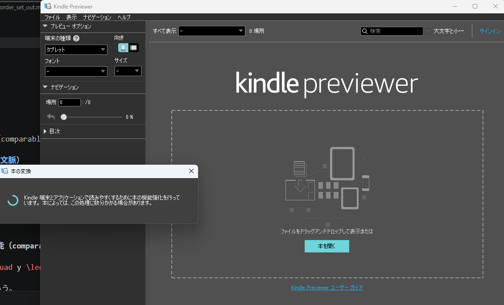

## 変換コマンド

```
pandoc -f markdown -t epub3 --mathml --no-highlight --css=epub.css --metadata language=ja 6_order_set_out.md -o book_tmp.epub
```

- cssを反映する
- 言語で日本語を利用する

画像化した数式を用いる場合

```
pandoc -f markdown -t epub3 --highlight-style=pygments --css=epub.css --epub-metadata=metadata.xml --toc --toc-depth=2 -o "D:\PycharmProjects\LLM-research\LLM-fundamental-study\basics_nn\sets_theory\doc\3_indexed_set.epub" "D:\PycharmProjects\LLM-research\LLM-fundamental-study\basics_nn\sets_theory\doc\3_indexed_set_converted.md"
```


## ほんのデバッグ
ローカルのkindle previewerで見る


