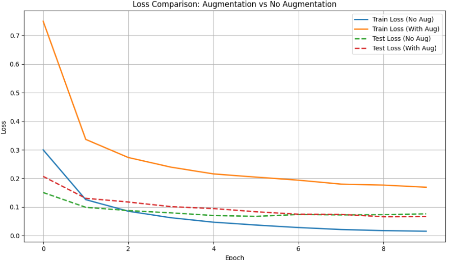
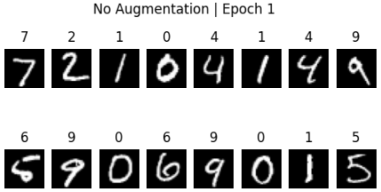
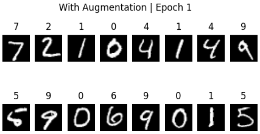

いまさらながらデータオーグメンテーション（Data Augmentation）の解説です。
データオーグメンテーションは、**機械学習、特に深層学習**において、訓練データの量と多様性を人工的に増やす手法です。
(著者が画像用AIモデルを扱っていた際によく使ってました)

## データオーグメンテーションの概要

データオーグメンテーションは、**既存のデータセット**に含まれる画像を**微小に、あるいはランダムに変更**することで、元のデータセットにはなかった新しい訓練サンプルを生成する技術です。

たとえば、元の画像が「猫」であれば、その画像を回転させたり、明るさを変えたり、トリミングしたりしても、生成された新しい画像は依然として「猫」として認識されます。これにより、モデルは**同じクラスのデータ**の**多様なバリエーション**を学習できます。


## データオーグメンテーションの主な効果

データオーグメンテーションを導入することで、以下のような重要な効果が得られます。

### 1. **過学習（Overfitting）の抑制**

これが最も重要な効果です。

* モデルが訓練データに含まれる**特定のノイズやパターン**（例：訓練画像がすべて左向き、特定の明るさ）を丸暗記してしまう現象を防ぎます。
* 多様なバリエーションを見せることで、モデルはデータの本質的な特徴（例：猫の耳やひげの形）に集中し、**汎化性能**（未知のデータに対する予測能力）が向上します。

### 2. **訓練データの不足解消**

* 深層学習モデルは通常、大量のデータがないと十分な性能を発揮できません。データオーグメンテーションは、データ収集が困難または高コストな場合に、**実質的なデータ量を増やす**手段として機能します。

### 3. **モデルのロバスト性（堅牢性）の向上**

* 現実世界で予測が行われる際、画像はノイズや照明の変化、角度のズレなど、訓練時とは異なる条件で取得されます。
* オーグメンテーションにより、モデルはこれらの**小さな変動に対して耐性を持つ**ようになり、より信頼性の高い予測が可能になります。

### 主な手法（画像認識の場合）

* **幾何学的変換:** 画像の回転、反転（フリップ）、ランダムなトリミング、せん断（シェア）、拡大/縮小。
* **色空間変換:** 明るさ、コントラスト、彩度（サチュレーション）のランダムな変更。
* **ノイズ注入:** ガウシアンノイズやランダムなマスクの追加。

### 実装

__例題:__ データオーグメンテーション（Data Augmentation）の効果

データオーグメンテーションの効果が分かる例題を扱います。

データオーグメンテーションの期待される効果はデータ水増しが過学習を抑えて、汎化性能を上げることです。
画像の分類問題が昔からよく使われる例題です。
今回はMNISTという手書きの数字の画像を、記載している数字が何か当てる＝分類する問題でデータオーグメンテーションの効果確認を行います。

コードではニューラルネットワークを構築して、数値を分類するようにします。
コードで出力するのは以下の2点です。

1. 途中の予測画像（オーグメンテーションなし / あり）

* あり → 変形された数字に強くなる
* なし → 訓練データ以外の形に弱い

2. ロスと精度の推移グラフ

* なし → 訓練精度100%なのにテスト精度が頭打ち
* あり → 訓練精度はゆっくり上がるが、テスト精度が高い


```python
import torch
import torch.nn as nn
import torch.optim as optim
from torchvision import datasets, transforms
from torch.utils.data import DataLoader
import matplotlib.pyplot as plt

# ======================
# データオーグメンテーション設定
# ======================
transform_no_aug = transforms.ToTensor()

transform_aug = transforms.Compose([
    transforms.RandomRotation(25),
    transforms.RandomAffine(0, translate=(0.1,0.1), scale=(0.9,1.1)),
    transforms.ToTensor(),
])

# ======================
# MNIST データロード
# ======================
train_no_aug = datasets.MNIST(root="./data", train=True, download=True, transform=transform_no_aug)
train_aug = datasets.MNIST(root="./data", train=True, download=True, transform=transform_aug)

test_data = datasets.MNIST(root="./data", train=False, download=True, transform=transforms.ToTensor())

train_loader_no_aug = DataLoader(train_no_aug, batch_size=64, shuffle=True)
train_loader_aug = DataLoader(train_aug, batch_size=64, shuffle=True)
test_loader = DataLoader(test_data, batch_size=1000, shuffle=False)

# ======================
# シンプルなMLPモデル
# ======================
class MLP(nn.Module):
    def __init__(self):
        super().__init__()
        self.net = nn.Sequential(
            nn.Flatten(),
            nn.Linear(28*28, 256),
            nn.ReLU(),
            nn.Linear(256, 10)
        )
    def forward(self, x):
        return self.net(x)

# ======================
# 評価関数
# ======================
def evaluate(model, loader):
    model.eval()
    correct, total = 0, 0
    loss_fn = nn.CrossEntropyLoss()
    total_loss = 0

    with torch.no_grad():
        for x,y in loader:
            pred = model(x)
            loss = loss_fn(pred, y)
            total_loss += loss.item()
            correct += (pred.argmax(dim=1) == y).sum().item()
            total += y.size(0)

    return total_loss / len(loader), correct / total

# ======================
# 学習＋可視化
# ======================
def train_and_plot(train_loader, title=""):
    model = MLP()
    optimizer = optim.Adam(model.parameters(), lr=0.001)
    loss_fn = nn.CrossEntropyLoss()

    train_loss_list = []
    test_loss_list = []
    test_acc_list = []

    plt.figure(figsize=(5,5))

    for epoch in range(1, 11):
        model.train()
        total_loss = 0

        for x,y in train_loader:
            optimizer.zero_grad()
            pred = model(x)
            loss = loss_fn(pred, y)
            loss.backward()
            optimizer.step()
            total_loss += loss.item()

        train_loss = total_loss / len(train_loader)
        test_loss, test_acc = evaluate(model, test_loader)

        train_loss_list.append(train_loss)
        test_loss_list.append(test_loss)
        test_acc_list.append(test_acc)

        # ---- 中間画像可視化 ----
        if epoch in [1, 5, 10]:
            x, _ = next(iter(test_loader))
            with torch.no_grad():
                out = model(x[:16]).argmax(dim=1)

            plt.figure(figsize=(6,3))
            for i in range(16):
                plt.subplot(2,8,i+1)
                plt.imshow(x[i].squeeze(), cmap="gray")
                plt.title(f"{out[i].item()}")
                plt.axis("off")
            plt.suptitle(f"{title} | Epoch {epoch}")
            plt.show()

        print(f"{title} Epoch {epoch}: TrainLoss={train_loss:.3f}, TestAcc={test_acc:.3f}")

    # ---- 学習曲線可視化 ----
    plt.figure(figsize=(10,4))

    plt.subplot(1,2,1)
    plt.plot(train_loss_list, label="Train Loss")
    plt.plot(test_loss_list, label="Test Loss")
    plt.title(f"Loss Curve: {title}")
    plt.legend()

    plt.subplot(1,2,2)
    plt.plot(test_acc_list)
    plt.title(f"Test Accuracy: {title}")
    plt.ylim(0, 1)

    plt.show()


# ======================
# 実行
# ======================
print("=== オーグメンテーションなし ===")
train_and_plot(train_loader_no_aug, title="No Augmentation")

print("=== オーグメンテーションあり ===")
train_and_plot(train_loader_aug, title="With Augmentation")
```

__結果の出力__

今回コードの結果について示します。

__この例題で分かること__

1. ロス関数の推移

オーグメンテーションがない場合、ロスは早い段階で収束することになります。
対して、オーグメンテーションがある場合、イレギュラーなデータが増えることになるため収束は遅くなります。



2. 実際の分類精度

データのバリュエーションを増やすためオーグメンテーションありの場合の方が見分けが難しいデータの分類精度が上がることになります。
(著者が選定したデータだとEpoch1でしか差はつきませんでした。)

Epoch1で以下のような状態でした。





まとめると以下のような結果が得られます。

| 項目           | オーグメンテーションなし | オーグメンテーションあり       |
| -------------- | ------------------------ | ------------------------------ |
| 訓練データ     | そのまま                 | ランダムに回転・移動・拡大縮小 |
| 訓練精度       | すぐに100%               | ゆっくり上昇                   |
| テスト精度     | 途中で頭打ち             | 最後まで上昇                   |
| 過学習         | 起こりやすい             | 抑えられる                     |
| モデルの頑強さ | 弱い                     | 変形された数字にも強い         |


