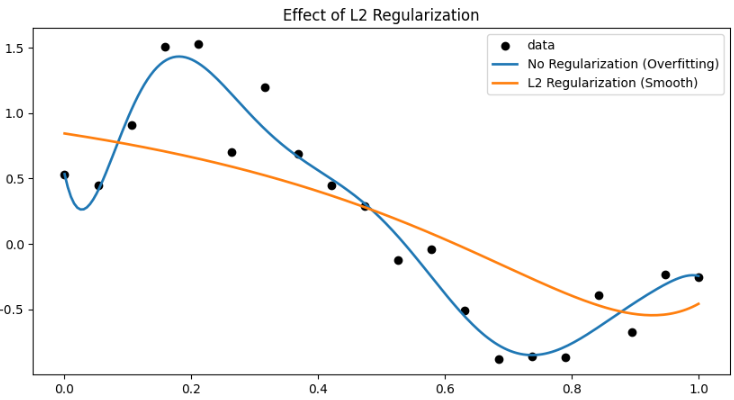

ニューラルネットワークに用いられる正則化について説明します。

#### 正則化の概要

正則化とは、ニューラルネットワークの訓練時において、**モデルの訓練データへの適合度合い**（訓練精度）と、**未知のデータへの汎化能力**（テスト精度）のバランスを取るために導入される一連の手法のことです。

簡単に言えば、「訓練データに対して完璧すぎると、新しいデータで失敗しやすい」という問題を解消するために、**意図的に訓練を難しくしたり、モデルの複雑性にペナルティを与えたりする**仕組みです。

正則化は、損失関数に項を追加したり（重み減衰）、ネットワークの構造を変更したり（ドロップアウト）することで実現されます。

#### 解決したい主要な問題点：過学習（Overfitting）

正則化が解決したい最も中心的な問題は**過学習（Overfitting）**です。

__1. 過学習とは__

過学習とは、モデルが訓練データに含まれるノイズやランダムな変動といった**本質的でない特徴まで詳細に学習しすぎてしまう**現象です。

その結果、訓練データに対する精度は非常に高くなりますが、**少しでもパターンが異なる未知のデータ**（テストデータや実際の現場のデータ）に対しては、パフォーマンスが著しく低下してしまいます。

__2. 過学習が発生しやすい条件__

* **モデルの複雑性（容量）が高い**: パラメータ（重み）の数がデータ量に対して多すぎる場合。例えば、層が深すぎる、またはニューロン数が多すぎるモデルの場合。
* **訓練データが少ない**: モデルが特徴を学ぶためのサンプルが不足している場合。
* **訓練を長時間行う**: 訓練が進みすぎると、モデルは汎用的な特徴を学ぶのをやめ、訓練データ特有のノイズを記憶し始めます。

__3. 正則化による解決アプローチ__

正則化は、以下の手法で過学習を抑制します。

| 正則化の手法 | 解決アプローチ | 具体的な効果 |
| :--- | :--- | :--- |
| **L1/L2正則化 (重み減衰)** | **モデルの複雑性を直接罰する** | 損失関数に重みの大きさを加算し、重みが大きな値を取ることを抑制します。モデル全体をシンプルに保ちます。 |
| **ドロップアウト (Dropout)** | **ニューロンの相互依存性を低下させる** | 訓練中にニューロンをランダムに無効化することで、特定のニューロンに依存した学習を防ぎ、**ロバスト性（頑健性）**を高めます。 |

正則化は、訓練精度をわずかに犠牲にしてでも、**テスト精度（汎化性能）を最大化する**ことを目的としています。

**L2 正則化の効果（= 過学習を防ぎ、滑らかな重みになる）」が一目で分かる** シンプルで強力な例題を紹介します。


__例題：__ ノイズの多い 1次元データを 3次多項式で回帰する

L2正則化の効果を確認するためL2正則化があるか、ないかにおけるフィッティングの結果を比較しまう。
お題として選択したものは3次多項式です。
地味に3次多項式は線形性が成り立たないため、通常の回帰では予測できません。

__なぜこれで分かる？__

* ノイズが多いデータを「高次モデル（3次多項式）」で学習すると **過学習しやすい**
* L2 正則化（Weight Decay）を入れると
  → **曲線が滑らかになる（= 過学習が抑えられる）**
* プロットを見ると一目で違いがわかる


__可視化コード（L2 なし vs あり）__

以下はそのまま動く **完全版の可視化コード** です。

```python
import numpy as np
import matplotlib.pyplot as plt
from sklearn.linear_model import Ridge, LinearRegression
from sklearn.preprocessing import PolynomialFeatures
from sklearn.pipeline import make_pipeline

# 乱数
np.random.seed(0)

# --- データ生成（ノイズが多い） ---
X = np.linspace(0, 1, 20)
y = np.sin(2 * np.pi * X) + np.random.randn(20) * 0.3  # ノイズ大きめ
X = X[:, np.newaxis]

# --- 多項式回帰（3次） ---
degree = 10  # 過学習させるため10次を使用

# L2 なし（普通の線形回帰）
model_no_reg = make_pipeline(PolynomialFeatures(degree), LinearRegression())
model_no_reg.fit(X, y)

# L2 あり（Ridge 回帰）
model_l2 = make_pipeline(PolynomialFeatures(degree), Ridge(alpha=1.0))
model_l2.fit(X, y)

# プロット用データ
X_test = np.linspace(0, 1, 200)[:, np.newaxis]

y_no_reg = model_no_reg.predict(X_test)
y_l2 = model_l2.predict(X_test)

# --- 可視化 ---
plt.figure(figsize=(10, 5))

# 元データ
plt.scatter(X, y, color='black', label='data')

# L2 なし
plt.plot(X_test, y_no_reg, label='No Regularization (Overfitting)', linewidth=2)

# L2 あり
plt.plot(X_test, y_l2, label='L2 Regularization (Smooth)', linewidth=2)

plt.title("Effect of L2 Regularization")
plt.legend()
plt.show()
```

__出力の結果__

__L2 なし（LinearRegression）__

* ノイズに引っ張られ、曲線がガタガタ
* 完全に **過学習**した「不自然な曲線」になる

__L2 あり（Ridge）__

* ノイズを無視して「ほどよく滑らかな」曲線になる
* **汎化性能が高い**

__L2 正則化の効果__

* 訓練データにぴったり合わせすぎると
  → **係数（重み） が極端に大きくなる**
* L2 正則化は

```
重みを大きくしすぎると罰金を与える
```

つまり：

* ノイズに振り回されない
* 曲線が滑らかになる
* 過学習が抑えられる




