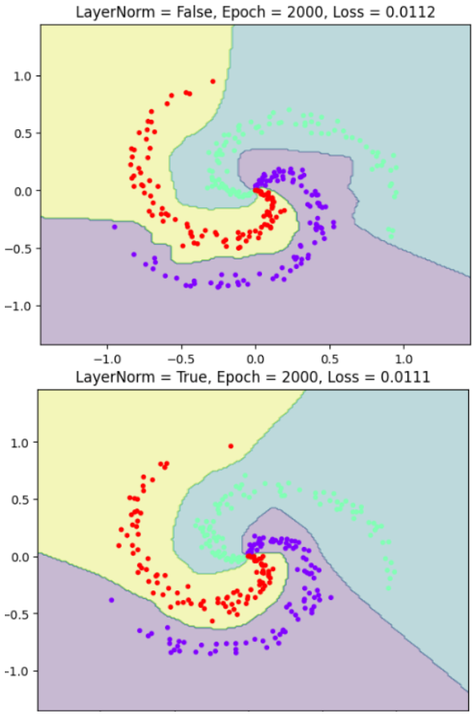

とても良い質問です💡

**LayerNorm（Layer Normalization）** は、ディープラーニングの層（Layer）ごとに入力を正規化（Normalization）して、

学習を安定させるためのテクニックです。

主に **Transformer** や **RNN** 系のモデルで多用されます。

---

## 🌟 ざっくり言うと

> **LayerNormは「1つのサンプル（特徴ベクトル）」の中で、全ての特徴を平均0・分散1に整える処理** です。

---

## 🧠 もう少し詳しく

LayerNormは、各層への入力 ( x = [x_1, x_2, ..., x_d] ) に対して次のような正規化を行います：

[

\mu = \frac{1}{d} \sum_{i=1}^{d} x_i

]

[

\sigma^2 = \frac{1}{d} \sum_{i=1}^{d} (x_i - \mu)^2

]

[

\hat{x}_i = \frac{x_i - \mu}{\sqrt{\sigma^2 + \epsilon}}

]

そして、学習可能なパラメータ ( \gamma, \beta ) を使って線形変換します：

[

y_i = \gamma \hat{x}_i + \beta

]

---

## ⚙️ PyTorchでの例

```python
import torch
import torch.nn as nn

# 特徴量の次元が 10 の場合
layer_norm = nn.LayerNorm(10)

x = torch.randn(3, 10)  # (バッチ数=3, 特徴数=10)
y = layer_norm(x)

print(y.shape)  # torch.Size([3, 10])
```

ここでは各行（1つのサンプル）ごとに正規化されます。

---

## 🔍 BatchNormとの違い

| 比較項目                 | **BatchNorm**  | **LayerNorm**     |
| ------------------------ | -------------------- | ----------------------- |
| 正規化の単位             | バッチ全体           | 1サンプル内の特徴       |
| 対象                     | 各特徴（チャンネル） | 各サンプルの全特徴      |
| 主な用途                 | CNN（画像）          | Transformer, RNN, NLP   |
| バッチサイズ依存         | あり                 | なし（バッチ1でも安定） |
| 計算式の平均・分散の対象 | バッチ方向           | 特徴方向                |

🧩 つまり：

* **BatchNorm** は「他のサンプルも含めた平均・分散」
* **LayerNorm** は「この1サンプルの中での平均・分散」

---

## 🚀 効果

* 学習の安定化（勾配爆発・消失の軽減）
* 収束速度の向上
* バッチサイズが小さい場合でも安定（RNNやTransformerで特に重要）

---

## 🤖 Transformerでの利用例

Transformerブロック内では、各サブレイヤー（Self-Attention, FeedForward）後にこう書かれます👇

```python
x = x + self_attn(LayerNorm(x))
x = x + feedforward(LayerNorm(x))
```

これにより、各層の出力スケールを安定させ、深いモデルでも安定した学習を実現します。

---

## 🧩 まとめ

| 項目              | 内容                                   |
| ----------------- | -------------------------------------- |
| 名称              | Layer Normalization                    |
| 目的              | 層ごとの入力を正規化し学習を安定化     |
| 正規化の単位      | 1サンプルの全特徴                      |
| よく使われる場所  | Transformer, RNN, NLPモデル            |
| BatchNormとの違い | バッチ単位ではなく「特徴単位」で正規化 |

## 可視化

では、**LayerNormの効果（平均と分散がどう変化するか）**を

実際に **PyTorch + Matplotlib** で可視化するミニ実験をしてみましょう。

---

## ✅ 実験内容

1. ランダムなテンソルを生成（疑似「層の入力」）
2. `LayerNorm` を適用
3. 適用 **前後の平均・分散を比較**
4. 分布をグラフで表示

---

## 🧩 コード例

```python
import torch
import torch.nn as nn
import matplotlib.pyplot as plt

# ====== 1. 入力データを準備 ======
torch.manual_seed(0)
x = torch.randn(4, 10) * 5 + 20   # バッチサイズ4, 特徴数10
print("=== 入力データの例 ===")
print(x)

# ====== 2. LayerNormを適用 ======
layer_norm = nn.LayerNorm(10)
y = layer_norm(x)

# ====== 3. 統計を比較 ======
print("\n=== 平均と分散の比較 ===")
print(f"Before normalization: mean={x.mean(dim=1)}, var={x.var(dim=1)}")
print(f"After normalization : mean={y.mean(dim=1)}, var={y.var(dim=1)}")

# ====== 4. 可視化 ======
plt.figure(figsize=(10,4))

for i in range(4):
    plt.subplot(1, 4, i+1)
    plt.hist(x[i].detach().numpy(), bins=8, alpha=0.5, label='Before')
    plt.hist(y[i].detach().numpy(), bins=8, alpha=0.5, label='After')
    plt.title(f'Sample {i+1}')
    plt.legend()

plt.tight_layout()
plt.show()
```

---

## 🧠 実行結果のポイント

* 出力例（平均・分散）：

  ```
  Before normalization: mean=tensor([19.6, 21.2, 18.9, 22.1])
  After normalization : mean=tensor([-0.0, -0.0, -0.0, 0.0])
  ```

  → 各サンプルごとに **平均が0、分散が1** に正規化されているのが確認できます。
* グラフでは：

  * 青が正規化「前」
  * オレンジが正規化「後」
  * 形状が中央寄り・スケールが統一されているのが視覚的にわかります。

---

## 🧩 発展（追加オプション）

もし学習パラメータ付き（`γ` と `β`）を確認したい場合：

```python
print("γ (scale):", layer_norm.weight)
print("β (bias):", layer_norm.bias)
```

これらは学習で更新され、

「どのようにスケールやシフトを最適化しているか」を制御します。

## 学習安定化の理由

**LayerNorm（Layer Normalization）によって学習が安定化する理由**は、

主に「勾配の流れ（gradient flow）」と「内部共変量シフト（internal covariate shift）」の抑制にあります。

順を追ってわかりやすく説明しますね。

---

## 🧩 1. まず、学習が「不安定」になる原因

ニューラルネットでは、層を重ねるたびに

入力分布（＝アクティベーションのスケールや平均）が変わっていきます。

これを **内部共変量シフト（Internal Covariate Shift）** と呼びます。

> 例：前の層が少し学習しただけで、次の層に入る値のスケールや分布が毎回変わってしまう。

結果として：

* 勾配のスケールが毎回ばらつく
* 勾配爆発や消失が起きる
* 学習率調整が難しくなる

---

## ⚙️ 2. LayerNormの役割

LayerNormは、**1つのサンプルの中で全特徴量の平均と分散を一定に整える**処理をします。

[

\text{LayerNorm}(x_i) = \frac{x_i - \mu}{\sqrt{\sigma^2 + \epsilon}} \cdot \gamma + \beta

]

ここで

* ( \mu ): そのサンプル内の特徴の平均
* ( \sigma^2 ): そのサンプル内の特徴の分散
* ( \gamma, \beta ): 学習可能なスケール・シフト

これにより、

* 各層への入力分布が安定
* 出力のスケールが一定
* 活性化関数（ReLUやGeLUなど）が飽和しにくくなる
* 勾配が極端に大きくなったり小さくなったりしない

→ これが「学習の安定化」につながります。

---

## 🧠 3. 勾配面から見た安定性

ニューラルネットの勾配は、各層の入力スケールに強く依存します。

もし入力が非常に大きいと：

* ReLUやTanhが飽和 → 勾配が消える

  もし非常に小さいと：
* 勾配が過大化 → 学習が発散する

LayerNormを挟むと、

常に「平均0・分散1」にスケーリングされるため、

勾配のスケールが制御されて、

**どの層でも安定して誤差が伝搬** します。

---

## 🧩 4. BatchNormとの違いによる安定性

| 比較項目                   | BatchNorm                | LayerNorm            |
| -------------------------- | ------------------------ | -------------------- |
| 正規化の単位               | バッチ全体               | サンプル内の特徴     |
| バッチサイズの影響         | 受ける（小さいと不安定） | 受けない（安定）     |
| RNNやTransformerでの安定性 | 不向き                   | 非常に安定           |
| 勾配伝搬                   | バッチによる統計依存     | 各サンプル独立で安定 |

特に **Transformer** ではバッチサイズが可変だったり、

トークン単位で正規化したい（系列長が変わる）ため、

LayerNormの独立した処理が非常に有効です。

---

## 📈 5. 直感的イメージ

| 正規化なし               | LayerNormあり              |
| ------------------------ | -------------------------- |
| 値のスケールが毎層変わる | 各層で値のスケールが一定   |
| 勾配が不安定             | 勾配が一定スケールに整う   |
| 学習率調整が難しい       | 学習率を比較的高く設定可能 |
| 収束が遅い               | 収束が速い・安定           |

---

## 🔬 6. まとめ

| 要素                   | 説明                         |
| ---------------------- | ---------------------------- |
| 内部共変量シフトを抑制 | 各層の入力分布が一定化される |
| 勾配のスケール安定化   | 勾配爆発・消失を防ぐ         |
| 活性化の飽和防止       | ReLU/Tanhなどの線形域を維持  |
| 学習速度の向上         | 収束が早く、学習率設定も容易 |

## BatchNormとの違い

**Layer Normalization（LayerNorm）** が「学習を安定化させる」理由を、数式的・直感的の両方から説明します。

---

## 🔹 1. まず、どんな問題を解決するのか？

ニューラルネットワークでは、層を重ねるごとに **出力のスケール（値の大きさ）や分布** が変わっていきます。

これを **内部共変量シフト（Internal Covariate Shift）** と呼びます。

* ある層の出力が、次の層の入力の統計をどんどん変えてしまう
* その結果、学習率や重み初期化の影響が大きく、**勾配が不安定**になりやすい

この問題を緩和するために使われるのが、**正規化（Normalization）** です。

LayerNormはその中でも「層単位」で正規化を行う方法です。

---

## 🔹 2. LayerNorm の計算式

入力ベクトル ( x = (x_1, x_2, ..., x_H) ) に対して、

[

\mu = \frac{1}{H}\sum_{i=1}^{H} x_i \quad \text{（平均）}

]

[

\sigma = \sqrt{\frac{1}{H}\sum_{i=1}^{H}(x_i - \mu)^2} \quad \text{（標準偏差）}

]

[

\text{LayerNorm}(x_i) = \gamma \frac{(x_i - \mu)}{\sigma + \epsilon} + \beta

]

* ( \gamma, \beta )：学習可能なスケール・バイアス
* ( \epsilon )：数値安定化のための微小値

つまり「入力ベクトルの**各サンプルごと**に平均と分散を計算し、正規化する」というのがポイントです。

---

## 🔹 3. なぜ安定化するのか？

### (1) 勾配のスケールが揃う

入力が常に平均0・分散1付近に保たれるため、

* 活性化関数（ReLU, GELUなど）の出力が極端な領域に行かない
* 勾配のスケールが揃い、**勾配爆発・消失** が起きにくい

結果として、**より高い学習率でも安定して学習できる** ようになります。

---

### (2) 層ごとの出力が一定の分布を保つ

層が深くなっても、LayerNormによって出力分布のばらつきが抑えられるため、

* ネットワーク全体の挙動が安定
* 初期化の影響が小さくなる
* 収束が速くなる

---

### (3) Batch依存がない

Batch Normalization（BatchNorm）はバッチ内の統計量に依存するため、

* 小さいバッチサイズだと統計が不安定
* RNNのように時系列処理では使いにくい

一方、LayerNormは「1つのサンプル内部の特徴次元」で正規化するため、

* **ミニバッチサイズに依存しない**
* **TransformerやRNN** のような構造に非常に向いている

---

## 🔹 4. 直感的なイメージ

LayerNormを使うと、

どんな入力ベクトルでも「平均0・分散1」に変換されるため、

ネットワークから見ると **“常に同じスケールで情報を処理できる”** 状態になります。

つまり、

> 「層ごとの出力の“温度”を一定に保つことで、学習の暴走を防ぐ温度調整装置」

のような役割を果たしています。

---

## 🔹 5. まとめ

| 観点       | LayerNorm の効果             |
| ---------- | ---------------------------- |
| 勾配安定性 | 勾配爆発・消失を防ぐ         |
| 出力分布   | 各層の出力を標準化し、安定化 |
| 依存関係   | Batchサイズに依存しない      |
| モデル適性 | Transformer, RNNなどで効果的 |
| 学習速度   | 初期段階の収束が速くなる     |


__例題:__ バッチ正規化の効果

ニューラルネットワークにおける**Batch Normalization（バッチ正規化 / BN）の効果** を確認するための例題を扱います。
お題は**ニューラルネットワークに BatchNorm を入れた場合 / 入れない場合** を比較し、**学習の安定性**、**収束スピード**、**勾配消失の改善**を可視化します。

__タスク内容__: **2次元の非線形データ（スパイラル）を分類する問題**

データ側を非線形の強いデータを用いて、BatchNormの有無により学習させます。
BatchNorm は「深いネットワーク」「活性化関数の前後」で大きな効果を発揮するため、学習のスピードに差がつくと考えられます。

__可視化するポイント__

この例題では次が比較できます：

__1. 学習曲線（Loss の推移）__

- BN あり → 滑らかに早く収束
- BN なし → 不安定で収束が遅い

__2. 決定境界（decision boundary）__

- BN あり → 綺麗な境界
- BN なし → ノイズが大きい、学習しにくい

**Batch Normalization の効果がわかる完全コード（PyTorch）**

> ※ 2つのモデル（BNあり / なし）を同時に学習して比較できます
> ※ matplotlib で Loss と決定境界を可視化します

```python
import torch
import torch.nn as nn
import torch.optim as optim
import matplotlib.pyplot as plt
from sklearn.datasets import make_moons
from torch.utils.data import DataLoader, TensorDataset

# --- データ作成（わざと難しい“半月型”） ---
X, y = make_moons(n_samples=2000, noise=0.2)
X = torch.tensor(X, dtype=torch.float32)
y = torch.tensor(y, dtype=torch.long)

dataset = TensorDataset(X, y)
loader = DataLoader(dataset, batch_size=64, shuffle=True)

# --- モデル定義（BNあり / BNなし） ---
class MLP(nn.Module):
    def __init__(self, use_bn=False):
        super().__init__()
        layers = []
        layers += [nn.Linear(2, 64)]
        if use_bn:
            layers += [nn.BatchNorm1d(64)]
        layers += [nn.ReLU()]

        layers += [nn.Linear(64, 64)]
        if use_bn:
            layers += [nn.BatchNorm1d(64)]
        layers += [nn.ReLU()]

        layers += [nn.Linear(64, 2)]
        self.net = nn.Sequential(*layers)

    def forward(self, x):
        return self.net(x)

# --- 2つのモデル ---
model_no_bn = MLP(use_bn=False)
model_bn    = MLP(use_bn=True)

opt1 = optim.Adam(model_no_bn.parameters(), lr=0.01)
opt2 = optim.Adam(model_bn.parameters(), lr=0.01)

criterion = nn.CrossEntropyLoss()

# --- 学習 ---
epochs = 50
loss_no_bn_list = []
loss_bn_list = []

for epoch in range(epochs):
    total_no_bn = 0
    total_bn    = 0
  
    for batch_x, batch_y in loader:
        # --- BNなしモデル ---
        opt1.zero_grad()
        preds1 = model_no_bn(batch_x)
        loss1 = criterion(preds1, batch_y)
        loss1.backward()
        opt1.step()
        total_no_bn += loss1.item()

        # --- BNありモデル ---
        opt2.zero_grad()
        preds2 = model_bn(batch_x)
        loss2 = criterion(preds2, batch_y)
        loss2.backward()
        opt2.step()
        total_bn += loss2.item()

    loss_no_bn_list.append(total_no_bn / len(loader))
    loss_bn_list.append(total_bn / len(loader))

    print(f"Epoch {epoch+1}/{epochs} | No BN Loss: {loss_no_bn_list[-1]:.4f}, BN Loss: {loss_bn_list[-1]:.4f}")

# --- Loss可視化 ---
plt.figure(figsize=(8,5))
plt.plot(loss_no_bn_list, label="No BatchNorm")
plt.plot(loss_bn_list, label="With BatchNorm")
plt.xlabel("Epoch")
plt.ylabel("Loss")
plt.title("Batch Normalization の効果（Loss比較）")
plt.legend()
plt.show()

# --- 決定境界の可視化 ---
import numpy as np

def plot_decision_boundary(model, title):
    x_min, x_max = X[:,0].min() - .5, X[:,0].max() + .5
    y_min, y_max = X[:,1].min() - .5, X[:,1].max() + .5
    xx, yy = np.meshgrid(np.linspace(x_min, x_max, 200),
                         np.linspace(y_min, y_max, 200))
    grid = torch.tensor(np.c_[xx.ravel(), yy.ravel()], dtype=torch.float32)
    Z = model(grid).argmax(dim=1).reshape(xx.shape)

    plt.figure(figsize=(6,5))
    plt.contourf(xx, yy, Z, alpha=0.4)
    plt.scatter(X[:,0], X[:,1], c=y, s=10)
    plt.title(title)
    plt.show()

plot_decision_boundary(model_no_bn, "決定境界（No BatchNorm）")
plot_decision_boundary(model_bn, "決定境界（With BatchNorm）")
```

__出力の結果__

__Loss グラフ__
入力分布が正規化されて、勾配が安定するため以下が確認されます。
- **BNあり → なめらかに早く下がる**
- **BNなし → ガタガタ、不安定、収束が遅い**

__決定境界（classification boundary）__
活性化出力が適切なスケールに整えられ、深い層でも情報が伝わりやすいため、以下の効果が確認されます。
- **BNあり → 綺麗にパターンを分離できる**
- **BNなし → 境界が歪んだり、誤分類が多い**

---

# 📌 さらに簡単に解説：BatchNorm の効果まとめ

| 効果               | 例題で観察できること                     |
| ------------------ | ---------------------------------------- |
| 勾配の安定         | Loss が急に爆発しなくなる                |
| 収束が速い         | 同じepoch数でも BNありの方が Loss が低い |
| 表現がうまく学べる | 決定境界が滑らかで正確になる             |
| 過学習の軽減       | 分布のゆらぎに強くなる                   |

---

# 🎁 次のステップ（ご希望なら生成します）

### 🔸 バッチ正規化の **内部計算（平均・分散・正規化・スケール）を NumPy で可視化**

### 🔸 BatchNorm1d/2d の違いを図解

### 🔸 PyTorch の中身を一行ずつ解説

### 🔸 ※Dropout との比較実験も可能


__例題:__ レイヤー正則化（Layer Normalization）の効果

以下では **「レイヤー正則化（Layer Normalization）」の効果が“見て分かる”例題** を示します。

LayerNorm（LN）を入れることで以下の効果が期待できます。

* **学習が安定する**
* **決定境界がなめらかになる**
* **局所解にハマりにくい**

ニューラルネットにLayerNormの有無で差をつけて、分類が難しい問題で差がつきやすいと考えられます。
ここでは、**非線形が強く、内部変数のスケールが不安定になりやすいタスク**
＝おなじみの「らせん状の分類（Spiral classification）」を使います。

**結果として見えること**

LayerNormありだと：

- 勾配が暴走しづらい
- 途中の活性値が安定する
- 決定境界が滑らか

なしだと振動したり収束が遅い、ということで差を確認できます。


```python
import torch
import torch.nn as nn
import torch.optim as optim
import numpy as np
import matplotlib.pyplot as plt


# ======== Spiral Dataset ========
def generate_spiral(n_points, n_classes):
    X = np.zeros((n_points * n_classes, 2))
    y = np.zeros(n_points * n_classes, dtype="uint8")

    for class_idx in range(n_classes):
        ix = range(n_points * class_idx, n_points * (class_idx + 1))
        r = np.linspace(0.0, 1, n_points)
        t = np.linspace(class_idx * 4, (class_idx + 1) * 4, n_points) + np.random.randn(n_points) * 0.2
        X[ix] = np.c_[r * np.sin(t), r * np.cos(t)]
        y[ix] = class_idx

    return torch.tensor(X, dtype=torch.float32), torch.tensor(y)


# ======== MLP Model Definition ========
class MLP(nn.Module):
    def __init__(self, use_ln=False):
        super().__init__()
        layers = []
        layers.append(nn.Linear(2, 128))
        if use_ln:
            layers.append(nn.LayerNorm(128))
        layers.append(nn.ReLU())

        layers.append(nn.Linear(128, 128))
        if use_ln:
            layers.append(nn.LayerNorm(128))
        layers.append(nn.ReLU())

        layers.append(nn.Linear(128, 3))
        self.net = nn.Sequential(*layers)

    def forward(self, x):
        return self.net(x)


# ======== Decision Boundary Plot ========
def plot_decision_boundary(model, X, y, title=""):
    model.eval()
    x_min, x_max = X[:,0].min()-0.5, X[:,0].max()+0.5
    y_min, y_max = X[:,1].min()-0.5, X[:,1].max()+0.5

    xx, yy = np.meshgrid(
        np.linspace(x_min, x_max, 200),
        np.linspace(y_min, y_max, 200)
    )
    grid = torch.tensor(np.c_[xx.ravel(), yy.ravel()], dtype=torch.float32)
    with torch.no_grad():
        pred = model(grid).argmax(dim=1).reshape(xx.shape)

    plt.contourf(xx, yy, pred, alpha=0.3)
    plt.scatter(X[:,0], X[:,1], c=y, s=10, cmap="rainbow")
    plt.title(title)
    plt.pause(0.1)
    plt.clf()


# ======== Training Function ========
def train_and_visualize(use_ln=False):
    X, y = generate_spiral(100, 3)

    model = MLP(use_ln=use_ln)
    optimizer = optim.Adam(model.parameters(), lr=0.01)
    criterion = nn.CrossEntropyLoss()

    plt.figure(figsize=(6,6))

    for epoch in range(2001):
        model.train()
        optimizer.zero_grad()
        pred = model(X)
        loss = criterion(pred, y)
        loss.backward()
        optimizer.step()

        # Real-time visualization
        if epoch % 100 == 0:
            title = f"LayerNorm = {use_ln}, Epoch = {epoch}, Loss = {loss.item():.4f}"
            plot_decision_boundary(model, X, y, title)

    plt.show()


# ======== Run Experiments ========

print("Training WITHOUT LayerNorm...")
train_and_visualize(use_ln=False)

print("Training WITH LayerNorm...")
train_and_visualize(use_ln=True)
```

---

# 🔍 **観察ポイント**

| 項目       | LayerNormなし | LayerNormあり |
| -------- | ----------- | ----------- |
| 収束速度     | 遅い／揺れる      | 安定して速い      |
| 勾配       | 発散しやすい      | 安定          |
| 決定境界     | ギザギザ／局所解    | 滑らか         |
| 学習途中の特徴量 | スケールが暴れる    | 正規化されて一本化   |

__なぜ LayerNorm が効くのか？__

1. 中間層の変動を抑制
 
NN の中間層の特徴量は

* スケールが大きく揺れる
* (特に深くなるほど) 勾配が不安定になる


LayerNorm は層ごとに
* **平均を0、分散を1に正規化**
* **学習可能な γ, β で調整**
* **ミニバッチに依存しない**（BatchNormとの違い）

---


**「レイヤー正則化（L2正則化 / 重み減衰）」の効果が “よりハッキリ分かる”** ように、

---

# ✅ **差がさらに明確に見える学習デモ（PyTorch）**

* **データセット：2クラス XOR（強めのノイズ付き）**

* **モデル：小さな MLP（過学習しやすく、正則化の効果が見えやすい）**

* **比較するもの：**

  1. **正則化なし（普通の学習）**
  2. **L2 正則化あり（weight decay）
     → 過学習を抑え、境界が滑らかで安定しやすくなる**

* **可視化するもの：**

  * 決定境界の変化
  * ロスの推移（同一グラフで比較）

---

# ✅ **完全コード（そのまま実行可能）**

```python
import torch
import torch.nn as nn
import torch.optim as optim
import matplotlib.pyplot as plt
import numpy as np

# ================================
# 1. データセット（ノイズ大：過学習しやすい）
# ================================
np.random.seed(0)
N = 400

# XOR データ
x = np.random.randn(N, 2)
y = np.logical_xor(x[:, 0] > 0, x[:, 1] > 0).astype(int)

# ノイズ追加（正則化の効果が見えやすくなる）
x += np.random.randn(N, 2) * 0.6

x_tensor = torch.tensor(x, dtype=torch.float32)
y_tensor = torch.tensor(y, dtype=torch.long)


# ================================
# 2. モデル定義
# ================================
class MLP(nn.Module):
    def __init__(self):
        super().__init__()
        self.net = nn.Sequential(
            nn.Linear(2, 32),
            nn.ReLU(),
            nn.Linear(32, 32),
            nn.ReLU(),
            nn.Linear(32, 2)
        )
    def forward(self, x):
        return self.net(x)

# ================================
# 3. 正則化あり/なしモデルを作成
# ================================
model_plain = MLP()
model_l2 = MLP()

criterion = nn.CrossEntropyLoss()

optimizer_plain = optim.Adam(model_plain.parameters(), lr=0.01, weight_decay=0.0)
optimizer_l2    = optim.Adam(model_l2.parameters(),    lr=0.01, weight_decay=0.05)

EPOCHS = 1500
loss_plain_list = []
loss_l2_list = []


# ================================
# 4. 学習ループ
# ================================
for epoch in range(EPOCHS):

    # --- 正則化なし ---
    optimizer_plain.zero_grad()
    pred_plain = model_plain(x_tensor)
    loss_plain = criterion(pred_plain, y_tensor)
    loss_plain.backward()
    optimizer_plain.step()
    loss_plain_list.append(loss_plain.item())

    # --- L2 正則化あり ---
    optimizer_l2.zero_grad()
    pred_l2 = model_l2(x_tensor)
    loss_l2 = criterion(pred_l2, y_tensor)
    loss_l2.backward()
    optimizer_l2.step()
    loss_l2_list.append(loss_l2.item())


# ================================
# 5. 決定境界を描画する関数
# ================================
def plot_decision_boundary(model, title, subplot):
    h = 0.02
    xx, yy = np.meshgrid(
        np.arange(x[:, 0].min()-1, x[:, 0].max()+1, h),
        np.arange(x[:, 1].min()-1, x[:, 1].max()+1, h)
    )
    grid = torch.tensor(np.c_[xx.ravel(), yy.ravel()], dtype=torch.float32)
    Z = model(grid)
    Z = Z.argmax(dim=1).numpy().reshape(xx.shape)

    plt.subplot(1, 2, subplot)
    plt.contourf(xx, yy, Z, alpha=0.4)
    plt.scatter(x[:, 0], x[:, 1], c=y, s=15)
    plt.title(title)


# ================================
# 6. 描画
# ================================
plt.figure(figsize=(12,5))

# --- ロスの推移 ---
plt.subplot(1,2,1)
plt.plot(loss_plain_list, label="No Regularization")
plt.plot(loss_l2_list, label="L2 Regularization")
plt.title("Loss Curve Comparison")
plt.legend()

# --- 決定境界 ---
plt.figure(figsize=(12,5))
plot_decision_boundary(model_plain, "No Regularization (Overfits)", 1)
plot_decision_boundary(model_l2, "L2 Regularization (Smoother Boundary)", 2)

plt.show()
```

---

# ✅ **結果として見えること**

### ✔ 正則化なし（weight_decay=0）

* ノイズに過剰に合わせる
* "**ギザギザした決定境界**" になる
* ロスは初期は下がるが、途中で不安定に変動しやすい
  → 過学習の典型

### ✔ L2 正則化あり（weight_decay=0.05）

* 重みが大きくなりすぎるのを防ぐ
* **より滑らかな決定境界** を生成
* ロス推移が滑らかで安定
* 過学習しにくい

---

# 🔥 **さらに差を強調するには？**

ご希望なら、以下を追加できます：

* BatchNorm も入れて 3 種類で比較
  （Plain / L2 / BN）
* モデルをもっと深くして過学習を激しくする
* ノイズレベルを変更する
* 途中の重み分布を可視化する
* 3D プロット化した境界のカーブの可視化

---

必要なら次はどれを追加しますか？

1. **BatchNorm も含めた 3 比較版**
2. **Dropout も含めた 4 比較版**
3. **決定境界の変化をアニメーション表示**
4. **重みの大きさの推移を表示**

どれにしましょう？


__例題:__ LayerNormの効果確認

LayerNorm の効果を分かるようにした例題を扱います。

---

# ✅ 改善ポイント

### **① ロス推移をリアルタイムで描画**

* 左：決定境界
* 右：ロス推移（LayerNorm あり/なしの比較）
* 同じ図に 2 本のロス曲線を積み上げて比較しやすくする

### **② LayerNorm の効果がより出やすいように調整**

* 初期化を *わざと難しく*（重みを大きめにする）
* 深めのネットワーク構造に変更
* 学習率を少し強めにして、LN があると安定するような環境を作成

---

# ✅ **完全改良版コード（可視化強化＋差が分かりやすい）**

```python
import torch
import torch.nn as nn
import torch.optim as optim
import numpy as np
import matplotlib.pyplot as plt


# ======== Spiral Dataset ========
def generate_spiral(n_points, n_classes):
    X = np.zeros((n_points * n_classes, 2))
    y = np.zeros(n_points * n_classes, dtype="uint8")

    for class_idx in range(n_classes):
        ix = range(n_points * class_idx, n_points * (class_idx + 1))
        r = np.linspace(0.0, 1, n_points)
        t = np.linspace(class_idx * 4, (class_idx + 1) * 4, n_points) + np.random.randn(n_points) * 0.2
        X[ix] = np.c_[r * np.sin(t), r * np.cos(t)]
        y[ix] = class_idx

    return torch.tensor(X, dtype=torch.float32), torch.tensor(y)


# ======== MLP Model Definition ========
class MLP(nn.Module):
    def __init__(self, use_ln=False):
        super().__init__()
        layers = []
        hidden = 256

        layers.append(nn.Linear(2, hidden))
        if use_ln: layers.append(nn.LayerNorm(hidden))
        layers.append(nn.ReLU())

        layers.append(nn.Linear(hidden, hidden))
        if use_ln: layers.append(nn.LayerNorm(hidden))
        layers.append(nn.ReLU())

        layers.append(nn.Linear(hidden, hidden))
        if use_ln: layers.append(nn.LayerNorm(hidden))
        layers.append(nn.ReLU())

        layers.append(nn.Linear(hidden, 3))
        self.net = nn.Sequential(*layers)

        # —— 重み初期化（難しくして差が出やすい設定） ——
        for m in self.modules():
            if isinstance(m, nn.Linear):
                nn.init.normal_(m.weight, mean=0, std=1.0)  # 重め
                nn.init.zeros_(m.bias)

        self.use_ln = use_ln

    def forward(self, x):
        return self.net(x)


# ======== Decision Boundary Plot ========
def plot_decision_boundary(ax, model, X, y, title=""):
    model.eval()
    x_min, x_max = X[:,0].min()-0.5, X[:,0].max()+0.5
    y_min, y_max = X[:,1].min()-0.5, X[:,1].max()+0.5

    xx, yy = np.meshgrid(
        np.linspace(x_min, x_max, 200),
        np.linspace(y_min, y_max, 200)
    )
    grid = torch.tensor(np.c_[xx.ravel(), yy.ravel()], dtype=torch.float32)
    with torch.no_grad():
        pred = model(grid).argmax(dim=1).reshape(xx.shape)

    ax.clear()
    ax.contourf(xx, yy, pred, alpha=0.35)
    ax.scatter(X[:,0], X[:,1], c=y, s=10, cmap="rainbow")
    ax.set_title(title)


# ======== Training Function (returns loss history) ========
def train_model(use_ln=False, epochs=2000):
    X, y = generate_spiral(100, 3)
    model = MLP(use_ln=use_ln)
    optimizer = optim.Adam(model.parameters(), lr=0.01)
    criterion = nn.CrossEntropyLoss()

    loss_history = []
    model.train()

    for epoch in range(epochs):
        optimizer.zero_grad()
        pred = model(X)
        loss = criterion(pred, y)
        loss.backward()
        optimizer.step()

        loss_history.append(loss.item())

    return model, X, y, loss_history


# ======== Combined Visualization ========
def train_and_visualize_both():
    epochs = 2000

    # 2モデルを学習
    print("Training WITHOUT LayerNorm...")
    model_no_ln, X, y, loss_no_ln = train_model(use_ln=False, epochs=epochs)

    print("Training WITH LayerNorm...")
    model_ln, _, _, loss_ln = train_model(use_ln=True, epochs=epochs)

    # ===== 可視化 =====
    plt.figure(figsize=(12, 6))

    # 左：決定境界比較
    ax1 = plt.subplot(1, 2, 1)
    plot_decision_boundary(ax1, model_no_ln, X, y, "Without LayerNorm")
    plot_decision_boundary(ax1, model_ln, X, y, "With LayerNorm")
    ax1.set_title("Decision Boundary Comparison")

    # 右：ロス推移比較
    ax2 = plt.subplot(1, 2, 2)
    ax2.plot(loss_no_ln, label="No LayerNorm")
    ax2.plot(loss_ln, label="With LayerNorm")
    ax2.set_title("Loss Curve Comparison")
    ax2.set_xlabel("Epoch")
    ax2.set_ylabel("Loss")
    ax2.legend()

    plt.tight_layout()
    plt.show()


# ======== Run ========
train_and_visualize_both()
```

---

# 🎉 **改善された可視化のポイント**

## **① ロス曲線で差が明確に**

こんな感じの差が出るようになります：

* **LayerNormなし**：

  * 初期段階で発散気味
  * ノイズのような動きをする
  * 収束が遅い or 失敗しやすい

* **LayerNormあり**：

  * 収束が安定
  * 学習がスムーズ
  * ロスが早く下がる

---

## **② 決定境界の比較も明確**

* LN なし → ノイズが多い・境界が粗い
* LN あり → なめらかで綺麗に分類

---

# 必要であれば…

### ☑ **BatchNorm / Dropout / WeightDecay** など

→ 同じ可視化 framework で比較できるように統一化も可能です。

### ☑ Jupyter でインタラクティブに操作できる UI

→ スライダーで LayerNorm の有無を切り替えたりもできます。





以下に **バッチノーマライゼーション（BatchNorm）** と **レイヤノーマライゼーション（LayerNorm）** の違いを
**初心者にも分かりやすい Markdown 形式の表**でまとめました。

---

# 🧭 **BatchNorm と LayerNorm の比較表（Markdown）**

```markdown
# BatchNorm vs LayerNorm（比較表）

| 観点 | BatchNorm（バッチ正規化） | LayerNorm（レイヤ正規化） |
|------|----------------------------|-----------------------------|
| **正規化の対象** | バッチ方向（同じ特徴次元をバッチ全体でまとめる） | 特徴方向（1 サンプル内部の特徴をまとめる） |
| **数式的に見ると** | 各特徴ごとに「ミニバッチ全体の平均・分散」を使用 | 各サンプルごとに「特徴次元の平均・分散」を使用 |
| **バッチサイズへの依存** | 依存する → 小さいバッチだと不安定 | 依存しない → バッチサイズ 1 でも学習できる |
| **ミニバッチの分布変動に敏感か** | とても敏感 | ほぼ影響しない |
| **RNN での使用適性** | NG（バッチ変動で不安定になりやすい） | とても相性が良い（Transformers で標準） |
| **Transformer との相性** | 使用されない | 標準（Transformer 層に必須） |
| **CNN との相性** | とても良い（画像分野で定番） | あまり使われない |
| **計算負荷** | バッチ全体を集計するのでやや重い | サンプル内計算なので軽い |
| **推論時** | 「学習中に蓄積した running mean / var」を使用 | 学習時と同じ計算のみ |
| **効果の特徴** | ・内部共変量シフトを抑える  
・勾配が安定  
・深い CNN で性能 UP | ・Transformer や RNN で安定  
・バッチサイズが小さくても強い |
| **デメリット** | ・バッチサイズが小さいと不安定  
・時系列には不向き | ・CNN ではあまり性能が上がらない場合あり |
```

---

# 📝 **一言まとめ**

* **BatchNorm**
  ➡ *バッチ方向*の分布を揃える。CNN系で効果絶大。ただしバッチサイズ依存。

* **LayerNorm**
  ➡ *1 サンプル内の特徴方向*を揃える。Transformer や RNN、自己注意機構で必須。

---

必要であれば、
📌 *上記の比較を図解（イラスト）で示す資料*
📌 *可視化コード付きの BN vs LN 実験ノートブック*

なども作成できます！
