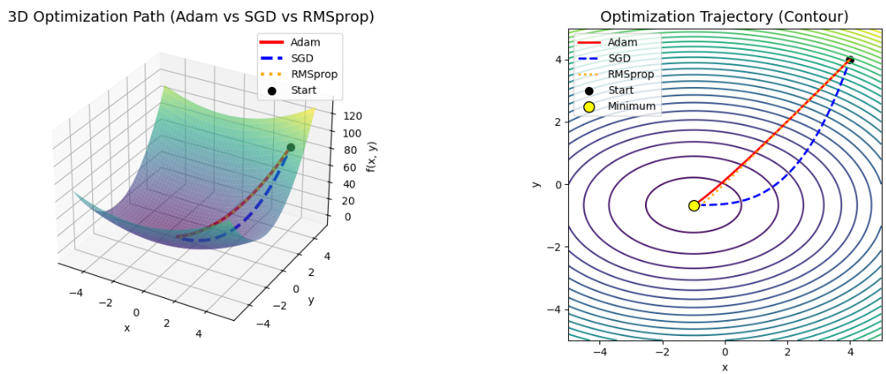

## Optimization

ニューラルネットワークに用いられる最適化アルゴリズムは、主に**勾配降下法（Gradient Descent, GD）**を基盤とし、その**欠点を克服し、より速く、安定して、より良い解へ収束させる**という一貫した目的のもとで進化してきました。

進化の経緯は、データの規模拡大、計算資源の制約、複雑な損失関数の形状（谷の細さ、平坦な領域など）という課題への対策として捉えることができます。


## 最適化アルゴリズムの進化の主要な経緯

最適化アルゴリズムの進化は、大きく以下の3つの段階を経てきました。

### 1. 勾配降下法 (GD) の誕生と課題

| 段階 | アルゴリズム | 開発の経緯と課題 |
| :--- | :--- | :--- |
| **初期** | **バッチ勾配降下法 (Batch GD)** | **数学的基礎:** 勾配（傾き）の逆方向に進めば、必ず関数の値は小さくなるという数学的な原理に基づき、最小値を見つける手法として確立されました。 |
| | | **課題:** パラメータを1回更新するために、**全訓練データセット**の勾配を計算する必要があり、データセットが巨大になると計算コストと時間が膨大になるという大きな問題がありました。 |


### 2. SGDと慣性 (Momentum) の導入

計算効率の課題を解決し、さらに収束を速くするための工夫が導入されました。

| 段階 | アルゴリズム | 開発の経緯と課題 |
| :--- | :--- | :--- |
| **効率化** | **確率的勾配降下法 (Stochastic GD, SGD)** | **経緯:** Batch GDの計算コスト問題を解決するために考案されました。**データセットからランダムに選ばれた少数のデータ（ミニバッチ）**の勾配のみを使って更新することで、計算効率を劇的に向上させました。 |
| | **モーメンタム (Momentum) / Nesterov** | **経緯:** SGDは損失関数の谷底で**振動しやすい**という欠点がありました。物理学の**慣性**の考え方を導入し、前回の更新方向を記憶して現在の勾配に加えることで、振動を抑え、安定した収束を可能にしました。 |


### 3. 適応的学習率 (Adaptive Learning Rate) の登場

SGDは依然として、学習率（$\alpha$）を**手動で調整**する必要があり、またすべてのパラメータに対して**一律の学習率**を適用するため、非効率でした。これを解決するために、パラメータごとに学習率を自動調整する手法が開発されました。

| 段階 | アルゴリズム | 開発の経緯と特徴 |
| :--- | :--- | :--- |
| **適応的学習率** | **AdaGrad** | **経緯:** パラメータごとに、過去の勾配の二乗の和の逆数に比例して学習率を調整する手法。**勾配の変化が少ない（緩やかな）パラメータには大きな学習率**を、**勾配の変化が大きい（急な）パラメータには小さな学習率**を割り当てることを可能にしました。 |
| | **RMSprop** | **経緯:** AdaGradは累積和を使うため、**訓練が進むにつれて学習率が急激にゼロに近づきすぎる**という新たな問題が発生しました。RMSpropは、過去の勾配の累積和の代わりに**指数移動平均**を使うことで、学習率の減衰を緩和し、大規模なデータセットでも長期的に学習できるようにしました。 |
| | **Adam** | **経緯:** RMSpropの**適応的学習率**の利点と、モーメンタムの**慣性（運動量）**の利点を統合することで誕生しました。多くのニューラルネットワークタスクで**高い性能と安定性**を発揮するため、現在最も広く使われているアルゴリズムの一つとなっています。 |


## 年表化
最適化アルゴリズムの開発を年代順に並べました。
このように、最適化アルゴリズムは、**計算効率** → **収束安定性** → **学習率の適応性** という流れで、既存のアルゴリズムの欠点を補い、機能を強化しながら進化してきました。

| 年代 | アルゴリズム | 改善点 |
| :--- | :--- | :--- |
| 1950年代 | **Batch GD** | 数学的基盤 |
| 1960年代 | **SGD** | **計算効率**の改善 (ミニバッチの利用) |
| 1980年代 | **Momentum** | **振動**の抑制と収束の高速化 (慣性) |
| 2011年 | **AdaGrad** | **パラメータごとの学習率**調整 (適応性) |
| 2012年 | **RMSprop** | AdaGradの**学習率の急激な減衰**を抑制 |
| 2014年 | **Adam** | RMSpropの**適応性**とMomentumの**慣性**を統合 |

## 実装

LLM学習の一環で各最適化アルゴリズムをnumpyで実装したうえで、各アルゴリズムの収束性を動画で確認してみました。
実装対象としたものはSGD、RMSprop、Adamです。

代表例としてAdamの実装法について説明します。

### Adam実装
Adam (**Adaptive Moment Estimation**) の実装は、勾配の**指数移動平均 (1次モーメント)**と**勾配の二乗の指数移動平均 (2次モーメント)**を計算し、それらを使って学習率を適応的に調整する点が特徴です。

ご要望に応じて、AdamオプティマイザのPython (`numpy`) による実装コードと、その数式に基づいた詳細な解説を提供します。

__AdamオプティマイザのPython実装__

```python
import numpy as np

class Adam:
    """Adam (Adaptive Moment Estimation) Optimizer"""
    
    def __init__(self, lr=0.001, beta1=0.9, beta2=0.999, eps=1e-8):
        """
        Adamオプティマイザの初期化
        :param lr: 学習率 (Learning Rate, α)
        :param beta1: 1次モーメントの減衰率 (通常 0.9)
        :param beta2: 2次モーメントの減衰率 (通常 0.999)
        :param eps: ゼロ除算を防ぐための微小値 (ε)
        """
        self.lr = lr
        self.beta1 = beta1
        self.beta2 = beta2
        self.eps = eps
        
        # 1次モーメント (勾配の平均, Momentumに相当)
        self.m = None
        # 2次モーメント (勾配の二乗の平均, RMSpropに相当)
        self.v = None
        # イテレーション回数カウンター
        self.t = 0

    def update(self, params, grads):
        """
        パラメータ更新の実行
        :param params: 更新対象のパラメータ（重みやバイアス）
        :param grads: 現在の勾配 (∂L/∂θ)
        :return: 更新されたパラメータ
        """
        # 最初の更新時にモーメント変数を初期化
        if self.m is None:
            self.m = np.zeros_like(params)
        if self.v is None:
            self.v = np.zeros_like(params)

        self.t += 1 # ステップ数をカウントアップ

        # 1. 1次モーメント (m) と 2次モーメント (v) の計算
        # ----------------------------------------------------
        # m: 勾配の指数移動平均 (傾きと方向を滑らかにする)
        self.m = self.beta1 * self.m + (1 - self.beta1) * grads
        # v: 勾配の二乗の指数移動平均 (パラメータごとの学習率を決定)
        self.v = self.beta2 * self.v + (1 - self.beta2) * (grads ** 2)

        # 2. バイアス補正 (Bias Correction)
        # ----------------------------------------------------
        # 初期段階ではm, vがゼロに近い値に偏るため、バイアス補正を行う
        
        # 補正された1次モーメント (m_hat)
        m_hat = self.m / (1 - self.beta1 ** self.t)
        # 補正された2次モーメント (v_hat)
        v_hat = self.v / (1 - self.beta2 ** self.t)

        # 3. パラメータの更新
        # ----------------------------------------------------
        # 更新式: params -= α * m_hat / (sqrt(v_hat) + ε)
        # v_hatの平方根が学習率を割ることで、適応的な学習率が実現される
        params -= self.lr * m_hat / (np.sqrt(v_hat) + self.eps)
        
        return params

# --- 使用例 ---
if __name__ == '__main__':
    # 適当な初期パラメータと勾配を定義
    initial_params = np.array([1.0, 1.0])
    optimizer = Adam(lr=0.01)
    
    current_params = initial_params.copy()
    
    # 複数ステップで更新をシミュレーション
    print(f"初期パラメータ: {current_params}")
    
    # 1ステップ目 (勾配が大きい)
    grads_step1 = np.array([0.5, 2.0]) 
    current_params = optimizer.update(current_params, grads_step1)
    print(f"Step 1 後のパラメータ: {current_params}")
    
    # 2ステップ目 (勾配が小さい)
    grads_step2 = np.array([0.1, 0.05])
    current_params = optimizer.update(current_params, grads_step2)
    print(f"Step 2 後のパラメータ: {current_params}")
```


### Adamの数式と実装の解説

Adamは、以下の4つのステップでパラメータを更新します。

__1\. 1次モーメント $m_t$ の更新 (Momentum項)__

これは勾配 $\boldsymbol{g}_t$ の**指数移動平均**であり、Momentum（慣性）の効果をもたらします。
$$\boldsymbol{m}_t = \beta_1 \boldsymbol{m}_{t-1} + (1 - \beta_1) \boldsymbol{g}_t$$

  * $\boldsymbol{m}_{t-1}$：前回の1次モーメント
  * $\boldsymbol{g}_t$：現在の勾配
  * $\beta_1$：減衰率（通常 0.9）。過去の勾配の寄与度を制御します。

__2\. 2次モーメント $v_t$ の更新 (RMSprop項)__

これは勾配の二乗 $\boldsymbol{g}_t^2$ の**指数移動平均**であり、RMSpropのようにパラメータごとの学習率を調整する基礎となります。
$$\boldsymbol{v}_t = \beta_2 \boldsymbol{v}_{t-1} + (1 - \beta_2) \boldsymbol{g}_t^2$$

  * $\boldsymbol{v}_{t-1}$：前回の2次モーメント
  * $\boldsymbol{g}_t^2$：現在の勾配の二乗（要素ごと）
  * $\beta_2$：減衰率（通常 0.999）。過去の二乗勾配の寄与度を制御します。

__3\. バイアス補正 (Bias Correction)__

$m_t$ と $v_t$ は、特に訓練の**初期段階**でゼロに近い値にバイアス（偏り）がかかってしまうため、以下の補正式を使ってバイアスを解消します。
$$\hat{\boldsymbol{m}}_t = \frac{\boldsymbol{m}_t}{1 - \beta_1^t} \quad \text{and} \quad \hat{\boldsymbol{v}}_t = \frac{\boldsymbol{v}_t}{1 - \beta_2^t}$$

  * $t$：現在のイテレーション回数（ステップ数）

__4\. パラメータの更新__

補正されたモーメント $\hat{\boldsymbol{m}}_t$ と $\hat{\boldsymbol{v}}_t$ を使って、パラメータ $\boldsymbol{\theta}_t$ を更新します。
$$\boldsymbol{\theta}_{t+1} = \boldsymbol{\theta}_t - \frac{\alpha}{\sqrt{\hat{\boldsymbol{v}}_t} + \epsilon} \hat{\boldsymbol{m}}_t$$

  * $\alpha$：初期学習率 (`self.lr`)
  * $\sqrt{\hat{\boldsymbol{v}}_t} + \epsilon$：RMSpropと同様に、これが**適応的な学習率**を制御します。勾配の分散が小さい（安定している）パラメータには大きな更新が、勾配の分散が大きい（不安定な）パラメータには小さな更新が適用されます。


計算結果は以下のように可視化されます。




### SGD
**SGD（Stochastic Gradient Descent / 確率的勾配降下法）**は、ニューラルネットワークの学習で最も基本的な最適化アルゴリズムの一つです。

勾配降下法（Gradient Descent）の一種ですが、「確率的（Stochastic）」という言葉が示す通り、**ランダム性**を利用して、大規模なデータセットでも高速に学習を進めることを可能にします。

__概要と目的__

__1. SGDとは何か？__

SGDは、モデルの**損失（エラー）**を最小化するために、**パラメータ（重み）を更新する**手法です。

* **通常の勾配降下法 (Batch GD):** 1回の更新ごとに**全データセット**を使用して勾配を計算します。非常に正確ですが、データセットが大きいと計算コストが膨大になり、時間がかかります。
* **SGD (確率的勾配降下法):** 1回の更新ごとに**ランダムに選ばれたたった1つのデータサンプル**（あるいは非常に少数のサンプル）の勾配だけを計算します。

__2. なぜSGDを使うのか？__

学習を**高速化**し、**大規模データに対応する**ためです。

データセットが数百万、数十億のサンプルを持つ場合、全体の勾配計算は非現実的です。SGDは、全体のデータ傾向を完全に知らなくても、ランダムなサンプルから「大体こっちが下り坂だろう」と見当をつけ、すぐに一歩踏み出します。

__基本的なアイデア__

通常の勾配降下法（Batch Gradient Descent）が、**すべての訓練データ**を使って勾配（坂道の傾き）を計算し、**一度に正確に**更新するのに対し、SGDは以下の原則に基づいて動作します。

__1. サンプリングによる高速化__

* **「全体を知る必要はない」**という考え方です。全体の勾配は計算コストが非常に高いため、データ全体の中から**ランダムに選んだ少量のサンプル（ミニバッチ）**だけを使って勾配を計算します。
* これにより、1回の更新にかかる時間を大幅に短縮できます。

__2. ノイジーな更新__

* ミニバッチは全体の真の勾配を正確には表していません。そのため、SGDによる更新は**ノイズを含む**不安定なものになります。
* しかし、この不安定さが**山を下る道（損失関数）**をフラフラと進むことで、結果として深層学習で問題となる**局所解（小さな窪み）**に捕まりにくくなるという副次的なメリットも生みます。

__3. 計算効率の最適化__

* 特にデータセットが巨大な場合、全データをメモリに読み込む必要がなくなり、計算リソース（GPUメモリなど）の効率が良くなります。

## ⚙️ 核心となる仕組み

SGDは以下のシンプルな更新式に基づいています。

$$
\theta_{new} = \theta_{old} - \eta \cdot \nabla J_{i}
$$

* $\theta_{new}$: 更新後のパラメータ（重み）
* $\theta_{old}$: 現在のパラメータ（重み）
* $\eta$: 学習率（歩幅）
* $\nabla J_{i}$: **ミニバッチ $i$** で計算された勾配

つまり、SGDの基本的なアイデアは、**「全データセットの損失 $J$ ではなく、ミニバッチ $i$ の損失 $J_i$ の勾配で代替する」**ことによって、学習サイクルを劇的に短縮することなのです。


## 🚶 動作の仕組み (Mini-Batch SGD)

純粋なSGD（サンプル1つのみ）は不安定すぎるため、実用上は**Mini-Batch SGD（ミニバッチ確率的勾配降下法）**が使われます。これが一般的に「SGD」と呼ばれるものです。

### 1. Mini-Batch (小規模な集団)
データセット全体から、例えば32個、64個、128個といった**小さなデータの塊（ミニバッチ）**をランダムに選びます。

### 2. 勾配の計算と更新
1.  **ミニバッチの勾配計算:** 選ばれたミニバッチのみを使って損失と勾配を計算します。
2.  **パラメータの更新:** その勾配を使って、パラメータをすぐに更新します。

### 3. 特徴：ノイジーな山下り
このプロセスを繰り返すことで、以下の特徴が生まれます。

| 特徴 | 説明 | 山下りの例え |
| :--- | :--- | :--- |
| **不安定性 (Noisy)** | 勾配がミニバッチに偏るため、計算される勾配にはノイズが多く含まれます。 | 酔っ払いのようにフラフラと歩く。 |
| **高速性 (Fast)** | 全データを待つ必要がなく、すぐに更新が完了するため、学習全体が速く進みます。 | 立ち止まらずに、どんどん進む。 |
| **局所解からの脱出** | ノイズのおかげで、完璧な谷底（局所解）にハマりそうになっても、ノイズに揺さぶられてそこから抜け出せる可能性があります。 | 小さな穴にハマっても、フラつきながら抜け出せる。 |

SGDはシンプルですが非常に強力なアルゴリズムであり、MomentumやAdamといったより高度な最適化アルゴリズムも、このSGDの概念（ミニバッチでの更新）を土台として発展しています。

### 実装

SGD（確率的勾配降下法）を実装するための考え方と、具体的な関数の最適化、およびその経路の可視化をPythonで行います。
この問題では、SDGの「確率的（Stochastic）」な側面は\*\*「ミニバッチ化」**ではなく、**「単純な数式を勾配降下法で最適化する」\*\*という基本構造に焦点を当てて実装します。

__1\. SGD実装の考え方__

SGD（または純粋な勾配降下法）の基本的な実装は、以下の3つのステップのループから成り立っています。

| ステップ | 目的 | 数学的な操作 |
| :--- | :--- | :--- |
| **① 損失計算** | 現在のパラメータ（$x, y$）における関数の値 $f(x, y)$ を計算する。 | $f(x, y)$ の評価 |
| **② 勾配計算** | パラメータをどの方向に動かせば関数値が最も減るかを示す**勾配**を計算する。 | 偏微分 ($\frac{\partial f}{\partial x}, \frac{\partial f}{\partial y}$) |
| **③ パラメータ更新** | 勾配とは**逆方向**に、**学習率**（歩幅）をかけて、パラメータを少しだけ移動させる。 | $\theta_{new} = \theta_{old} - \eta \cdot \nabla f$ |

このループを繰り返すことで、関数の最小値（谷底）に向かってパラメータが徐々に収束していきます。

__対象の関数と勾配__

最適化対象の関数 $f(x, y)$ は以下の通りです。

$$
f(x, y) = x^2 + 3y^2 + 2x + 4y
$$

この関数を最小化するための勾配（偏微分）は以下のようになります。

| パラメータ | 勾配 ($\nabla f$) | 役割 |
| :--- | :--- | :--- |
| $\frac{\partial f}{\partial x}$ | $2x + 2$ | $x$ 方向の傾き |
| $\frac{\partial f}{\partial y}$ | $6y + 4$ | $y$ 方向の傾き |

では、numPyとmatplotlibを使用してSGDを実装し、最適化の経路を可視化します。

```python
import numpy as np
import matplotlib.pyplot as plt

# 1. 最適化対象の関数
def f(x, y):
    """
    f(x, y) = x^2 + 3*y^2 + 2*x + 4*y
    """
    return x**2 + 3*y**2 + 2*x + 4*y

# 2. 勾配 (偏微分) を計算する関数
def gradient_f(x, y):
    """
    偏微分: df/dx = 2x + 2, df/dy = 6y + 4
    """
    df_dx = 2 * x + 2
    df_dy = 6 * y + 4
    return np.array([df_dx, df_dy])

# --- SGDの実装 ---
def stochastic_gradient_descent(start_point, learning_rate, epochs):
    # パラメータの初期値 (x, y)
    params = np.array(start_point, dtype=float)
    
    # 経路を記録するためのリスト
    history = [params.copy()]
    
    for epoch in range(epochs):
        # 1. 勾配を計算
        grad = gradient_f(params[0], params[1])
        
        # 2. パラメータを更新 (SGDの核となる部分)
        # θ_new = θ_old - η * ∇f
        params -= learning_rate * grad
        
        # 3. 経路を記録
        history.append(params.copy())
        
        # 収束条件 (勾配が非常に小さくなったら停止)
        if np.linalg.norm(grad) < 1e-4:
            print(f"Converged at epoch {epoch+1}")
            break
            
    return np.array(history)

# --- 実行 ---
start_point = [5.0, 3.0] # 開始点 (x=5, y=3)
learning_rate = 0.1      # 学習率 (歩幅)
epochs = 50              # 繰り返し回数

history = stochastic_gradient_descent(start_point, learning_rate, epochs)

# 結果表示
final_x, final_y = history[-1]
final_loss = f(final_x, final_y)
print("\n--- 最適化結果 ---")
print(f"初期値: x={start_point[0]:.4f}, y={start_point[1]:.4f}")
print(f"最終値: x={final_x:.4f}, y={final_y:.4f}")
print(f"最終損失: f(x, y)={final_loss:.4f}")

# 理論的な最小値の確認
# 2x + 2 = 0  => x = -1
# 6y + 4 = 0  => y = -4/6 ≈ -0.6667
# 最小損失: f(-1, -4/6) = -1 - 4/3 ≈ -2.3333
```

上記の実行結果に基づき、パラメータがどのように最小値へ向かって移動したかを2次元プロットで可視化します。

```python
# --- 可視化 ---
# x, y の範囲を定義
x_range = np.linspace(-3, 6, 100)
y_range = np.linspace(-2, 4, 100)
X, Y = np.meshgrid(x_range, y_range)
Z = f(X, Y)

plt.figure(figsize=(10, 7))

# 損失関数の等高線
contour = plt.contourf(X, Y, Z, levels=50, cmap='viridis', alpha=0.6)
plt.colorbar(contour, label='Function Value f(x, y)')

# 最適化の経路をプロット
plt.plot(history[:, 0], history[:, 1], 'r-o', markersize=5, linewidth=2, label='SGD Path')

# 開始点と終了点
plt.plot(history[0, 0], history[0, 1], 'bo', markersize=8, label='Start Point (5, 3)')
plt.plot(history[-1, 0], history[-1, 1], 'go', markersize=8, label='End Point')

# 理論的な最小値 (最適解)
optimal_x = -1
optimal_y = -4/6
plt.plot(optimal_x, optimal_y, 'w*', markersize=12, markeredgecolor='black', label='Optimum (-1, -0.67)')

plt.title('SGD Optimization Path on Function f(x, y)')
plt.xlabel('Parameter x')
plt.ylabel('Parameter y')
plt.legend()
plt.grid(True, alpha=0.3)
plt.show()
```

### 経路の解説

可視化された図では、以下の特徴が確認できます。

1.  **等高線**: 関数の値 $f(x, y)$ が低い場所（谷）ほど色が濃く表示されます。最小値は\*\*白星（$x=-1, y \approx -0.67$）\*\*の位置です。
2.  **初期の大きなステップ**: 開始点（青丸）から、勾配が非常に急なため、最初の数ステップは**大きな歩幅**で最小値の方向に進みます。
3.  **減速と収束**: 最適解に近づくにつれて勾配が緩やかになるため、ステップサイズ（移動距離）は徐々に小さくなります。これは勾配降下法の基本的な特性です。
4.  **$y$ 軸方向の速さ**: この関数では $y$ の項が $3y^2$ となっており、$x^2$ よりも急な傾きを持っています。そのため、最適化の初期段階では、$y$ パラメータの方が**より急速に**最適な位置（$-0.67$）に向かって移動する傾向が見られます。


## Adam

Adam（Adaptive Moment Estimation）は、深層学習で最も広く使われている最適化アルゴリズムの一つです。

前の質問で実装したSGDの基本的な更新ルールに、\*\*「慣性（Momentum）」**と**「適応的な学習率（Adaptive Learning Rate）」\*\*のアイデアを組み込むことで、SGDよりも高速かつ安定して最適化を進めます。

__1\. Adam実装の考え方__

Adamは、SGDのシンプルな更新式を次の2つの要素で改良します。

### 1\. 慣性 (Momentum) の導入 (1次モーメント $\mathbf{m}_t$)

  * **考え方**: 勾配の現在の値だけでなく、\*\*過去の勾配の平均（移動平均）\*\*も考慮して更新方向を決めます。
  * **効果**: 勾配がフラフラしても、平均的な方向へ進み続けるため、**振動を抑制し、加速**します。
  * **イメージ**: 重いボールが谷底に向かって転がるようなイメージです。

### 2\. 適応的な学習率の導入 (2次モーメント $\mathbf{v}_t$)

  * **考え方**: 各パラメータ（$x, y$）ごとに、**過去の勾配の二乗の平均**（勾配の大きさの平均）を記録します。
  * **効果**: 勾配が大きい（坂が急）パラメータには**小さな学習率**を、勾配が小さい（坂が緩やか）パラメータには**大きな学習率**を適用します。
  * **イメージ**: **坂の急さに応じて歩幅を自動調整する**賢い登山家のようなイメージです。

最終的な更新は、この2つの移動平均（$\mathbf{m}_t$ と $\mathbf{v}_t$）を組み合わせることで決定されます。

__2\. 💻 PythonによるAdamの実装と最適化__

SGDと同じ関数 $f(x, y) = x^2 + 3y^2 + 2x + 4y$ をAdamで最適化します。勾配（偏微分）の計算はSGDと同じです。

__Adamの核心的な更新式__

以下の移動平均とバイアス補正を行います。

1.  **1次モーメント ($\mathbf{m}_t$ / 慣性)**: $\mathbf{m}_t = \beta_1 \cdot \mathbf{m}_{t-1} + (1 - \beta_1) \cdot \mathbf{g}_t$
2.  **2次モーメント ($\mathbf{v}_t$ / 勾配の大きさ)**: $\mathbf{v}_t = \beta_2 \cdot \mathbf{v}_{t-1} + (1 - \beta_2) \cdot \mathbf{g}_t^2$
3.  **バイアス補正**: $\hat{\mathbf{m}}_t = \mathbf{m}_t / (1 - \beta_1^t)$, $\hat{\mathbf{v}}_t = \mathbf{v}_t / (1 - \beta_2^t)$
4.  **パラメータ更新**: $\theta_{new} = \theta_{old} - \eta \cdot \frac{\hat{\mathbf{m}}_t}{\sqrt{\hat{\mathbf{v}}_t} + \epsilon}$

<!-- end list -->

```python
import numpy as np
import matplotlib.pyplot as plt

# 1. 最適化対象の関数（SGDと同じ）
def f(x, y):
    return x**2 + 3*y**2 + 2*x + 4*y

# 2. 勾配 (偏微分) を計算する関数（SGDと同じ）
def gradient_f(x, y):
    df_dx = 2 * x + 2
    df_dy = 6 * y + 4
    return np.array([df_dx, df_dy])

# --- Adamの実装 ---
def adam_optimizer(start_point, learning_rate, epochs, beta1=0.9, beta2=0.999, epsilon=1e-8):
    # パラメータの初期値 (x, y)
    params = np.array(start_point, dtype=float)
    
    # 1次モーメント(m)と2次モーメント(v)の初期化
    m = np.zeros_like(params)
    v = np.zeros_like(params)
    
    # 経路を記録するためのリスト
    history = [params.copy()]
    
    for t in range(1, epochs + 1):
        # 1. 勾配を計算
        grad = gradient_f(params[0], params[1])
        
        # 2. 1次モーメント (m) と 2次モーメント (v) の更新
        # m_t = beta1 * m_{t-1} + (1 - beta1) * g_t
        m = beta1 * m + (1 - beta1) * grad
        # v_t = beta2 * v_{t-1} + (1 - beta2) * g_t^2
        v = beta2 * v + (1 - beta2) * (grad**2)
        
        # 3. バイアス補正 (初期のmとvが0に偏る影響を打ち消す)
        # m_hat = m_t / (1 - beta1^t)
        m_hat = m / (1 - beta1**t)
        # v_hat = v_t / (1 - beta2^t)
        v_hat = v / (1 - beta2**t)
        
        # 4. パラメータの更新
        # θ_new = θ_old - η * m_hat / (sqrt(v_hat) + epsilon)
        params -= learning_rate * m_hat / (np.sqrt(v_hat) + epsilon)
        
        # 5. 経路を記録
        history.append(params.copy())
        
        # 収束条件
        if np.linalg.norm(grad) < 1e-4:
            print(f"Converged at epoch {t}")
            break
            
    return np.array(history)

# --- 実行 ---
start_point = [5.0, 3.0] # 開始点 (SGDと同じ)
learning_rate = 0.1      # 学習率 (SGDと同じ)
epochs = 50              # 繰り返し回数

history_adam = adam_optimizer(start_point, learning_rate, epochs)

# 結果表示
final_x, final_y = history_adam[-1]
final_loss = f(final_x, final_y)
print("\n--- Adam最適化結果 ---")
print(f"初期値: x={start_point[0]:.4f}, y={start_point[1]:.4f}")
print(f"最終値: x={final_x:.4f}, y={final_y:.4f}")
print(f"最終損失: f(x, y)={final_loss:.4f}")
```

-----

## 3\. 📊 最適化経路の可視化 (Adam vs. SGD)

Adamの経路をSGDの経路（前回の結果）と比較して可視化することで、その効率性を確認します。

**（注: ここでは、前のSGDの結果 `history` がメモリに残っていると仮定してプロットします。）**

```python
# --- SGDのHistoryを再計算（比較のため） ---
# ※ 前の質問で実行した history が必要です
def stochastic_gradient_descent(start_point, learning_rate, epochs):
    params = np.array(start_point, dtype=float)
    history = [params.copy()]
    for epoch in range(epochs):
        grad = gradient_f(params[0], params[1])
        params -= learning_rate * grad
        history.append(params.copy())
        if np.linalg.norm(grad) < 1e-4:
            break
    return np.array(history)
history_sgd = stochastic_gradient_descent(start_point, learning_rate, epochs)
# ----------------------------------------

# --- 可視化 ---
x_range = np.linspace(-3, 6, 100)
y_range = np.linspace(-2, 4, 100)
X, Y = np.meshgrid(x_range, y_range)
Z = f(X, Y)

plt.figure(figsize=(12, 8))

# 損失関数の等高線
contour = plt.contourf(X, Y, Z, levels=50, cmap='viridis', alpha=0.6)
plt.colorbar(contour, label='Function Value f(x, y)')

# 1. SGDの経路をプロット
plt.plot(history_sgd[:, 0], history_sgd[:, 1], 'b--', alpha=0.5, linewidth=2, label='SGD Path')
plt.plot(history_sgd[::5, 0], history_sgd[::5, 1], 'b^', markersize=5) # 5ステップごとのマーカー

# 2. Adamの経路をプロット
plt.plot(history_adam[:, 0], history_adam[:, 1], 'r-o', markersize=5, linewidth=2, label='Adam Path')
plt.plot(history_adam[::5, 0], history_adam[::5, 1], 'ro', markersize=5) # 5ステップごとのマーカー

# 開始点と理論的な最小値
plt.plot(history_adam[0, 0], history_adam[0, 1], 'ko', markersize=10, label='Start Point')
optimal_x = -1
optimal_y = -4/6
plt.plot(optimal_x, optimal_y, 'w*', markersize=15, markeredgecolor='black', label='Optimum')

plt.title('Optimization Path Comparison: Adam vs. SGD')
plt.xlabel('Parameter x')
plt.ylabel('Parameter y')
plt.legend()
plt.grid(True, alpha=0.3)
plt.axis('equal') # 軸のスケールを均等にして、楕円形を正しく表示
plt.show()
```

### 経路の解説

この可視化では、AdamがSGDに比べていかに効率的かがわかります。

1.  **SGDの経路 (青色の破線)**:
      * $x$ 軸方向と $y$ 軸方向で傾きの急さが異なる（$y$ 方向が急）。
      * そのため、SGDは最適な方向に向かってまっすぐ進めず、**振動しながら**谷底へ向かう傾向があります。
2.  **Adamの経路 (赤色の実線)**:
      * Adamは、各パラメータの勾配の大きさを記録する（2次モーメント $v_t$）ため、**$y$ 軸の傾きが急すぎることを認識**します。
      * その結果、$y$ 軸方向の学習率を相対的に小さくし、$x$ 軸方向に比べて急に進みすぎないように**自動で調整**します。
      * この調整により、Adamは**振動が少なく、より少ないステップ数で**谷底の最小値に到達できる、非常にスムーズな経路をとります。
