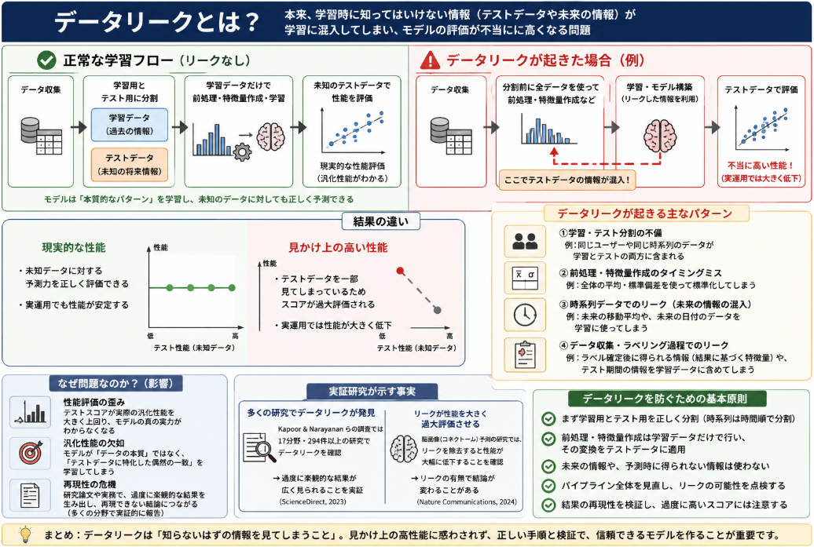

過去LLMやComputer Visionのニューラルネットワークを学習していると、それほど良いデータにもかかわらず、Validationのデータの結果が非常に良い、ということが起こって大喜びしたことがありました。
そんな時に起こっている可能性がある問題として「データリーク（data leakage）」なるものがあります。

## データリークとは

AIの学習におけるデータリークとは、本来は**学習中に知ってはいけない情報（テストデータや未来の情報）が、モデルの学習プロセスに意図せず混入してしまう現象**を指します。

これにより、モデルは「本当に未知のデータを予測する力」ではなく、「すでに答えを知っているデータに過剰に適合する力」を学んでしまい、**実際の運用では性能が大きく低下する**という問題が起きます。

### データリークが起きる典型的なパターン

1. **学習データとテストデータの分離が不十分な場合**
   - 本来は「学習用データ」と「性能評価用のテストデータ」を完全に分ける必要があります。
   - しかし、例えば：
     - データのシャッフル後に学習・テスト分割をしてしまい、同じユーザーや同じ時系列の一部が両方に含まれてしまう
     - クロスバリデーションで、分割の境界が正しく設定されず、情報が漏れる
   - こうした場合、モデルは「テストデータの一部を学習中に見てしまっている」状態になります。

2. **特徴量エンジニアリングや前処理のタイミングが不適切な場合**
   - 例：**全体の統計量（平均・標準偏差など）を計算してから**学習・テストに分割する
     - 本来、テストデータの情報は「未来の情報」として扱うべきですが、全体統計に含めてしまうと、学習時に「テスト側の分布」を間接的に知ってしまうことになります。
   - 正しくは「学習データだけで統計量を計算し、その変換をテストデータに適用する」必要があります。

3. **時系列データでのリーク**
   - 時系列予測（株価、売上など）で、**未来の情報が過去の学習に使われてしまう**ケースです。
   - 例：
     - 未来の価格の移動平均を特徴量として使ってしまう
     - 日付順に並べずにランダム分割し、未来の日付のデータを学習に使ってしまう
   - これにより、モデルは「未来を知ってから過去を予測する」という不自然な学習をしてしまいます。

4. **データ収集・ラベリングの過程でのリーク**
   - 例：医療データで「検査結果が確定した後に、その結果に基づいて別の特徴量が追加される」場合、その追加情報は本来は「未来のラベルに依存した情報」であり、学習に使うとリークになります。
   - あるいは、Webスクレイピングで「テスト期間の情報を含むページ」を誤って学習データに含めてしまう、など。

### 研究

実はデータリークをテーマにした、あるいはデータリークを中心に分析した研究論文が存在します。
それだけ問題が根深いものなのだ、ととらえてもらえればと思います。
以下に、代表的なものをいくつか挙げます。

__1. データリークの影響と「再現性の危機」を分析したレビュー・実証研究__

**Leakage and the reproducibility crisis in machine-learning-based science**  
- Kapoor & Narayanan らによる、機械学習を用いた科学論文におけるデータリークの影響を広く調査した論文です。  
- 17分野・294件以上の研究でデータリークが確認され、過度に楽観的な結果を生んでいることを示しています。  
- データリークのタイプ（前処理のミス、時系列リーク、不適切な特徴量など）を分類し、再現性の危機との関係を論じています。  
- [ScienceDirect](https://www.sciencedirect.com/science/article/pii/S2666389923001599)

**Leakage and the Reproducibility Crisis in ML-based Science（プロジェクトページ）**  
- 上記論文に関連するプロジェクトサイトで、リークの具体例や分野別のケーススタディが整理されています。  
- [Princeton Reproducibility Project](https://reproducible.cs.princeton.edu)

__2. データリークの検出・測定に関する技術的論文__

**Measuring Data Leakage in Machine-Learning Models with Fisher Information**  
- Meta（Facebook）の研究チームによる論文で、**Fisher情報量**を用いて「モデルが訓練データの情報をどれだけ漏らしているか」を定量的に測定する枠組みを提案しています。  
- プライバシー（訓練データの推測可能性）とデータリークの観点から、モデルが保持する情報量を評価する研究です。  
- [Meta Research](https://research.facebook.com/publications/measuring-data-leakage-in-machine-learning-models-with-fisher-information)

**Data leakage detection in machine learning code: transfer learning, active learning, or low-shot prompting?**  
- Pythonの機械学習コードにおけるデータリークを自動検出する手法を比較した研究です。  
- 1,904件のコードサンプルからなるデータセットを構築し、転移学習・能動学習・低ショットプロンプトなどの手法でリークを検出する性能を比較しています。  
- [PMC](https://pmc.ncbi.nlm.nih.gov/articles/PMC11935776)

__3. データリークのリスクや事例を整理した論文__

**Don't Push the Button! Exploring Data Leakage Risks in Machine Learning**（arXivプレプリント）  
- 機械学習パイプラインにおけるデータリークのリスクを体系的に整理し、どのような操作（ボタン＝処理ステップ）がリークを引き起こしやすいかを分析しています。  
- 実務的な観点から、どの段階でリークが発生しやすいか、どう防ぐかを議論しています。  
- [arXiv](https://arxiv.org/abs/2401.13796)

**Data leakage inflates prediction performance in connectome-based prediction**  
- 脳画像（コネクトーム）を用いた予測タスクにおいて、特徴選択や被験者の重複などによるデータリークが、予測性能をどれだけ過大評価させるかを実証した論文です。  
- 特定ドメイン（神経科学）におけるリークの影響を詳細に分析しています。  
- [Nature Communications](https://www.nature.com/articles/s41467-024-46150-w)

__4. 教育・ケーススタディとしてのデータリーク研究__

**Learning from Irreproducibility: Introducing Data Leakage Case Studies for Machine Learning Education**  
- データリークの具体的なケーススタディを教材として提供し、機械学習教育にどう組み込むかを提案する論文です。  
- 実例を通じて、どのようなミスがリークを引き起こすのかを学べるように設計されています。  
- [NSF Public Access Repository](https://par.nsf.gov/biblio/10636853-learning-from-irreproducibility-introducing-data-leakage-case-studies-machine-learning-education)

__5. サーベイ・総説的な位置づけの論文__

**Survey on Data Leakage Prevention through Machine Learning ...**  
- データリークの防止・軽減に関する既存研究をレビューし、機械学習を用いたリーク検出・防止の枠組みを整理するサーベイ論文です。  
- ただしタイトルから分かるように、こちらは「機密情報の漏洩防止（Data Leakage Prevention, DLP）」に近い文脈も含んでおり、**セキュリティ側のデータ漏洩**と**機械学習側のデータリーク**の両方に触れている可能性があります。  
- [IEEE Xplore](https://ieeexplore.ieee.org/document/9752047)

## データリーク問題の本質

データリーク（data leakage）がなぜ問題なのかを、以下の観点から詳しく説明します。

1. データリークの定義と本質的な問題  
2. 実証研究で示された「再現性の危機」との関係  
3. 具体的なリークパターンとその影響  
4. 実務・研究現場でのリスク  
5. 対策の考え方（引用を交えつつ）

### 1. データリークの定義と本質的な問題

**データリーク**とは、機械学習モデルの学習過程において、**本来は利用すべきでない情報（テストデータや未来の情報）が、意図せず学習側に混入してしまう現象**を指します[IBM](https://www.ibm.com/think/topics/data-leakage-machine-learning)。

IBMの解説では、データリークは

> 「モデルが、予測時には利用できない情報を学習中に使ってしまうこと」

と定義され、これにより**過学習（overfitting）**が起こり、**訓練時には高精度に見えるが、実運用では性能が大きく低下する**と指摘されています[IBM](https://www.ibm.com/think/topics/data-leakage-machine-learning)。

**本質的な問題**は、以下の2点に集約されます。

- **性能評価の歪み**：テストスコアが実際の汎化性能を大きく上回り、モデルの真の実力がわからなくなる。
- **汎化性能の欠如**：モデルが「データの本質的なパターン」ではなく、「テストデータに特化した偶然の一致」を学習してしまう。

### 2. 実証研究で示された「再現性の危機」との関係

データリークは単なる実務上のミスではなく、**科学論文の再現性を損なう重大な要因**として学術的に問題視されています。

__Kapoor & Narayanan らのレビュー・実証研究__

Kapoor & Narayanan らは、機械学習を用いた科学論文を広く調査し、**データリークが少なくとも294件の研究、17分野にわたって確認された**と報告しています[ScienceDirect](https://www.sciencedirect.com/science/article/pii/S2666389923001599)。

彼らは、データリークが

- 前処理のミス（訓練・テストを分ける前に全体で標準化するなど）
- 不適切な特徴量（予測時には得られない情報）
- 時系列リーク（未来の情報を過去の学習に使う）

といった形で頻発し、**過度に楽観的な結果（overoptimistic findings）** を生み出していると指摘しています[ScienceDirect](https://www.sciencedirect.com/science/article/pii/S2666389923001599)。

この論文のプロジェクトページでは、分野別にリークの具体例が整理されており、  
「リークが科学的主張の根拠を揺るがしている」ことが強調されています[Princeton Reproducibility Project](https://reproducible.cs.princeton.edu)。

__脳画像（コネクトーム）予測における実証例__

Nature Communications に掲載された研究では、脳画像を用いた予測タスクにおいて、

- 特徴選択
- 被験者の重複

といった形でのデータリークが、**予測性能を大きく過大評価させる**ことが示されています[Nature Communications](https://www.nature.com/articles/s41467-024-46150-w)。

この論文では、リークの有無によって性能が大きく変動し、**リークを除去すると、実質的な予測性能が大幅に低下する**ことが報告されています[Nature Communications](https://www.nature.com/articles/s41467-024-46150-w)。

### 3. 具体的なリークパターンとその影響

__(1) 訓練・テスト分割のミス__

- ランダムシャッフル後に分割する際、同じユーザーや同じ時系列の一部が訓練・テストの両方に含まれてしまう。
- クロスバリデーションで、分割境界が適切でなく、情報が漏れる。

**影響**：  
モデルは「テストデータの一部を学習中に見てしまっている」ため、テストスコアが不当に高くなります。  
Kapoor & Narayanan らは、こうした「train-test separation の違反」が、MLベースの科学論文で頻繁に見られるエラーであると指摘しています[Princeton Reproducibility Project](https://reproducible.cs.princeton.edu)。

__(2) 前処理の順序ミス__

- 全体データで平均・分散を計算してから訓練・テストに分割する。
- 欠損値補完や特徴量生成を、訓練・テストを分ける前に行う。

**影響**：  
テストデータの分布情報が訓練側に漏れ、モデルは「テスト側の統計量を間接的に知った状態」で学習します。  
IBMの解説でも、**「予測時には利用できない情報を学習に使う」**ことがリークの本質であり、これが過学習を招くとされています[IBM](https://www.ibm.com/think/topics/data-leakage-machine-learning)。

__(3) 時系列リーク（temporal leakage）__

- 未来の情報（将来の価格、将来の売上など）を特徴量として使う。
- 日付順に並べずにランダム分割し、未来のデータを過去の学習に使う。

**影響**：  
モデルは「未来を知ってから過去を予測する」という不自然な学習をしてしまい、実運用では未来の情報が得られないため性能が大きく低下します。  
Kapoor & Narayanan らは、こうした**temporal leakage**が多くの時系列分析論文で見られると報告しています[ScienceDirect](https://www.sciencedirect.com/science/article/pii/S2666389923001599)。

__(4) 不適切な特徴量（illegitimate features）__

- ラベルが確定した後にしか得られない情報（例：診断確定後の追加検査結果）を特徴量として使う。
- ターゲット変数そのもの、またはそれに極めて近い情報を特徴量に含めてしまう。

**影響**：  
モデルは「答えに直結する情報」を学習してしまい、実運用ではその情報が得られないため、予測が成立しません。  
Princetonのプロジェクトでは、こうした**illegitimate features**がリークの主要な原因の一つとして挙げられています[Princeton Reproducibility Project](https://reproducible.cs.princeton.edu)。

### 4. 実務・研究現場でのリスク

__(1) 実運用での性能低下とビジネスリスク__

IBMの解説では、データリークにより

> 「訓練・検証データでは非常に良い性能を示すが、本番環境では性能が大きく低下する」

と指摘されています[IBM](https://www.ibm.com/think/topics/data-leakage-machine-learning)。

これは、例えば以下のようなリスクにつながります。

- 金融：与信モデルが実運用で不良債権を大きく見逃す。
- 医療：診断支援モデルが実験環境では高精度に見えるが、実際の患者データでは誤判定が多発する。
- マーケティング：チャーン予測モデルが、実顧客ではほとんど役に立たない。

__(2) 科学的主張の信頼性低下__

Kapoor & Narayanan らは、データリークが

> 「MLモデルの性能を科学的証拠として用いる際に、その主張を根底から揺るがす」

と述べています[ScienceDirect](https://www.sciencedirect.com/science/article/pii/S2666389923001599)。

具体的には、

- 「この脳画像特徴から性格を高精度に予測できる」と主張した論文が、実際にはリークによる過大評価だった
- 「ある遺伝子パターンから疾患リスクを高精度に予測できる」と主張したが、再現実験で性能が大きく低下した

といったケースが報告されています[Princeton Reproducibility Project](https://reproducible.cs.princeton.edu)。

__(3) コードレベルでのリークの蔓延__

PMCに掲載された研究では、Pythonの機械学習コードにおけるデータリークを自動検出する手法が検討されています[PMC](https://pmc.ncbi.nlm.nih.gov/articles/PMC11935776)。

この論文は、

- 1,904件のMLコードサンプルからなるデータセットを構築
- 転移学習・能動学習・低ショットプロンプトなどの手法でリーク検出を試みる

ことを報告しており、**コードレベルでのリークが無視できない規模で存在する**ことを示唆しています[PMC](https://pmc.ncbi.nlm.nih.gov/articles/PMC11935776)。

## 対策法

以下では、**データリークの問題の本質**と**代表的なリークタイプ**に対応する形で、対策を整理します。

### 対策の大枠

- **学習・予測の分離（train-test separation）を徹底する**  
  Kapoor & Narayanan らは、リークの多くが「学習と予測の分離違反」に起因するとし、この分離を徹底することを強く推奨しています[ScienceDirect](https://www.sciencedirect.com/science/article/pii/S2666389923001599)。

- **前処理パラメータは訓練データだけで決め、テストには適用のみ行う**  
  IBMも同様に、訓練データとテストデータを混在させず、前処理ステップを適切に分離する重要性を強調しています[IBM](https://www.ibm.com/think/topics/data-leakage-machine-learning)。

### 1. 訓練・テスト分割ミスに対する対策

__問題の本質__
- 同じユーザーや同じ時系列の一部が訓練・テストの両方に含まれる。
- クロスバリデーションで分割境界が不適切で、情報が漏れる。
- 結果として、モデルが「テストデータの一部を学習中に見てしまっている」状態になる。

__対策__

__(1) データ分割のルールを厳格に定義する__
- **ユーザー単位・時系列単位で分割**する（例：ユーザーIDごとに訓練・テストに振り分ける）。
- 時系列データでは、**時間順に分割**（過去を訓練、未来をテスト）する。
- Kapoor & Narayanan らは、**train-test separation の違反**がリークの主要因であると指摘しています[Princeton Reproducibility Project](https://reproducible.cs.princeton.edu)。

__(2) クロスバリデーションの設計を慎重に行う__
- 時系列データでは **TimeSeriesSplit** などの時間を考慮した分割を使う。
- グループ化されたデータ（同じ患者の複数回測定など）では **GroupKFold** などを使い、同じグループが訓練・テストの両方に現れないようにする。

__(3) 分割の一貫性をコードで強制する__
- 乱数シードを固定し、分割処理を関数化して再利用可能にする。
- 分割前後のデータサイズ・ユニークID数などをログに残し、リークの有無を後から検証できるようにする。

### 2. 前処理の順序ミスに対する対策

__問題の本質__
- 全体データで平均・分散を計算してから訓練・テストに分割する。
- 欠損値補完や特徴量生成を、訓練・テストを分ける前に行う。
- 結果として、テストデータの分布情報が訓練側に漏れる。

__対策__

__(1) 前処理を「学習フェーズ」と「推論フェーズ」に分離する__
- **訓練データだけで前処理パラメータ（平均・標準偏差・最小最大値など）を計算**し、そのパラメータをテストデータに適用する。
- scikit-learn の `Pipeline` や `ColumnTransformer` を使い、**前処理も含めてクロスバリデーションに組み込む**ことで、各フォールドで訓練データのみからパラメータを推定させる。

IBMは、**「訓練データとテストデータを混在させないこと、および前処理ステップを適切に分離すること」** がリーク防止の鍵であると述べています[IBM](https://www.ibm.com/think/topics/data-leakage-machine-learning)。

__(2) 特徴量生成のタイミングを明確にする__
- 特徴量生成（例：カテゴリ変数のターゲットエンコーディング、テキストのTF-IDFなど）も、**訓練データだけで統計量を計算**し、それをテストに適用する。
- 時系列特徴量（移動平均など）は、**過去の情報のみを使って計算**する（後述の時系列リーク対策と連動）。

__(3) 前処理パイプラインの単体テストを行う__
- 訓練データとテストデータを別々に前処理し、**テストデータ側で「未来の情報」が使われていないか**をチェックする。
- 例えば、テストデータの最小値が訓練データの最小値より小さい場合、リークの可能性を疑う（正規化ミスなど）。

### 3. 時系列リーク（temporal leakage）に対する対策

__問題の本質__
- 未来の情報（将来の価格、将来の売上など）を特徴量として使う。
- 日付順に並べずにランダム分割し、未来のデータを過去の学習に使う。
- モデルが「未来を知ってから過去を予測する」という不自然な学習をする。

__対策__

__(1) 時間順の分割を徹底する__
- データを**時間順にソート**し、**過去80%を訓練、直近20%をテスト**といった形で分割する。
- Kapoor & Narayanan らは、**temporal leakage**が多くの時系列分析論文で見られると報告し、時間順の分割の重要性を強調しています[ScienceDirect](https://www.sciencedirect.com/science/article/pii/S2666389923001599)。

__(2) 特徴量設計で「未来の情報」を排除する__
- 移動平均や移動標準偏差を計算する際、**未来の値を含めない**（例：当日を含む直近N日ではなく、当日以前のN日のみを使用）。
- ラグ特徴量（lag features）を使う場合は、**t時点のラベルを予測するのに、t-1, t-2, … の特徴量のみを使う**ように設計する。

__(3) 時系列クロスバリデーション（Time Series Cross-Validation）の利用__
- `TimeSeriesSplit` など、時間の流れを尊重したクロスバリデーション手法を用いる。
- 各フォールドで「過去＝訓練、未来＝検証」となるように分割し、リークを防ぐ。

### 4. 不適切な特徴量（illegitimate features）に対する対策

__問題の本質__
- ラベルが確定した後にしか得られない情報（診断確定後の追加検査結果など）を特徴量として使う。
- ターゲット変数そのもの、またはそれに極めて近い情報を特徴量に含めてしまう。
- モデルが「答えに直結する情報」を学習し、実運用ではその情報が得られないため予測が成立しない。

__対策__

__(1) 特徴量の「入手可能タイミング」をドメイン知識で確認する__
- 医療データであれば、「この検査結果は診断確定前に得られるか？」を専門家と確認する。
- 金融データであれば、「この情報は取引時点で実際に利用可能か？」を確認する。

Kapoor & Narayanan らは、**illegitimate features**がリークの主要な原因の一つであると指摘し、特徴量の妥当性チェックの重要性を強調しています[Princeton Reproducibility Project](https://reproducible.cs.princeton.edu)。

__(2) ターゲットリークの検出__
- 特徴量とターゲットの相関が異常に高い場合、**ターゲットそのものやその派生情報が混入していないか**を疑う。
- 特徴量を1つずつ除外して性能変化を見る（アブレーションスタディ）ことで、リークの原因となる特徴量を特定する。

__(3) 特徴量重要度の解釈__
- モデルが「意味のないはずの特徴量」を異常に重視している場合、リークの可能性を疑う。
- 例えば、患者IDや日付そのものが高い重要度を持つ場合、それらがラベルと偶然強く相関している可能性がある。

### 5. 性能評価の歪み・汎化性能欠如に対する総合的な対策

__(1) 外部テストセットの確保__
- 学習・検証に一切使わない**完全に独立したテストセット**を確保する。
- 可能であれば、**時間的に未来のデータ**や**別のデータソース**からテストセットを用意し、実運用に近い条件で評価する。

__(2) リーク検出のための簡易テスト__
- **ラベルをシャッフルしたデータ**でモデルを学習・評価し、性能がほぼランダムレベルに落ちるか確認する。  
  もし高い性能が出る場合は、リークやデータの構造的問題を疑う。
- 特徴量をランダムにシャッフルし、モデルが依然として高い性能を示すかどうかを確認する。

__(3) コードレベルでのリーク検出・教育__

PMCの論文では、Pythonの機械学習コードにおけるデータリークを自動検出する手法が検討されており、**コードレベルでのリーク検出の自動化**が提案されています[PMC](https://pmc.ncbi.nlm.nih.gov/articles/PMC11935776)。

また、NSFの論文では、**データリークのケーススタディを教材として提供し、ML教育に組み込むこと**が提案されており、教育を通じたリーク防止の重要性が強調されています[NSF PAR](https://par.nsf.gov/biblio/10636853-learning-from-irreproducibility-introducing-data-leakage-case-studies-machine-learning-education)。

__(4) ドキュメントとレビューの徹底__
- データ分割ルール・前処理順序・特徴量の入手可能タイミングを**設計書やコードコメントに明記**する。
- チーム内で**コードレビュー**を行い、リークの疑わしい箇所（全体統計の計算後に分割、未来情報の使用など）をチェックする。

## まとめ：問題の本質・タイプと対策の対応表

| 問題の本質・タイプ | 対策の要点 |
|--------------------|------------|
| **性能評価の歪み**（テストスコアが過大） | ・独立した外部テストセットの確保 ・ラベルシャッフルなどの簡易リーク検出テスト |
| **汎化性能の欠如**（本番で性能低下） | ・学習・予測の分離の徹底（train-test separation） ・前処理パラメータを訓練データだけで決定 |
| **訓練・テスト分割ミス** | ・ユーザー単位・時系列単位での分割 ・GroupKFold / TimeSeriesSplit の利用 ・分割処理の関数化とログ取得 |
| **前処理の順序ミス** | ・前処理をPipelineに組み込み、訓練データのみからパラメータ推定 ・特徴量生成も訓練データだけで統計量を計算 |
| **時系列リーク** | ・時間順の分割（過去＝訓練、未来＝テスト） ・未来の情報を含まない特徴量設計 ・TimeSeriesSplit などの時系列対応CV |
| **不適切な特徴量**（illegitimate features） | ・ドメイン知識に基づく「入手可能タイミング」の確認 ・ターゲットリークの検出（相関・アブレーション） ・特徴量重要度の解釈 |

**データリークの問題の本質（性能評価の歪みと汎化性能の欠如）**と**具体的なリークタイプ**のそれぞれに対応する形で、設計・実装・検証の各段階で対策を講じることが重要です。

ということで著者も過去やらかして痛い痛い目にあったデータリークについてまとめてみました。
ご参考になれば幸いです。

