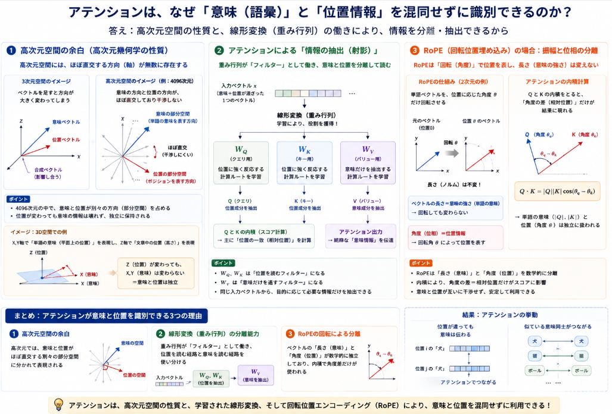

LLMには[位置エンコーダ](https://yoshishinnze.hatenablog.com/entry/2025/11/13/000000)なるものが埋め込まれています。
位置エンコーダはLLMが文章のどこに、何があったかを知る上で重要な位置を提供するという役割を持ちます。
本日はそんな位置エンコーダの手法について詳細を説明しようと思います。

## 位置エンコーダ

詳細は以下の記事をご参考下さい。

https://yoshishinnze.hatenablog.com/entry/2025/11/13/000000

Transformerにおけるアテンション機構（Self-Attention）は、本質的には単語（トークン）を並べた「集合」として処理します。そのため、位置エンコーディングを入れないと「犬が人を噛んだ」と「人が犬を噛んだ」を完全に同じ文章として認識してしまうという欠点があります。

位置エンコーダが「文章の位置」をモデルに伝えられる仕組みを、大きく3つのアプローチ（加算型・バイアス型・回転型）に分けて分かりやすく解説します。

### 1. 加算型（絶対位置）: 「位置のスタンプ」を足し合わせる

初期のTransformer（Sinusoidal）やGPT-2などで使われた最もシンプルな仕組みです。

__仕組み__

1. 単語の意味を表す「単語ベクトル」を用意します。
2. 位置（1番目、2番目…）ごとにユニークな数値パターンを持つ「位置ベクトル」（スタンプのようなもの）を作ります。
3. これらを要素ごとに単純に加算（足し算）します。

$$\text{入力ベクトル} = \text{Word Embedding} + \text{Positional Embedding}$$

__なぜこれで位置が分かるのか？__

ベクトル空間において、意味のベクトルに「位置固有の方向・長さを持つベクトル」が足されることで、元のベクトルの位置情報が少しだけシフト（移動）します。

モデル内の多層パーセプトロン（FFN）やアテンション機構は、この「シフトした座標」を読み取ることで、「この『犬』という単語は文頭の『犬』だな」と判断できるようになります。

> **比喩**:
> 「リンゴ」という言葉に、1番目の席なら「赤色のシール」、2番目の席なら「青色のシール」を貼って渡すようなイメージです。

### 2. バイアス型（相対位置）: 「トークン同士の間隔」を計算に直接挟む

ALiBiやT5などで使われている仕組みで、絶対的な場所（何文字目か）ではなく「自分から見て相手が何文字離れているか」に着目します。

__仕組み__

アテンション機構では、単語間の関連度を計算するために Query（検索側）と Key（インデックス側）の内積をとって「関連度スコア」を算出します。

この計算結果に対し、「距離が離れれば離れるほどスコアを差し引くペナルティ（バイアス）」を強制的に加算します。

$$\text{Attention Score} = (Q \times K^T) - \text{距離に応じたペナルティ}$$

__なぜこれで位置が分かるのか？__

例えばALiBiでは、1文字離れた単語には $-1$、2文字離れた単語には $-2$ というように、距離に比例したマイナス値をかけます。

これにより、モデルは絶対的な番号を覚える必要がなく、「直前の単語（距離1）には強く注目し、遥か昔の単語（距離100）には注目を弱める」という相対的な距離感を直接学習・処理できます。

### 3. 回転型（RoPE）: ベクトルを「角度」で回転させる

現在最も主流（LLaMAやQwenなど）のRoPE（Rotary Position Embedding）は、巧みな数学的仕組みを持っています。

__仕組み__

トークンのベクトル（QueryとKey）を2次元ごとにペアにして複素平面（グラフ）の上に置き、**「そのトークンの位置番号 $m$ に応じた角度 $\theta$」だけ回転**させます。

* 1番目のトークン $\rightarrow$ $1 \times \theta$ だけ回転
* 2番目のトークン $\rightarrow$ $2 \times \theta$ だけ回転
* $m$ 番目のトークン $\rightarrow$ $m \times \theta$ だけ回転

__なぜこれで位置が分かるのか？__

回転させた Query（位置 $m$）と Key（位置 $n$）の内積（関連度）を計算すると、数学的性質（三角関数の加法定理）により、計算結果に「$m - n$」（2つのトークンの相対的な距離）だけが残る仕組みになっています。

1. **絶対位置の表現**: 各ベクトルは自身の位置に応じた角度で回転している。
2. **相対位置の抽出**: 内積をとった瞬間に、お互いの「角度の差（距離）」だけが浮き出る。

この「絶対位置を付与しつつ、アテンション計算時に自動的に相対位置に変換される」という数学的トリックによって、正確な位置関係を把握しています。

いずれの手法も**アテンション機構が、各トークンに埋め込まれた『位置のシフト（ズレ）』を読み取る（計算する）ことで、単語同士の相対的な距離感や前後関係を把握**しているといことが言えます。

## アテンションがシフトを読み取れる理由

前節の主張に対して、**アテンション機構はなぜ「単語の意味情報（語彙）」と「位置情報」が同じ1つのベクトル（例: 4096次元の数値の列）の中に混ざっているのに、なぜ混同せずに識別できる**のかということが疑問となってくると思います。

その理由は、大きく分けて「高次元空間の性質」「直交性（直交部分空間）」「アテンションの線形変換」という3つの数学的・構造的メカニズムに基づいています。

### 1. 高次元空間の余白（高次元幾何学の性質）

LLMが扱うベクトル空間は、4096次元や8192次元といった**非常に巨大な高次元空間**です。

3次元空間（私たちの住む世界）では、ベクトル（矢印）を加算すると元の矢印が大きく傾いてしまい、意味が変わってしまいそうに思えます。しかし、高次元空間には以下のような特質があります。

* **ほぼ直交する方向（軸）が無限に存在する**
* 次元数が高くなると、ランダムに選んだ2つのベクトル同士が「互いに直交（角度が90度＝干渉しない）」する確率が飛躍的に高まります。

* **意味の空間と位置の空間の分離**
* 4096次元のうち、「単語の意味（概念）」を表現するのに使われる実質的な空間（多様体）と、「位置」を表現するのに使われる空間が、高次元空間の中で干渉しない別々の方向（部分空間）に割り当てられます。


> **イメージ**:
> 3D空間（X, Y, Z軸）において、X軸とY軸で「単語の意味（平面上の位置）」を表現し、Z軸で「文章の中の位置（高さ）」を表現するようなものです。Z軸（高さ）がどれだけ変わっても、X, Y軸（意味の平面座標）の値には影響しません。

### 2. アテンションによる「情報の抽出（射影）」

単語ベクトルと位置ベクトルが加算されて「1つのベクトル」になっても、モデル内のLinear層（重み行列 $W_Q, W_K, W_V$）がそれらをきれいに分離して読み取ります。

アテンション機構では、入力ベクトル $x$ に対して重み行列を掛け算して Query（$Q$）、Key（$K$）、Value（$V$）を作ります。

$$Q = W_Q \cdot x, \quad K = W_K \cdot x, \quad V = W_V \cdot x$$

学習が進むと、重み行列 $W$ は次のように役割分担（基底の変換）を獲得します。

* **$W_Q$ や $W_K$（スコア計算用）**: 入力ベクトルのうち、**「位置成分（角度やシフト）」に強く反応する計算ルート**を形成する。
* **$W_V$（意味の伝達用）**: 入力ベクトルのうち、**「純粋な単語の意味成分」だけを抽出する計算ルート**を形成する。

つまり、重み行列という「言語の光学フィルター」を通すことで、1つのベクトルの中に混ざった情報から「位置だけを取り出すルート」と「意味だけを取り出すルート」に分光・分解しているのです。

### 3. 回転（RoPE）の場合：振幅と位相（角度）の完全分離

RoPE（Rotary Position Embedding）のような現代の手法では、数学的により明確に独立性が保たれています。

RoPEは、ベクトルの「ノルム（長さ＝単語の意味の強さ）」を変更せず、「位相（角度＝位置）」だけを回転させます。

* **単語の意味**: ベクトルの各成分の相対的な大きさ（長さや方向）に保持される。
* **位置情報**: ベクトルがどれだけ「回転しているか（角度）」に保持される。

アテンションの内積計算（$Q \cdot K^T$）を行うと、三角関数の性質によって「角度の差（相対位置）」だけがスカラー値として計算結果に現れます。単語の意味（ベクトルの大きさ）と位置（回転角）が数学的な変数として独立しているため、相互に打ち消し合ったり破壊し合ったりすることがありません。



## 位置エンコーダ従来手法

位置エンコーダはLLMの従来手法について説明します。

手法の進化に合わせて、主に**絶対位置**、**相対位置**、**回転・ハイブリッド型**、および位置埋め込みなし（NoPE）の4つの分類で整理できます。

### 1. 絶対位置エンコーディング (Absolute Positional Encoding: APE)

トークンの絶対的な位置（1番目、2番目…）に応じて固定のベクトルを生成し、入力のトークン埋め込みに**加算**する手法です。

* **Sinusoidal Positional Encoding**
* **概要**: 周期の異なる三角関数（sine / cosine）を用いて位置ベクトルを決定的に計算する方式（初代Transformer論文『Attention Is All You Need』で採用）。
* **特徴**: 学習パラメータが不要で直感的ですが、コンテキスト長の拡張（外挿）性能には限界があります。


* **Learned Absolute Positional Embedding**
* **概要**: 位置ごとの埋め込みベクトルを学習可能なパラメータとして扱う方式（BERT, GPT-2, GPT-3等で採用）。
* **特徴**: 表現力は高いものの、事前学習で設定した最大の系列長（例: 2048トークン）を超える未知の長さを扱うことができません。


### 2. 相対位置エンコーディング (Relative Positional Encoding: RPE)

絶対位置ではなく、トークン同士の「相対的な距離」（例: 2つ前の単語、3つ後の単語）に着目してアテンション計算に組み込む手法です。

* **Relative Positional Bias (T5型)**
* **概要**: 相対距離（$i - j$）に応じたスカラー値のバイアスをアテンションスコア（$QK^T$）に加算します。
* **特徴**: 対数スケールなどでビン化（Bucket）して長距離の距離表現を効率化しています。


* **ALiBi (Attention with Linear Biases)**
* **概要**: 位置埋め込みベクトル自体を廃止し、アテンション行列に対して「遠く離れたトークンほど直線的（リニア）にペナルティを与える」固定バイアスを加算します。
* **特徴**: 非常に強力な外挿（Extrapolation）性能を持ち、学習時より長い文脈を推論時にそのまま処理できます（MPTやBloom等で利用）。


### 3. 回転位置エンコーディング (Rotary Position Embedding: RoPE) とその拡張

現在（LLaMAシリーズ、Qwen、Mistralなど）の主流モデルで圧倒的に採用されている方式です。

* **RoPE (Rotary Position Embedding)**
* **原理**: トークン埋め込みにベクトルを加算するのではなく、Query（$Q$）およびKey（$K$）のベクトルを複素平面上の角度として**回転移動**させます。
* **特徴**: 内積をとることで自動的に「相対位置」が導出される優れた数学的性質を持ちます。絶対位置の表現力を維持しつつ、相対位置の情報も扱えます。


* **RoPEのコンテキスト拡張技術（YaRN / NTK-aware / SuPE）**
* **概要**: RoPEの回転角度の基底周波数を調整・補間することで、学習時の文脈長（例: 4kトークン）を推論時に128k〜1Mトークン以上にスケールアップさせる技術群です。
* **Linear Interpolation / Position Interpolation (PI)**: 角度を線形に縮小。
* **NTK-aware Scaled RoPE**: 高周波（近距離情報）を保ちつつ低周波（長距離情報）のみを補間。
* **YaRN (Yet Another RoPE Extension)**: アテンションの分布崩れを防ぐ温度調整を加えた高度な補間手法。


### 手法の比較まとめ

説明した位置エンコーダの手法の特徴をまとめると以下になります。

| 手法 | 適用部分 | 外挿性（長文対応） | 主な採用モデル |
| --- | --- | --- | --- |
| **Learned APE** | 入力 Embedding | ✕（不可能） | GPT-2, GPT-3, BERT |
| **T5 Relative Bias** | Attention スコア | △（一定可能） | T5, FLAN-T5 |
| **ALiBi** | Attention スコア | ◎（非常に高い） | MPT, BLOOM |
| **RoPE** | Q / K ベクトル | ◯（拡張手法で◎） | LLaMA, Qwen, Mistral, Gemma |


## 従来手法の後継となる位置エンコーダ

位置エンコーディングの研究は近年非常に活発であり、前述のメジャーな手法以外にも、特定の課題（2D/マルチモーダル拡張、計算効率、厳密な外挿性など）を克服するために多くの特化・派生手法が提案されています。

主要なカテゴリごとに、さらに存在する代表的な位置エンコーディング手法を紹介します。

### 1. 複素数・回転系の進化的手法（RoPEの派生・代替）

RoPEの「2次元平面での回転」をさらに多次元や非線形空間へ拡張した手法です。

* **xPos (Extrapolatable Position Embedding)**
* **概要**: RoPEに指数の減衰因子（Exponential Decay）を掛け合わせた手法。
* **特徴**: 相対距離が離れるにつれて注目度（Attention Weight）が自然に減衰するプロパティを組み込んでおり、RoPEよりも安定した長文外挿性能を実現します（MicrosoftのSunNet等で提案）。


* **RoPE-3D / Multi-dimensional RoPE**
* **概要**: 1次元のテキスト系列向けだったRoPEを、2次元（画像）や3D（動画・点群データ、空間座標）に拡張した手法。
* **特徴**: チャンネル次元を複数のブロックに分割し、それぞれに $x, y, z$ 軸の回転角度を適用することで、マルチモーダルLLMにおける時空間位置を自然にエンコードします。

### 2. 連続関数・暗黙的表現（Implicit / Dynamic Approaches）

明示的な式や固定テーブルを使わず、ニューラルネットワークや微分方程式などで位置表現を「関数」として動的に生成する手法です。

* **KERPLE (Kernelized Relative Positional Embedding)**
* **概要**: ガウスカーネルや対数カーネルなどの数学的カーネル関数を用いて、相対距離に応じたアテンションバイアスを学習する手法。
* **特徴**: ALiBiのような直線的ペナルティを一般化・滑らかにし、数式的な保証を持たせた外挿を可能にします。


* **CoPE (Contextual Position Encoding)**
* **概要**: 単なる「トークンの何番目か（位置カウント）」ではなく、**「テキストの意味的な区切りや文脈」に基づいた動的な位置**を付与する手法（Metaが提案）。
* **特徴**: 例えば「前にある3つ目の“名詞”」といった概念的な距離をアテンションスコアに基づいて算出し、トークン数ベースの位置エンコーディングが抱える限界を打破しようとしています。

### 3. 再帰・状態空間モデル由来の手法

Transformer以外のアーキテクチャ（RNNやState Space Model）の長所をアテンションに取り入れた手法です。

* **RPE via Recurrent State / Dynamic Bias**
* **概要**: 因果的アテンションの計算過程に小規模なRNNや1Dコンボリューションを挟むことで、位置情報を隠し状態の推移として間接的に保持させる手法。


* **Sandwich / Chunk-based Positional Encoding**
* **概要**: 長文テキストをいくつかの「チャunk（固まり）」に分割し、ローカル位置（Chunk内の相対位置）**と**グローバル位置（Chunk同士の絶対位置）の2層構造で位置を表現する手法。
* **特徴**: 超長文を処理する際の計算コストと外挿の曖昧さを削減します。

### 4. 2D / Vision-Language向け特殊手法

LLMがテキストだけでなく画像や文書レイアウト（PDFなど）を扱うマルチモーダル（VLM）へ拡張される中で開発された手法です。

* **2D Spatial Embedding（LayoutLM型）**
* **概要**: バウンディングボックスの座標情報 ((x_0, y_0, x_1, y_1)) をそれぞれ埋め込みベクトルに変換して加算する手法。
* **特徴**: 構造化文書やWEBページの視覚的レイアウトを保持したままLLMに入力するために利用されます。


* **2D RoPE（2D Rotary Position Embedding）**
* **概要**: RoPE（Rotary Position Embedding）を2次元画像向けに拡張した位置エンコーダです。画像の**X方向（横）**と**Y方向（縦）**の位置に応じて、特徴ベクトルをそれぞれ回転させることで位置情報を付与します。
* **特徴**:

  * パッチ間の**2次元の相対位置関係**を自然に表現できる。
  * 回転によって位置を表現するため、**ベクトルの大きさ（意味情報）を保ったまま位置情報を付与**できる。
  * 解像度が変化しても比較的安定して動作し、高解像度画像への外挿性能（Length/Resolution Extrapolation）に優れる。
  * 近年の**Vision Transformer（ViT）**や**Vision-Language Model（VLM）**（InternVL、Qwen2.5-VL、LLaVA系など）の位置エンコーダとして広く採用されています。

## 例題

Vision Transformer（ViT）における **「絶対位置エンコーディング（2D Learned/Sinusoidal APE）」** と **「2D RoPE」** の仕組み・位置精度の違いを体感・理解するための例題を作成しました。

この例題では、「画像内のオブジェクトの相対的な位置関係（距離・方向）」を正しく判定できるかどうかに焦点を当てています。

### 問題：グリッド上のターゲット探索タスク

$8 \times 8$ の画像パッチ（グリッド）上に、2つのオブジェクト（**「りんご 🍎」**と**「ナイフ 🔪」**）が配置されています。

ViTのアテンション機構が「🍎」のパッチから「🔪」のパッチへアテンションを向ける際、**2つの手法でどのような位置認識の違いが生じるか**を考えます。

```
[ グリッド配置図 ]
    0    1    2    3    4    5    6    7 (X軸)
0 [  ] [  ] [  ] [  ] [  ] [  ] [  ] [  ]
1 [  ] [🍎] [  ] [  ] [  ] [  ] [  ] [  ]  <-- 🍎 位置: (X=1, Y=1)
2 [  ] [  ] [🔪1] [  ] [  ] [  ] [  ] [  ]  <-- 🔪1位置: (X=2, Y=2)  [右下に1マス離れる]
3 [  ] [  ] [  ] [  ] [  ] [  ] [  ] [  ]
4 [  ] [  ] [  ] [  ] [  ] [  ] [  ] [  ]
5 [  ] [  ] [  ] [  ] [🔪2] [  ] [  ] [  ]  <-- 🔪2位置: (X=4, Y=5)  [右下に大きめの離れ]

```

__問い__

モデルに以下の質問を解析させます。

> **質問**: 「🍎（位置: 1, 1）に対して、相対位置関係が全く同じ **『右下に1マス離れた場所』** にあるオブジェクトを探しなさい。」

### 2つの位置エンコーディングによる内部処理と精度の違い

__1. 絶対位置エンコーディング（2D APE）の場合__

APEでは、各マス目に**一意の絶対座標ID**（または個別の位置ベクトル）を付与し、パッチ特徴量に加算します。

* **🍎の位置ベクトル**: $P_{(1,1)}$
* **🔪1の位置ベクトル**: $P_{(2,2)}$
* **🔪2の位置ベクトル**: $P_{(4,5)}$

__アテンション計算の内部挙動__

🍎と🔪1の関連度（アテンションスコア）を計算する際、計算式は以下のようになります。

$$\text{Score} = (E_{\text{🍎}} + P_{(1,1)}) \cdot (E_{\text{🔪}} + P_{(2,2)})^T$$

これを展開すると、単語・オブジェクトの意味同士の内積に加えて、$P_{(1,1)} \cdot P_{(2,2)}^T$ という「絶対位置ベクトル同士の内積」が含まれます。

__精度面での問題点・限界__

* **相対距離の直接的な表現ができない**:
$P_{(1,1)}$ と $P_{(2,2)}$ の内積結果が、「右下に1マス離れている」という関係性を自然に表すとは限りません。モデルは大量のデータを使って「$(1,1)$ と $(2,2)$ の組み合わせは近い」という事実を個別暗記（学習）する必要があります。
* **未知の座標・高解像度（外挿）に弱い**:
もし推論時に画像を拡大し、🍎が $(2, 2)$、🔪1が $(4, 4)$ に移動した場合、学習時に経験していない絶対座標の組み合わせになると、相対距離が同じ「右下に2マス（倍率考慮で同等）」であっても位置関係を認識できず、**位置精度が著しく低下**します。

__2. 2D RoPE（2D Rotary Position Embedding）の場合__

2D RoPEでは、ベクトルを**X軸方向の座標に応じた角度 $\theta_x$** と、**Y軸方向の座標に応じた角度 $\theta_y$** でそれぞれ回転させます。

* **🍎の回転**: $X=1$ の角度 $\theta_{x1}$ と $Y=1$ の角度 $\theta_{y1}$ で回転
* **🔪1の回転**: $X=2$ の角度 $\theta_{x2}$ と $Y=2$ の角度 $\theta_{y2}$ で回転

__アテンション計算の内部挙動__

回転させた Query（🍎）と Key（🔪1）の内積を計算すると、複素数・回転行列の数学的性質により、**絶対座標 $(1,1)$ や $(2,2)$ 自体は消去され、座標の「差分」だけが残ります**。

$$\text{Score} \propto \cos(\Delta X \cdot \theta_x) + \cos(\Delta Y \cdot \theta_y)$$


（※ $\Delta X = 2 - 1 = 1$, $\Delta Y = 2 - 1 = 1$）

__精度面での優位性__

* **相対位置関係の厳密な把握**:
アテンションスコアに直接「$\Delta X = +1, \Delta Y = +1$（右下に1マス）」という**相対ベクトルそのものが純粋に抽出**されます。そのため、🍎と🔪1の位置関係を極めて高精度に認識できます。
* **画像の解像度変化（外挿）に圧倒的に強い**:
画像の解像度が変わり、グリッドが $16 \times 16$ に拡大されても、あるいはオブジェクトが画像内のどこ（例: 左上 $(1,1) \to (2,2)$、中央 $(8,8) \to (9,9)$）に配置されても、「相対距離が同じであれば、アテンションの計算結果（回転角の差）が完全に同一」になります。

### 違いのまとめ

| 評価軸 | 絶対位置エンコーディング (APE) | 2D RoPE |
| --- | --- | --- |
| **位置情報の表現方法** | 座標ごとの固定/学習ベクトルを**加算** | 座標（X, Y）に応じた角度でベクトルを**回転** |
| **相対位置の認識メカニズム** | 絶対座標の組み合わせを学習で暗記する | アテンション計算時に**数学的に差分（相対距離）が自動抽出**される |
| **2D空間（縦横）の精度** | X方向とY方向の干渉が生じやすい | **X軸・Y軸が独立して回転**するため、2Dグリッドの縦横関係を正確に分離・保持できる |
| **高解像度への適合性（外挿性）** | 弱（学習時の解像度を超えると精度が崩壊） | **強**（回転角の補間・スケーリングにより高解像度でも位置精度を維持） |
| **意味情報への影響** | ベクトルの大きさが変化し、意味情報に干渉するリスク | ベクトルのノルム（大きさ）を保つため、**意味情報を破壊しない** |

この「2D空間での相対的な距離や方向を数学的に一発で抽出できる」という性質こそが、現在のVLM（Qwen2.5-VLやInternVLなど）で2D RoPEが標準採用されている最大の位置精度上の理由です。

## 総括

位置エンコーディングの主要な機能と、代表的な手法の使い分け観点を簡潔にまとめると、以下のようになります。

### 1. 位置エンコーディングの主な機能

位置エンコーディングは、Transformerが「集合」として扱うトークン列に**順序・距離・方向**といった位置情報を付与し、モデルが次のような情報を扱えるようにする仕組みです。

1. **順序（前後関係）の保持**  
   - 「犬が人を噛んだ」と「人が犬を噛んだ」を区別する。
2. **相対距離の把握**  
   - 「直前の単語」「3つ前の単語」など、トークン間の距離に応じた注目度を調整する。
3. **2D・3D空間での位置関係の表現（VLM / ViT向け）**  
   - 画像パッチの「上下左右」「斜め方向」といった相対位置を正確に扱う。

これらを実現するために、**ベクトルに位置情報を「重ねる」**（加算型・バイアス型）か、**ベクトルを「回転」させる**（RoPE系）などの方法が用いられます。

### 2. 代表的な手法の使い分け観点

__(1) 加算型（絶対位置：Learned / Sinusoidal APE）__

- **特徴**  
  - 各位置に固有のベクトルを加算するだけのシンプルな仕組み。
  - Learned APEは表現力が高いが、**学習時の最大長を超える外挿ができない**。
- **適した用途**  
  - コンテキスト長が固定で、外挿をあまり必要としないタスク（BERT, GPT-2/3 など）。
  - 実装が簡単で、**小規模モデルやプロトタイプ**でまず試すのに向く。

__(2) バイアス型（相対位置：ALiBi, T5 Relative Bias）__

- **特徴**  
  - アテンションスコアに「距離に応じたペナルティ（バイアス）」を加える。
  - ALiBiは**外挿性が非常に高く**、学習時より長い文脈をそのまま扱える。
- **適した用途**  
  - **長文生成・長文理解**が重要なモデル（MPT, BLOOM など）。
  - 学習時より長いコンテキストを推論時に扱いたい場合に有利。

__(3) 回転型（RoPE およびその拡張）__

- **特徴**  
  - Query/Keyベクトルを位置に応じて回転させ、**相対距離が自動的に抽出される**。
  - 意味ベクトルの大きさを保ちつつ位置情報を付与できる。
  - YaRN / NTK-aware / SuPE などの拡張により、**長文外挿性能も高い**。
- **適した用途**  
  - 現在の**主流LLM（LLaMA, Qwen, Mistral, Gemma など）**で標準的に採用。
  - 長文・高解像度への外挿性と位置精度の両立が求められる場合に最適。

__(4) 2D RoPE / 2D Spatial Embedding（VLM / ViT向け）__

- **特徴**  
  - X軸・Y軸それぞれで回転（または座標ベクトル）を適用し、**2D空間の相対位置を正確に表現**。
  - 画像の解像度が変わっても、相対距離は同じ角度差として扱えるため、**外挿性が高い**。
- **適した用途**  
  - **Vision-Language Model（VLM）** や**Vision Transformer（ViT）**。
  - 画像内のオブジェクト間の「上下左右」「斜め方向」といった位置関係を正確に扱いたい場合。

### 3. 簡潔なまとめ

- **位置エンコーディングの本質**  
  - Transformerが「集合」として扱うトークン列に**順序・距離・方向**を付与し、  
    - 順序の区別（前後関係）  
    - 相対距離の把握  
    - 2D/3D空間での位置関係  
    を可能にする。

- **手法の選び方（用途別）**
  - **小規模・固定長でシンプルにしたい** → Learned / Sinusoidal APE（加算型）
  - **長文外挿を重視** → ALiBi（バイアス型）
  - **汎用LLMでバランスよく** → RoPE（回転型）
  - **画像・2D空間を扱うVLM/ViT** → 2D RoPE / 2D Spatial Embedding

- **共通の目標**  
  - いずれの手法も、「意味情報」と「位置情報」を**高次元空間の中でうまく分離・共存させ**、  
    アテンション機構が**位置のシフト（ズレ）や角度差を読み取れるようにする**ことです。

以上が、位置エンコーディングの主要な機能と、各手法を用途に応じて使い分ける際の簡潔な観点となります。
