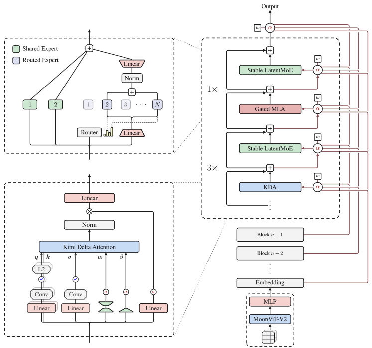

## 概要

「先日公開されたLLMのKimi」とは、中国の **Moonshot AI（月之暗面）** が2026年7月27日に公開した **Kimi K3** を指している可能性が高いです。<source-chip title="GitHub - MoonshotAI/Kimi-K3" url="https://github.com/moonshotai/Kimi-K3" />

### Kimi K3 の概要

Kimi K3 は、Moonshot AI が開発した **オープンウェイトのネイティブマルチモーダル・エージェンティックモデル** です。同社がこれまでにリリースしたモデルの中で最も高性能なモデルとして位置づけられています。<source-chip title="GitHub - MoonshotAI/Kimi-K3" url="https://github.com/moonshotai/Kimi-K3" />

__主な特徴__

| 項目 | 内容 |
|---|---|
| **アーキテクチャ** | Mixture-of-Experts（MoE） |
| **総パラメータ数** | 2.8 兆（2.8T） |
| **有効化パラメータ数** | 1,040億（104B） |
| **コンテキスト長** | 100万トークン（1,048,576トークン） |
| **モダリティ** | テキスト、画像、動画 |
| **アテンション機構** | Kimi Delta Attention（KDA） & Gated MLA |
| **エキスパート数** | 896（トークンごとに16個を選択） |
| **ビジョンエンコーダー** | MoonViT-V2（4.01億パラメータ） |

__新しいアーキテクチャ__

Kimi K3 は、従来のモデルとは異なる新しいアーキテクチャを採用しています。

- **Kimi Delta Attention（KDA）**: 従来のアテンション機構を改良した新方式
- **Attention Residuals（AttnRes）**: 効率的な学習・推論を実現
- **Stable LatentMoE**: 896個のエキスパートの中から16個を選択するスパースなMoE構造。Kimi K2 と比較して約2.5倍のスケーリング効率を達成

### 強みと用途

__1. 長期間のコーディング（Long-Horizon Coding）__

最小限の人間の介入で、大規模なリポジトリの操作やターミナルツールの連携、GPUカーネル最適化、コンパイラ開発、ゲーム開発、CAD、さらにはチップ設計まで対応できるとされています。<source-chip title="GitHub - MoonshotAI/Kimi-K3" url="https://github.com/moonshotai/Kimi-K3" />

__2. エージェンティックな知識作業__

深い調査レポートの作成、インタラクティブな可視化ダッシュボードの構築、モーションデザインや動画編集など、エンドツーエンドの知識作業を自律的に実行できます。

__3. ネイティブマルチモーダル & 長コンテキスト__

テキスト、画像、動画を同一モデル内で理解し、最大100万トークンの長いコンテキストを処理できます。

### ライセンスと公開形態

Kimi K3 は **「Kimi K3 License」** のもとで **フルモデルウェイトが公開** されており、研究・デプロイ・さらなるイノベーションのために自由に利用可能です。これは世界初のオープンな3Tクラスモデルとして注目されています。<source-chip title="GitHub - MoonshotAI/Kimi-K3" url="https://github.com/moonshotai/Kimi-K3" />

>__3Tクラスモデル__  
>3Tクラスモデルとは、**総パラメータ数が約3兆（3 Trillion）に達する大規模言語モデル**のことを指します。
>__用語の内訳__
>| 表記 | 意味 |
>|---|---|
>| **3T** | 3 Trillion = 3,000,000,000,000 = **3兆** |
>| **クラス** | 「その規模帯に属する」という意味（例: 3兆パラメータ級） |
>Kimi K3 は総パラメータ数が **2.8兆（2.8T）** なので、「約3兆クラス」として位置づけられています。
>__補足: MoEモデルでの「総パラメータ」と「有効化パラメータ」__
>Kimi K3 のような **Mixture-of-Experts（MoE）** モデルでは、2種類のパラメータ数が存在します。
>- **総パラメータ数（2.8T）**: モデル全体が持つパラメータの総量。ストレージ上のモデルサイズに相当します。
>- **有効化パラメータ数（104B）**: 推論時に実際に使われる（活性化される）パラメータ数。1つのトークンを処理する際に動く部分のみです。
>つまり、**「3Tクラス」はモデル全体の規模の大きさを示す指標**であり、推論時に毎回3兆パラメータが動くわけではありません。
>__規模感の比較__
>他の主要モデルと比較すると、3Tクラスがどれほど大きいかが分かります。
>| モデル | 総パラメータ数 | 有効化パラメータ数 |
>|---|---|---|
>| GPT-4（推定） | 約1.8T | 約数百B（推定） |
>| Kimi K3 | **2.8T** | 104B |
>| Kimi K2 | 1T | 32B |
>このように、Kimi K3 は**世界初のオープンな3兆パラメータ級モデル**として、公開モデルの中で最も大規模な部類に入ります。
>__シリーズの流れ__
>Kimi K3 の前には以下のモデルが公開されていました。
>- **Kimi K2**（2025年7月）: 320億有効化パラメータ、1兆総パラメータのMoEモデル
>- **Kimi K2.5**（2026年1月）: ネイティブマルチモーダル・ビジュアルエージェンティックモデル
>- **Kimi K2.6**: コーディングとエージェントスウォーム能力を強化したモデル
>Kimi K3 はこの流れを受け継ぎつつ、パラメータ規模とアーキテクチャの両面で大きな進化を遂げたモデルです。

## 仕組み

Kimi K3 の3つの新技術は、**「大規模モデルを動かす際のボトルネック」をそれぞれ別の角度から解決**しています。順を追って説明します。

### 1. Kimi Delta Attention（KDA）

__従来の問題__

Transformer のアテンション機構では、長い文章を処理する際に **KVキャッシュ** と呼ばれる「過去の単語の記憶」を保持する必要があります。文章が長くなるほどこのキャッシュが肥大化し、**メモリ消費が爆発的に増え、処理速度が劇的に低下**します。100万トークン（約75万文字）もの長文を扱う際には、この問題が深刻になります。

__KDA の解決策__

KDA は「**差分（Delta）** 」に着目します。隣接するトークン同士の関係性は、実はほとんど変わらない（＝冗長な情報が多い）という性質を利用し、**全情報をそのまま保持するのではなく「変化した部分だけ」を効率的に圧縮・保持**します。

これにより、長文処理時のメモリ使用量を大幅に削減できます。具体的には、KVキャッシュのメモリを **約75%削減**し、100万トークンでのデコード速度を **6.3倍** に高速化したと報告されています。<source-chip title="OpenModelMap - Kimi K3 Architecture Deep Dive" url="https://openmodelmap.com/kimi-k3/architecture" /><source-chip title="zmead.com - Inside Kimi K3's Two Architectural Pillars" url="https://zmead.com/blog/kimi-k3-kda-attnres-explained/" />

__イメージ__

従来のアテンションは「教科書の全ページを開いたまま試験を受ける」状態でしたが、KDA は「**変わった箇所だけをスマートなメモ帳にまとめて持ち歩く**」ような仕組みです。

### 2. Attention Residuals（AttnRes）

__従来の問題__

深層ニューラルネットワークでは、層が深くなるほど **「勾配消失・勾配爆発」** という問題が起きやすくなります。これは、入力から出力に向かって情報が伝わる途中で信号が弱まったり、逆伝播の学習信号が途中で消失したりする現象です。従来は「残差接続（ResNet方式）」で対処していましたが、**100層を超えるような超深いモデル**では、単純な残差接続だけでは情報の流れが不十分でした。

__AttnRes の解決策__

AttnRes は、層を通過する情報の流れを「**選択的に取り出せる索引付きノート**」のように改良します。全層を一律に足し合わせるのではなく、**必要な層の表現を動的に選択・参照**できる仕組みを導入しました。

これにより、モデルの深さに比例して情報が混濁するのを防するのを防ぎ、**層間の情報伝達を効率化**します。結果として、トレーニング効率が **25%向上**し、それでいて追加オーバーヘッドは **2%未満**に抑えられています。<source-chip title="zmead.com - Inside Kimi K3's Two Architectural Pillars" url="https://zmead.com/blog/kimi-k3-kda-attnres-explained/" /><source-chip title="Kimi K3 Tech Blog" url="https://www.kimi.ai/blog/kimi-k3" />

__イメージ__

従来の残差接続は「帳簿に全取引を順番に書き連ねる」ようなものでしたが、AttnRes は「**重要な取引だけを索引付きで引ける帳簿**」になったと言えます。

### 3. Stable LatentMoE

__従来の問題__

Mixture-of-Experts（MoE）は、「多数の専門家（エキスパート）の中から必要な少数を選んで使う」ことで、**総パラメータ数を増やしつつ計算コストを抑える**手法です。しかし、エキスパート数が増えると以下の問題が起きます。

- **ルーティングの偏り**: 特定のエキスパートだけに負荷が集中し、他が使われない
- **学習の不安定化**: どのエキスパートを選ぶかの「ルーター」が学習中に崩壊する
- **スケーリングの限界**: エキスパートを増やしても効率が上がらなくなる

__Stable LatentMoE の解決策__

Kimi K3 では **896個のエキスパート** の中から、各トークンごとに **16個だけ** を選択する超スパースな構造を採用しています。これを安定して動作させるため、以下の工夫が施されています。

- **Quantile Balancing（分位点バランシング）**: エキスパートへの負荷分散を、ルーターのスコアの分位点から直接計算して最適化。従来のヒューリスティックな調整や敏感なハイパーパラメータを排除し、安定した負荷分散を実現
- **Per-Head Muon**: アテンションの各ヘッドを独立して最適化し、大規模化しても適応的に学習できるようにする技術
- **SiTU（Sigmoid Tanh Unit）**: 活性化関数を改良し、大規模MoEでの学習安定性を高める

これにより、Kimi K2 と比較して **約2.5倍のスケーリング効率** を達成しています。つまり、「パラメータを増やしても計算効率が悪化しない」構造になっています。<source-chip title="Kimi K3 Tech Blog" url="https://www.kimi.ai/blog/kimi-k3" /><source-chip title="PoYo - Kimi K3 Architecture" url="https://poyo.ai/hub/kimi-k3-architecture" />

__イメージ__

896人の専門家がいる病院で、患者（トークン）の症状に応じて **最適な16人の専門医チーム** を自動で組むシステムです。ただし、特定の医師だけが疲弊しないよう、**AIが常に負荷を監視・調整**して安定した診療を続けられる仕組みになっています。

### 3つの技術の関係性

| 技術 | 解決する問題 | 効果 |
|---|---|---|
| **KDA** | 長文処理時のメモリ・速度問題 | 長文でも高速・低メモリ |
| **AttnRes** | 超深い層での情報伝達の劣化 | 深いモデルでも効率的に学習 |
| **Stable LatentMoE** | 大規模MoEの学習不安定・効率低下 | 2.8Tパラメータを実用的に動作させる |

この3つが組み合わさることで、Kimi K3 は「**パラメータ数は巨大だが、推論コストは抑えられ、長文も深い層も安定して処理できる**」という、従来にはなかったバランスを実現しています。

## 実験

Kimi K3 は **広範な性能評価と実験** が行われています。公式の技術レポートと第三者による独立評価の両方が存在します。

### 1. 公式ベンチマーク評価

Moonshot AI は、以下のカテゴリで大規模なベンチマーク評価を公開しています。

__推論・知識ベンチマーク__

| ベンチマーク | Kimi K3 (max) | 比較対象 |
|---|---|---|
| **GPQA Diamond** | 93.5 | Claude Fable 5: 92.6, GPT-5.6 Sol: 94.1 |
| **HLE-Full** | 43.5 / 56.0 | Claude Fable 5: 53.3 / 63.0 |
| **AA-LCR** | 74.7 | Claude Fable 5: 70.0 |

__コーディングベンチマーク__

| ベンチマーク | Kimi K3 (max) | 強み |
|---|---|---|
| **SWE-Marathon** | 42.0 | GPT-5.5: 14.0, Claude Opus 4.8: 40.0 |
| **FrontierSWE** | 81.2 | Claude Opus 4.8: 66.7, GPT-5.5: 64.9 |
| **Terminal-Bench 2.1** | 88.3 | ほぼ最先端レベル |
| **DeepSWE** | 67.5 | 長期間のエンジニアリングタスクで強い |

__エージェント・自動化ベンチマーク__

| ベンチマーク | Kimi K3 (max) | 特記 |
|---|---|---|
| **BrowseComp** | 91.2 | ブラウザベースの情報収集 |
| **MCPMark-Verified** | 94.5 | MCPツール使用能力で高スコア |
| **AutomationBench** | 30.8 | 自動化タスク |
| **OSWorld-Verified** | 84.8 | OS操作エージェント |

__ビジョン・マルチモーダル__

| ベンチマーク | Kimi K3 (max) |
|---|---|
| **Video-MME** | 90.0 |
| **MMVU** | 82.1 |
| **MathVision** | 94.3 / 97.8 |
| **MMMU-Pro** | 81.6 / 83.4 |

### 2. 実際のケーススタディ（実験）

ベンチマークだけでなく、**実世界に近い複雑なタスク**での実験も多数公開されています。

__GPUカーネル最適化__

24時間の時間制限で、AttnRes・KDA・MLAカーネルを最適化するタスク。Kimi K3 は Claude Fable 5 と同等の競争力を示し、GPT-5.6 Sol や Claude Opus 4.8 を大きく上回りました。<source-chip title="Kimi K3 Tech Blog" url="https://www.kimi.ai/blog/kimi-k3" />

__GPUコンパイラのゼロから開発__

Kimi K3 は **MiniTriton** というTriton風のコンパイラをゼロから構築しました。MLIR上のタイルレベルIR、最適化パス、PTXコード生成パイプラインを含み、特定のワークロードではTritonやtorch.compileを上回る性能を達成。さらに、nanoGPTのエンドツーエンド学習も安定収束させました。<source-chip title="Kimi K3 Tech Blog" url="https://www.kimi.ai/blog/kimi-k3" />

__チップ設計__

48時間の自律的実行で、**K3自身のアーキテクチャを実行するためのチップ**を設計しました。Nangate 45nmライブラリで4mm²内に146万標準セル、0.277MB SRAM、INT4 MACアレイを実装し、シミュレーションで8,700トークン/秒のデコードスループットを達成しています。<source-chip title="Kimi K3 Tech Blog" url="https://www.kimi.ai/blog/kimi-k3" />

__科学研究の再現__

計算天体物理学の「I-Love-Q普遍関係」を再現するタスクで、**経験豊富な研究者が1〜2週間かかる作業を約2時間で完了**しました。20以上の論文をレビュー・相互検証し、数値パイプラインを実装、300以上の状態方程式を評価、公開論文の公式の不整合を特定し、3,000行以上のPythonコードとインタラクティブHTMLダッシュボードを生成しました。<source-chip title="Kimi K3 Tech Blog" url="https://www.kimi.ai/blog/kimi-k3" />

### 3. 独立した第三者評価

複数の独立した評価機関もKimi K3を検証しています。

__総合評価の位置づけ__
- **AI Intelligence Index**: 第3位（ただし幻覚率は51%と報告もあり）
- **CodingFleet の35ベンチマーク比較**: Claude Fable 5 に22対12で敗れるも、Frontend Code Arena では1位
- **Artificial Analysis**: 長文コンテキストとコーディングで高い評価

__強みと弱み（第三者評価のまとめ）__

| 強み | 弱み |
|---|---|
| 長期間のコーディング・SWEタスク | Claude Fable 5 や GPT-5.6 Sol には総合で及ばない部分も |
| 100万トークンの長文処理 | 一部の専門知識ベンチマーク（HLE-Fullなど）で差が出る |
| エージェント・自動化タスク | 幻覚率がやや高いという報告あり |
| ビジョン・動画理解 | プロプライエタリ最強モデルとの差は縮小傾向 |
| フロントエンド開発 | 評価ハーネス（実行環境）による差が大きい |

### 4. 評価における注意点

第三者評価では、以下の点が指摘されています。

- **ハーネスの違い**: 同じベンチマークでも、使用する実行環境（Claude Code、Kimi Code、Codexなど）によってスコアが大きく変動する
- **フォールバック**: Claude Fable 5 は一部タスクでフォールバック（別モデルへの切り替え）を使用しており、純粋な比較が難しい場合がある
- **公開時期**: 2026年7月公開時点の評価であり、モデルやベンチマークは継続的に更新される

