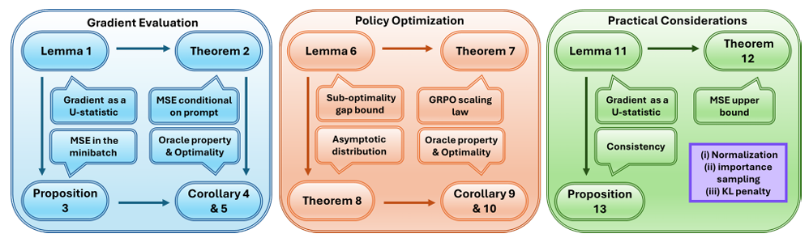

LLMの強化学習は現在はPPO系の手法を用いることがベースとなってきています。
こんな中PPOでは推論タスクでの中間ステップの時間がかかることから中間ステップが長くなり、計算コストも大きいという課題がありました。

そんな状況に一石を投じたのがDeepSeekの「クリティックを完全に捨てて、グループ内の相対評価で代用する」ということに目を付けたGRPOです。
そんなGRPOがなぜワークするかという根拠を説明する面白い論文を見つけました。

査読はついてないのですが、性能向上を主張ではなく、理論の裏付けを行う論文なので、ブラックボックスのまま未消化になる心配も低いと思いました。

読んでいきます。

## 概要
論文の概要についてはこんなところです。

### 論文情報カード

| 項目 | 内容 |
|------|------|
| **タイトル** | Demystifying Group Relative Policy Optimization: Its Policy Gradient is a U-Statistic |
| **日本語訳** | 「GRPOを解明する：そのポリシーグラディエントは実はU-統計量である」 |
| **著者** | Hongyi Zhou, Kai Ye, Erhan Xu, Jin Zhu, Ying Yang, Shijin Gong, Chengchun Shi |
| **採択状況** | **arXiv preprint**（2026年3月1日公開）。現時点では査読付き学会での採択情報は未公開 |
| **論文リンク** | [arXiv:2603.01162](https://arxiv.org/abs/2603.01162) |

### 一言でいうと

> **DeepSeek-R1の中核技術であるGRPOが「なぜ機能するのか」を、1948年に確立された古典的統計学の「U-統計量」という理論で初めて数学的に解明した論文。**

### 3つの主要な貢献

- **GRPOのポリシーグラディエントが「U-統計量」であることを証明**
  - 「グループ平均でクリティック（価値関数）を代替する」というGRPOの核心操作が、統計学的に最適な推定量であることを示した

- **GRPOが「オラクル性」を持つことを証明**
  - サンプル数が増えると、GRPOは「真の価値関数を知っている理想的なアルゴリズム」と漸近的に等価になることを示した。つまり、クリティックネットワークを省略しても、理論的には情報を失わない

- **最適なグループサイズのスケーリング則を導出**
  - 「1プロンプトあたり何個の出力をサンプリングすべきか」という実務上の最重要ハイパーパラメータについて、データとモデルアーキテクチャのみで決まる普遍的な法則を提示

### なぜこの論文が面白いか

| 観点 | 内容 |
|------|------|
| **理論的価値** | 実務で広く使われるGRPOの「なぜグループ平均が良いのか」という直感を、70年以上の歴史を持つU-統計量の理論で厳密に説明した |
| **実用的価値** | 最適なグループサイズを経験的に探る必要がなく、理論式から導出できるようになった |
| **影響力** | DeepSeek-R1（Nature掲載）の学習アルゴリズムの理論的基盤を示したため、今後の推論RL研究の前提知識になりうる |

### 補足：採択状況について

現時点（2026年9月）では、本論文は**arXiv上のpreprint**です。ただし、内容の理論的完成度が高く、GRPOという現在最も注目されている推論RLアルゴリズムの数学的基盤を示しているため、NeurIPS・ICML・ICLRなどのトップ会議、あるいは統計学・機械学習の理論系ジャーナルへの採択が今後発表される可能性が高いと考えられます。


## GRPOとは

GRPO（Group Relative Policy Optimization）は、LLM（大規模言語モデル）を強化学習で学習させる際に使われる比較的新しいアルゴリズムです。DeepSeek-R1などの学習で採用されたことで広く知られるようになりました。

以下、段階的に説明いたします。

### 1. なぜ GRPO が生まれたのか

従来、LLMの強化学習では **PPO（Proximal Policy Optimization）** という手法が主流でした。しかし PPO には大きな問題があります。

### PPO の問題点

PPO では、モデルが「この回答は何点か？」を判断するために、**Value Model（価値モデル）** という別のニューラルネットワークが必要です。

```
[Policy Model]  「回答を生成する」本体モデル
[Value Model]   「その回答の良さを予測する」別モデル
```

この Value Model には以下の問題があります。

- **メモリ消費が膨大**：Policy と Value の2つの大規模モデルを同時にGPUに乗せる必要がある
- **学習が不安定**：Value Model の精度が悪いと、Policy の学習も崩れる
- **実装が複雑**：2つのモデルの学習を同時に管理する必要がある

### 2. GRPO の核心的なアイデア

GRPO は **「Value Model を完全に廃止する」** ことを目指しました。

代わりに、GRPO は以下の考え方を採用しています。

> **「同じ問題に対して、モデルに複数の回答を生成させて、それらを互いに比較すれば、どれが良いか分かるのではないか？」**

つまり、**「絶対的なスコア」を予測するのではなく、「グループ内での相対的な良さ」を使って学習する**のです。

### 3. GRPO の具体的な流れ

GRPO の学習は、以下の5ステップで行われます。

__ステップ1：問題（プロンプト）を与える__

```
プロンプト: 「1+1は？」
```

__ステップ2：グループで複数回答を生成する__

同じプロンプトに対して、現在のモデルに **複数回（例：4回）** 回答させます。

```
回答A: 「2です」      → 正解
回答B: 「1です」      → 不正解
回答C: 「2です」      → 正解
回答D: 「11です」     → 不正解
```

この「4つの回答のセット」が **Group（グループ）** です。

__ステップ3：各回答に報酬（Reward）を与える__

報酬モデル（またはルールベースの判定）で、各回答にスコアをつけます。

```
回答A: 1.0点（正解）
回答B: 0.0点（不正解）
回答C: 1.0点（正解）
回答D: 0.0点（不正解）
```

__ステップ4：グループ平均からの「相対的な良さ」を計算する__

4つの回答の平均スコアは `0.5` です。各回答がこの平均より良いか悪いかを計算します。

```
回答A: 1.0 - 0.5 = +0.5  ← 平均より良い
回答B: 0.0 - 0.5 = -0.5  ← 平均より悪い
回答C: 1.0 - 0.5 = +0.5  ← 平均より良い
回答D: 0.0 - 0.5 = -0.5  ← 平均より悪い
```

この差分（**相対的な優位性**）が、学習の信号になります。

__ステップ5：モデルを更新する__

- 平均より**良かった回答（A, C）** を生成しやすくなるようにモデルを調整
- 平均より**悪かった回答（B, D）** を生成しにくくなるようにモデルを調整

PPO と同様に、**一度に大きく変わりすぎないよう制限（クリッピング）** をかけながら、少しずつモデルを更新します。

### 4. PPO と GRPO の比較

| 項目 | PPO | GRPO |
|------|-----|------|
| **Value Model** | 必要（別モデル） | **不要** |
| **メモリ使用量** | 多い（Policy + Value） | 少ない（Policy のみ） |
| **評価方法** | 絶対スコアを予測 | グループ内での相対評価 |
| **実装の複雑さ** | 複雑 | 比較的シンプル |
| **学習の安定性** | Value の精度に依存 | グループ内比較なので比較的安定 |

### 5. なぜ「グループ比較」がうまくいくのか

LLM の強化学習では、「正解のスコア」を絶対的に定義するのが非常に難しいです。

例えば数学の証明問題では：
- 途中まで合っていて最後が間違い → 0.5点？
- 別の証明方法 → 1.0点？
- 論理的に正しいが形式が違う → 何点？

このような「曖昧な採点」を絶対値で予測する Value Model は苦労します。

しかし GRPO では **「同じ問題に対する複数の回答を比べれば、相対的な良さは分かりやすい」** と考えます。

人間も「100点満点で何点か？」を即座に答えるより、「AとBどっちが良い？」と比較する方が簡単であるのと同じ発想です。

### 6. メリットと注意点

__メリット__

- **GPU メモリを大幅に節約**：Value Model が不要なため、同じサイズのモデルでも半分近いメモリで学習可能
- **実装がシンプル**：PPO よりもコードが短く、バグが入りにくい
- **報酬モデルの設計が楽**：絶対スコアの精度より、比較の公平性が重要になる

__注意点・限界__

- **グループサイズが重要**：グループ内の回答数が少なすぎると、相対評価の精度が落ちる
- **報酬の設計に依存**：報酬モデル自体に偏りがあると、グループ比較も偏る
- **計算コスト**：同じプロンプトに対して複数回答を生成するため、サンプリングの回数が増える

### 7. 一言でまとめると

> **GRPO は「Value Model を使わず、同じ問題に対する複数回答をグループ内で比較して、相対的な良さから学習する」強化学習手法です。**

「絶対的な点数を予測する」のではなく、「みんなの回答を見比べて、自分より良い回答を真似して、悪い回答を避ける」という、より人間らしい比較学習の仕組みと言えます。



## 動作の解明

この論文は、GRPOが「なぜValue Modelなしでうまくいくのか」を**統計学の古典的な理論「U-statistic（U統計量）」** という視点で厳密に証明した画期的な研究です。

以下、段階的に解説いたします。

### 1. 論文が解き明かそうとした4つの疑問

GRPOはDeepSeek-R1などで実用的に成功していましたが、理論的な裏付けは不十分でした。著者らは以下の問いを立てました。

| 疑問 | 内容 |
|------|------|
| **Q1** | なぜGRPOはそんなに効果的なのか？ |
| **Q2** | グループ平均でCritic（価値関数）を近似する根拠は何か？ |
| **Q3** | 有限サンプル・漸近的な収束性は保証できるか？ |
| **Q4** | 1つのプロンプトあたり、いくつの回答をサンプリングすべきか？ |

### 2. 核心的な発見：「GRPOのPolicy GradientはU-statisticである」

__U-statistic（U統計量）とは？__

統計学で1948年にHoeffdingが提唱した古典的な概念です。直感的には、

> **「データの中からすべてのペア（または組み合わせ）を作り、その平均を取ることで、より精度の高い推定量を作る手法」**

です。

__具体例：平均の推定__

通常の標本平均は「各データ点をそのまま足して割る」だけですが、U-statisticでは例えば「すべての2つのデータの平均の平均」を取ることで、より分散が小さい推定量を作れます。

```
通常の平均:  (x₁ + x₂ + x₃) / 3

U-statistic的発想:  [(x₁+x₂)/2 + (x₁+x₃)/2 + (x₂+x₃)/2] / 3
```

後者は「データ同士を比較して構造を捉える」ため、より頑健な推定ができます。

### 3. GRPOがU-statisticであるとはどういうことか

GRPOのPolicy Gradient（モデル更新の方向を決める勾配）は、以下の構造を持っています。

```
GRPOのPolicy Gradient = グループ内のすべての回答ペアの比較から計算される
```

つまり、GRPOは以下の2ステップで勾配を計算しています。

1. **同じプロンプトに対してG個の回答を生成**（グループを作る）
2. **各回答の報酬をグループ平均と比較**して、相対的な優位性を計算

この「グループ内の複数サンプルを使って、ペアワイズな比較から推定量を作る」という構造が、**まさにU-statisticの定義**に一致する、というのが論文の核心です。

### 4. この発見から導かれる3つの重要な結論

__結論1：Oracle Property（オラクル性）__

> **GRPOは、真のCritic（価値関数）にアクセスできる「理想的なアルゴリズム」と漸近的に等価である**

つまり、GRPOは「Value Modelを持たない」にもかかわらず、**理論上はValue Modelを完璧に持っている場合と同じ性能に漸近的に到達できる**ことが証明されました。

これが **Q1（なぜGRPOは効果的か）** と **Q2（グループ平均の根拠は何か）** に答えています。

__結論2：Optimality（最適性）__

> **GRPOは、広いクラスのPolicy Gradientアルゴリズムの中で、漸近的にMSE（平均二乗誤差）とSuboptimality Gap（最適解との差）を最小化する**

つまり、GRPOは「Value Modelなし」という制約の中で、**理論的に最適な方法でCriticを近似している**ことが示されました。

__結論3：Universal Scaling Law（普遍的スケーリング則）__

> **最適なグループサイズGは、訓練データとモデルアーキテクチャのみに依存し、訓練予算やイテレーション数には依存しない**

これは **Q4（いくつの回答をサンプリングすべきか）** に答えています。

- 最適なGは、ハイパーパラメータ探索なしで**理論的に決定可能**
- モデルやデータが変わらない限り、一度決めたGを使い続ければよい

### 5. 直感的な理解：「多数決の智慧」を数学的に正当化

GRPOの「グループ平均でCriticを近似する」という手法は、以下の直感に対応しています。

> **「1つの回答の絶対的な良さを評価するのは難しいが、同じ問題に対する複数の回答を比べれば、どれが良いかは分かりやすい」**

論文はこの直感を、**U-statisticの理論を使って厳密に証明**しました。

- グループ内比較は「データ同士の構造」を捉えるU-statistic的推定
- その結果、サンプル数を増やすと真の価値関数に収束する
- だからValue Modelなしでも、十分なサンプル数で「擬似的にValue Modelと同等の情報」を得られる

### 6. 論文の意義を一言で

> **「GRPOはValue Modelを捨てた“安い代替案”ではなく、U-statisticとして理論的に最適な推定を行う“本物のアルゴリズム”である」**

これまでは「Value Modelが重いから、グループ平均で代用している」という実利的な理解でしたが、この論文は**「グループ平均こそが、統計学的に最適なCritic推定方法である」**ことを数学的に示しました。

### まとめ

| 論文の主張 | 意味 |
|-----------|------|
| GRPOのPolicy GradientはU-statistic | グループ内比較は、統計学的に頑健な推定量を作る |
| Oracle Property | Value Modelなしで、Value Modelありと同等の性能に到達可能 |
| Optimality | Policy Gradientアルゴリズムの中で漸近的最適 |
| Universal Scaling Law | 最適なグループサイズは理論的に決定可能で普遍的 |

この論文により、GRPOは「経験的にうまくいく手法」から「理論的に正当化された最適アルゴリズム」へと昇華されました。


