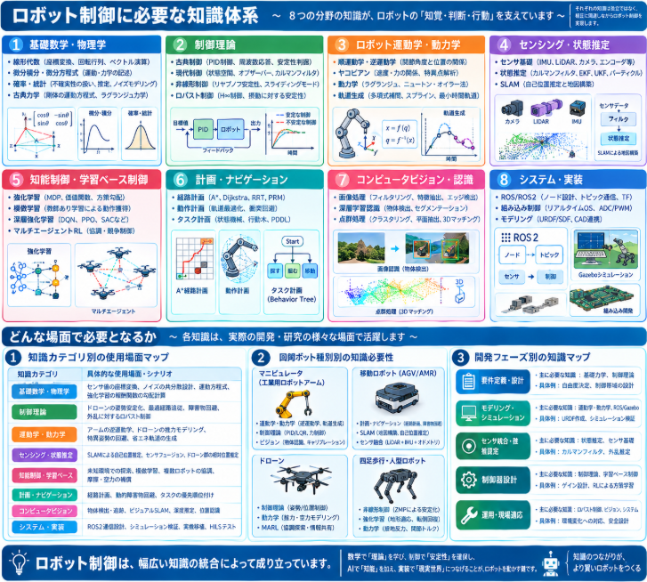

最近仕事でもしかしたらロボットの制御を行う可能性あるかという気配が漂うことが出てきました。
気配なかろうと、AIの最終ゴールは実機に組み込むこと。
そう考えると一連のパッケージが知りたくなりました。


## ロボット制御に必要な知識体系

### 1. 基礎数学・物理学
- **線形代数**: 座標変換、回転行列、ベクトル演算
- **微分積分・微分方程式**: 運動・力学の記述
- **確率・統計**: 不確実性の扱い、推定、ノイズモデリング
- **古典力学**: 剛体の運動方程式、ラグランジュ力学、ハミルトン力学

### 2. 制御理論
- **古典制御**: PID制御、周波数応答、根軌跡、安定性判据
- **現代制御**: 状態空間表現、オブザーバー、カルマンフィルタ、LQR・MPC
- **非線形制御**: リヤプノフ安定性、フィードバック線形化、スライディングモード制御
- **ロバスト制御**: H∞制御、摂動に対する安定性

### 3. ロボット運動学・動力学
- **順運動学・逆運動学**: 関節角度とエンドエフェクタ位置の関係
- **ヤコビアン**: 速度・力の関係、特異点解析
- **動力学**: トルク・力と加速度の関係（ラグランジュ、ニュートン・オイラー法）
- **軌道生成**: 多項式補間、スプライン、最小時間軌道

### 4. センシング・状態推定
- **センサ基礎**: IMU、LiDAR、カメラ、エンコーダ、距離センサの原理
- **状態推定**: カルマンフィルタ、EKF、UKF、パーティクルフィルタ
- **SLAM**: 自己位置推定と地図構築（グラフベースSLAM、フィルタベースSLAM）

### 5. 知能制御・学習ベース制御
- **強化学習**: MDP、価値関数、方策勾配、モデルフリー/モデルベース
- **模倣学習**: 教師あり学習による動作獲得
- **深層強化学習**: DQN、PPO、SACなどの応用
- **マルチエージェント強化学習（MARL）**: 複数ロボットの協調・競争制御

### 6. 計画・ナビゲーション
- **経路計画**: A*, Dijkstra, RRT, PRM
- **動作計画**: 軌道最適化、衝突回避
- **タスク計画**: 状態機械、行動木（Behavior Tree）、PDDL

### 7. コンピュータビジョン・認識
- **画像処理**: フィルタリング、特徴抽出、エッジ検出
- **深層学習認識**: 物体検出、セグメンテーション、姿勢推定
- **点群処理**: クラスタリング、平面抽出、3Dマッチング

### 8. システム・実装
- **ROS/ROS2**: ノード設計、トピック通信、TF、Gazeboシミュレーション
- **組み込み制御**: リアルタイムOS、制御周期、ADC/PWM入出力
- **モデリング**: URDF/SDF、CAD連携


## どんな場面で必要となるか

ロボット制御の各知識が、実際の開発・研究のどの場面で必要となるかを整理しました。
特に、ドローンや複数ロボットの協調制御といった文脈も含めてまとめています。

### 1. 知識カテゴリ別の使用場面マップ

| 知識カテゴリ | 具体的な使用場面・シナリオ |
|-------------|------------------------|
| **基礎数学・物理学** | センサ値の座標変換（センサ座標系→世界座標系）、ノイズの共分散行列設計、運動方程式の導出、強化学習の報酬関数の勾降計算 |
| **制御理論** | ドローンの姿勢安定化（PID）、最適経路追従（LQR）、障害物回避しながらの軌道追従（MPC）、風乱れなど外乱に対するロバスト制御 |
| **運動学・動力学** | アームの目標位置への関節角度計算（逆運動学）、ドローンのプロペラ推力と姿勢変化の関係モデリング、特異姿勢の回避、省エネ軌道の生成 |
| **センシング・状態推定** | GPS denied環境での自己位置推定（SLAM）、IMUとカメラのセンサフュージョン（EKF）、ドローン群の相対位置推定 |
| **知能制御・学習ベース制御** | 未知環境での探索方策獲得（RL）、熟練操作者の動作の模倣、複数ドローンの協調探索（MARL）、モデル化困難な摩擦・空力の補償 |
| **計画・ナビゲーション** | 倉庫内AGVの衝突回避経路計画（A*, RRT）、ドローンの3次元空間での障害物回避、タスクの優先順位付けと行動選択（Behavior Tree） |
| **コンピュータビジョン・認識** | 目標物の検出と追跡、ドローンのビジュアルSLAM、深度推定による着陸地点の選定、他ロボットの位置認識 |
| **システム・実装** | ROS2ノード間の通信設計、Gazebo上でのシミュレーション検証、実機への制御周期の移植、ハードウェアインザループ（HILS）テスト |

### 2. ロボット種別別の知識必要性

__マニピュレータ（工業用ロボットアーム）__
- **運動学・動力学**: ピックアンドプレースのための逆運動学・軌道生成
- **制御理論**: 高精度な軌道追従（PID/LQR）、接触力制御（インピーダンス制御）
- **ビジョン**: カメラでの物体位置認識、ハンド・アイキャリブレーション

__移動ロボット（AGV/AMR）__
- **計画・ナビゲーション**: 地図ベース経路計画、動的障害物回避
- **SLAM**: 未知環境での地図構築と自己位置推定
- **センサ融合**: LiDAR + IMU + オドメトリの統合

__ドローン__
- **制御理論**: 高速な姿勢制御（内側ループ）と位置制御（外側ループ）の階層設計
- **動力学**: ロータ推力と空力のモデリング、風乱れの影響評価
- **MARL**: 複数機の領域分割探索、情報共有による協調行動

__四足歩行・人型ロボット__
- **非線形制御**: ゼロモーメント点（ZMP）による歩行安定化
- **強化学習**: 地形適応応歩行の獲得、転倒回復動作の学習
- **動力学**: 接地反力を考慮した関節トルク計算

### 3. 開発フェーズ別の知識マップ

| フェーズ | 主に必要な知識 | 具体例 |
|---------|--------------|--------|
| **要件定義・設計** | 基礎力学、制御理論 | ロボットの自由度決定、制御帯域の設計 |
| **モデリング・シミュレーション** | 運動学・動力学、ROS/Gazebo | URDF作成、物理シミュレーション上での挙動確認 |
| **センサ統合・推定** | 状態推定、センサ基礎 | カルマンフィルタによる自己状態推定、外乱推定 |
| **制御器設計** | 制御理論、学習ベース制御 | フィードバックゲイン設計、RLによる方策学習 |
| **運用・現場適応** | ロバスト制御、ビジョン、システム | 環境変化への対応、エッジケースでの安全設計 |



## 仮想環境

ロボットを自分で組むのが一番スキルにはなります。
が、お金がかかるので仮想環境でシミュレーションできないか調べてみました。

### 1. 汎用ロボットシミュレータ

__Gazebo（Gazebo Sim / Ignition）__
- **特徴**: ROS/ROS2コミュニティの**事実上の標準**シミュレータ。オープンソースで完全無料。
- **強み**: 豊富なセンサモデル（LiDAR、カメラ、IMU等）、物理エンジン（ODE, Bullet, DART）、ROS2との緊密な統合
- **向いている場面**: 移動ロボットのナビゲーション、マニピュレータ制御、ドローンシミュレーション（PX4連携）
- **注意点**: Gazebo Classic（旧版）は終了に向かっており、新規開発は **Gazebo Sim（Ignition）** を推奨

__Webots__
- **特徴**: Cyberbotics社製、2024年に**完全オープンソース化**（Apache 2.0）。
- **強み**: 導入が容易、教育向けドキュメントが充実、複数OS対応、ROS2対応
- **向いている場面**: 初学者の学習、大学講義、小型移動ロボットやアームの基礎実験

__NVIDIA Isaac Sim + Isaac Lab__
- **特徴**: NVIDIAが開発。**無料で利用可能**（NVIDIA開発者メンバーシップ登録が必要）。
- **強み**: GPU加速による高速シミュレーション、**写真級リアルなレンダリング**、強化学習（RL）向けのIsaac Labと統合
- **向いている場面**: 大規模並列強化学習、ビジョン認識の学習、デジタルツイン
- **注意点**: NVIDIA GPU（RTX系推奨）が必須。URDF/ROS2連携も可能だが、USDフォーマットが基本

__CoppeliaSim（旧 V-REP）__
- **特徴**: 教育版が無料（機能制限あり）。産業・研究向け。
- **強み**: 複雑な接触シミュレーション、逆運動学、複数スクリプト言語（Python, Lua等）
- **向いている場面**: 産業用ロボットアームの詳細シミュレーション、複雑な接触・組立タスク

### 2. 強化学習・軽量シミュレータ

__MuJoCo（Multi-Joint dynamics with Contact）__
- **特徴**: Google DeepMindが管理・無料化。**軽量・高速・高精度**な物理エンジン。
- **強み**: RLアルゴリズムのベンチマーク環境として広く使用、Gymnasiumとの統合
- **向いている場面**: 歩行ロボット・マニピュレータのRL学習、制御方策の高速実験

__PyBullet__
- **特徴**: Bullet PhysicsベースのPython向けラッパー。インストールが非常に簡単（`pip install pybullet`）。
- **強み**: 軽量、逆運動学、VR対応、ROS連携も可能
- **向いている場面**: クイックなRL実験、グラスピング（把持）シミュレーション、教育

### 3. ドローン・MARL向けシミュレータ

__PX4 + Gazebo + ROS2 構成__
- **PX4 SITL（Software In The Loop）** とGazeboを組み合わせることで、**リアルなフライトスタック**を含めたドローンシミュレーションが可能。
- **MARL向け**: 複数ドローンを同時にspawnして、ROS2トピック経由で各機を制御・学習できる。
- **具体例**: `PX4_Swarm_Controller`（ROS2パッケージ）などで、ドローンスウォーム制御をGazebo上で検証可能。<source-chip title="GitHub" url="https://github.com/artastier/PX4_Swarm_Controller" />

__Flightmare__
- **特徴**: スイス連邦工科大学（ETH Zurich）発の**ドローン専用RLシミュレータ**。
- **強み**: Unityベースの高品質レンダリング、高速並列シミュレーション、Gymインターフェース
- **向いている場面**: 高速飛行・障害物回避のRL学習

__AirSim（Microsoft）__
- **特徴**: Unreal Engineベースのドローン・自動運転シミュレータ。
- **強み**: 写真級の視覚環境、PX4連携、Python/C++ API
- **注意点**: Microsoftによる積極的な開発は2024年頃から停止傾向。コミュニティフォーク版（如AirSim-ROS2等）で利用するケースが多い。

__Crazyflie + Gazebo__
- **特徴**: 小型ドローンCrazyflieのシミュレータ。
- **強み**: 実機が安価（数千円〜1万円台）で、シミュレーションから実機への移行が容易。
- **向いている場面**: 室内スウォーム、教育、複数機制御の入門

### 4. 用途別のシミュレータ選択ガイド

| あなたの目的 | 推奨シミュレータ | 理由 |
|------------|----------------|------|
| **ROS2で移動ロボット/アームを学びたい** | Gazebo Sim / Webots | ROS2標準、チュートリアル豊富 |
| **強化学習で制御方策を学習したい** | Isaac Lab / MuJoCo / PyBullet | 並列化・Gym統合が充実 |
| **ドローンの姿勢制御・経路追従を試したい** | PX4 + Gazebo | 実機フライトスタックをそのまま使用 |
| **複数ドローンの協調探索（MARL）を試したい** | PX4 + Gazebo + ROS2 / Flightmare | 複数機spawnと分散制御が可能 |
| **ビジョン認識＋制御を統合したい** | Isaac Sim / AirSim | 高品質カメラシミュレーション |
| **軽くて手軽に始めたい** | PyBullet / Webots | 導入が簡単、コード量が少ない |

## 総括

ロボット制御は、大きく**3つの層**と**実践の流れ**で一望できます。

### ロボット制御の3層構造

| 層 | 内容 | 役割 |
|---|------|------|
| **基礎層** | 線形代数、微積分、確率統計、古典力学 | ロボットの「言語」を記述する道具 |
| **制御層** | PID、状態空間、カルマンフィルタ、運動学・動力学、SLAM、計画 | ロボットを「安定して動かす」技術 |
| **知能層** | 強化学習、MARL、模倣学習、ビジョン認識 | 未知環境で「賢く振る舞わせる」技術 |

**基礎層なしに制御層は理解できず、制御層なしに知能層は実機に載らない**、という依存関係があります。

### 実践の流れ

```
1. モデリング（URDF・運動方程式）
      ↓
2. シミュレーション検証（Gazebo / Isaac Sim / PyBullet）
      ↓
3. センサ統合・状態推定（EKF・SLAM）
      ↓
4. 制御器設計（PID / LQR / RL方策）
      ↓
5. 実機への移植（ROS2・組み込み・リアルタイム制御）
```

### あなたの文脈での最短パス

強化学習（MARL）の知見を活かしつつ、実機へつなげるなら：

1. **ROS2 + Gazebo** で基礎を固める（通信・TF・シミュレーション）
2. **PyBullet / Isaac Lab** でRL方策を高速に学習
3. **PX4 + Gazebo** でドローンの実機スタックに近い環境で検証
4. **ROS2経由**で実機にブリッジ

つまり、**「理論（数学・制御・RL）→ シミュレーション（Gazebo/PyBullet）→ 実機（ROS2）」** の3段階が、ロボット制御の一本道です。

### 一言でまとめると

> **ロボット制御とは、「基礎数学で記述し、制御理論で安定させ、学習で賢くし、ROS2で実機に載せる」一連の技術の総和である。**


