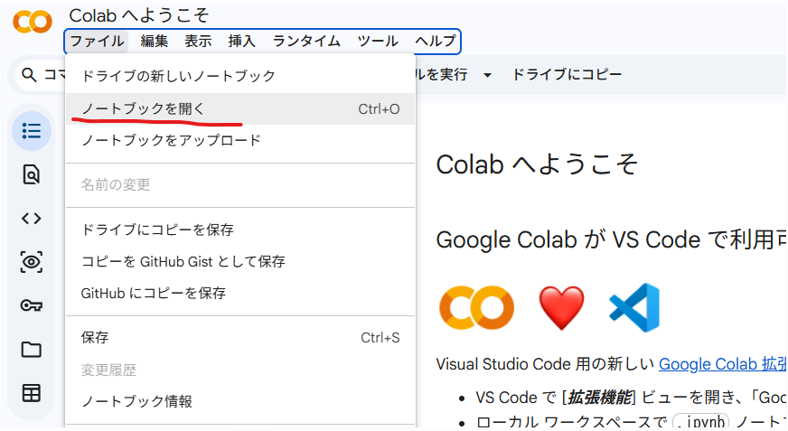
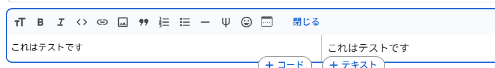
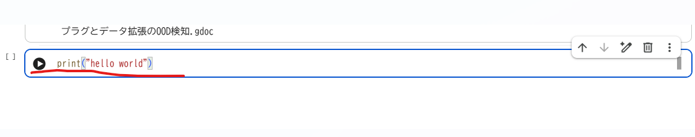

### google colabの環境準備

google colabの環境を準備する手順について説明します。

1. google colabのサイトにアクセス

https://colab.research.google.com/


2. (アカウントをお持ちの場合)ログイン→google アカウントを選択

以下をクリックしてgoogleアカウントを選択してください


2. (アカウントをお持ちでない場合)google アカウントを作成

名前や生年月日などの情報を入力してgoogleアカウントを作成ください


3. (新規でノートブックを作成する場合)ドライブの新しいノートブックを選択


3. (作成済みのノートブックを開く場合)ドライブの新しいノートブックを選択



4. セルにコードを入力

ノートブックの中にはノートブックには、コードセルとテキストセルで構成されています。

__テキストセル：メモを残す場所__

コードの注釈などの情報を記載することが出来ます。
レポートや学習記録として使うことも出来ます。

入力する際は**マークダウン**という書式で記載することになります。



>マークダウン  
>マークダウン（Markdown）は、文章を読みやすく書きつつ、簡単な記号だけで構造や体裁を表現できる軽量な記述書式です。
主に技術文書、README、ブログ、メモ、仕様書などで広く使われています。

記載例:
```
# 見出し
- 箇条書き
- 数式や説明文
```


__コードセル：Python でコードを記述する場所__

pythonコードを記載して実行することが出来ます。
実行する際は"Shift + Enter"を押す、or、または ▶ ボタンをクリックです。



5. GPU / TPU を使う方法（重要）
ニューラルネットワークの計算を行う場合はGPUを使うと非常に高速に処理出来ます。

設定の仕方は
```
ランタイム → ランタイムのタイプを変更
```
ハードウェア アクセラレータ

- GPU（推奨）
- TPU（上級者向け）

を選択 → 保存です。

GPUが使えるか確認したい場合：

コードセルに以下を入力して実行してください。
True と表示されれば GPU 使用可能です。
```python
import torch
torch.cuda.is_available()

```

6. ライブラリのインストール

Colabには多くのライブラリが入っていますが、追加も可能です。

```
!pip install numpy matplotlib scikit-learn
```

※! は Linuxコマンドを実行する記号です。

7. Google Driveを使う

google driveをgoogle colabと連携させることが出来ます。

具体的には以下コマンドよりDrive内のファイルを読み書きできます。

```python
from google.colab import drive
drive.mount('/content/drive')
```


