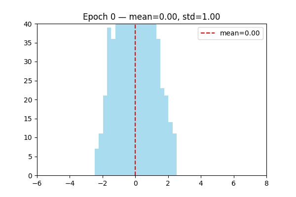
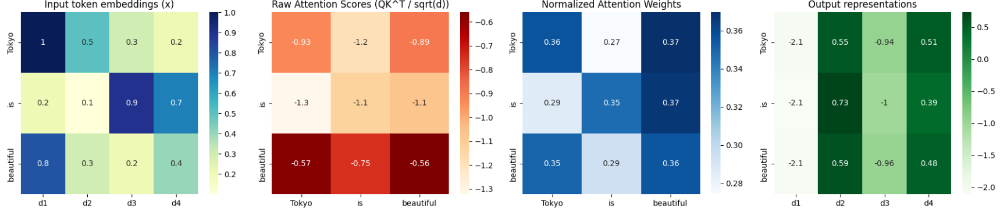
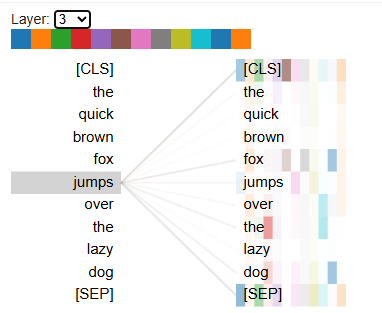
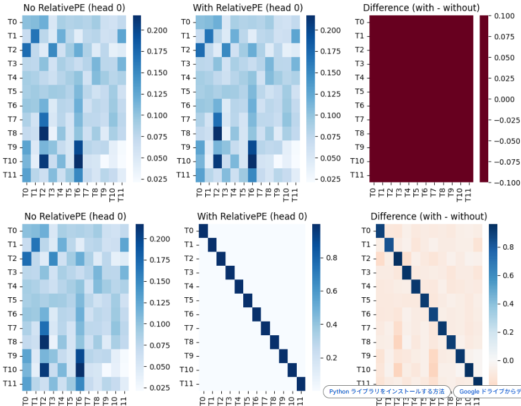
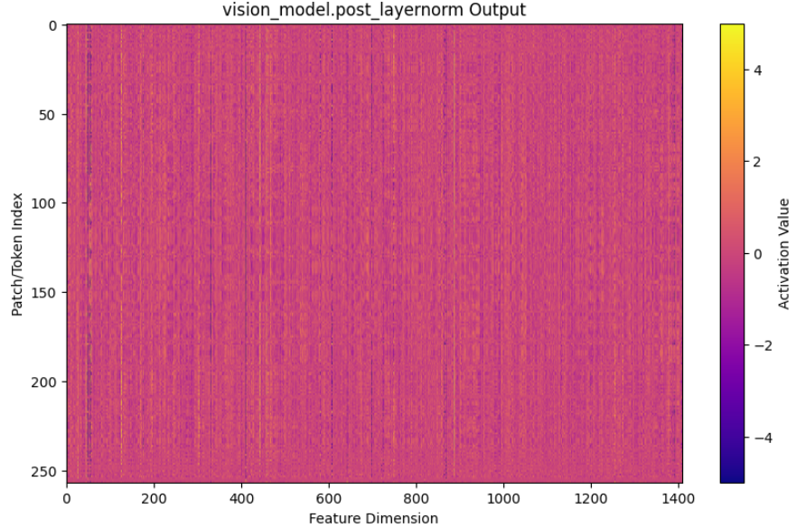
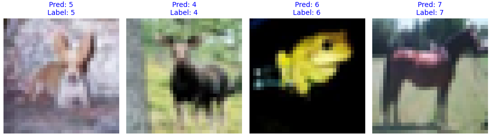

# 🎯 Purpose

This site exists to study **Large Language Models (LLMs)** and **Vision-Language Models (VLMs)** — focusing on transformer architecture internals, normalization techniques, attention mechanisms, positional encoding strategies, and internal representation analysis.

Our goal is to:

- Understand *how modern AI models work internally*
- Visualize hidden features and attention flows
- Experiment with PyTorch implementations
- Study VLM and LLM techniques hands-on

---

# 📚 Archives: Deep Learning / LLM / VLM Research Notes

Below are key experiments and notes designed to deepen understanding of **transformers**, **self-attention**, **LayerNorm**, **positional encoding**, and **Vision Transformer (ViT)** behavior.

---

## 🧠 LayerNorm Explained & Visualized (Layer Normalization in Transformers)

**Layer Normalization (LayerNorm)** stabilizes transformer model training by normalizing activations per sample (not across batch).

Formula:

\[
\text{LayerNorm}(x_i)=\gamma\frac{x_i-\mu}{\sigma+\epsilon}+\beta
\]

Where:

- \( \mu \), \( \sigma \) = mean & standard deviation of input
- \( \gamma \), \( \beta \) = learnable parameters

### ✅ Why LayerNorm Helps Transformers

- Prevents exploding/vanishing gradients
- Normalizes feature distribution across layers
- Works even with batch size = 1 → **essential for RNNs and Transformers**

> LayerNorm acts like a “signal stabilizer,” making training smooth and reliable.

### 📈 Visualization

We tracked the output distribution before and after training:

---

## 🎯 Attention Mechanism & Score Calculation

### Dot-Product Attention

\[
\text{score}(Q,K)=QK^T
\]

This builds a matrix of **token-to-token relevance** (shape: \( n \times n \)).

### Softmax Scaling

\[
\text{Attention} = \text{softmax}\left(\frac{QK^\top}{\sqrt{d_k}}\right)
\]

Scaling by \( \sqrt{d_k} \) prevents overly large values and stabilizes gradients.

---

### 🧩 Interpreting Attention Maps

Each row = **which tokens a given token attends to**.

Patterns commonly found in Transformer models:

- **Self-focus / diagonal** → local context
- **[CLS]/[EOS] attention** → global summary
- **Phrase structure attention** → syntax & semantics
- **Head specialization** → local vs long-range features

---

## 🌀 Positional Encoding

Transformers require positional signals because attention has no inherent order awareness.

### 🔷 Absolute Positional Encoding

Uses sin-cos functions at different frequencies:

- Short-range and long-range encoding
- Smooth continuous patterns across token positions

### 🔶 Relative Positional Encoding

Learns **relative distance between tokens**, enabling:

- Better generalization to longer sequences
- Position-aware attention without absolute coordinates

---

## 🔍 Visualizing Internal Features (VLM-Lens)

We use **VLM-Lens** to extract and visualize **latent internal representations** from Vision-Language Models.
Features are plotted as heatmaps to understand how the model perceives structure and texture.

---

## 🖼 Vision Transformer (ViT) Study

### Image Patching

Convert image → patch embeddings → transformer encoder:

### CIFAR-10 ViT Output Example

Trained ViT predictions on CIFAR-10:

---

## 🔗 References & Learning Resources

### 📺 NLP Colloquium (日本語)

Excellent lecture series for understanding LLM theory:
https://www.youtube.com/watch?v=NatwshCTe_4

### ⚙️ PyTorch Installation Guide

Always verify version compatibility:
https://pytorch.org/get-started/locally/

### Wiki about LLM

Here is my wili, which indicate information of LLM.

https://github.com/Shinichi0713/LLM-fundamental-study.wiki.git

### Arxiv

Here is a natural English translation:

> It is the most well-known and largest paper archive site in the machine learning field. When searching for machine learning papers, you will almost always end up here.

If you'd like a more formal or academic wording, here is another option:

> It is the most prominent and largest repository of research papers in the field of machine learning. When searching for machine learning-related papers, one will almost inevitably arrive at this site.

Let me know if you want a more casual version or one tailored for a presentation or book!

https://arxiv.org/

---

## 🏁 Summary

This site serves as a technical journal for:

- Understanding **LLM/VLM architecture**
- Visualizing **Transformer internals**
- Researching **attention, normalization, positional encoding**
- Experimenting with **PyTorch and advanced AI models**

> The goal is to approach LLMs not as black boxes, but as interpretable systems.

---

## 🚀 Coming Soon

- Self-attention head comparison
- Transformer tokenizer internals
- Cross-modal alignment in VLMs
- Feature probing & activation analysis
- AI interpretability tools directory

Stay tuned as the study evolves!

## Reference

1. Roadmap of LLM
[2. ](https://shinichi0713.github.io/LLM-fundamental-study/roadmap_llm)

2. Roadmap of VLM

https://shinichi0713.github.io/LLM-fundamental-study/roadmap_vlm

