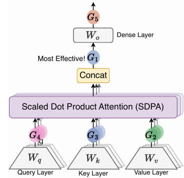
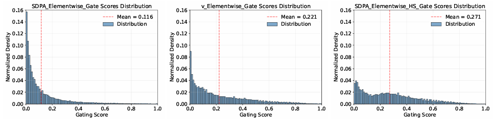
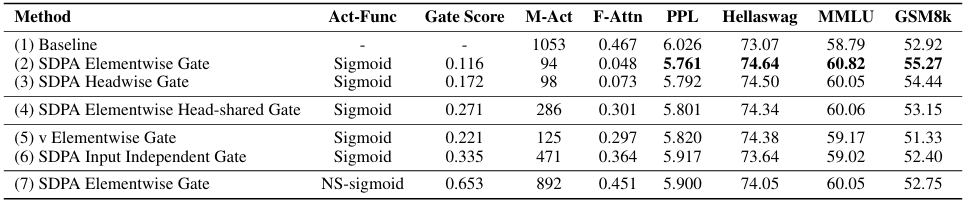

前回和訳だけだった **「Gated Attention（ゲート付きアテンション）」** について、論文をもう少ししっかりと見てみました。

現論文：https://openreview.net/forum?id=1b7whO4SfY

※以下内容の図や表は論文の引用を記載しています。

- この研究は、従来のTransformerの標準的なアテンション機構に、シンプルながら強力な「ゲート（門）」を追加することで、性能と安定性を劇的に向上させる手法を提案しています。
- 本手法はQwen3-Nextなどにも採用されている→実績が出ている手法です。

## 論文要旨

**アテンションへのゲート機構の導入：その効果と体系的な調査**

### 概要

ゲート機構（Gating mechanisms）は、初期のLSTMやHighway Networksから、最近の状態空間モデル（SSM）、線形アテンション、さらにはSoftmaxアテンションに至るまで幅広く利用されてきました。しかし、既存の文献においてゲートが具体的にどのような影響を与えるかについて調査したものは稀です。本研究では、ゲートによって拡張されたSoftmaxアテンションのバリエーションを体系的に調査するため、包括的な実験を行いました。

### 実験と発見

具体的には、3.5兆トークンのデータセットで学習された、150億パラメータ（15B）のMixture-of-Experts（MoE）モデルと17億パラメータ（1.7B）の密（Dense）モデルの30以上のバリエーションを比較しました。

* **中心的な発見:** スケール付きドット積アテンション（SDPA）の後に、 **「ヘッド固有のシグモイド・ゲート（head-specific sigmoid gate）」** を適用するというシンプルな修正を行うだけで、一貫してパフォーマンスが向上することがわかりました。
* **副次的な効果:** この修正は、学習の安定性を高め、より大きな学習率（Learning Rate）を許容し、スケーリング特性を改善します。

### 効果の要因

様々なゲートの配置位置や計算のバリエーションを比較した結果、この有効性は以下の2つの要因に集約されると考えられます。

1. Softmaxアテンションにおける低ランク・マッピングの上に**「非線形性」**を導入したこと。
2. クエリに依存した**「スパース（疎）なゲート・スコア」**を適用し、SDPAの出力を調整したこと。

特に、このスパース・ゲート機構は、異常な活性化（Massive activation）や「アテンション・シンク（Attention Sink）」現象を緩和し、ロングコンテキストにおける外挿性能を向上させることが判明しました。

## 論文で提案されている機構

自己注意機構前のQKVでsoftmaxの形で入っているのが提案されているゲート機構です。
論文中ではScaled Dot Product Attention (SDPA)という名前が付けられてます。

上の図で言う5つの場所でSDPAを導入した結果一番良い性能向上につながったのはG1の位置でした。

5つの位置：クエリ（G4）、キー（G3）、バリュー投影（G2）の後、スケールド・ドット積アテンション（SDPA）の出力（G1）の後、そして最終的なDense出力層（G5）の後。

指標の確認値：パープレキシティを最大0.2削減し、MMLUで2ポイント向上

ゲートが有効に機能した要因は２点であると考えられています。

- (i) 非線形性 (Non-Linearity):
  2つの連続する線形層（バリュー投影 $W_v$ とDense投影 $W_O$）は、1つの低ランク線形投影として書き換えることができます。したがって、位置G1またはG2にゲートを通じて非線形性を導入することで、この低ランク線形変換の表現力を高めることができます。
- (ii) 疎性 (Sparsity):
  非線形ゲートのバリエーションは一貫して性能を向上させますが、その利得には差があることを観察しました。分析の結果、ゲート・スコアの顕著な「疎性（スパース性）」がもう一つの重要な要因であり、SDPA出力に「入力依存の疎性」を導入していることが明らかになりました（セクション4.2）。疎なゲート機構は、マッシブ・アクティベーション（異常な活性化）やアテンション・シンクを排除します。従来、初期トークンは対応する隠れ状態で大きな活性化値を持ち、アテンション・スコアを不釣り合いに支配していました。先行研究では、アテンション・シンクの原因を「Softmaxの非負正規化による冗長なアテンションの蓄積」であると説明しています。私たちは実験を通じて、クエリ依存の疎なゲートをSDPA出力に適用すると、3.5兆トークンで学習したDenseモデルおよびMoEモデルの両方で、アテンション・シンクが全く発生しないことを確認しました。さらに、これらのモデルは長さの汎化（Length Generalization）において優れた性能を示し、RULERベンチマークで10ポイント以上の向上を達成しました。

ここで説明されているアテンション・シンクとマッシブ・アクティベーションは以下のような現象です。
どちらも、良くないこととわかっていたのですが、LLMの計算上やむをえない問題と思われています。

>1. アテンション・シンク (Attention Sink)  
>アテンション・シンクは、 **「文頭のトークン（主に最初のトークン）に、不自然に高いアテンション・スコアが集中してしまう現象」** です。  
>なぜ起きるのか: Softmaxアテンションの性質上、各ヘッドのスコアの合計は必ず「1」にならなければなりません。モデルが特定の文脈において「どのトークンも重要ではない」と判断したとしても、無理やりどこかにスコアを割り振る必要があります。  
>結果: 多くの場合、モデルは便宜上の「ゴミ箱」として、文頭のトークン（例：[CLS] などの特殊トークン）にスコアを押し付けます。  
>問題点: これにより、長い文章を生成する際に過去の情報をうまく参照できなくなったり、推論時の計算効率が悪化したりします。  

>2. マッシブ・アクティベーション (Massive Activation)  
>マッシブ・アクティベーションは、 **「モデルの特定の層や中間表現において、一部の数値（活性化値）が他の値に比べて異常に巨大になる現象」** です。
>- 現象: 通常の数値が $1$ や $10$ 程度の範囲にある中で、特定の次元だけが $10,000$ を超えるような巨大な値を持つことがあります。これは特にネットワークの後半の層で顕著になります。
>- 原因: Layer Normalizationなどの正規化処理や、Softmaxの非負性によって、数値が特定の方向に「蓄積」され続けることが原因の一つと考えられています。
>- 問題点: * 学習の不安定化: 値が大きすぎると勾配が爆発しやすく、ロススパイク（損失の急上昇）の原因になります。量子化の困難さ: モデルを軽量化（量子化）しようとする際、一部に巨大な値があると、他の小さな値の精度が潰れてしまい、性能が著しく劣化します。

### 機構の数式

ゲート機構は次のように定式化されます：

$$Y' = g(Y, X, W_\theta, \sigma) = Y \odot \sigma(XW_\theta)$$

ここで、
- $Y$ は調整対象となる入力
- $X$ はゲートスコアの計算に用いられる別の入力（本研究ではプレ・ノーマライゼーション後の隠れ状態を採用）
- $W_\theta$ は学習可能なゲートのパラメータ
- $\sigma$ は活性化関数（例：シグモイド）
- $Y'$ はゲート適用後の出力です。
 
ゲートスコア $\sigma(XW_\theta)$ は動的なフィルターとして機能し、$Y$ の特徴を選択的に保持または消去することで、情報の流れを制御します。

### 考察
結構ここが肝となるべきポイントです。

#### なぜゲートが効くのかという理由

__クレーム1： アテンションにおける低ランク・マッピングの表現力を非線形性が向上させる__

1. マルチヘッド・アテンションの適用による低ランク・マッピング問題

論文の引用ですが、マルチヘッド・アテンションがバリュー（$W_V$）の計算と出力（$W_O$）の計算が連続しているため、数学的には一つの「薄い（低ランク）」行列にまとまってしまい、複雑な表現が苦手にしているという現象が起こっています。

具体的には以下の通りです。式からの下りは論文を適用します。

マルチヘッド・アテンションにおいて、$k$番目のヘッドに対応する$i$番目のトークンの出力 $o^k_i$ は、次のように表現できます。

$$o^k_i = \left( \sum_{j=0}^{i} S_{ij}^k \cdot X_j W_V^k \right) W_O^k = \sum_{j=0}^{i} S_{ij}^k \cdot X_j (W_V^k W_O^k) \quad \dots \text{(式6)}$$

- $W_O^k$ は出力層 $W_O$ のうち$k$番目のヘッドに対応するパラメータ
- $S_{ij}^k$ はアテンション・スコア、$X_j$ は入力
- $X_j W_V^k$ はバリュー（Value）の出力

式6からわかるように、$W_V^k W_O^k$ はすべての $X_j$ に適用される、一つの低ランク線形写像（$d_k < d_{model}$）に統合できてしまいます。
GQA（Grouped Query Attention）を用いている場合、$W_V$ はグループ内のヘッド間で共有されるため、表現力はさらに低下します。

2. 非線形による表現能力の向上

2つの線形写像の間に非線形性を加えることで表現力が向上するという知見に基づき、この低ランク問題を緩和するために2つの修正案を検討しました：

$$o^k_i = \sum_{j=0}^{i} S_{ij}^k \cdot \text{Non-Linearity-Map}(X_j W_V^k) W_O^k \quad \dots \text{(式7)}$$

$$o^k_i = \text{Non-Linearity-Map} \left( \sum_{j=0}^{i} S_{ij}^k \cdot X_j W_V^k \right) W_O^k \quad \dots \text{(式8)}$$

注目すべきは、位置G2へのゲート追加（表3の3行目）が1番目の修正（式7）に対応し、位置G1へのゲート追加（4行目）やグループ・ノーマリゼーション（5行目）が2番目の修正（式8）に対応している点です。
アブストで述べられていた結果 ・ "$W_O$ の後の位置 G5 にゲートや正規化を加えても効果がなかった" 理由も説明できます。
G5では、$W_V$ と $W_O$ の間の非線形性不足という問題が解決されないためです。

位置G1での加算型ゲートでは、ゲートの出力が SiLU を通過するため（表3の4行目）、これも非線形性を導入することになり、乗算型ゲートほどではないものの、パフォーマンスの向上に寄与しています。

ここまでの洞察に基づき、さらに2つの追加実験を行いました：

1. パラメータを追加せず、位置G1に SiLU のみを加える（表3の6行目）。このシンプルな修正でもPPLはわずかに減少しますが、ベンチマークスコアの多くは変化しませんでした。
2. 加算型ゲートから SiLU を取り除き、ゲート後の出力を直接G1に加算する（表3の7行目）。これにより、加算型ゲートの利得はさらに減少しました。

つまり、効果的なゲート・バリエーションによる性能向上は、おそらく $W_V$ と $W_O$ の間に非線形性を導入したことに起因します。

位置G1とG2へのゲート適用はどちらもこの非線形性を導入できますが、得られる性能向上には差があります。

この結果が、先述の2つの位置におけるゲートの影響をさらに解析しようというモチベーションとなったようです。

__クレーム2: ゲートが入力依存の疎性を導入する__

バリュー（G2）およびSDPA出力（G1）の位置にゲートを適用したモデルのゲートスコアを分析した結果について示されています。

結果については以下の洞察が得られています。

1. 効果的なゲートスコアは「疎（Sparse）」である

SDPA出力へのゲート適用（要素単位/ヘッド単位）は、最も低い平均ゲートスコアを示しました。
さらに、SDPA出力のゲートスコア分布（図3左）は0付近に高度に集中しており、実質的な疎性を示しています。

標準的なアテンション機構は、文脈の中から関連しそうな情報を集めてきますが、その中には「ノイズ」も多く含まれています。 ゲートが疎である（0を出す）ということは、「この情報は現在のクエリ（問い）には100%不要である」とモデルが断定し、完全に遮断できることを意味します。

つまり、ゲートが本質の見極めに注力しているということを示します。

2. クエリ依存性（Query-Dependency）が重要である

バリュー・ゲート（G2）のスコアはSDPA出力ゲート（G1）よりも高く、パフォーマンスも劣っていました。
これは、ゲートスコアの疎性は、キーやバリューによって決定されるよりも、クエリに依存する場合にさらに効果的であることを示唆しています。

この結果は、「クエリ依存性（Query-Dependency）」が重要であるという結果は、モデルが　**「今、何を探しているか」という目的に基づいて、情報を取捨選択できていること**　ということになりますよね。

例えば。
長い文章を読んでいるとき、以前に出てきた単語（Value）自体は重要であっても、現在の質問文（Query）にとっては全く無関係な場合があります。

こんな時に、クエリ依存であれば、その単語は一般的には重要だが、今の私の質問には関係ない」と判断してゲートを閉じることができます。これにより、過去の情報の「引きずり」をリセットし、現在必要な情報だけに集中できるのです。

### 要点の解説：なぜ「ゲート」が効くのか？

このセクションの議論を視覚的に整理すると以下のようになります。

1. **「行列の合体」問題**: 従来のTransformerでは、バリュー（$W_V$）の計算と出力（$W_O$）の計算が連続しているため、数学的には一つの「薄い（低ランク）」行列にまとまってしまい、複雑な表現が苦手でした。
2. **非線形性の「くさび」**: その2つの行列の間にゲート（非線形関数）を差し込むことで、行列の合体を防ぎ、モデルの表現能力を強制的に引き上げています。
3. **なぜG1（SDPA後）が良いのか**: 数式的に、アテンションで集計した**後の**結果に対して非線形フィルターをかける方が、集計**前の**各要素にかけるよりも効率的に情報を整理できることを示唆しています。

### 実装例
論文の内容をもとにGatedAttentioを実装しました。

#### 実装のポイント
__1. ゲートの入力（X）:__

論文の脚注にある通り、レイヤーの最初で正規化された状態（x_norm）をゲートスコアの計算に使用しています。これにより、現在入力されているトークンの情報に基づいてフィルターを生成できます。

__2. Head-specific（ヘッド固有）:__ 

self.gate_proj が各ヘッド（num_heads）に対して異なるスカラー値を出力します。これにより、あるヘッドは情報を「通し」、別のヘッドは「遮断する」といった独立した制御が可能になります。

__3. 疎性（Sparsity）の発生:__

torch.sigmoid を通した後の値が 0 に近づくと、そのヘッドのその位置の出力は完全に消去されます。これが「アテンション・シンク」を消し去る物理的な仕組みです。

コードは以下に保管しています。
ご参考下さい。

[llmのレポジトリ](https://github.com/Shinichi0713/LLM-fundamental-study/tree/main/attention)

## 選考委員会による選評
本論文が評価された点についても後述させて頂きます。

### 1. 主要な発見の評価

本論文の主な発見は、DenseモデルとMoEモデルの両方において、SDPA操作の後に「ヘッド固有のシグモイド・ゲート」を導入することで、Softmaxアテンションを用いる大規模言語モデル（LLM）の性能を一貫して向上させることができるという点です。この発見は、最大3.5兆トークンの大規模データセットで訓練されたモデルを用いた、30以上の実験によって裏付けられています。

### 2. 分析の緻密さと実用性

著者らの推奨するゲート形式の導入が、LLMの学習の安定性を向上させ、広く報告されている「アテンション・シンク」現象を減少させ、さらに文脈長の拡張性能（Context length extension）を高めることを、本論文は入念な分析を通じて示しています。

本論文の推奨事項は**実装が容易**であり、アーキテクチャ修正に関する広範な証拠が提示されていることから、このアイデアは広く採用されることが予想されます。

## 所感
本論文は実装の後にされている洞察が非常に秀逸です。

一般的に知られた事実ですが、結果と結びつくと本当に納得がいき、今後の応用のモチベーションとなります。

1. 線形と線形の間に非線形処理を加えると表現力が向上する。
2. 不要な情報をしっかりと見極める機構が必要である。
3. 情報探索する主体はクエリであり、クエリ依存の構成になるアーキテクチャを進んで採用するべき。

論文で紹介された手法ですが既にQwen3で採用されている手法であり、実績もありと見れます。

ということで有意な論文の紹介でした。ご参考頂けば幸いです。

