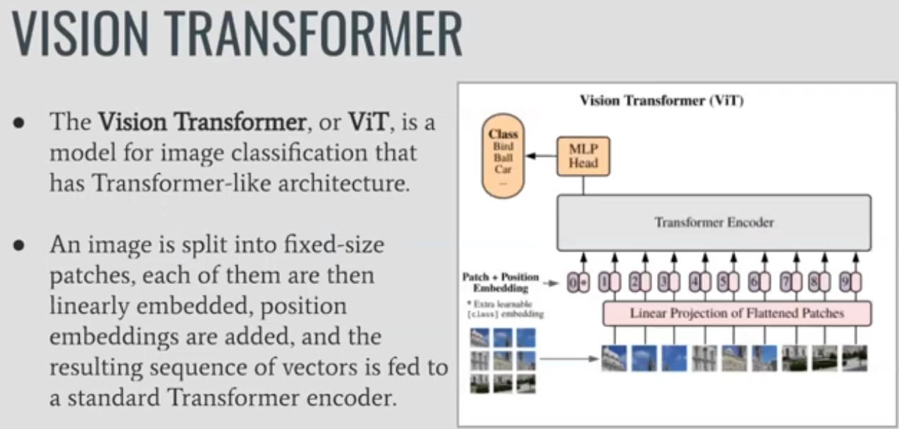
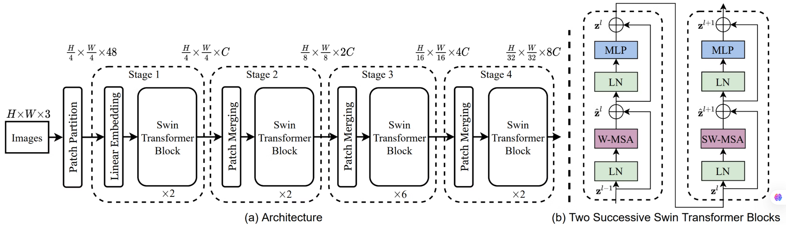
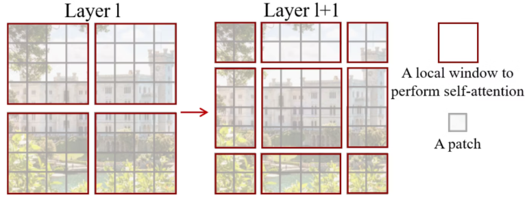
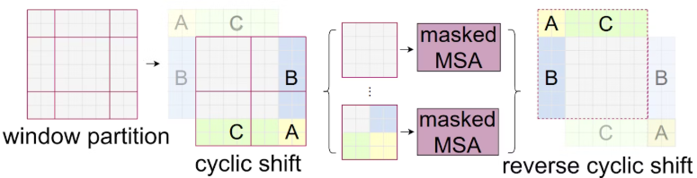

# SWIN TRANSFORMER
SoTAパフォーマンスをビジョンタスクで達成した・・・？

## 概要
Visionをパッチングにより分割して埋め込み表現化。→ポジショナルエンコーダを埋め込みされる。
その後は通常のTransformerに入力。

Vision Transformerは、自然言語処理で成功したTransformerを画像認識に適用した手法

オリジナルのVision Transformerは、画像サイズが大きくなるほど計算複雑度が2乗に増大するという問題がありました。

Swin Transformerは、この問題を解決するために、特徴マップを重なりのないウィンドウに分割し、各ウィンドウに対してself-attentionを計算するWindow-based Self-Attentionを採用しました。

結果：計算複雑度を線形に低減。処理を高速化

ウィンドウをずらしてアテンションを行うShifted Window-based Self-Attentionを組み込みむことで、隣接するウィンドウとの関連性を考慮した処理が可能になりました。

また、Swin Transformerは、画像の細部から全体までの特徴を取得するために、パッチを結合して階層的に処理する構造を採用しています。

## アーキテクチャ

1. Patch Partitionで、入力RGB画像を重ならないパッチに分割→パッチサイズは4×4なので、各パッチのチャンネルの次元は4×4×3=48です。
2. Linear Embeddingを適用して、チャンネルの次元数を、任意の次元数 $C$ に変換
3. Swin Transformer Blockでは、特徴マップをウィンドウに分割し、各ウィンドウで、Multi-head Self Attention(MSA)を適用

MSA(Multi-head Self Attention)に適用するウィンドウの配置により2種類存在する。
- Window-based MSA(W-MSA)
- Shifted W-MSA(SW-MSA)

Patch Mergingは、複数のパッチを結合して、パッチ数を減らし、階層的な構造を作成します。結果として、解像度を半分、チャンネルを2倍にします。

## W-MSAとSW-MSA

図の左側は、ウィンドウサイズ( $M$ )ごとに等間隔で分割する標準的な方法です。

右側はウィンドウサイズの半分 ( $M/2$ )
だけシフトした位置から、ウィンドウサイズごとに分割するシフトした方法です。

レイヤーごとに分割方式を交互に変えることでウィンドウ間で情報のやり取りが可能となる。

__出来るようになったこと__
ウィンドウを常に同じ方法で分割していると、そのウィンドウ内の情報しか得ることができません。

ウィンドウをシフトすると、シフトしたウィンドウは、1つ前のレイヤーで分割された隣接のウィンドウと相互作用することができます。

__ウィンドウサイズの不均一__

ここで、hとwは特徴マップの縦と横のサイズを表します。また、一部のウィンドウはM×Mよりも小さくなります。

