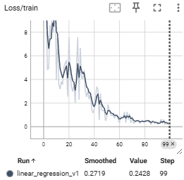
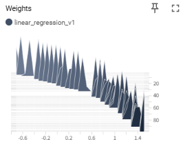
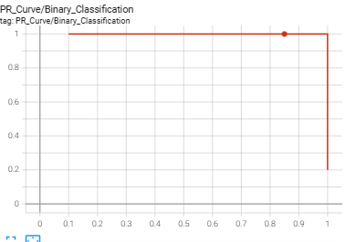
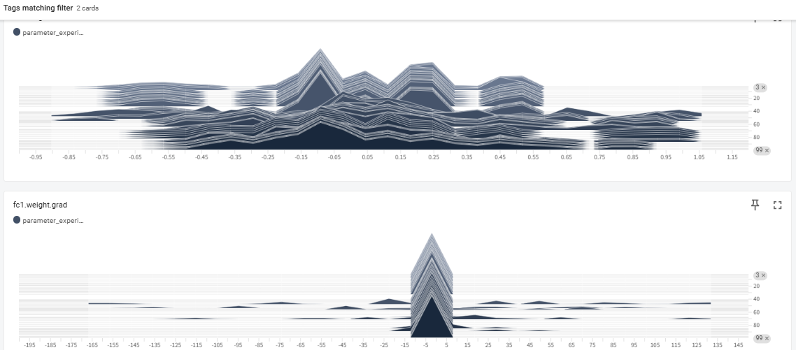

# Puropose

Here, introduce the development tools, which can be utility for AI development.


## What is TensorFlow?

**TensorFlow** is an **open-source library for machine learning and deep neural networks** developed by Google.

In short, it is a **foundation for performing advanced mathematical calculations (such as matrix operations) efficiently on GPUs and CPUs.** It acts as an "OS" or "engine" for AI development and is currently one of the most widely used tools in the world alongside PyTorch.

## Key Features of TensorFlow

TensorFlow is an extremely powerful tool, especially in the phase of **"building AI and deploying it as a service for real-world users."**

It powers the infrastructure behind familiar, large-scale systems such as Google Search, YouTube recommendations, and Google Translate.

### 1. Strong for Large-Scale Commercial and Industrial Use

TensorFlow is designed with a heavy focus on "commercial deployment (integration into products)" rather than just "research."

* **TensorFlow Serving:** A system designed to deploy trained models on servers for high-speed inference.
* **TensorFlow Lite:** A rich set of tools for slimming down models to run on mobile devices (iOS/Android) and IoT hardware.

### 2. Flexible Execution Environments

It is optimized not only for PC CPUs/GPUs but also for  **TPU (Tensor Processing Unit)** —Google's proprietary AI chips. This allows for extremely high-speed training of ultra-large-scale models.

### 3. Comprehensive Ecosystem

It features a complete suite of peripheral tools covering the entire AI development lifecycle, such as **TensorBoard** for visualization and **tf.data** for efficient data preprocessing.

---

## What is a "Tensor"?

The name "Tensor" refers to a **multidimensional array (a block of data).**

* **0D:** Scalar (a single number)
* **1D:** Vector (a list/row)
* **2D:** Matrix (a table/grid)
* **3D or higher:** Tensor (a multi-dimensional block of data)

AI performs learning and prediction by having these "Tensors" "Flow" through a network. This is the origin of the name  **TensorFlow** .

### Relationship with Keras

When discussing modern TensorFlow (version 2.0 and later), **Keras** is an essential component.

* **TensorFlow:** High performance, but the code tends to be complex.
* **Keras:** Allows for writing models using intuitive commands that are easy for humans to understand.

Today, Keras is integrated as the official interface for TensorFlow. The standard style is: **"TensorFlow handles the complex calculations under the hood, while humans use Keras to give simple commands on the surface."**

### Comparison with PyTorch

| **Feature**      | **TensorFlow**                      | **PyTorch**                          |
| ---------------------- | ----------------------------------------- | ------------------------------------------ |
| **Developer**    | Google                                    | Meta (Facebook)                            |
| **Primary Use**  | Large-scale services, Mobile, Industry    | Research, Academic papers, Modern AI dev   |
| **Coding Style** | Previously difficult, now easy with Keras | Intuitive; similar to standard Python code |
| **Debugging**    | Improved, but used to be difficult        | Highly accessible and straightforward      |

---

## What You Can Visualize in TensorFlow (TensorBoard)

TensorBoard provides several "tabs" to visualize different types of data recorded during training.

### 1. Scalars (Line Graphs)

The most frequently used feature. It tracks a single value, such as Loss or Accuracy, over time.

* **Capabilities:** Check the learning curve to determine if the model is converging or if overfitting is occurring.
* **Example:** Overlay multiple experiments to compare which Learning Rate converges the fastest.



### 2. Histograms & Distributions

Displays how the values of Tensors—such as Weights, Biases, and Gradients—are distributed.

* **Capabilities:** Check if weights are becoming abnormally large ( **Gradient Explosion** ) or not moving at all ( **Gradient Vanishing** ).
* **Example:** Debug the model structure or initialization by checking if neurons in a specific layer are "dead" (stuck near 0).

```python
import torch
import torch.nn as nn
import torch.optim as optim
from torch.utils.tensorboard import SummaryWriter  # 1. ライブラリのインポート

# ログを保存するディレクトリを指定してインスタンス作成
# 名前を変えることで、複数の実験（学習率違いなど）を比較できます
writer = SummaryWriter('runs/linear_regression_v1')

# ダミーのモデルとデータ
model = nn.Linear(1, 1)
criterion = nn.MSELoss()
optimizer = optim.SGD(model.parameters(), lr=0.01)

# 学習ループ
for epoch in range(100):
    inputs = torch.randn(10, 1)
    targets = inputs * 2.0 + 0.5
  
    # Forward / Backward
    outputs = model(inputs)
    loss = criterion(outputs, targets)
  
    optimizer.zero_grad()
    loss.backward()
    optimizer.step()

    # 2. スカラー値（損失など）を記録
    writer.add_scalar('Loss/train', loss.item(), epoch)
  
    # 3. 重みの分布を記録（ヒストグラム）
    writer.add_histogram('Weights', model.weight, epoch)

# 4. 書き込みを終了
writer.close()
```



### 3. Graphs (Computational Graphs)

Visualizes the network structure of the model.

* **Capabilities:** Confirm that layers are connected correctly and that data shapes are changing as intended.
* **Example:** Check if the calculation order matches the design in complex models with branches or Skip Connections.


### 4. Images, Audio, & Text (Media Data)

Displays input data or data generated by the model during training.

* **Capabilities:** In Generative AI, monitor in real-time how generated images become clearer epoch by epoch.
* **Example:** Visually compare Ground Truth (GT) with predicted results in tasks like semantic segmentation.

### 5. Projector (Dimensionality Reduction)

Projects high-dimensional data (Embeddings) into a 3D or 2D space.

* **Capabilities:** Use techniques like PCA or t-SNE to see if features of similar words or images are clustered together.
* **Example:** Verify in an NLP model if words with similar meanings are positioned closely.

### 6. PR Curves (Precision-Recall Curves)

Visualizes the tradeoff between Precision and Recall.

* **Capabilities:** Analyze model performance on imbalanced datasets in detail, which cannot be captured by Accuracy alone.

```python
import torch
import torch.nn.functional as F
from torch.utils.tensorboard import SummaryWriter
import numpy as np

# 1. TensorBoardの準備
writer = SummaryWriter('runs/pr_curve_experiment')

# 2. ダミーデータの作成（例：100個のサンプル）
# 実際には、テストデータに対するモデルの推論結果を使用します
num_samples = 100

# 正解ラベル（0 または 1）
# 不均衡データをシミュレート（1が少なく、0が多い）
true_labels = torch.cat([torch.ones(20), torch.zeros(80)]) 

# モデルの予測スコア（0.0 〜 1.0 の確率値）
# 正解に近い値を予測できているケースを想定
predictions = torch.cat([
    torch.rand(20) * 0.5 + 0.5, # 正解が1のグループには高めのスコア (0.5~1.0)
    torch.rand(80) * 0.7        # 正解が0のグループには低めのスコア (0.0~0.7)
])

# 3. add_pr_curve で記録
# tag: グラフの名前
# labels: 正解ラベル (0 or 1)
# predictions: モデルが出力した確率値
writer.add_pr_curve('PR_Curve/Binary_Classification', true_labels, predictions, global_step=0)

# 4. 複数エポックをシミュレーション（学習が進んで精度が上がる様子を記録）
for epoch in range(1, 5):
    # 学習が進むにつれ、予測精度が向上していくダミーデータ
    improved_preds = torch.cat([
        torch.rand(20) * 0.3 + 0.7, # スコアがより1に寄る
        torch.rand(80) * 0.4        # スコアがより0に寄る
    ])
    writer.add_pr_curve('PR_Curve/Binary_Classification', true_labels, improved_preds, global_step=epoch)

writer.close()
print("PR Curve has been logged. Run 'tensorboard --logdir=runs' to view.")
```



### 7. HParams (Hyperparameter Dashboard)

Provides an overview of the correlation between settings (Learning Rate, Batch Size, etc.) and final Accuracy.

* **Capabilities:** Use parallel coordinates plots to analyze which combination of parameters yielded the best performance.

### 8. Profile (Profiler)

Analyzes GPU and memory usage efficiency in detail.

* **Capabilities:** Identify bottlenecks, such as whether the GPU is idling due to slow data loading (DataLoader).

## How to monitor NN

To monitor neural network training effectively, analyzing the distribution of parameters like weights and gradients is crucial for diagnosing "black box" behavior. By using tools like TensorBoard to visualize histograms, developers can detect critical issues such as vanishing or exploding gradients and identify whether the model is healthily adapting to data. Healthy training typically shows a rigid initial distribution evolving into a smooth normal distribution, whereas abnormal shapes signal the need for adjustments in learning rates or initialization. Ultimately, parameter analysis provides the necessary transparency to ensure that a model is not only learning efficiently but also building a reliable logical foundation.




### Summary: Which Feature to Use

| **What you want to see**          | **Feature Name**               |
| --------------------------------------- | ------------------------------------ |
| Training progress / Overfitting         | **Scalars**                    |
| Model network diagram                   | **Graphs**                     |
| Weight abnormalities / Stalled learning | **Histograms / Distributions** |
| Actual output images or audio           | **Images / Audio**             |
| Clusters of word or image features      | **Projector**                  |
| Slow calculation points (Bottlenecks)   | **Profile**                    |
