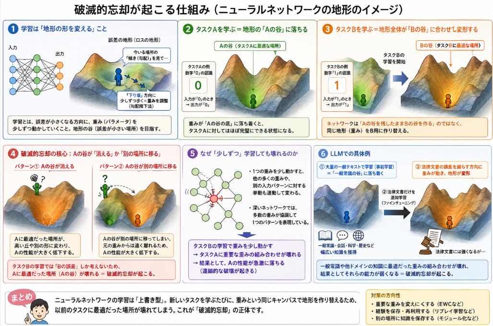

## 概要

**破滅的忘却（catastrophic forgetting）** とは、ニューラルネットワークが**新しいタスクやデータを学習する際に、以前に学習した知識を急激に失ってしまう現象**のことです。

## 経緯
破滅的忘却はLLMが出てくる以前に既に問題と考えられてきました。
破滅的忘却が問題視されてきた経緯を、年代順に整理すると以下のようになります。

### 1980年代末〜1990年代初頭：現象の指摘と命名

- **1989年：McCloskey & Cohen**  
  - 連想記憶モデル（connectionist models）において、  
    **新しいタスクを順番に学習すると、以前のタスクの知識が急激に失われる**ことを示す[MHTECHIN Technologies](https://www.mhtechin.com/support/catastrophic-forgetting-in-continual-learning)。  
  - この現象を **catastrophic interference**（破滅的干渉）と呼び、  
    ニューラルネットワークが人間と異なり「連続学習」に弱いことを明確にしました。

- **1990年：Ratcliff**  
  - 同様の現象を別の観点から確認し、  
    **小さな逐次更新でも既存知識が大きく破壊される**ことを示す[MHTECHIN Technologies](https://www.mhtechin.com/support/catastrophic-forgetting-in-continual-learning)。  
  - ここで「ニューラルネットは逐次学習に弱い」という認識が広まり、  
    破滅的忘却が**理論的・実験的に確立された問題**として扱われるようになります。

### 1990年代〜2000年代：理論的・限定的な関心

- この時期は、ニューラルネットワーク自体がまだ「深いモデル」ではなく、  
  実用規模のモデルも少なかったため、破滅的忘却は**理論的な興味**として扱われることが多かったとされています[Wikipedia](https://en.wikipedia.org/wiki/Neural_network_(machine_learning))。  
- 連続学習（continual learning）や lifelong learning の文脈で研究は続きますが、  
  実用上の大きなボトルネックとして強く意識されるのは、もう少し後になります。

### 2010年代：ディープラーニングの台頭と再注目

- **2013年：Goodfellowら**  
  - **An empirical investigation of catastrophic forgetting in gradient-based neural networks**（arXiv:1312.6211）で、  
    勾配ベースのニューラルネットワークにおける破滅的忘却を**体系的に測定・分析**[Schmidhuber (2015)](https://faculty.sites.iastate.edu/tesfatsi/archive/tesfatsi/DeepLearningInNeuralNetworksOverview.JSchmidhuber2015.pdf)。  
  - ディープラーニングが広く使われるようになり、  
    「大規模モデルでも同じ問題が起きる」ことが明確になります。

- **2017年：Kirkpatrickら（DeepMind）**  
  - **Overcoming catastrophic forgetting in neural networks**（PNAS）で、  
    **EWC（Elastic Weight Consolidation）** を提案[PNAS](https://www.pnas.org/doi/10.1073/pnas.1611835114)。  
  - 重要パラメータを「固める」ことで、新しいタスク学習時に既存タスクの性能を保つ手法を示し、破滅的忘却が**実用上の大きな課題**として再び注目されます。

### 2010年代末〜2020年代：LLM・大規模基盤モデル時代の「現実の問題」へ

- **LLM・大規模基盤モデルの普及**  
  - GPT系・BERT系など、**何百万ドル規模の計算コスト**で学習されたモデルが登場[rewire.it](https://rewire.it/blog/the-stability-plasticity-dilemma-how-memory-architectures-are-solving-continual-learning)。  
  - モデルを「毎回ゼロから学習し直す」ことが現実的でなくなり、**追加学習（ファインチューニング）での破滅的忘却**が、サービス運用上の深刻な問題として浮上します。

- **LoRAなどのパラメータ効率手法でも忘却が残る**  
  - 2020年代の研究では、  
    - フルファインチューニングで**以前のタスクのF1スコアが89%低下**  
    - LoRAのような軽量手法でも**71%の忘却率**が観測されるケースがある  
    などが報告されています[rewire.it](https://rewire.it/blog/the-stability-plasticity-dilemma-how-memory-architectures-are-solving-continual-learning)。  
  - 「モデル規模が大きいほど忘却が深刻になる」という逆説的な結果も示され、破滅的忘却が**LLM時代の中心的な課題**として再認識されています。

## LLMにおける破滅的忘却の特徴

LLM（大規模言語モデル）でも、以下のような形で破滅的忘却が問題になります。

- **追加学習（ファインチューニング）の影響**  
  - あるドメイン（例：法律文書）に特化してファインチューニングすると、  
    一般常識や他のドメインの知識が弱くなることがあります。
- **指示追従（instruction tuning）の影響**  
  - 「ユーザーの指示に従う」ように学習すると、  
    元の言語モデルが持っていた**知識の一部が曖昧になる**ことがあります。
- **モデル更新時の挙動**  
  - 新しいバージョンで追加学習を行うと、以前のバージョンでできていたタスクができなくなる、  
    あるいは出力のスタイルが大きく変わることがあります。

## なぜ起こるのか

破滅的忘却が起きる仕組みは、**ニューラルネットワークの学習が「パラメータの上書き」で行われる**ことにあります。  
順を追って説明します。

### 1. ニューラルネットワークの学習は「地形の形を変える」こと

ニューラルネットワークは、たくさんの「重み（パラメータ）」を持っています。  
学習とは、**「誤差が小さくなる方向に、少しずつ重みを動かす」** ことです。

- 入力 → ネットワーク（重み） → 出力  
- 出力と正解の差（誤差）を小さくするように、重みを調整

これを**勾配降下法**と呼びますが、イメージとしては：

> 広い地形（誤差の地形）の上で、「今立っている場所の傾き」を見て、  
> 少しずつ「下り坂」方向に歩いていく

という感じです。

### 2. タスクAを学ぶ＝地形の「Aの谷」に落ちる

タスクA（例：数字「0」の認識）を学習すると、  
ネットワークの重みは「Aの谷」と呼ばれる**誤差が小さい場所**に落ち着きます。

- 入力が「0」のとき → 出力が「0」と正しく出る  
- そのときの重みの組み合わせが「Aの谷」の底

この状態では、**タスクAに対してはほぼ完璧**です。

### 3. タスクBを学ぶ＝地形全体が「Bの谷」に合わせて変形する

次に、タスクB（例：数字「1」の認識）を学習すると、  
ネットワークは**同じ重みを使って**、今度は「Bの谷」を目指して動き出します。

- 入力が「1」のとき → 出力が「1」と正しく出るように重みを動かす  
- その過程で、**地形全体（誤差の形）がBに合わせて変形**する

ここで重要なのは：

> ネットワークは「Aの谷を保ったままBの谷を作る」のではなく、  
> **同じ地形をB用に作り替える**だけ

ということです。

### 4. 破滅的忘却の核心：Aの谷が「消える」か「別の場所に移る」

タスクBを学習するとき、勾配降下法は **「Bの誤差を減らす方向」** にしか重みを動かしません。  
Aの誤差は考慮されません。

その結果：

- Aの谷があった場所は、Bの学習によって**別の形（高い丘や別の谷）に変形**される  
- あるいは、Aの谷そのものが**地形上から消えてしまう**

ということが起きます。

これが**破滅的忘却**です。

> 新しいタスクBを学ぶために地形を変えたら、  
> 以前のタスクAに最適だった場所（Aの谷）が壊れてしまった

### 5. なぜ「少しずつ」学習しても壊れるのか

「少しずつ動かしているのに、なぜ急に忘れるの？」と感じるかもしれませんが、  
ニューラルネットワークの重みは**互いに強く結びついている**ためです。

- 1つの重みを少し動かすと、**別の入力パターンに対する挙動も連動して変わる**  
- 特に深いネットワークでは、**多数の重みが協調して1つのパターンを表現**している

そのため：

- タスクBの学習で重みを少し動かす  
- それが**タスクAに重要な重みの組み合わせを壊す**  
- 結果として、Aの性能が**急激に落ちる**

という「連鎖的な破壊」が起きます。

### 6. LLM（大規模言語モデル）での具体例

LLMでも同じ仕組みで破滅的忘却が起きます。

- まず、大量の一般テキストで学習 → 「一般常識の谷」に落ち着く  
- 次に、法律文書だけを追加学習（ファインチューニング）  
  - 法律文書の誤差を減らす方向に重みを動かす  
  - その過程で、**一般テキストに最適だった重みの組み合わせが壊れる**  
- 結果：法律文書には強くなるが、**一般常識や他ドメインの知識が弱くなる**

## 対策

破滅的忘却の仕組みは、

> 新しいタスクBを学ぶために勾配降下法で地形（誤差の地形）を変えると、  
> 古いタスクAに最適だった「Aの谷」が壊れてしまう

というものでした。  
対策は、**この「Aの谷を壊さないように地形を変える」** ための工夫です。

### 1. 再学習（Rehearsal）／リハーサルデータ

**仕組みとの関係**  
- 破滅的忘却：Bだけを学習 → 地形がB用にだけ変形 → Aの谷が壊れる  
- 再学習：**AとBを同時に学習** → 地形が「AとBの両方に良い場所」を探す

**具体的な方法**  
- 過去のタスクAのデータの一部を保存しておき、  
  新しいタスクBを学ぶときに**Aのデータも混ぜて一緒に学習**する  
- あるいは、Aのデータを生成する**生成モデル（GANなど）**で擬似的に再現する

**なぜ効くか**  
- 勾配降下法が「Bの誤差だけ」を見て動くのではなく、  
  **Aの誤差も同時に見て動く**ため、  
  Aの谷を完全に壊す方向には進みにくくなります。  
- 地形が「AとBの両方に良い谷」を探すように変形されるイメージです。

### 2. 正則化（Regularization）／EWC など

**仕組みとの関係**  
- 破滅的忘却：B学習で重みを自由に動かす → Aに重要な重みも動いて壊れる  
- 正則化：**Aに重要な重みを「固める」** → B学習でも動かしにくくする

**代表例：EWC（Elastic Weight Consolidation）**  
- タスクAを学習した後、  
  - どの重みがAにとって重要かを推定（Fisher情報など）  
  - 重要な重みほど「動かしたら大きなペナルティ」をかける  
- タスクBを学習するとき、  
  - 勾配降下法で重みを動かすが、**重要重みを大きく動かすと損失が増える**  
  - 結果として、Aの谷を壊さない範囲でBの谷を探す

**なぜ効くか**  
- 地形のうち「Aの谷の形を決めている部分」を**バネで固定**するイメージ  
- B学習で地形を変形させても、**Aの谷の底の形はあまり変わらない**  
- つまり、**Aの谷を壊さずにBの谷を作る**ことができる

### 3. アダプタ／LoRA など（一部パラメータだけ更新）

**仕組みとの関係**  
- 破滅的忘却：全パラメータをB用に動かす → Aの谷全体が変形  
- アダプタ：**一部のパラメータだけをB用に追加** → Aの地形はほぼそのまま

**代表例：LoRA（Low-Rank Adaptation）**  
- 既存の重み行列 $W$ に、小さな行列 $A, B$ を追加して  
  $W' = W + AB$ のようにする  
- 学習時は、**元の $W$ は固定**し、**追加の $A, B$ だけを更新**する

**なぜ効くか**  
- Aの谷を作っているのは主に元の $W$  
- B学習では $A, B$ だけを動かすので、**Aの地形はほとんど変わらない**  
- Bの谷は「Aの地形の上にちょっとした凹凸を追加する」イメージ  
- 結果として、Aの性能を保ったままBに適応できる

### 4. マルチタスク学習（同時学習）

**仕組みとの関係**  
- 破滅的忘却：A→Bと順番に学ぶと、B学習でAの谷が壊れる  
- マルチタスク：**AとBを最初から同時に学ぶ** → 地形が「AとBの両方に良い谷」に落ちる

**具体的な方法**  
- 学習データにAとBの両方を混ぜて、**最初からマルチタスクで学習**する  
- あるいは、追加タスクBを学ぶときも、Aのデータを混ぜ続ける

**なぜ効くか**  
- 勾配降下法が常に**AとBの両方の誤差**を見て地形を変形する  
- そのため、地形は「Aだけ」「Bだけ」に特化せず、  
  **両方にバランスよく良い谷**を探す  
- 順番学習で起きる「Aの谷を壊してBの谷を作る」という動きがそもそも起きない

### 5. タスクごとの専用ヘッド／マスク

**仕組みとの関係**  
- 破滅的忘却：同じネットワークをAとBで共用 → 重みが干渉  
- 専用ヘッド：**タスクごとに出力層（ヘッド）を分ける** → 干渉を減らす

**具体的な方法**  
- 共通の「特徴抽出部分」は共有し、  
  - タスクA用の出力層  
  - タスクB用の出力層  
  を別々に持つ  
- Bを学ぶときは、B用のヘッドだけを更新し、A用のヘッドは固定する

**なぜ効くか**  
- Aの谷は「共通部分＋Aヘッド」で決まり、  
  Bの谷は「共通部分＋Bヘッド」で決まる  
- B学習でBヘッドだけを動かせば、**共通部分の地形はあまり変わらない**  
- 結果として、Aの性能を保ちやすい

## 総括

### 破滅的忘却の根本的な原因

- ニューラルネットワークは**同じ重み（パラメータ）を複数のタスクで共有**している  
- 新しいタスクBを学ぶとき、**勾配降下法で重みをB用に動かす**と、  
  古いタスクAに最適だった重みの組み合わせが**上書きされて壊れる**  
- その結果、**Aの性能が急激に落ちる**＝破滅的忘却

### 気をつけるべきこと

- **順番学習（A→B）は危険**：Bだけを学ぶとAの知識が壊れやすい  
- **Aのデータも混ぜて再学習**する（Rehearsal）  
- **Aに重要な重みを動かしにくくする**（EWCなどの正則化）  
- **一部パラメータだけを更新**する（LoRAなどのアダプタ）  
- 可能なら**最初からAとBを同時に学ぶ**（マルチタスク学習）  
- LLM時代は「毎回ゼロから学習し直せない」ので、  
  **追加学習時の破滅的忘却が運用上の深刻な問題**になる

要するに、

> **「Aの谷を壊さずにBの谷を作る」** という意識で学習設計をしないと、新しいことを学ぶたびに古いことを忘れてしまう

というのが破滅的忘却の本質です。

