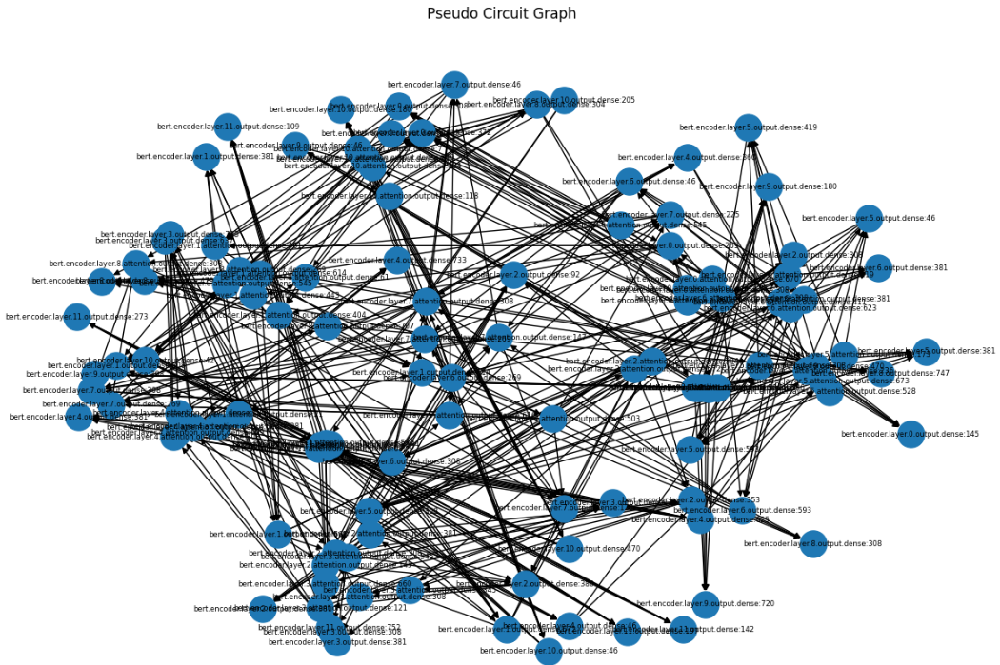
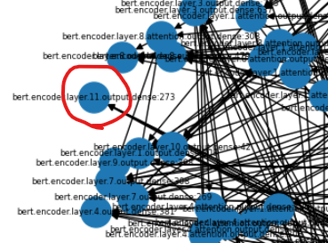
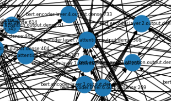

LLMが出してきた解答に対して、なんでやねん、と言われることが相当数あります。
そんなLLMへの説明性を求める声に対する手法として先日 **Circuit Tracing** を説明しました。
本日はCircuit Tracingを簡易的に実現する方法について実験を交えて説明していきます。


Circuit Tracingについての説明記事は以下をご参考下さい。

https://yoshishinnze.hatenablog.com/entry/2026/04/16/043000

## 実験内容
### 目的
重要な情報がどのようにモデルの内部を流れたかを可視化して、ニューラルネットワークの内部動作をある程度理解できる形にする。

### Circuit Tracing の本質的な要素

Circuit Tracing（特に Anthropic 的なアプローチ）は、ざっくり言うと以下をやっています：

1. **アクティベーションの取得**  
   - モデルの各層・各ニューロンの出力（activation）を記録する。

2. **勾配の計算**  
   - 出力（ロジットや特定の特徴量）に対する勾配を計算し、「どの部分が出力に効いているか」を調べる。

3. **重要ニューロンの抽出**  
   - activation × gradient などから、「出力に寄与しているニューロン」を特定する。

4. **層間依存の推定**  
   - どの層のどのニューロンが、次の層のどのニューロンに影響しているかを推定する（線形回帰や相関、あるいは介入による因果推定）。

5. **可視化・解釈**  
   - 得られた依存関係をグラフ（circuit）として可視化し、「モデル内部の情報の流れ」を人間が理解できる形にする。

この流れを実現して、今回モデル内部の情報の流れを明らかにしてみようと思います。

## 実現手段検討
前節で説明した実験を実際に行うための実現法について検討します。

### 1. アクティベーションの取得

- Circuit Tracing：  
  多くの場合、**全ニューロン**や**特定の特徴量**のactivationを記録します。
- このテンプレート：  
  `encoder.layer.*.output.dense` にフックを登録し、**各層のMLP出力**だけを記録しています。  
  → **「層単位のactivation」という最小単位**でCircuit Tracingの「activation記録」を再現していきます。

### 2. 勾配の計算

- Circuit Tracing：  
  出力ロジットや特定のfeatureに対する勾配を計算し、**どの部分がその出力に寄与しているか**を調べます。
- このテンプレート：  
  `loss = logits[0, target_class]` として最大ロジットを「損失」とみなし、`loss.backward()` で勾配を計算。  
  → **「出力クラスに対する勾配」という最小構成**でCircuit Tracingの「gradient-based attribution」を再現できるはずです。

### 3. 重要ニューロンの抽出

- Circuit Tracing：  
  activation × gradient や、より洗練された手法（integrated gradientsなど）で「重要ニューロン」を抽出します。
- このテンプレート：  
  `(act * grad).abs().mean(dim=1)` で、**簡易的な重要度スコア**を計算し、上位k個を「重要ニューロン」とみなします。  
  → **「gradient × activation」というシンプルな重要度指標**でCircuit Tracingの「重要ニューロン抽出」を再現し重要情報をピックアップできるはずです。

### 4. 層間依存の推定
ここが一番やり方に困りました。
相関性があれば、回帰予測につなげて評価できるのではということで以下を案出します。

- Circuit Tracing：  
  線形回帰、相関、あるいは介入（ablation）を用いて、**どのニューロンがどのニューロンに影響しているか**を推定します。
- このテンプレート：  
  隣接する2層の重要ニューロン間で線形回帰を行い、係数の絶対値が大きいものを「依存関係あり」とみなします。  
  → **「線形回帰による簡易的な依存推定」**でCircuit Tracingの「層間circuit推定」を再現してみます。

### 5. 可視化・解釈
ここまでとってきた情報を可視化してみます。

- Circuit Tracing：  
  得られた依存関係をグラフ（circuit）として描画し、人間が読める形にします。
- このテンプレート：  
  NetworkXで `(層:ニューロン) → (層:ニューロン)` のエッジを描画。  
  → **「ニューロン単位の有向グラフ」という最小構成**でCircuit Tracingの「circuit可視化」を再現。

### この実験で出来ること

Circuit Tracing の本質は、

> **「モデル内部のどの部分が、どのように出力に寄与しているか」を、人間が理解できる形で取り出すこと**

です。

上記によりエッセンスを実現できるはずです。：

- **activation**（各層の出力）
- **gradient**（出力に対する感度）
- **重要度スコア**（activation × gradient）
- **層間依存**（線形回帰）
- **可視化**（NetworkXグラフ）

これらを組み合わせるだけで、「BERTのどのニューロンが出力に効いているか」「どの層からどの層に影響が流れているか」を**ざっくり見る**ことができます。


## 実験
例の如くGoogle Colabを起動していきます。
また、今回はリソースが限られていることからBertで実験を行います。

### 1. セットアップ（Colab 1セル目）

```python
!pip install transformers torch networkx scikit-learn matplotlib
```

- `transformers`: BERTモデルとトークナイザ
- `torch`: PyTorch本体
- `networkx`: グラフ可視化
- `scikit-learn`: 線形回帰（層間依存の推定）
- `matplotlib`: グラフ描画

Colabで1セル実行すれば、必要なライブラリが入ります。

### 2. モデル + 入力

```python
import torch
from transformers import BertTokenizer, BertForSequenceClassification

device = "cuda" if torch.cuda.is_available() else "cpu"

model_name = "bert-base-uncased"
tokenizer = BertTokenizer.from_pretrained(model_name)
model = BertForSequenceClassification.from_pretrained(model_name).to(device)
model.eval()

text = "The movie was surprisingly good and very enjoyable."
inputs = tokenizer(text, return_tensors="pt").to(device)
```

- `bert-base-uncased` の分類モデルをロードし、GPUに載せます。
- `model.eval()` で推論モードにします（Dropoutなどが無効になる）。
- サンプル文をトークナイズして `inputs` を作成します。

### 3. activation取得（forward hook）

```python
activations = {}

def get_hook(name):
    def hook(module, inp, out):
        activations[name] = out.detach()
    return hook

for name, module in model.named_modules():
    if "encoder.layer" in name and "output.dense" in name:
        module.register_forward_hook(get_hook(name))
```

- `model.named_modules()` で全モジュールを走査し、`encoder.layer.*.output.dense` にフックを登録します。
- フックでは、`out`（その層の出力）を `detach()` して `activations[name]` に保存します。
- `detach()` しているのは、**勾配を追跡しないコピー**として保存するためです（後で勾配を別途計算する）。

### 4. forward + 勾配取得

```python
inputs["input_ids"].requires_grad = True

outputs = model(**inputs)
logits = outputs.logits

target_class = logits.argmax(dim=-1)

loss = logits[0, target_class]
loss.backward()
```

- `inputs["input_ids"].requires_grad = True` で入力トークンIDに勾配を追跡させます。
- `model(**inputs)` でフォワード計算を行い、`logits` を取得します。
- `target_class = logits.argmax(dim=-1)` で最大ロジットのクラスを取得します。
- `loss = logits[0, target_class]` でそのクラスのロジットを「損失」として扱い、`loss.backward()` で勾配を計算します。

ここで、`inputs["input_ids"]` から `logits` までの計算グラフに対して勾配が伝わります。

### 5. 勾配 × activation（重要度スコア）

```python
importance = {}

for name, act in activations.items():
    if act.requires_grad:
        grad = act.grad
    else:
        continue
    
    score = (act * grad).abs().mean(dim=1).squeeze()  # token平均
    importance[name] = score.cpu().numpy()
```

- `activations` に保存した各層の出力 `act` について、`act.requires_grad` が `True` のものだけを対象にします。
- `act.grad` で、その層の出力に対する勾配を取得します。
- `(act * grad).abs().mean(dim=1)` で、**アクティベーション × 勾配**の絶対値を取り、トークン次元で平均します。
  - これは「そのニューロンが出力ロジットにどれだけ寄与したか」の**簡易的な重要度スコア**です。
- `importance[name]` に各層の重要度スコア（ニューロンごとのベクトル）を保存します。

### 6. 上位ニューロン抽出

```python
top_neurons = {}

k = 5  # 各層から上位k個

for name, score in importance.items():
    idx = score.argsort()[-k:][::-1]
    top_neurons[name] = idx
```

- 各層の重要度スコア `score` に対して `argsort()[-k:][::-1]` で、**上位k個のニューロンインデックス**を取得します。
- `top_neurons[name]` に、その層の「重要ニューロン」のインデックスリストを保存します。

これで、「各層でどのニューロンが出力に効いているか」が分かります。

### 7. 層間依存（簡易：線形回帰）

```python
from sklearn.linear_model import LinearRegression

edges = []

layer_names = list(top_neurons.keys())

for i in range(len(layer_names) - 1):
    l1 = layer_names[i]
    l2 = layer_names[i+1]
    
    act1 = activations[l1][0].detach().cpu().numpy()
    act2 = activations[l2][0].detach().cpu().numpy()
    
    for n2 in top_neurons[l2]:
        y = act2[:, n2]
        
        for n1 in top_neurons[l1]:
            x = act1[:, n1].reshape(-1, 1)
            
            reg = LinearRegression().fit(x, y)
            score = abs(reg.coef_[0])
            
            if score > 0.1:
                edges.append((f"{l1}:{n1}", f"{l2}:{n2}", score))
```

- `layer_names` は `top_neurons` のキー（層名）のリストです。
- 隣接する2層 `l1` と `l2` について：
  - `act1`：層 `l1` のアクティベーション（バッチ次元0番目）
  - `act2`：層 `l2` のアクティベーション
- `l2` の重要ニューロン `n2` のアクティベーション `y` を目的変数とし、
  `l1` の重要ニューロン `n1` のアクティベーション `x` を説明変数として**線形回帰**を実行します。
- `reg.coef_[0]` の絶対値が大きいほど、「`n1` が `n2` に強く影響している」とみなします。
- しきい値（例：0.1）を超えるものだけをエッジとして `edges` に追加します。

これで、「どの層のどのニューロンが、次の層のどのニューロンに強く影響しているか」という**疑似circuit**が得られます。

### 8. グラフ化（Circuit可視化）

```python
import networkx as nx
import matplotlib.pyplot as plt

G = nx.DiGraph()

for src, dst, w in edges:
    G.add_edge(src, dst, weight=w)

plt.figure(figsize=(12, 8))
pos = nx.spring_layout(G, k=0.5)

nx.draw(G, pos, with_labels=True, node_size=500, font_size=6)
plt.title("Pseudo Circuit Graph")
plt.show()
```

- `edges` の各タプル `(src, dst, w)` を有向グラフ `G` に追加します。
- `nx.spring_layout` でノード配置を計算し、`nx.draw` で描画します。
- ノードラベルは `層名:ニューロン番号` です。

これで、「BERT内部のどのニューロンがどのニューロンに繋がっているか」を**視覚的に確認**できます。

### 9. 実験結果

実行すると以下が得られます。



__見方__

- キー：層名（例：bert.encoder.layer.0.output.dense）
- 値：その層の各ニューロンに対する重要度スコアの配列

スコアは (act * grad).abs().mean(dim=1) で計算されたもの
大きいほど、「そのニューロンのactivationが出力ロジットに強く寄与した」ことを意味します

>例：importance["bert.encoder.layer.0.output.dense"][100] = 0.2
>→ 「layer 0 の MLP出力の100番ニューロンは、出力ロジットに対してかなり効いている」

実際に結果を見るときは
- 層ごとの塊を見る

同じ層のニューロンが近くに配置されるので、「どの層に重要ニューロンが集中しているか」が分かります。
- エッジの向きを見る

基本的に「低層 → 高層」の方向にエッジが伸びます（layer.i → layer.i+1）。
- ハブノードを探す

多くのエッジが集まるノードは、「情報の集約点」や「中継点」になっている可能性があります。


今回グラフはNetworkXの spring_layout を使ってノードを配置しています。
spring_layout は、エッジで繋がっているノード同士を近くに配置し、繋がっていないノードを遠くに配置するレイアウトアルゴリズムです。
- エッジが多いノード：他のノードと多くの接続があるため、 グラフの中心付近に配置されやすい。
- エッジが少ないノード：接続が少ないため、 グラフの外側に配置されやすい。

つまり、「内側＝多くのノードと繋がっているハブ」「外側＝接続が少ない末端」 という解釈が基本になります。

__外側にあるノード（末端に近いノード）__

エッジ数が少ない（＝他のノードとあまり繋がっていない）
このテンプレートでは、「その層で重要だが、次の層への影響が限定的」なニューロンや、「最後の層に近いニューロン」 が外側に来やすいです。
例：最終層に近い層のニューロンで、出力ロジットに直接効いているが、次の層への依存関係が少ない場合。

例えばこんなノードは出力に直接影響したものです。


__内側にあるノード（ハブ的なノード）__

エッジ数が多い（＝多くのノードと繋がっている）
このテンプレートでは、「複数の層・複数のニューロンに影響を与えている中継点」 のようなニューロンが内側に来やすいです。
例：ある層のニューロンが、次の層の複数の重要ニューロンに強く影響している場合。

この辺りは情報のハブになったレイヤです。5～8層あたりが多そうです。



### 分かること

- **「どのニューロンが重要か」**  
  - 勾配 × アクティベーションで、出力ロジットに寄与するニューロンを特定。
- **「どの層→どの層に影響が流れているか（相関ベース）」**  
  - 線形回帰で、隣接層間のニューロン同士の関係を推定。

### 論文で説明されているCircuit Tracingとの差異

- **feature分解（PCA/SAEなし）**  
  - ニューロン単位で見ているだけで、**意味のある特徴（feature）**には分解していません。
- **真の因果（介入不足）**  
  - 線形回帰は相関ベースであり、**介入（ablation）**による因果検証は行っていません。
- **attention経路の統合なし**  
  - Attention head の寄与や、Attention経路のcircuit化は行っていません。


## まとめ

今回実験はニューラルネットワークの説明性をどう追うかという課題に対して、内部の情報の流れに注目したCircuit Tracingを実験しました。
現実、AI機能を開発しているときでもビジネスサイドの利用者さんからは、ニューラルネットワークが出してきた結果に対して、"そのまま信じない"、"なんでそうなったかの理由の方がしりたい"と言われることが多く、AIの説明性は非常に大きな課題です。
今回の手法を、もう少し解釈性を高めることで利用者にAIが行った判断の理由を提示できるようになります。
