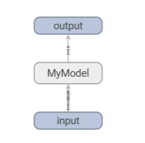

**TensorFlow**は、Googleが開発した**オープンソースの「機械学習・ディープニューラルネットワーク」向けのライブラリ**です。

一言でいうと、 **「高度な数学的計算（行列演算など）を、効率的にGPUやCPUで行うための土台」** です。AI開発における「OS」や「エンジン」のような役割を果たしており、現在はPyTorchと並んで世界で最も普及しているツールの1つです。


## TensorFlowの主な特徴
TensorFlowは、 **「AIを作って、それを実際に世界中のユーザーが使うサービスとして動かす」** というフェーズにおいて、非常に強力なパワーを発揮するツールです。

Google検索、YouTubeのレコメンド、Google翻訳など、私たちの身近にある巨大なシステムの裏側でもこの技術が使われています。

### ① 大規模な商用・産業向けに強い

TensorFlowは「研究」よりも「商用利用（プロダクトへの組み込み）」に非常に強い設計になっています。

* **TensorFlow Serving**: 学習させたモデルを、サーバー上で高速に配信（推論）する仕組みが整っています。
* **TensorFlow Lite**: iPhoneやAndroid、IoT機器などのデバイス上でモデルを動かすための軽量化ツールが豊富です。

### ② 柔軟な実行環境

PCのCPU/GPUだけでなく、Google独自のAIチップである **TPU (Tensor Processing Unit)** に最適化されています。超大規模なモデルの学習を非常に高速に行うことができます。

### ③ エコシステムの充実

前述した「TensorBoard」による可視化や、データの前処理を効率化する「tf.data」など、AI開発の最初から最後までをカバーする周辺ツールが揃っています。


## 「Tensor（テンソル）」とは何か？

名前の由来でもある「Tensor」は、**多次元の配列（データの塊）**のことです。

* **0次元**: スカラー（ただの数字）
* **1次元**: ベクトル（列）
* **2次元**: 行列（表）
* **3次元以上**: テンソル（立体的なデータの塊）

AIは、この「テンソル」がネットワークの中を「Flow（流れる）」ことで、学習や予測を行います。これがTensorFlowという名前の由来です。


### Keras（ケラス）との関係

現在のTensorFlow（バージョン2.0以降）を語る上で欠かせないのが **Keras** です。

* **TensorFlow**: 高機能だが、コードが複雑になりがち。
* **Keras**: 人間にとって分かりやすい、直感的な命令でモデルが書ける。

現在はKerasがTensorFlowの公式なインターフェースとして統合されており、**「裏側で複雑な計算をTensorFlowが担当し、表側で人間がKerasを使って簡単に命令する」**というスタイルが標準です。


### 4. PyTorchとの違い（よくある比較）

| 特徴 | TensorFlow | PyTorch |
| --- | --- | --- |
| **開発元** | Google | Meta (Facebook) |
| **主な用途** | 大規模サービス、スマホ、産業 | 研究、論文、最新AIの開発 |
| **書き心地** | 以前は難解だったが、今はKerasで簡単 | 直感的で、Pythonの普通のコードに近い |
| **デバッグ** | 以前は難しかったが改善された | 非常にやりやすい |


## Tensorflowで見ることが出来るもの

TensorBoardで確認できる主な機能と、それによって何がわかるのかを整理して解説します。

TensorBoardは複数の「タブ」に分かれており、記録したデータの種類に応じて最適な形式で表示されます。


### 1. Scalars（スカラー：折れ線グラフ）

最も頻繁に使う機能です。損失（Loss）や精度（Accuracy）など、1つの数値を時系列で追いかけます。

* **できること**: 学習曲線を確認し、収束しているか、過学習が始まっていないかを判断します。
* **活用例**: 複数の実験を重ねて表示し、どの学習率（Learning Rate）が最も早く収束するかを比較します。

### 2. Histograms & Distributions（ヒストグラムと分布）

重み（Weights）、バイアス、勾配（Gradients）などのテンソルの値が、どのように分布しているかを表示します。

* **できること**: 重みが異常に大きくなっていないか（勾配爆発）、または全く動いていないか（勾配消失）を確認します。
* **活用例**: 特定の層のニューロンが「死んでいないか（常に0付近にいないか）」を確認し、モデルの構造や初期化方法をデバッグします。

### 3. Graphs（計算グラフ）

モデルのネットワーク構造を視覚化します。

* **できること**: 層が正しく接続されているか、データの形状（Shape）が意図通り変化しているかを確認します。
* **活用例**: 複雑な分岐や残差接続（Skip Connection）を持つモデルで、設計通りの計算順序になっているかをチェックします。

```python
import torch
import torch.nn as nn
from torch.utils.tensorboard import SummaryWriter

# 1. シンプルな残差接続（Skip Connection）を持つモデルの定義
class MyModel(nn.Module):
    def __init__(self):
        super(MyModel, self).__init__()
        self.conv1 = nn.Conv2d(1, 10, kernel_size=5)
        self.conv2 = nn.Conv2d(10, 20, kernel_size=5)
        self.fc1 = nn.Linear(320, 50)
        self.fc2 = nn.Linear(50, 10)

    def forward(self, x):
        # 途中で分岐や加算がある複雑な構造を想定
        identity = x 
        x = torch.relu(nn.functional.max_pool2d(self.conv1(x), 2))
        x = torch.relu(nn.functional.max_pool2d(self.conv2(x), 2))
        x = x.view(-1, 320)
        x = torch.relu(self.fc1(x))
        x = self.fc2(x)
        return x

# 2. TensorBoardの設定
writer = SummaryWriter('runs/graph_visualization')

# 3. モデルのインスタンス化
model = MyModel()

# 4. ダミーデータの作成（形状を確認するために必要）
# 例: [バッチサイズ, チャンネル数, 縦, 横]
dummy_input = torch.randn(1, 1, 28, 28)

# 5. グラフを記録
writer.add_graph(model, dummy_input)
writer.close()

```



### 4. Images, Audio, Text（メディアデータ）

学習中に入力したデータや、モデルが生成したデータを確認します。

* **できること**: 画像生成AIなどで、エポックごとに生成される画像が少しずつ鮮明になっていく様子をリアルタイムで監視します。
* **活用例**: セマンティックセグメンテーションなどで、正解（GT）と予測結果を並べて視覚的に比較します。

### 5. Projector（プロジェクター：次元圧縮）

高次元のデータ（埋め込みベクトル：Embedding）を3Dや2Dの空間に投影して表示します。

* **できること**: PCAやt-SNEなどの手法を用いて、単語や画像の特徴量が「意味的に近いもの同士で固まっているか」を確認します。
* **活用例**: NLPモデルで、似た意味の単語が近くに配置されているかを視覚的に検証します。

### 6. PR Curves（PR曲線）

精度（Precision）と再現率（Recall）のトレードオフを視覚化します。

* **できること**: 単純な精度（Accuracy）だけではわからない、不均衡データに対するモデルの性能を詳細に分析します。

### 7. HParams（ハイパーパラメータ・ダッシュボード）

学習率、バッチサイズ、ドロップアウト率などの設定と、最終的な精度との相関関係を一気に見渡します。

* **できること**: どのパラメータの組み合わせが最も高い性能を出したかを、並行座標図などで分析します。

### 8. Profile（プロファイラー）

GPUやメモリの利用効率を詳細に分析します。

* **できること**: 「データの読み込み（DataLoader）」がボトルネックでGPUが遊んでいないか、どの演算に時間がかかっているかを特定します。


### まとめ：何が見たいときに使うか

| 見たいもの | 使う機能名 |
| --- | --- |
| 学習の進み具合・過学習 | **Scalars** |
| モデルのネットワーク図 | **Graphs** |
| 重みの異常や学習の停滞 | **Histograms / Distributions** |
| 実際に出力された画像や音声 | **Images / Audio** |
| 単語や画像の特徴の固まり | **Projector** |
| 計算の遅い場所（ボトルネック） | **Profile** |


