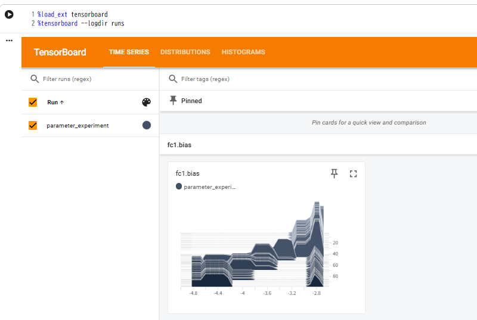
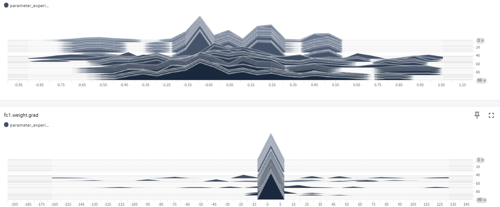

ニューラルネットワークを構築して学習した際に、学習がうまくいっているかを確認したいということがあります。

そんな際にニューラルネットワークのパラメータの分布を確認することが有効な場合があります。

今回は、ニューラルネットワークのパラメータの分布確認にまつわる話をします。


## パラメータの分布を確認するべきタイミング
ニューラルネットワークのパラメータ（重みやバイアス）を確認すべきタイミングは、主に **「開発の初期」「学習中の異常検知」「モデルの信頼性検証」** の3つのフェーズに分けられます。

具体的な場面とその目的を整理しました。


### 1. 学習がうまくいかない時（デバッグ）

これが最も頻繁にパラメータを確認すべきタイミングです。

* **損失（Loss）が減らない、または不安定:** 特定のレイヤーで「勾配消失（重みが0に張り付く）」や「勾配爆発（重みが巨大化する）」が起きていないかを確認します。
* **精度が頭打ち（アンダーフィッティング）:** パラメータが全く更新されていない「死んだニューロン」が存在しないかを確認し、学習率や初期化手法を見直す判断材料にします。

### 2. 学習中の「健康診断」

モデルが健全に成長しているかを定期的にチェックします。

* **過学習（オーバーフィッティング）の予兆:** 特定の重みだけが異常に大きくなっている場合、そのモデルは一部の特徴に依存しすぎて汎用性を失いつつあるサインです。
* **初期化の確認:** 学習開始直後の1エポック目で、重みの分布が偏りすぎていないかを確認します。ここでの不備は、後の長い学習時間を無駄にする可能性があります。

### 3. モデルを「説明」する必要がある時

実務でAIを導入する際、「なぜこの結果になったのか」を問われる場面です。

* **判断根拠の特定:** どのパラメータが特定の入力（例：画像内の特定のピクセル）に強く反応しているかを調べることで、AIの「注目点」を説明できます。
* **専門ドメインでの検証:** 医療や工業検査など、失敗が許されない分野では、モデルが「ノイズ」ではなく「正しい特徴」に基づいて学習しているかを確認するためにパラメータを解析します。

## パラメータ解析の手順
ニューラルネットワークのパラメータ解析は、**「統計的な全体像の把握」**　から始め、必要に応じて **「特定の入力に対する反応（局所的な解析）」** へと深掘りしていくのが定石です。

具体的な手段を、3つのステップで解説します。

### 1. 統計的解析（マクロな視点）

モデル全体の「健康状態」を診断するステップです。個々の数値ではなく、数百万〜数億あるパラメータの **分布（ヒストグラム）** を見ます。

* **手段:** **TensorBoard** や **Weights & Biases (W&B)** を使用。
* **解析内容:** * **重みの分布:** 重みが正規分布に近い形をしているか。
* **勾配の大きさ:** 学習が進むにつれて勾配が極端に小さく（消失）なったり、大きく（爆発）なったりしていないか。


* **目的:** 学習率が適切か、初期化手法が正しいかを判断します。


### 2. 重みの可視化（構造的な視点）

パラメータが「具体的に何を表現しているか」を視覚的に理解するステップです。

* **手段:** * **第一層の可視化:** 入力に近い層の重みを画像としてプロットします（CNNなら2Dフィルタとして）。
* **低次元投影:** 重みが高次元すぎるため、**t-SNE** や **UMAP** を使って2次元・3次元に圧縮して可視化します。


* **解析内容:** 「似た意味を持つパラメータがクラスター（塊）を作っているか」を確認します。
* **目的:** モデルが画像の「エッジ」や「色」、言葉の「意味的近さ」を正しく捉えているかを確認します。


### 3. メカニスティック・インタープリタビリティ（ミクロな視点）

特定の判断に対して、どのパラメータがどう動いたかを精密に調査する最新の手法です。

* **手段:** **TransformerLens** や **Captum** などのライブラリを使用。
* **手法の例:**
* **Integrated Gradients:** 出力結果に対して、どの入力要素が最も寄与したかを逆伝播を使って計算します。
* **Ablation (切除):** 特定のニューロンをわざと「ゼロ」にして推論させ、精度がどう落ちるかを見ます。


* **目的:** AIの「判断の根拠」を人間が納得できる形で説明（XAI）します。


## 実験

今回はTensor Boardというライブラリを使って、ニューラルネットワークのパラメータの分布を追って、学習が進んでいるかの確認をしてみようと思います。

### 実験でしていること

先ほど提供したコードは、 **「真っさらな状態のパラメータが、学習データに適応して『知識』を獲得していく過程」** をTensorBoardで観察するためのものです。

具体的に何が起きているのか、3つのポイントで解説します。


### 1. 「不自然な初期化」による開始状態の設定

通常、ニューラルネットワークの重みはランダムな小さな値（例：-0.1〜0.1など）でバラバラに初期化されます。しかし、このコードではあえて極端なことをしています。

```python
nn.init.constant_(self.fc1.weight, 1.0) 

```

* **何をしているか**: 100個あるすべての重みを、全く同じ「1.0」という値に固定しました。
* **TensorBoardでの見え方**: グラフ（ヒストグラム）の開始時点では、多様性がゼロなので、**1.0の地点に1本の細くて高い棒**の分布しかありません。

### 2. 学習による「個性の獲得」（分布の拡散）

モデルに `y = sum(x)` という計算（入力された10個の数字を全部足す）を覚えさせようとします。

* **何が起きるか**: 1.0で揃っていた重みたちが、誤差を減らすために「私は0.8になったほうがいい」「僕は1.2になるべきだ」と、それぞれ異なる値へ更新され始めます。
* **TensorBoardでの見え方**: 時間の経過（Epoch）とともに、1本の棒だった分布が左右に広がり、 **正規分布に近い形** に変化していきます。

### 3. パラメータの「健康診断」としての記録

ループの中で、毎ステップごとに重みの状態をTensorBoardを通じて記録を取ります。

```python
for name, param in model.named_parameters():
    writer.add_histogram(name, param, epoch) # 重みの分布
    if param.grad is not None:
        writer.add_histogram(f"{name}.grad", param.grad, epoch) # 勾配の分布
```

* **重みのヒストグラム**: モデルがどの程度の「値の範囲」を使って知識を表現しているかが見えます。
* **勾配（grad）のヒストグラム**: パラメータがどのくらいの「勢い」で変化しているかが見えます。もし勾配の分布がすべて0に張り付いていたら、それは「モデルが学習を放棄した（勾配消失）」ことを意味します。


### この実験で学べること

このコードを動かすと、 **「AIの学習とは、画一的だったパラメータが、データという外部刺激を受けて、適切にバラけていくプロセスである」** ということが視覚的に理解できます。

もし分布が全く動かなければ「学習率が小さすぎる」、分布が無限に右側に広がっていけば「学習率が大きすぎて暴走している」という判断ができるようになります。

### 実験の手順

1. ネットワークの構築・学習

google colab上で以下のコードを実行してください。
コードによりモデル構築、学習が行われます。

また、モデルのネットワークパラメータは先ほど説明した極端な状態から開始します。

```python
import torch
import torch.nn as nn
import torch.optim as optim
from torch.utils.tensorboard import SummaryWriter
import numpy as np

# 1. ログの保存先を指定
writer = SummaryWriter('runs/parameter_experiment')

# 2. シンプルなモデルを定義
class SimpleNet(nn.Module):
    def __init__(self):
        super(SimpleNet, self).__init__()
        self.fc1 = nn.Linear(10, 100)
        self.fc2 = nn.Linear(100, 1)
        
        # 【実験ポイント】あえて重みを大きな値で初期化してみる
        # これにより、学習が進むにつれて分布が「縮小」していく様子が見えます
        nn.init.constant_(self.fc1.weight, 1.0) 
        nn.init.constant_(self.fc2.weight, 1.0)

    def forward(self, x):
        x = torch.relu(self.fc1(x))
        return self.fc2(x)

model = SimpleNet()
optimizer = optim.SGD(model.parameters(), lr=0.01)
criterion = nn.MSELoss()

# 3. ダミーデータでの学習ループ
for epoch in range(100):
    # ダミーの入力と正解（y = sum(x) のような単純なタスク）
    inputs = torch.randn(64, 10)
    targets = torch.sum(inputs, dim=1, keepdim=True)

    optimizer.zero_grad()
    outputs = model(inputs)
    loss = criterion(outputs, targets)
    loss.backward()
    optimizer.step()

    # --- パラメータをTensorBoardに記録 ---
    for name, param in model.named_parameters():
        # ヒストグラムを記録（これがTensorBoardで見れる！）
        writer.add_histogram(name, param, epoch)
        # 勾配の分布も記録（消失/爆発のチェックに便利）
        if param.grad is not None:
            writer.add_histogram(f"{name}.grad", param.grad, epoch)

    if epoch % 10 == 0:
        print(f"Epoch {epoch}, Loss: {loss.item():.4f}")

writer.close()
print("学習完了。TensorBoardを起動して確認してください。")
```

2. TensorBoardの起動

```bash
%load_ext tensorboard
%tensorboard --logdir runs
```

3. 結果の確認

ここまで実行すると以下のような画面が表示されます。



タブ"TimeSeriese"を選択してください。

以下のようなヒストグラムが表示されます。

奥行から手前に対して、学習初期→学習最後までのパラメータの分布を示しています。

以下の絵ではfc1のレイヤのパラメータが手前に行くにつれてなだらかになっていく様子が確認出来ます。

学習と同時に、推論により良い状態は、なだらかな状態だというように推移してきたことになります。

因みに、先程の結果は、以下に挙げる異常のサイン①～③までには該当せず、学習データに対して、目立った異常はなかったとみてよさそうです。



### 学習がうまく進まなかった場合のサイン

ヒストグラムから分かる「3つの異常サイン」
パラメータの解析において、特に注意して見るべき形状が以下の3つです。

__① 勾配消失（Vanishing Gradient）__

見た目: 山がどんどん尖っていき、最終的に「0」の地点で細い1本の棒のようになる。

意味: 重みが更新されず、モデルが何も学んでいない状態です。

__② 勾配爆発（Exploding Gradient）__

見た目: 山がどんどん横に広がっていき、グラフの端（最大値/最小値）へ突き抜けていく。

意味: 数値が大きくなりすぎて計算が破綻しています。学習率を即座に下げる必要があります。

__③ 飽和（Saturation）__

見た目: 山が「-1.0」と「1.0」の2箇所に分かれて固まってしまう（双峰型）。

意味: SigmoidやTanhなどの活性化関数を使っている場合、値が端に張り付いて学習が止まっている可能性があります。

ということで分布により今回のデータによる学習におかしな点がなかったかというこを確認できるようになります。


## 所感
ニューラルネットワークは内部の処理が非常にわかりづらく、ブラックボックスと言われます。

ですが、使う側からすると、よくわからないが使っているということは不安です。

ですので、作ったニューラルネットワークがうまくいっていそうか、何か変な点がないかを確認したいと思います。

その変な点がないかを確認する方法の一つが今回説明したニューラルネットワークのパラメータの分布を解析するということになります。

是非ご活用下さい。

