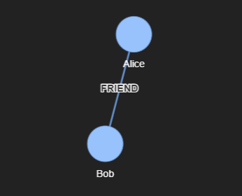
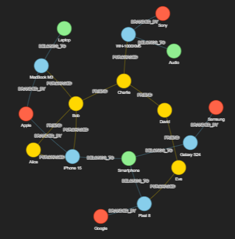

Graph DB（グラフデータベース）は、データとその **「関係性」** に焦点を当てたデータベースです。

一般的なリレーショナルデータベース（RDB）がデータを「表（テーブル）」で管理するのに対し、グラフDBはデータ同士を網（ネットワーク）のような構造で管理します。


## 1. 基本的な構成要素

グラフDBは、主に以下の3つの要素で構成されます。

* **ノード (Node)**：
データそのもの（「人」「物」「場所」など）。RDBの「レコード」に相当します。
* **エッジ (Edge / Relationship)**：
ノード間のつながり。これ自体が「友人である」「購入した」といった属性を持ち、方向性（矢印）があるのが一般的です。
* **プロパティ (Property)**：
ノードやエッジに付随する詳細情報（人の名前、購入した日付など）。


## 2. なぜグラフDBが必要なのか？（RDBとの違い）

従来のRDBでもデータの関係性は表現できますが、関係が複雑になると **「JOIN（結合）」** という処理が多発し、動作が非常に重くなります。

* **RDBの場合**：
「Aさんの友人の、そのまた友人が買った商品をリストアップする」といった深い探索をしようとすると、複数のテーブルを何度も結合する必要があり、パフォーマンスが低下します。
* **グラフDBの場合**：
最初から「線（エッジ）」でつながっているため、ポインタを辿るだけで高速に検索できます。関係がどれだけ深くなっても、処理速度が落ちにくいのが特徴です。

## 3. 主な活用シーン

グラフDBは、データ同士が複雑に絡み合う領域で真価を発揮します。

* **SNSのレコメンデーション**：
「友達の友達」や「共通の趣味を持つ人」を瞬時に見つけ出す。
* **不正検知（クレジットカードなど）**：
複数の決済端末、IPアドレス、口座のつながりを分析し、不自然な資金移動のパターンを特定する。
* **ナレッジグラフ**：
Google検索のように、バラバラな情報（人物、著作、場所、歴史的事実）を関連付けて、文脈に応じた回答を導き出す。
* **サプライチェーン管理**：
部品、工場、物流ルートの複雑な依存関係を可視化し、どこかでトラブルが起きた際の影響範囲を特定する。


## 4. 代表的な製品

* **Neo4j**：最も普及しているオープンソースのグラフDB。
* **Amazon Neptune**：AWSが提供するフルマネージドのグラフDBサービス。
* **Memgraph / ArangoDB**：メモリ内処理や他のデータモデルとの併用を得意とするもの。


## テスト

本格的なグラフクエリ言語 Cypher (サイファー) を試したい場合は、以下の手順がおすすめです。

__手順 ：Neo4j Aura（無料クラウド）を使う__

Neo4jには、ログインするだけで使える無料のクラウド版があります。

https://neo4j.com/cloud/aura-free/

1. Auraで無料インスタンスを作成し、Connection URL, username, password を取得。
2. Colabで以下を実行して接続します。

```python
!pip install neo4j pyvis

from neo4j import GraphDatabase

# 接続情報（取得したものに書き換えてください）
uri = "neo4j+s://xxxxxxx.databases.neo4j.io"
user = "neo4j"
password = "your_password"

driver = GraphDatabase.driver(uri, auth=(user, password))

def create_friends(tx, name1, name2):
    # Cypherクエリを使ってデータを追加
    query = (
        "MERGE (a:Person {name: $name1}) "
        "MERGE (b:Person {name: $name2}) "
        "MERGE (a)-[:FRIEND]->(b)"
    )
    tx.run(query, name1=name1, name2=name2)

with driver.session() as session:
    session.execute_write(create_friends, "Alice", "Bob")

print("データの登録が完了しました。")
driver.close()
```

※上記コードのURI、user、passwordはNeo4j Auraでインスタンス（データベース）を新規作成した際、ブラウザから credentials.txt というファイルが自動的にダウンロードされたはずです。

```plaintext
NEO4J_URI=neo4j+s://xxxxxxxx.databases.neo4j.io
NEO4J_USERNAME=neo4j
NEO4J_PASSWORD=your_generated_password
```

実際に登録されたデータを確認してみます。

```python
from neo4j import GraphDatabase
from pyvis.network import Network
import IPython

def get_graph_data(tx):
    # 関係性も含めてデータを取得するクエリ
    query = "MATCH (n)-[r]->(m) RETURN n, r, m LIMIT 50"
    return list(tx.run(query))

# 2. Pyvisネットワークの初期化
net = Network(notebook=True, height="500px", width="100%", bgcolor="#222222", font_color="white", cdn_resources='remote')

with driver.session() as session:
    results = session.execute_read(get_graph_data)
    
    for record in results:
        node_n = record["n"]
        node_m = record["m"]
        rel = record["r"]
        
        # ノードの追加 (IDと表示ラベルを設定)
        # labelにはnameプロパティなど、表示したい属性を指定
        net.add_node(node_n.id, label=node_n.get("name", str(list(node_n.labels))), title=str(dict(node_n)))
        net.add_node(node_m.id, label=node_m.get("name", str(list(node_m.labels))), title=str(dict(node_m)))
        
        # エッジ（矢印）の追加
        net.add_edge(node_n.id, node_m.id, label=rel.type)

# 3. HTMLとして保存して表示
net.show("graph.html")
IPython.display.HTML("graph.html")
```

すると以下の絵が表示されると思います。



__例題__

折角なので少しストーリー立てして、グラフネットワークした例も扱ってみます。
 
グラフDBの真骨頂である **「多層的な関係性（n次隔たり）」** を体感できるよう、ストーリーを「ユーザー・商品・カテゴリー」だけでなく、 **「ブランド・店舗・友人関係」** まで広げた大規模なシミュレーションを作成しましょう。

### 今回のストーリー： 「テックガジェット・エコシステム」

* **登場人物（User）**: Alice, Bob, Charlie, David, Eve
* **商品（Item）**: iPhone 15, MacBook M3, Pixel 8, Galaxy S24, Sony WH-1000XM5
* **ブランド（Brand）**: Apple, Google, Samsung, Sony
* **カテゴリー（Category）**: Smartphone, Laptop, Audio
* **店舗（Store）**: Shinjuku Store, Shibuya Store
* **関係性**:
* 誰が何を買ったか (`PURCHASED`)
* 誰と誰が友達か (`FRIEND`)
* どの商品がどのブランドか (`BRANDED_BY`)
* どの商品がどの店舗にあるか (`STOCKED_IN`)


__1. 大規模データの登録（Cypherクエリ）__

まずは以下のコードをGoogle Colabで実行して、一気にデータを流し込みます。既存のデータを一度消去してから作成する構成にしています。

```python
def create_massive_story(tx):
    # 既存データの全削除
    tx.run("MATCH (n) DETACH DELETE n")
    
    # 1. カテゴリーとブランドの作成
    tx.run("""
    CREATE (c1:Category {name: 'Smartphone'}), (c2:Category {name: 'Laptop'}), (c3:Category {name: 'Audio'}),
           (b1:Brand {name: 'Apple'}), (b2:Brand {name: 'Google'}), (b3:Brand {name: 'Samsung'}), (b4:Brand {name: 'Sony'})
    """)
    
    # 2. 商品の作成と属性接続
    tx.run("""
    MATCH (c1:Category {name: 'Smartphone'}), (c2:Category {name: 'Laptop'}), (c3:Category {name: 'Audio'}),
          (b1:Brand {name: 'Apple'}), (b2:Brand {name: 'Google'}), (b3:Brand {name: 'Samsung'}), (b4:Brand {name: 'Sony'})
    CREATE (i1:Item {name: 'iPhone 15', price: 120000}),
           (i2:Item {name: 'MacBook M3', price: 200000}),
           (i3:Item {name: 'Pixel 8', price: 90000}),
           (i4:Item {name: 'Galaxy S24', price: 110000}),
           (i5:Item {name: 'WH-1000XM5', price: 50000})
    CREATE (i1)-[:BELONGS_TO]->(c1), (i1)-[:BRANDED_BY]->(b1),
           (i2)-[:BELONGS_TO]->(c2), (i2)-[:BRANDED_BY]->(b1),
           (i3)-[:BELONGS_TO]->(c1), (i3)-[:BRANDED_BY]->(b2),
           (i4)-[:BELONGS_TO]->(c1), (i4)-[:BRANDED_BY]->(b3),
           (i5)-[:BELONGS_TO]->(c3), (i5)-[:BRANDED_BY]->(b4)
    """)
    
    # 3. ユーザーと友人関係・購入履歴の作成
    tx.run("""
    CREATE (u1:User {name: 'Alice'}), (u2:User {name: 'Bob'}), (u3:User {name: 'Charlie'}),
           (u4:User {name: 'David'}), (u5:User {name: 'Eve'})
    """)
    
    # 関係の構築
    tx.run("""
    MATCH (u1:User {name: 'Alice'}), (u2:User {name: 'Bob'}), (u3:User {name: 'Charlie'}),
          (u4:User {name: 'David'}), (u5:User {name: 'Eve'}),
          (i1:Item {name: 'iPhone 15'}), (i2:Item {name: 'MacBook M3'}), 
          (i3:Item {name: 'Pixel 8'}), (i5:Item {name: 'WH-1000XM5'})
    CREATE (u1)-[:FRIEND]->(u2), (u2)-[:FRIEND]->(u3), (u3)-[:FRIEND]->(u4), (u4)-[:FRIEND]->(u5),
           (u1)-[:PURCHASED {date: '2026-01-10'}]->(i1),
           (u2)-[:PURCHASED {date: '2026-01-15'}]->(i1),
           (u2)-[:PURCHASED {date: '2026-02-01'}]->(i2),
           (u3)-[:PURCHASED {date: '2026-02-10'}]->(i5),
           (u5)-[:PURCHASED {date: '2026-03-01'}]->(i3)
    """)
    print("大規模なストーリーデータの登録が完了しました。")

with driver.session() as session:
    session.execute_write(create_massive_story)

```

__2. グラフの可視化__

```python
from neo4j import GraphDatabase
from pyvis.network import Network
import IPython

def get_massive_graph(tx):
    # すべてのノードと関係性を取得
    query = "MATCH (n)-[r]->(m) RETURN n, r, m LIMIT 100"
    return list(tx.run(query))

# --- 可視化の設定 ---
# ノードの種類ごとの色定義
colors = {
    "User": "#FFD700",      # ゴールド
    "Item": "#87CEEB",      # スカイブルー
    "Brand": "#FF6347",     # トマト
    "Category": "#90EE90"   # ライトグリーン
}

# Pyvisネットワークの初期化
net = Network(notebook=True, height="600px", width="100%", bgcolor="#222222", font_color="white", cdn_resources='remote')

# 物理シミュレーションの設定（ノードが重ならないように調整）
net.force_atlas_2based()

with driver.session() as session:
    results = session.execute_read(get_massive_graph)
    
    for record in results:
        n, r, m = record["n"], record["r"], record["m"]
        
        # ノードのラベル（種類）を取得
        label_n = list(n.labels)[0]
        label_m = list(m.labels)[0]
        
        # ノードの追加
        net.add_node(n.id, 
                     label=n.get("name", label_n), 
                     title=f"Type: {label_n}\nData: {dict(n)}", 
                     color=colors.get(label_n, "#FFFFFF"))
        
        net.add_node(m.id, 
                     label=m.get("name", label_m), 
                     title=f"Type: {label_m}\nData: {dict(m)}", 
                     color=colors.get(label_m, "#FFFFFF"))
        
        # エッジの追加
        net.add_edge(n.id, m.id, label=r.type)

# --- 表示 ---
net.show("massive_story.html")
IPython.display.HTML("massive_story.html")
```



__3. 「これぞグラフDB」という高度なレコメンド__

このデータを使って、 **「直接の知り合いではないが、友人の友人が持っている特定のブランドの商品」** を探してみましょう。

```python
def deep_recommendation(tx, target_name):
    # クエリ解説：
    # ターゲットの友人(f1)の、さらに友人(f2)が購入した商品を、
    # その商品のブランド情報も含めて取得
    query = """
    MATCH (me:User {name: $name})-[:FRIEND*1..2]-(friend)-[:PURCHASED]->(item)-[:BRANDED_BY]->(brand)
    WHERE NOT (me)-[:PURCHASED]->(item)
    RETURN item.name AS product, brand.name AS brand, friend.name AS owner, count(*) AS score
    ORDER BY score DESC
    """
    result = tx.run(query, name=target_name)
    print(f"--- {target_name} さんへの高度なレコメンド ---")
    for record in result:
        print(f"おすすめ: {record['product']} ({record['brand']})")
        print(f"  理由: 友人の {record['owner']} さんも愛用しています。")

with driver.session() as session:
    session.execute_read(deep_recommendation, "Alice")

```

__3. この構成のメリット__

1. **疎なデータの活用**:
Aliceと直接繋がっていないCharlieやDavidの情報も、`[:FRIEND*1..2]`（1〜2ステップの友人関係）という指定だけで簡単に手繰り寄せられます。RDBでこれをやると、Userテーブル同士を何度もセルフジョインし、さらに購入テーブルとジョインするため、コードが非常に複雑になります。
2. **ビジネスロジックの柔軟性**:
「同じブランドが好き」「同じ店舗によく行く」といった条件を、`MATCH`文のパス（矢印のつなぎ方）を変えるだけで即座に追加・変更できます。
3. **可視化のインパクト**:
前述の `pyvis` コードを再度実行すると、中心にユーザー、その周りに商品やブランドが配置され、誰がどの「派閥（Apple派、Google派など）」に近いのかが視覚的に一発でわかります。

## 総括

これまでの議論を通じて、グラフDBの基礎から、Google Colabでの実践、そして高度なレコメンデーションまで一通り体験していただきました。

これまでの内容を、　**「なぜグラフDBがこれほど強力なのか」**　という視点で総括します。

### 1. グラフDBの本質：「関係」がデータである

従来のデータベース（RDB）では、関係性は「外部キー」という番号の照合（JOIN処理）によって後付けで計算されるものでした。
一方、グラフDBでは、 **「AさんとBさんは友達である」という線（エッジ）そのものが実データとして保存されています。**

* **RDB**: 実行時に「表と表を突き合わせる」ため、関係が深くなるほど重くなる。
* **グラフDB**: 最初から「線」で繋がっているため、ただ辿るだけでよく、データ量が増えても高速。

### 2. 実践した「多層的なモデリング」の意義

今回、最後に行った大規模なストーリー構成では、以下の異なるエンティティを繋げました。

* **ソーシャル（User-User）**: 誰と誰が友達か。
* **トランザクション（User-Item）**: 誰が何を買ったか。
* **ナレッジ（Item-Brand/Category）**: 商品の属性。

これらが一つのネットワークになることで、 **「Aliceの友人の、そのまた友人が買った、Appleブランドのスマホ」** といった、現実世界の複雑な文脈をそのままクエリ（Cypher）で表現できるようになりました。

### 3. ツール・技術スタックの役割分担

今回触れた2つのツールの違いを再確認しましょう。

| ツール | 特徴 | 適した場面 |
| --- | --- | --- |
| **NetworkX** | Pythonライブラリ。メモリ上で計算。 | アルゴリズムの研究、小〜中規模の統計分析。 |
| **Neo4j** | グラフ専用DB。ディスクに永続保存。 | 本番サービスの裏側、数億件規模のデータ管理。 |
| **Pyvis** | 可視化ツール。 | 複雑な関係性を人間が直感的に理解するための図解。 |

### 4. なぜ今、グラフDBが注目されるのか

議論の最後に関連する重要なトピックとして、現代のAI（特にLLM）との親和性が挙げられます。

* **GraphRAG (Retrieval-Augmented Generation)**:
LLMにグラフDBの知識を与える手法です。単なるキーワード検索ではなく、「この人物はこの組織に属しており、このプロジェクトに関与している」という**正確な構造情報**をLLMが参照できるため、ハルシネーション（嘘）を劇的に減らすことができます。

### 5. 次なるステップへの展望

グラフDBの世界はここからさらに広がります。

* **グラフアルゴリズム**: 「PageRank（誰が一番重要か）」や「コミュニティ検出（共通の趣味を持つグループはどこか）」といった高度な計算。
* **時間軸の導入**: 「いつ買ったか」というエッジのプロパティを使い、時間の経過とともに変化するレコメンド。
* **大規模展開**: Google Colabから離れ、自前のサーバーやクラウドで数テラバイトのグラフを運用する技術。


## Graph DB engine


グラフデータベース（Graph DB）の世界では、用途やデータ構造に応じていくつかの主要なエンジン（製品）が存在します。

大きく分けて、「ネイティブグラフ（グラフ専用設計）」と「マルチモデル（既存DBの拡張）」の2つの潮流があります。

### 1. ネイティブグラフデータベース

グラフ構造を保存・検索するためにゼロから設計されたエンジンです。複雑なつながりの探索において最高のパフォーマンスを発揮します。

* **Neo4j:** 世界で最も普及しているグラフDBです。クエリ言語「Cypher」が直感的で、ドキュメントやコミュニティのサポートが非常に充実しています。無料の「Community Edition」や、クラウド版の「AuraDB」の無料枠も用意されています。
* **Memgraph:** インメモリ型のグラフDBで、リアルタイムな分析に特化しています。Neo4jと同じCypher言語が使えるため、移行や併用もしやすいのが特徴です。
* **FalkorDB (旧RedisGraph):** Redisをベースにした超高速なグラフエンジンです。疎行列計算を用いた独自のアルゴリズムにより、低レイテンシな検索を実現しています。

### 2. クラウド・マネージドサービス

インフラ管理を任せられる、クラウドベンダー提供のエンジンです。

* **Amazon Neptune:** AWSが提供するフルマネージドなグラフDBです。プロパティグラフ（Gremlin/openCypher）とRDF（SPARQL）の両方のデータモデルをサポートしており、高い可用性と拡張性を持ちます。
* **Azure Cosmos DB (Gremlin API):** Microsoft AzureのマルチモデルDBの一部として提供されています。世界規模の分散配置が容易で、既存のAzureエコシステムとの親和性が高いです。

### 3. マルチモデル・拡張型データベース

既存の使い慣れたデータベースの上にグラフ機能を追加したものです。

* **Apache Age:** PostgreSQLのエクステンションとして動作します。標準的なSQLとグラフクエリ（Cypher）を1つのクエリ内で混ぜて実行できるため、既存のリレーショナルデータとの統合に非常に強力です。
* **ArcadeDB:** ドキュメント、キーバリュー、グラフの複数のモデルを1つのエンジンでサポートします。マルチモデルでありながら高速な動作を売りとしています。

### 4. グラフ分析専用エンジン

「保存」よりも「巨大なネットワークの解析」に特化したものです。

* **Apache Spark (GraphX):** 分散並列処理フレームワークSparkの上で動作するグラフ計算ライブラリです。ページランクの計算など、データサイエンス分野の重いバッチ処理に向いています。
* **NetworkX (Pythonライブラリ):** データベースではありませんが、Pythonで手軽にグラフ構造を扱い、アルゴリズム（最短経路など）を試す際に非常によく使われます。

## 検索の仕組み

グラフデータベースの検索エンジンが、リレーショナルデータベース（RDB）のような「表」形式の検索と根本的に異なる点は、**「Index-free Adjacency（索引を介さない隣接性）」**という仕組みにあります。

一言で言えば、**「いちいち地図（インデックス）を引いて場所を探すのではなく、道標に従って隣へ直接移動する」**という仕組みです。

---

## 1. ネイティブグラフエンジンの仕組み：ポインタの追跡

Neo4jなどのネイティブグラフDBでは、データは物理的なメモリやディスク上で「つながった状態」で保存されています。

* **ポインタによる直接参照:** 各ノード（点）は、自分につながっているエッジ（線）がどこにあるかという**物理的なメモリアドレス（ポインタ）**を直接持っています。
* **検索の挙動:** あるノードから隣のノードへ行く際、RDBのように「インデックスからIDを探して、別のテーブルを検索する」という手順を踏みません。単にメモリ上のポインタを辿るだけなので、データが100万件あっても1億件あっても、**「隣へ行くスピード」は一定**です。これを「Index-free Adjacency」と呼びます。

---

## 2. 非ネイティブ（拡張型）エンジンの仕組み：計算による結合

Apache AgeやCosmos DB（Gremlin）などは、内部的には既存のストレージ（PostgreSQLや分散KVS）を利用しています。

* **高度なJOINの最適化:** 内部的には「隠れたJOIN」を行っていますが、グラフクエリを効率的に実行するために、あらかじめノード間のつながりを高速に計算できるような特殊なインデックス（Recursive CTEなど）を構築しています。
* **メリット:** データの整合性や既存の資産を活かせる反面、多階層（10ホップ先など）の検索になると、ネイティブ型に比べてパフォーマンスが落ちる傾向にあります。

---

## 3. グラフ検索のアルゴリズム

検索エンジンは、私たちが書く「クエリ（Cypherなど）」を読み取ると、以下のようなアルゴリズムを駆使して答えを探します。

* **パターンマッチング:** 「(A)さんから(B)さんへ、"友人"という線でつながっている構造」をグラフ全体から見つけ出します。
* **幅優先探索 (BFS) / 深さ優先探索 (DFS):** 最短経路を求めるのか、それとも関係を深く掘り下げるのかに応じて、効率的な探索ルートを選択します。
* **プルーニング（枝刈り）:** 条件に合わないルートを早い段階で切り捨て、無駄な探索を省くことで高速化を実現しています。

---

## 4. なぜこれが画期的なのか？

RDBで「5段階先の友人」を探そうとすると、SQL文の中に「JOIN」が5回登場し、データベースは巨大なテーブル同士を何度も照らし合わせる「総当たり」に近い計算が必要になります。

グラフエンジンの仕組みなら、**「1段目から順番に、指を差す方向に移動するだけ」**で済むため、計算量が劇的に抑えられるのです。


