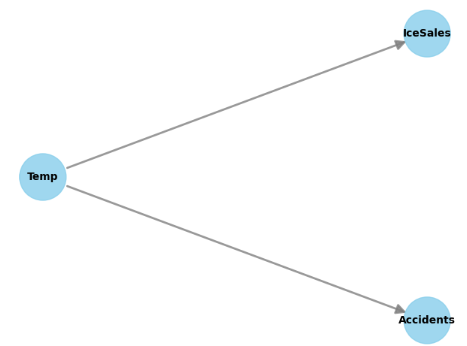

## 仕組み
グラフネットワーク（特に「因果グラフ」や「因果ベイジアンネットワーク」）で因果関係を見つけられる理由は、単なる統計的な「相関」ではなく、データが生成される **「仕組み（メカニズム）」を構造的にモデル化しているから** です。

なぜグラフを使うと「原因」と「結果」を区別できるのか、その主要な原理を3つのポイントで解説します。


### 1. 「向き」を持つ構造（DAG: 有向非巡回グラフ）

従来の相関関係（散布図など）には向きがありません。「アイスの売上」と「水難事故」に相関があっても、どちらが原因かは分かりません。

グラフネットワークでは、関係を **矢印（エッジ）** で表現します。

* **$X \to Y$ :** **$X$** が原因で **$Y$** が変化する。
* **因果の仮定:** グラフが「親（原因）から子（結果）」への一方通行である（ループしない）と定義することで、連鎖的な影響を数学的に追跡できるようになります。


### 2. 条件付き独立性と「d-分離」の理論

これが最も強力な数学的根拠です。グラフの形（構造）を見るだけで、どの変数がどの変数に影響を与えるか、あるいは「無関係（独立）」かを判定できます。

特に、以下の3つの基本パターンを識別することで、偽の相関（擬似相関）を排除します。

* **連鎖型 (**$X \to Z \to Y$**):** **$Z$** を固定（観測）すると、**$X$** と **$Y$** の関係は消える。
* **分岐型 (**$X \leftarrow Z \to Y$**):** 共通の原因 **$Z$** を固定すると、**$X$** と **$Y$** の相関は消える（＝ **$Z$** が錯覚の原因だったと分かる）。
* **合流型 (**$X \to Z \leftarrow Y$**):** 本来無関係な **$X$** と **$Y$** も、共通の結果 **$Z$** を固定すると、逆に相関が現れる（選抜バイアスなど）。

### 3. 「介入（Intervention）」のシミュレーション

ユダ・パール（Judea Pearl）が提唱した **do演算子** という概念が、グラフ上での因果推論を可能にしました。

* **相関 (**$P(Y|X)$**):** 「**$X$** が起きているのを見た時、 **$Y$** はどうなるか？」を計算する。
* **介入 (**$P(Y|do(X))$**):** 「もし**強制的に** **$X$** を変えたら、**$Y$** はどうなるか？」を計算する。

グラフネットワークを使うと、実際の実験（ABテストなど）を行わなくても、過去のデータから「もし介入したらどうなるか」を数学的に予測できます。これを **因果探索（Causal Discovery）** と呼びます。

### 4. アルゴリズムによる「因果の発見」

最近では、データから自動的にグラフの向き（因果）を見つけるアルゴリズムも進化しています。

* **PCアルゴリズム:** 変数間の独立性をチェックして、消去法でグラフの骨格を作る。
* **LiNGAM:** データの「歪み（非ガウス性）」を利用して、卵が先か鶏が先か（**$X \to Y$** か **$Y \to X$** か）を統計的に判定する。

## 数学的表現

因果の梯子の各階層（観察・介入・反実仮想）は、 **「構造的因果モデル（SCM: Structural Causal Model）」** という数学的枠組みで厳密に表現できます。

単なる「点と線」の図から、どのように数学へと昇華されるのかを解説します。

### 1. 構造的因果モデル (SCM) の定義

グラフの矢印 $X \to Y$ は、数学的には以下の **代入文（Assignment）** として定義されます。

$$Y := f_Y(X, U_Y)$$

* **$X$**: 直接の原因（親ノード）。
* **$U_Y$**: 外生変数。モデルの外にあるノード（個体差や測定エラーなど）で、背後にあるノードの多様性を表します。
* **$f_Y$**: 関数（メカニズム）。$X$ と $U$ を受け取って $Y$ を決定する。

**ここが重要:** RDBの等式（$Y = X$）と異なり、**左向きの代入（$X := Y$）は許されません。** これが「因果の向き」の数学的実体です。

### 2. 第2階層：介入を表現する「do演算」

「もし $X$ を強制的に $x$ に変えたら？」という介入は、**$X$ を決定する元の方程式を削除し、定数で置き換える**操作として表現されます。

$$P(Y | do(X=x))$$

数学的には、グラフから $X$ に向かってくる矢印をすべて消し去り、モデルを改変した状態での $Y$ の分布を計算します。これにより、相関 $P(Y|X)$ と介入 $P(Y|do(X))$ の違いが明確になります。

* **観察:** $P(Y|X)$ … 「$X$ がたまたま $x$ であるとき」の統計。
* **介入:** $P(Y|do(X))$ … 「$X$ を無理やり $x$ にしたとき」の分布。

### 3. 第3階層：反実仮想の3ステップ

「もし（実際には $x$ だったが）$x'$ だったら、$Y$ はどうなっていただろうか？」という問い $Y_{X=x'}(u)$ は、以下の3つの数学的プロセスで解かれます。

__Step 1: 帰納 (Abduction)__

実際の観測データ $(x, y)$ を使って、その個体に特有の背景事情 $U$（エラー項）の値を推定します。

* $P(U | X=x, Y=y)$ を求める。

__Step 2: 修正 (Action)__

モデル内の $X$ の方程式を $X := x'$ に置き換えて、モデルを書き換えます（介入の操作）。

__Step 3: 予測 (Prediction)__

修正されたモデルと、Step 1 で求めた $U$ を使って、新しい $Y$ の値を計算します。

### 4. 確率分布の分解（ベイジアンネットワークの積則）

グラフ構造 $G$ があるとき、結合確率分布 $P(x_1, \dots, x_n)$ は、各変数の「親」だけに基づいた条件付き確率の積として分解できます。

$$P(x_1, \dots, x_n) = \prod_{i=1}^n P(x_i | pa_i)$$

ここで $pa_i$ は変数 $x_i$ の親ノードの集合です。この式により、 **「グラフに矢印がない（親ではない）」ことは、条件付き独立として数学的に厳密に定義** されます。

__例題;__ 


因果推論の数学的枠組みであるSCM（構造的因果モデル）とdo演算を直感的に理解するために、Pythonのライブラリ DoWhy を使ったシミュレーションを作成しましょう。

まずはDoWhyをインストールしてください。

```
pip install DoWhy
```

このコードでは、よくある「擬似相関」の例（気温が原因で、アイスの売上と水難事故の両方が増えるケース）を扱います。

1. シミュレーションの準備

「気温」が「アイス」と「事故」の両方に影響を与えるという **メカニズム（方程式）** を直接記述します。

```python
import numpy as np
import pandas as pd
import dowhy
from dowhy import CausalModel

# 1. データの生成 (SCMの実装)
np.random.seed(42)
num_samples = 1000

# 外生変数 (U): 観測できないノイズや個体差
u_temp = np.random.normal(0, 1, num_samples)
u_ice = np.random.normal(0, 1, num_samples)
u_acc = np.random.normal(0, 1, num_samples)

# 構造方程式 (Assignment)
# 気温 (Temp) は外生的な要因で決まる
temp = 20 + 5 * u_temp

# アイスの売上 (Ice) := f(Temp, U)
ice_sales = 2 * temp + 10 * u_ice

# 水難事故 (Accident) := f(Temp, U)
# ※アイスの売上は事故に直接影響を与えていないことに注目！
accidents = 0.5 * temp + 2 * u_acc

df = pd.DataFrame({
    'Temp': temp,
    'IceSales': ice_sales,
    'Accidents': accidents
})
```

2. 数学モデルの構築

次に、変数間の関係をグラフとして定義します。これが数学的な「仮定」になります。

```python
# 2. 因果グラフの定義
# 矢印：Temp -> IceSales, Temp -> Accidents
causal_graph = """
digraph {
    Temp -> IceSales;
    Temp -> Accidents;
}
"""

model = CausalModel(
    data=df,
    treatment='IceSales',   # 原因と仮定したい変数
    outcome='Accidents',    # 結果と仮定したい変数
    graph=causal_graph
)

model.view_model() # グラフの可視化
```

こんなグラフが構築されます。
2つの要因「アイス」と「事故」に直接影響を与えるのは、温度です。




3. 「観察」vs「介入 (do演算)」の計算

① 観察データからの「相関」

単にデータの相関を見ると、「アイスが売れると事故が増える」ように見えてしまいます。

```python
print(f"相関係数 (IceSales vs Accidents): {df['IceSales'].corr(df['Accidents']):.3f}")
```

相関係数は比較的ある、という値になるはずです。

```
相関係数 (IceSales vs Accidents): 0.534
```


② 数学的な「介入 (do演算)」

「もしアイスの売上を強制的に動かしたら（do演算）、事故はどう変わるか？」を計算します。

```python
# 因果効果の特定 (バックドア基準などを用いて、どの変数を調整すべきか数学的に判断)
identified_estimand = model.identify_effect(proceed_when_unidentifiable=True)

# 因果効果の推定 (実際に do演算をシミュレート)
estimate = model.estimate_effect(identified_estimand, method_name="backdoor.linear_regression")

print(f"推定された因果効果 (IceSales -> Accidents): {estimate.value:.3f}")
# 出力例: ほぼ 0 になります。
```

こちらは0.0。

```
推定された因果効果 (IceSales -> Accidents): 0.000
```

このコードを実行すると、以下の事実が数学的に確認されます。

1. 相関 $\neq$ 因果: 

    単なる $P(Accidents | IceSales)$ は高い値を示しますが、これは共通の原因 $Temp$ の影響（バックドアパス）を含んでいるためです。

2. do演算の威力: 

    identify_effect メソッドは、グラフ構造から「$Temp$ を固定（条件付け）すれば、$IceSales$ と $Accidents$ の間の偽の道が塞がる」という数学的法則（バックドア基準）を自動で見つけ出します。メカニズムの特定: 結果として、因果効果が $0$ である（＝アイスを禁止しても事故は減らない）という、現実のメカニズムに即した結論が導き出されます。

3. メカニズムの特定: 

    結果として、因果効果が $0$ である（＝アイスを禁止しても事故は減らない）という、現実のメカニズムに即した結論が導き出されます。

このようにグラフ構造を作ることで、真の因果関係を数学的に介入することで確認することが出来ます。

## 総括

グラフを用いて因果関係を解析する最大のメリットは、「相関関係（単なるデータの動きの一致）」と「因果関係（原因と結果のメカニズム）」を数学的に切り離せることにあります。

具体的に、グラフ（DAG：有向非巡回グラフ）を使うことで得られる実利を4つのポイントで整理します。

- 「介入」の結果を事前にシミュレーションできる

「もし施策 A を実施したら、売上 B はどう変わるか？」という問いに、実際に実験（ABテスト）を行うことなく答えられるようになります。

メリット: 過去の観察データと因果グラフを組み合わせることで、 **do演算（介入操作）** を数学的に実行できます。

実利: 莫大なコストや倫理的リスクが伴う実験（例：増税の影響、新薬の治験など）を、計算機上で安全にシミュレートできます。

- 「反実仮想（たられば）」の検証が可能になる

「あの時、もし別の選択をしていたら結果はどうなっていたか？」という、過去の個別のケースに対する分析ができるようになります。

メリット: グラフ構造を **構造方程式モデル（SCM）** として定義することで、特定の個人や事象における「潜在的な結果」を推定できます。

応用: 「この患者に薬を投与しなかったら、今頃どうなっていたか？」といった個別化医療や、政策の事後評価に威力を発揮します。
